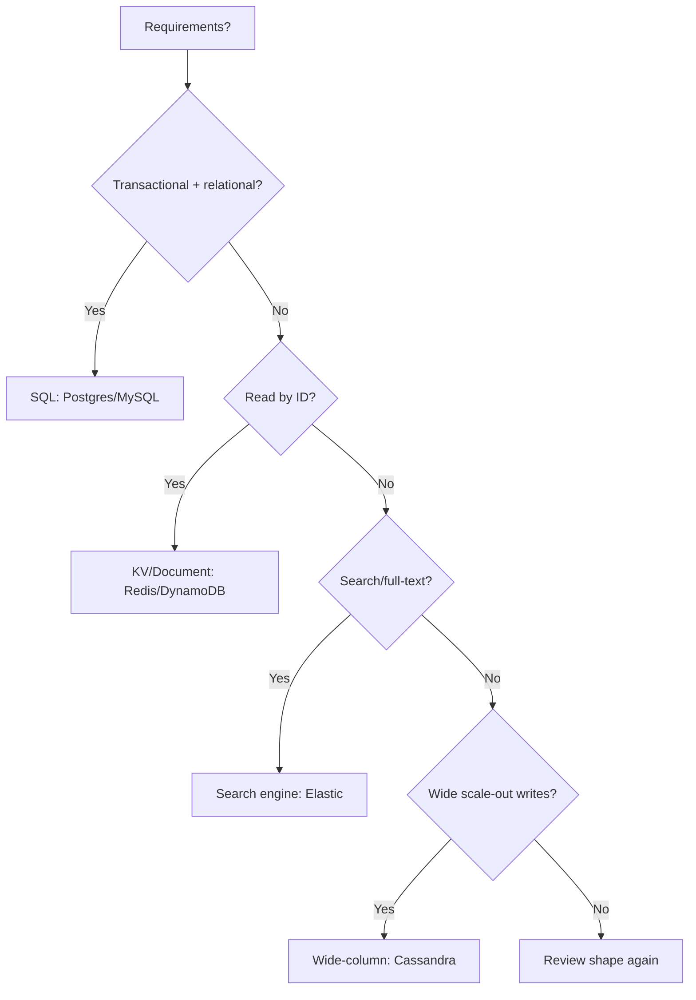

# SQL vs NoSQL

## 1. One-Line Definition
SQL databases store structured rows in tables with strict schemas and ACID guarantees; NoSQL databases favor flexible schemas, horizontal partitioning, and tunable/simpler consistency for specific access patterns.

## 2. Why Do We Need It?
The requirements — data shape, query types, write/read ratio, transaction strictness, and horizontal scale — point to different engines. Forcing a relational model on a flexible document store (or a rigid schema on a graph workload) is a classic HLD failure. You must justify the DB by the workload, not habit.

## 3. Simple Intuition
- **SQL = bank ledger:** rigid columns, every account behaves identically, cross-referenced, auditable, and every transfer is all-or-nothing. Great when structure is fixed and correctness is mandatory.
- **NoSQL = whiteboard plan:** sketchy, schema grows as you think ("user settings: sometimes includes avatar, sometimes preferences"), and you store exactly what you render. Great when shapes vary and you control consistency per query.

## 4. What Happens Without It?
Choosing SQL for a chat app forces rigid migrations for every new field and slow multi-table joins for every message render. Choosing NoSQL for a financial ledger risks weak transactions unless engineered carefully. Both "wrong" choices produce architectural pain and debt.

## 5. Core Idea
**SQL (relational):**
- Tables, rows, columns; foreign keys join related data; ACID transactions; secondary indexes over any column; SQL = rich declarative queries.
- Scaling: vertical first; reads via replicas; writes via sharding (hard), or specialized engines.

**NoSQL (family, not one thing):**
- **Document (MongoDB):** JSON-shaped units, indexable fields, no fixed schema. Great for content/profiles/catalog.
- **Key-Value (Redis, DynamoDB):** O(1) lookups, horizontal by nature. Great for sessions, configs, hot data.
- **Wide-column (Cassandra):** tables but flexible columns, designed for scale-out + high write throughput. Great for events/time-series.
- **Graph (Neo4j):** nodes/edges, traversal queries. Great for social graphs, recommendations.
- **Search (Elasticsearch):** inverted index, full-text, aggregations. Great for search/analytics.

**How to choose (the HLD litmus):**
1. Is the data relational and join-heavy, with transactions? → SQL.
2. Are reads defined by keys/IDs rather than joins? → KV/document.
3. Is the schema volatile or content-shaped (catalog, profiles, chat)? → document/wide-column.
4. Do you need full-text / fuzzy / aggregations? → search engine (alongside a source DB).
5. Is horizontal write scale the hard requirement? → wide-column/document/sharded KV, with careful consistency design.

## 6. Important Terminology

| Term | Simple Meaning |
|------|----------------|
| Schema | Fixed column shapes (SQL) vs flexible (document) |
| Join | Cross-table combination in a query |
| ACID | Transaction guarantees (see transactions-and-acid.md) |
| BASE | Basically Available, Soft state, Eventually consistent |
| Index | Fast-lookup structure (both families have) |
| Partition/shard | Horizontal split by key |
| Idempotency | Effect-safety of retried writes |

## 7. Basic Architecture (Decision Flow)



## 8. Request or Data Flow
**SQL:** query → parser → planner → index/scan → join/filter → transaction scope → row returned. **NoSQL:** key lookup (KV, single hop, shard-aware) → document/row returned; or query on indexed field → shards scanned by design choice.

## 9. Practical Example
**Social app (assumptions):** 
- **Profile/posts:** document store (flexible, reads by key, feed shapes change).
- **Likes/counts:** KV/cache — fast incr, replay-able to DB.
- **Relationship graph (who follows whom):** graph DB or adjacency table in SQL.
- **Search:** index replicas for full-text.
- **Money (payments):** SQL with ACID.
One product, many engines — the HLD answer.

## 10. Scaling
- **SQL:** replicas for reads; partition/shard for writes/storage with care (joins & tx break across shards).
- **NoSQL:** typically scale-out first-class (Cassandra/DynamoDB → add nodes for capacity); document stores partition by shard key; KV is trivial to shard.
- Mixed engines: keep the **source of truth** single-engine where possible; derived stores (search, cache, analytics) can lag/be rebuilt.

## 11. Reliability and Failure Scenarios
- **SQL primary failover** needs replication + promotion (see replication).
- **NoSQL eventual systems** balance partitions with quorum; wide-columns handle node loss by design (replication factor) but may serve stale reads — size your consistency/quorum.
- **Full index failure:** search engine replica rebuild from source (backfill). 
- **Cold start:** warming caches/derived stores after deploy.

## 12. Consistency and Correctness
SQL: strong transactional scope *within the DB*. NoSQL: pick consistency knob (strong vs eventual), idempotency for retries, and know the guarantees per engine (e.g., DynamoDB strongly-consistent reads vs default eventual; Cassandra quorum). "NoSQL = always eventual" is false; "SQL = globally consistent" is false too — scope matters.

## 13. Performance
- SQL: joins are fine in a single node; index coverage is king (see database-indexing).
- NoSQL: key-based reads are O(1) at the shard; scans/joins are anti-patterns in most NoSQL; wide-column writes are batched/cheap.

## 14. Security
Whatever the engine: TLS, at-rest encryption, least-privilege roles, parameterized queries (injection applies to NoSQL too — MongoDB `$where` etc.), row/collection-level tenant isolation, and audit logs. Graph/document engines hide no data, but access-control story is *yours* to build.

## 15. Trade-Offs

| Choice | Advantages | Disadvantages | When to Use |
|--------|------------|---------------|-------------|
| SQL | Joins, ACID, mature ecosystem | Schema rigidity, join-scale issues | Money, relational, transactional |
| Document | Flexible schema, easy read-by-id | Weaker joins/tx | Profiles, content, catalogs |
| Key-Value | Fast, trivially sharded | Limited queries | Sessions, configs, hot data |
| Wide-column | Massive write scale | Sharp learning curve, tombstone costs | Events, telemetry, time-series |
| Graph | Traversal expressiveness | Operational rarity | Social graphs, dependency analysis |
| Search | Full-text/aggregations | Rebuild/lag, memory-hungry | Search, logs, analytics |
| Multi-engine (polyglot) | Right-fit each path | More ops, sync complexity | Mature products with varied workloads |

## 16. Common Mistakes
- "NoSQL because it's trendy/scales" — no; requirements first (a KV store won't join).
- Believing SQL can't scale at all — it scales a long way with replicas + partitioning before exotic moves.
- Expecting ACID from a NoSQL engine that doesn't have it.
- Using one DB for *everything* because "keeping it simple" when workloads diverge.
- Polluting NoSQL with relational-shaped modeling (denormalized-in-a-bad-way or join-requiring).

## 17. HLD vs LLD Boundary
HLD: engine per data domain, consistency choice, partitioning strategy, migration plan between engines. LLD: ORM mappings, DAO/repository code, specific query construction for one feature.

## 18. Interview Questions

### Beginner
- What's the fundamental difference between SQL and NoSQL?
- Name two NoSQL families and when each is appropriate.

### Intermediate
- A chat app. Which engine per concern (messages, users, search)? Defend.
- When does "data is relational" make SQL mandatory?

### Advanced
- Design a system that must be both strongly consistent for money and horizontally scaled — give the exact compromise.
- How would you migrate a relational schema to a document store without data loss?

## 19. Interview Memory Summary

> [!abstract]- Interview Memory Summary

### Remember

- SQL = relational + ACID, rigid schema, rich joins.
- NoSQL = flexible/scale-out, with per-family semantics.
- Choose by shape + query + consistency + scale (the litmus).
- Money & relations → SQL; flexible reads → document; hot lookups → KV; big writes → wide-column; search → search engine.
- Consistency is a knob you set, not an engine brand.
- "Data is relational" makes SQL mandatory; "read by key" pushes NoSQL.

### 30-Second Explanation

Match engine to workload: relational/transactional → SQL; flexible/shaped-by-content/key-reads → NoSQL; search/analytics get dedicated derived stores. Ask about consistency, query patterns, and write volume before naming a DB.

### Interview Traps

- "NoSQL because it's trendy/scales" — requirements first.
- Believing SQL can't scale at all (replicas + partitioning go far).
- Expecting ACID from a NoSQL engine that doesn't have it.
- Using one DB for everything because "keeping it simple."
- Polluting NoSQL with relational-shaped modeling (bad denormalization).

### Key Trade-Off

SQL gives you joins, ACID, and a mature ecosystem at the cost of schema rigidity and harder horizontal scale; NoSQL gives flexible schemas and first-class scale-out at the cost of joins, transactions, and a consistency/design burden you must own.

## 20. Related Concepts

### Prerequisites

- [[database-fundamentals|Database Fundamentals]]
- [[functional-vs-non-functional-requirements|Functional vs Non-Functional Requirements]]

### Commonly Used Together

- [[transactions-and-acid|Transactions and ACID]]
- [[database-indexing|Database Indexing]]
- [[database-connection-pooling|Database Connection Pooling]]

### Advanced Concepts

- [[database-replication|Database Replication]]
- [[sharding|Sharding]]
- [[cap-theorem|CAP Theorem]]
- [[strong-vs-eventual-consistency|Strong vs Eventual Consistency]]

Related planned topics (not authored yet): BASE, data model types.

## 21. References
Kleppmann *Designing Data-Intensive Applications* (authoritative on storage/engines & consistency); official docs for Postgres/MySQL/Mongo/Cassandra. Re-verify engine capabilities with current docs.

## 22. Active Recall

Test yourself before revealing each answer.

> [!question]- What is the fundamental difference between SQL and NoSQL?
> SQL stores structured rows in rigid-schema tables with ACID transactions and relational joins. NoSQL is a family (document/KV/wide-column/graph/search) favoring flexible schemas, horizontal partitioning, and tunable or simpler consistency for specific access patterns — the choice is driven by workload requirements, not brand loyalty.

> [!question]- Walk the decision flow for choosing a store.
> 1) Transactional + relational? → SQL. 2) Wide scale-out writes? → wide-column (Cassandra). 3) Reads by key/id? → KV/document. 4) Full-text / aggregations? → search engine (Elasticsearch). 5) Otherwise → review data shape again. It's a requirements decision each step.

> [!question]- Design decision: a social app. Which engine per concern?
> Posts/profiles → document store (flexible shape, read by key). Likes/counts → KV or cache (fast increments). Follow graph → graph DB or adjacency table in SQL. Search → Elasticsearch from the write side. Payments → SQL with ACID. One product, many engines — polyglot persistence.

> [!question]- Trade-off: when does "data is relational" make SQL mandatory?
> When queries join across entities, when referential integrity matters, or when correctness under concurrency (ACID) is non-negotiable — financial ledgers and inventory are textbook cases. Forcing that into a document/KV store means reimplementing joins and transactions yourself.

> [!question]- Failure scenario: your NoSQL store returns stale reads under load. What do you check?
> The elasticity story is per-engine: check the consistency knob (e.g., DynamoDB strongly-consistent reads vs eventual; Cassandra quorum vs one), quorum sizing (R+W>N), replication factor, and whether your critical reads are pinned to fresh nodes. "NoSQL = always eventual" is false; the setting decides.

> [!question]- Interview scenario: "We chose MongoDB for everything because it's trendy." Respond.
> NoSQL isn't an everything-technology — a KV store won't join, a document store won't run your accounting. Analyze each data domain: shape, query patterns, consistency, and scale. Money stays SQL; flexible content and hot key reads go NoSQL; search gets a dedicated engine.

> [!question]- Interview scenario: migrate from SQL to a document store without data loss. What's the plan?
> Model the document shapes first (embed or reference), double-write during migration, compare snapshots for drift, then switch reads and finally decommission the old store. Keep the source of truth single-engine during the transition and derive the rest with lag.

## 23. When Should I Use This?

### Use it when

- You're choosing a database and the workload's shape/query/consistency/scale is defined.
- Data is relational, join-heavy, or money-critical (strong case for SQL).
- Schema is volatile or content-shaped and reads are key-based (document/KV).
- Massive write scale is the hard requirement (wide-column/sharded KV).

### Avoid it when

- You pick a store by habit, trend, or a single "scales big" claim without requirements.
- One family is forced to do everything (joins on a KV store, ACID on a weak engine).
- You need full-text search or graph traversal in the primary store — dedicated engines fit better.

### What problem does it solve?

Problem: requirements demand different engines (relational joins, flexible documents, hot key reads, huge writes, search). Bottleneck: forcing one model onto all workloads causes migrations, weak transactions, or slow joins. Solution: match engine families to each data domain's shape, queries, consistency, and scale — polyglot persistence.

### What problem does it NOT solve?

It doesn't remove the choice — you still design consistency, partitioning, and migration yourself. It also doesn't make NoSQL transactional or SQL horizontally write-scalable for free; both still need replication/sharding and per-engine consistency engineering.

## 24. Decision Connections

Decisions that go together with SQL vs NoSQL:

- [[database-fundamentals|Database Fundamentals]] — the base layer this choice sits on.
- [[transactions-and-acid|Transactions and ACID]] — the correctness budget that picks SQL vs NoSQL.
- [[database-indexing|Database Indexing]] — how reads stay fast inside whichever store.
- [[database-replication|Database Replication]] — availability/read scale on the chosen engine.
- [[sharding|Sharding]] — write/storage scale, often on NoSQL but on SQL with care.
- [[cap-theorem|CAP Theorem]] — the consistency constraints of distributed stores.
- [[strong-vs-eventual-consistency|Strong vs Eventual Consistency]] — the knob NoSQL asks you to set.

Decision tree:

```
What workload must this store serve?
    |
    +-- Joins + ACID + strict schema?
    |      → [[sql-vs-nosql|SQL vs NoSQL]] (SQL)
    |
    +-- Reads by key/id, flexible shape?
    |      → Document/KV (NoSQL)
    |
    +-- Massive write scale-out required?
    |      → Wide-column (NoSQL)
    |
    +-- Search / full-text / aggregations?
    |      → Dedicated search engine beside the source DB
    |
    +-- Reads outgrow replicas; data fits one node?
           → [[database-replication|Database Replication]] + [[caching|Caching]]
```