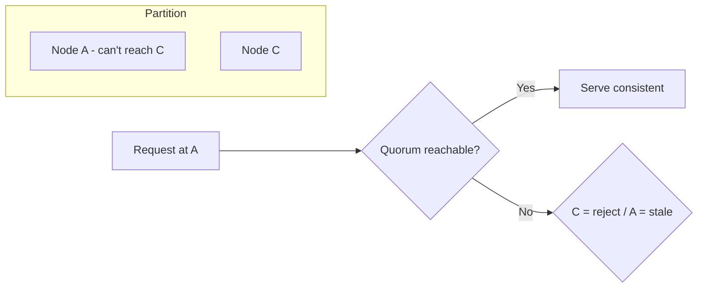

# CAP Theorem

## 1. One-Line Definition
CAP says a distributed system can guarantee at most two of **Consistency, Availability, and Partition tolerance** during a network partition (split) — and since partitions happen, you must choose between consistency and availability when the network breaks.

## 2. Why Do We Need It?
It forces you to make the hardest trade in distributed systems *explicitly*: when nodes can't talk to each other, do you serve possibly-stale data (available) or refuse to serve rather than lie (consistent)? Every replication, quorum, and failover choice is really this choice in disguise.

## 3. Simple Intuition
Two shop branches with one phone line between them, and the line goes down. A customer at branch A asks for the last unit of stock:
- **Consistency-first:** branch A refuses to sell (can't confirm the true stock) — safe but the customer leaves.
- **Availability-first:** branch A sells it and hopes the other branch agrees — risk double-sell, but the customer is served.

You can do one, not both, while the phones are dead. CAP is just naming this.

## 4. What Happens Without It?
Teams pick systems without stating the trade: they add replicas "for availability," then wonder why a partition caused stale reads; or they demand "strong consistency everywhere," then discover the system is unavailable during every split. Unawareness = unmanaged risk.

## 5. Core Idea
During a **partition** (P) the network is broken. Now:
- **Consistency (C):** all nodes return the latest write (or reject). Requires coordination → must reject/block on the unreachable side.
- **Availability (A):** every request gets *a* response (possibly stale). Requires serving without the unreachable node.

Since partitions can't be prevented, you get **CP** or **AP**, not all three:
- **CP systems** (quorum-based, e.g., Zookeeper/etcd, HDFS): prefer blocking/denying over stale data.
- **AP systems** (Cassandra, DynamoDB, Riak, many NoSQL): prefer serving, converging later, with conflict resolution.
- **CA in practice**: a single-node DB "is consistent and available" — but that's not distributed; as soon as it replicates it enters the P world.

**When the network is healthy** (no partition), systems can be both C and A — daily operations rarely dip below the "P" bar. So CAP is about **the partitioned moment**, and its practical sibling **PACELC** covers the always-on: if Partition → A or C; Else → Latency or Consistency (a healthy system can still choose eventually-consistent replicas for low latency).

## 6. Important Terminology

| Term | Simple Meaning |
|------|----------------|
| Partition | Network split between nodes |
| Consistency (CAP) | Linearizable reads: every node same latest value |
| Availability | Every request gets a response (may be stale) |
| CP / AP | Consistency-preferring / availability-preferring |
| Quorum (R+W>N) | Majority mechanism achieving C in a partition |
| PACELC | CAP + healthy-network latency vs consistency |
| Split brain | Multiple leaders during partition (corruption) |

## 7. Basic Architecture (The Choice)



## 8. Request or Data Flow
1. Client writes → quorum of replicas acked (C config) or a single node acked (A config).
2. Partition splits replicas.
3. On minority side: CP → refuse (unavailable); AP → serve from local copy (stale).
4. On majority side: CP → keep serving via quorum; AP → keep serving, resolve conflicts on heal.

## 9. Practical Example
**Shopping cart vs payment (assumptions):** 
- **Cart** (AP): keep the user adding items even if a DC is partitioned; conflicts converge. Being stale for 30s is fine.
- **Payment ledger** (CP via quorum/leader): a charge must not double-commit; if a quorum can't be met, refuse rather than risk a wrong charge.

## 10. Scaling
- CP at scale: quorums cost extra reads/writes (X replicas touched per op) and store copies ; latency grows with replication factor.
- AP at scale: warm serving is easy (any node serves), but conflict resolution and reconciliation complexity grows (LWW, vector clocks).
- CAP is not a scaling axis — it's the *operating envelope*: many systems run C-strong locally and AP across regions (where partitions are more likely).

## 11. Reliability and Failure Scenarios

| Scenario | CP behavior | AP behavior |
|----------|-------------|-------------|
| Single replica down | Reads/writes blocked if quorum lost | Serve from remaining |
| Partition between regions | Won't serve minority | Serves, conflicts on heal |
| Heal after partition | Consistent at once (drop lost writes) | Converges via resolution |
| Node returning | Rejoin quorum | Reconcile to converged state |

**Detection:** quorum health, latency, partition/leadership events. **Recovery:** quorum restore, conflict resolution / log reconciliation. The **trade-off** is always the same: correctness vs serving-through.

## 12. Consistency and Correctness
CAP-consistency is *linearizability* (single total order). Weaker models (read-your-writes, monotonic, causal — see consistency-models.md) sit between AP and full CP and are the practical majority — many "consistent enough" products use these. Know which one you're really delivering.

## 13. Performance
- Quorum reads/writes amplify I/O across nodes (R+W read/write amplification) — p99 grows with replication factor.
- AP is locally fast (single-node ack) at the cost of reconciliation work later.
- Latency vs consistency on *healthy* networks — that's PACELC: choose low latency (async replicas) unless the op demands strong reads.

## 14. Security
Abuse and revocation are exactly the data that must not be stale: token/ban/rate-limit state should lean CP (or at least strict quorum) even in an otherwise AP system; a stale fraud/abuse decision is a security hole.

## 15. Trade-Offs

| Choice | Advantages | Disadvantages | When to Use |
|--------|------------|---------------|-------------|
| CP (quorum) | No stale data ever | Refuses during partition/quorum loss | Money, ledger, meta-registry |
| AP (serve local) | Always answers | Stale reads, conflict work | Carts, feeds, metrics |
| Causal mix | Natural, tolerant | Complexity | Messaging, collaboration |
| Region-split: C-locally/AP-globally | Locally strong | Reconciliation between regions | Global products |

## 16. Common Mistakes
- Quoting CAP as "a database is either CA or AP" — it's about the **partition moment**; CA is only true for a single node.
- "We chose CP, so we never have stale data" — CP protects at partition; weak-cache/read-your-writes violations can still occur.
- Choosing AP for money because "Cassandra is fast" without a ledger-grade conflict story.
- Ignoring PACELC: even **without** a partition, async replicas give you stale reads for latency — CAP doesn't excuse that; consistency is a per-op choice.

## 17. HLD vs LLD Boundary
HLD: pick CP/AP per data domain, quorum sizes, region split strategy, conflict model. LLD: how a specific client sets consistency/read concern on each query.

## 18. Interview Questions

### Beginner
- What does CAP state, precisely?
- Why can't we have all three?

### Intermediate
- A partition happens. Walk what your CP system and your AP system each do.
- When the network is healthy, does CAP decide anything? What does, then?

### Advanced
- Design a global payments system that is AP for carts and CP for ledgers; where are the seams?
- Defend "quorum R+W>N" as a CAP implementation — what's the latency cost per op?

## 19. Interview Memory Summary

> [!abstract]- Interview Memory Summary

### Remember

- CAP: C, A, P — choose 2, and P is unavoidable.
- A partition forces the C-or-A choice.
- CP = refuse rather than lie; AP = serve + converge later.
- Healthy networks aren't governed by CAP — PACELC governs latency vs consistency.
- Per-domain choice: money = CP, feeds = AP.
- CAP is about the partitioned moment, not a permanent label.

### 30-Second Explanation

Replication creates partitions; when the network splits, decide per data domain: blocking (CP) or serving-stale + conflict resolution (AP); tune latency vs consistency the rest of the time.

### Interview Traps

- "CAP says pick 2 of 3" as a literal menu — in practice you pick C or A *during a partition*; P is not optional.
- Labeling a database "CA" — CA is only a single node.
- "We chose CP so we never have stale data" — weak reads still leak.
- Choosing AP for money because it's fast, without a ledger-grade conflict story.
- Ignoring PACELC: even without a partition, async replicas give stale reads for latency.

### Key Trade-Off

The core trade is consistency vs availability during a partition, bought on the healthy-network side as latency vs consistency (PACELC): you run fast and eventually-reconciled unless an operation's staleness cost demands quorum/leader coordination.

## 20. Related Concepts

### Prerequisites

- [[database-replication|Database Replication]]
- [[availability|Availability]]

### Commonly Used Together

- [[strong-vs-eventual-consistency|Strong vs Eventual Consistency]]
- [[replication-lag|Replication Lag]]
- [[standby-models|Standby Models]]

### Advanced Concepts

- [[sharding|Sharding]]
- [[consistent-hashing|Consistent Hashing]]

Related planned topics (not authored yet): PACELC, quorum, CRDT, consistency models.

## 21. References
Gilbert & Lynch "Brewer's Conjecture and the Feasibility of Consistent, Available, Partition-Tolerant Web Services"; Kleppmann ch. 9. Verify with current distributed-store docs.

## 22. Active Recall

Test yourself before revealing each answer.

> [!question]- What does CAP state, precisely?
> During a network partition (P), a distributed system cannot guarantee both Consistency (C — every node returns the latest write) and Availability (A — every request gets a response). Since partitions happen in real systems, you choose C or A at the partitioned moment — you get CP or AP, not all three.

> [!question]- Why can't we have all three?
> In a partition, the two sides can't coordinate. To be consistent, the unreachable side must refuse (unavailable). To stay available, the unreachable side must serve possibly-stale data (inconsistent). You can't do both at once — CAP is naming this unavoidable trade.

> [!question]- Design decision: shopping cart vs payment ledger across partitions.
> **Cart** → AP: keep users adding items even if a DC is partitioned; conflicts converge later, staleness for 30s is fine. **Payment ledger** → CP via quorum/leader: a charge must never double-commit; if a quorum can't be met, refuse rather than risk a wrong charge.

> [!question]- Trade-off: what does quorum (R+W>N) buy and cost?
> R+W>N means a read and write always overlap on at least one node — so no stale reads (CP). Cost: each operation touches multiple replicas (read/write amplification), p99 grows with replication factor, and availability drops if the quorum can't be met during a partition.

> [!question]- Failure scenario: partition between regions, CP system on the minority side. What happens?
> The minority side loses quorum → it refuses requests (unavailable) rather than serve stale data. On heal, the system recovers to a consistent state. AP-style systems instead serve from local copies and run conflict resolution on heal — the trade is always correctness vs serving-through.

> [!question]- Interview scenario: "We chose CP, so we never have stale data." How do you respond?
> CP protects at the partition moment — it doesn't prevent stale reads from weak caches, read-your-writes violations, or async replicas on the healthy path. And even without a partition, PACELC says you still choose latency vs consistency. CP is one decision, not a blanket guarantee.

> [!question]- Interview scenario: design a global payments system that is AP for carts and CP for ledgers. Where are the seams?
> Carts: AP, multi-region, conflict-converging. Ledgers: CP via quorum in the issuing region. The seam is that a cart-confirmed item only becomes a ledger debit through a strict CP step — the cart state can be eventually consistent, but its money effect must pass through a CP gate.

## 23. When Should I Use This?

### Use it when

- You're choosing a consistency/availability posture for a replicated distributed system.
- Money, ledgers, identity, or coordination need quorum-style correctness (CP).
- Carts, feeds, metrics, or content can serve local copies and reconcile (AP).
- You want to reason about partitions, quorums, and conflict resolution explicitly.

### Avoid it when

- You cite CAP as a literal "pick 2 of 3" menu — it's a partition-moment choice.
- You label a database "CA" as a category (CA only holds for a single node).
- You think CP precludes all stale reads on healthy networks (PACELC still applies).
- You chose AP for money without a ledger-grade conflict/convergence story.

### What problem does it solve?

Problem: replicated systems must behave sensibly when the network splits. Bottleneck: unmanaged partitions cause stale reads (if you serve) or outages (if you refuse) — an unspoken, unexpected trade. Solution: CAP names the moment explicitly, so you choose CP (refuse rather than lie) or AP (serve + converge) per data domain, and use PACELC for healthy-network latency-vs-consistency tuning.

### What problem does it NOT solve?

It doesn't govern the healthy network (that's PACELC), doesn't remove the need for conflict resolution in AP systems (LWW/vector clocks), and doesn't excuse weak reads from caches/read-your-writes violations in CP-labeled systems. It's the partitioned moment's lens, not a complete consistency model.

## 24. Decision Connections

Decisions that go together with CAP Theorem:

- [[database-replication|Database Replication]] — replicas are what create the partition trade.
- [[strong-vs-eventual-consistency|Strong vs Eventual Consistency]] — the practical side of the C/A split.
- [[availability|Availability]] — the A you sometimes sacrifice for C.
- [[failover|Failover]] — quorum/fencing is the operational implementation of the choice.
- [[standby-models|Standby Models]] — standby topology interacts with partition behavior.
- [[replication-lag|Replication Lag]] — the staleness that AP-style reads accept.
- [[sharding|Sharding]] — cross-shard consistency inherits the CAP constraints.
- [[consistent-hashing|Consistent Hashing]] — placement/rebalance interacts with partition handling.

Decision tree:

```
Network partition hits a replicated system
    |
    +-- Must never be stale? (money, ledger, identity)
    |      → CP — quorum, refuse minority ([[failover|Failover]])
    |
    +-- Must keep serving? (carts, feeds, metrics)
    |      → AP — serve local, converge on heal
    |
    +-- Healthy network but latency-sensitive reads?
    |      → PACELC: [[strong-vs-eventual-consistency|Strong vs Eventual Consistency]]
    |
    +-- Cross-region writes?
    |      → CP locally + AP globally ([[sharding|Sharding]])
```