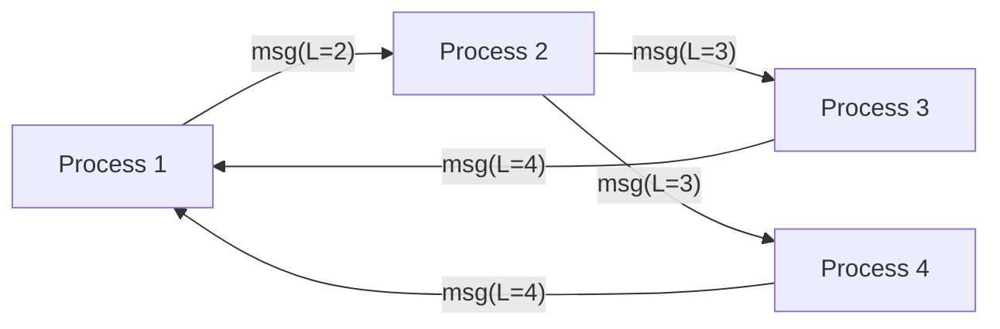

# Logical / Lamport / Vector Clocks

## 1. One-Line Definition
Logical clocks assign order to events without trusting physical time — Lamport clocks give a total order consistent with causality, and vector clocks additionally detect which events are concurrent — the machinery behind conflict detection, causal ordering, and distributed debugging.

## 2. Why Do We Need It?
Wall clocks drift (NTP skew, VM pauses) and two machines never agree what "now" is, so "event A happened before B" cannot be decided by timestamps. Distributed systems instead ask a causality question: did B depend on some state A produced? Lamport and vector clocks answer that purely from message flow — no synchronized clock needed. That powers read-after-write, monotonic reads, conflict detection (see [[conflict-resolution|Conflict Resolution (LWW / Version Vectors)]]), and frontier ordering in changelogs.

## 3. Simple Intuition
Every message that goes out carries a "version stamp": my counter at the time sent. Anyone receiving it knows "the sender had seen up through version 7". If I later see version 8 from someone else, I know they saw everything I had at 7. Version stamps (counters propagated with each message) reconstruct the causal chain — unlike wall-clock times that machines can't agree on.

## 4. What Happens Without It?
Two machines decide "which write is older" by their own clocks and pick different answers — causality silently breaks (a reply appears before the post; a comment before its parent message). Conflict detection garbage: two independent edits look like "the second replaced the first" under LWW, so one user's work disappears. Distributed traces and changelogs get mis-ordered and are unfixable after the fact.

## 5. Core Idea

**Happens-before (causality):** event a → b if a could have influenced b: same process order, or a sent a message that b received (transitively).

**Lamport clock (one counter):** every process increments its counter per event and on message receive takes `counter = max(counter, received) + 1`.
- Property: a → b implies L(a) < L(b). It's a partial-order consequence of causality, but the converse fails: L(a) < L(b) does not imply a → b.
- Tie-break to a total order: `(Lamport, processID)` — deterministic everywhere, but the tie-breaker's "wins" is arbitrary, not causal.

**Vector clock (N counters):** each process keeps one counter per participant. On event: increment own. On receive: take max per entry with the received vector, then increment own.
- Define: A ≤ B iff every entry of A is ≤ B's. A → B iff A ≤ B and A ≠ B. Concurrent: neither A ≤ B nor B ≤ A.
- This is the whole trick: vector clocks can tell you concurrency, Lamport clocks cannot.

**Practical train:** Dynamo's version vectors are vector clocks per key, one position per writing node. Dotted version vectors add a counter shared across replicas for same-node concurrency. Hybrid logical clocks (HLC) bolt a physical timestamp onto Lamport logic to approximate wall time while preserving causality — the LWW/vector hybrid used by modern stores.

## 6. Important Terminology

| Term | Simple Meaning |
|------|----------------|
| Happens-before (→) | Causal relation: possible influence |
| Concurrent | Neither event causally precedes the other |
| Lamport clock | One global counter + max-merge on receive |
| Vector clock | Per-participant counters, detects concurrency |
| Total order | Every pair ordered (needs tie-break) |
| Version vector | Vector clock on a single key in a store |
| Hybrid logical clock | Physical time + causality in one stamp |
| Causality violation | State appears whose cause hasn't been seen |

## 7. Basic Architecture



Messages carry Lamport counters; each receiver max-merges then increments. Vector clocks do the same per process.

## 8. Request or Data Flow
1. Write on node A: A increments its own vector position → [A:1, B:0]. The write ships with that vector.
2. Write on node B: B increments its own → [A:0, B:1]. When A and B sync, both vectors are on the table.
3. Compare: A's vector [1,0] vs B's [0,1] — neither ≤ the other → concurrent → conflict-resolution path (see [[conflict-resolution|Conflict Resolution (LWW / Version Vectors)]]).
4. Causal op: B later reads A's write (vector [A:1,B:0]) and creates a comment stamped [A:1, B:1]. Any replica receiving it knows the A:1 dependency must be visible first, so the comment can never render before its parent post.

## 9. Practical Example
A chat with three devices (A, B, C):
- A sends a message → vector [A:1, B:0, C:0]. B receives and replies → [A:1, B:1, C:0]. Any replica checking the reply's vector can assert "A:1 present" before displaying it — no wall clock involved.
- A and C edit the same thread concurrently: [A:2, B:0, C:0] and [A:0, B:0, C:1] are concurrent → both are kept and merged, or flagged for LWW — never silently overwritten.
- NTP skew becomes irrelevant: causality, not time, defines order. A 200 ms-lagging machine cannot make its edit look "later" by a bigger wall stamp.

## 10. Scaling
- Vector size = participant count. For a key written by 3-5 nodes, tiny. For thousands of writers, the vector grows — split sharable keys or use dotted variants; vectors are per key and usually bounded by concurrent writers of that key, not cluster size.
- Churn: nodes joining/leaving change the participant set; tombstone or prune vectors of retired nodes after a grace window, or vectors fragment.
- Message volume: every broadcast carries the vector — a few bytes, fine. A wide replication set moves more metadata than content.
- Total-order need: vector clocks give partial order only. Thousands of nodes needing one linear order call for consensus/Raft (see [[raft-and-paxos|Raft and Paxos]]), plus tie-break stamps for deterministic replay (see [[replayability|Deterministic Systems and Replayability]]).

## 11. Reliability and Failure Scenarios

| Failure | What Happens | Detection | Recovery | Trade-off |
|---------|--------------|-----------|----------|-----------|
| Node GC-paused | Its clock stalls; sends appear late | Vector compare | Causality tracking + replay | correctness vs clock memory |
| Node permanently leaves | Vector keeps its slot forever | Vector age metric | Tombstone + prune after window | metadata drift |
| NTP skew on HLC | Physical part drifts; causality still safe | HLC monitor | Resync NTP; don't trust wall alone | bounds vs drift |
| Message dropped on sync | Event invisible to some replica | Vector gap on read | Read repair / anti-entropy | eventual window |

## 12. Consistency and Correctness
- Vector clocks define concurrency; they don't decide what to do with it — pair with an LWW/merge policy (see [[conflict-resolution|Conflict Resolution (LWW / Version Vectors)]]).
- Lamport total order (counter, processID) is deterministic, but the tie-break is arbitrary; it claims no real cause. If you need "latest by real intent," use HLC.
- Idempotency: a replay must not bump the clock; a replayed message with a "newer" vector fabricates a conflict. Dedup arriving messages before applying.
- Causal consistency: a write may be delayed but never delivered before its causal ancestors. Clock stamps alone can't enforce that — hold deliveries on the version dependency, or use an ordered outbox (see [[outbox-pattern|Outbox Pattern]]).

## 13. Performance
- Lamport: one integer per message — effectively free.
- Vector: N integers per message; compare O(N). Negligible for N ≤ 10, tolerable to hundreds, a real budget in the thousands.
- HLC: one 64-bit value per event, comparable to a timestamp — the cheap path when you want wall-clock estimate plus causality.
- Overhead lands at sync points (vector compare on conflict resolution), not the happy write/read path.

## 14. Security
Clocks and vectors can be forged by a participating writer: a malicious replica can stamp an arbitrarily "new" vector and force its write to win resolution. Authenticate replication identity, bound vector growth, and use server-side clocks for any LWW tie-break — a client must never be the sole source of "newest." Treat this as an integrity property as much as correctness.

## 15. Trade-Offs

| Choice | Advantages | Disadvantages | When to Use |
|--------|------------|---------------|-------------|
| Unsynced wall clock | Free | Skew breaks causality | Single node only |
| Lamport | 1 int, total order | No concurrency detection | Ordering changelogs, causal fifo |
| Vector | Detects concurrency | Size = participants | Multi-writer conflict detection |
| HLC | Physical approx + causal | Still coarse on physical part | LWW + causality stores |
| Consensus (Raft/Paxos) | Real total order | Coordination cost + downtime | Leader-based linear order |

## 16. Common Mistakes
- Using physical timestamps where "latest" must be causal — skew silently rewrites history.
- Claiming Lamport clocks order causally (they only respect it one way); the total-order tie-break is arbitrary.
- Forgetting dedup: a replayed message bumps the vector → phantom conflict.
- Never tombstoning retired nodes → vector slots accumulate forever.
- Treating HLC's physical suffix as a true TTL for tombstones — you need a no-late-arrival guarantee in addition.

## 17. HLD vs LLD Boundary
HLD: which streams use Lamport vs vector vs HLC; tombstone/prune windows; where causality must be enforced (deliveries after ancestors). LLD: the vector-compare function, HLC encode/decode, and the "hold delivery until dependency seen" check in one consumer.

## 18. Interview Questions

### Beginner
- Why can't wall-clock timestamps decide which distributed write is "later"?
- What is the happens-before relation, and what does a Lamport clock guarantee about it?

### Intermediate
- What can a vector clock tell you that a Lamport clock cannot?
- Design a comment system that never shows a reply before its parent post.

### Advanced
- "We ship every write with a Lamport counter, so ordering is solved." Refute with a concurrency counterexample.
- Using dotted version vectors + tombstone pruning for a 500-writer doc store, what is your GC safety bound?

## 19. Interview Memory Summary

> [!abstract]- Interview Memory Summary
> ### Remember
> - Physical time can't order a distributed world (NTP skew, GC pauses).
> - Lamport: 1 counter, max-merge + increment; respects causality one way only.
> - Vector: per-participant counters; A ≤ B means A causally before B; incomparable means concurrent.
> - Conflict detection = incomparable vectors (Dynamo's version vectors).
> - HLC = physical timestamp plus Lamport semantics — the LWW/causal hybrid.
> - Total order over concurrent events is arbitrary (tie-break); that's not causality.
> - Cost tier: Lamport ~0, vector = participants, consensus = coordination.
> - Dedup replays before bumping clocks, or you invent conflicts.
> ### 30-Second Explanation
> Order events by causality, not clocks: happens-before is "A might have influenced B". Lamport counters (max-merge + 1) preserve that into a total order. Vector clocks (one counter per participant) tell you whether two events are causally ordered or genuinely concurrent — exactly the signal conflict resolution needs. Physical time enters only as an HLC suffix, giving wall-ish timestamps with causal safety for read paths and LWW tie-breaks.
> ### Interview Traps
> - "Lamport gives a total order, so we're done" — concurrency is invisible; the tie-break is arbitrary.
> - Using timestamps for LWW while claiming causality — they diverge under skew.
> - No GC of vector slots for retired nodes.
> - Delivering a message before its causal ancestors because ordering was "just an int".
> ### Key Trade-Off
> Causality is cheap (one counter) but concurrency detection is costly (participant-sized vectors), and any total order over concurrent events is a deterministic but arbitrary tie-break — never causal truth.

## 20. Related Concepts

### Prerequisites

- [[conflict-resolution|Conflict Resolution (LWW / Version Vectors)]] — the consumer of concurrency detection
- [[strong-vs-eventual-consistency|Strong vs Eventual Consistency]] — causal consistency as a real model in the spectrum

### Commonly Used Together

- [[consistency-models|Consistency Models (Read-After-Write / Monotonic)]] — session guarantees built from causal order
- [[distributed-id-generation|Distributed ID Generation]] — monotonic, ordering-friendly id schemes
- [[quorum|Quorum / Majority Consensus]] — version compare on quorum reads
- [[outbox-pattern|Outbox Pattern]] — ordered delivery of changelog to consumers

### Alternatives

- [[raft-and-paxos|Raft and Paxos]] — buy a real total order through consensus instead of a logical order
- [[distributed-id-generation|Distributed ID Generation]] — when a single global sequence is enough and causality is overkill

### Advanced Concepts

- [[replayability|Deterministic Systems and Replayability]]
- [[bft|Byzantine Fault Tolerance]]

Related planned topics (not authored yet): network partition (03 networking) — the physical failure that makes clocks lie most.

## 21. References
Lamport, "Time, Clocks, and the Ordering of Events in a Distributed System" (1978); Fidge and Mattern for vector clocks; HLC (Kulkarni et al., 2014) for hybrid logical clocks; DeCandia et al., "Dynamo" (SOSP 2007) for version vectors. Kleppmann, *Designing Data-Intensive Applications*, ch. 5.

## 22. Active Recall

Test yourself before revealing each answer.

> [!question]- What does happens-before mean and why is it not wall-clock time?
> a happens-before b if a could have influenced b: same-process ordering, message transmission, or transitively. It captures dependency, which is what "should I see that first" means — while wall clocks disagree under NTP skew and GC pauses, so two machines may disagree on which happened first.

> [!question]- A Lamport clock gives a total order. Why is that NOT causality?
> The relation a → b implies L(a) < L(b), but the converse fails: two independent (concurrent) events can still be ordered by the counter + processID tie-break. That order is deterministic but arbitrary — it claims no real dependency. Causality requires vector clocks to see the gap.

> [!question]- Design decision: how do you prevent a comment from rendering before its parent post in a replicated store?
> Carry the parent's vector with the comment: the comment's vector includes the parent's entry (e.g., [Post:1, Comment:1]). A consumer holds delivery until it has seen that entry — the dependency — and only then renders. No wall clock involved; causality is enforced by the vector, not by timestamp.

> [!question]- Trade-off: Lamport vs vector clocks for a 200-replica changelog.
> Lamport: one counter, and still gets a total order for streaming logs, but can't distinguish a genuine reorder from a concurrent write — conflict detection is blind. Vector: detects concurrency, but 200 entries per message is heavy. Compromise: HLC for cheap global ordering + per-key version vectors only where conflicts are possible.

> [!question]- Failure scenario: a GC pause makes one node's messages "arrive late". What does vector clocking say?
> The paused node's vector reflects its stalled causality: its messages carry old counters, so receivers see them as behind (dominated), never as newer. Causality detection survives the pause; only a wall-clock-based LWW would misread "late" as "newer" and corrupt resolution.

> [!question]- Interview scenario: "We use timestamps for everything; it's simpler and NTP is fine." Respond.
> NTP is not fine under GC, VM migration, or misconfiguration, and a "later" timestamp on a causally-earlier write is a silent ordering lie. For a handful of writers, vector or HLC clocks cost a few extra bytes and make ordering provable. Keep timestamps only as the *physical* suffix in an HLC, not as the ordering mechanism.

## 23. When Should I Use This?

### Use it when

- Multiple writers can race the same key and you must know which writes are truly concurrent (see [[conflict-resolution|Conflict Resolution (LWW / Version Vectors)]]).
- You promise causal consistency or read-after-write across replicas.
- You want deterministic replay or changelog ordering that survives clock skew.
- The cluster is small enough that participant-sized vectors are cheap.

### Avoid it when

- A single leader serializes every write — ordering is already total, and the vector is redundant.
- You need a global linear order across thousands of writers — that's consensus (see [[raft-and-paxos|Raft and Paxos]]).
- Ultra-high-throughput, byte-frugal streams where any per-record metadata is expensive — an HLC suffix or a single Lamport counter may be enough.

### What problem does it solve?

It answers "what came first — or was it concurrent?" without trusting physical time, which is the precondition for conflict detection, causal delivery, and sensible partition.

### What problem does it NOT solve?

A causal order is partial, not linear: it does not tell you which of two concurrent events should win (that is resolution), and it cannot order everything globally (that is consensus). It also proves nothing about real elapsed time on its own.

## 24. Decision Connections

- [[conflict-resolution|Conflict Resolution (LWW / Version Vectors)]] — detection feeds resolution; the two go together.
- [[consistency-models|Consistency Models (Read-After-Write / Monotonic)]] — the guarantees causal order enables.
- [[quorum|Quorum / Majority Consensus]] — version compare performed on quorum reads.
- [[distributed-id-generation|Distributed ID Generation]] — ids and clocks are alternative ordering tokens.
- [[outbox-pattern|Outbox Pattern]] — ordered, durable delivery of ordered events.
- [[raft-and-paxos|Raft and Paxos]] and [[consensus|Consensus]] — upgrade to a true linear order when partial order isn't enough.
- [[replayability|Deterministic Systems and Replayability]] — deterministic replay needs stamps every process can reproduce.

Decision tree:

```
Do participants need to agree on event order?
    |
    +-- Writes are concurrent within one key?
    |      → detect with vector clocks → [[conflict-resolution|Conflict Resolution (LWW / Version Vectors)]]
    |
    +-- Causal delivery (reply after parent)?
    |      → vector/HLC stamps + hold-until-dependency
    |         → [[consistency-models|Consistency Models (Read-After-Write / Monotonic)]]
    |
    +-- Only a stream needs a cheap total order?
    |      → Lamport counter or HLC suffix
    |         +-- Replay deterministically?     → [[replayability|Deterministic Systems and Replayability]]
    |         +-- Physical-time estimate needed?→ HLC (hybrid)
    |
    +-- A single global linear order is mandatory (all writers)?
    |      → [[raft-and-paxos|Raft and Paxos]] / [[consensus|Consensus]], not logical clocks
    |
    +-- Few writers, unique monotonic ids available?
           → [[distributed-id-generation|Distributed ID Generation]] may be simpler than vectors
```