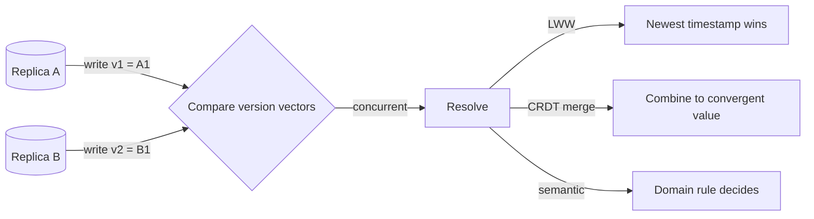

# Conflict Resolution (LWW / Version Vectors)

## 1. One-Line Definition
Conflict resolution is what a multi-writer system does when two replicas accept concurrent writes to the same key: detect the divergence (version vectors), then merge or pick a winner (LWW, CRDTs, or semantic business rules).

## 2. Why Do We Need It?
Single-leader databases never see conflicts — the leader serializes everything. But multi-leader, leaderless, offline-first, and geographic set-ups write to multiple nodes with no shared serialization point. When two writes race, someone must decide: LWW (last writer wins by timestamp), merge (CRDTs union the state), or a domain rule. Without a deterministic policy, the same key becomes two truths and "write anything anywhere" silently corrupts data.

## 3. Simple Intuition
Two camping groups leave notes in a shared hut on opposite walls. Both said "we'll be here Saturday". A third group arrives: whose note is right? The one actor who "won" must be decided by a rule everyone trusts:
- **LWW:** the note with the later ink timestamp wins (someone's earlier note is discarded).
- **Merge:** notes are combined — "Saturday AND Sunday", since notes can be joined.
- **Semantic:** you can't camp at both spots, so the first-come note stands and the second is told to try again.
Conflict *detection* is noticing both notes exist; resolution is picking the rule.

## 4. What Happens Without It?
- Concurrent writes leave a key with two values; different readers see different ones; the "latest" is random/undefined.
- Writes "roll back" each other forever — the curse of copy-paste sync in docs.
- Worse: with LWW, whichever value *arrived* last by wall clock wins, even if it was written *first* (clock skew) — the classic lost-update that made engineers ban LWW for anything important.

## 5. Core Idea
Break the problem in two:

**Detection — is it a conflict or just a reorder?** A conflict means *concurrent* writes: neither causally followed the other. Version vectors / dotted version vectors catch this (each replica keeps counters it increments; two divergent variants = concurrent). See [[clocks-and-ordering|Logical / Lamport / Vector Clocks]] for the mechanism.

**Resolution — pick the winner deterministically:**
1. **LWW (timestamp resolution):** newest `(timestamp, node)` wins. Simple, portable, needs good clocks (NTP / HLC). Loses updates silently — fine for "last edit to a profile," fatal for carts and ledgers.
2. **Merge / CRDTs:** both values survive — arithmetic (counters add), sets (union/idempotent), registers with per-field LWW. Requires the data type to be mergeable. Automatic and convergent; state-based CRDTs need a total/min-max boundary to guarantee convergence (causal delivery + join).
3. **Semantic / business rules:** domain logic picks the winner (e.g., "transfer if authorized", "high-water mark", "first-registered wins") — usually paired with application-side reconciliation and a human-visible conflict list.

Supporting machinery:
- **Per-field LWW:** e.g., `profile.name` resolved by LWW but `cart.items` merged — resolution can be per-field, not per-document.
- **Tombstones / tombstones with timestamps:** a delete must survive as a tombstone long enough; otherwise a resurrected value reappears (zombie write).
- **Idempotent merge:** replaying the same write twice must converge (CRDT property), else retries corrupt.
- **Read repair & anti-entropy:** conflict detection then triggers background convergence across replicas so it doesn't linger.
- **Causal ordering front-line:** many "conflicts" are just replays/retries; ordering + dedup (vector clocks, outbox) gets them detected as duplicates, not conflicts.

## 6. Important Terminology

| Term | Simple Meaning |
|------|----------------|
| Concurrent write | Neither write causally followed the other |
| Version vector (VV) | Per-replica counters that detect concurrency |
| LWW | Last-writer-wins by timestamp, deterministic tie-break |
| CRDT | Structure whose concurrent merges converge |
| Tombstone | A deleted marker that stops resurrection |
| Read repair | Fix the stale replica when a read sees a conflict |
| Zombie write | A value resurrected after deletion |
| Hinted handoff | Write parked on a live node, handed back on heal |

## 7. Basic Architecture



## 8. Request or Data Flow
1. **Write on replica A:** the new write carries A's version vector incremented (A:1) vs the old (A:0).
2. **Write on replica B:** likewise B:1 — when A and B exchange, each sees the other's vector isn't a superset of mine → **concurrent** detected.
3. **Compare on read or background sync:** if one vector dominates (A:2 vs A:1), it's ordered, no conflict. If not, invoke the resolver.
4. **Resolver output** is written back to all replicas (including read-repair for stragglers), and tombstones filter any resurrection as replicas reconcile.

## 9. Practical Example
**A shopping cart (assumptions):** two devices, one account, offline-tolerant, vector clocks.
- Device 1 adds the "chair" offline (value {chair}). Device 2 adds the "lamp" offline (value {lamp}). Vectors A:1, B:1 — concurrent.
- **Resolution:** cart is CRDT-mergable: union → {chair, lamp}. The merge is idempotent; replaying it yields the same set. Result: nothing is lost. This is why CRDT carts exist (Figma, Google Keep, many offline apps).
- Compare **profile.name**: per-field LWW — "side A renamed me to X, side B to Y"; X and Y can't be merged, so timestamp decides and the loser silently disappears. Acceptable for display fields; users of that rule should know the racer can lose an edit.
- **Bank balance:** neither LWW nor union is safe — residue terms (transfers) need a ledger + semantic rules, not CRDT arithmetic on the balance.

## 10. Scaling
- **Vector size = number of concurrently writing replicas:** thousands of nodes → huge vectors and expensive compares. Cut-offs: version vectors are per-key, usually small (write participants per key, not cluster total), plus dotted-version-vector variants; if a single key's concurrent-writer set explodes, that key is a hotspot and should be split.
- **Conflict frequency:** merge-payload size grows with every concurrent op; CRDTs compact (last-writer-wins per element), but the tombstone set grows monotonically. Prune tombstones after a missing-deadline (e.g., after RPO window) with a total-order guarantee that nothing older can arrive.
- **Replication fan-out:** more replicas → more opportunities for concurrency → resolve at reads and in the background, not just at write time. Quorum systems read-repair to keep it cheap (see [[quorum|Quorum / Majority Consensus]]).

## 11. Reliability and Failure Scenarios

| Failure | What Happens | Detection | Recovery | Trade-off |
|---------|--------------|-----------|----------|-----------|
| Clock skew on LWW | A actually-later write loses (wrong winner) | Cannot detect in LWW | Use [[clocks-and-ordering|Logical / Lamport / Vector Clocks]] instead | simplicity vs correctness |
| Tombstone GC too early | Deleted value resurfaces (zombie) | Version-compare revives | Increase GC window / causal delivery | storage vs correctness |
| Replica lost on heal | Hinted handoff replays a stale write | Version check | Drop stale variant | lost op vs reapply |
| Conflict payments | Both sides credited without a ledger | Semantic rule | Ledger + unique transfer IDs | UX vs invariants |

## 12. Consistency and Correctness
- **Causality, not commits:** vector clocks decide ordering by history, not by commit time; two writes are "concurrent" iff neither dominates. That's the correct semantic for concurrent operation and it never lies about NTP skew (wall clocks do).
- **Merge must be a join:** CRDT merges must be commutative + associative + idempotent (with tombstones) so any interleaving converges. Favor total-order guarantees (like timestamps) inside CRDT internals.
- **LWW is not a merge:** it's a "total order covers all" fiction; use when a lost update is acceptable (profile fields, caches) — never for money or counts.
- **Idempotency on replay:** an upstream retry is "concurrent with nothing" — dedup keys (delivery-id) must filter replays *before* conflict detection, else a retry creates a phantom conflict.

## 13. Performance
- Version vector compare on read: O(participants) per key — negligible until a key gets fought over.
- CRDT merge: cheapest when both sides carry small deltas; expensive when large tears merge on every read. Tombstones age: retention memory grows slowly.
- LWW: zero extra work at write, one compare at read — the fastest policy, and priced in lost updates.
- The hidden cost of resolution is *operational*: reading the newest value requires contacting enough replicas (R) and background repair threads; skimpy R → higher chance of serving an unresolved variant.

## 14. Security
Conflict resolution inputs are attacker-influenceable: a client can forge a timestamp (LWW becomes "anyone may overwrite by lying about time") or flood the version-vector space. Prefer server-issued sequence/clock values, sign the resolution payloads if replicated across trust boundaries, and bound the per-key concurrent-writer set so a hostile key can't DoS the merge path.

## 15. Trade-Offs

| Policy | Advantages | Disadvantages | When to Use |
|--------|------------|---------------|-------------|
| LWW | Fast, simple, universal | Silently loses updates; skew risk | Display fields, caches, non-critical |
| CRDT merge | No lost data, is automatic | Type must be mergeable; tombstones; payload growth | Carts, editors, counters, offline |
| Semantic rule | Correct for invariants | Auth logic seed; manual handling | Money, bookings, races |
| Reject conflict | Deterministic, honest | Unavailability one racer | Locks, exclusive slots |

## 16. Common Mistakes
- LWW on user-editable, non-mergeable state (loses edits) or on anything with a ledger.
- Using wall-clock timestamps for LWW with drifting NTP — the "latest" is guaranteed nothing.
- Forgetting tombstones or GC-ing them early → deleted rows resurrect mysteriously.
- Checking "is it concurrent?" on *arrival order* instead of causality — retries then look concurrent.
- Assuming resolution replaces a causal-delivery / dedup front end (outbox, unique IDs) — the two layers must both exist.

## 17. HLD vs LLD Boundary
HLD: which data classes get LWW vs CRDT vs semantic; tombstone retention window; reconciliation triggers. LLD: the specific CRDT merge function in code, the compare-and-resolve routine in a store, the "conflict banner" in the app. The second is algorithm-level work (CRDT types), the first is system design.

## 18. Interview Questions

### Beginner
- What makes two writes a "conflict" rather than a simple reorder?
- Why can't you just timestamp every write and take the latest?

### Intermediate
- A 2-device cart syncs offline and both devices add items. Pick a policy and defend it against LWW.
- Where do version vectors fit — and why not use a global Lamport clock?

### Advanced
- Design conflict resolution for an append-only ledger with concurrent transfers. Why is LWW wrong, and why is a naive CRDT also wrong?
- Tombstones: when is it safe to garbage-collect them in a multi-writer system?

## 19. Interview Memory Summary

> [!abstract]- Interview Memory Summary
> ### Remember
> - Conflicts are concurrent writes, detected by version vectors, not arrival time.
> - Resolve with LWW × merge (CRDT) × semantic rules × reject.
> - LWW = fast, silent data loss; never for money/ledgers.
> - CRDT merge = convergent, idempotent, no loss, price in payload/tombstones.
> - Tombstones prevent zombie resurrection; GC them only past the no-late-arrival window.
> - Wall-clock "latest" is a lie under NTP/Ip clocks; causality wins.
> - Route the resolve through read repair + background anti-entropy.
> ### 30-Second Explanation
> Multi-writer systems diverge under concurrent writes. Detect with vector clocks: write which replica you are, compare "is mine newer?" — if neither dominates, it's concurrent. Policy choice: mergeable data → CRDT union (carts, editors); display state → LWW timestamp; invariants → semantic rule (ledger). Keep tombstones so deletes don't resurrect, and dedup retries before you treat them as conflicts.
> ### Interview Traps
> - "Latest timestamp wins" without a clock story (NTP skew makes it random).
> - CRDT-as-solution for everything — merging a balance is not a set union.
> - Forgetting tombstone GC timing; resurrected rows are embarrassing and silent.
> - Saying "version vector = ordering" — it detects concurrency; ordering is elsewhere.
> ### Key Trade-Off
> The price of not losing a race is running a merge or a domain rule — either a mergeable data type and tombstones, or semantic logic — while LWW buys simplicity at the cost of silently dropping one loser.

## 20. Related Concepts

### Prerequisites

- [[clocks-and-ordering|Logical / Lamport / Vector Clocks]] — the detection machinery
- [[strong-vs-eventual-consistency|Strong vs Eventual Consistency]] — the "converge eventually" promise that resolution delivers on

### Commonly Used Together

- [[quorum|Quorum / Majority Consensus]] — read repair / version compare at quorum reads
- [[crdt|CRDTs]] — the merge algebra written into the data type
- [[distributed-id-generation|Distributed ID Generation]] — unique IDs for idempotent dedup of replays
- [[consistency-models|Consistency Models (Read-After-Write / Monotonic)]] — session guarantees that steer causal ordering

### Alternatives

- [[raft-and-paxos|Raft and Paxos]] / [[consensus|Consensus]] — pay more to *never* conflict (single serialized writer)
- [[distributed-transactions|Distributed Transactions]] — coordinate instead of resolve

### Advanced Concepts

- [[bft|Byzantine Fault Tolerance]]
- [[replayability|Deterministic Systems and Replayability]]

Related planned topics (not authored yet): CRDTs exist under 18, but the merge-semantics angle above links to [[crdt|CRDTs]] directly.

## 21. References
DeCandia et al., "Dynamo: Amazon's Highly Available Key-value Store" (SOSP 2007) — version vectors + LWW in the wild. Kleppmann, *Designing Data-Intensive Applications*, ch. 5. Riak docs on conflict resolution and vector clocks; CRDT papers (Shapiro et al., 2011). Verify tombstone/pruning guidance in your CRDT store's docs.

## 22. Active Recall

Test yourself before revealing each answer.

> [!question]- Define "concurrent" in a distributed write without talking about time.
> Two writes are concurrent when neither causally precedes the other: neither side's version vector is a superset of the other's. Time has nothing to do with it.

> [!question]- Why is "take the latest wall-clock timestamp" dangerous?
> NTP/Ipv offsets make "latest" relative: two replicas disagree about now, so a truly-earlier write can be stamped later and win. LWW that leans on wall clocks silently corrupts the winner; causal clocks (Lamport/vector/HLC) replace it.

> [!question]- Design decision: merge two offline edits of a text doc. What and why?
> Use a CRDT (or OT) merge: apply both side's inserted spans and resolve ranges by site-id/timestamp in a deterministic order, so any interleaving converges. Price: tombstones + payload history for redo/conflict; a winner-only policy would eat one side's sentences.

> [!question]- Trade-off: LWW vs CRDT for a like-counter with concurrent +1s.
> A counter is naturally a CRDT (add-only); LWW would silently drop the +1 that "lost". But "reset the counter" is a different op — a shared "deleted" counter needs a tombstone. So: mergeable ops converge (CRDT); destructive ops need LWW-reset + tombstones, not raw CRDT.

> [!question]- Failure scenario: a deleted row keeps reappearing after replica heal.
> Cause: tombstone GC'd before every replica had the delete — a zombie write rode back in. Fix: keep the tombstone until every participant has advanced past a deterministic point (clock/sequence watermark), or use a per-key version that bullets resurrection.

> [!question]- Interview scenario: sync a 2-device offline cart where both devices added items, but a device also removed one.
> Cart is a CRDT set (add is add-only; remove = tombstone element). Concurrent add + remove of the *same* item is a real conflict: the semantic rule is "remove wins" or "re-add wins" — pick deterministically and document it. The point is to show detection (vector clocks), a merge domain (CRDT set), and a semantic tie breaker, not a single magic answer.

## 23. When Should I Use This?

### Use it when

- Writes can arrive at multiple nodes (multi-leader, leaderless, offline-first, geo) with no single serializer.
- Data is mergeable (carts, docs, counters) — CRDTs fit naturally.
- You need mobile/offline apps to keep working and reconcile later.
- Retries and replays hide as "conflicts" without an idempotency layer.

### Avoid it when

- One leader always serializes (you pay resolution costs for nothing).
- Data must preserve exact, authoritative intent (bank ledgers) — resolve *semantically* before convergence, not by merge.
- The merge path is untested at scale; a subtle non-idempotent merge is a corruption bug.
- The team lacks a reconciliation story (who fixes a flagged conflict, and when?).

### What problem does it solve?

It makes "write anywhere, on any schedule" data *converge* — no silent overwrite, no lost update, no zombie delete — by detecting concurrency and applying a deterministic, idempotent policy.

### What problem does it NOT solve?

Total ordering across keys (consensus's job), transaction atomicity across keys (2PC/Saga), or authoritative-intent data where a merge would conflate money and intent (needs semantic rules on a ledger).

## 24. Decision Connections

- [[clocks-and-ordering|Logical / Lamport / Vector Clocks]] — detection: causality before resolution.
- [[crdt|CRDTs]] — the merge algebra when the type allows it.
- [[quorum|Quorum / Majority Consensus]] — read-repair and version compare perform resolution at scale.
- [[strong-vs-eventual-consistency|Strong vs Eventual Consistency]] — resolution is how "eventually" becomes "converged".
- [[distributed-id-generation|Distributed ID Generation]] — ids make retries dedupable, not concurrent.
- [[distributed-transactions|Distributed Transactions]] — the "coordinate instead of resolve" alternative.

Decision tree:

```
Two replicas hold different values for a key.
    |
    +-- One vector dominates the other?
    |      → ordered: apply newer, discard older (no conflict)
    |
    +-- Concurrent (neither dominates)?
    |      → choose a policy
    |         +-- Values mergeable (sets, counters, text)?
    |         |      → [[crdt|CRDTs]] union, idempotent, tombstone deletes
    |         +-- Display state, losing edit acceptable?
    |         |      → LWW (timestamp + node tie-break), [[clocks-and-ordering|Logical / Lamport / Vector Clocks]]
    |         +-- Money / invariant-critical data?
    |         |      → semantic rule on a ledger + reconcile
    |         +-- Exclusive slot (lock, booking)?
    |                → reject / first-wins
    |
    +-- Retries/dups misread as conflicts?
           → dedup by unique id first ([[distributed-id-generation|Distributed ID Generation]])
```