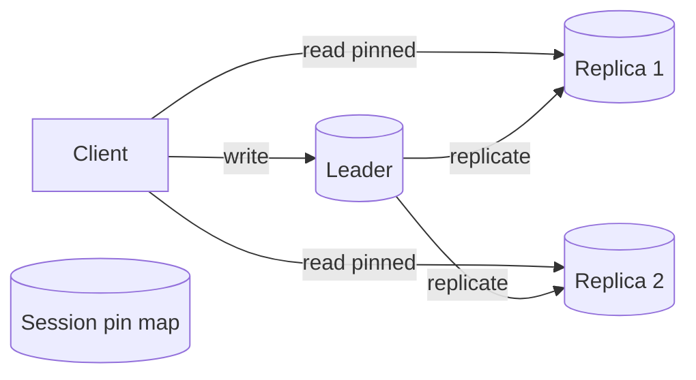

# Consistency Models (Read-After-Write / Monotonic)

## 1. One-Line Definition
Weak consistency models place explicit, per-operation guarantees between "always the latest write" (strong) and "converges eventually" (eventual) — most famously read-after-write (your own writes are visible to you) and monotonic reads (views never go backward in time).

## 2. Why Do We Need It?
Replication gives you read scale and availability but introduces staleness: a read served by a lagging replica can be arbitrarily old. Strong consistency fixes that but costs coordination (latency, availability). The real world sits in between — a user must see their own post after posting, even if everyone else sees it later. Weak models name each guarantee so you can buy exactly the freshness you need per operation, for the price you can afford.

## 3. Simple Intuition
A coffee shop with a chalkboard and photocopied menus. You order a custom drink (your write); the chalkboard is the source. Read-after-write means *you* always see the chalkboard's latest state (your order is on your receipt instantly), even if the photocopied menus lag. Monotonic reads means your waiter's pages never reorder: once you see page 5 you never flip back to page 3. Everyone else may still read stale menus — the guarantees are about your view, not the world's.

## 4. What Happens Without It?
- **No read-after-write:** you post a comment, the page refreshes, your comment is missing ("it vanished!"). Support tickets flood in. Phenomenon: "read-your-writes violation".
- **No monotonic reads:** a chat page shows a message, then a refresh drops it again — messages flicker in and out of existence.
- **No monotonic writes:** you edit your profile name twice quickly; session B replicates your second edit before your first, and a later write by the same user reverts an earlier one — "my update rolled back".

## 5. Core Idea
Formalizing the guarantees — what a client *is* and *isn't* promised across the replicas it happens to hit:

| Model | Guarantee |
|-------|-----------|
| Read-after-write | User reads their own recent write |
| Monotonic read | Successive reads never go back in time |
| Monotonic write | User's writes land in the order they made them |
| Writes-follow-reads (read-your-writes + causal) | If I read X then write Y based on it, Y is causally after X |
| Consistent-prefix read | Reads see a prefix of history, not a torn future |
| Bounded staleness | Reads return data at most T seconds old |
| Causal consistency | Causally related ops order for everyone; concurrent ones may not |
| Linearizability | Strongest: reads/writes behave like one sequential log |

How you *achieve* each:
- **Read-after-write:** read your recent writes from the leader; or pin your session to a replica that has already applied your write; or read from a quorum that overlaps your write quorum (see [[quorum|Quorum / Majority Consensus]]).
- **Monotonic read:** pin the session to one replica for the duration; or attach a freshness token/version and refuse a replica whose stored version is behind what you already saw.
- **Monotonic write:** route all writes of one session through one leader in order (multi-leader already risks reordering — see [[conflict-resolution|Conflict Resolution (LWW / Version Vectors)]]).
- **Causal:** track dependencies with version vectors / vector clocks (see [[clocks-and-ordering|Logical / Lamport / Vector Clocks]]).
- **Bounded staleness:** pick replicas within a lag budget; or read primary for hot/critical data.

The unifying idea: these models are **per-connection / per-session** promises, not global ones. That is what makes them cheap compared with global linearizability.

## 6. Important Terminology

| Term | Simple Meaning |
|------|----------------|
| Read-after-write (read-your-writes) | Your own latest write is visible to you |
| Monotonic read | Later reads never show older state |
| Monotonic write | One user's writes apply in submission order |
| Consistent-prefix | Reads never see a torn partial state |
| Bounded staleness | Stale by at most T seconds |
| Causal consistency | Related ops ordered; unrelated may drift |
| Session pinning | Affinity that locks a client to one replica |
| Freshness token | Version stamp read alongside data |

## 7. Basic Architecture



## 8. Request or Data Flow
1. **Write:** the client writes to the leader (or the quorum); the leader acknowledges once the write is safely committed.
2. **Session pin:** the API layer records "this session is pinned to Replica 1" and stores a freshness token = the write's sequence/version.
3. **Read (read-after-write):** the session's reads route to Replica 1 so the user's own just-written data is visible; if the replica is behind the token, the read falls through to the leader.
4. **Monotonic guarantee:** while pinned, the user never sees a replica that is older than one already served, so views never regress.
5. **Freshness-sensitive ops** (payments, inventory) skip pinning and go straight to the leader or quorum.

## 9. Practical Example
**A social feed app (assumptions):** 1 leader + 6 replicas, typical replication lag 100-800 ms.
- **Posting:** your post is written to the leader (p50 ack 5 ms) and streamed to replicas.
- **Your next refresh:** the API sees your session token and routes the read to a replica that already applied your post's sequence (usually under 1 s), so your post appears immediately; followers see it whenever their replica catches up.
- **Comments (causal):** a reply is stamped with the post's version (vector clock), so even across replicas the reply never renders before its parent post.
- **Admin backoffice (monotonic read):** the admin console pins each admin session to one replica, so a user list never flickers between states.

Cost: pinning makes that replica hotter (it serves the same sessions), and a pinned user adds a freshness check to reads — but neither is the tax of global strong consistency.

## 10. Scaling
- **Pinning skew:** if a very hot user is pinned to one replica, that replica over-loads. Mitigations: pin to a *subset* of replicas, use freshness tokens instead of hard pinning, or splinter the read to leader when skewed.
- **Freshness tokens under scale:** tokens add a field to every read response; keep them compact (replica + sequence) and cache.
- What breaks: arbitrary read routing (needed for even spreading) violates monotonic reads — you trade evenness for the guarantee. Prefer **bounded staleness** (any replica within T of fresh) which spreads evenly and still satisfies most UIs.
- Offloading: push the guarantee into the platform (session affinity at the LB — see [[load-balancing|Load Balancing]]) rather than per-service logic.

## 11. Reliability and Failure Scenarios

| Failure | What Happens | Detection | Recovery | Trade-off |
|---------|--------------|-----------|----------|-----------|
| Pinned replica dies | Session reads fail or go stale | Health checks | Re-pin to leader, then another replica | brief leader amplification |
| Replica lags past budget | Read-after-write breaks | Lag metric per replica | Fallback read to leader | leader load |
| Leader lost mid-session | New leader serves (maybe older) writes | Failover signal | Sessions re-pin; monotonic read may jump | RPO window |
| Pin map server down | Sessions can't find their replica | Pin-map health | Default to leader reads | throughput |

## 12. Consistency and Correctness
- These models are **session-scoped**, not cluster-wide: two sessions may legitimately disagree with each other.
- They compose: read-after-write + monotonic read + monotonic write ⇒ **consistent-prefix + causal** on a single session's timeline — which is why chat apps feel right with just these three.
- Failover is the trap: a new leader may be behind the old one. A write acknowledged then lost is only a monotonic-write violation if the user sees it *then* loses it; with sync/quorum replication (see [[strong-vs-eventual-consistency|Strong vs Eventual Consistency]], [[quorum|Quorum / Majority Consensus]]) the RPO = 0 and the guarantee survives.
- Idempotency still matters on retries: guarantee "my write applied" requires a stable write id, or the retried write may double-apply (see [[idempotency|Idempotency]]).

## 13. Performance
- Read-after-write via leader read: pays leader write-traffic (hot path cost) — measure; typical penalty is the write QPS roughly doubling on the primary.
- Freshness-token approach: near-zero overhead (one extra field + a compare).
- Session pinning: reduces replica routing freedom — expect some skew in read distribution, and keep pin TTL short so long-lived sessions get shuffled onto healthy replicas.
- Causal tracking (vector clock per object) adds metadata to every write: O(participants) bytes, tiny for normal fan-out (see [[clocks-and-ordering|Logical / Lamport / Vector Clocks]]).

## 14. Security
Authentication/authorization must treat the session-pin metadata as sensitive identity state: it is server-issued (never trust client-sent "my replica" hints), tied to a verifiable session token, and routinely rotated. Read-after-write routing must not leak across tenants: the pin maps one session to one tenant's replica set, not a shared node.

## 15. Trade-Offs

| Choice | Advantages | Disadvantages | When to Use |
|--------|------------|---------------|-------------|
| Leader-always read | Trivial, fully correct | Doubles write traffic; leader bottleneck | Few writes, must-have freshness |
| Session pinning | Cheap, preserves most read spread | Skew; pinned replica failure hurts | Feed/chat style sessions |
| Freshness token | Near-perfect evenness + guarantee | Requires protocol field + compare | At scale, most UIs |
| Bounded staleness | Even reads; simple "within T" rule | Bounded, not absolute | UIs tolerant of seconds |
| Full strong (linearizable) | Everyone sees latest | Coordination cost, availability loss | Money, inventory |

## 16. Common Mistakes
- Demanding global strong consistency when only read-after-write was ever needed — paying coordination for guarantees nobody used.
- Giving a session a "new" replica that is older than what it already saw (breaks monotonic reads) — e.g., shuffling replicas under a load balancer without pin TTL.
- Assuming read-after-write survives failover without quorum — an async-led replica may lose your ack'd write.
- Tracking causality with wall-clock timestamps (see [[clocks-and-ordering|Logical / Lamport / Vector Clocks]]) — NTP skew silently reorders "causal" writes.
- Forgetting bounded staleness as a middle option — it is often the cheapest model that still satisfies the product.

## 17. HLD vs LLD Boundary
HLD: which guarantee each operation needs; whether to use leader-reads, pinning, or tokens; replica-count budgets. LLD: the token comparison code, session-affinity implementation, the exact "fall back to leader" timeout in one service.

## 18. Interview Questions

### Beginner
- What does "read-after-write" mean, and why does replication alone not give it?
- What problem does monotonic reads solve that read-after-write does not?

### Intermediate
- A user posts and immediately refreshes but does not see their post. Diagnose and list three fixes.
- How do session pinning and freshness tokens differ, and when would you choose each?

### Advanced
- Does read-after-write survive a leader failover with async replication? With quorum? Walk the failure.
- How do you combine read-after-write with even read distribution under a hot user who alone generates 10% of reads?

## 19. Interview Memory Summary

> [!abstract]- Interview Memory Summary
> ### Remember
> - Weak models give explicit partial guarantees: read-after-write, monotonic read, monotonic write, consistent-prefix, bounded staleness, causal.
> - They are session-scoped promises, which is why they are cheap next to global linearizability.
> - Read-after-write: leader-read, session pin, or freshness token.
> - Monotonic read: pin session to one replica (or subset), refuse older replicas.
> - Monotonic write: one ordered writer path per session.
> - Causal: version vectors / vector clocks (not wall clocks).
> - Failover without quorum can violate read-after-write by losing ack'd writes.
> ### 30-Second Explanation
> Replicas lag, so you name what the user is promised: their own writes must be visible (read-after-write), their view must not regress (monotonic reads), and their writes apply in order (monotonic writes). Achieve these by pinning each session to a replica, stamping reads with freshness tokens, or routing freshness-critical reads to the leader — each per-session, not global, so they are a bargain compared with linearizability.
> ### Interview Traps
> - Claiming read-after-write == strong consistency for everyone (it is per-session).
> - Ignoring what a leader failover does to an acknowledged write (async replication can lose the ack window).
> - Using timestamps for causality; wall-clock skew silently reorders writes.
> - Forgetting monotonic read breaks whenever the LB reshuffles replicas mid-session.
> ### Key Trade-Off
> You pay a little coordination (pinned sessions, leader reads, freshness tokens) to buy a per-user "it never looks wrong" experience, for far less than the global-consistency price of availability and latency.

## 20. Related Concepts

### Prerequisites

- [[database-replication|Database Replication]] — replicas and lag are why consistency models exist
- [[replication-lag|Replication Lag]] — the quantity every model reasons about

### Commonly Used Together

- [[strong-vs-eventual-consistency|Strong vs Eventual Consistency]] — the two ends these models sit between
- [[quorum|Quorum / Majority Consensus]] — read-after-write via quorum overlap
- [[clocks-and-ordering|Logical / Lamport / Vector Clocks]] — the causal / monotonic machinery
- [[conflict-resolution|Conflict Resolution (LWW / Version Vectors)]] — when session guarantees collide across writers

### Alternatives

- [[strong-vs-eventual-consistency|Strong vs Eventual Consistency]] — buy the absolute guarantee or accept eventual with no promises
- [[caching|Caching]] — accept explicit staleness (TTL) instead of tuning a consistency model

### Advanced Concepts

- [[global-consistency|Global Consistency]]
- [[global-coordination|Global Coordination]]

Related planned topics (not authored yet): consistency (01 fundamentals), isolation levels (07 databases).

## 21. References
Kleppmann, *Designing Data-Intensive Applications*, ch. 5 (sections on consistency guarantees for replicas). Validate session-affinity promises against your replica-store docs (pg_bouncer / read-replica routing guides).

## 22. Active Recall

Test yourself before revealing each answer.

> [!question]- What is the difference between read-after-write and strong consistency?
> Read-after-write is a per-session promise: *your* recent write is visible to *you*. Strong/linearizable consistency is a global promise: every client sees the latest write immediately. The first is cheap (pin a session); the second requires coordination across all replicas.

> [!question]- A chat refresh drops your own just-posted message. Which model is violated, and what are two fixes?
> Read-after-write. Fix 1: route your reads to the leader until your write has replicated. Fix 2: pin your session to a replica and pass a freshness token equal to your write's sequence so the router rejects older replicas.

> [!question]- Walk the design decision: you must guarantee a user never sees their feed revert to an older state.
> Pick monotonic reads: pin each session to one replica (or a fresh-enough subset) for the session's TTL, and have the replica expose its applied sequence; any read from an older replica is refused and re-served from a newer one. Bounded staleness ("within 2 s") is the cheaper alternative if the product tolerates it.

> [!question]- Trade-off: session pinning vs freshness tokens.
> Pinning keeps one warm replica per session (cheap, simple) but skews replica load and dies if that node fails mid-session. Tokens preserve even read distribution and survive replica death, but add a token field and a comparison, plus a fetch-newer fallback. Choose tokens at scale or under hot users.

> [!question]- Failure scenario: the pinned replica for a session goes down. What do you guarantee and how?
> You cannot keep monotonic reads on that replica, so re-pin to the leader for the session, then to the next replica that is at least as fresh as what the user last saw. The leader is always the freshest fallback, so monotonicity survives (at the cost of leader load) — unless the session's ack'd write was lost, which only quorum/sync replication can rule out.

> [!question]- Interview scenario: "We want strong consistency for chat. Just make everything read from the leader."
> Push back: chat needs read-after-write + monotonic reads + causal ordering (comments after posts) — per-session guarantees — which pinning and vector clocks deliver at a fraction of the cost. Leader-read-everything would multiply write QPS on the primary and crater availability. Reserve true strong consistency for money/inventory ops that actually need it.

## 23. When Should I Use This?

### Use it when

- Replicated reads are serving stale data and UIs visibly flicker or "lose" recent writes.
- Per-user freshness matters (your posts, your orders, your profile) but global linearizability is overkill.
- Chat, feeds, collaborative docs, e-commerce carts — session-scoped UX guarantees.
- You want to structure the conversation between product and platform in explicit promise terms.

### Avoid it when

- Cash/inventory-level operations: those just need linearizable strong reads (see [[strong-vs-eventual-consistency|Strong vs Eventual Consistency]]).
- The team cannot run session affinity / pin infrastructure — the models leak and become bug reports.
- The dataset is trivially small and reads are cheap: a single primary already gives every model for free.

### What problem does it solve?

It names and delivers the freshness guarantees users actually feel — without paying the availability and latency price of global strong consistency.

### What problem does it NOT solve?

Cross-session agreement, absolute ordering, or safety of monetary invariants — those need linearizability, quorum, or consensus. It also does not fix lost writes on async failover (durability is a separate axis).

## 24. Decision Connections

- [[strong-vs-eventual-consistency|Strong vs Eventual Consistency]] — pick the endpoints first; the models fill the space between.
- [[replication-lag|Replication Lag]] — every guarantee is "don't let the user meet a lagging replica".
- [[database-replication|Database Replication]] — the substrate that creates the staleness these models manage.
- [[quorum|Quorum / Majority Consensus]] — how the guarantees survive replicas failing and leaders changing.
- [[clocks-and-ordering|Logical / Lamport / Vector Clocks]] — causality and ordering machinery underneath causal models.
- [[conflict-resolution|Conflict Resolution (LWW / Version Vectors)]] — what happens when two sessions' guarantees collide.
- [[caching|Caching]] — the cheaper alternative when bounded staleness is acceptable.

Decision tree:

```
Need per-user freshness in a replicated system?
    |
    +-- Only your own recent writes must appear instantly?
    |      → read-after-write
    |         +-- Cheap option?     → [[caching|Caching]] / leader-read on hot ops
    |         +-- Scale needed?     → freshness tokens or session pinning
    |
    +-- View must never regress?
    |      → monotonic reads: pin session to one replica
    |         +-- Even spread needed?        → bounded staleness instead
    |         +-- Must survive replica death?→ fallback to leader, then new replica
    |
    +-- Writes must land in user's submission order?
    |      → monotonic writes: one ordered path per session
    |
    +-- Global absolute freshness required (money/inventory)?
           → [[strong-vs-eventual-consistency|Strong vs Eventual Consistency]] + [[quorum|Quorum / Majority Consensus]]
```