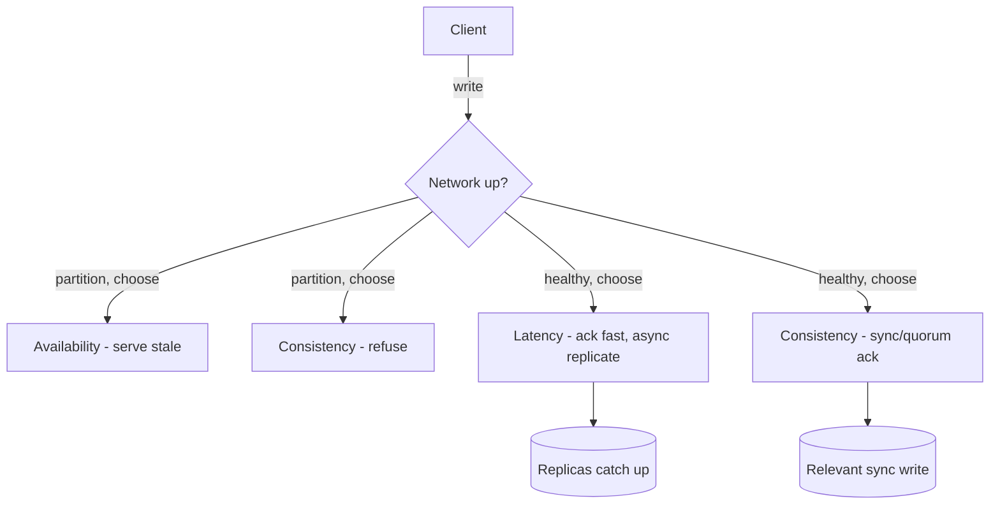

# PACELC

## 1. One-Line Definition
PACELC extends CAP: **if** there is a **P**artition, choose **A**vailability or **C**onsistency; **Else** (the other ~99.9% of the time), choose **L**atency or **C**onsistency.

## 2. Why Do We Need It?
CAP only governs the moment the network splits — which is rare. Every day, on a healthy network, you still make a real choice: replicate synchronously (consistent, higher write latency) or asynchronously (fast, occasionally stale). PACELC names that always-on trade so you can evaluate a system by what it does *normally*, not just during disasters. "The network is fine, why is my read stale?" is a PACELC question, not a CAP question.

## 3. Simple Intuition
A newsroom has two branches connected by a reliable bus (healthy network). CAP answers: "the bus breaks — do you keep publishing or stop until you agree?". PACELC answers the daily question: "the bus is fine, but every email to the other branch costs 3 seconds — do you send every update synchronously and wait, or fire-and-forget and let the other branch catch up late?" Most days you choose the fast, slightly-stale option; only for breaking news do you wait for the copy to be confirmed.

## 4. What Happens Without It?
Teams pattern-match on "CAP is lost, so everything is eventual" and pick async replication everywhere — then money ops go stale. Or they read "strong consistency is noble" and force sync everywhere, doubling every write's latency for data that never needed it. Without PACELC there is no vocabulary for the choice you make on every single write: *is near-instant ack worth a possible stale read later?*

## 5. Core Idea
- **P: if partitioned** → A or C (CAP's own fork, see [[cap-theorem|CAP Theorem]]).
- **A: else (healthy net)** → L (latency) or C (consistency). This is the part CAP misses.
  - **E + C:** synchronous replication / quorum writes — durable and consistent, but you wait for the slowest participant. Slow writes, more lock/serialization.
  - **E + L:** async replication / local fast ack — low latency, but reads on another node may be stale (bounded by replication lag).
- The letters are per-operation, not per-system: a store can do E, L, C per read-type — synchronous for balances, asynchronous for profile views.
- **Reading PACELC strings:** "AP/EL" = partition → availability; else → latency (Cassandra default, DynamoDB-style). "CP/EC" = partition → consistency; else → consistency (Spanner, Zookeeper, single-writer systems). "CP/EL" = partition → consistency (quorum); else → low-latency reads (many quorum systems with tuned R/W).
- Distinguish the two axes: **P/A vs P/C** is about *serving correctly while cut off*; **E/L vs E/C** is about *how long you wait before acking a write* and *how fresh reads you accept*.

## 6. Important Terminology

| Term | Simple Meaning |
|------|----------------|
| Partition (P) | Network split; nodes can't talk |
| A / C (after P) | Serve anyway vs refuse to serve stale |
| E (else) | Healthy network, the normal case |
| L / C (after E) | Fast ack (stale possible) vs wait for consistency |
| Sync replication | Write ack waits for a replica copy |
| Quorum write | Ack after W of N nodes confirm |
| Async replication | Ack immediately; replicas catch up |

## 7. Basic Architecture



## 8. Request or Data Flow
1. **Healthy network, latency choice (E+L):** a write lands on a local node, acks immediately, and a background changestream ships it to replicas. A subsequent read on another node may lag (or miss) it.
2. **Healthy network, consistency choice (E+C):** the write waits for the local commit *plus* synchronous confirmation from ≥1 replica (or a quorum). Reads on any confirmed replica see it.
3. **Partition (P):** if quorum lost, the CP side refuses writes on the minority side; the AP side keeps serving and records the conflict for later resolution (see [[conflict-resolution|Conflict Resolution (LWW / Version Vectors)]]).
4. **Recovery:** the partition heals; lagging replicas catch up (AS read repair), or conflicts resolve.

## 9. Practical Example
An API with 1 leader + 2 replicas in us-east, 2 replicas in eu-west (async cross-region).
- **Profile reads** → E+L: read any replica, may lag 50-200 ms. Users don't notice.
- **Cart total** → E+C within region: quorum read R, W within the region, so a "removed item" is never re-shown. Adds ~10-30 ms.
- **Payment balance** → partition-averse and consistent: writes wait for regional quorum *and* async to eu-west; during a cross-Atlantic partition you take C: decline or queue, never fail and never double-apply.
- Costs: the E+C payment write adds cross-region or multi-node latency each time — roughly the price of a cross-DC round trip per money write.

## 10. Scaling
- As nodes grow, E+C costs grow: waiting on K writes to N nodes scales total latency by the slowest participant, not the average. Mitigate: quorum (W disk, leave R light), semi-sync (wait for 1), locality-aware quorums (within the same AZ), and keep cross-region replication async.
- Read scaling pressures toward E+L (serve from any replica). If the product additionally needs freshness, use bounded staleness (see [[consistency-models|Consistency Models (Read-After-Write / Monotonic)]]) rather than dragging all replicas to synchronous.
- Both choices are per-tenant/per-read override, so large-scale systems mix them cleanly — the tricky part is *enforcing* the routing (a read tagged "consistent" must really hit the fresh node). Use quotas and latency budgets to keep the mix from congealing into globally-sync.

## 11. Reliability and Failure Scenarios

| Failure | What Happens | Detection | Recovery | Trade-off |
|---------|--------------|-----------|----------|-----------|
| Replica lags after E+L write | Stale reads appear | Lag metric | Re-route reads, bounded staleness | latency vs freshness |
| Quorum lost (partition) | CP: writes refused; AP: serve + resolve | Partition/quorum health | Heal net, reconcile conflicts | availability vs consistency |
| Sync replica down in E+C | Writes stall until timeout | Sync-ack timer | Semi-sync: fall back to another replica | durability headroom |
| Region partition | Cross-region reads stale/refused | Region health | CP: refuse; AP: serve local | RPO on cutover |

## 12. Consistency and Correctness
- E+C ≠ linearizable automatically; it means *the same quorum confirms the write and the read* (R+W > N) and versions are compared (see [[quorum|Quorum / Majority Consensus]]).
- E+L still provides order guarantees per replica; user-visible "back in time" flicker appears when reads hop replicas — monotonic read fixes that (see [[consistency-models|Consistency Models (Read-After-Write / Monotonic)]]).
- During partitions, an AP system must *store* the conflict, never silently drop it: LWW or version vectors decide which write wins later (see [[conflict-resolution|Conflict Resolution (LWW / Version Vectors)]]).
- Idempotency matters: an E+L retried write can double-apply on a lagging replica; key writes by id (see [[idempotency|Idempotency]]).

## 13. Performance
- E+L write: 1 round trip locally (ms). E+C/quorum write: N participants' and the slowest of them (adds 5-50 ms intra-AZ, 50-300 ms cross-DC).
- Quorum read (E+C) vs local read (E+L): roughly 1-3x latency, depending on R.
- Throughput: E+C serializes more (locking, confirm-waiting), so peak QPS drops; E+L scales with replicas.
- Net: spend E+C only on the small set of writes/reads that truly need it; the 99% E+L path keeps tail latency flat.

## 14. Security
Splitting reads between "consistent" and "async" paths is a correctness-routing concern, not an auth concern — but the consistent path must never bypass tenant isolation: a quorum read across shards (see [[cross-shard-queries|Cross-Shard Queries and Transactions]]) still must be scoped to the caller's tenant. Ensure the tagged-consistent path verifies identity identically to the async path, or you leak privileged data through the "fast" route.

## 15. Trade-Offs

| Choice | Advantages | Disadvantages | When to Use |
|--------|------------|---------------|-------------|
| Partition → A (AP) | Always serves, write-anywhere | Stale reads, conflicts, lost-reader surprises | Content, feeds, carts |
| Partition → C (CP) | Never reads/writes stale | Refuses during splits (minority downtime) | Money, inventory, coordination |
| Else → L | Fast, cheap, scales reads | Stale reads possible | Most reads/writes |
| Else → C | Fresh for everyone | Slow writes, lower throughput | Balances, locks, tickets |
| Mixed per-op | Right price per op | Routing complexity, invariants to defend | Any mature platform |

## 16. Common Mistakes
- Treating CAP as the whole story and ignoring that E/L-vs-C is the day-to-day decision.
- Choosing sync replication *everywhere* "for consistency", tripling average write latency on data nobody reads critically.
- Choosing async everywhere and calling it "CP when it matters" — without the actual quorum path, it stays eventual even on a healthy net.
- Believing one global PACELC label per system; the real design is per-operation.
- Forgetting that "E+C" only works if reads are also routed to the fresh path — a stale-async read behind a consistent write defeats the point.

## 17. HLD vs LLD Boundary
HLD: which operations get P/C vs P/A and E/C vs E/L labels; quorum sizes per data class; cross-region policy. LLD: the router code that consumes the per-op label, the sync-ack timeout in one DB driver, the config flag flipping a class from E+L to E+C.

## 18. Interview Questions

### Beginner
- What does PACELC add beyond CAP?
- When the network is healthy, what choice does PACELC say you still have to make?

### Intermediate
- A payments team demands sync replication on every write because of CAP. Respond with PACELC.
- Label a system as AP/EL vs CP/EC and explain the daily behavior of each.

### Advanced
- How do you mix E+C and E+L on the same dataset without the consistent path ever reading stale replicas?
- Your quorum writes cost 60 ms more. Where do you spend that budget first, and how do you verify the "consistent" read path is really consistent?

## 19. Interview Memory Summary

> [!abstract]- Interview Memory Summary
> ### Remember
> - PACELC: if Partition → Availability or Consistency; Else → Latency or Consistency.
> - CAP covers the rare split; PACELC covers the everyday healthy-network trade.
> - E + L = async, fast, possibly stale; E + C = sync/quorum, slower, fresh.
> - The label is per-operation, never "the system is AP having crashed".
> - AP/EL ≈ Cassandra/DynamoDB-style; CP/EC ≈ Spanner/Zookeeper-style.
> - E+C needs the read path to actually go to the fresh quorum, else it's theater.
> ### 30-Second Explanation
> PACELC says: when the network partitions, use CAP (choose availability or consistency for that emergency); the rest of the time — the vast majority — choose between latency (ack now, replicate async, accept stale reads) and consistency (sync/quorum, pay latency). Apply the choice per operation: async for feeds, sync for balances, and never assume a single system-wide label.
> ### Interview Traps
> - Answering "what does your DB do during a partition" when the interviewer asked what it does *normally*.
> - Claiming CP/EC while routees read stale replicas during normal operation.
> - Saying "sync everywhere" without sizing the latency/throughput tax.
> - Forgetting PACELC governs the always-on case, CAP the rare one.
> ### Key Trade-Off
> On a healthy network you trade write/read latency for freshness — usually a little coordination buys the exact freshness each operation needs, and the art is spending it only where it pays.

## 20. Related Concepts

### Prerequisites

- [[cap-theorem|CAP Theorem]] — the partition fork PACELC starts from
- [[strong-vs-eventual-consistency|Strong vs Eventual Consistency]] — the C endpoint of both forks

### Commonly Used Together

- [[consistency-models|Consistency Models (Read-After-Write / Monotonic)]] — how to get freshness on the E+L path cheaply
- [[quorum|Quorum / Majority Consensus]] — the E+C mechanics
- [[replication-lag|Replication Lag]] — the E+L honesty policy

### Alternatives

- [[cap-theorem|CAP Theorem]] — when the discussion is specifically about partitions, not normal ops
- [[global-consistency|Global Consistency]] — the hard case of E+C across regions

### Advanced Concepts

- [[database-replication|Database Replication]]
- [[cross-region-replication|Cross-Region Replication]]

Related planned topics (not authored yet): consistency (01 fundamentals), isolation levels (07 databases).

## 21. References
Daniel Abadi, "Consistency Tradeoffs in Modern Distributed Database System Design" (the PACELC blog post and paper). Kleppmann, *Designing Data-Intensive Applications*, ch. 5 for sync/async replication. Cross-check current labels with vendor docs (Cassandra, DynamoDB, Spanner).

## 22. Active Recall

Test yourself before revealing each answer.

> [!question]- What does PACELC say that CAP does not?
> CAP only covers the partitioned moment (A or C). PACELC adds the Else clause: on a healthy network you still choose Latency (async, ack fast, read may be stale) or Consistency (sync/quorum, pay latency). That is the daily trade every replicated system makes.

> [!question]- Label these systems and their daily behavior: a quorum store failing safe on partition, and a multi-leader store that always serves.
> The first is CP/EC (partition → refuse rather than stale; healthy → synchronous/quorum writes). The second is AP/EL (partition → keep serving and resolve conflicts later; healthy → low-latency async replication with eventually-consistent reads).

> [!question]- Trade-off: write latency vs staleness on a healthy network. When do you pick E+C for a write?
> E+C (sync/quorum) buys freshness and durability but adds the slowest-node latency to every write and lowers peak throughput. Pay it only where staleness is dangerous or user-visible-in-bad-ways: balances, inventory, payment status, lock state. Elsewhere E+L plus bounded staleness is nearly always the cheaper ride.

> [!question]- Failure scenario: a cross-DC partition with an async copy on the far side. What must an AP system remember to do?
> Conflict resolution, not silent dropping: record which writes happened on each side, store them, and on heal apply a deterministic merge policy (LWW or version vectors — see conflict-resolution), so reconciliation is possible and no acknowledged write vanishes.

> [!question]- Design decision: how do you mix E+C and E+L reads over one dataset?
> Tag each operation with its required model and route reads accordingly: consistent reads go to the quorum/leader path; latency reads go to any fresh-enough replica. Enforce freshness at the read layer (token/sequence compare, bounded staleness) so the "consistent" tag always lands on a node that has the write. Size the consistent path's query budget — it will carry the leader/quorum load.

> [!question]- Interview scenario: "Should our entire API wait on synchronous replication so nothing is ever stale?"
> No. That's buying E+C for every read when ~99% only need E+L. Split the workload: money/inventory ops go sync or quorum; feeds, profiles, and analytics go async with bounded staleness and monotonic-session reads. Estimate the added latency (slowest-node round trips) and the throughput loss so the "never stale" promise is costed honestly.

## 23. When Should I Use This?

### Use it when

- You are choosing replication modes (sync/async), quorum sizes, or cross-region write paths for a new service.
- You need vocabulary to discuss "green network staleness" in design reviews.
- Data classes genuinely differ — money vs profiles — and you want per-class guarantees.

### Avoid it when

- The cluster is a single primary with synchronous, same-DC replicas: the E fork is already trivial.
- The product genuinely needs absolute global freshness: you are really designing for linearizability, and PACELC is just the framing.
- The team can't enforce per-op routing — labels on paper become bugs in practice.

### What problem does it solve?

It exposes and costs the always-on trade between latency and consistency that CAP ignores, so replication modes and quorum policies are chosen per operation instead of by vibe.

### What problem does it NOT solve?

Deciding *which* operations truly need consistency (a product question), how to resolve conflicts when AP side settled (see conflict-resolution), or how to keep global multi-region strong (see global-consistency). PACELC names the fork; it does not pick your lane.

## 24. Decision Connections

- [[cap-theorem|CAP Theorem]] — the P-fork that PACELC extends; read CAP first.
- [[database-replication|Database Replication]] — sync/async modes are the E-fork in practice.
- [[quorum|Quorum / Majority Consensus]] — the mechanics of picking C on a healthy net.
- [[consistency-models|Consistency Models (Read-After-Write / Monotonic)]] — cheap freshness when you chose E+L.
- [[replication-lag|Replication Lag]] — the E+L dishonesty metric; measure it.
- [[conflict-resolution|Conflict Resolution (LWW / Version Vectors)]] — what the A in AP must store for later.
- [[cross-region-replication|Cross-Region Replication]] — E/C across regions is the expensive extreme.

Decision tree:

```
A write arrives.
    |
    +-- Network partitioned now?
    |      → [[cap-theorem|CAP Theorem]]
    |         +-- Serve it anyway, resolve later?  → A (AP)
    |         +-- Refuse rather than go stale?     → C (CP)
    |
    +-- Network healthy (the normal case)?
    |      → [[quorum|Quorum / Majority Consensus]]
    |         +-- Freshness/durability critical (money, locks)?
    |         |      → E+C: sync/quorum write, fresher reads
    |         +-- Latency is king (feeds, profiles)?
    |                → E+L: async write, [[consistency-models|Consistency Models (Read-After-Write / Monotonic)]]
    |
    +-- Reads must still feel fresh on E+L?
           → bounded staleness + monotonic session reads
```