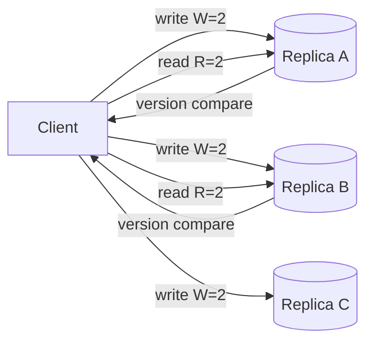

# Quorum / Majority Consensus

## 1. One-Line Definition
A quorum is a configuration where writes must be acknowledged by W of N replicas and reads must consult R of N replicas, and when R + W > N, any read is guaranteed to see the latest acknowledged write.

## 2. Why Do We Need It?
You cannot both fail safely and stay strongly consistent with plain leader-replica setups: async replication loses ack'd writes on leader failure, and sync-all replication fails the moment any replica is slow. Quorums give a *tunable* middle — e.g., 3/5 replicas — that tolerates 2 failures while still guaranteeing no two majorities diverge. It is the arithmetic underneath most consistent distributed stores, leader election, and consensus algorithms.

## 3. Simple Intuition
Five judges must decide a verdict. "Quorum" = 3 votes. To pass a sentence and to review one, both sides must collect 3 judges. Since any two groups of 3 judges always share at least one judge (3+3 > 5), nobody can pass a sentence that a later review hasn't heard of — there is always overlap. The overlap is the memory: the shared judge remembers what was decided.

## 4. What Happens Without It?
- **Async single-leader:** the leader acks a write, dies before replicating, the new leader never sees it — the acknowledged write is silently lost (RPO 0 violation).
- **Wait-for-all:** one slow/dead replica blocks every write.
- **No quorum read:** reads hit replicas that never saw the latest ack'd write, so "read-your-writes" fails invisibly.
Without quorum rules you either lose acknowledged data or freeze on the first slow node.

## 5. Core Idea
- **Numbers:** with N replicas: write succeeds at W, read returns from R. If R + W > N, some replica overlaps both sets, so a read always sees at least the latest write acknowledged. Danger: R + W ≤ N (e.g., W=1, R=1 with N=3) — reads and writes can miss each other entirely.
- **Majority quorum:** W = R = floor(N/2) + 1. Examples: N=3 → 2/2; N=5 → 3/3. Tolerates N − W = 1 or 2 failures respectively and guarantees No-Fork (two conflicting decisions can't each win a majority).
- **Tuning W/R:** lowering W makes writes faster and more available; lowering R makes reads faster; keep R+W > N. Common: W=N−1, R=1 (fast reads, still safe) or W=1, R=N (fast writes, slow reads).
- **More than the count:** R+W>N alone isn't enough.
  - Replicas must **compare versions** (a fake-fresh node with no data is useless) — see [[clocks-and-ordering|Logical / Lamport / Vector Clocks]] and [[conflict-resolution|Conflict Resolution (LWW / Version Vectors)]].
  - Replicas must be **caught up** to the write they ack'd (sync-log or the ack is a lie).
  - Losing *tie-break* deterministic: if R reads give two versions, return the newest by version.
- **Sloppy quorum:** when the true owners are unreachable, let any live node temporarily count toward W/R, with hinted handoff back later. This restores availability at the cost of weak consistency (Cassandra's default under partition).
- **Read repair / anti-entropy:** stale replicas fix themselves by re-fetching from newer ones on read or in background, so quorums don't rot.

## 6. Important Terminology

| Term | Simple Meaning |
|------|----------------|
| N / W / R | Replica count / write acks read / read nodes |
| R + W > N | The safety inequality: overlap guaranteed |
| Majority quorum | floor(N/2)+1 nodes; can't have two |
| Sloppy quorum | Temporary outsiders count; later hand back |
| Hinted handoff | Write parked on a live node for the owner |
| Read repair | A stale replica refreshed during a read |
| Quorum intersection | The shared replica that knows both versions |

## 7. Basic Architecture



N=3, W=2, R=2. The midpoint pairs always share a replica.

## 8. Request or Data Flow
1. **Write:** the coordinator sends the write to all N replicas (or a selection), waits for W confirmations including a durable local commit.
2. **Read:** the coordinator queries R replicas, collects their stored version numbers, returns the reply with the highest version (the one a write majority must have touched).
3. **Repair:** read repair fills any replica that answered with an older version; hinted handoff resurfaces once the true owners return.
4. **Conflicts:** if two replies carry equal version but different data (both written concurrently), the system must trace causality — see [[conflict-resolution|Conflict Resolution (LWW / Version Vectors)]].

## 9. Practical Example
A 3-node replica set, W=2, R=2.
- Write X=5 acks on A and B. C is down. Read hits B and C: C is stale, B has 5 → return 5. Safe: A or B always hold the truth; C alone is never enough to answer R=2.
- Now W=1 (fast) with R=1: a write lands only on C, a read hits only A → the read sees nothing. Two quorums missed each other: R+W = 2 ≤ N = 3. This is the classic "replication lag ate my write" bug.
- Sloppy quorum: partition isolates A and B; the write stays available by landing on R (an unrelated live node) with an explicit "hinted" marker, and reconciles via version compare after heal.

## 10. Scaling
- **Latency grows with distance:** the coordinator waits for the slowest of W/R participants. Keep quorums inside an AZ; use async for cross-region copies (see [[cross-region-replication|Cross-Region Replication]]).
- **More replicas, not more quorum size:** N=3,5 are the common sweet spots; going N=7 → W,R=4 for stronger failure tolerance but more coordination.
- **Local-read / remote-write split:** R=1 local, W=global quorum gives fast, always-fresh reads at one site, with cross-DC write cost.
- **Metadata and leader election:** majority is also the rule for picking a single leader; two candidate leaders can't both win a majority — the missing link to [[split-brain|Split Brain]].

## 11. Reliability and Failure Scenarios

| Failure | What Happens | Detection | Recovery | Trade-off |
|---------|--------------|-----------|----------|-----------|
| Replica down | Reads/writes still succeed if W/R met | Health checks | Repair to catch up (read repair/antientropy) | none, if quorum intacts |
| Half the cluster down | No majority → writes refused (CP) or sloppy (AP) | Quorum health | Heal network or fail over | availability vs consistency |
| Slow replica | Quorum waits for it, latency spikes | Tail-latency metric | Quarantine slow node; degrade W | consistency vs speed |
| Version tie (concurrent writes) | Both replies valid | Version compare | Deterministic resolution (LWW/vector) | lost update |

## 12. Consistency and Correctness
- R+W>N gives **linearizability only if** reads also contact a node that has the newest version and compare versions — the overlap proves it exists, the version compare finds it. Missing either, quorum reads can be stale or, worse, reorder.
- During a *session* the guarantee may weaken: R+W>N is about "latest write wins," not about ordering across clients. Add quorum reads for serializable transactions at the coordinator if cross-key invariants matter.
- Sloppy quorum breaks the overlap property: hinted writes returned to a read may be missing. Accept this only for best-effort data and treat reconciliation as eventual.
- Idempotency: a client retry multiplying the same version must be caught by the version compare, else double-application (see [[idempotency|Idempotency]]).

## 13. Performance
- Write cost: 1 coordinator round trip + worst-of-W participant latency (intra-AZ 0.5-5 ms each). Reads: worst-of-R.
- The coordinator does the math — it's cheap; the real expense is waiting on the slowest participant, so tail latency of the replica pool drives the tail of every quorum op.
- Throughput scales with total replicas only if replicas are *read-eligible*; heavy writers will serialize on the coordinator.
- Cross-DC quorum easily triples p99: keep the C-side inside one DC.

## 14. Security
Quorum messages travel authenticated and (ideally) encrypted (mTLS) — a fake node that can join the quorum can vote a bogus version into the ledger. Credentials per replica, rotation, and hard ACLs on join confirmations are the defensive layout. Also: quorum decisions must be signed/versioned if the system exposes them to clients.

## 15. Trade-Offs

| Choice | Advantages | Disadvantages | When to Use |
|--------|------------|---------------|-------------|
| W=N, R=1 | Read-max latency | Every write waits for all | Tiny static sets |
| W=N−1, R=1 | Fast reads, safe | Slow write (waits for all but one) | Read-heavy |
| W=1, R=N | Fast writes | Slow reads, read-mostly | Write-heavy queues |
| 2/3 quorum | Balanced, fail-1 | Coordination on both paths | The default |
| 3/5 quorum | Fail-2 | More coordination | Critical infra |
| Sloppy quorum | Survival under partition | Weak guarantee, hints | Best-effort AP |

## 16. Common Mistakes
- Believing R+W>N automatically gives linearizability — the version-compare on read is the other half.
- Picking W=N−1 "for safety" and destroying write availability (any one slow node blocks everything).
- Using quorum numbers but leaving one replica async-hidden (ack'd before it truly stores).
- Running even replica counts (N=2, W=2) — a single failure kills quorum and the failover story is symmetric between exactly-two peers: the classic split-brain ingredient.
- Ignoring hinted-handoff downgrade and later claiming strong consistency under partition.

## 17. HLD vs LLD Boundary
HLD: N/W/R per data class, quorum placement (same AZ vs cross-DC), sloppy-quorum policy. LLD: the coordinator's version-compare function, the timeout before a slow replica is skipped, the repair thread's backoff in one replica.

## 18. Interview Questions

### Beginner
- What does R+W>N guarantee, intuitively?
- Why does a 2-node tell-each-other setup have no safe quorum?

### Intermediate
- N=3, W=2, R=1: one node is down. Does a read return fresh data? Walk the possibilities.
- What is sloppy quorum, and when would you accept it?

### Advanced
- Does R+W>N guarantee linearizability? What's the missing piece, and what breaks without it?
- Design W/R for a read-heavy, cross-DC service where every read must be fresh but must be cheap locally.

## 19. Interview Memory Summary

> [!abstract]- Interview Memory Summary
> ### Remember
> - R+W>N: reads and writes always share ≥1 replica → reads see latest ack'd write.
> - Majority = floor(N/2)+1; two majorities can't coexist → no divergent leaders.
> - Tune W/R per load: W=1 fast writes, R=1 fast reads, keep the sum > N.
> - Version compare on read is required for true freshness — overlap alone isn't enough.
> - Sloppy quorum trades consistency for availability under partition, with hinted handoff.
> - Read repair + anti-entropy keep lagging replicas from rotting the pool.
> - Even N is dangerous: no majority exists if N/2 dies.
> ### 30-Second Explanation
> Replication sets state across N nodes; make writes need W acks and reads consult R nodes with R+W>N. Any read then intersects any write's majority, so it can find the newest version and serve it. Tune the numbers for your latency and availability budget, compare versions on read, and reconcile via read repair; reserve sloppy quorum for AP moments.
> ### Interview Traps
> - Claiming R+W>N ⇒ linearizable without the version-compare step.
> - 2-node clusters: no quorum logic, pure split-brain bait.
> - W=N−1 "writes are safe": they stall the moment one node blinks.
> - Forgetting risk of stale hinted region after a sloppy quorum.
> ### Key Trade-Off
> A quorum buys strong-enough consistency and N/2 failure tolerance at the price of the slowest participant's latency on every operation — the classic consistency-availability-latency sliding knob.

## 20. Related Concepts

### Prerequisites

- [[cap-theorem|CAP Theorem]] — why quorums exist: partitions forced the choice
- [[database-replication|Database Replication]] — the replica substrate quorums configure

### Commonly Used Together

- [[strong-vs-eventual-consistency|Strong vs Eventual Consistency]] — what R+W>N delivers on the strong end
- [[pacelc|PACELC]] — the E/C side: healthy-network quorum choices
- [[conflict-resolution|Conflict Resolution (LWW / Version Vectors)]] — handling ties a quorum can't break
- [[failover|Failover]] — majority is how a new leader is safely chosen

### Alternatives

- [[raft-and-paxos|Raft and Paxos]] — full consensus (leader + logs) where quorum voting isn't enough
- [[strong-vs-eventual-consistency|Strong vs Eventual Consistency]] — eventual consistency when stale is fine

### Advanced Concepts

- [[consensus|Consensus]]
- [[split-brain|Split Brain]] — the failure quorums exist to prevent
- [[global-consistency|Global Consistency]]

## 21. References
Kleppmann, *Designing Data-Intensive Applications*, ch. 5 (§ quorum consistency). DeCandia et al., "Dynamo: Amazon's Highly Available Key-value Store" (SOSP 2007) — sloppy quorum, hinted handoff, read repair. Cassandra docs on consistency levels (QUORUM, EACH_QUORUM, LOCAL_QUORUM).

## 22. Active Recall

Test yourself before revealing each answer.

> [!question]- Explain quorum intersection in one sentence with the judge analogy.
> Writes collect W votes, reads collect R votes; when R+W>N any two vote groups share a member, so a read's favorite group always contains someone who saw the latest write — the shared judge has the memory.

> [!question]- N=5. What's W and R for a standard majority, and how many node failures can you tolerate?
> W=R=3 (floor(5/2)+1). You tolerate N−W=2 failed nodes while still writing; a read needs 3 nodes up, so you also tolerate 2 down on read. One majority always overlaps another.

> [!question]- Design decision: you need fast writes and fresh reads with N=3 and zero coordinator overhead. What W/R do you pick and why is it safe?
> W=2, R=2 is the honest 2-of-3 majority: writes survive one replica down, reads are guaranteed to intersect a write majority, cheap enough (wait for the 2 fastest of 3). If you can't afford R=2 reads, W=N−1=2, R=1 also works — reads hit one node but the write majority of 2 ensures everyone-read nodes are fresh... except every read still must version-compare against the newest.

> [!question]- Trade-off: why not set W=N−1=2 with N=3 for "maximum safety"?
> You buy one more ack (slower, any one slow node stalls writes) for no extra guarantee at R=1: reads still need the version compare, and durability is already assured at W=2 of 3. The only gain is living through a second crash, which N=3+quorum already covers minimally.

> [!question]- Failure scenario: a partition leaves 2 of 3 nodes unreachable. What does a strict quorum do vs a sloppy one?
> Strict: no majority → refuse new writes (CP) until the third node returns; availability = 0 for new writes but no divergence. Sloppy: accept the write on any live node with a hinted-handoff marker, serve now and replay to the owner later — availability preserved, overlap guarantee lost. So it's exactly the CAP fork cast in replica-count arithmetic.

> [!question]- Interview scenario: a senior says "we use R=1, W=1 with 3 replicas, it reads fast and everyone's happy." Respond.
> That's hidden R+W≤N: the read may query the one node that never saw an ack'd write: acknowledged writes get lost to reads, and the p99 is only fast because correctness is being discarded. Either raise the quorum or be explicit that this is an eventual-consistency system with a 33% chance of stale reads on any op.

## 23. When Should I Use This?

### Use it when

- You need strong-ish, always-fresh operations that survive a replica (or two) dying.
- A tunable price is better than an all-or-nothing one: read-heavy or write-heavy stacks each get their own W/R.
- Leader election / fencing / distributed lock safety needs a "can't be two leaders" rule (see [[split-brain|Split Brain]]).
- Partitions are worth surviving without losing acknowledged data.

### Avoid it when

- The data is tolerantly eventual and writes must be minimum-latency: quorum is overkill; async with bounded staleness (see [[consistency-models|Consistency Models (Read-After-Write / Monotonic)]]) fits.
- The set is a single primary with tiny data: plain sync replication already does it.
- Your replicas are geo-spread and quorum-borne: cross-DC quorum latency dominates; prefer region-local quorum + cross-region async.

### What problem does it solve?

It puts a precise, tunable contract on replication: how many failures you survive, how fast writes/reads are, and how fresh reads get — all from two small integers and a version-compare.

### What problem does it NOT solve?

It doesn't give total *order* across keys, transactional atomicity across keys, or safety under sloppy-quorum moments; these need consensus/Raft (see [[raft-and-paxos|Raft and Paxos]]), distributed transactions, or deterministic conflict resolution respectively.

## 24. Decision Connections

- [[cap-theorem|CAP Theorem]] — quorums are the CP tool; the partition fork is where they act.
- [[pacelc|PACELC]] — on a healthy net, quorum = the E/C choice costed in latency.
- [[failover|Failover]] — majority voting is how failover picks exactly one new leader.
- [[split-brain|Split Brain]] — the failure quorums exist to prevent; two veins can't both win a majority.
- [[consensus|Consensus]] and [[raft-and-paxos|Raft and Paxos]] — what you reach for when one round of quorum votes isn't enough.
- [[conflict-resolution|Conflict Resolution (LWW / Version Vectors)]] — tie-handling when quorum reads return two valid versions.

Decision tree:

```
Need replicated writes that survive failure?
    |
    +-- Fresh reads matter more than write latency?
    |      → R=1, W=N-1 (e.g., 2 of 3)
    |
    +-- Write latency matters more?
    |      → W=1, R=N (e.g., 1 of 3), with [[cross-region-replication|Cross-Region Replication]] for recovery
    |
    +-- Balanced, must survive a failure?
    |      → majority: W=R=floor(N/2)+1 (2 of 3, 3 of 5)
    |         |
    |         +-- Can't reach majority under partition?
    |         |      → [[split-brain|Split Brain]] risk; refuse (CP) or sloppy quorum (AP)
    |         +-- Need full order/deterministic progress?
    |                → [[raft-and-paxos|Raft and Paxos]] / [[consensus|Consensus]]
    |
    +-- Every op must see each other's writes, not just the latest?
           → quorum reads within distributed transactions (see [[distributed-transactions|Distributed Transactions]])
```