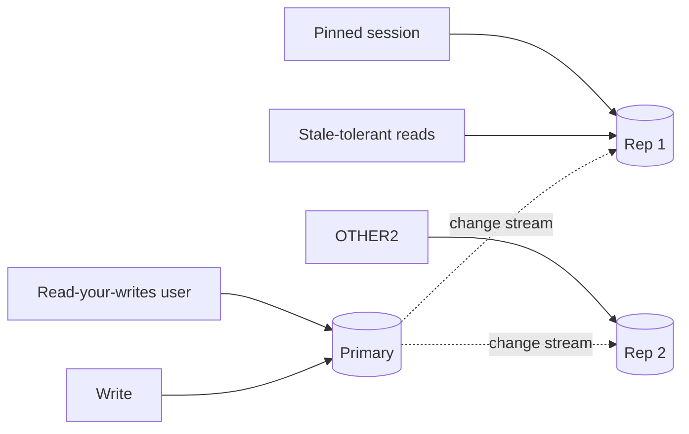

# Replication Lag

## 1. One-Line Definition
Replication lag is the delay between a write being committed on the primary and it being visible on a read replica.

## 2. Why Do We Need It?
Lag is the tax you pay for read scaling. Every read-distribution decision (route to replica or leader), every staleness bug, every "why did I see old data" ticket, and every consistency requirement traces back to understanding and controlling this one number.

## 3. Simple Intuition
The primary is the live TV broadcast; replicas are the delayed feeds — same content, minutes (or ms) behind. Viewers on the delayed feed see yesterday's score until the feed catches up. How far behind depends on how fast the pipeline can replay.

## 4. What Happens Without It?
Reads served from a replica say "order created!" right after a write to the primary → user refreshes → order gone ("it vanished!"). Feed pages flicker backward. Fraud checks read stale balances. You can't reason about consistency because you never measured the lag.

## 5. Core Idea
- **Where lag comes from:** write → WAL/binlog → apply on follower (network, follower CPU, follower disk contention, batch size). Lag = accumulated backlog/(apply rate).
- **Measure it:** lag in time/bytes/ops (each DB exposes it); pick the metric that tracks freshness you care about.
- **Under load:** lag grows under follower bottlenecks (replicas running heavy queries) and shrinking resources.
- **Effects:**
  - **Read-your-writes breaks** — your own write invisible on a replica instant.
  - **Monotonic break** — random replica routing can show "newer then older."
  - **Causal break** — comment appears before the post.

**Controlling lag:**
1. **Pin reads per session/user** to one replica (monotonic + read-your-writes-ish).
2. **Prime reads to leader** when freshness matters (pay write-load).
3. **Cooldown/holding** — wait for catch-up (bounded lag) while polling.
4. **Replica separation** — don't run heavy analytics on serving replicas.
5. **Faster apply** — more/smaller replicas, dedicated apply workers, faster storage.

## 6. Important Terminology

| Term | Simple Meaning |
|------|----------------|
| Lag | Primary-to-replica freshness gap |
| WAL / binlog | The change stream applied on followers |
| Read-your-writes | Own write visible on your next read |
| Monotonic reads | Never regress to an older state |
| Causal consistency | Cause-before-effect ordering |
| Session pinning | Fix a session to one replica |
| Catch-up | Followers applying backlog after a burst |

## 7. Basic Architecture



## 8. Request or Data Flow
1. Write commits on primary, appended to change stream.
2. Follower applies via async/sync shipping (async = lag appears immediately).
3. Read routing decides: fresh-critical → primary (or wait-for-lag); tolerant → any replica.
4. Monitoring watches lag per replica and alerts when it exceeds the staleness SLO.

## 9. Practical Example
**Social feed (assumptions):** post → write to primary; timeline reads → replicas.
- Lag target: < 2s p95. If lag > 5s: route reads to primary for that user temporarily.
- For "my own posts" the user reads are pinned to a replica and lag is enforced by reading the primary when under the write just happened.
- Monitoring: lag metric + read-freshness SLO (percent of reads older than X).

## 10. Scaling
- More replicas == more apply-work duplication, NOT more lag; the physical apply cost is per node.
- Heavy replica CPU (analytics, unindexed scans) spikes lag → separate read workloads per node or use dedicated analytic stores.
- Bursts (viral moments) spike lag by design — have a **cooldown story** (bounded-lag wait) rather than surprise.

## 11. Reliability and Failure Scenarios

| Situation | What Happens | Detection | Recovery | Trade-off |
|-----------|--------------|-----------|----------|-----------|
| Follower overloaded | Lag climbs | Lag metric | Shed non-critical reads, add replica | cost |
| Network slow/broken | Stream stalls | Lag/stream alerts | Automatic reconnect, backfill | temporary staleness |
| Burst writes | Instant lag | Lag spike | Wait/pin reads to primary temporarily | write-load on leader |
| Analytics on replica | Chronic lag | CPU + lag | Dedicated analytics store | extra infra |
| Follower crash | Replica unavailable (not laggy, just down) | Health check | Rebuild from snapshot + catch up | resync time |

## 12. Consistency and Correctness
Lag is the *physical* picture; consistency models are the *logical* guarantees:
- Strong consistency: read primary/quorum — lag irrelevant.
- Read-your-writes: pin your writes; enforce via replica pin or leader-read-after-write.
- Monotonic: pin per session to one replica (random routing = monotonicity breaker).
- Causal: check precondition existence before showing related data (user may see "comment without post").

## 13. Performance
- Cost of pinned reads = added load on a single replica; of leader reads = primary bottleneck.
- Fast apply needs enough follower CPU/disk; batching raise throughput at small latency cost to each fresh read.

## 14. Security
Lag-contaminated data can bypass security: token revocation, bans, and rate-limit state read from stale replicas → honor the *latest* state (read from leader/quorum) or the abuse slips through. Security-critical reads: never eventually-consistent by accident.

## 15. Trade-Offs

| Choice | Advantages | Disadvantages | When to Use |
|--------|------------|---------------|-------------|
| All reads leader | Zero lag | Primary bottleneck | Tiny read scale / strict money |
| All reads replicas | Cheap scale | Stale, broken RYW | Tolerant analytics |
| Pinned session | Monotonic + RYW-ish | Load skew | Async push benchmarks |
| Bounded-lag wait | Correct + scalable | Adds latency | Read-your-writes w/o leader load |
| Freshness SLO + routing | Balance | Ops complexity | Mature product |

## 16. Common Mistakes
- Claiming "replicas are as fresh as the primary."
- Storing the lag in bytes and reasoning about it as seconds.
- Routing the user's *own writes* to a replica immediately after writing (RYW violation).
- Random per-request replica selection → monotonicity "back in time" bugs.
- Letting heavy batch/analytics join serving replicas (lag feedback loop).

## 17. HLD vs LLD Boundary
HLD: read routing policy (fresh vs tolerant vs pinned), freshness SLO, lag monitoring, replica separation. LLD: the specific pin/hold logic in a DAO, client-side lag check implementation.

## 18. Interview Questions

### Beginner
- What does replication lag mean?
- Why does random replica routing cause "back in time" bugs?

### Intermediate
- User edits a profile then immediately reads it and gets the old one. Diagnose and fix.
- How do you enforce a freshness SLO on a multi-replica read-heavy service?

### Advanced
- A follower lags 40s under a burst; design the read path so no user sees broken reads at any moment.
- How do you keep lag low while running analytics alongside hot-path queries on the same DB tier?

## 19. Interview Memory Summary

> [!abstract]- Interview Memory Summary

### Remember

- Lag = delay between commit on primary and visibility on a replica.
- It comes from apply/network/CPU — measure it.
- It breaks read-your-writes, monotonic, and causal reads.
- Controls: pin, leader-read, bounded-lag wait, freshness SLO.
- Security-critical reads never lag by accident.
- Replica separation protects apply from analytics starvation.

### 30-Second Explanation

Pick your freshness SLO, route reads (pinned/fresh/tolerant), monitor lag per replica, and separate analytics so it can't starve apply.

### Interview Traps

- "Sync replication means zero lag everywhere" — sync secures *durability*; lag is per-read-path, not per-write-config.
- Claiming "replicas are as fresh as the primary."
- Storing lag in bytes and reasoning about it as seconds.
- Routing your user's own writes to a replica immediately after writing.
- Random per-request replica selection → monotonicity "back in time" bugs.

### Key Trade-Off

Read scaling via replicas is bought with staleness: the freshness you need (and per-read routing decisions) determines whether lag is a harmless few milliseconds or a user-visible bug — measured against a freshness SLO, not assumed away.

## 20. Related Concepts

### Prerequisites

- [[database-replication|Database Replication]]

### Commonly Used Together

- [[strong-vs-eventual-consistency|Strong vs Eventual Consistency]]
- [[failover|Failover]]

### Advanced Concepts

- [[observability|Observability]]
- [[golden-signals|Golden Signals]]
- [[sli-slo-sla|SLI / SLO / SLA]]
- [[cap-theorem|CAP Theorem]]

Related planned topics (not authored yet): consistency models, leader-follower replication.

## 21. References
Kleppmann ch. 5 (replication lag and consistency models). Verify lag metrics per engine.

## 22. Active Recall

Test yourself before revealing each answer.

> [!question]- What is replication lag and where does it come from?
> It's the delay between a write committing on the primary and appearing on a replica. Sources: network shipping, follower CPU/disk contention, and apply batching. Lag = accumulated backlog ÷ apply rate — and it grows under follower bottlenecks like heavy analytics on the replica.

> [!question]- Why does random replica routing cause "back in time" bugs?
> Different reads land on different replicas at different apply points: a user can read a newer value, then an older one from another replica — non-monotonic reads. Fix: pin each session/user to one replica so reads never regress.

> [!question]- Design decision: user edits a profile then immediately reads it back and gets the old value. Diagnose and fix.
> Read-your-writes violated: the read hit a lagging replica before the write arrived. Fixes: 1) pin the session to one replica; 2) route reads after your own write to the primary (leader-read-after-write); 3) enforce a bounded-lag wait before serving.

> [!question]- Trade-off: pinning reads to a single replica vs reading the leader for freshness.
> Pinning to one replica gives monotonic + read-your-writes-ish behavior but skews load onto that replica. Reading the leader guarantees freshness but funnels load into the primary (the write bottleneck). The middle ground is bounded-lag wait — correct, scalable, at a small latency cost.

> [!question]- Failure scenario: a follower lags 40s under a burst. How do you keep users from seeing broken reads?
> Route based on the freshness SLO: fresh-critical reads go to the primary, tolerant reads to replicas, and if lag exceeds the threshold, temporarily pin affected users' reads to the leader until the follower catches up. Never serve stale data silently for freshness-critical queries.

> [!question]- Interview scenario: "Sync replication means zero lag everywhere." How do you respond?
> Sync mode secures *durability* (the write exists on a follower before ack), and even then only as far as that follower — it doesn't make reads served elsewhere fresh. Lag is per-read-path: wherever you route reads can be stale. Freshness is a routing decision, not a write-config decision.

## 23. When Should I Use This?

### Use it when

- You scale reads with replicas and must reason about how stale they are.
- User-visible correctness (read-your-writes, monotonicity) depends on read routing.
- Security-critical reads (token revocation, bans, balances) must never be stale.
- You need a freshness SLO per read class and lag monitoring.

### Avoid it when

- You can't measure lag (no metric) or won't set a freshness SLO.
- Every read is critical and must be fresh — just read the primary/quorum.
- Analytics run on serving replicas without separation (chronic lag).
- Random per-request replica selection stays un-fixed (monotonicity bugs).

### What problem does it solve?

Problem: read replicas cut the cost per read, but every replica trails the primary. Bottleneck: stale reads silently break read-your-writes, monotonicity, causality, and security decisions. Solution: measure lag, set a freshness SLO, and route reads correctly (pin/tolerant/leader-read/bounded-wait) so staleness stays bounded and intentional.

### What problem does it NOT solve?

It doesn't remove lag (replicas always lag, async especially), doesn't make sync replication mean instant reads everywhere (reads still route), and doesn't fix a bottlenecked follower — that needs separated workloads or more apply capacity, not routing tweaks.

## 24. Decision Connections

Decisions that go together with Replication Lag:

- [[database-replication|Database Replication]] — lag is a property of the replication setup above it.
- [[strong-vs-eventual-consistency|Strong vs Eventual Consistency]] — the guarantee side of the same staleness.
- [[failover|Failover]] — promotion must handle the lag tail (RPO).
- [[observability|Observability]] — lag is the metric you must measure continuously.
- [[golden-signals|Golden Signals]] — latency/errors that lag silently distorts.
- [[sli-slo-sla|SLI / SLO / SLA]] — the freshness SLO that turns lag into an enforceable contract.
- [[cap-theorem|CAP Theorem]] — the constraints behind why replicas lag under partitions.

Decision tree:

```
Reading from replicas
    |
    +-- Own recent write must be visible?
    |      → leader-read-after-write / pin (read-your-writes)
    |
    +-- Values must never go "back in time"?
    |      → pin session to one replica (monotonic)
    |
    +-- Heavy analytics on serving replicas?
    |      → separate read workloads ([[database-replication|Database Replication]])
    |
    +-- Staleness must be bounded by SLA?
    |      → [[sli-slo-sla|SLI / SLO / SLA]] + lag monitoring ([[observability|Observability]])
    |
    +-- Lag exceeds budget during bursts?
    |      → temporarily pin/route critical users to the leader
```