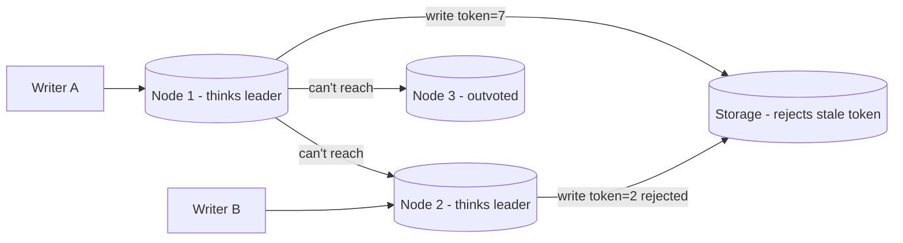

# Split Brain

## 1. One-Line Definition
Split brain is the dangerous failure where a cluster breaks into two (or more) groups that each believe they are the primary and keep accepting writes, so the dataset diverges silently until a human struggles to reconcile it.

## 2. Why Do We Need It?
The entire job of a replicated system is "exactly one writer really is the leader." Split brain is what happens when that invariant fails: two leaders both ack writes to different clients. It turns a transient network hiccup into permanent data corruption — divergent histories, conflicting orders, lost updates — and costs far more than any outage would have. Understanding it is the precondition for designing anything with failover, leader election, or distributed locks.

## 3. Simple Intuition
Two security guards watch one door after an intercom cable snaps. Guard A thinks it's his shift; guard B thinks it's his. Both start letting people in. Now nobody knows who was admitted, who was denied, or whose log is true. The door has a split brain — two authorities for one door — and the only cure is a rule that only one can ever have the authority token (and can prove it), no matter what the intercom says.

## 4. What Happens Without It?
Two "primaries" accept writes to the same key. Clients write to both; each ack's immediately. Replicas inside each faction copy the diverged histories. After the partition heals, neither side's log can be safely merged — every conflict needs a winner, someone loses writes, and the "lost" ones may have been money or orders. If the system has no quorum and no fencing, it will actively corrupt rather than merely fail. Many of the worst distributed systems incidents are split brains wearing an outage costume.

## 5. Core Idea
Split brain needs two ingredients:
1. **A real failure that looks like two states** — network partition, GC pause, slow disk, VMware-style timing — so a node can't tell "I'm the leader" from "everyone else is unreachable".
2. **A false conclusion** — the node assumes leadership/primary anyway, because detection timed out, the lease expired on one side, or fencing was never set up.

The standard preventions:
- **Majority quorum / consensus:** only a group with floor(N/2)+1 votes may elect a leader. The minority side gets no leader and stops serving writes (see [[quorum|Quorum / Majority Consensus]] and [[raft-and-paxos|Raft and Paxos]]). Two factions can't both win a majority. Odd N matters: with 2 nodes there is no "majority of 2" — the 2-node cluster is the classic split-brain machine.
- **Leases + fencing token:** the leader holds a lease (TTL) it must keep renewing. When the lease expires, the node is demoted; when it expires on one side, the other may take over. Crucially, writes carry a fencing token issued by the current leader, and the storage rejects stale tokens — so even a zombie that still thinks it's leader cannot actually write.
- **STONITH / organizational fence:** "Shoot The Other Node In The Head" — the losing side is forcibly powered off or firewalled, making the "two primaries" mess physically impossible.
- **Detection discipline:** heartbeat timeouts must be large enough to ride out GCD pauses and scheduling jitter; spurious failover *is* a split-brain seed.

The dynamic to memorize: **isolation + (stale assumption) → divergence**. Kill either the isolation (quorum/fencing make assumptions moot) or the stale assumption (no leader with an unverifiable claim), and split brain can't happen.

## 6. Important Terminology

| Term | Simple Meaning |
|------|----------------|
| Partition | Network split; nodes unreachable |
| Split brain | ≥2 groups each act as primary |
| Majority quorum | floor(N/2)+1 votes to own leadership |
| Quorum failure | Minority group refuses new writes |
| Lease | Time-bound authority token, must renew |
| Fencing token | Monotonic write credential; stale ones rejected |
| STONITH | Force-power-off the defeated node |
| Zombie leader | Node that still believes it's leader |
| Divergence | Two histories that can't be merged |

## 7. Basic Architecture



Without a majority winner, every writer is served by a different "primary" and the cluster diverges; with a fencing-aware store, the zombie's writes are refused.

## 8. Request or Data Flow
1. A partition (or a 1-second GC pause) separates Node 1 from Nodes 2 and 3.
2. Node 1's heartbeat timeout fires; Node 2 and 3 hold their own election and promote Node 2 (3 nodes, quorum = 2 — Node 2 wins).
3. Node 1, during its pause, never saw the promotion; on waking it still holds the old leader lease flag and accepts writes with an old fencing token.
4. Storage checks the token: Node 2's writes (#5, #6) are accepted, Node 1's stale-token writes are rejected. Divergence prevented — because of fencing, not because Node 1 behaved.
5. If instead the write store ignores tokens, Node 1's writes land as "authoritative" and both sides diverge. That's the split brain.

## 9. Practical Example
A 2-node failover DB (the worst case):
- Node A GC-pauses for 40 s. The LB sees no heartbeat, marks A dead, promotes B.
- B starts accepting writes. A wakes up, still thinks it's primary, accepts writes too.
- Two primaries, two logs. Heal and reconciliation reveals divergent data; one writer's acked writes get discarded. Postmortem: "we had a split brain."
- The fix: a 3rd witness node (quorum = 2 in a 3-node ensemble) or a wrapper with shared-storage fencing so only one primary holds a renewable, fence-able token. Cost is a third node (or a coordination service), which is exactly the tax you pay to keep "two primaries" impossible.

## 10. Scaling
- More nodes improve quorum math but raise coordination costs: N=5 majority needs 3 on every decision, so latency grows with the slowest confirmer. N=3 or N=5 are the practical sweet spots; higher N only for wide failure hotspots.
- The coordination service (etcd/ZooKeeper/Consul) becomes its own ensemble: same quorum/fencing rules, now as a dependency. A split-brained coordinators' fleet relights the whole system's danger.
- Heavy use of leases: ensure the lease client is a fast, low-jitter path — a slow lease-renewal pipeline on a busy node is a self-inflicted split-brain stimulus.

## 11. Reliability and Failure Scenarios

| Failure | What Happens | Detection | Recovery | Trade-off |
|---------|--------------|-----------|----------|-----------|
| 2-node partition | Both act as primary (no quorum) | Divergence detection | External fence / 3rd witness | availability vs safety |
| GC pause > heartbeat | Spurious failover + stale-write window | Heartbeat & lease metrics | Leases + fencing tokens | timeout size vs outage |
| Coordinator split | Leader selection itself diverges | Coordinator quorum health | Re-elect from the majority | coordination SPOF |
| Fencing misconfig | Zombie's stale writes accepted | Log token gaps | Enforce tokens at storage | ops discipline |
| Leader's lease not renewed | Legit leader demoted mid-session | Lease renewal alert | Failover to new majority leader | small blips |

## 12. Consistency and Correctness
- Split brain is a **liveness-vs-safety** trap: the safe system refuses writes the minority can't confirm (quorum), trading momentary unavailability for never-diverging. The unsafe system maximizes availability and pays in permanent inconsistency.
- Quorum + consensus ([[raft-and-paxos|Raft and Paxos]]) guarantee at most one leader at a time *when every node honors the rules*; fencing is the enforcement layer that stops a node that doesn't (or can't) honor them.
- Even a clean quorum can leave a short stale-read window (a read hits the old leader before it's fenced). Strong consistency needs the read to also go to the current quorum — see [[strong-vs-eventual-consistency|Strong vs Eventual Consistency]] and [[quorum|Quorum / Majority Consensus]].
- Post-recovery, reconciliation is the domain of [[conflict-resolution|Conflict Resolution (LWW / Version Vectors)]]: version vectors tell you which side's writes are orphans; the business rule decides their fate. Do not assume "latest by time" fixes a split brain already produced.

## 13. Performance
- Quorum voting adds a confirm hop per decision (ms-level); leases add a small renewal tick to the leader. Both are the price of one-primary-guarantee.
- Fencing token checks add a storage-side comparison on writes — microseconds.
- The dangerous performance trap is *latency under load*: a slow leader misses renewals and triggers spurious failover *during normal load*, so watch lease-renewal latency under saturation, not just its happy path.

## 14. Security
Fencing and leases are integrity controls, not encryption. A compromised node can forge tokens or renewals; bind fencing tokens to authentication (mTLS, signed claims), never accept a client-presented leadership claim, and make the storage layer reject any token older than the current epoch. Rotate tokens on every promotion. This is one of the few places where "is the leader telling the truth" is literally an authorization decision.

## 15. Trade-Offs

| Approach | Advantages | Disadvantages | When to Use |
|--------|------------|---------------|-------------|
| Majority quorum | Provably one leader | Minority refuses writes; needs odd N | The default |
| Leases + fencing | Zombie can't write at all | Lease-renewal infra; TTL tuning | Any auto-failover DB |
| STONITH | Physically kills the loser | Hardware-op heavy; false kills | Bare-metal HA |
| No protection | Max availability | Divergence = permanent corruption | Never, knowingly |
| 2-node + witness | Cheap split-brain-free option | Extra node/ops | Cost-sensitive HA |

## 16. Common Mistakes
- Running 2-node "HA" clusters with no quorum-3-witness, then calling the result "cluster HA" — it's a split-brain generator.
- Failover timeouts as thin as a heartbeat: a GC pause or burst of load becomes a spurious election.
- Fencing tokens missing or not checked on the storage side, so a "demoted" old primary keeps writing.
- Confusing "leader name changed" with "leadership was actually fenced" — assert the token, not the hostname.
- Assuming split-brain incidents are always recoverable by "latest wins" — without version vectors and a resolution rule, the heals produce garbagey merges.

## 17. HLD vs LLD Boundary
HLD: quorum size (N, majority rule), lease/elect timing, fencing-token design, coordinator dependency, watchdog. LLD: the heartbeat timeout constant, the lease-renewal loop, the token check embedded in one storage call, and the STONITH script's conditions.

## 18. Interview Questions

### Beginner
- What is split brain and why are 2-node clusters its natural home?
- Contrast the "availability" and the "safety" response to a partition.

### Intermediate
- Your failover stack promoted B while A was slow, and both now ack writes. Diagnose and enumerate the three protections.
- What does a fencing token do that a heartbeat timeout alone cannot?

### Advanced
- Design a 3-node cluster that can never have two leaders, including what happens under a GC pause of 30 s on the leader.
- How does a quorum guarantee at most one leader when nodes disagree about the current leader? Include the fencing story.

## 19. Interview Memory Summary

> [!abstract]- Interview Memory Summary
> ### Remember
> - Split brain = ≥2 groups each think they are primary; not a container of the cluster, a failure of its leader invariant.
> - Ingredients: a failure that hides the truth (partition/GC pause) + a node that acts on a stale assumption.
> - Majority quorum: only a floor(N/2)+1 group may elect; two factions can't both win.
> - Leases: authority expires; a node without a renewed lease is not the leader anymore.
> - Fencing: storage rejects stale tokens — a zombie leader cannot write even if it acts.
> - STONITH: power-off the loser; a belt-and-suspenders, not a design.
> - 2-node clusters are the canonical mistake; add a 3rd witness or an external fence.
> ### 30-Second Explanation
> A partition or pause can make a node think it's still the primary when the rest of the cluster promoted someone else. Split brain is both sides then accepting writes and diverging. Prevent by never giving authority to a faction without a majority (quorum), giving the leader a renewable lease, and fencing every write with the current leader's token so the storage refuses the zombie's operations. Trade a little availability for the guarantee that data never forks.
> ### Interview Traps
> - "2 nodes with notifications to each other = HA" — that's the classic split-brain setup; you need quorum or an external fence.
> - Timeouts sized to the millisecond: a GC pause becomes spurious failover.
> - Forgetting fencing is checked *in the write path*, not merely logged.
> - Assuming post-failover reconciliation is automatic — see [[conflict-resolution|Conflict Resolution (LWW / Version Vectors)]].
> ### Key Trade-Off
> The availability price of refusing to serve on the minority side buys you the safety that the dataset can never fork — and fencing plus majority voting are how you make "two primaries" structurally impossible.

## 20. Related Concepts

### Prerequisites

- [[failover|Failover]] — the automation that, mis-tuned, triggers split brain
- [[cap-theorem|CAP Theorem]] — the partition moment split brain lives in

### Commonly Used Together

- [[quorum|Quorum / Majority Consensus]] — the counting that prevents two leaders
- [[raft-and-paxos|Raft and Paxos]] — leader election with single-leader safety baked in
- [[consensus|Consensus]] — the general problem of one agreed decision
- [[distributed-locks|Distributed Locks]] — leases + fencing on lock acquisition
- [[conflict-resolution|Conflict Resolution (LWW / Version Vectors)]] — reconciliation when divergence already happened

### Alternatives

- [[strong-vs-eventual-consistency|Strong vs Eventual Consistency]] — accept the divergence and reconcile (AP) instead of refusing
- [[standby-models|Standby Models]] — active-passive designs that never run two writers

### Advanced Concepts

- [[bft|Byzantine Fault Tolerance]]
- [[adversarial-reliability|Adversarial Reliability]]

Related planned topics (not authored yet): network partition (03 networking) — the physical preamble to every split-brain story.

## 21. References
Kleppmann, *Designing Data-Intensive Applications*, ch. 8 (leader election, fencing, and "the truth is defined by the majority"). On the failure mode: the famous "A flash of 'partition brain'?" incident writeups from Redis and MongoDB communities; Martin Kleppmann's "fencing tokens" talk/blog for the token mechanism.

## 22. Active Recall

Test yourself before revealing each answer.

> [!question]- What are the two conditions that must hold for a split brain to occur?
> 1. A failure that hides the truth (partition, GC pause, timeout) so a node can't verify the actual leader state. 2. A node acts on a stale assumption — promotes itself or never notices it was demoted — and the write path accepts it. Isolation plus a stale assumption equals divergence.

> [!question]- Why is a 2-node cluster with mutual "are you alive?" pings a split-brain machine?
> Because there is no third opinion. When the pings stop, each node has exactly one piece of evidence ("the other went silent") and no quorum to resolve it — the cardinal rule of ensemble size N=2 is "both nodes must assume leadership," so either can promote. A majority of 2 is undefined; you need a 3rd witness or an external fence.

> [!question]- Design decision: a leader's lease expired while its client group was still talking to it. What mechanism stops its writes?
> Fencing. The cluster's new leader holds a higher epoch and issues fencing tokens; the storage rejects any write whose token is older than the current epoch, so even a client still connected to the zombie leader cannot get its ops applied. The zombie may think it's primary, but the shared write path refuses it.

> [!question]- Trade-off: quorum refusal vs serving without quorum.
> Quorum (CP) refuses writes the minority can't confirm — momentary unavailability, but the dataset can never fork. Serving without quorum (AP) keeps availability and later must reconcile; reconciliation is only possible with version vectors and a business rule, and some writes are lost either way. Pick safety for anything whose two histories can't both be kept.

> [!question]- Failure scenario: your coordinator (etcd/ZK) ensemble itself split. What now?
> Split coordinator is split brain doubled: leadership decisions are now made by a non-authoritative faction. The ensemble's own majority rule applies — only its majority (e.g., 2 of 3) can serve; the minority refuses. Recover by healing the network, then verify leases/tokens the cluster handed out during the confusion — those are the ones that may be stale.

> [!question]- Interview scenario: "We failover in 5 seconds because customers hate downtime." Evaluate.
> A 5-second failover timeout is a heartbeat problem: any GC pause or load spike that exceeds it triggers a spurious election, and spurious elections are split-brain seeds. You're not buying availability; you're buying a recurring corruption event. Reduce false negatives through better detection (network+storage health probes, not just pings), not by shrinking the failover timeout.

## 23. When Should I Use This?

### Use it when

- You auto-failover a primary (the most common creation site) and care that acked writes survive.
- Leader election, distributed locks, or job schedulers must never double-run (see [[distributed-locks|Distributed Locks]]).
- You're designing the coordination layer itself (etcd/ZK/Consul) — its quorum and fencing are the load-bearing ones.
- A partition must map to a documented CP-or-AP choice, per data class.

### Avoid it when

- Single-node systems: no partition, no split brain, no quorum needed.
- Data that is mergeable and versioned: an AP approach with vector-clock reconciliation (see [[conflict-resolution|Conflict Resolution (LWW / Version Vectors)]]) may serve where CP would refuse.
- Small throwaway prototypes: build the split-brain-free design in once they matter, not before.

### What problem does it solve?

It defines and prevents the invariant-violation where two primaries both write. Every leader-based system's real guarantee is "at most one primary," and split-brain defenses are that guarantee.

### What problem does it NOT solve?

It doesn't make concurrent writes safe or mergeable — it stops them from generating two authoritative histories in the first place. It also doesn't fix clock-skew LWW mistakes inside reconciliation, and it is not a substitute for a real consensus design when the leader itself is a complex state machine.

## 24. Decision Connections

- [[failover|Failover]] — the automation that creates the promotion; split brain is its footgun.
- [[cap-theorem|CAP Theorem]] — the partition the whole story lives in.
- [[quorum|Quorum / Majority Consensus]] — majority counting kills the double-leader.
- [[raft-and-paxos|Raft and Paxos]] and [[consensus|Consensus]] — the standard single-leader-design space.
- [[distributed-locks|Distributed Locks]] — leases and fencing do the same duty on lock acquisition.
- [[strong-vs-eventual-consistency|Strong vs Eventual Consistency]] — the AP alternative that accepts and merges divergence.

Decision tree:

```
Primary/leader can fail at any moment.
    |
    +-- Refuse anything the majority can't confirm (CP)?
    |      → [[quorum|Quorum / Majority Consensus]] + [[raft-and-paxos|Raft and Paxos]]
    |         +-- Odd node count achievable?   → standard 3/5 ensembles
    |         +-- Only 2 nodes cost-justified? → add 3rd witness or external fence
    |
    +-- Two copies always available, no third node?
    |      → you are buying a split-brain machine; add fencing/STONITH or a witness
    |
    +-- Accept divergence and reconcile (AP)?
    |      → [[conflict-resolution|Conflict Resolution (LWW / Version Vectors)]]
    |         +-- Data mergeable (sets, docs)? → CRDT/vector merging
    |         +-- Money/orders?                → refuse; semantic rules can't untangle a fork
    |
    +-- Lock/scheduler must never double-run?
           → leases + fencing tokens (see [[distributed-locks|Distributed Locks]])
```