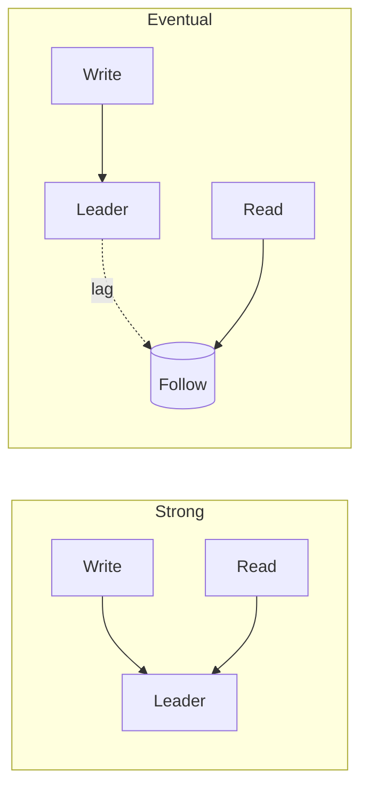

# Strong vs Eventual Consistency

## 1. One-Line Definition
Strong consistency means every read returns the latest committed write (and all reads agree); eventual consistency means reads may return stale data for some bounded time before the system converges to the latest state.

## 2. Why Do We Need It?
Distributed systems cannot be both perfectly consistent and perfectly available (CAP). Every design must decide, per operation, how much staleness is acceptable — money operations demand strong reads, news feeds tolerate eventual. This choice drives replication, read routing, caching, and sharding design.

## 3. Simple Intuition
- **Strong:** a bank balance. Transfer happens → every ATM everywhere shows the new balance immediately, or the ATM refuses.
- **Eventual:** a follower count. You post → it may show 1,000 for a few seconds before becoming 1,002. No one cares about the intermediate number; it *eventually* reaches 1,002 from every device.

## 4. What Happens Without It?
Without strong consistency for critical data, double-spends, negative balances, duplicate orders, and "where did my money go" incidents occur. Without eventual consistency for high-volume data (likes, views, feeds), writes would be serialized and reads would slow to a crawl.

## 5. Core Idea
- **Strong consistency (linearizable):** 1) after a write returns, no read returns older data; 2) a total order of operations exists that matches real time. Implemented with single-writer + sync replication + leader reads (or quorum reads/writes R+W>N).
- **Eventual consistency:** replicas may lag; reads may return stale; all replicas **converge** to the same value if writes stop. Reader may see: old value, then newer (monotonic if careful), possibly going "back in time" without monotonic reads.
- **Middle grounds:** **read-your-writes** (your own writes visible immediately), **monotonic reads** (no regression to older state), **causal consistency** (related events order, independent ones may not) — see consistency-models.md.

**Decision rule:** the cost of a stale read vs the cost of coordination. Happy with stale-by-seconds → eventual (scale). Must be absolute → likely must route to a single leader/quorum and pay latency + availability cost.

## 6. Important Terminology

| Term | Simple Meaning |
|------|----------------|
| Linearizability | Strongest: reads/writes behave as one sequential log |
| Eventual consistency | Converges; reads may be stale meanwhile |
| Read-your-writes | Your prior write is visible to you |
| Monotonic reads | Reads never go "back in time" |
| RPO | How much data loss acceptable on failure (durability) |
| Quorum (R+W>N) | Majority-based consistent reads/writes |
| Convergence | Replicas equal once writes stop |
| CAP | Can't have consistency + availability during partitions |

## 7. Basic Architecture



## 8. Request or Data Flow
- **Strong path:** writes → leader (sync ack); reads → leader or quorum (fresh). Each read waits for the freshest committed state.
- **Eventual path:** writes → leader (async); reads → any replica; convergence within replication lag; optional monotonic via session-pinned replica.

## 9. Practical Example
**E-commerce (assumptions):**
- **Inventory/money:** strong — reads pin to leader/quorum; balance check → deduct → re-check all strong (single-row transaction on the leader).
- **Review counts/product views:** eventual — replica reads + cache increments, reconciled later. Nobody blocks checkout on a view count.

## 10. Scaling
- **Strong = leader bottleneck:** read-your-writes forces leader reads → the primary absorbs traffic; scale be restricted.
- **Eventually consistent scales freely:** replicas + cache → massive read scale.
- **Global:** strong across regions ≈ must route writes+reads to one region/quorum (long pause, partial partition). Eventual across regions = fast local ops + conflict resolution.

## 11. Reliability and Failure Scenarios

| Failure | What Happens | Detection | Recovery | Trade-off |
|---------|--------------|-----------|----------|-----------|
| Replica lag | Stale values on read path | Lag metric | Route critical reads to leader | freshness vs load |
| Leader failure | Strong reads/writes stall | Health/leadership | Promote + re-point | async windows |
| Partition (strong) | Clients blocked vs stale | Quorum health | Admit stale? serve degrade | availability vs consistency |
| Duplicate/lost write | Convergence to wrong value | Checksums/idempotency keys | Reconcile, idempotent retry | at-least-once cost |

## 12. Consistency and Correctness
Correctness = choose per operation, not globally:
- Strong: idempotency keys + leader writes (money, inventory).
- Eventual: tolerate-and-reconcile (counters, feeds, derived search).
- Never claim "we're strong everywhere" — that's a coordination tax you will pay in latency and availability, and it only buys correctness where you actually read stale-sensitive data.

## 13. Performance
- Strong reads: leader/quorum latency = round trips, sync wait.
- Eventual reads: replica/cache 1-5ms.
- Percentile math for a money op: sync follower ack adds a network round-trip to every write and p99 writes are multiple-rtt — size those budgets explicitly.

## 14. Security
Consistency and security interact at fraud/abuse boundaries: auth decisions and token revocation must be **strongly consistent** (a revoked token must never be honored from a stale replica). Money/identity: strong. Marketing data: eventual.

## 15. Trade-Offs

| Choice | Advantages | Disadvantages | When to Use |
|--------|------------|---------------|-------------|
| Strong (leader reads) | Always latest | Leader-bound, slower | Money, auth, inventory |
| Eventual (replica/cache) | Fast, scalable | Stale reads | Feeds, counts, content |
| Read-your-writes | Own writes fresh, others may lag | Slight routing burden | Social/self-editing |
| Quorum R+W>N | Tunable middle | Amplified I/O | Writes/reads-heavy store |
| Causal | Natural perceived order | Complex | Collaborative/messaging |

## 16. Common Mistakes
- Making *everything* strong because "it's safer" — coordination cost explodes; you only need per-operation semantics.
- Making *everything* eventual — a double-spend ruins the business in a way staleness on feeds never will.
- "We use sync replication so we're strong" — eager writes ≠ strong *reads*; reads must be routed consistently too (leader/quorum).
- Ignoring monotonicity: users see "1,002 then 1,000" and file bugs.

## 17. HLD vs LLD Boundary
HLD: which ops are strong/eventual, read-routing rules, quorum settings, staleness budgets. LLD: the exact client quorum wiring, monotonicity implementation in a specific DAO/pin logic.

## 18. Interview Questions

### Beginner
- What's the difference between strong and eventual consistency?
- Give one system that must be strong and one that can be eventual.

### Intermediate
- Your feed shows follower counts that sometimes go backward. What consistency property is missing?
- How does sync replication give "stronger" writes and yet not guarantee strong reads?

### Advanced
- Design a global wallet with strong-balance reads and sub-100ms UX. Where do you put quorums?
- After a region split, your inventory silently over-sold. Walk through the consistency settings that caused it.

## 19. Interview Memory Summary

> [!abstract]- Interview Memory Summary

### Remember

- Strong = always latest + a total order; eventual = stale-tolerable + converges.
- CAP: during a partition, pick consistency or availability.
- Middle ground: read-your-writes / monotonic / causal consistency.
- Per-operation choice is the craft, not a global setting.
- Money/auth/identity → strong; feeds/counts/content → eventual.
- Sync replication is about durability, not read guarantees.

### 30-Second Explanation

Classify operations by staleness cost, route money-level reads to leader/quorum, let the rest ride replicas, and monitor lag + monotonicity.

### Interview Traps

- "Sync replication = strong consistency" — sync updates are durability/loss avoidance, not a total-order read guarantee; reads and routing decide consistency.
- Making *everything* strong — coordination cost explodes.
- Making *everything* eventual — double-spends ruin the business.
- Ignoring monotonicity (users see "1,002 then 1,000").

### Key Trade-Off

Strong consistency buys always-latest, ordered reads with leader/quorum latency and availability cost during partitions; eventual consistency buys scale and low latency with bounded staleness — the split point is set per operation by the cost of a stale read.

## 20. Related Concepts

### Prerequisites

- [[cap-theorem|CAP Theorem]]
- [[database-replication|Database Replication]]
- [[replication-lag|Replication Lag]]

### Commonly Used Together

- [[caching|Caching]]
- [[sharding|Sharding]]

### Advanced Concepts

- [[consistent-hashing|Consistent Hashing]]

Related planned topics (not authored yet): consistency models, quorum, CRDT.

## 21. References
Kleppmann ch. 9 (consistency); CAP discussions by Gilbert/Lynch. Verify quorum semantics with engine docs.

## 22. Active Recall

Test yourself before revealing each answer.

> [!question]- What's the difference between strong and eventual consistency?
> Strong (linearizable): every read returns the latest committed write and all reads agree on a total order that matches real time. Eventual: reads may return stale data for a bounded time, then all replicas converge to the same value once writes stop.

> [!question]- Give one system that must be strong and one that can be eventual.
> Strong: a bank balance / inventory stock / auth revocation — a stale read is a double-spend or security hole. Eventual: a follower count / like counter / news feed — the intermediate number doesn't matter; it converges in seconds.

> [!question]- Design decision: a global wallet with strong-balance reads and sub-100ms UX. Where do you put quorums?
> Route wallet reads/writes to the leader or a quorum in the write region (strong), sized so R+W>N guarantees no stale read. Accept the latency of that single-region path; view counts and metadata stay eventual (replicas/cache). Per-operation: strong where money, eventual where not.

> [!question]- Trade-off: making everything strong vs everything eventual.
> Everything strong → every read pays leader/quorum latency and availability cost; under a partition the strong side refuses. Everything eventual → a double-spend or a stale auth decision ruins the business. The craft is classifying operations by staleness cost and mixing.

> [!question]- Failure scenario: after a region split, inventory silently over-sold. What consistency settings caused it?
> Writes were accepted from both sides of the partition with async replication (AP-ish behavior, no quorum) so both sides decremented stock independently — then converged to a wrong value. Fix: route inventory writes through single leader/quorum in the split, or detect and reject the second side until heal.

> [!question]- Interview scenario: "Sync replication = strong consistency." How do you respond?
> Sync replication makes writes *durable* (loss-avoidance on the ack path) — it doesn't make reads strongly consistent. A read off a lagging replica is still stale no matter how sync the write config is. Consistency comes from read routing (leader/quorum) + choice, not the replication mode.

## 23. When Should I Use This?

### Use it when

- You must split operations into strong vs eventual classes per staleness cost.
- Money, inventory, auth, and revocation need strongly consistent reads (leader/quorum).
- Feeds, counters, content and search can tolerate seconds of staleness at massive scale.
- You're designing read routing, staleness budgets, and quorum settings.

### Avoid it when

- You apply one mode globally (everything strong → coordination tax; everything eventual → double-spends).
- You treat "sync replication" as a substitute for strong reads.
- You ignore monotonicity — users notice counts going backwards.
- You claim "strong everywhere" without the latency/availability proof.

### What problem does it solve?

Problem: replicas and caches make reads fast and scalable but return stale data. Bottleneck: demanding always-fresh everywhere serializes reads onto the leader (coordination cost, availability drop). Solution: classify each operation by the cost of a stale read and route accordingly — strong (leader/quorum) for money/auth, eventual (replicas/cache) elsewhere, with middle grounds for read-your-writes and monotonicity.

### What problem does it NOT solve?

It doesn't make everything strong cheaply (quorum reads amplify I/O and cost availability under partitions), doesn't remove lag by declaration, and doesn't replace per-operation routing with a single global setting. It's a classification discipline, not a knob you set once.

## 24. Decision Connections

Decisions that go together with Strong vs Eventual Consistency:

- [[cap-theorem|CAP Theorem]] — the formal root of the strong/eventual split.
- [[database-replication|Database Replication]] — replicas and their lag create the choice.
- [[replication-lag|Replication Lag]] — the physical delay behind eventual reads.
- [[caching|Caching]] — the other source of stale-but-fast reads.
- [[sharding|Sharding]] — partitioning interacts with consistency across shards.
- [[sli-slo-sla|SLI / SLO / SLA]] — staleness budgets as enforceable contracts.
- [[observability|Observability]] — lag and read-freshness monitoring.

Decision tree:

```
What does a stale read cost this operation?
    |
    +-- Money / inventory / auth / revocation?
    |      → strong (leader or quorum)
    |
    +-- Counters / feeds / content?
    |      → eventual (replicas + [[caching|Caching]])
    |
    +-- User's own write must show immediately?
    |      → read-your-writes via session routing
    |
    +-- Values must never go backwards?
    |      → monotonic reads ([[replication-lag|Replication Lag]])
    |
    +-- Partitions possible?
    |      → reconsider via [[cap-theorem|CAP Theorem]] (CP vs AP)
```