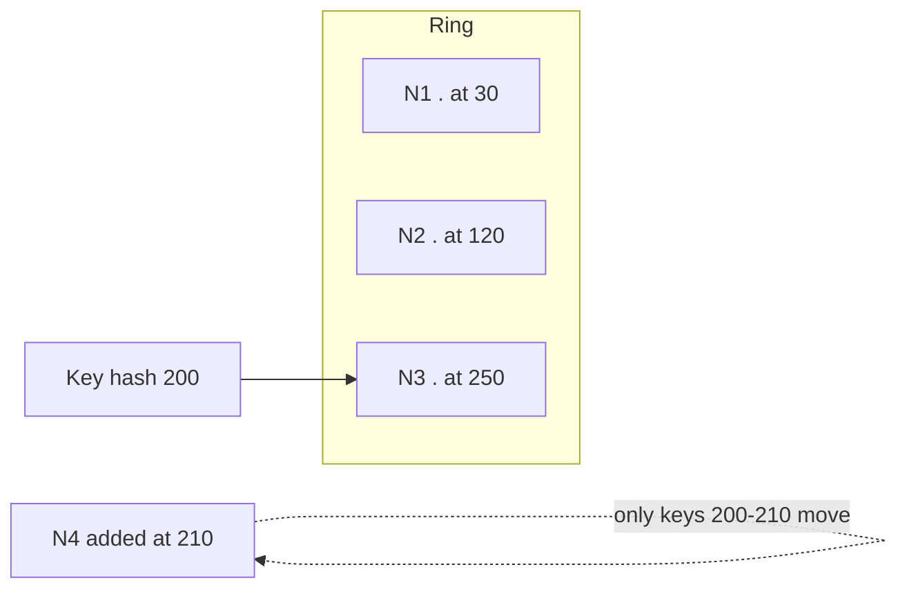

# Consistent Hashing

## 1. One-Line Definition
Consistent hashing maps keys to nodes so that when a node is added or removed, only a small fraction of keys need to move — instead of rehashing everything.

## 2. Why Do We Need It?
Hash-mod-N ("key → node = hash % N") rebalances *every* key whenever N changes: a cache cluster adding one node flushes ~all cached data at once. Consistent hashing keeps reshuffles minimal, which matters enormously for caches, load balancers, and sharded stores where churn is routine (scale up/down, node death, resharding).

## 3. Simple Intuition
A wardrobe with labeled drawers (nodes). With hash-mod you renumber every drawer when you add one. Consistent hashing instead says: place all drawers around a clock; each item goes to the next drawer clockwise. Add a drawer → only the items that now fall *between* the new drawer and the previous one move. Sprinkling every drawer evenly keeps moves rare and small.

## 4. What Happens Without It?
Add a cache node → every key rehashes to a different node → all caches are cold *and* the origin (DB) gets slammed by a miss-storm. A node dies → same all-pass rehash → cascade (the classic caching night terror). Load balancers re-map clients and lose affinity; shard stores need full-data migrations.

## 5. Core Idea
- **Hash ring:** nodes hash onto a circle (0..2^32). Keys hash to a point; the key belongs to the **first node clockwise** from its point.
- **Add/remove node:** each node owns the arc from its position to the previous node; a node's join/leave only affects its own arc — average only 1/N of keys move.
- **Virtual nodes (vnodes):** each real node gets K virtual positions (hashed with seeds). That 1. smooths the distribution (fewer big arcs with few nodes) and 2. lets real nodes own proportional arcs (a 4x node gets 4x vnodes → 4x capacity).
- **Uses:** cache/Redis ring, distributed cache key->node, load-balancer affinity (consistent-hash LB so sessions/caches stay warm), and even-distribute storage/shard routing.

## 6. Important Terminology

| Term | Simple Meaning |
|------|----------------|
| Ring | Logical circle holding hashed node positions |
| Point/position | Node's hashed location on the ring |
| Clockwise lookup | The "next node" rule for ownership |
| Arc/segment | Portion of the ring a node owns |
| Virtual node | Multiple pseudo-positions per real node |
| Rehash | Recomputing key→node mappings |
| Skew | Uneven ownership loads across nodes |

## 7. Basic Architecture



## 8. Request or Data Flow
1. Key hashed → point on ring.
2. Find the first node clockwise → that node serves the key.
3. Node joins/leaves → recompute only affected arc; existing lookups stay pinned (cache preserves hit-rate).
4. Replication option: instead of "next clockwise", the *following* nodes hold replicas (for fault-tolerant caches/keys).

## 9. Practical Example
**Distributed cache (assumptions):** 40 nodes, auto-scale ±5 per day, want >95% hit ratio.
- Hash ring + 128 vnodes per node.
- Scale up: only ~1/45 of keys move — cache stays warm; DB unaffected.
- Node dies: its arc reroutes to the next node (which briefly absorbs + evicts) — some misses locally, no global cold start.

## 10. Scaling
- Added/removal scale is the entire point — event-driven, no global serialization.
- Vnode counts tune balance vs memory (routing table size).
- Hot keys: ring spreads *keys*, but a hot key still lands on one node — add per-key replication (copy to the next K nodes) or cache at edge.

## 11. Reliability and Failure Scenarios

| Failure | What Happens | Detection | Recovery | Trade-off |
|---------|--------------|-----------|----------|-----------|
| Node dies | Its arc's keys lost | Health/ping | Rebuild those keys (misses) | downstream burden |
| Skew (few nodes) | One node overloaded | Load per node | Raise vnodes (balanced) | map size |
| Cascading care for replicas | Next-node overload | Fallback replication (K-1) | replicate keys K deep | replica fan-out |
| Ring-map consistency | Partial views | Version/lease on map | Re-fetch authoritative map | one-hop wait |

## 12. Consistency and Correctness
Consistent hashing decides *where* data lives; it doesn't decide *freshness*. For caches that's fine (per-key miss is the fallback). For authoritative stores (primary DBs) you still need replication + consistency rules *within* the owning node group — and the ring-ownership change (migration) must be coordinated so a key isn't accepted in two places at once (dual-read during cutover).

## 13. Performance
- Lookup cost: O(log N) with a sorted ring or O(1) with a compressed table — negligible.
- Hit ratio preserved across churn = the big win (no stampede).
- Rebalance traffic: ~1/N of keys move — bytes moved proportional to ring fairness.

## 14. Security
- Nodes that own key ranges hold full data copies → node-level least-privilege; a compromised node is a real data exposure — encrypt at rest + rotation.
- Ring-map injection (malicious node claims ranges) → authenticate membership/upsert (consensus or signed map).

## 15. Trade-Offs

| Choice | Advantages | Disadvantages | When to Use |
|--------|------------|---------------|-------------|
| Hash mod N | Trivial | Global rehash on churn | Static ownership |
| Hash ring (plain) | Minimal moves | Skew with few nodes | Middle counts |
| Ring + vnodes | Balanced, proportional | Map memory, seed management | Dynamic/many nodes |
| Ring + per-key replicas | Hot key resilience | Replica overhead | Hot keys / read scale |

## 16. Common Mistakes
- Implementing "consistent hashing" as hash-mod-N and calling it done (they're different).
- No vnodes with small node counts → one giant arc → a single hot node.
- Ignoring lookup-order — the O(log N) with a sorted set is trivial but you need the *right* data structure in the router.
- Believing the ring fixes hot *keys* (it fixes *distribution*, not popularity).

## 17. HLD vs LLD Boundary
HLD: ring topology, vnode policy, replication depth, migration/dual-read protocol. LLD: the exact binary-search/ring lookup code, the seeded hash function, per-service map cache.

## 18. Interview Questions

### Beginner
- Why is hash-mod-N a bad rebalance story?
- What does a virtual node do?

### Intermediate
- Show how adding a node moves only ~1/N of keys on a ring.
- Your 6-node ring is one hot node. What config choices caused it and how do you fix it?

### Advanced
- Design consistent hashing for a cache where a node's death must not spike origin load.
- How do you migrate shard ownership on a ring without double-write or lost-write windows?

## 19. Interview Memory Summary

> [!abstract]- Interview Memory Summary

### Remember

- Ring + clockwise ownership: a key belongs to the first node clockwise from its hashed point.
- Adding or removing a node only reshuffles its own arc — average only ~1/N of keys move.
- Virtual nodes smooth the distribution and give stronger nodes proportional capacity.
- It fixes *distribution*, not hot-key *popularity* — a hot key still lands on one node.
- Primary uses: cache/Redis ring, consistent-hash LB affinity, and sharded-store routing.
- The following nodes on the ring can hold replicas for fault tolerance.

### 30-Second Explanation

Hash nodes and keys onto a circle; a key goes to the next node clockwise; vnodes smooth load; node churn only reshuffles its own arc, so caches stay warm and origin load stays flat.

### Interview Traps

- Claiming "consistent hashing is hash-mod N but smarter" — they're different; you should be able to show the ring math.
- No vnodes with small node counts → one giant arc → a single hot node.
- Ignoring lookup-order — you need the right data structure (sorted ring) in the router.
- Believing the ring fixes hot *keys* — it fixes distribution, not popularity.

### Key Trade-Off

You keep moves minimal and caches warm under churn (and pay for it with the routing hop + map bookkeeping), but the ring alone cannot fix skew without vnodes or popularity without per-key replication.

## 20. Related Concepts

### Prerequisites

- [[caching|Caching]] — consistent hashing is the routing mechanism that keeps a distributed cache warm through churn.
- [[load-balancing|Load Balancing]] — the consistent-hash LB is one of the ring's main applications; it keeps sessions and cache affinity pinned.

### Commonly Used Together

- [[sharding|Sharding]] — the ring is the standard way to pick a shard and to add/remove shards cheaply.
- [[shard-key|Shard Key]] — the hashed key placed on the ring decides which shard owns each row.
- [[database-replication|Database Replication]] — replicas of a node's arc (replica ring) add fault tolerance to ownership.

### Alternatives

- [[sharding-strategies|Sharding Strategies]] — directory/range placement are placement alternatives that skip a hash ring.

Related planned topics (not authored yet): shard rebalancing, virtual nodes, rendezvous hashing.

## 21. References
Karger et al. "Consistent Hashing and Random Trees" (original paper); Redis cluster / Dynamo ring docs. Verify current implementations with store docs.

## 22. Active Recall

Test yourself before revealing each answer.

> [!question]- Why does adding a cache node with hash-mod-N flush the entire cache, and why does a ring avoid that?
> With hash-mod-N every key's hash is recomputed against the new N, so almost all keys re-map to different nodes and every cache must re-prime from origin. On a ring, adding a node changes ownership only on the arc between the new node and its predecessor, so only ~1/N of keys move and the rest stay pinned.

> [!question]- Walk through how a specific key finds its owner on a hash ring.
> Hash the key onto the circle (0..2^32), then look up the first node position clockwise from that point; that node owns the key. With a sorted list of node positions this is an O(log N) lookup, or O(1) with a compressed table.

> [!question]- What job do virtual nodes do?
> Each real node gets K hashed pseudo-positions. That smooths the distribution when the node count is small (no single giant arc) and lets a node claim a share of arcs proportional to its capacity (a 4x machine gets 4x vnodes).

> [!question]- Your 6-node cache ring has one overloaded node. Which config choices caused it and what do you change?
> Likely no vnodes with a low node count, so one node owns an outsized arc, or bad hashes clustering node positions. Fix: raise the vnode count (or add more real nodes) to even out arc sizes; the added memory for the routing table is the price.

> [!question]- You want a replica of every cached key. How does the ring give you that?
> Instead of stopping at the first node clockwise, replicate to the next K clockwise nodes, so each key lives on K nodes. If the primary dies, its arc (and keys) roll to its clockwise neighbor, which already holds replicas — a reconnect that avoids a cold miss-storm.

> [!question]- What is the trade-off in raising the vnode count from 128 to 1024?
> Balance improves (arcs shrink, load spreads) and capacity is more proportional, but the routing table and map memory grow, seed management gets heavier, and ring-map replication costs more. Fewer vnodes → cheaper map, more skew.

> [!question]- Scaffold an answer for: "Design a distributed cache that auto-scales ±5 nodes/day and must keep >95% hit ratio."
> Ring plus ~128 vnodes per node; on add/remove only ~1/N of keys re-home, so hit ratio survives churn and origin is barely touched. Node death: its arc reroutes to the next node which briefly absorbs and evicts — local misses, no global cold start. Add per-key replication to K neighbors if specific hot keys need fault tolerance.

> [!question]- A node in your ring dies abruptly. What happens to its keys and how do you keep origin load low?
> Its arc's keys re-route to the clockwise successor, which must serve them. Without replicas that means cache misses and origin re-fetch for that arc's keys (bounded, not global). With a replica ring the successor already has copies, so origin sees almost nothing. The mitigations trade replica fan-out and storage against origin load.

> [!question]- How do you migrate shard ownership on a ring without a double-write or lost-write window?
> Coordinate the ring-map change: mark keys in-flight during cutover, read from both old and new owners (dual-read), write to both briefly, verify, then atomically switch the ring map and stop dual-write. Ownership must never be accepted in two places simultaneously, which is why the map update itself needs versioning/leaseing.

> [!question]- Section 16 says consistent hashing does not fix hot keys. Explain the difference.
> The ring spreads keys uniformly across nodes, which fixes uneven *distribution* from a skewed hash space. It cannot fix a key that is inherently *popular* — that key still hashes to exactly one node, which floods. Popularity needs per-key replication to the next K nodes, caching at the edge, or splitting the hot key.

## 23. When Should I Use This?

### Use it when

- The node set churns routinely (scale up/down, node death, resharding) and you must keep moves minimal.
- A distributed cache or store must preserve its hit ratio through membership changes.
- You want load-balancer affinity — a client/session that stays bound to one backend.
- Sharded/partitioned stores need a cheap story for growing or shrinking the node count.
- You need to weigh capacity: vnodes let stronger nodes own a proportional share of keys.

### Avoid it when

- A static hash-mod-N is fine because membership never changes (over-engineering a ring).
- You need range or ordered-key queries — the ring hashes keys flat and destroys ordering.
- You're chasing *popularity* problems: a hot key ignores the ring and needs replication or caching instead.
- Node identity is fixed and the routing metadata is a hot, hard-to-replicate SPOF you'd rather not run.

### What problem does it solve?

Hash-mod-N's rehash-everything on membership change is the bottleneck: a cache cold-start or full-data migration on every node join/leave. Consistent hashing makes moves proportional (~1/N), so churn becomes local and cheap.

### What problem does it NOT solve?

Freshness/consistency (the ring only chooses where data lives), hot-key popularity, ordered/range access, and security of the data nodes themselves — encrypted storage and authenticated ring-map joins are still your job.

## 24. Decision Connections

Decisions that go together with consistent hashing:

- [[sharding|Sharding]] — the ring is the routing mechanism that makes shard add/remove cheap and evenly spread.
- [[shard-key|Shard Key]] — the key choice feeds the ring; high-cardinality keys become evenly distributed points.
- [[caching|Caching]] — a Redis/edge cache ring is the canonical application; the ring is what keeps hit ratio stable.
- [[load-balancing|Load Balancing]] — a consistent-hash LB is just a ring application; it preserves session/cache affinity.
- [[database-replication|Database Replication]] — replicate a node's arc (replica ring) for fault-tolerant ownership.
- [[horizontal-vs-vertical-scaling|Horizontal vs Vertical Scaling]] — the ring is the horizontal-scaling glue: add capacity by adding nodes, not by growing a single machine.

Decision tree:

```
Need to map keys to a dynamic set of nodes?
    |
    +-- Static membership, never changes?
    |      → simple hash-mod-N (no ring needed)
    |
    +-- Nodes churn (scale up/down, failures)?
    |      → [[consistent-hashing|Consistent Hashing]]
    |         |
    |         +-- distribution skewed at low counts? → add virtual nodes
    |         +-- must survive node death cheaply?  → replica ring (K neighbors)
    |         +-- wrong node churn?  → fix hashing/vnode seeding, not the ring
    |
    +-- Range/ordered-key access required?
           → consistent hashing destroys ordering; use range-based placement instead
```