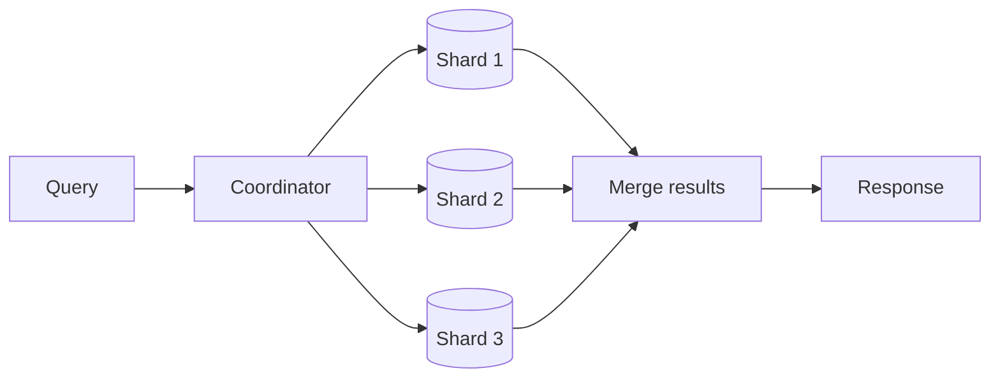

# Cross-Shard Queries and Transactions

## 1. One-Line Definition
Cross-shard queries touch more than one shard — answered by scatter-gather fan-out plus a merge — and cross-shard transactions span multiple shards, needing 2PC, Sagas, or redesign so writes never split; they are the two costs sharding quietly invoices for splitting data.

## 2. Why Do We Need It?
Sharding makes single-shard operations trivial, but real workloads refuse to stay in one bucket: a user's posts may be where `user_id` lives while likes are keyed elsewhere; a transfer touches two accounts by design; a dashboard asks "across all shards, what's the trend?". If you cannot query across shards — or worse, cannot atomically write across them — you're forced to either duplicate everything on every shard or to window the world into one-key-at-a-time. The machinery exists so the split stays invisible when data genuinely scatters.

## 3. Simple Intuition
Two filing clerks each own one alphabetical drawer-wall (A-M and N-Z). A cross-drawer order ("every order from customer Q with a total > $100") means asking both clerks to flip through and merge their lists at the desk — scatter-gather. And a transfer from Tom (T-wall) to Zoe (Z-wall) requires both clerks to confirm the same stamp at once — or it needs a rule where the transfer journal lives somewhere both can reach. The moment data is split, "every query" and "every transaction" come with a coordinator's desk in the middle.

## 4. What Happens Without It?
- Queries that only need shard 3 fan out to all 32 anyway (amplification: 32x the necessary work).
- Joins that were one SQL statement become N round trips and application-side merge with subtly wrong semantics (pagination breaks, totals double-count on retries).
- A two-account transfer either never atomically commits (money leaves without arriving) or someone reinvents a fragile 2PC and that fails under partitions.
- Global secondary indexes: an index look-up on a non-key column misses whatever index rows live on unqueried shards — reads on a sharded secondary index are silently incomplete.

## 5. Core Idea

**Cross-shard queries = scatter-gather:**
1. Parse the query, identify predicates that are shard-local (keyed) vs global.
2. Fan out to all shards (or the subset the planner can prune), each answering locally — never ship the full table, push down filters/aggregates/limits.
3. Merge: dedupe, re-sort, re-paginate the partial results; sum/count pushdown works, but `LIMIT` per-shard breaks global pagination.
- **Page-size trap:** a global "top 10" needs `LIMIT 10` per shard then a merge of up to N×10, because the top-10 could live anywhere. Likewise pagination with `OFFSET` needs offsets per shard and is fundamentally unstable across pages — prefer keyset/cursor pagination.
- **Global secondary indexes:** maintain a second sharded index keyed by the lookup column; every write must update both base row and index row (coordinated write, often an [[outbox-pattern|Outbox Pattern]] or dual-write story). Otherwise point lookups on non-key columns become full-table scans.

**Cross-shard transactions:**
- **Single-key affinity first:** the best "cross-shard transaction" is the one your shard key makes single-shard — co-locate the data (see [[shard-key|Shard Key]]) so the write is local and ACID for free.
- **2PC (coordinated):** a coordinator prepares all participants, then commits all or none. Correct but blocks on failure (a down shard holds locks) and converts a node failure into an availability stall. Classic trade: exact atomicity vs partition tolerance.
- **Saga (compensating):** each shard does its step and publishes "done"; on failure, previously committed steps run compensating actions. Eventual, tolerant of partitions, but no global atomicity — compensation must be designed per step (see [[saga-and-strangler|Saga and Strangler Fig]] and [[distributed-transactions|Distributed Transactions]]).
- **Outbox + idempotency:** an effect (e.g., "debit user, publish event") writes its DB row and an outbox row to the *same* local shard transaction; a relay delivers to the other shard exactly-once (see [[outbox-pattern|Outbox Pattern]]). Not a multi-shard transaction, but turns most "atomic cross-shard" needs into "local transaction + reliable message."
- **Decision rule:** cross-shard transaction → refuse-to-split via co-location when possible; otherwise pick the failure semantics you can live with (blocking 2PC vs eventual Saga) per business case.

## 6. Important Terminology

| Term | Simple Meaning |
|------|----------------|
| Scatter-gather | Fan out query to shards, merge results |
| Fan-out amplification | Work multiply = QPS x shard touched |
| Pushdown | Do filter/aggregate on the shard, ship less |
| Global secondary index | Second index table keyed by lookup column |
| Keyset/cursor pagination | Stable pagination by last-seen key |
| 2PC / XA | Two-phase coordinated multi-node commit |
| Saga | Compensating steps, eventual atomicity |
| Outbox | Local table allowing reliable cross-shard message |
| Co-location | Related rows sharing a shard ⇒ single-shard ops |

## 7. Basic Architecture



## 8. Request or Data Flow
1. A global query ("all orders over 100 across customer Q") arrives; •the planner sees it needs every shard.
2. Coordinator pushes the predicate down (filter to `customer=Q`, `total>100`) so each shard returns only matches, capped at the per-shard page budget.
3. Merge dedupes (same row could appear from overlap), sorts, and re-applies the global LIMIT; cursor encoded from the last global ranking.
4. A multi-shard transaction takes the other path: the coordinator preps all participants, force-orders, then commits (2PC) — or runs compensating Saga steps if a participant cannot confirm.

## 9. Practical Example
An order system: 16 shards by `order_id`, plus a `customer_orders` co-location shard keyed by `customer_id`.
- Point read `order by order_id`: single shard, 2 ms.
- "All orders in the last month of customer Q": co-located by `customer_id` → still single shard if you keyed it that way.
- "Total revenue by category": keyed by category, cross-shard → 16 shard aggregations pushed down, then one sum on the coordinator: ~16 × 5 ms ≈ 80-100 ms — acceptable for analytics, wrong for a user-facing endpoint.
- Transfer between two customers: 2PC on `customer_id`+`order_id` shards adds prepare/commit round-trips (≈ +20 ms) and a blocking failure window; alternatively a Saga debits, then credits, compensating on failure, and an outbox guarantees the credit-side event at-least-once.

## 10. Scaling
- Fewer shards = cheaper cross-shard reads (fewer fan-outs). Never add shards "because the fleet looks small" without measuring the fan-out tax on your global queries.
- Pushdown is the scaling lever for aggregates: `SUM`, `COUNT`, `MAX` collapse to O(1) per shard; shipping raw rows scales linearly with data and dies.
- Joins across shards: choose a shard key that co-locates the join (see [[shard-key|Shard Key]]); otherwise a global join is O(N×M) rows moving over the wire — materialize the joined view in a warehouse/search store instead (see [[data-warehouse-lake|Data Warehouse and Data Lake]] and [[elasticsearch|Elasticsearch]]).
- Global indexes double your write path (base row + index row) — budget accordingly; they also become multi-shard writes that need outbox/2PC treatment.

## 11. Reliability and Failure Scenarios

| Failure | What Happens | Detection | Recovery | Trade-off |
|---------|--------------|-----------|----------|-----------|
| One shard down during fan-out | Query fails or returns partial | Per-shard health | Fail the query; retry; serve cached | availability vs completeness |
| Shard slow > timeout | Tail latency of every fan-out | p99 per shard | Timeout + partial + retry; separate pools | freshness |
| 2PC prepare stuck | Locks held, writes stall | Prepare timeout | Timeout + tx rollback or Saga | atomicity vs liveness |
| Index row out of sync at write | Lookup misses live rows | Drift check | Redeliver via outbox | correctness vs latency |
| Retried fan-out duplicates merge | Totals double-count | Dedup by row id | Idempotent merge (key on primary id) | merge complexity |

## 12. Consistency and Correctness
- Scatter-gather returns "each shard's truth at a given instant," not a consistent snapshot across shards: a row may have moved between shard reads. Accept a snapshot-tolerant result or snapshot the shards consistently (rare, expensive).
- Fan-out dedup must key on the stable primary id; retries and overlapping shard answers fabricate duplicates otherwise.
- 2PC gives atomic but not always-available; on participant failure it blocks until resolved — versus Saga's eventual exactness with mandatory compensation design (see [[distributed-transactions|Distributed Transactions]]).
- Outbox gives per-shard atomicity and at-least-once delivery; the listener must be idempotent for exactly-once *effect* (see [[exactly-once-effect|Exactly-Once Effect]] and [[outbox-pattern|Outbox Pattern]]).
- Global index consistency is a mini cross-shard transaction on every write — pick the mechanism (outbox + relay beats ad-hoc dual-write).

## 13. Performance
- Fan-out amplification: a global query costs QPS × (shards touched). 16 shards → 16x the read QPS of the same query if it were single-shard. Cache hot global results or serve from an OLAP replica.
- Pushdown vs shipping: a SUM over 100M rows ships ~nothing; a raw row copy ships 100M rows. Pushdown is where scatter-gather stops being a joke.
- 2PC adds ~2 round trips interleaved with locks; latency often +50-150% on the write, and throughput drops under contention.
- Co-location is the free lunch: a well-chosen key (see [[shard-key|Shard Key]]) turns most "cross-shard" reads into single-shard hits.

## 14. Security
Fan-out multiplies exposure: a cross-shard query must carry the same tenant scoping to *every* shard, or one mistyped predicate leaks another tenant's rows. Enforce scoping at the coordinator, not per-shard heuristics; never allow unauthenticated fan-out (an attacker controlling a query shape gains cluster-wide reads at once). Index lookups inherit the same isolation duty.

## 15. Trade-Offs

| Approach | Advantages | Disadvantages | When to Use |
|--------|------------|---------------|-------------|
| Co-location | Single-shard reads/writes | Constraints on key choice | Default aspiration |
| Scatter-gather + pushdown | Works for global queries | Amplification, no consistent snapshot | Analytics, admin |
| Global secondary index | Fast non-key lookups | Double writes, consistency duty | Frequent lookups |
| 2PC | Atomic across shards | Blocks on failure, slow | Rare, critical invariants |
| Saga | Available, eventual | No atomicity, compensation design | Most business flows |
| Outbox + relay | Local atomicity, reliable | Eventual, idempotent listener | Produce/effect patterns |

## 16. Common Mistakes
- Running `LIMIT` per shard and concatenating — global top-10 comes back as a wrong top-10.
- Sums that merge duplicates (or double-count retries) because the merge step isn't idempotent.
- Co-locating nothing and paying scatter-gather on every user-facing query.
- 2PC for everything: booking atomicity you can't afford and liveness you'll regret at the first partition.
- Believing the fan-out is safe "because it's a read" — under load it's Amplification with a capital A, capable of melting the shards it scans.

## 17. HLD vs LLD Boundary
HLD: which operations are single-shard by design, which are global; fan-out policy + pushdown; transaction strategy (2PC vs Saga vs outbox); index architecture. LLD: the merge/dedupe function, the pagination cursor codec, the 2PC prepare/commit messages, and the outbox relay's idempotency key handling in one service.

## 18. Interview Questions

### Beginner
- Why does sharding make joins expensive?
- What is fan-out amplification in one number?

### Intermediate
- Design "top 10 posts by likes, cluster-wide" on 32 shards. What merges, what LIMITs, and why is pagination hard?
- You must debit one account and credit another on different shards. Compare 2PC, Saga, and outbox.

### Advanced
- A global secondary index misses rows during a write burst. Design a consistent index update scheme with bounded staleness.
- "Snapshot them all" as the answer to consistent cross-shard reads — when is it right and what does it cost?

## 19. Interview Memory Summary

> [!abstract]- Interview Memory Summary
> ### Remember
> - Cross-shard reads: scatter-gather = fan out + pushdown + merge.
> - Aggregates push down well (SUM, COUNT); raw-row shipping and LIMIT-per-shard do not.
> - Global secondary index = a second sharded table with double-write discipline.
> - Cross-shard txn: co-locate first; else 2PC (atomic, blocking) vs Saga (eventual, compensating) vs outbox (local atomic, reliable).
> - Pagination across shards needs cursors/keysets, never offsets.
> - Every fan-out is QPS x shards; cache or offload the hot global ones.
> ### 30-Second Explanation
> When data lives on multiple shards, answer reads by pushing filters and aggregates down, gathering partials, and merging with dedupe + cursor pagination; answer writes by designing the key so the transaction is single-shard, or pick a failure semantics: 2PC when atomicity is paramount and partitions are tolerable, Saga when availability matters more and steps can compensate, and outbox when the real need is "local row + reliable event." The cheapest cross-shard query is the one co-location removed.
> ### Interview Traps
> - Concatenating `LIMIT` outputs and calling it global ranking.
> - Promising "consistent snapshot" across shards at fan-out time.
> - 2PC as the default: you've just traded every partition for "blocked" headaches.
> - Forgetting the read-side amplification when under load.
> ### Key Trade-Off
> Sharding makes single-shard ops nearly free and cross-shard ops costly — the design skill is arranging data so the many stay single-shard and the few cross-shard ones pick their failure semantics consciously.

## 20. Related Concepts

### Prerequisites

- [[sharding|Sharding]] and [[sharding-strategies|Sharding Strategies]] — the split that creates the problem
- [[shard-key|Shard Key]] — co-location decides whether the query is single-shard

### Commonly Used Together

- [[fanout-and-aggregation|Fan-Out / Fan-In / Scatter-Gather]] — the pattern this file applies to shards
- [[distributed-transactions|Distributed Transactions]] — 2PC vs Saga details
- [[outbox-pattern|Outbox Pattern]] — local-atomic reliable cross-shard messages
- [[saga-and-strangler|Saga and Strangler Fig]] — compensation orchestration
- [[data-warehouse-lake|Data Warehouse and Data Lake]] — offload global analytics

### Alternatives

- [[elasticsearch|Elasticsearch]] — move global search/indexing out of the sharded OLTP instead
- [[caching|Caching]] — cache the global query's results and stop fanning out

### Advanced Concepts

- [[exactly-once-effect|Exactly-Once Effect]]
- [[global-consistency|Global Consistency]]

Related planned topics (not authored yet): none for this file; the referenced transaction/outbox families already exist above.

## 21. References
Kleppmann, *Designing Data-Intensive Applications*, ch. 6 (partitioning, secondary indexes, rebalancing trade-offs). Distributed-transaction coverage: Garcia-Molina et al. on 2PC; saga papers (Garcia-Molina & Salem 1987). Note that page-size/keyset pagination guidance is cross-checkable with PostgreSQL docs if your store supports cursors.

## 22. Active Recall

Test yourself before revealing each answer.

> [!question]- What makes a global `LIMIT` query semantically hard across shards?
> Because the "top 10" can live on any shard, each shard must return its own top 10 (not top 10/32), and the coordinator merges up to 32x10 rows. With OFFSET pagination you'd need per-shard offsets that drift as data changes; only a keyset/cursor encoding gives stable pages.

> [!question]- Design decision: debit account A (shard 3) and credit account B (shard 11). Choose between 2PC, Saga, and outbox.
> 2PC when the invariant is atomic (transfer UTC): prepare both shards, commit both, roll back on any failure — but you block under partitions. Saga when availability matters: debit, then credit; reverse the debit if credit fails — eventual, compensable. Outbox when the real contract is "debit + an event the credit side applies idempotently." Unless a single account id co-locates both — in which case none of this is needed.

> [!question]- Trade-off: aggregate pushdown vs shipping rows to the coordinator.
> Pushdown computes SUM/COUNT/MAX per shard and ships O(1) bytes; shipping raw rows moves data proportional to the whole dataset and melts the coordinator. The rule: never move rows the coordinator could combine numerically. Pushdown fails only for order-sensitive merges (median, percentile, global joins).

> [!question]- Failure scenario: a fan-out read times out on 1 of 32 shards.
> Decide the contract up front: fail the query (partial-reads are data loss for a finance view) or degrade (return the complete response annotated "partial") for analytics. Never silently merge the 31 answers — a merged partial result looks correct and isn't. Add per-shard timeouts and a cached full result for the hot path.

> [!question]- Why does a global secondary index need its own consistency story?
> The index is a second table living on other shards; every base-row write now implies another shard's write. If those two writes aren't coordinated (2PC, outbox, or compensated dual-write), the index drifts and non-key lookups miss live rows. That drift, not the index's search latency, is the real design problem.

> [!question]- Interview scenario: "All our admin dashboards do cross-shard queries; why is the DB slow?"
> Because each dashboard is a fan-out: 16 dashboards x 32 shards = 512 partial scans per render, and the shards are also serving the OLTP path. Move global/admin analytics to an OLAP replica or warehouse (pushdown + cached warm view), keep the OLTP shards for single-shard point ops, and re-run the fan-out only for genuinely live global needs.

## 23. When Should I Use This?

### Use it when

- Some queries genuinely range across the shard key and can't be co-located.
- The analytics/admin layer needs global aggregates but tolerates staleness (the classic offload).
- A rare transaction must atomically span shards and you'll fight for it.
- Lookups on non-owner columns justify a sharded global secondary index.

### Avoid it when

- The query is shard-keyed and co-locatable — make it single-shard instead.
- Global reads are hot: cache or materialize rather than fanning out each time.
- The business survives an eventual cross-shard effect and doesn't need blocking atomicity.
- The team can't run a coordinator tier reliably — scatter-gather and 2PC both need one.

### What problem does it solve?

It lets a sharded system answer questions and commit work that genuinely spans shards — with a defined, costed failure semantics, not ad-hoc magic.

### What problem does it NOT solve?

It won't make global reads as fast as single-shard ones, won't give you a consistent cluster-wide snapshot for free, and 2PC won't stay available through a partition. Those are intrinsic prices; design data layout so only the genuinely-multi-shard residue pays them.

## 24. Decision Connections

- [[sharding|Sharding]] and [[shard-key|Shard Key]] — co-location is the first line of defense.
- [[sharding-strategies|Sharding Strategies]] — key choice determines how much of this you need.
- [[fanout-and-aggregation|Fan-Out / Fan-In / Scatter-Gather]] — the general pattern applied per-shard.
- [[distributed-transactions|Distributed Transactions]] — 2PC vs Saga, the cross-shard write toolkit.
- [[outbox-pattern|Outbox Pattern]] — local atomicity + reliable events for cross-shard effects.
- [[saga-and-strangler|Saga and Strangler Fig]] — compensating flows when Saga is the pick.
- [[data-warehouse-lake|Data Warehouse and Data Lake]] — offload global analytics from OLTP shards.
- [[elasticsearch|Elasticsearch]] — a purpose-built global index instead of a sharded one.

Decision tree:

```
An operation's data lives on more than one shard.
    |
    +-- Read?
    |      → scatter-gather: pushdown + merge + cursor pagination
    |         +-- Hot global result?  → [[caching|Caching]] or warm OLAP view
    |         +-- Non-key lookup?     → global secondary index (with outbox consistency)
    |
    +-- Write?
    |      +-- Can co-location make it single-shard? → redesign the key ([[shard-key|Shard Key]])
    |      +-- Atomicity paramount, partitions tolerable? → 2PC
    |      +-- Availability paramount, steps compensable? → [[saga-and-strangler|Saga and Strangler Fig]]
    |      +-- Real need is row + event?       → [[outbox-pattern|Outbox Pattern]]
    |
    +-- Global analytics dominate?
           → ship to [[data-warehouse-lake|Data Warehouse and Data Lake]]
```