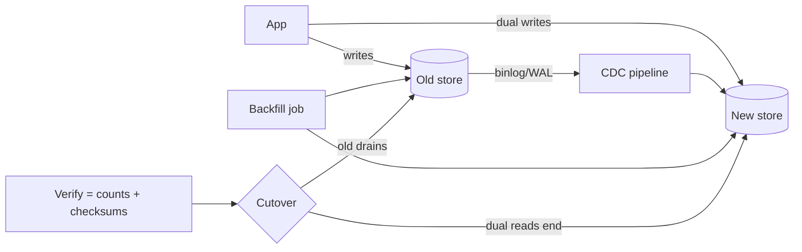

# Data Migration (Dual Reads/Writes, CDC)

## 1. One-Line Definition
Data migration moves live data between systems (old store to new store, or shard to shard) with zero or near-zero downtime by streaming changes with change data capture (CDC), writing to both sides during the move, and flipping ownership only after verification.

## 2. Why Do We Need It?
Systems inevitable to migrate: you scale out (one Postgres becomes 8 shards), change vendors, add a search/analytics replica, or fix a bad shard key. The naïve path — "stop the world, copy, start again" — is downtime, and at scale it's *scheduled* downtime you repeat every growth step. Dual-read/dual-write + CDC migration keeps the old system serving the whole time, so a multi-TB move becomes a background fan, not an outage.

## 3. Simple Intuition
Moving offices while still doing business. You don't nail the doors shut for the move — you keep the old office open, phase staff and desks to the new one as boxes arrive, put a forwarding slip on the old desk (dual reads), stamp documents in both offices during the transition (dual writes), and only on move-out day lock the old address. Anyone who already moved sees the same records because both offices copy them until the last box is verified.

## 4. What Happens Without It?
A one-shot `SELECT * FROM old → INSERT INTO new` migration: days of planning, a maintenance window, user-visible outage, and the moment data changes after the copy started, the copy is already stale. Worse, the writes you took while the copy ran are silently missing from the new system. Teams then either fear migrations or run them at 3am as risky rituals — the exact behavior that produces "old and new are actually different" incidents.

## 5. Core Idea
The live-migration protocol:
1. **Backfill:** copy the existing dataset old → new in bulk, batched by key, throttled below source capacity. The snapshot must be cut at a consistent point (transactionally consistent snapshot + the log position/offset it corresponds to).
2. **CDC catch-up:** stream the change log (binlog/WAL/binary replication) from that offset to the new system, so new rows created during backfill reach the new store. Debezium/CDC tools or vendor change streams do this.
3. **Dual writes (shadow writes):** optionally, the app itself writes to both old and new during the window — covers writes before CDC catches the offset; pairs with the outbox pattern to stay atomic per side (see [[outbox-pattern|Outbox Pattern]]).
4. **Verify:** row counts, per-key checksums, and a drift check (e.g., last-arrived offset equality) — the proof gate before any cutover.
5. **Dual reads:** new reads served from old with a fallback to new (or vice versa), or key-split gradually.
6. **Cutover:** atomically flip ownership (router map, DNS, feature flag); old enters drain.
7. **Reverse-validation & decommission:** recheck a shadow window, then delete/keep old per RPO/retention policy.

The two correctness anchors: **the snapshot/offset alignment** (copy and change stream must be cut at the same point) and **the idempotent apply** (replaying the same change must not corrupt the new store).

## 6. Important Terminology

| Term | Simple Meaning |
|------|----------------|
| Backfill | Bulk-copy the existing dataset |
| CDC | Change data capture — stream the write log |
| Snapshot + offset | Consistent starting point for copy and log |
| Dual write | App writes to old and new during migration |
| Dual read | Serve reads from both, prefer one |
| Drift check | Compare old/new row state at the end |
| Cutover | The flip from old to new ownership |
| Drain | Old system stops serving new writes |
| Replay | Idempotent re-apply of a change row |
| Outbox | Local table enabling reliable change delivery |

## 7. Basic Architecture



## 8. Request or Data Flow
1. Capture a consistent snapshot of Old plus the changelog offset at that instant.
2. Backfill rows in key-ordered batches; restart-resume on failure.
3. CDC streams every later change (insert/update/delete) to New, applied idempotently by primary key + version.
4. The app dual-writes critical rows during the window so nothing depends on CDC latency alone.
5. Verify counts/checksums/drift; then flip the router so new reads/writes go to New; Old drains.
6. A short compare window runs, then decommission Old per retention policy.

## 9. Practical Example
A 50M-row user table moving from one Postgres to a 16-shard Cassandra-based store:
- Backfill at 20K rows/s → ~42 min of bulk copy, disk-bound throttle at 15% of the source.
- CDC lag tracked: backfill completes with pipeline only ~30 s behind and closing.
- Dual-write window of 6 hours: writes land on both; checksums compared every 15 min.
- Cutover overnight at the drift-check gate; the drain window is minutes, not hours; old kept 30 days as a rollback.
- The migration is boring — which is the product spec of a good migration.

## 10. Scaling
- Backfill bandwidth is the bottleneck: single-writer batch saturates source. Scale with key-ranged shards, worker pools, and backpressure (each shard paces its copy).
- CDC has its own scaling: one pipeline per shard/partition; lag is the metric to watch (see [[replication-lag|Replication Lag]]).
- Copying to N target shards multiplies target write amplification — use batched policy inserts and disable non-essential target indexes during backfill, then rebuild.
- Verify scales badly on raw row compares — prefer per-partition checksums (hash aggregations) over full row walks.

## 11. Reliability and Failure Scenarios

| Failure | What Happens | Detection | Recovery | Trade-off |
|---------|--------------|-----------|----------|-----------|
| Snapshot/offset misaligned | Holes or dups in New | Gap detection | Re-cut snapshot + reset CDC | correctness |
| CDC pipeline down | Lag grows, catch-up window extends | Lag metric | Resume from last committed offset | lag vs capacity |
| Dual-write to Old only | New misses writes before fence | Drift check | Replay the missed set | complexity |
| Cutover flip races | Concurrent writers to both | CAS on ownership | Serialize flip with a lease | window size |
| Checksum mismatch | Corrupt target batch | Verify | Re-copy that key range | drift window |

## 12. Consistency and Correctness
- **The invariant:** at cutover, New contains everything Old had *as of the flip*, applied exactly once. Idempotent apply (primary key + version) makes replay safe; a version column catches out-of-order replays.
- Dual-write ordering is a classic trap: Old and New written "at once" can diverge if one succeeds and the other fails. Prefer **outbox + relay** (local atomic row + message) to ad-hoc dual-writes, or accept a bounded re-sync.
- Snapshot-then-CDC overlap: the change stream must start at or before the snapshot and skip re-applying snapshot-consistent rows — duplicate applies must be no-ops.
- Cutover atomicity is a router/map decision (see [[shard-routing|Shard Routing and Metadata]]): flip a versioned map atomically; reads during the flip are dual-covered by reads from both sides.
- Idempotency of the app-facing restarts: the migration is itself retryable; restart from the last checkpoint, never from zero.

## 13. Performance
- Backfill steals source I/O: throttle at 10-25% of spare capacity; a slow-but-smooth copy beats a fast one that starves traffic.
- Dual reads double read cost only during the brief cutover; dual writes add a second write path and should be toggled off once the fence is in.
- CDC adds tail latency to New by definition (apply is near-real-time); bound it via lag-based cutover gating rather than time-based.
- Verify cost: checksum passes are cheap to (cheaply) run repeatedly; full row walks are the expensive, rare final check.

## 14. Security
Migration moves data to new trust domains: encrypt at rest on the target, rotate credentials after the move, retain and shred source per policy, and gate migration triggers/commands like production changes (unauthorized migration is a data-exfiltration vector). CDC streams carry live PII — encrypt the log pipeline in transit and restrict access to it.

## 15. Trade-Offs

| Approach | Advantages | Disadvantages | When to Use |
|--------|------------|---------------|-------------|
| Stop-the-world copy | Simple, exact | Downtime = growth-stopper | Small data, rare changes |
| Backfill + CDC | Near-zero downtime, self-healing | Pipeline + verify machinery | The default at scale |
| + Dual writes | Covers pre-CDC races | Double-write complexity | Short fences, critical writes |
| Binlog/WAL replay | Rich byte-accurate stream | Schema drift complexity | Same-engine migrations |
| App-rewrite migration | No infra dependency | Every app must cooperate | Strat services which need transformation |

## 16. Common Mistakes
- Copying the snapshot and the change stream from *different* points — the misalignment that creates silent holes.
- Cutting over on row counts alone — checksums and drift gates are the real proof.
- Forgetting replay idempotency: a re-applied change corrupts New; version columns are non-negotiable.
- Ad-hoc dual writes without an outbox — Old and New drift if one write fails.
- Not budgeting the CDC lag: a flip scheduled by the clock instead of by the lag gate.
- Also, mistaking this for schema-migration (07, planned): changing a column shape is not moving data rows, and the two have different tools.

## 17. HLD vs LLD Boundary
HLD: migration strategy (big-bang vs live), CDC topology + offset alignment, dual-read/dual-write windows, verification gates, cutover/flip ownership + rollback policy. LLD: the backfill batch loop with checkpoint resume, the CDC connector config, the checksum job, and the flip's trigger condition in one router/service.

## 18. Interview Questions

### Beginner
- Why is a stop-the-world copy a bad default for a 10TB store?
- What does the "snapshot + offset" alignment guarantee?

### Intermediate
- Walk the live migration of a 50M-row table with zero downtime: backfill, CDC, verification, cutover.
- When is a dual write needed on top of CDC, and when is it redundant?

### Advanced
- Your CDC pipeline lags 2 hours behind during the migration at peak. Design the proxy, the verification, and the cutover decision so nothing is lost.
- Two writes race during cutover: one on Old, one on New. Make the flip loss-proof.

## 19. Interview Memory Summary

> [!abstract]- Interview Memory Summary
> ### Remember
> - Live migration = backfill + CDC catch-up + verify + dual-read/write + cutover + drain.
> - Snapshot and changelog offset must be cut at the same point — misalignment creates silent holes.
> - Replay must be idempotent (primary key + version) — a migration is retried by design.
> - Dual writes need an [[outbox-pattern|Outbox Pattern]], or Old and New drift when one write fails.
> - Verify = counts + checksums + drift gate, not just row counts.
> - Flip ownership atomically (versioned map/CAS); reads during flip are dual-covered.
> - Watch CDC lag as the cutover gate; schedule by lag, not by clock.
> ### 30-Second Explanation
> Move data without downtime by streaming, not copying: snapshot the source at a known log offset, backfill in throttled batches, let CDC replay every change from that offset, and optionally dual-write with an outbox to cover races. Verify with checksums and drift gates, then atomically flip ownership and drain the old store. Every step is resumable and idempotent; the flip is gated on lag and verification, not on a wall clock.
> ### Interview Traps
> - Claiming "zero downtime migration" without the dual-read/dual-write fence and the drift gate.
> - Copy then flip without the checksum — your cutover just shipped a different database.
> - A snapshot that doesn't line up with the log offset — the silent hole factory.
> - Non-idempotent replay: one duplicate apply and New is subtly wrong.
> ### Key Trade-Off
> Live migration trades machinery (CDC pipelines, verification, dual-read/write fences) for uptime and reversibility — a boring, resumable background job instead of a scheduled outage.

## 20. Related Concepts

### Prerequisites

- [[replication-lag|Replication Lag]] — CDC lag is this number; the cutover gate
- [[shard-rebalancing|Shard Rebalancing and Hot Shard]] — migration IS shard moves at heart
- [[sharding|Sharding]] — when the migration's destination is a sharded store

### Commonly Used Together

- [[outbox-pattern|Outbox Pattern]] — atomic dual-write messages
- [[idempotency|Idempotency]] — replay safety
- [[cross-region-replication|Cross-Region Replication]] — the same stream-based sync at region scale
- [[database-replication|Database Replication]] — the read-copy substrate CDC depends on
- [[shard-routing|Shard Routing and Metadata]] — the map/flip that finalizes a shard move
- [[exactly-once-effect|Exactly-Once Effect]] — the guarantee replay must deliver

### Alternatives

- [[disaster-recovery|Disaster Recovery]] — near-zero-RPO copy via continuous replicate/replay if you're moving for durability
- schema-migration (07 databases, planned) — changing column shapes lives there, not here

### Advanced Concepts

- [[global-consistency|Global Consistency]]
- [[replayability|Deterministic Systems and Replayability]]

## 21. References
Kleppmann, *Designing Data-Intensive Applications*, ch. 3 (change data capture) and ch. 12 (data models & migration discipline). Debezium documentation (the CDC reference at Open Source). AWS Database Migration Service docs (dual runs + CDC cutover semantics). Verify snapshot/offset alignment against your specific source engine's tooling.

## 22. Active Recall

Test yourself before revealing each answer.

> [!question]- Why does a snapshot and change-stream offset have to be cut together?
> The backfill copies rows as of time T; the CDC stream must start at the log offset corresponding to T. If the two are misaligned, the stream either misses changes made between snapshot start and stream start (silent holes) or re-applies ones already copied. Alignment is the correctness anchor of the whole migration.

> [!question]- Design decision: dual writes — when do you need them on top of CDC?
> Always for the fence window if writes must be reflected immediately; CDC alone has lag, and a write that lands after the snapshot but before its log record reaches New is invisible until the pipeline catches up — which may exceed the cutover. Dual writes cover that race. If the store already receives every write (it is the write master), dual writes are unnecessary; with an outbox, dual-write atomicity is guaranteed per side.

> [!question]- Trade-off: big-bang (stop-the-world) vs backfill+CDC live migration.
> Big-bang is simple and exact but the downtime is proportional to data size — one 10TB move later, every growth step hurts. Live backfill+CDC keeps serving, is resumable and reversible, and costs engineering (pipeline, verification, fences). Small infrequent stores: big-bang. Large or recurring: live.

> [!question]- Failure scenario: CDC is 2 hours behind at cutover time.
> Never flip on the clock — flip on the lag gate: queue/throttle writes long enough for the pipeline to catch to the committed tail, or extend the dual-write fence and re-run the drift check. If you flip before catch-up, the post-snapshot writes never arrive. Design the gate (lag ≤ X and drift = 0) to make this decision mechanical.

> [!question]- Interview scenario: two writes race exactly at cutover — one reaches Old, one New, neither knows about the other.
> Protections: (1) dual-write both sides during the entire window so every write is present on both regardless of routing; (2) idempotent, versioned apply so the replays converge; (3) atomically flip ownership (map CAS/lease) so after the flip there is exactly one writer path; (4) a final drift check comparing the newly-fenced Old to New clears the residue. The flip order — double-write, gate, verify, flip, drain — is what makes the race harmless.

> [!question]- What must the apply path guarantee for replay, and why?
> Idempotency: re-applying any change row (from resume, retry, or a drift re-copy) must produce the same state — keyed on the primary key with a version column, so an out-of-order or duplicate change is a no-op rather than corruption. Without it, resuming a migration after a crash re-infects the target.

## 23. When Should I Use This?

### Use it when

- The store is live and the dataset is too big for a maintenance-window copy.
- You move between engines, add shards (or re-shard), or replicate to a new region/store.
- A bad shard key or storage decision is costing you and needs fixing live (see [[shard-rebalancing|Shard Rebalancing and Hot Shard]]).
- Downtime is unacceptable and rollback must be possible.

### Avoid it when

- A tiny static store fits a maintenance window — big-bang is simpler and correct.
- The tooling (stable CDC, versioned apply) is missing; half-built pipelines migrate to the undo bin.
- You need schema transformation that isn't representable as replay — do the transform first, migrate shapes, then rows (schema-migration, 07 databases, planned).

### What problem does it solve?

It lets you replace the storage substrate under a live system — engine, shard layout, or deployment — without taking the business offline, by turning a copy-job into a resumable streaming process with a verifiable flip.

### What problem does it NOT solve?

Schema redesign (a data-modeling change, not a file-move), future consistency between two stores you intend to keep dual-running (that becomes cross-region replication or distributed transactions), and outages caused by the flip itself if you skip the gates — the verification is part of the problem's solution, not a box to tick.

## 24. Decision Connections

- [[shard-rebalancing|Shard Rebalancing and Hot Shard]] — shard moves are migrations with this protocol.
- [[replication-lag|Replication Lag]] — the CDC lag budget that gates cutover.
- [[outbox-pattern|Outbox Pattern]] — atomic dual-write side without drift.
- [[idempotency|Idempotency]] — replay safety on apply.
- [[exactly-once-effect|Exactly-Once Effect]] — what idempotent + versioned apply delivers.
- [[shard-routing|Shard Routing and Metadata]] — the versioned map the cutover flips.
- [[database-replication|Database Replication]] — the stream substrate CDC builds on.
- [[cross-region-replication|Cross-Region Replication]] — the same machinery when the move is between regions.

Decision tree:

```
Need to move live data to a new store/layout?
    |
    +-- Dataset fits a maintenance window comfortably?
    |      → big-bang stop-the-world copy (simple, exact)
    |
    +-- Too big, recurring, or business can't stop?
    |      → backfill + CDC + verify + dual-read/write + flip
    |         +-- Same-engine byte replays? → binlog/WAL replay
    |         +-- Cross-engine / transformed?→ CDC + idempotent apply (key + version)
    |         +-- Writes must be instant-synced during window? → dual-write + [[outbox-pattern|Outbox Pattern]]
    |
    +-- Destination is a shard set?
           → same protocol + atomically flip the shard map
           → [[shard-routing|Shard Routing and Metadata]] and [[shard-rebalancing|Shard Rebalancing and Hot Shard]]
```