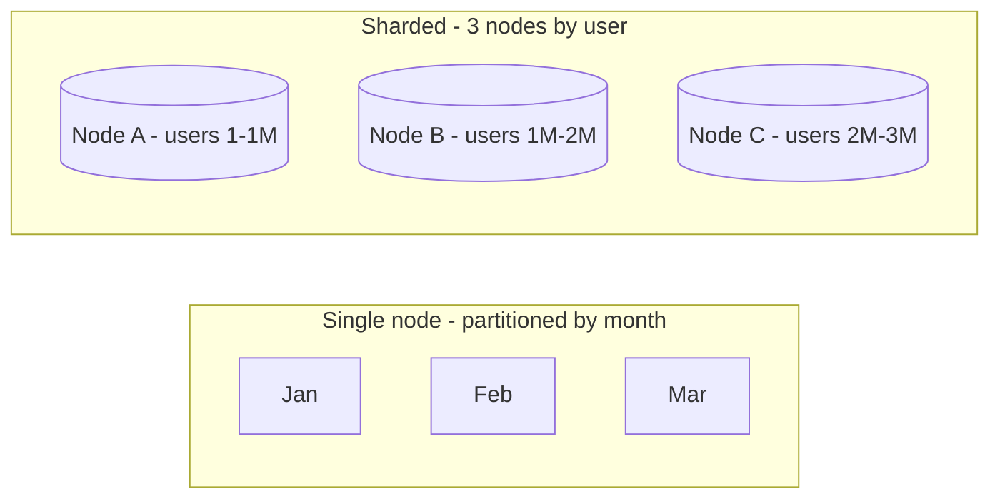

# Partitioning vs Sharding

## 1. One-Line Definition
Partitioning splits data across physical locations (same DB or cluster) along some dimension; sharding is specifically *horizontal* partitioning across *multiple independent nodes* — often used interchangeably, but the distinction matters when you discuss what actually moves and how it's managed.

## 2. Why Do We Need It?
Teams constantly confuse "partition by date" with "shard by user" and design the wrong thing: a partitioned index inside one database is not scale-out; a shard is. Getting the vocabulary right signals whether you understand where data physically lives and how performance, availability, and migration behave.

## 3. Simple Intuition
- **Partitioning = organizing a filing cabinet:** dividers (by month, by letter) make it faster to find things, but it's one cabinet (one DB node).
- **Sharding = multiple cabinets in different rooms:** you physically can't keep everything in one room anymore — a letter 'C' folder must stay in the 'C' room, and finding 'all letters' means visiting every room.

## 4. What Happens Without It?
Calling a date-partitioned table "sharded" gives false reassurance: the single node still caps writes/storage, a node crash takes *everything* down, and "we're sharded" leaks into capacity planning badly. Conversely, misdirected "partitions" inside a sharded store cause cross-partition scans.

## 5. Core Idea
**Partitioning (usually keeps a logical whole on one node):**
- **Range partitions:** by `date`/time (log/archive/size-managed), hot partitions small, old ones detachable.
- **List partitions:** by enumerated domain (region/status) — good for group affinity, risks skew.
- **Hash partitions:** by hash of a column — even, no natural range.
- Partitioning already inside one DB → index tree per partition, easier archiving, but **no write/storage scale**.

**Sharding (horizontal split across nodes):**
- Entire datasets (rows replacement) distributed to N nodes; each node is an independent DB with its own copies.
- Ownership rule = **shard key**; router decides node.
- Scale: write/storage grow with N (that's the real difference from partitioning).

**The relationship:** sharding *is* horizontal partitioning by location; partitioning is the umbrella term, often done *within* a shard too (e.g., each shard range-partitions its logs). The HLD line: "partitioning improves organization/archival/locality; sharding adds machines for scale."

## 6. Important Terminology

| Term | Simple Meaning |
|------|----------------|
| Partitioned table | One logical table cut into segments (usually one node) |
| Range/list/hash partition | The cutting rule |
| Detach/attach partition | Take a chunk offline (archive) |
| Shard | An independent node holding a horizontal slice |
| Shard key | The ownership column |
| Router / shard map | Where a key maps to a node |
| Skew | Uneven load across partitions/shards |

## 7. Basic Architecture



## 8. Request or Data Flow
- **Partitioned query:** planner prunes to the touched partitions by the partition key (fast, same node).
- **Sharded query:** router → owning node(s) → result; query without shard key = fan-out to all nodes (scatter-gather).

## 9. Practical Example
**Event streaming platform (assumptions):** 
- Each region's event DB sharded by `device_id` (write scale per region).
- Within a shard, **range-partition by `event_time`** (organizes archiving, keeps hot recent partitions small and indexed).
Result: sharding for scale, partitioning for manageability — both, deliberately.

## 10. Scaling
- Partitioning: gives archive/locality efficiency; one node caps everything (stop here = "it's fast but not scalable").
- Sharding: scale-out of writes AND storage; needs key strategy, routing, rebalancing. 
- Read scaling: partitions don't add machines; shards can each run replicas.

## 11. Reliability and Failure Scenarios

| Failure | Partitioned (1 node) | Sharded (N nodes) |
|---------|----------------------|--------------------|
| Node dies | All partitions down | Only that shard's slice; others serve |
| Rebalancing | Detach/merge partitions (easy) | Row migration across nodes (hard) |
| Skew | Date spike overloads the one node | One hot shard, others idle |
| Backup | Whole-node backup | Per-shard + coordination |

## 12. Consistency and Correctness
Partitioned single node = same transaction domain as before (ACID applies across partitions). Shards = per-shard transactions only; cross-shard = distributed designs. So partition, not shard, when you need cross-dimension transactional joins — the moment you shard you pay the cross-shard tax.

## 13. Performance
- Partition pruning: query touches only matching chunks → fast.
- Shard fan-out (no key in WHERE) = N× work → always require the shard key on hot paths.
- Partitions don't change the ceiling; shards multiply the ceiling (but add N network hops per fan-out).

## 14. Security
Same data-tier isolation rules apply to both (roles, TLS, at-rest encryption, tenant checks). Sharding *by tenant* enforces isolation physically; partitioning *by tenant* doesn't isolate failure/compute — a noisy neighbor can still run your partition on the same box.

## 15. Trade-Offs

| Choice | Advantages | Disadvantages | When to Use |
|--------|------------|---------------|-------------|
| Range partition | Pruning, archival, hot-zone | Skew/dates, single node | Logs/time queries |
| Hash partition | Even | No range | Balanced KV-ish |
| Shard (hash key) | Write/storage scale | Fan-out, cross-shard tx | Scale-out requirement |
| Shard (tenant key) | Isolation, co-location | Tenant skew | SaaS |
| Partition-inside-shard | Manageability + scale | Adds design layers | Big event/data systems |

## 16. Common Mistakes
- Calling a time-partitioned single DB "sharded" (it isn't — no scale-out).
- Expecting partitioning to make writes scale (it doesn't add nodes).
- Sharding without a key story and then shipping scatter-gather on every other query.
- Assuming partitioning grants availability (a partitioned single node still dies as one).

## 17. HLD vs LLD Boundary
HLD: partition-vs-shard decision per dataset, key/strategy, archival, migration. LLD: partition-key DDL, the router/hash code, partition-detach scripts.

## 18. Interview Questions

### Beginner
- What's the difference between partitioning and sharding?
- Can a partitioned table scale writes? Why/why not?

### Intermediate
- You have logs that need retention/pruning and 100x write growth — design with both terms correctly applied.
- When would you choose range partitioning instead of sharding even at load?

### Advanced
- Prove your sharded store keeps a specific transactional path single-shard while partition-indexing the archive.
- Design migration from a partitioned monolith to a sharded cluster with zero data loss.

## 19. Interview Memory Summary

> [!abstract]- Interview Memory Summary

### Remember

- Partition = cut (usually one node): organize, archive, prune.
- Shard = split across nodes: scale-out of writes and storage.
- Sharding is horizontal partitioning by *location* — the node is the difference.
- Partitioning helps performance/locality; sharding helps writes/storage.
- Failure modes differ: a partitioned single node dies as one; a shard's blast radius is its slice.
- Sharding and partitioning compose: shard for scale, range-partition inside each shard for manageability.

### 30-Second Explanation

Partition when you need organization/archival/pruning inside one node; shard when a single node can't hold writes or storage; both are fine together, layer by layer.

### Interview Traps

- Conflating the two — "sharded but still one physical DB" collapses the moment the interviewer asks how that node scales.
- Calling a time-partitioned single DB "sharded" (it isn't — no scale-out).
- Expecting partitioning to make writes scale (it adds no machines).
- Assuming partitioning grants availability (a partitioned single node still dies as one).

### Key Trade-Off

Partitioning buys manageability and pruning inside one node's ceiling; sharding removes the ceiling by adding machines, but pays with fan-out queries, cross-shard transactions, and per-shard failure isolation.

## 20. Related Concepts

### Prerequisites

- [[sharding|Sharding]] — sharding is the horizontal-partitioning-by-location case; the terms must be defined together.
- [[horizontal-vs-vertical-scaling|Horizontal vs Vertical Scaling]] — sharding is the horizontal scaling axis applied to databases.

### Commonly Used Together

- [[sharding-strategies|Sharding Strategies]] — the placement rule (hash/range/geo/tenant) chosen per dataset.
- [[shard-key|Shard Key]] — the ownership column that decides which shard a row lives on.
- [[consistent-hashing|Consistent Hashing]] — the ring that spreads keys across shards and makes rebalancing cheap.

### Alternatives

- [[database-replication|Database Replication]] — when the problem is reads, not capacity, replicas scale reads without sharding.
- [[horizontal-vs-vertical-scaling|Horizontal vs Vertical Scaling]] — stay on one node entirely (partition for manageability, scale vertically).

### Advanced Concepts

- [[cap-theorem|CAP Theorem]] — distributed constraints arrive as soon as data spans shard nodes.
- [[strong-vs-eventual-consistency|Strong vs Eventual Consistency]] — partition keeps one transaction domain; sharding fragments it.

Related planned topics (not authored yet): none.

## 21. References
PostgreSQL partitioning docs; DynamoDB partition-key docs; Kleppmann ch. 6. Verify current features with docs.

## 22. Active Recall

Test yourself before revealing each answer.

> [!question]- What is the difference between partitioning and sharding in one line?
> Partitioning cuts data into segments, usually inside one node, to organize/archive/prune; sharding splits data horizontally across multiple independent nodes to scale out writes and storage. Sharding is horizontal partitioning by location — the node is the difference.

> [!question]- Can a partitioned table scale writes? Why or why not?
> No. Partitioning cuts a table into segments on the same database; every write still goes to the same single node, which caps write throughput and storage. Only sharding adds machines and therefore write/storage capacity.

> [!question]- A team says "our time-partitioned table is sharded." Why is that wrong?
> Partitioning by date organizes data within one logical database (hot partitions small, old ones detachable), but a node crash takes everything down, writes and storage stay capped at one node, and the capacity-planning story is false. It is not scale-out unless rows are distributed across independent nodes.

> [!question]- You have logs needing retention/pruning plus 100x write growth. Design with both terms applied correctly.
> Shard the event database by `device_id` for write scale per region, and range-partition by `event_time` inside each shard so archiving and pruning are easy and hot recent partitions stay small. Sharding distributes; partitioning organizes — deliberately both.

> [!question]- When would you choose range partitioning instead of sharding even at load?
> When the load is really about manageability and locality, not capacity: the single node still fits the data, and you need partition pruning, archival by date, or hot-zone indexes. When cross-partition transactional joins matter, a single node keeps one ACID domain, which shards would fragment.

> [!question]- How do the failure modes of a partitioned single node differ from a sharded cluster?
> In a partitioned single node, one node dies → all partitions are down. In a sharded cluster, one node dies → only that shard's slice is unavailable and the rest keep serving (given per-shard replicas). Conversely a shard's rebalancing (row migration) is far harder than detaching/merging partitions.

> [!question]- Interview scenario: your database is slowing down. How do you decide between partitioning and sharding?
> Check which resource is the problem. Reads → caching/replicas. Manageability (archival, pruning, hot-zone) and the data still fits → partitioning. Write throughput or storage exceeds one node → sharding with a shard key and strategy. State the distinction — partition = organize, shard = scale — before committing.

> [!question]- What changes about transactions when you move from a partitioned table to shards?
> A partitioned single node keeps the same transactional domain — ACID spans the partitions. A sharded cluster supports per-shard transactions only; any transaction touching multiple shards becomes a distributed design (2PC/Saga). The moment you shard you pay the cross-shard tax unless the shard key keeps writes co-located.

## 23. When Should I Use This?

### Use it when

- Your dataset fits one node but needs archival, pruning, and hot-zone management → partition.
- You must scale write throughput or total storage beyond one machine → shard.
- Logs/events: shard for write scale, partition inside each shard for retention.
- You want partition pruning (queries touch only matching chunks) → partition.
- You need to name the architecture precisely so capacity planning and failure blast radius are understood correctly.

### Avoid it when

- You're calling time-partitioning on one node "sharding" to reassure stakeholders — it doesn't scale.
- The real bottleneck is reads — [[caching|Caching]] and [[database-replication|Database Replication]] are cheaper than either.
- Cross-partition transactional joins are common and you shard anyway — you've forced a distributed-transaction design.
- The team can't maintain the sharding machinery (key, router, rebalancing) — partition locally until it's justified.

### What problem does it solve?

One database becomes a bottleneck in two distinct ways: unwieldy maintenance (huge tables, bad pruning) and hard capacity ceilings (writes/storage). Partitioning is the fix for maintainability/locality inside one node; sharding is the fix for scale by splitting ownership across nodes — the decision is which bottleneck you actually have.

### What problem does it NOT solve?

Partitioning doesn't scale writes or storage (it adds no machines) and doesn't survive a node death any better. Sharding doesn't make cross-shard queries cheap, doesn't remove the need for per-shard replication, and can make a poorly chosen key the new hotspot source.

## 24. Decision Connections

Decisions that go together with partitioning vs sharding:

- [[sharding|Sharding]] — the concrete scale-out form of partitioning; its whole section builds on this distinction.
- [[sharding-strategies|Sharding Strategies]] — once you shard, the placement rule per dataset is required.
- [[shard-key|Shard Key]] — the ownership column that sharding (unlike partitioning) demands.
- [[consistent-hashing|Consistent Hashing]] — the mechanism that moves keys across shards with minimal disruption.
- [[database-replication|Database Replication]] — replicas scale reads and give each shard availability; not a substitute for sharding.
- [[horizontal-vs-vertical-scaling|Horizontal vs Vertical Scaling]] — sharding is horizontal scaling applied to storage; partitioning is within-machine organization.
- [[cap-theorem|CAP Theorem]] — the constraint shift from one-node partitions to cross-node shards.

Decision tree:

```
Database is growing — which tool?
    |
    +-- Manageability problem (archival, pruning, big-table)?
    |      → partition by date/range inside the node
    |
    +-- Write QPS or total storage exceeds one node?
    |      → [[sharding|Sharding]]
    |         |
    |         +-- even generic workload → [[sharding-strategies|Sharding Strategies]] (hash)
    |         +-- SaaS tenants         → tenant buckets
    |         +-- time series          → shard + range-partition inside
    |
    +-- Read-only growth, data still fits?
           → [[caching|Caching]] + [[database-replication|Database Replication]]
```