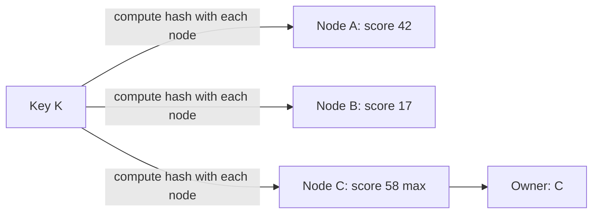

# Rendezvous Hashing

## 1. One-Line Definition
Rendezvous (highest-random-weight, HRW) hashing owns a key to the node with the maximum score of a hash computed over key and node — giving minimal reshuffling on membership change, with no ring, no token table, and no virtual nodes.

## 2. Why Do We Need It?
Membership changes (a cache node dies, a shard set grows) are constant in distributed systems, and you want the fewest keys to move. Consistent hashing delivers that via a ring — but a ring is state: token tables, collision handling, vnodes for evenness, and map distribution. Rendezvous hashing reaches the same "only the departed/arrived node's keys move" property from a pure formula, which makes it the sweet spot for small pools, flaky membership, and any place you'd rather not run a coordinator.

## 3. Simple Intuition
A group of friends picks a restaurant by each person secretly scoring every candidate and everyone agreeing the highest score wins. When one regular leaves, only the votes that had chosen him re-roll; everyone else keeps their pick. Rendezvous hashing works the same: every key "votes" for every node, and the highest-scoring node hosts it.

## 4. What Happens Without It?
In a 4-node cache, `hash mod N` rehashes every key when one node dies: the whole cache goes cold at once and the database eats a miss-storm. Consistent hashing fixes the blast radius but drags in ring structure and token-table sync. Rendezvous gives the minimal-move property with no ring math and no shared map — the right tool when the pool is small and peers should stay dumb.

## 5. Core Idea
- **The rule:** for key K and node s, compute `score = hash(K, s)` (a hash over the pair — e.g., `hash(K + s)`), and assign K to `argmax_s score`.
- **Why minimal moves:** when node s leaves, only keys whose max was s re-score — on average 1/N of keys. When s joins, only keys that would now prefer s move. Same guarantee as consistent hashing, straight from a formula.
- **Weighted rendezvous:** multiply scores by a weight factor so a 4x machine wins ~4x the keys, deterministically.
- **Cost:** O(N) hashes per lookup versus O(log N) token-table lookup in a ring — great for small N, needs *hierarchical rendezvous* (group nodes into tiers, recurse) to survive large N.
- **Determinism:** the owner is a pure function of (key, sorted membership). Any peer computes the same answer with no shared map — the routing state is just the node set itself.

## 6. Important Terminology

| Term | Simple Meaning |
|------|----------------|
| HRW / Rendezvous | Highest-random-weight selection by max score |
| Score | `hash(key, node)` — the voting ballot |
| Owner | The node with the max score |
| Minimal reshuffle | Only the leaving/joining node's keys move |
| Weighted HRW | Scaled scores so big nodes win more keys |
| Hierarchical rendezvous | Group nodes, recurse, for large N |
| Membership list | The shared, versioned node set |
| Tie-break | Fixed rule when two scores collide |

## 7. Basic Architecture



## 8. Request or Data Flow
1. A client holding the current membership list receives key K.
2. For each node s it computes `score = hash(K, s)` and tracks the maximum.
3. It routes to the argmax node; the key lives there.
4. Node B dies: the list drops B; only keys B once won (~1/N of them) re-score among survivors — and every client computes the same new home, because the list is shared.
5. No map to publish: peers agree by construction.

## 9. Practical Example
A 5-PoP CDN edge pool in front of a video API:
- Lookup cost: 5 hash calls per request ≈ microseconds — nothing.
- One PoP fails: ~1/5 of sessions re-hash to live PoPs; every client independently finds the same owners. No ring, no token table, no vnode config.
- A region adds a 30%-bigger PoP: weighted HRW gives it about 30% of traffic — capacity-aware with zero shard map.
- Scale boundary: at ~1000 flat nodes the O(N) hash loop is the real cost; below that threshold HRW is unbeatable in simplicity.

## 10. Scaling
- Small pools (2-50): HRW wins outright — a few hashes beat building and serving a ring.
- Large pools: hierarchical rendezvous (HRW over groups, then over members) restores O(log N) with small move amplification; a token-table ring (see [[consistent-hashing|Consistent Hashing]] / [[virtual-nodes|Virtual Nodes]]) is the flat big-fleet alternative.
- Membership churn: no rebalance event to coordinate — each key re-scores only when its winner disappears.
- Memory: no token table to store or push; the membership list (versioned, via [[service-discovery|Service Discovery]]) is the entire shared state.
- Deviation risk: peers with divergent member lists compute different owners — the one scaling trap that no hashing formula can paper over.

## 11. Reliability and Failure Scenarios

| Failure | What Happens | Detection | Recovery | Trade-off |
|---------|--------------|-----------|----------|-----------|
| Membership lags a dead node | Some keys route to the corpse | Health checks | List update → 1/N re-hash | request blip |
| Score tie at the max | Ambiguous owner | Tie-break rule (node id) | Deterministic winner | rare |
| Member lists diverge | Peers pick different owners | Versioned membership | Refresh from authoritative source | routing disagreement |
| Hostile member added | Keys steered to attacker | Signed membership | Reject unsigned entries | trust cost |
| Weight change | Keys re-slice immediately | — | Weighted score is deterministic | rebalance on re-weight |

## 12. Consistency and Correctness
- The correctness contract is "everyone shares the same sorted membership list." Split lists are split-brained routing — bind the list to a version/epoch even in a peer-to-peer world.
- Score collisions must break deterministically (lowest node id) or two peers disagree about the top.
- Reparenting still has a window: a client on stale membership may momentarily address a moved key — dual-read or hold the key during the change (see [[data-migration|Data Migration (Dual Reads/Writes, CDC)]]).
- Retried writes across a reparent must deduplicate (see [[idempotency|Idempotency]]), exactly as with any ring move.

## 13. Performance
- Lookup: N hash calls at ~100-200 ns each → ~1-2 µs at N=10, ~100-200 µs at N=1000 (the crossover).
- No table to build/cache/push — membership is O(N) bytes and updates travel with the version.
- Steady-state balance and 1/N moves match a vnode ring while carrying near-zero infrastructure — the right answer for per-tenant placement in a shared-nothing fleet.

## 14. Security
The membership list defines the trust boundary: inflating it or faking a node's weight is corrupting the routing table. Authenticate/sign the membership source, run scoring on server-side canonical inputs (never a client-supplied node list — that's routing injection), and make tie-breaks independent of user input.

## 15. Trade-Offs

| Choice | Advantages | Disadvantages | When to Use |
|--------|------------|---------------|-------------|
| Rendezvous (HRW) | No ring/tokens, deterministic, weighted | O(N) hashes per key | Small pools, flaky membership |
| Consistent ring | O(log N) lookup, huge N | Token table + vnode care | Large stable fleets |
| Vnode ring | Balance + weight, huge N | Heavier state | 10k+ or heterogeneous |
| Hierarchical HRW | O(log N), small footprint | More moves when a group breaks | Large but group-friendly |
| hash mod N | O(1), trivial | Everything moves each change | Static, never-changing |

## 16. Common Mistakes
- Running flat HRW at thousands of nodes — the O(N) loop becomes the lookup.
- Ignoring weighted mode and mapping 10x machines 1:1.
- Treating membership as "the same list, eventually" — divergent lists produce divergent owners.
- No tie-break rule — a score tie silently disagrees between peers.
- Believing "no state" means "no coordination" — every peer still needs the same versioned membership.

## 17. HLD vs LLD Boundary
HLD: HRW vs ring vs hybrid, weighting policy, membership versioning source, hierarchy depth for large N. LLD: the exact `hash(key, node)` combine and tie-break rule, the argmax loop, the weight scale factor, and the membership watcher in a client.

## 18. Interview Questions

### Beginner
- In one sentence, how does rendezvous hashing pick a key's owner?
- Where does its O(N) price tag bite?

### Intermediate
- A 4-node cache loses one node. How many keys move, and why is that the same as consistent hashing?
- You have three machines of different sizes. How do you weight rendezvous hashing?

### Advanced
- 200 nodes, lookups must stay sub-100 µs. Rendezvous or ring? Show the arithmetic, and if HRW, sketch the hierarchical variant.
- Two clients pull different membership lists. What breaks, and what protects routing?

## 19. Interview Memory Summary

> [!abstract]- Interview Memory Summary
> ### Remember
> - Owner = node with max `hash(key, node)`.
> - Same minimal-reshuffle promise as consistent hashing: ~1/N keys move per membership change.
> - No ring, no token table, no vnodes — deterministic from a shared membership list.
> - Weighted = scaled scores so big nodes win more keys.
> - O(N) hashes per key: sweet spot small/medium pools; hierarchical HRW or a ring for huge N.
> - Membership must be versioned and consistent across peers, or owners disagree.
> - Fixed tie-break for score collisions.
> ### 30-Second Explanation
> For each key, hash it with every candidate node and serve it from the max score. Pure function of (key, membership), so any peer computes the same owner from the same list; a node leaving or joining re-rolls only its own keys — the 1/N property with no ring to run. Weight by machine size, tie-break deterministically, and graduate to a hierarchical variant or token ring once N outgrows the hash loop.
> ### Interview Traps
> - Calling it constant time — it is O(N), a real constraint at scale.
> - Forgetting weighted mode and mapping 10x machines 1:1.
> - Divergent member lists → different owners; hash purity won't save you.
> - No tie-break rule — the silent disagreement.
> ### Key Trade-Off
> Rendezvous trades O(N) lookup compute for zero ring state and deterministic 1/N moves — perfect for small, churning, heterogeneous pools; wrong once a token table amortizes better than the hash loop.

## 20. Related Concepts

### Prerequisites

- [[consistent-hashing|Consistent Hashing]] — the same minimal-move goal via a ring
- [[sharding|Sharding]] — rendezvous as a zero-drama placement rule

### Commonly Used Together

- [[virtual-nodes|Virtual Nodes]] — the ring's balance-smoothening versus HRW's simple weighting
- [[shard-routing|Shard Routing and Metadata]] — the membership list is the metadata HRW consumes
- [[service-discovery|Service Discovery]] — the shared, versioned membership source
- [[data-migration|Data Migration (Dual Reads/Writes, CDC)]] — bridging the reparenting wave
- [[load-balancing|Load Balancing]] — session/cache affinity at the L7 tier via HRW

### Alternatives

- [[consistent-hashing|Consistent Hashing]] — when a token table pays off at scale
- [[virtual-nodes|Virtual Nodes]] — weighted placement for very large fleets

### Advanced Concepts

- [[cell-based-architecture|Cell-Based Architecture]] — per-tenant placement: HRW is a natural cell router

## 21. References
Thaler & Ravishankar (1998), "Using Name-Based Mappings to Increase Hit Rates" — the original HRW/rendezvous paper. Karger et al. (1997) for the consistent-hashing comparison. Cross-check weighted-HRW formulas against recent distributed-hash literature before shipping a weighted production seed.

## 22. Active Recall

Test yourself before revealing each answer.

> [!question]- Show, in two equations, why a departing node moves only ~1/N of keys.
> Owner(K) = argmax_s hash(K, s). The departed node won the vote for roughly keyspace/N of keys; after it leaves only those keys re-score. Because the score function never depends on membership, every other key's winner is unchanged — only the vote losers re-roll.

> [!question]- Design decision: 8 heterogeneous machines, weights 1x to 4x. What changes for weighted HRW?
> Scale each candidate's score by a weight factor (e.g., `score = w / max(1, -log hash)` or another monotone transform). A w=4 machine wins ~4x as many keys as w=1; loads follow weights deterministically and nothing else in the lookup changes.

> [!question]- Trade-off: rendezvous vs a consistent-hash ring at 50 nodes vs at 5,000 nodes.
> At 50 nodes both are even and move 1/N; HRW wins on zero ring state (a versioned membership list, ~50 hashes ≈ microseconds). At 5,000 nodes the ring's O(log N) token lookup beats flat O(N) hashing, unless you go hierarchical HRW — groups first, then members — which restores O(log N) with a little move amplification on group breaks.

> [!question]- Failure scenario: two edge services see different membership lists for the same key.
> They compute different owners, so different clients hit different nodes for the same key — split-brained routing. Protection: a single authoritative, versioned membership source (service discovery/gossip with epochs); clients refuse stale-version use for writes and flag it for reads; an operator alert on version skew.

> [!question]- Interview scenario: "We have ten cache nodes. Which consistent-hash tuning should we use?"
> For ten nodes, skip the ring tuning entirely: rendezvous hashing gives you even balance, weighting, and 1/N moves with no token table, no vnodes, and nothing to coordinate — one hash per node per key (~10 hashes ≈ 2 µs). The ring's machinery starts paying off only at hundreds-to-thousands of nodes.

## 23. When Should I Use This?

### Use it when

- The node pool is small enough that N hashes per lookup is trivial (roughly ≤ a few hundred).
- Membership churns and you want minimal moves without running ring infrastructure.
- Peers must agree with no coordinator — HRW's determinism from a shared list is the guarantee.
- You need weighted placement (heterogeneous machines, CDN regions) cheaply.

### Avoid it when

- The fleet is in the thousands and flat — the O(N) loop dominates; use a ring or hierarchical HRW.
- You need range queries (HRW is a point-placement rule, not a tree) — that stays a sharding-design concern.
- No reliable membership source exists — divergent lists make the scheme silently wrong.

### What problem does it solve?

It gives consistent-hashing's minimal-reshuffle and evenness without any ring state — a drop-in deterministic placement rule for caches, edge pools, and per-tenant shard routing.

### What problem does it NOT solve?

Huge-N scale (its O(N) cost), range/co-location placement (it is key→node only, not key→ordered-structure), and membership agreement (the membership list's consistency is upstream of the algorithm, not guaranteed by it).

## 24. Decision Connections

- [[consistent-hashing|Consistent Hashing]] — the same goal via a ring; compare before choosing.
- [[virtual-nodes|Virtual Nodes]] — the ring's answer to HRW's weighting.
- [[shard-routing|Shard Routing and Metadata]] — membership as the metadata HRW reads.
- [[service-discovery|Service Discovery]] — where the shared, versioned list comes from.
- [[data-migration|Data Migration (Dual Reads/Writes, CDC)]] — the reparenting window bridge.
- [[load-balancing|Load Balancing]] — session/cache affinity reuse of HRW.
- [[cell-based-architecture|Cell-Based Architecture]] — per-tenant cell routing via HRW.

Decision tree:

```
Need deterministic key-to-node placement?
    |
    +-- Pool small enough (<= a few hundred flat)?
    |      → [[rendezvous-hashing|Rendezvous Hashing]] (weighted if heterogeneous; tie-break fixed)
    |
    +-- Huge flat fleet (thousands)?
    |      → [[consistent-hashing|Consistent Hashing]] + [[virtual-nodes|Virtual Nodes]] (token table)
    |
    +-- Huge but group-friendly?
    |      → hierarchical rendezvous (groups, then members)
    |
    +-- Static set, never changes?
           → hash mod N is fine (O(1), zero machinery)
```