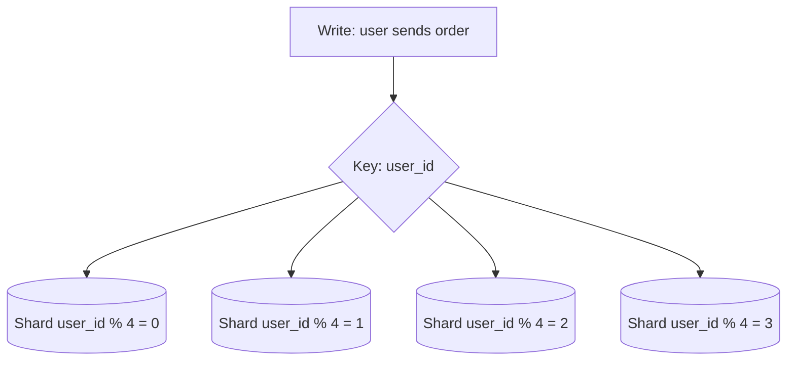

# Shard Key

## 1. One-Line Definition
The shard key is the column(s) a system uses to decide which shard owns a row — the single most important, hardest-to-change decision in a sharded database.

## 2. Why Do We Need It?
Sharding routes by a key; everything downstream—data evenness, write throughput, transaction scoping, geographic affinity, query cost, rebalancing pain, and hotspot risk—is a consequence of that one choice. It is effectively immutable once traffic accumulates, so it must be chosen from the *actual* workload, not convenience.

## 3. Simple Intuition
A library decides shelves are organized by first letter of the author's name. That works if names are evenly spread — but my shelf ("A" authors) holds 10x everyone else's, and "query all books by subject" now means visiting every shelf. The shelf rule is the shard key: it was set once, it's painful to re-shelve, and it baked in the skew.

## 4. What Happens Without It?
Without a deliberate key you either hash on the wrong column (skew), choose a low-cardinality one (`status`, `country`) → hot shards, or pick one that scatters related rows → every write becomes cross-shard (distributed transactions, slow). Retrofitting a key later = full data migration.

## 5. Core Idea
Choose a key by four criteria:
1. **High cardinality** — many distinct values → even spread (avoid `status`: 2 values → 2 shards matter).
2. **Even write distribution** — writes spread across shards (avoid "the new rows all go to today's shard" if time-based).
3. **Co-location** — rows read/written together share a shard (all of a user's data on one shard → single-shard transactions, no fan-out).
4. **Query affinity** — the common queries can be answered by one shard (`WHERE user_id = ?` if keyed by it).

Trade-offs per strategy (see [[sharding-strategies|Sharding Strategies]]):
- **Hash key:** even spread, but range queries become fan-out; reshard loves even.
- **Natural/tenant key:** co-location + isolation, but tenant size skew (one huge tenant = huge hot shard).
- **Geo key:** locality, but with time/geography skew and migration pain.
- **Composite key:** sometimes key `(tenant_id, id)` to balance isolation + spread.

**The acid test:** simulate your top-10 queries and writes against a draft key. If any write path is cross-shard by design or any hot tenant is a shard-sized bomb, reconsider.

## 6. Important Terminology

| Term | Simple Meaning |
|------|----------------|
| Shard key | Ownership column(s) |
| Cardinality | Number of distinct values |
| Skew | Uneven distribution across shards |
| Hot shard | One shard overloaded by its key |
| Co-location | Related rows on the same shard |
| Fan-out / scatter-gather | Query visiting all shards |
| Composite shard key | Multi-column ownership rule |

## 7. Basic Architecture



## 8. Request or Data Flow
1. Request carries key value (user_id).
2. Router hashes/ranges/maps it → owning shard.
3. Own-shard write is single-shard and transactional; the derived data (orders, txns) lives with the same user_id on the same shard.
4. Cross-key queries (admin "all users over 30") fan out — routed to an analytics store, not the hot path.

## 9. Practical Example
**Multi-tenant SaaS orders (assumptions):** tenants vary 1k-5M rows.
- Draft A `tenant_id`: perfect isolation, but the 5M-row tenant owns a shard nearly by itself → hot cornerstone.
- Draft B `(tenant_id, order_id)` hash: each tenant also spreads **within** one shard group (can't split a tenant across shards if you want tenant-level transactions co-located...) — resolve by **bucketing**: hash `tenant_id` to a *shard group*, then order_id within. Keeps tenant co-located, large tenants spread across a few shards.
- Chosen: composite with bucketing; top-10 queries verified single-shard.

## 10. Scaling
- **Even spread:** hash keys scale linearly; natural keys hit tenant skew.
- **Co-location at scale:** within-shard indexes still hold; global lookups via secondary mapping/fan-out.
- **Rebalancing:** hash keys rehash evenly; natural keys migrate whole-tenant (awkward). Prefer keys that rebalance cheaply (see [[consistent-hashing|Consistent Hashing]]).
- **Hot shard fix:** split hot key (1 key → K sub-shards), replicate hot data to read replicas, cache the hot tenant.

## 11. Reliability and Failure Scenarios

| Failure | Happens | Detection | Recovery | Trade-off |
|---------|---------|-----------|----------|-----------|
| Key skew | One shard overloaded | Per-shard load/CPU diff | Split/cache/migrate tenants | complexity |
| New trend (viral user) | Existing key now hot | Latency spike | Hot-key split/replicas | edge cases |
| Reshard in place | Migrations mid-flight | Status | Dual-read + pause per key | window |

## 12. Consistency and Correctness
With the right key your business-critical ops are **single-shard** (ACID as before). The correctness contract: relate rows by the key and never trail a design dependency across shards. Cross-shard is a deliberate design (distributed transactions or Sagas) — the key choice notoriously *decides* how much of that you pay.

## 13. Performance
- Single-shard = sub-ms; fan-out = QPS that multiply by shard count — the key literally sets your lookup cost.
- Index behavior: per-shard indexes act like a partitioned global index; range scan across shards = N-part scan → avoid or use a range-key.

## 14. Security
- Tenant-scoping by key = the *isolation mechanism*: permission reasoning becomes "can this principal access this shard key?" — keep ACL data in the same shard (co-located) and validate tenant ownership per op.
- Cross-tenant leak via wrong-key queries must be blocked by routing + row checks.

## 15. Trade-Offs

| Choice | Advantages | Disadvantages | When to Use |
|--------|------------|---------------|-------------|
| Low-cardinality key | none | inevitable hot shards | never |
| Hash on arbitrary high-cardinality | even | breaks co-location | KV-ish workloads |
| Natural (user/tenant) key | co-location, isolation | tenant skew | app-scoped data |
| Composite + bucket | isolation+spread | design complexity | Large SaaS |
| Time/geo key | range locality | future skew | logs/events (time shards) |

## 16. Common Mistakes
- Choosing by "what exists" (`id`, `status`) instead of *query+write pattern*.
- Locking a key that scatters related writes (user orders not co-located → distributed tx catastrophe).
- Ignoring tenant skew: "tenant_id as-is" for a marketplace with one huge tenant.
- Forgetting a key change = migration: the key is a permanent contract, not a config.

## 17. HLD vs LLD Boundary
HLD: key choice, bucketing, co-location rules, hotspots, migration strategy. LLD: the exact hashing/bucketing function, key derivation in DAOs, route lookup code.

## 18. Interview Questions

### Beginner
- What is a shard key and why is it the most important design decision?
- Why is low cardinality bad for a shard key?

### Intermediate
- Pick a shard key for a messaging app. Show the write path stays single-shard.
- A tennis-tournament SaaS has one 100x-larger tenant. Design the key + plan.

### Advanced
- Change the shard key on a live 2TB store with zero downtime (and zero lost writes).
- Prove your chosen key handles a 100x growth in tenant size without new hot shards.

## 19. Interview Memory Summary

> [!abstract]- Interview Memory Summary

### Remember

- The key is the ownership rule — evenness, transaction scope, query cost, and reshard pain all follow from it.
- Four criteria: high cardinality, even write distribution, co-location, query affinity.
- Hash = even spread; natural/tenant = co-located but skew-prone; composite + bucketing = large SaaS.
- Hot shards are almost always a key mistake (low cardinality or tenant skew).
- Keys are contracts: changing one is a full-data migration.
- Acid test: simulate your top-10 queries and writes against a draft key before committing.

### 30-Second Explanation

Evaluate a key against the four criteria using your real top-10 queries; keep writes and transactions single-shard and tenants co-located; hash or bucket to avoid skew; treat the key as an immutable contract.

### Interview Traps

- "Shard by user_id" for a system whose core query is "all products across all users" — the key must answer your dominant access pattern, not your identity column.
- Choosing by "what exists" (`id`, `status`) instead of query+write pattern.
- Low-cardinality keys (status, country) → inevitable hot shards.
- Ignoring tenant skew: "tenant_id as-is" for a marketplace with one huge tenant.
- Forgetting a key change equals migration — the key is a permanent contract, not a config.

### Key Trade-Off

Co-location and single-shard transactions pull toward a natural key, even spread pulls toward a hash key; the composite-plus-bucketing design buys both, at the cost of design and migration complexity.

## 20. Related Concepts

### Prerequisites

- [[sharding|Sharding]] — you only choose a shard key once you've decided to shard.
- [[database-keys|Database Keys]] — primary/composite key distinctions map directly onto shard-key design.

### Commonly Used Together

- [[sharding-strategies|Sharding Strategies]] — the strategy (hash/range/directory/tenant) is the mechanism the key feeds into.
- [[consistent-hashing|Consistent Hashing]] — the ring turns the key into a shard assignment and makes rebalancing cheap.

### Alternatives

- [[horizontal-vs-vertical-scaling|Horizontal vs Vertical Scaling]] — skip the shard key entirely by staying on one node.
- [[database-replication|Database Replication]] — handle read growth without any shard-key decision.

### Advanced Concepts

- [[cap-theorem|CAP Theorem]] — distributed constraints arrive the moment the key scatters data across shards.
- [[strong-vs-eventual-consistency|Strong vs Eventual Consistency]] — whether cross-shard ops stay strong depends on keeping related writes on one shard.

Related planned topics (not authored yet): none.

## 21. References
Managed DB partition-key docs (DynamoDB partition keys, MongoDB shard keys, Postgres logical replication partitions). Verify guidance with current docs.

## 22. Active Recall

Test yourself before revealing each answer.

> [!question]- Why is the shard key called the most important decision in a sharded database?
> It is the ownership rule: every downstream property — data evenness, write throughput, transaction scoping, query cost, rebalancing pain, hotspot risk — follows from it. And it is effectively immutable once traffic accumulates because changing it means migrating all data.

> [!question]- Enumerate the four criteria for evaluating a shard key.
> 1. High cardinality — many distinct values → even spread.
> 2. Even write distribution — writes land across shards, not on today's hot shard.
> 3. Co-location — rows read/written together share a shard.
> 4. Query affinity — the common queries are answerable from a single shard.

> [!question]- A library organizes shelves by author surname and the "A" shelf holds 10x everyone else's. What concept is this?
> The shelf rule is a shard key: it was set once, it's painful to re-shelve (migration), and it baked in skew. The "A" shelf is a hot shard caused by choosing a low-cardinality or skewed key dimension.

> [!question]- Pick between `tenant_id` and `(tenant_id, order_id)` for a SaaS with one tenant 100x larger than the rest.
> Plain `tenant_id` gives perfect co-location but the big tenant owns a shard nearly alone → a hot cornerstone. The composite `(tenant_id, order_id)` with bucketing (hash tenant_id to a shard group, then order_id within) keeps the tenant co-located while letting a large tenant spread across a few shards. Verify your top-10 queries stay single-shard.

> [!question]- What happens if you shard a messaging app by `user_id` but an admin query asks "all messages sent today"?
> The query has no shard key, so it fans out to every shard and aggregates (scatter-gather) — QPS multiplies by the shard count. The fix isn't a different key; it's routing global/admin queries to a separate analytics store, not the hot path.

> [!question]- When would a composite shard key with bucketing be the wrong choice?
> When the extra design and migration complexity isn't justified — e.g., small node counts, a single co-located dimension that already spreads evenly, or when cross-tenant queries are the dominant pattern and no bucketing scheme will help.

> [!question]- A viral user makes an existing, well-chosen key suddenly hot. What do you do?
> The key was right at design time but the workload trended. Mitigations: split the hot key into K sub-shards (suffix the key), replicate the hot data to read replicas, and cache the hot tenant aggressively. Detection is latency/load skew on one shard.

> [!question]- Interview scenario: "Change the shard key on a live 2TB store with zero downtime and no lost writes." What's your plan?
> Treat it as a migration: dual-read/write old and new key layouts during cutover, mark keys in-flight, verify, then atomically switch routing and backfill/cleanup old. Because the key is a contract, make the case up front: this is the most expensive sharding event — choose keys to avoid it.

> [!question]- Why is a low-cardinality key like `status` never acceptable as a shard key?
> It has two or three distinct values, so only two or three shards can ever be touched — a handful of shards carry the entire load and the rest sit idle. Cardinality must be high enough that the hash/range spreads across all shards.

## 23. When Should I Use This?

### Use it when

- You are sharding a database and every read/write carries a value you can route on.
- The workload has a dominant access pattern (user, tenant, order) that can co-locate most operations.
- Writes must stay single-shard and transactional.
- You need to reason explicitly about evenness, hot spots, and future resharding up front.

### Avoid it when

- The real problem is reads or a single-node dataset — no sharding, no key needed.
- The dominant queries are global aggregations that no key can make single-shard.
- The team can't commit to migration discipline: a key change is a full data migration.
- Writes inherently scatter across unrelated entities (any key still produces distributed transactions).

### What problem does it solve?

Routing by a random column is the bottleneck: it produces hot shards, cross-shard writes, and a migration every time you guess wrong. A deliberate shard key — high cardinality, even writes, co-located — makes operations single-shard, balances load, and fixes resharding cost at design time.

### What problem does it NOT solve?

It cannot make fundamentally cross-shard queries single-shard (those need an analytics store or fan-out), cannot fix tenant sizes that exceed a shard (needs bucketing/splitting), and cannot undo the choice later without migrating data.

## 24. Decision Connections

Decisions that go together with the shard key:

- [[sharding|Sharding]] — the key is the core decision inside the sharding design; you cannot shard without it.
- [[sharding-strategies|Sharding Strategies]] — the strategy is the placement mechanism the chosen key drives.
- [[consistent-hashing|Consistent Hashing]] — the ring is how the key value becomes a shard, cheaply rebalanced.
- [[database-keys|Database Keys]] — primary/composite key thinking feeds directly into key choice and bucketing.
- [[database-indexing|Database Indexing]] — within-shard indexes and global secondary/fan-out lookups extend the key decision.
- [[database-replication|Database Replication]] — replicas absorb reads and hot-tenant load that a key split can't fully fix.
- [[horizontal-vs-vertical-scaling|Horizontal vs Vertical Scaling]] — the alternative path that avoids the key entirely.

Decision tree:

```
Designing a sharded store?
    |
    +-- Dominant queries are cross-entity/global?
    |      → don't shard on identity; use analytics/fan-out and rethink
    |
    +-- Single co-located dimension (user/tenant) dominates?
    |      → key on it for single-shard writes
    |         |
    |         +-- one tenant 100x the rest? → composite (tenant_id, id) + bucketing
    |         +-- writes need evenness?
    |                → [[consistent-hashing|Consistent Hashing]] on the key
    |         +-- range/time queries matter?
    |                → range key but accept future skew
    |
    +-- Low-cardinality dimension is all you have?
           → never use it as the key; scale another way
```