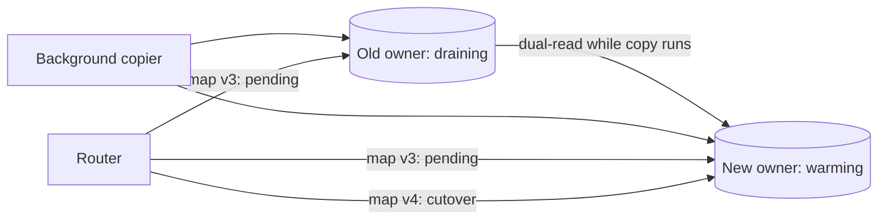

# Shard Rebalancing and Hot Shard

## 1. One-Line Definition
Shard rebalancing moves data and load between shards — splitting, merging, or redistributing ownership — so the cluster stays balanced as nodes join, leave, or grow; a hot shard is the extreme where one shard's load dwarfs the rest and needs the same machinery to be fixed.

## 2. Why Do We Need It?
Sharding works only while load and storage are spread evenly. Data grows (some keys balloon), nodes are added (to double capacity), machines are retired, and occasionally a celebrity key or a bad shard key concentrates writes. Without rebalancing, a sharded system degrades into "one big shard under a router": the biggest shard throttles the cluster, and the promised linear scaling becomes a lie.

## 3. Simple Intuition
A warehouse with 8 lanes, one lane assigned to each supplier's deliveries. Warehouse A's lane suddenly owns 40% of all boxes (a giant supplier joined). Every lane is a fixed conveyor, so lane A melts while the others idle. Rebalancing = rebalancing the lane assignments (split the giant supplier across two lanes, or move lanes around on a ring of belts) — done on the fly, without closing the loading dock.

## 4. What Happens Without It?
A single hot shard saturates: its latency spikes, its replicas churn, the router retries pile up, and the fan-out of cross-shard work that touches it slows every dependent query. Meanwhile the fix — moving rows off the hot shard — is precisely the operation the system never designed. Without the migration machinery, you're stuck with a celebrity key and no way to rebalance it except downtime or a rewrite.

## 5. Core Idea
Two problems, one toolbox:

**Rebalancing load:**
- **Why a shard becomes hot:** a low-cardinality shard key (`status`, `country`), a celebrity key (one user/tenant), append-heavy time keys (yesterday's shard), or uneven tenant sizes.
- **Mechanisms to rebalance:**
  - **Resharding:** change shard count N→M and re-distribute ownership. Cheap only with [[consistent-hashing|Consistent Hashing]] (1/N of keys move) or ring-based partitioning; painful with raw `hash mod N` (everything rehashes).
  - **Split/merge:** a shard can split into two, or two merge — the base unit of Cassandra vnode/HBase region management.
  - **Directory moves:** move individual keys or ranges by editing the ownership map (see [[shard-routing|Shard Routing and Metadata]]).
  - **Hot-key fan-out:** split one oversubscribed key into K synthetic keys (`user_0`..`user_K-1`) so it spreads across shards, or cache the hot key aggressively.
- **Ownership transition discipline:** drain Old, backfill New, dual-read during the cutover, switch the map, retire Old (see [[data-migration|Data Migration (Dual Reads/Writes, CDC)]]).

**Detecting the need:** skew is the metric — bytes, QPS, or latency per shard. Set imbalance and hot-key alerting; the proper alert is "shard X p99 is 5x median," not "CPU on the DB is high."

## 6. Important Terminology

| Term | Simple Meaning |
|------|----------------|
| Skew | Shards with very unequal load/storage |
| Hot shard / hot key | One shard/key with disproportionate traffic |
| Rebalancing | Moving ownership+data to even out load |
| Resharding | Change shard count N→M |
| Split / merge | One shard splits; two combine |
| Draining | Old owner stops taking new assignments |
| Dual-read / dual-write | Read/write both old+new during move |
| Cutover | The instant ownership flips to New |
| Consistent hashing | Ring that only moves 1/N of keys |
| Hot-key fan-out | Split one hot key into K sub-keys |

## 7. Basic Architecture



## 8. Request or Data Flow
1. Skew detector flags Shard A (3.2x median latency; one key at 60% of its QPS).
2. Plan: split the hot key into 8 sub-keys and mark the range "moving" in the map (version bump; the router dual-reads Old+New for reads).
3. Background copier streams rows Old→New with a per-key checkpointer; writes continue safely via dual-write (both shards) while copy is in-flight.
4. Verify (row counts + checksums on both sides), then CAS the map to ownership: New only. Router stops dual-reading.
5. Drain Old fully, retire it. Skew alert clears.

## 9. Practical Example
A 16-shard chat app, hash by `user_id`. One influencer's fan community floods `user_777` (5x the median shard load).
- **Fan-out fix:** shadow-copy `user_777` as `user_777_0`..`user_777_7` spread across 8 shards; the router's map answers `user_777` reads to those 8.
- **Rebalance mechanics if the cluster grows:** moving from 16 to 32 shards with proper ring/routing moves ~3% of keys (1/32), each key gets the dual-read treatment; ~6-10 hours of background copy at bounded bandwidth, zero downtime; verifies to a checksum gate; flips map v9→v10.
- Data sizes: 4 TB across 16 shards → 250 GB per shard; the 3% migration = ~120 GB moved at 500 MB/s ≈ 4-5 minutes of sustained copy per shard, so parallelize per-shard.

## 10. Scaling
- Rebalancing cost is bandwidth, not coordination: the right scheme (ring or virtual-node based) keeps the touched fraction at 1/N — the reason [[consistent-hashing|Consistent Hashing]] and [[rendezvous-hashing|Rendezvous Hashing]] exist.
- More shards → more routers/meta churn: keep the map small and version-gated (see [[shard-routing|Shard Routing and Metadata]]).
- Hot keys among many small keys: fan-out + caching (see [[caching|Caching]]) beats micro-migration; hot *by range* (time series) is best fixed by designing the key, not by rebalancing after the fact.
- Bottleneck of any migration: the source shard's read amplification while serving dual-reads — pace the copier and backfill with throttling so the fix doesn't melt the shard it's saving.

## 11. Reliability and Failure Scenarios

| Failure | What Happens | Detection | Recovery | Trade-off |
|---------|--------------|-----------|----------|-----------|
| Copier crashes mid-move | Partial copy on New | Checkpointed position | Resume from checkpoint | copy progress |
| Cutover metadata lost | Routers disagree about ownership | Version mismatch | Re-verify via checksum | correctness window |
| Source shard dies during copy | Reads+copy both blocked | Health on Old | Promote Old's replica, resume | extra copy start |
| Hot key splits badly | Sub-keys still unbalanced | Per-subkey metric | Re-key or cache | over-splitting |
| Dual-write divergence | Old and New drift while copying | Drift checksum | Re-copy listed keys | correctness vs bandwidth |

## 12. Consistency and Correctness
- The transition contract: **at any instant, every key's truth lives in exactly one place the router will serve, or is dual-covered.** Reads dual-read Old+New and merge by version (never both, never neither); writes dual-write during the window.
- Cutover is atomic from the map's view (CAS on the ownership entry, single version bump), so routers flip together — no half-flipped shard.
- Retries must be idempotent across the move: a retried write that lands on the old owner after cutover must be reconciled, not duplicated (see [[data-migration|Data Migration (Dual Reads/Writes, CDC)]] and [[idempotency|Idempotency]]).
- Concurrency safety: two migrations of overlapping ranges are forbidden — the movement manager serializes per-range with a lease.

## 13. Performance
- Dual-read doubles read cost only for the migrating fraction (1/N of keys) — negligible during a normal rebalance.
- Copy bandwidth is the real tax; throttle it below source-shard spare capacity (typical 5-15% of NIC budget).
- Fan-out of hot keys adds a small router indirection (sub-key lookup) — sub-ms — and splits one hot QPS stream across N machines; this is the difference between 5x-overloaded and even.
- Skew alerting is cheap; the expensive event is ignoring it and letting the hot shard's p99 become everyone's p99.

## 14. Security
Migration machinery moves data to fresh hardware: encrypt at rest on the New shard, clamps on who can trigger a rebalance (unauthenticated rebalance = denial of service and a data-exfiltration channel), and tenant isolation across the move (a hot tenant's split must never mix with another tenant's shard, or the fan-out leaks one tenant's reads into another's partition).

## 15. Trade-Offs

| Approach | Advantages | Disadvantages | When to Use |
|--------|------------|---------------|-------------|
| Raw hash mod N | Simple | Full rehash to change N | Never, after day one |
| Consistent hash / vnodes | 1/N keys move; easy add/remove | Some imbalance and arc management | The default |
| Split/merge | Fine-grained, natural | More moving parts | Region/vnode stores |
| Directory moves | Pinpoint fixes | Map is state to maintain | Hot tenants, rare keys |
| Hot-key fan-out | Fixes the worst skew fast | Extra indirection, over-split risk | Celebrity keys |

## 16. Common Mistakes
- Choosing an append-only key (timestamp) so "the newest shard" is always the hot one.
- Forgetting dual-write during migration and relying on the copier alone — a write to the old shard after copy would vanish.
- Cutting over on row counts without checksums or a drift check.
- Moving too much at once: the copy throttles nothing and starves the primary workload.
- Fixing hotspots reactively without the skew telemetry — you can't rebalance what you never measured.

## 17. HLD vs LLD Boundary
HLD: rebalancing scheme (ring/directory), split/merge policy, skew thresholds, migration protocol (drain-copy-verify-cutover), hot-key strategy. LLD: the copier's checkpoint format, the per-key drift checksum, the router's dual-read branch, and the CAS on one map entry.

## 18. Interview Questions

### Beginner
- Why does a sharded system go hot even when the shard key had good cardinality?
- What makes `hash mod N` painful to rebalance?

### Intermediate
- A single public user's key is at 6x its shard's load. Design the fix without downtime.
- Walk the safe reshard from 8 to 16 shards: who reads what, and when is it safe to cut over?

### Advanced
- Your vnode cluster is rebalancing and one shard is simultaneously the copy source and the hottest service node. Prioritize and repair.
- Design the consistency contract that makes migration equivalence provable before cutover.

## 19. Interview Memory Summary

> [!abstract]- Interview Memory Summary
> ### Remember
> - Rebalancing = load/storage evenly, done live: drain, copy, verify, cut over.
> - Skew is the kill metric: bytes, QPS, or p99 per shard vs the median.
> - Cheap rebalance needs [[consistent-hashing|Consistent Hashing]]/vnodes: only 1/N of keys move.
> - Transition contract: a key is served by one owner or dual-covered, never neither.
> - Dual-read + dual-write during migration; checksums, then atomic map cutover.
> - Hot-key fan-out (sub-keys) and caching beat heroics for celebrity keys.
> - Prevent, don't police: bad keys (time ranges, low cardinality) manufacture hot shards forever.
> ### 30-Second Explanation
> A hot shard or a node join means ownership must change: mark the range draining, stream Old→New with a checkpoint, dual-read+dual-write during the window, verify checksums, CAS the map to the new owner, retire Old. Do it with consistent hashing or vnodes so only a small slice of keys ever moves, and rate-limit the copier below the source's spare capacity.
> ### Interview Traps
> - Claiming zero-downtime rebalance without the dual-read/dual-write protocol.
> - Using row counts alone as migration proof — checksums/drift checks are the real gate.
> - Believing a "hot key" is a shard-key issue only — it can also be a read pattern (fix with [[caching|Caching]]).
> - Resharding with raw hash mod N and pretending it won't touch every key.
> ### Key Trade-Off
> Rebalancing trades coordination (dual-read/write, map flips, copy bandwidth) for balance — so choose the scheme (ring/vnodes) that makes the migration cost 1/N of the data instead of all of it.

## 20. Related Concepts

### Prerequisites

- [[sharding|Sharding]] — the system being kept balanced
- [[shard-key|Shard Key]] — where most hot-shard futures are decided
- [[sharding-strategies|Sharding Strategies]] — range vs hash vs directory mechanics

### Commonly Used Together

- [[consistent-hashing|Consistent Hashing]] — the cheap-rebalance substrate
- [[virtual-nodes|Virtual Nodes]] — balance smoothing for a churning ring
- [[rendezvous-hashing|Rendezvous Hashing]] — an alternative to the ring for smaller pools
- [[shard-routing|Shard Routing and Metadata]] — versioned map that makes moves safe
- [[data-migration|Data Migration (Dual Reads/Writes, CDC)]] — the dual-read/dual-write protocol
- [[caching|Caching]] — hot-key relief without moving data

### Alternatives

- [[horizontal-vs-vertical-scaling|Horizontal vs Vertical Scaling]] — a bigger node as a blunt rebalancing alternative
- [[tenancy-and-cells|Multi-Tenancy and Cell-Based Architecture]] — isolate tenants in cells so a hot tenant can't melt the cluster

### Advanced Concepts

- [[cross-shard-queries|Cross-Shard Queries and Transactions]]

## 21. References
Cassandra docs on virtual nodes and nodetool rebalance; HBase region splitting/load-balancing docs; DynamoDB partition splitting documentation; Kleppmann, *Designing Data-Intensive Applications*, ch. 6 (rebalancing).

## 22. Active Recall

Test yourself before revealing each answer.

> [!question]- Define a hot shard in a way you can alert on.
> It's a skew event: one shard whose QPS, bytes, or p99 is several multiples of the shard cluster's median — not a vague "CPU spike." Alert on `shard_p99 / median_p99 > 4` or `shard_QPS / median_QPS > 5` and investigate clusters of those. Telemetry that names the shard and the top keys is the first fix.

> [!question]- Why is `hash mod N` a rebalance trap?
> Because N appears in the placement function: change N and every key's `hash mod N` changes, so all keys rehash onto new homes — a full-dataset migration, not a slice. Consistent hashing and directories keep the moving set at 1/N (or single keys), which is what makes live rebalance affordable.

> [!question]- Design decision: cutover from dual-read/dual-write to single owner. What's your proof gate?
> Row counts equal, per-key checksums agree (covers the bytes), and a drift check ensures writes during the copy didn't diverge (both received them via dual-write). Then bump the map version atomically (CAS), keep Old draining until all its reads drain, and decommission. Anything less lets a split-second of divergence slip through.

> [!question]- Trade-off: hot-key fan-out vs bigger hardware for a celebrity-key shard.
> Fan-out splits one key into K sub-keys mapped to K shards — linear relief, sub-ms indirection, no new hardware; the cost is extra routing and the risk of over-splitting a key that wasn't actually hot. Bigger hardware is a blunt, capped fix (the celebrity inevitably outgrows it). Fan-out is usually the answer; caching the hot read pattern often joins it.

> [!question]- Failure scenario: the copier dies after copy but before cutover, and your map still says "moving."
> Fine: resumption from the checkpoint, re-delta-copy only the in-flight writes (replayed via dual-write), re-run the checksum gate, then cut over. The dangerous variant is if you'd already cut over without verification — that's how half-moved ranges turn into data loss. The draining flag existing at all is what made the failure recoverable.

> [!question]- Interview scenario: your news product writes everything with a date-prefixed key and every day's rows pile onto "today's shard."
> This is a manufactured hot shard: the key is append-heavy, so rebalancing only fights the next day. Fix the key, not the shard: design for it (hash the date bucket, secondary index for recency queries, or a time-sharded lane that auto-merges cold shards), then rebalance once for the new scheme. The lesson: the shard key decides whether rebalance machinery is a daily chore or a rare event.

## 23. When Should I Use This?

### Use it when

- The cluster is expected to grow: nodes join/leave over time (the rebalance path is a pre-requirement, not an afterthought).
- Skew isn't a design accident but your data will drift (tenant sizes, celebrity events, time-series).
- You need zero-downtime capacity changes (can't re-hash from mod N at 4 AM).
- Hot keys are detectable before they melt anything (skew telemetry is present).

### Avoid it when

- The shard count and dataset are static — install the ring once, and never rebalance again.
- Your shard key is provably even and the dataset is bounded.
- The team can't run migration operators — an unattended copier is a data-loss machine.

### What problem does it solve?

It keeps sharding's core promise — linear scale and even load — true across time: adding capacity, retiring nodes, and rescuing celebrity keys without downtime.

### What problem does it NOT solve?

It cannot fix a fundamentally bad shard key (that's a redesign), it doesn't make cross-shard queries cheaper (see [[cross-shard-queries|Cross-Shard Queries and Transactions]]), and it doesn't help if a hot key's sub-keys still land on one machine — it distributes work, it doesn't remove it.

## 24. Decision Connections

- [[shard-key|Shard Key]] and [[sharding-strategies|Sharding Strategies]] — the root cause of most rebalancing needs.
- [[consistent-hashing|Consistent Hashing]] and [[virtual-nodes|Virtual Nodes]] — the substrate that keeps moves at 1/N.
- [[rendezvous-hashing|Rendezvous Hashing]] — ring alternative for smaller, hotter pools.
- [[shard-routing|Shard Routing and Metadata]] — versioned maps + draining flags are the safety valve.
- [[data-migration|Data Migration (Dual Reads/Writes, CDC)]] — the live-move protocol, reused wholesale.
- [[caching|Caching]] — cheap relief for read-hot keys before reaching for migration.
- [[tenancy-and-cells|Multi-Tenancy and Cell-Based Architecture]] — isolate the future hotspots in cells up front.

Decision tree:

```
One shard approaches the pain threshold.
    |
    +-- Is the skew a key design flaw (append-only / low cardinality)?
    |      → fix the key; rebalancing will only re-fight tomorrow's shard
    |
    +-- One key (celebrity) is the source?
    |      → [[caching|Caching]] read pattern; split the key (fan-out to sub-keys)
    |
    +-- A node join/leave or drifting data needs live moves?
    |      → [[data-migration|Data Migration (Dual Reads/Writes, CDC)]]
    |         +-- Ring/vnodes exist?         → move only 1/N of keys
    |         +-- Directory map exists?      → CAS the single-key move
    |
    +-- Cluster must grow without drama long term?
           → [[consistent-hashing|Consistent Hashing]] + [[virtual-nodes|Virtual Nodes]] from day one
```