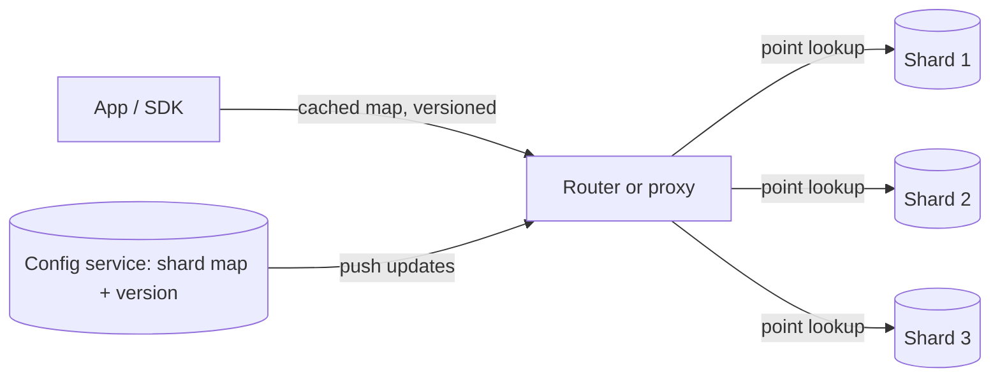

# Shard Routing and Metadata

## 1. One-Line Definition
Shard routing is the machinery that turns a request into "which shard owns this key" — through a shard map (metadata) consulted by a router, a proxy layer, or a client-side SDK — so one request is sent to exactly the right shard.

## 2. Why Do We Need It?
Sharding only helps if every request can find its shard fast and correctly. Wrong or stale routing means queries hit the wrong node (or fan out everywhere), writes land on the wrong shard, and the whole point of the partition is erased. Routing sits on the hot path of every operation, so its speed, freshness, and failure behavior decide the sharded system's latency and correctness.

## 3. Simple Intuition
A multi-building hospital: the front desk doesn't know every file's location by heart — it looks at a directory (the shard map) and sends you to Building B, Floor 3. A laminated copy of the map sits at every desk so the desk doesn't call headquarters each time. If the map is wrong (Someone re-shelved Floor 3 files to Floor 2 and the laminate lagged), the visitor is sent to the wrong floor — the map's freshness is the correctness mechanism.

## 4. What Happens Without It?
Every request must be told where to go, or it goes everywhere: point lookups turn into cluster-wide scatter-gather (slow, expensive), and writes to the wrong shard either fail or silently duplicate. A central map that's slow to look up becomes the bottleneck worse than the one database it was meant to offload; a map that's missing becomes total unavailability.

## 5. Core Idea
Shard routing = (shard key value) → (shard id), via one of two families:
- **Computed routing:** derive shard from the key — `hash(key) mod N` or range lookup. No central state, exception: the static config (N, hash choice). Changing N re-weights everything, which is why ring-based schemes ([[consistent-hashing|Consistent Hashing]], [[virtual-nodes|Virtual Nodes]]) keep computed routing adaptable.
- **Directory routing:** a key→shard map that's data, not math — any placement, easy moves, but the map is state that must be stored, served, cached, and kept consistent.

Whose job is it to route?
- **Client-side SDKs:** embed the map (fetched + cached), no extra hop, but every client must be kept in sync — versioned map leases.
- **Proxy/router layer:** one routing tier (Vitess-style) between app and shards; centralizes consistency and back-ends the app's view, at the cost of a hop and a horizontal SPOF to run yourself.
- **Smart client + config service** (ZooKeeper/etcd/Consul): clients watch a small config, cache it, and subscribe to updates — nearest to "no hop + manageable freshness."

The map's metadata fields: coverage (which key ranges/hash buckets belong to which shard), the shard's endpoints, a version, and its serving status (active / draining / moving). Versioning is what makes stale-map handling possible — see [[shard-rebalancing|Shard Rebalancing and Hot Shard]].

## 6. Important Terminology

| Term | Simple Meaning |
|------|----------------|
| Shard map / metadata | key → shard ownership table |
| Router / coordinator | The component that picks the shard |
| Directory routing | Central map decides placement |
| Computed routing | hash/range math decides placement |
| Smart client | Client SDK with a cached, watched map |
| Config service | etcd/ZK/Consul serving the map |
| Map version | Monotonic stamp for staleness checks |
| Draining / moving shard | In migration, marked not-active |

## 7. Basic Architecture



## 8. Request or Data Flow
1. A request carries a shard key (e.g., `user_id=1042`).
2. The router looks up the cached map: hash bucket 0x7.. → Shard 2; or directory: user 1042 → Shard 2.
3. The router confirms the map version it holds is current (subscribe/lease); if stale, it refetches before routing — this closes the divergence window during migrations.
4. The request travels only to Shard 2. A single-shard operation proceeds transactionally.
5. On shard migration (see [[shard-rebalancing|Shard Rebalancing and Hot Shard]]), the router holds "in-flight" keys and dual-reads old+new until the cutover tag clears.

## 9. Practical Example
A SaaS app with 64 shards behind 4 proxy instances:
- Map: `hash(tenant_id) mod 64 → shard`, covering ~73 blocks per router instance; map version v9, TTL-renewed every 5 s and pushed on change.
- Point lookup: 0.2 ms in the router's in-memory cache. A miss fetches from the config service in ~1-5 ms (rare).
- When the 16th shard joins, the config service publishes v10; routers update within the TTL window. Old-version routers must not route new keys to shards that no longer own them — the version check holds them off until their cache refreshes.

## 10. Scaling
- Router scale: stateless → add proxies, keep the map small (a 64-shard map is a few KB; a 10k-shard map fits in RAM).
- Config-service scale: it serves changes, not every request. Keep the watch/lease fan-out bounded (one subscription per router, not per connection).
- Hot path: point lookups must hit cache; pushing the map to SDKs removes the proxy hop entirely at the cost of client version discipline.
- Failures: a router that can't reach the config service must keep serving from its last map and flag staleness, not fail — availability is preserved; correctness is the version-check's contract (fall back to "refuse uncertain keys" only under moving shards).

## 11. Reliability and Failure Scenarios

| Failure | What Happens | Detection | Recovery | Trade-off |
|---------|--------------|-----------|----------|-----------|
| Config service down | Maps stop updating | Config-service health | Serve from cache; mask flag | freshness vs availability |
| Stale router map | Wrong-shard lookups during migration | Version mismatch | Refetch + version check | brief wrong replies |
| Router dies | Its share of lookups unaffected if stateless | Health checks | LB reroutes connections | map-warm latency |
| Map corrupted | Random wrong-shard routing | Consistency check | Rebuild from authoritative source | map rebuild window |
| Shard mislabeled draining | Reads still hit it | Status probe | Router uses serving=true only | slower reads |

## 12. Consistency and Correctness
- The map is a replicated, versioned document; readers must compare versions — a stale reader and a moving shard can't agree, so dual-read-old+new until the cutover is marked done (see [[shard-rebalancing|Shard Rebalancing and Hot Shard]] and [[data-migration|Data Migration (Dual Reads/Writes, CDC)]]).
- Directory routing has real write-read consistency needs: a key's move must be atomic from the map's perspective (CAS on the map entry), or a router sees a half-moved key.
- Computed routing has no consistency problem for the map — but no placement flexibility either; a directory map's flexibility buys a metadata consistency duty.
- Idempotency matters during retries: a request routed once, retried, may hit a different shard after a migration — client retries must carry the same ownership hint or tolerate re-routing.

## 13. Performance
- Cached map: sub-ms per lookup, effectively free; uncached: +1 RTT to config service (ms).
- Proxy adds an L7 hop: ~0.1-0.5 ms and a proxy-fleet capacity bill; SDK routing avoids it by shipping the map out.
- Stale-miss fallbacks cost a full refetch per router startup; keep startup refetch parallel and async.
- The wrong design is per-request authoritative lookups to the config service — that converts "routing" into a metadata hotspot worse than the DB you sharded.

## 14. Security
The map tells an attacker every credential-hosting endpoint and every tenant's location; treat it as sensitive service metadata — mTLS between router and config service, ACLs on who may subscribe, audit of map changes, and lease-token validation so an unauthenticated client can't impersonate a router. Tenant isolation is also routing discipline: cross-tenant lookups must be rejected, never satisfied by fan-out (see [[cross-shard-queries|Cross-Shard Queries and Transactions]]).

## 15. Trade-Offs

| Choice | Advantages | Disadvantages | When to Use |
|--------|------------|---------------|-------------|
| Computed (hash/range) | No map consistency duty, no lookups | Placement inflexibility; N changes re-weight | Stable N, ring-friendly |
| Directory | Any placement, easy moves | Map is state: serve, cache, version it | Uneven/many shards |
| Router/proxy | One consistent place to enforce | Extra hop + fleet to run | Central control, Vitess-style |
| Smart client SDK | No hop, no fleet | Version discipline pushed to clients | Large, trusted client bases |

## 16. Common Mistakes
- Making the config service answer every request — a metadata SPOF in disguise.
- No map versioning: routers serve a stale map forever after a migration and ghost-read old shards.
- Routing on a non-key column: "WHERE city = X" fan-outs because no map can answer it point-locally.
- Ignoring the draining/moving status: reads served from a shard mid-migration return half-moved data.
- Believing directory maps are cheap to keep fresh — every move needs coordinated map updates, or splits brain between routers.

## 17. HLD vs LLD Boundary
HLD: computed vs directory routing, router- vs client-side placement, map versioning + TTL policy, config-service topology. LLD: the SDK's map-refresh goroutine, the version-check comparison in one route lookup, the CAS in the config service on one key move.

## 18. Interview Questions

### Beginner
- What is a shard map, and why can't every request consult it fresh?
- Compare computed vs directory routing in one sentence each.

### Intermediate
- Your router cached a stale map and then a shard migrated. What breaks, and how do you guard against it?
- When would you put routing in the client SDK vs a proxy layer?

### Advanced
- Design routing for a 10,000-shard system where migrations are frequent. Justify your map schema, versioning, and router failure behavior.
- A config-service outage must not take down an already-sharded system. Walk the degradation path.

## 19. Interview Memory Summary

> [!abstract]- Interview Memory Summary
> ### Remember
> - Routing = key value → shard, via computed math or a directory map.
> - The map is metadata: versioned, cached locally, served by etcd/ZK/Consul.
> - Every router must read the version before trusting the map during migrations.
> - Client SDK = no hop but version discipline; proxy = one consistent place, extra hop.
> - Config service is a metadata dependency, not a per-request lookup server.
> - Migrating shards must be marked draining and dual-read until cutover.
> ### 30-Second Explanation
> Shard routing converts a request into exactly one target shard using either pure math (hash/range) or a directory map. The map lives in a config service, is version-flagged, and is cached by routers/SDKs; lookups hit cache, changes propagate by push/lease. Version checks prevent stale routers from mis-routing during a migration, and marking moving shards draining keeps custody unambiguous through a cutover.
> ### Interview Traps
> - Saying "the config service handles routing" — that's per-request metadata load and a new SPOF.
> - Forgetting map versioning during migration — stale maps are the classic scatter-bug.
> - Routing point lookups to the wrong granularity: the map must answer key→shard, not query→shard.
> - Ignoring that in-flight renames need a draining flag on the old shard.
> ### Key Trade-Off
> Computed routing is state-free and fast but inflexible; directory routing is flexible but makes the shard map a shared piece of state whose freshness you must version, cache, and trust.

## 20. Related Concepts

### Prerequisites

- [[sharding|Sharding]] — the system routing serves
- [[shard-key|Shard Key]] — the input to routing math
- [[sharding-strategies|Sharding Strategies]] — which kind of map/computation to use

### Commonly Used Together

- [[consistent-hashing|Consistent Hashing]] — computed routing that absorbs node churn
- [[virtual-nodes|Virtual Nodes]] — smoother balance inside consistent hashing
- [[shard-rebalancing|Shard Rebalancing and Hot Shard]] — the events that push map versions
- [[service-discovery|Service Discovery]] — the map's endpoint half (which live node)

### Alternatives

- [[load-balancing|Load Balancing]] — dumb round-robin when you don't need ownership math
- [[distributed-locks|Distributed Locks]] — lease discipline on map ownership, if your system needs it

### Advanced Concepts

- [[cross-shard-queries|Cross-Shard Queries and Transactions]]
- [[data-migration|Data Migration (Dual Reads/Writes, CDC)]]

Related planned topics (not authored yet): none; this file is the routing hub for the sharding family.

## 21. References
Kleppmann, *Designing Data-Intensive Applications*, ch. 6 (routing and the shard map / "partition and secondary indexing"); Vitess user documentation on routing tables and resharding; etcd/ZooKeeper docs on watch/lease patterns for config distribution.

## 22. Active Recall

Test yourself before revealing each answer.

> [!question]- What does the shard map contain, and why must it be versioned?
> It contains ownership: which hash ranges or directory entries belong to which shard, plus endpoints and serving status. The version lets a router detect it's holding stale data during a migration — without it, a router can route new keys to a shard that no longer owns them and ghost-read half-moved rows.

> [!question]- Why must the config service not answer routing requests?
> Routing is a metadata read on every single request. Serving it authoritatively turns a tiny etcd/ZK/Consul into a hot SPOF worse than the original database. The right pattern: routers/SDKs cache the map, watch/lease for updates, and only the rare miss (or startup) hits the config service.

> [!question]- Design decision: SDK routing vs proxy routing for your sharded fleet.
> Go SDk when the client base is owned and disciplined (no old-app version can serve stale maps for long) and the extra proxy hop hurts latency. Go proxy when central enforcement matters (auth the routing path once, rebalance without redeploying clients) and you can run a healthy stateless proxy tier. Mixed is common: proxy in front, SDK inside the fleet.

> [!question]- Trade-off: computed routing vs directory mapping.
> Computed (hash mod N, ring) has no shared state, so no metadata consistency duty — but placement is fixed and N changes re-weight everything. Directory lets you place any key wherever and move it by editing the map — but now the map is shared state that needs the whole versioning/caching/lease apparatus. Trade flexibility for a consistency burden.

> [!question]- Failure scenario: a router lost the config service and serves a map that's three versions old.
> It must keep serving from the cached map (availability) and flag staleness; on any key whose shard is marked moving/draining in the newest versions it knows about, refuse or dual-read. When the config service returns, refetch and reconcile. The version comparison is the correctness valve — without it, the whole window is corrupted.

> [!question]- Interview scenario: 100M keys, heavy write skew, and you must move one hot tenant this weekend.
> Steps: mark the map entry for that tenant as moving/draining (version bump), dual-write to both old and new shard while the backfill catches up (see data-migration), verify row counts + checksums, then flip the map atomically (CAS) at cutover, and finally decommission the old shard. Routing's job is to never hand out a half-cooked shard: the draining flag plus version gate make that true.

## 23. When Should I Use This?

### Use it when

- Requests must be pinned to the owning shard with sub-ms decisions and zero scatter.
- Shard count changes (see [[shard-rebalancing|Shard Rebalancing and Hot Shard]]) — you need map versioning + draining semantics.
- Tenant isolation matters — routing is the enforcement point for "this key belongs to this tenant's shard only".
- The volumes justify a routing tier (proxy) or a disciplined client SDK.

### Avoid it when

- One node already serves the data — routing is overhead you don't need.
- Shards are static and tiny: a hardcoded `shard = hash mod 3` in app code is routing too, and needs no machinery.
- You can't operate the config service reliably — a flaky metadata store undermines the whole sharded system.

### What problem does it solve?

It keeps every request O(1) and correct regardless of how many shards exist — the "which shard?" question is answered in cache, not by scanning the fleet or a hot central registry.

### What problem does it NOT solve?

It doesn't decide the shard key (that's [[shard-key|Shard Key]]), doesn't fix hot-shard skew (see [[shard-rebalancing|Shard Rebalancing and Hot Shard]]), and doesn't make cross-shard queries cheap (see [[cross-shard-queries|Cross-Shard Queries and Transactions]]) — routing only delivers requests to the right door.

## 24. Decision Connections

- [[sharding|Sharding]] — routing exists only because sharding exists.
- [[shard-key|Shard Key]] — the key value routing consumes; a scatter key makes routing useless.
- [[sharding-strategies|Sharding Strategies]] — decides whether routing is pure math or a map.
- [[consistent-hashing|Consistent Hashing]] — computed routing that absorbs rebalances.
- [[virtual-nodes|Virtual Nodes]] — how ring routing balances churning nodes.
- [[shard-rebalancing|Shard Rebalancing and Hot Shard]] — the events that bump the map version.
- [[service-discovery|Service Discovery]] — the "which live endpoint" half of the map.
- [[data-migration|Data Migration (Dual Reads/Writes, CDC)]] — dual-read discipline during map flips.

Decision tree:

```
Receive request with shard key value.
    |
    +-- Shard count static, placement rigid is fine?
    |      → computed routing: hash mod N, or [[consistent-hashing|Consistent Hashing]] ring
    |
    +-- Need to move keys movably (migrations, hot spots)?
    |      → directory map: versioned, cached, draining-flagged
    |         +-- Central enforcement preferred? → proxy/router tier
    |         +-- Trusted fleet, lowest latency?  → client SDK + push
    |
    +-- Map might be stale during a migration?
           → version-check, dual-read old+new until cutover
           → [[data-migration|Data Migration (Dual Reads/Writes, CDC)]]
```