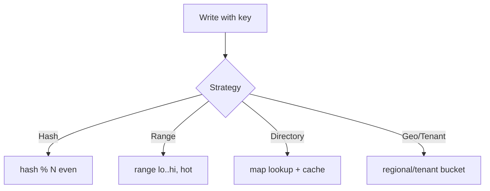

# Sharding Strategies

## 1. One-Line Definition
Sharding strategies define *how* rows are assigned to shards — by hash, by value range, by a directory map, by geography, or by tenant — each trading evenness, query power, locality, and migration cost differently.

## 2. Why Do We Need It?
The sharding strategy determines how evenly load spreads, what queries stay single-shard, what locality (geo/tenant) is preserved, and how hard resharding will be. Choosing the wrong one turns any of these into a painful, expensive redesign.

## 3. Simple Intuition
A city organises postal deliveries:
- **Hash:** hand letters to whichever of N postmen's buckets their hashed number lands in → perfectly even, but you can't say "all letters to Maple St." (no range).
- **Range:** postmen own "streets A-M" and "N-Z" → easy "all streets" queries, but one celebrity block can overload one postman.
- **Directory:** a central map "street → postman" → any reorganisation is just a map edit, but the map is an extra point of failure and a hop.
- **Geo/tenant:** postmen own a neighborhood/company → excellent locality and isolation; skewed if neighborhoods/companies differ wildly.

## 4. What Happens Without It?
Fumbling between "hash everything" (even, but every range query is a fan-out), "range by id" (skew!), or "by directory" (map becomes a SPOF), each time paying on a live system: hot shards, broken co-location, cross-shard transactions, and migration-nightmares.

## 5. Core Idea
Compare directly:

| Strategy | Rule | Strength | Weakness |
|----------|------|----------|----------|
| **Hash** | `shard = hash(key) % N` | Even, predictable | No range; rehash on N change (mitigate w/ consistent hashing) |
| **Range** | `shard = key in [lo, hi)` | Range scans, sorted | Skew from hot ranges (new data, hot keys) |
| **Directory** | map key→shard externally | Any placement; reshard = edit map | Extra hop; map is SPOF; stale maps |
| **Geo** | region key→regional shard | Local reads/writes, residency | Cross-region queries; moving geographic skew |
| **Tenant** | `shard = tenant_id` (bucket) | Isolation, co-location, single-shard tx | Tenant-size skew |

Composing: most real systems mix — hash within a tenant bucket, range partitions *inside* each shard, geo as the outer layer.

## 6. Important Terminology

| Term | Simple Meaning |
|------|----------------|
| Hash sharding | even spread via hash mod N |
| Range sharding | value-bucket ownership |
| Directory sharding | external map key→shard |
| Geo sharding | region-located shards |
| Tenant sharding | tenant-bucket ownership |
| Bucketing | composite (tenant, …) coarse→fine routing |
| Rebalancing | moving rows when N changes |

## 7. Basic Architecture



## 8. Request or Data Flow
1. Router knows strategy + map.
2. Computes ownership (hash / bucket / map / geo) → owning shard.
3. Ops stay within one shard where key allows; cross-key = fan-out.

## 9. Practical Example
**Multi-tenant CRM (assumptions):** tenant size uneven; queries always scoped by tenant; writes mostly tenant-local.
- Chosen: **tenant bucket** — `shard = consistent_hash(tenant_id)`. All tenant rows co-located (single-shard tx).
- Large tenants split with iterative bucket (tenant → 64 sub-buckets) so no one tenant owns a shard.
- Admin/cross-tenant analytics → separate warehouse, not fan-out.

## 10. Scaling
- **Hash:** scales evenly with N; rebalance via consistent hashing.
- **Range:** scales geographically/temporally; hot ranges become the bottleneck (a "to-day" shard).
- **Directory:** arbitrary placement = easiest rebalance, but map cache + SPOF pressure grow.
- **Geo:** better local latency; cross-region = cross-shard (expensive).
- **Tenant:** natural isolation; the large-tenant skew is the design problem to solve with bucketing.

## 11. Reliability and Failure Scenarios

| Failure | Happens | Detection | Recovery | Trade-off |
|---------|---------|-----------|----------|-----------|
| Hash | even nodes die evenly (slice) | per-shard health | replicate per shard | replicas per slice |
| Range | hot range overloads one shard | skew metric | split range, cache hot | range utility loss |
| Directory | map stale after edits | map version checks | refetch authoritative map | consistency-lag |
| Tenant | big tenant melts shard | skew/heap | bucket further/read replicas | complexity |

## 12. Consistency and Correctness
Strategy decides where ACID can span: co-locating writes within a bucket keeps them single-shard (transactions intact); range/directory strategies that scatter writes force distributed transaction designs. Whatever the strategy, migrations need a dual-read + freeze-per-key protocol so ownership is never ambiguous.

## 13. Performance
- Hash: single-shard lookups, but range scans fan out.
- Range: range scans cheap; point lookups still indexed.
- Directory: +1 hop to the map per lookup (cache it); see routing pressure under QPS.
- Geo: nearest-node = lower RTT; cross-geo aggregate = slower.

## 14. Security
Tenant-bucket sharding gives the strongest tenant isolation but the designer must ensure **routing cannot be tricked**: a cross-tenant key must still be access-controlled (tenant field in ACL co-located with the row). Directory strategies leak routing information—secure the map store.

## 15. Trade-Offs

| Choice | Advantages | Disadvantages | When to Use |
|--------|------------|---------------|-------------|
| Hash | Even, balanced | No range, rehash | KV / generic |
| Range | Range/order fast | Hot range skew | Time-series, sorted IDs |
| Directory | Flexible rebalance | Extra hop, map SPOF | Unpredictable workloads |
| Geo | Latency/residency | Cross-region joins | Global user base |
| Tenant bucket | Isolation + co-location | Tenant skew | SaaS |

## 16. Common Mistakes
- Range for a hot new-rows workload (one shard "today" cooks).
- Directory without cache/monitoring — the map as silent bottleneck.
- Hash while claiming "range queries" work (fan-out instead).
- Tenant bucket with no cap: a 100x tenant owns an unbalanced slice.

## 17. HLD vs LLD Boundary
HLD: strategy mix + key + bucket/geography layout + rebalance story. LLD: the hash/bucket function, map client cache, DAO route code.

## 18. Interview Questions

### Beginner
- Compare hash vs range sharding in three properties.
- Why does tenant sharding give both isolation and a risk?

### Intermediate
- Events with 100x write growth daily range by date: design around hot-range skew.
- Large-tenant skew in a SaaS: convert to buckets, explain the routing.

### Advanced
- Mix geo + tenant + hash in one system without making cross-region writes impossible.
- Design a directory-sharded store with the directory itself not becoming a SPOF.

## 19. Interview Memory Summary

> [!abstract]- Interview Memory Summary

### Remember

- hash = even; range = order; directory = flexible; geo = locality; tenant = isolation.
- The strategy picks your failure mode: hot range, hot tenant, or map SPOF.
- Bucket for tenants: coarse tenant bucket → fine sub-bucket routing.
- Mix strategies per layer — geo outer, tenant bucket, hash within, range partition inside.
- All strategies share the same migration discipline: dual-read + freeze-per-key.

### 30-Second Explanation

Choose the strategy by workload: even writes → hash; range/time → range (with hot-zone care); location → geo; SaaS → tenant buckets; pick it and own the migration story.

### Interview Traps

- "Range sharding by id works because ids are ordered" — ordered ≠ even; the interviewer will hand you a skewed access pattern and watch range collapse.
- Range for a hot new-rows workload (one "today" shard cooks).
- Directory without cache/monitoring — the map becomes a silent bottleneck.
- Hash while claiming range queries work (they fan out instead).
- Tenant bucket with no cap — a 100x tenant owns an unbalanced slice.

### Key Trade-Off

Every strategy buys a query/locality superpower and bakes in a worst-case failure mode — evenness (hash) sacrifices range queries, locality (geo/tenant) risks skew — so the choice is really "which cost will I live with?"

## 20. Related Concepts

### Prerequisites

- [[sharding|Sharding]] — strategies are the "how" inside the decision to shard.
- [[shard-key|Shard Key]] — the chosen key drives which strategy can be used.

### Commonly Used Together

- [[consistent-hashing|Consistent Hashing]] — smooths hash sharding's rehash pain and tenant bucketing.
- [[partitioning-vs-sharding|Partitioning vs Sharding]] — range-partition *inside* each shard composes with any strategy.
- [[database-replication|Database Replication]] — every strategy needs per-shard replicas for availability.

### Alternatives

- [[horizontal-vs-vertical-scaling|Horizontal vs Vertical Scaling]] — avoid sharding (and choosing a strategy) by scaling one node vertically.

### Advanced Concepts

- [[cap-theorem|CAP Theorem]] — strategy choice defines what consistency/granularity you can achieve across shards.
- [[strong-vs-eventual-consistency|Strong vs Eventual Consistency]] — co-locating writes within a bucket keeps transactions single-shard.

Related planned topics (not authored yet): none.

## 21. References
DynamoDB / Mongo shard-key docs; Kleppmann ch. 6. Verify current docs for strategy guidance.

## 22. Active Recall

Test yourself before revealing each answer.

> [!question]- Compare hash vs range sharding in three properties.
> Evenness: hash spreads evenly by construction, range skews toward hot ranges. Query support: hash kills range scans (they fan out), range serves ordered/range scans cheaply. Migration: hash rehashes on N change (mitigated by consistent hashing), range only moves the affected buckets.

> [!question]- Why does tenant sharding give both isolation and a risk?
> Isolation: all of a tenant's rows co-locate on one shard → single-shard transactions and a physical failure/compute boundary between tenants. The risk is tenant-size skew: one tenant 100x the rest owns an unbalanced slice, melting its shard. Bucketing (tenant → 64 sub-buckets) caps that.

> [!question]- When is directory sharding the right call?
> When placement must be arbitrary and rebalancing easy — moving data is "just a map edit," so uneven or unpredictable workloads fit. The price: an extra hop to the map per lookup (cache it) and the map itself becomes a SPOF unless it is replicated, versioned, and monitored.

> [!question]- Your daily-batch events ingest spikes at midnight into date-range shards. What goes wrong and what's the fix?
> Range sharding by date puts every new event into today's shard (the hot range), which cooks while the rest idle. Fixes: split the hot range into sub-ranges, hash within the day, cache/scale replicas for the hot zone, or shift to tenant/user buckets for the write path.

> [!question]- A multi-tenant CRM has tenants of wildly uneven size and tenant-scoped queries. Which strategy, and why the bucket structure?
> Tenant bucket — `shard = consistent_hash(tenant_id)` — gives co-location and single-shard transactions. Large tenants are split with an iterative bucket (tenant → 64 sub-buckets) so no tenant owns a shard outright. Admin/cross-tenant analytics go to a separate warehouse, not fan-out.

> [!question]- What is the consistent migration protocol whatever strategy you pick?
> During ownership changes, mark keys in-flight: dual-read old and new owners, freeze writes per-key briefly, verify, then atomically switch the map so ownership is never ambiguous. Without it, some keys are served from two places or dropped entirely.

> [!question]- Interview scenario: design sharding for a global user base whose users must be served locally, but cross-region write joins would explode. How do you layer strategies?
> Geo as the outer layer (region bucket) for local reads/writes and residency; inside a region, tenant or user hashing for even placement; range-partition within each shard for manageability. Accept that cross-region joins remain expensive and route them to batch/analytics — the strategy mix is the answer, not any single one.

> [!question]- Why is "bucket the tenant then hash within the bucket" better than hashing tenant_id alone or range-by-id?
> Hashed tenant_id alone co-locates but a huge tenant concentrates load. Range by id orders but skews. Coarse tenant bucket preserves isolation and single-shard transactions; the fine hash within spreads the big tenant's rows across several shards and redistributes evenness — at the cost of routing complexity.

## 23. When Should I Use This?

### Use it when

- Writing an evenly-distributed workload with mostly point/key lookups → hash.
- Queries are range/ordered and writes land naturally (time series, sorted IDs) → range, with hot-zone care.
- Placement must be arbitrary and rebalances frequent → directory.
- A global user base needs locality/regulatory residency → geo.
- SaaS tenants must be isolated and co-located → tenant buckets (with size caps).

### Avoid it when

- A hot new-rows workload needs range sharding (the "today" shard cooks).
- Directory is chosen without a cached, replicated, monitored map — the SPOF bites first.
- You claim range queries while choosing hash — they fan out.
- You pick tenant buckets with no cap for a tenant that can outgrow a shard.
- You can avoid sharding entirely because the dataset still fits one node.

### What problem does it solve?

Rows must be assigned to shards, and a naive rule (or none) is the bottleneck: uneven load, broken co-location, destroyed range queries, or an unrecoverable rebalance. Strategies formalize the placement rule so evenness, query power, locality, and migration cost are made explicit and chosen per workload.

### What problem does it NOT solve?

No strategy makes cross-shard queries cheap or guarantees availability by itself — each shard still needs replicas, and every strategy still needs a rebalancing and migration protocol when the cluster changes.

## 24. Decision Connections

Decisions that go together with sharding strategies:

- [[sharding|Sharding]] — the parent decision; strategies are the placement mechanism once you shard.
- [[shard-key|Shard Key]] — the key chosen determines which strategies are viable (hash needs high-cardinality keys).
- [[consistent-hashing|Consistent Hashing]] — the ring makes hash and tenant-bucket rebalancing cheap.
- [[partitioning-vs-sharding|Partitioning vs Sharding]] — range-partition inside each shard composes with any strategy for manageability.
- [[database-replication|Database Replication]] — per-shard replicas are required regardless of strategy for availability.
- [[horizontal-vs-vertical-scaling|Horizontal vs Vertical Scaling]] — the strategy you pick is how the horizontal database axis realizes.
- [[cap-theorem|CAP Theorem]] — strategy defines the consistency ceiling for data spread across shards.

Decision tree:

```
Distributing rows across shards?
    |
    +-- Workload is point lookups + even writes?
    |      → [[sharding-strategies|Sharding Strategies]]: hash
    |
    +-- Range/ordered queries dominate, data lands naturally?
    |      → range; guard the hot range (split/cache/scale it)
    |
    +-- Placement must stay arbitrary/flexible (uneven churn)?
    |      → directory; cache + replicate the map, watch the SPOF
    |
    +-- Global users needing locality/residency?
    |      → geo outer layer; cross-region joins → analytics
    |
    +-- SaaS tenants needing isolation + co-location?
           → tenant buckets; cap huge tenants with iterative bucketing
```