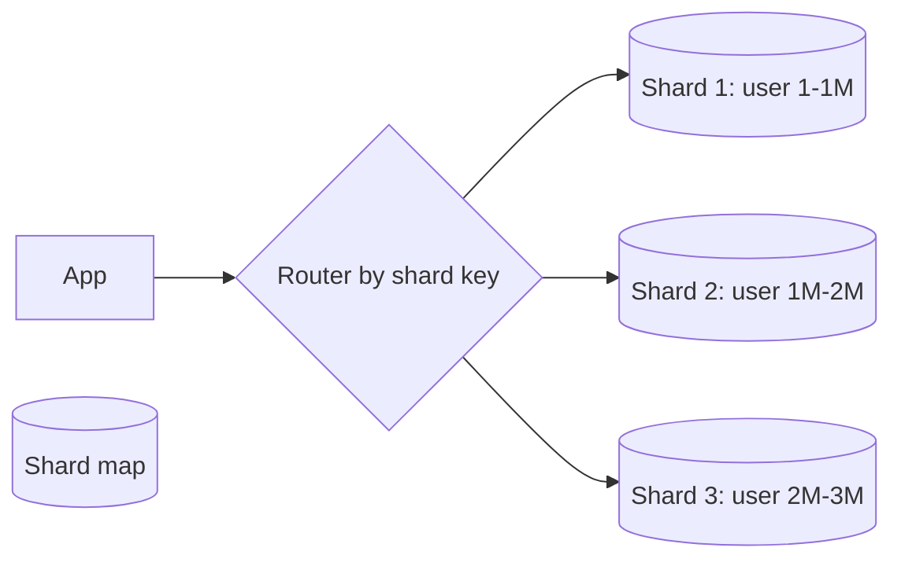

# Sharding

## 1. One-Line Definition
Sharding splits a database across multiple nodes (shards), each holding a subset of rows, so total data, write QPS, and storage grow with the number of shards instead of hitting one machine's ceiling.

## 2. Why Do We Need It?
Replication scales *reads*; it cannot scale writes or total storage — one primary still receives every write and holds the full dataset. When the dataset or write rate outgrows one node, you must slice data horizontally. Sharding is that slice.

## 3. Simple Intuition
One warehouse for the entire bookstore chain. Reading is fine (many counters). But every shipment (write) goes to the same single warehouse, and it physically fills up. So you open regional warehouses: warehouse A keeps books A-K, warehouse B books L-Z (and replicas inside each). A book (row) is in exactly one warehouse; you ask the right one by knowing the general category (shard key).

## 4. What Happens Without It?
Write QPS caps at one node's capacity; storage caps at one node's disks. Beyond that you fight with bigger hardware (costly, capped). Shared caching/replication doesn't help — every write still funnels to the same primary, and the dataset still doesn't fit anywhere.

## 5. Core Idea
- **Shard key:** the column(s) used to decide which shard owns a row (e.g., `user_id`, `order_id`, `tenant_id`). The entire design hinges on this single choice.
- **Routing:** by hash of the key (hash sharding — even, but range queries suffer), by value range (range sharding — ordered, but skewed if hot keys cluster), by directory (a mapping table — flexible, extra hop), geographically, or by tenant.
- **Co-location:** related rows should share a shard — same user's orders/txns on one shard so writes are single-shard (transaction-friendly).
- **Shard management:** routing metadata, rebalancing when adding/removing shards, and cross-shard operations (queries spanning many shards or transactions across them).
- **Trade-offs paid:** joins become app-side scatter-gather; transactions become distributed (see distributed-transactions); data must live with its shard, or be denormalized per shard.

## 6. Important Terminology

| Term | Simple Meaning |
|------|----------------|
| Shard | One horizontal slice of the data |
| Shard key | The column(s) determining ownership |
| Hash sharding | shard = hash(key) mod N |
| Range sharding | shard = value range bucket |
| Directory sharding | Central map key→shard |
| Cross-shard query | Query touching several shards |
| Scatter-gather | Ask all shards, merge results |
| Rebalancing | Moving rows when shards change |
| Hot shard | One shard with disproportionate load |

## 7. Basic Architecture



## 8. Request or Data Flow
1. Write/read arrives with a shard-key value.
2. Router consults the shard map → sends only to the owning shard.
3. Single-shard ops are simple and can be transactional.
4. Cross-shard queries fan out to all shards and merge (scatter-gather) — slow, avoid on hot paths.

## 9. Practical Example
**Messaging app (assumptions):** users' messages never need cross-user joins.
- Shard by `user_id` (range or hash) — all of a user's chats/messages co-located on one shard → every chat operation is single-shard.
- Admin/global queries (e.g., "all users matching X") run scatter-gather in a batch/analytic store, not the hot path.

## 10. Scaling
- **Write scaling:** more shards = more write capacity (roughly linear until the router/meta becomes the new bottleneck).
- **Storage scaling:** data distributes across shard disks.
- **Read scaling:** each shard can itself have replicas (shard × replica).
- **Routing/shard-map scaling:** central metadata is a SPOF + hot path — cache it, coordinate via consensus (etcd/ZK) but keep lookups local.
- **Rebalancing:** resharding (N→M) requires moving rows — the hardest operation; mitigations: [[consistent-hashing|Consistent Hashing]] + virtual nodes, read both old+new during migration (dual reads) then switch.
- **Hot shard:** one celebrity/tenant floods its shard — split the hot key, fan-out to sub-shards, cache aggressively, or multi-tenant spread.

## 11. Reliability and Failure Scenarios

| Failure | What Happens | Detection | Recovery | Trade-off |
|---------|--------------|-----------|----------|-----------|
| Shard dies | Slice of data unavailable | Health of shard + replica | Promote shard replica, rebuild | temporary partial outage |
| Resharding in-progress | Rows moving between shards | Migration status | Dual-read during cutover | increased load |
| Hot shard overload | One shard melts | Skew metric | Split/cache/move keys | complexity |
| Router/meta failure | Can't find any shard | Meta health | Cache-summary fallback | consistency of map |

## 12. Consistency and Correctness
- **Single-shard transactions stay ACID** (ideal design: pick a shard key making your writes single-shard).
- **Cross-shard transactions** are the expensive part: 2PC loses availability, Sagas give eventual consistency — where possible, keep them in one shard or one wallet/ledger.
- Rebalancing must be consistent: during migration a key is valid in old+new (dual read), pausing writes per-key briefly.

## 13. Performance
- Single-shard = quick; cross-shard scatter-gather = amplification (QPS × shard count) — keep lookups shard-pinned.
- Secondary indexes are per-shard → global lookups need their own index table (fan-out), a derived store, or acceptance of scans.
- Router must be fast and cached; adding a hop (routing layer) is the standard tax.

## 14. Security
- Tenant isolation is *automatic* if the shard key is tenant/owner-based (rows of a tenant live together — don't let cross-tenant queries cross into others).
- Shard-level keys/roles — a compromised shard shouldn't unlock the fleet; least-privilege routing identity.
- Audit across shards: keep an audit stream in a separate analytic store (scatter-gather on audit data is painful).

## 15. Trade-Offs

| Choice | Advantages | Disadvantages | When to Use |
|--------|------------|---------------|-------------|
| Hash sharding | Even spread | No range scans, reshard = rehash all | KV-ish, high write |
| Range sharding | Range queries, natural | Hot ranges (date, time), skew | Time/timestamp or sorted domains |
| Directory | Any placement, easy moves | Extra hop, meta SPOF | Many/uneven shards |
| Tenant sharding | Isolation, simple | Tenant size skew | SaaS |
| Geo sharding | Local data + latency | Cross-region queries, migrations | Global compliance |

## 16. Common Mistakes
- Bad shard key: choosing a low-cardinality column (status) or one that makes cross-shard writes constant (e.g., everything keyed by admin).
- Thinking sharding fixes *reads* first — usually caching/replicas do; sharding is for writes/storage.
- Ignoring the reshard story until you're live and out of shards.
- "NoSQL auto-shards so I don't have to think" — you still choose the partition key, and you still feel hotspots/cross-partition scans.
- Wide fan-out queries on the hot path.

## 17. HLD vs LLD Boundary
HLD: shard key + strategy, shard count/multiplicities, rebalancing procedure, cross-shard policy. LLD: the DAO's key-derivation code, the route lookup in one service.

## 18. Interview Questions

### Beginner
- What is sharding and what does it scale?
- Why doesn't replication replace sharding for writes?

### Intermediate
- Pick a shard key for a messaging system and defend co-location.
- A shard is hot. Diagnosis and two fixes.

### Advanced
- Design resharding from 8 to 16 shards without downtime and without losing writes.
- Does sharding break your global secondary indexes? How do you rebuild global search?

## 19. Interview Memory Summary

> [!abstract]- Interview Memory Summary

### Remember

- Sharding slices one database's rows across many nodes.
- It scales **writes and total storage** — the two things replication cannot.
- The shard key decides placement, evenness, co-location, and transaction scope.
- Hash ≈ even spread · range ≈ ordered · directory ≈ flexible · tenant ≈ isolation.
- Related rows co-located ⇒ single-shard (ACID) operations.
- Cross-shard joins/transactions are the tax — scatter-gather is slow.
- Rebalancing and hot shards are the two operational dragons.

### 30-Second Explanation

Sharding slices a database across N nodes by a shard key. Route each request to the owning shard through a cached shard map; design the key so the hot operations stay single-shard (co-located), which makes writes/storage scale roughly linearly. Plan rebalancing in advance and watch for hot keys.

### Interview Traps

- Using sharding to fix *reads* — caching/replicas are cheaper and simpler.
- Picking a low-cardinality or scattering shard key (creates the hotspots you're avoiding).
- Claiming zero-downtime resharding without walking the migration protocol.
- Confusing replication (full copy) with sharding (partial copy).

### Key Trade-Off

You gain linear write/storage scaling and single-shard transactions; you pay with cross-shard queries, distributed transactions on non-co-located data, and expensive rebalancing. The shard key decides how much of that tax you pay.

## 20. Related Concepts

### Prerequisites

- [[database-replication|Database Replication]]
- [[partitioning-vs-sharding|Partitioning vs Sharding]]

### Commonly Used Together

- [[shard-key|Shard Key]]
- [[sharding-strategies|Sharding Strategies]]
- [[consistent-hashing|Consistent Hashing]]
- [[caching|Caching]]

### Alternatives

- [[horizontal-vs-vertical-scaling|Horizontal vs Vertical Scaling]] (stay single-node, no sharding)
- [[database-replication|Database Replication]] (read replicas — when reads, not writes, are the problem)

### Advanced Concepts

- [[cap-theorem|CAP Theorem]]
- [[strong-vs-eventual-consistency|Strong vs Eventual Consistency]]

Related planned topics (not authored yet): cross-shard queries, shard rebalancing, distributed transactions.

## 21. References
Kleppmann ch. 6 (partitioning). Verify partition-key guidance with current managed-DB docs.

## 22. Active Recall

Test yourself before revealing each answer.

> [!question]- Why do we need sharding instead of just adding more replicas?
> Replicas scale **reads** by adding copies, but every write still goes to one primary and the full dataset still lives on that node. Sharding splits ownership of the data itself across nodes, so **write QPS and total storage** scale with the shard count — the two resources replication can't grow.

> [!question]- What actually decides where a row lives?
> The **shard key** — the column(s) the router hashes, ranges, or maps to pick an owning shard. Everything downstream (evenness, co-location, transaction scope, resharding pain) is a consequence of that one choice.

> [!question]- Name three criteria for a good shard key.
> 1. **High cardinality** — many distinct values → even spread.
> 2. **Even write distribution** — writes land across shards, not on one.
> 3. **Co-location / query affinity** — rows accessed together live on the same shard, so the hot operations stay single-shard.

> [!question]- When would you NOT choose sharding?
> When the real problem is reads (use [[caching|Caching]] + [[database-replication|Database Replication]]), when queries are mostly global aggregations (every query fans out), when multi-row transactions span unpredictable entities (distributed-tx cost explodes), or when the dataset still fits one node — sharding is premature complexity.

> [!question]- What do you give up when you shard?
> Cross-shard joins become scatter-gather (QPS × shards), cross-shard transactions become expensive (2PC/Saga), global secondary indexes need their own store, and **rebalancing** becomes the hardest operational event. The better the key, the smaller this tax.

> [!question]- A shard suddenly gets hot during a flash sale. Diagnose and propose fixes.
> Cause: a few high-frequency keys (celebrity user, big tenant, "today's" range) funnel into one shard. Fixes: split the hot key into K sub-shards (suffix the key), fan out to replicas + cache the hot keys, or move the hot tenant to its own shard group. Sizing: a properly chosen high-cardinality key prevents this at the source.

> [!question]- You must reshard from 8 to 16 shards without downtime or lost writes. What's the risk and the safe process?
> Risk: rows are being read/written while they move, so you can double-read/double-write or serve stale ownership. Safe process: consistent hashing + virtual nodes (only 1/Nth of keys move), mark keys in-flight (dual-read old+new, write to both briefly), verify, then switch the shard map and backfill — pausing writes per-key only during the cutover window.

> [!question]- Interview scenario: your messaging app DB is slowing down. Walk the decision chain.
> 1. Which resource is the bottleneck? Reads → [[caching|Caching]] and [[database-replication|Database Replication]] first (cheap).
> 2. Still saturated on writes or storage? → consider [[sharding|Sharding]].
> 3. Pick a key with high cardinality + co-location (here `user_id`) so chat ops stay single-shard.
> 4. Commit to rebalancing + hot-key monitoring as part of the design, not after the fact.

> [!question]- "NoSQL auto-shards, so we don't have to think about this." How do you respond?
> You still choose the **partition key**, you still feel hot keys and cross-partition scans, and rebalancing still happens — the database just hides the mechanics. The design decisions (key choice, co-location, cross-key queries) remain yours.

## 23. When Should I Use This?

### Use it when

- Total dataset exceeds one node's comfortable storage ceiling.
- Write QPS exceeds a single primary's capacity (replicas can't help writes).
- A high-cardinality access dimension (user, tenant, order) can co-locate most operations.
- You need roughly linear horizontal scaling beyond vertical hardware limits.
- Writes are naturally partitionable and mostly avoid cross-key joins.

### Avoid it when

- The real bottleneck is reads — [[caching|Caching]] and [[database-replication|Database Replication]] are far cheaper.
- Queries are mostly global/cross-tenant aggregations (every query becomes fan-out).
- Business transactions span many entities unpredictably (distributed-tx cost explodes).
- The team lacks the operational maturity to run rebalancing + shard monitoring.
- The dataset fits one node with headroom — you'd be adding complexity for no problem.

### What problem does it solve?

A single node writing and storing the whole dataset is the ceiling; sharding removes that ceiling by splitting ownership of the data across nodes.

### What problem does it NOT solve?

Read hotspots (better: caching/replicas), global joins and analytics (needs a warehouse/search store), availability by itself (still needs replication per shard), or skew caused by a bad key — a poor key turns sharding into the source of the hotspot.

## 24. Decision Connections

Decisions that go together with sharding:

- [[database-replication|Database Replication]] — shards and replicas compose (each shard gets its own replica set); replication ≠ sharding.
- [[partitioning-vs-sharding|Partitioning vs Sharding]] — same family; you partition *within* a node and shard *across* nodes.
- [[shard-key|Shard Key]] — the single most important adjacent decision; you cannot shard without it.
- [[sharding-strategies|Sharding Strategies]] — hash / range / directory / geo / tenant: the mechanism for placement.
- [[consistent-hashing|Consistent Hashing]] — makes resharding cheap (only 1/N of keys move).
- [[caching|Caching]] — try before sharding; still needed afterward to protect hot keys.
- [[cap-theorem|CAP Theorem]] and [[strong-vs-eventual-consistency|Strong vs Eventual Consistency]] — distributed systems constraints kick in as soon as data spans shards.

Decision tree:

```
Single database saturated
    |
    +-- Read traffic high (data still fits)?
    |      → [[caching|Caching]]
    |      → [[database-replication|Database Replication]]
    |
    +-- Write QPS or total storage exceeds one node?
    |      → [[sharding|Sharding]]
    |         |
    |         +-- Even spread, point/key lookups? → hash sharding
    |         +-- Range/time queries dominate?    → range sharding
    |         +-- Tenant isolation required?      → tenant sharding
    |         +-- Resharding must be cheap?       → [[consistent-hashing|Consistent Hashing]]
    |
    +-- Multi-key transactions must stay global?
           → sharding hurts; scale another way or accept distributed transactions
```