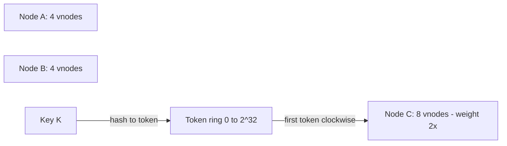

# Virtual Nodes

## 1. One-Line Definition
Virtual nodes (vnodes) give each physical node many pseudo-positions on a consistent-hash ring, so ownership arcs are small, load balances evenly, and adding/removing a machine redistributes a thin slice instead of a whole arc's worth of keys.

## 2. Why Do We Need It?
Consistent hashing with one position per real node has two holes. First, with few nodes (2-5), one node can own a huge arc and an unlucky neighbor owns a sliver — order-of-magnitude imbalance. Second, nodes are not equal: a 128-GB machine serving the same keyspace as a 32-GB box is waste. Vnodes solve both: each machine places K virtual points on the ring, turning wildly-different arcs into thousands of tiny equal slices that statistically even out, and letting you weight machines by how many vnodes they own.

## 3. Simple Intuition
One map pin per post office means the postman with the pin at 1-degree distance from the sizeable town takes the whole town while his neighbor gets a hamlet. Now stick 256 pins per post office, scattered around the map: every office owns its fair share of dozens of neighborhoods, and when a post office closes, 255 tiny routes redistribute rather than one giant district redesign. The pins are vnodes: many small, fair shares instead of a few huge, unlucky ones.

## 4. What Happens Without It?
A 3-node cluster using plain consistent hashing routinely has one node at 45% load and another at 10% — the "useful" configuration was asymmetric to begin with, and new nodes only make the arcs wobble. Worse, replacing a machine re-homes an entire arc in one blast: a holiday's cache misses, a big copy job, a second-order hotspot. And weighted members aren't expressible at all — every machine is treated as if it had identical capacity.

## 5. Core Idea
- **Mechanism:** each physical node claims K vnode positions. Position i of node n = `hash(n + "v" + i)`; the key → vnode → owner mapping stays: "first vnode clockwise"). K is typically 128-1024; Cassandra's default is 256 per node.
- **Why it balances:** the ring is diced into N interplayed K small slices; even with a handful of nodes, the Law-of-Big-Physics on arcs makes each node's share converge to K/(total K) of the keyspace (roughly equal). Uneven nodes just claim more or fewer vnodes (weighting).
- **What it buys:**
  - **Even ownership** when N is small — the original consistent-hashing weakness.
  - **Weighted capacity** — a 4x machine gets 4x vnodes.
  - **Cheap rebalance on membership change:** adding a node inserts K vnodes; each pulls a token-scrap from K different arcs → the migration touches only 1/(N+1) of keys, but spread evenly across *all* nodes, so no single node unloads a giant arc in one go.
- **Costs:** the ring has N×K positions — more metadata in routing tables, more copy sources, and a coordinator that must re-weigh when loads/ratio drift. Ring lookup stays O(1) via the token table.
- **Relation to rebalancing:** vnodes are why ring rebalancing is a gentle trickle, so [[shard-rebalancing|Shard Rebalancing and Hot Shard]] runs are boring instead of scary.

## 6. Important Terminology

| Term | Simple Meaning |
|------|----------------|
| Vnode | One virtual position a physical node owns |
| Sub-ring / ring slices | The tokens split the ring into many small shares |
| Token | The ring position of a vnode (hash value) |
| Weighting | More vnodes per machine = more keyspace share |
| Rebalance granularity | The unit of ownership that moves (one vnode) |
| Arc | A span of ring between consecutive tokens |
| Token table | Sorted list of tokens → owner (the routing map) |

## 7. Basic Architecture



A weighted ring: node C owns twice the vnodes and receives proportionally more keys.

## 8. Request or Data Flow
1. A key's hash lands at token T on the ring.
2. The token table (sorted, cached) finds the first token ≥ T — that token belongs to a vnode.
3. Map vnode → physical node (all of node's vnodes point at one machine).
4. The request routes to that machine; the key lives there.
5. Node B leaves: B's K vnodes and their arcs redivide among the survivors; routers receive the new token table and start serving new keys — an eventually-consistent transition, exactly like any ring update.

## 9. Practical Example
A 3-node cache/shard cluster, 256 vnodes per node:
- Without weighting, each node gets ~1/3 of hashes; the ring is so diced that the difference between nodes is <1% of keyspace.
- Node C upgrades to a 2x box → rebuilt with 512 vnodes; its share grows to ~2/4 of the ring, and the migration is a K-token trickle, not a top-level data relocation.
- Failed node D: its 256 tokens move to neighbors; only ~1/4 of the ring reparents, and the cache miss storm is limited to D's slivers (plus [[caching|Caching]] normally saves the re-fill).

## 10. Scaling
- Shard count grows: with 100 nodes × 256 vnodes = 25,600 tokens — still a handful of KB in a router; a 10,000-node fleet × 256 = 2.5M tokens needs compressed/hierarchical token tables (see [[rendezvous-hashing|Rendezvous Hashing]] for a flat alternative at small N).
- More vnodes = finer balance but larger tables and more copy-source fan-out during rebalance. Tune K to the node count and load-ratio target; adapt when node size disparity grows.
- Hot keys: the hotspot fix is *still* the hot-key strategy (fan-out, caching — see [[shard-rebalancing|Shard Rebalancing and Hot Shard]]), not vnodes: vnodes dice the key-to-node mapping but a single enormous key still lands on one vnode.

## 11. Reliability and Failure Scenarios

| Failure | What Happens | Detection | Recovery | Trade-off |
|---------|--------------|-----------|----------|-----------|
| Node dies | Loses its K tokens; keys miss | Token table ± health | Neighbors inherit, read-repair | cache-cold slivers |
| Token table corrupted | Random wrong ownership | Checksum on table | Rebuild from authoritative source | table rebuild window |
| Rebalance too fast | Sweep slams copy sources | Copy-rate metric | Throttle K per second | balance speed vs load |
| Weight drift | Machines diverge from weight | Load-per-vnode metric | Re-weight vnodes | table churn |
| Ring position collision | Two vnodes at same token | Token collision check | Cross-check hash seed | rare, must be handled |

## 12. Consistency and Correctness
- Ring transitions are eventually consistent on the map side: a router with an old token table may momentarily route a key to a vnode that just reparented. Dual-read or a draining flag bridges the blink (see [[shard-routing|Shard Routing and Metadata]] and [[data-migration|Data Migration (Dual Reads/Writes, CDC)]]).
- Two vnodes must never share a token — collisions corrupt the sorted table; the hash seed is checked at bootstrap.
- Vnode ownership is a pure function of the token table: any router that has the same table computes the same answer. That determinism is what makes verification and cross-checking possible.
- Idempotency across reparenting: a write that moved ownership mid-flight must be replayable without duplication (see [[idempotency|Idempotency]]).

## 13. Performance
- Token lookup: binary search in a sorted table — sub-microsecond in memory; amortized by caching in routers/SDKs.
- Rebalance granularity: single vnode (a few keys' worth) vs an arc (potentially millions); the attribute of vnodes that makes migrations cheap and smooth.
- Store locates probed nodes: modest extra memory for N×K tokens; the barrel point is token-table distribution, not lookup cost.
- With very uneven machine sizes, weighting by vnode count outperforms equal-token rings in every shard-balance metric that matters (see [[consistent-hashing|Consistent Hashing]] discussions of skew).

## 14. Security
The token table is the ring's authority: an attacker able to corrupt it can steer keys anywhere (exfiltration or denial of service). Distribute token tables over authenticated channels only, checksum them, and make the "owner" resolution verifiable at the store side (a node receiving a key can re-derive ownership). Token-generation seeds should be secret-adjacent to prevent adversarial token placement.

## 15. Trade-Offs

| Choice | Advantages | Disadvantages | When to Use |
|--------|------------|---------------|-------------|
| 1 token per node | Tiny tables | Blast-radius arcs, imbalance at small N | Trivial/static setups |
| Vnodes (K per node) | Even, weighted, gentle rebalance | Bigger tables, more moving parts | The default ring |
| High K | Finest balance | Mem/metadata growth, rebalance fan-out | Big, stable fleets |
| Low K | Cheap, simple | Coarser balance | Small, uniform fleets |
| Weighting by K | Capacity-aware | Weight drift to manage | Heterogeneous nodes |

## 16. Common Mistakes
- Believing vnodes fix *key-level* hot spots — a single celebrity key still lands on one vnode (fan-out/caching are the fix).
- Picking K=4 "to keep the table small": with 5 nodes that's ~20 tokens and old-style imbalance is back.
- Rebalancing a whole arc at once despite vnodes, because the copier moves by "node departure" instead of "vnode."
- Forgetting collisions: same-seed hash producing equal tokens breaks the sorted table silently.
- Ignoring the token-table consistency gap after a change (routing and ownership agreed on stale tables → ghost reads).

## 17. HLD vs LLD Boundary
HLD: K per node, weighting policy, token-table distribution + checksum, rebalance throttle. LLD: the `hash(node, i)` token function, the sorted-table binary search in a router, the collision check at bootstrap, and the copy-item-per-vnode migration loop.

## 18. Interview Questions

### Beginner
- What problem do vnodes solve that plain consistent hashing still has?
- Roughly how many keys move when one node leaves a 10-node, 200-vnode ring?

### Intermediate
- You have 3 heterogeneous machines (1x, 1x, 4x). How do you weight the ring with vnodes?
- Why does a D dead node cause only a small cache miss storm with vnodes — and what STILL hits the database for the popular keys?

### Advanced
- Your ring has 2,000 nodes × 256 vnodes. Design the token table distribution so routers stay sub-ms and updates reach all of them.
- A token collision occurs. What breaks, and how do you detect and repair it?

## 19. Interview Memory Summary

> [!abstract]- Interview Memory Summary
> ### Remember
> - Vnodes = K pseudo-positions per physical node on the ring.
> - Fixes consistent hashing's two holes: imbalance at small N, and unweighted nodes.
> - Adding/removing a node moves a thin 1/(N+1) slice, spread across all nodes (K tiny fragments, not one arc).
> - Weighting = proportional vnode count (a 4x box gets 4x vnodes).
> - Token table: sorted, cached, checksummed; transitions are eventually consistent → dual-read/draining.
> - Vnodes dice the ring, not the hot key — celebrity keys still need fan-out and [[caching|Caching]].
> - K 128-1024 is the sane range; tiny K brings the imbalance back.
> ### 30-Second Explanation
> Give every physical node K token positions on the consistent-hash ring. Keys still map to the first token clockwise, but ownership is hundreds of small slices instead of a few arcs: balance evens out, machines can be weighted by vnode count, and a node leaving or joining migrates just a thin K-slice spread across the fleet. Route via a cached, checksummed token table and bridge map transitions with dual-reads.
> ### Interview Traps
> - "Vnodes remove hot keys" — they remove arc-level imbalance, not key-level hotspots.
> - Tiny K with small fleets: the original imbalance returns.
> - Forgetting token-table consistency across flashing during rebalance.
> - Pretending the D-node miss-storm is avoided — it's only bounded; caching still guards the popular keys.
> ### Key Trade-Off
> Vnodes trade metadata size and rebalance orchestration for evenness and granularity: the cost grows with K, while the benefit is that membership changes produce a gentle, evenly-sliced migration instead of an arc-sized hit.

## 20. Related Concepts

### Prerequisites

- [[consistent-hashing|Consistent Hashing]] — the ring and its token logic vnodes extend

### Commonly Used Together

- [[shard-rebalancing|Shard Rebalancing and Hot Shard]] — where vnodes make the migration gentle
- [[shard-routing|Shard Routing and Metadata]] — the token table is the routing map here
- [[rendezvous-hashing|Rendezvous Hashing]] — the flat alternative when N is small
- [[caching|Caching]] — the partner for read-hot keys surviving reparenting
- [[data-migration|Data Migration (Dual Reads/Writes, CDC)]] — the dual-read protocol across a vnode move

### Alternatives

- [[rendezvous-hashing|Rendezvous Hashing]] — simpler when the pool is small and flat
- [[consistent-hashing|Consistent Hashing]] — single-token rings for static, tiny fleets

### Advanced Concepts

- [[load-balancing|Load Balancing]] — the same balancing goal at the traffic tier

## 21. References
Karger et al. (1997), "Consistent Hashing and Random Trees" (the vnode/weighted concept's home); Cassandra documentation on virtual nodes (vnodes) and token range management; Dynamo paper (DeCandia et al., 2007) for the virtual-node device in practice.

## 22. Active Recall

Test yourself before revealing each answer.

> [!question]- Name the two failures of consistent hashing that vnodes fix.
> One: with few nodes, a single arc per node is wildly uneven (a big owner and a sliver neighbor). Two: nodes aren't equal — there is no way to weight a beefy machine's share without vnodes. Vnodes fix both with many small slices and counts proportional to capacity.

> [!question]- Why is a 256-vnode ring's rebalance *gentle* where a single-token ring's is a *blast*?
> A single-token departure unloads one giant arc on one unlucky node; a 256-vnode departure re-homes 256 token-scraps spread across every surviving node. The total migrated share is the same 1/N, but it's a trickle of many small fragments instead of one machine receiving a district's worth of keys at once.

> [!question]- Design decision: 3 nodes, one at 4x capacity. Weight the ring.
> Four vnodes on the big machine, one vnode on each of the two small boxes — or at finer granularity: e.g., 512 on the big, 128 each on the small. The owner's share becomes proportional to its vnode count, and future adds just re-weight the token counts.

> [!question]- Trade-off: many vnodes vs few vnodes.
> Many → finer balance, safer rebalances, more token-table bytes and more copy-source fan-out. Few → smaller tables and orchestration, but coarser balance and arcs creep back at small N. The 128-1024 band is where most production systems actually land; choose based on node count, load variance, and how often the fleet churns.

> [!question]- Failure scenario: the D-node dies; the most popular key in the fleet is on one of its vnodes.
> The surviving neighbors inherit that vnode's arc and it becomes read-hot immediately — the miss storm is bounded (one slice, not all of D), but the popular key still melts its new home. So on top of vnode rebalance you need the hot-key kit: cache the read pattern, split the key (fan-out), and throttle the copy so the migration doesn't amplify.

> [!question]- Interview scenario: "We moved from 200 to 400 vnodes per node — why is rebalance no faster?"
> Because vnode granularity isn't the speed limit: token-table propagation, copy bandwidth, and throttle are. Adding K makes migrations finer and balance better above a threshold; below a certain node count it's metadata for little gain. Profile which resource dominates your rebalance (usually disk/network copy or router map push), then scale that — not another order of vnodes.

## 23. When Should I Use This?

### Use it when

- You use consistent hashing and the fleet is small (fewer than ~10) or heterogeneously sized.
- Membership churn is normal (nodes join/leave/grow) — vnodes make each event a gentle trickle.
- You need deterministic capacity weighting without rewriting the ring logic.
- Migration/rebalance smoothness is a real operational requirement.

### Avoid it when

- A tiny static fleet with one proven node shape — single-token consistent hashing already suffices.
- The ring must be ultra-frugal (thousands of nodes, megabytes of token data): consider shorthand/hierarchical token distributions or rendezvous for flat pools.
- Key-level hot keys dominate (vnodes don't help; use fan-out + caching instead).

### What problem does it solve?

It makes a consistent-hash ring both *even* and *weightable* — removing the arc-sized unlucky ownership and the "equal nodes only" restriction — while keeping membership changes a 1/N gentle slice.

### What problem does it NOT solve?

Key-level hotspots (a single celebrity key still occupies one vnode), the map's consistency gap during flash (still needs dual-read/draining), and extremely large rings (table size itself), which is where the flat/alternative schemes earn their keep.

## 24. Decision Connections

- [[consistent-hashing|Consistent Hashing]] — vnodes are its enhancement; read it first.
- [[shard-rebalancing|Shard Rebalancing and Hot Shard]] — vnodes make rebalance boring; hot keys still aren't.
- [[shard-routing|Shard Routing and Metadata]] — the token table IS the routing map here.
- [[rendezvous-hashing|Rendezvous Hashing]] — the flat alternative when N is small and weighted is overkill.
- [[caching|Caching]] — pairs with vnodes to absorb the bounded miss storm.
- [[data-migration|Data Migration (Dual Reads/Writes, CDC)]] — the protocol bridging a vnode move.

Decision tree:

```
Ring-based sharding/caching?
    |
    +-- Few nodes or heterogeneous machines?
    |      → vnodes (K per node), weight by machine size
    |         +-- Also weight by capacity? → bigger box gets more vnodes
    |         +-- Small static uniform fleet?→ single-token ring suffices
    |
    +-- Rebalance smoothness is a requirement?
    |      → vnodes + throttle + dual-read on map flips
    |         → [[data-migration|Data Migration (Dual Reads/Writes, CDC)]]
    |
    +-- Fleet is huge (10k+) / memory-frugal / flat?
    |      → hierarchical tokens or [[rendezvous-hashing|Rendezvous Hashing]]
    |
    +-- Celebrity key is the true hotspot?
           → vnodes don't fix; [[caching|Caching]] + key fan-out do
```