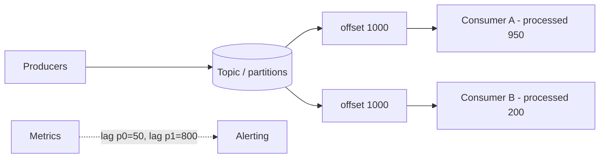

# Consumer Lag (and Backpressure)

## 1. One-Line Definition
Consumer lag is the distance (in messages or time) between what has been produced to a topic and how far the consumer has actually processed — the core health metric of any streaming pipeline, revealing when consumers can't keep up with producers.

## 2. Why Do We Need It?
Producers and consumers are decoupled, so nothing naturally slows the producer when the consumer falls behind. That's great for the producer and dangerous for the consumer: an unnoticed backlog grows, latency creeps toward "eventual," retention silently drops old messages (data loss for that consumer), and at surge time you discover the pipeline was never sized for reality. Lag is the dashboard signal that turns "is reading now" into "how far behind is reading."

## 3. Simple Intuition
A bucket filling from a tap while a hole drains it. The water level is the lag: if the tap (producers) pours faster than the hole (consumers) drains, the bucket rises. You can't see "are we keeping up?" from either side alone — you watch the *level*. A steady level is fine; a rising level means you must either drain faster (more consumers) or slow the tap — and if you ignore it until the bucket overflows (retention expiry), water you needed is gone.

## 4. What Happens Without It?
"Consumer is healthy, no errors" while messages pile up for hours. Symptoms: users get late notifications, read models are stale, retention silently eats the backlog so consumers skip events they'd never know about, and a monitoring gap hides it all. The pipeline claims EDA's benefits (decoupled, async) but ships stale data — the worst kind of failure, because nothing red-lines.

## 5. Core Idea
- **Lag = latest offset − consumer's offset**, per partition. Convert to *time* (lag × throughput) when business wants "how old is our data."
- **What drives lag:** consume throughput < produce rate; a slow/heavy consumer step; a hot partition (all lag on one key); a stuck consumer (poison message, crash-loop); too few instances (parallelism capped by partition count).
- **Backpressure is lag's operational mirror:** the natural control valve is "scale consumers" (add group members) — but that only works up to the partition count. Beyond that, or when the sink can't take more, you must deliberately **slow production or shed load** (throttle, sample, degrade features).
- **Lag ≠ failure when bounded.** Small steady lag is normal; the problem is monotonic growth or bounded-but-too-large (breaching freshness SLO/SLA).

## 6. Important Terminology

| Term | Simple Meaning |
|------|----------------|
| Current offset | Where producers are, per partition |
| Consumer offset | Where this consumer has processed to |
| Lag | current − consumer offset (messages or time) |
| Hot partition | One partition whose lag dominates |
| Backpressure | Deliberately slowing producers downstream |
| Retention expiry | Old messages evicted (data loss for lagger) |
| Freshness | How "old" the latest processed data is (lag in time) |

## 7. Basic Architecture



## 8. Request or Data Flow
1. Producers append messages → topic's `high-watermark` rises.
2. Consumer group reads and commits offsets; lag = watermark − committed offset, per partition.
3. Metrics export that number continuously.
4. A step slows (DB contention, poison event) → commits fall behind → lag grows.
5. Alert fires at threshold → operators scale the group or fix the poison → lag drains back to steady state.

## 9. Practical Example
**Search indexer (assumptions):** shopping catalog, 10k updates/sec, freshness SLO of 60s.
- Consumer re-indexes each event; a schema change triples processing time per event.
- Lag climbs from 5k to 200k messages (≈40 minutes). Without lag alerts, search silently shows stale products for an hour during a flash sale.
- Fix: alert on lag > 60s-worth, page the owning team, roll back the schema change, and consider consuming only the latest event per product (compaction/LATEST) when backlogs spike.

## 10. Scaling
- **First lever: add consumers to the group** — each takes a share of partitions, dropping per-instance work. Hitting the partition ceiling means **increase partitions** (with re-partition costs: ordering per key still holds per partition, but a key's partition may change).
- **Second lever: fix the bottleneck inside the consumer** — batch the sink, dedupe work, move slow calls out, cache hot lookups.
- **Third lever: reduce rate into the topic** — throttle producers, sample optional events, or compress. If the sink is inherently slower than producers, backpressure (producer-side) is the honest answer, not infinite queuing.
- **Hot partitions:** lag concentrated in one partition (a single high-volume key) doesn't respond to adding consumers — the key must be re-keyed/shared or smoothed.

## 11. Reliability and Failure Scenarios

| Failure | Happens | Detection | Recovery | Trade-off |
|---------|---------|-----------|----------|-----------|
| Consumer too slow | Lag grows | Lag metric | Scale group, optimize sink | cost of more workers |
| Poison message | One consumer wedged | Lag on one member | DLQ + alert | investigation |
| Crash-looping consumer | Lag spikes | Lag + restart count | Fix bug, resume from offset | partial reprocessing |
| Hot partition | Skew | Per-partition lag | Re-key, split | ordering trade-off |
| Retention expiry | Quiet data loss | No signal by default | Fit retention ≥ max lag | storage cost |

## 12. Consistency and Correctness
Lag directly threatens **freshness**, not durability: a consumer behind retention's horizon has *lost* data it was supposed to process — silent, undetectable by error counts. Keep retention ≥ worst-case lag, alert on lag before it approaches retention, and treat monotonic lag growth as a pager event, not a curiosity. For read models, define freshness SLOs (how stale may "live" data be?) and set lag targets from them.

## 13. Performance
- Metric is cheap to collect (two offsets, already tracked by the system); export per partition and per group, and alert on **per-partition max**, not the average (average hides one hot partition).
- Right-size worker count ≈ partitions, not raw CPU desire — over-paralleling a group beyond partitions wastes instances doing nothing.

## 14. Security
- Lag dashboards reveal business volume and patterns — protect metrics access like production data.
- Restrict DLQ and reprocessing tooling; replaying can duplicate side effects (emails/charges) — reprocessing must go through the same idempotent consumer path.

## 15. Trade-Offs

| Choice | Advantages | Disadvantages | When to Use |
|--------|------------|---------------|-------------|
| No alerts, best effort | Cheap | Stale data, silent loss | Non-critical telemetry |
| Lag alerting | Catches it early | Noise if thresholds naive | Any customer-facing pipeline |
| Oversize consumers | Rarely lag | Wasted cost | Explicit freshness SLOs |
| Producer backpressure | Bounds lag | Loses throughput/samples | Sink capacity genuinely capped |
| Large retention | Safety margin | Storage cost | Slow-but-no-loss priorities |

## 16. Common Mistakes
- Alerting on lag *average* — a hot partition hides under a healthy mean.
- Adding consumers past the partition count (no effect).
- Ignoring retention-vs-lag: the only silent data-loss failure in streaming.
- Treating lag as "just slow" — some lag means *stale* SLOs, customers feel it.
- Resizing the consumer but not the upstream bottleneck (schema change, slow lookup) — both matter.

## 17. HLD vs LLD Boundary
HLD: freshness budgets, lag targets/alerts, partition-count sizing, retention policy vs lag, backpressure strategy. LLD: offset-commit code, exporter config, consumer batching, DLQ wiring, alert thresholds.

## 18. Interview Questions

### Beginner
- What exactly is consumer lag?
- A consumer group doubles in size but lag doesn't improve — why?

### Intermediate
- Design an alerting setup that catches a slow consumer but not a merely busy one.
- How do you know if lag is "fine" vs "a problem"? What SLO does it map to?

### Advanced
- A single hot user key lags the whole partition and adding consumers does nothing. Design the fix.
- Consumers are at the partition ceiling and the sink is saturated. What is the full set of options, and what do you sacrifice in each?
- How do you size Kafka retention given a freshness SLO and known max-lag behavior, including the crash-recovery worst case?

## 19. Interview Memory Summary

> [!abstract]- Interview Memory Summary

### Remember

- Lag = produced offset − consumer offset, measured per partition.
- It's a freshness metric; monotonic growth means the pipeline is too slow.
- Levers: more consumers → more partitions → optimize the sink → backpressure producers.
- Alert on per-partition max, not average.
- Lag approaching retention = silent data loss.

### 30-Second Explanation

Watch the watermark against committed offsets; steady lag is fine, growth is a SLO breach in the making, retention is the hard ceiling — scale consumers, fix the sink, then honestly backpressure the producers.

### Interview Traps

- Suggesting "add more consumers" when instances exceed partitions or when a single hot key owns the partition — the answer must mention the partition ceiling and key skew.
- Alerting on lag *average* — a hot partition hides under a healthy mean.
- Adding consumers past the partition count (no effect).
- Ignoring retention-vs-lag — the only silent data-loss failure in streaming.
- Treating lag as "just slow" — lag means stale SLOs, customers feel it.
- Resizing the consumer but not the upstream bottleneck (schema change, slow lookup).

### Key Trade-Off

Lag is freshness and freshness costs: you pay with over-provisioned consumers (wasted money) or backpressure/retention (lost throughput or stored data) — the dial you set depends on how stale "live" data may be.

## 20. Related Concepts

### Prerequisites

- [[message-queue|Message Queue]] — lag is the health metric of this transport primitive.

### Commonly Used Together

- [[publish-subscribe|Publish/Subscribe]] — consumer groups and per-subscription offsets are where lag lives.
- [[kafka-producers-consumers|Kafka Producers and Consumers]] — offset commits are the mechanism being measured.
- [[event-driven-architecture|Event-Driven Architecture]] — EDA read models carry freshness SLOs that lag enforces.

### Advanced Concepts

- [[kafka-rebalancing|Kafka Rebalancing]] — offset handoff and pauses when group membership changes.
- [[kafka-retention|Kafka Retention]] — retention vs lag: the storage-backed safety margin for the no-loss case.
- [[observability|Observability]] — where lag metrics, dashboards, and alerts fit the stack.

Related planned topics (not authored yet): autoscaling.

## 21. References
Kafka consumer group monitoring docs, consumer-lag For Totals discussions, Confluent streaming-metrics docs. Verify current metric semantics before interview.

## 22. Active Recall

Test yourself before revealing each answer.

> [!question]- What exactly is consumer lag?
> The distance between what has been produced to a topic and what a consumer has processed: the topic's high-watermark (current offset) minus the consumer group's committed offset, computed per partition. It can be expressed in messages or converted to time (lag × processing rate) for business freshness.

> [!question]- A consumer group doubles in size but lag doesn't improve. Why?
> Because parallelism is capped by the partition count: each partition is read by exactly one member, so beyond N partitions, extra consumers own nothing and add no throughput. If one hot key owns its partition, no number of consumers helps either — the key must be re-keyed/split, or the sink optimized.

> [!question]- Design an alerting setup that catches a slow consumer but not a merely busy one.
> Alert on per-partition max lag converted to time against a freshness SLO, not on an average (a hot partition hides under the mean). Use thresholds scaled to partitions, plus rate-of-change (monotonic growth = pager; steady bounded lag = informational). Tie the threshold to the freshness budget, so "busy but within SLO" doesn't page.

> [!question]- How do you know if lag is "fine" vs "a problem"? What SLO does it map to?
> Lag maps to freshness: "how old is the latest processed data?" Set lag targets from the freshness SLO (e.g., search index ≤60s stale). Small steady lag within budget is fine; lag growing past the budget breaches the SLO; lag approaching retention is data loss — each has a different response.

> [!question]- A single hot user key lags the whole partition and adding consumers does nothing. Design the fix.
> The lag lives in one partition owned by one consumer. Options: re-key that user's events into sub-shards (suffix the key) so the load spreads across partitions, move the consumer faster on that partition (upstream bottleneck), or cache/optimize the sink for that partition. Adding group members is useless — the answer must name the key skew.

> [!question]- Consumers are at the partition ceiling and the sink is saturated. What is the full set of options, and what do you sacrifice in each?
> 1. Increase partitions — throughput grows but ordering per key changes (a key's partition may move) and re-partition has cost. 2. Optimize the sink — batch, dedupe, cache hot lookups; sacrifices engineering effort, not correctness. 3. Backpressure producers — bound lag but lose throughput (throttle/sample). 4. Degrade features (skip optional events). Each trades freshness, throughput, or complexity.

> [!question]- Interview scenario: search indexer, 10k updates/sec, freshness SLO 60s. A schema change triples processing time. What do you do?
> Lag climbs from ~5k to ~200k messages (~40 minutes of staleness) — silent until you measure it. Alert at >60s-worth of lag, page the owning team, roll back the schema change, and scale the group. For spiky backlogs, consume only the latest event per product (compaction/LATEST). The lesson: lag alerting, not error counts, catches freshness failures.

> [!question]- How do you size Kafka retention given a freshness SLO and known max-lag behavior, including crash recovery?
> Retention must cover worst-case lag under the freshness budget, plus crash-recovery headroom: if a consumer can be down for H hours and retention is 7 days while normal lag is minutes, set retention ≥ max(7 days, normal lag + recovery horizon). Retention below worst-case lag means silent data loss for the lagger — the one streaming failure with no red alert by default.

> [!question]- What is backpressure and when is it the honest answer?
> Deliberately slowing production (throttle, sample, degrade) because the sink physically cannot process faster. When adding consumers hits the partition ceiling and the sink is saturated, infinite queuing is dishonest — bounded lag needs a rate the system can actually drain. You sacrifice some throughput/samples to protect freshness and retention.

## 23. When Should I Use This?

### Use it when

- Any streaming pipeline must meet a freshness SLO ("how stale may live data be?").
- You need an early-warning signal that consumers can't keep up before retention eats the backlog.
- Backpressure decisions must be made deliberately (when to throttle producers).
- Sizing retention meaningfully (must exceed worst-case lag).
- Autoscaling consumers from a metric rather than guesses — lag is that metric.

### Avoid it when

- The pipeline is fire-and-forget telemetry with no freshness SLA — lag adds noise.
- You don't own the consumer side (you can't act on the metric).
- Lag is treated as the only health signal while poison messages and retention are ignored.
- You only have an average per topic and can't see per-partition skew.

### What problem does it solve?

Producers and consumers are decoupled, so a falling-behind consumer is invisible: latency creeps toward "eventual," retention silently evicts unprocessed messages, and the failure is undetectable because nothing errors. Lag is the dashboard signal — produced offset minus consumed offset per partition — that makes "how far behind" visible, actionable, and SLO-boundable.

### What problem does it NOT solve?

It doesn't fix the underlying bottleneck (slow sink, hot key, crash-loop) — it detects it; it can't help beyond the partition count (that's a partitioning decision); and it doesn't recover data already lost to retention expiry.

## 24. Decision Connections

Decisions that go together with consumer lag:

- [[message-queue|Message Queue]] — lag is the health metric of the queue's throughput.
- [[publish-subscribe|Publish/Subscribe]] — per-subscription offsets in consumer groups are what you measure.
- [[kafka-producers-consumers|Kafka Producers and Consumers]] — offset-commit semantics produce the number.
- [[event-driven-architecture|Event-Driven Architecture]] — EDA read-model freshness is exactly what lag governs.
- [[kafka-rebalancing|Kafka Rebalancing]] — group membership changes move offsets and briefly raise lag.
- [[kafka-retention|Kafka Retention]] — retention must exceed worst-case lag or you lose data silently.
- [[observability|Observability]] — lag lives in the monitoring stack with alert thresholds.

Decision tree:

```
Is the consumer keeping up with production?
    |
    +-- No lag metric at all?
    |      → monitor watermark vs committed offset per partition
    |
    +-- Lag growing monotonically?
    |      → [[consumer-lag|Consumer Lag]] investigation
    |         |
    |         +-- Fewer consumers than partitions? → add group members
    |         +-- At partition ceiling?            → increase partitions / optimize sink / re-key hot keys
    |         +-- One hot partition?               → split the hot key (not more consumers)
    |         +-- Sink saturated?                  → backpressure producers (throttle/sample)
    |
    +-- Lag near retention hours?
           → [[kafka-retention|Kafka Retention]] too small: extend retention or the data is silently gone
```