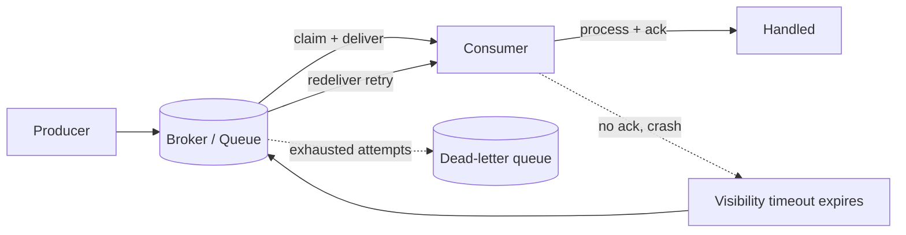

# Ack, Visibility Timeout, Retry, and Dead-Letter Queue

## 1. One-Line Definition
The broker-side reliability loop: a consumer **acks** work it has safely handled; if it dies without acking, the broker waits out a **visibility timeout** and **redelivers** the message; attempts are bounded by a retry policy, and messages that exhaust their attempts land in a **dead-letter queue (DLQ)** so one poison message cannot stall a stream.

## 2. Why Do We Need It?
Consumers crash, hang, and choke — and a broker has no way to tell the difference. Without an explicit handshake, a worker that dies mid-message leaves that message invisible to everyone forever (silent loss) or is processed twice by irate peers (duplicates). The ack/visibility/retry/DLQ loop converts "the consumer will sometimes fail" from a silent data-corruption bug into a bounded, observable, resumable process: failed work is redelivered, repeated failure is quarantined, and the healthy stream keeps moving.

## 3. Simple Intuition
A courier drops a parcel and the recipient must sign to *ack*. If the recipient is not home (no signature), the courier returns it to the depot and tries again later — but not forever: after a few attempts the parcel goes to the lost-and-found (DLQ) where a human scans it, instead of blocking the courier's entire route. The signature is the ack; "try the neighbor after 2 days" is the visibility timeout + retry; lost-and-found is the DLQ. Without the signature, you can never tell "not home" from "parcel eaten."

## 4. What Happens Without It?
- **No ack:** the broker cannot know a message was handled. Either it never redelivers (a dead worker means forever-lost messages) or it forever redelivers (a slow worker is killed by another instance mid-job — double processing every time).
- **No visibility timeout:** a hung consumer holds a message indefinitely; other instances cannot take over.
- **No retry bound / no DLQ:** one malformed or bug-triggering message is redelivered forever; every healthy message behind it in the partition stalls; processing halts while the queue fills (poison-message poisoning).

## 5. Core Idea
- **Ack:** the consumer's explicit "handled safely, I'm done" — sent only *after* the work and its side effects are committed. Ack-then-crash loses the message; crash-then-ack redelivers it (see [[delivery-semantics|Delivery Semantics]]). Choose when you ack relative to when you commit.
- **Visibility timeout (SQS) / unacked lease (RabbitMQ) / rebalance-reset (Kafka):** the window during which a message claimed by a consumer is hidden from peers. If the consumer does not ack, extend, or delete within it, the broker re-exposes the message for redelivery. The timeout must exceed the consumer's *expected processing time*, or you get duplicated work on every slow-but-fine message.
- **Retry policy:** per-stream — max attempts, per-attempt backoff, and which failures are retryable. Transient failures (timeouts, temporary downstream errors) retry; permanent ones (parse failures, validation) should fail fast toward the DLQ.
- **Dead-letter queue:** the quarantine topic where messages that exhausted their attempts land, with the original metadata (reason, attempt count, first failure time) intact. It isolates one bad message from the whole stream — healthy consumption continues — and it is a *job queue for humans and repair tooling*, not a dump.
- **Ordering caveat:** in a partition with a single consumer, a poison message blocks everything behind it *until it is retried to its max and DLQed*. Segmentation (separate queues per poison-prone source, or per-partition DLQ) bounds this.
- **DLQ lifecycle:** alert on DLQ depth, inspect with tooling, fix the producer, and replay repaired messages back onto the main queue (with idempotent consumers, replay is safe). DLQ is not a second-chance store to ignore.

## 6. Important Terminology

| Term | Simple Meaning |
|------|----------------|
| Ack | Consumer confirms "handled, safe to forget" |
| Visibility timeout | How long a claimed message stays hidden from peers |
| Lease / unacked state | The broker's reservation of a message to one consumer |
| Redelivery | Same message handed out again after timeout/crash |
| Retry policy | Max attempts + backoff + retryable-failure classes |
| Backoff | Delay between attempts (see [[retry-and-timeout|Retry and Timeout]]) |
| Poison message | One that always fails and would block others |
| DLQ | Dead-letter queue — quarantine for hopeless messages |
| Max receive count / attempt | The cap that routes a message to the DLQ |

## 7. Basic Architecture



## 8. Request or Data Flow
1. Producer publishes `m` → broker stores it, unclaimed.
2. Consumer polls → broker marks `m` *claimed/hidden* and hands it over.
3a. Success: consumer commits its side effects, then acks → broker deletes `m`.
3b. Failure/crash before ack: `m` stays hidden until the visibility timeout, then the broker redelivers it (attempt 2). Non-idempotent consumers must dedup here (see [[idempotent-consumer|Idempotent Consumer]]).
4. The message keeps failing; after `maxReceiveCount` (e.g., 5) attempts the broker moves it to the DLQ with metadata (original queue, reason, attempt count, timestamps).
5. Healthy messages behind it proceed. An operator watches DLQ depth, fixes the cause, and replays repaired messages onto the main stream.

## 9. Practical Example
**Email send pipeline (assumptions):** 100 msg/s, an email must be delivered exactly once "enough" (at-least-once with idempotency).
- Consumer pulls `send.email`, calls the provider with an idempotency key, and acks only after the provider accepted the send.
- Visibility timeout = 60s (the provider call usually takes ~2s; 60s covers slow tails).
- Retry: 3 attempts, backoff 10s/60s/300s. Provider 5xx retried; malformed payload (parse failure) marked permanent → straight to DLQ.
- A poison email (a template bug) hits max attempts → DLQ. Alert fires, the bug is fixed, the repaired message is replayed, and the stream never stalls because the poison attempt exhausted before blocking.
- Without this loop, the one template bug would pin that partition's consumer forever and delivery lag would climb while every downstream SLO burns.

## 10. Scaling
- **Redelivery application-rate:** a visibility timeout too tight for a burst of slow requests produces a retry storm; size it against the consumer's P99.9 processing time, not the average.
- **DLQ is a separate queue:** give it its own consumers, alerting, retention, and replay tooling — sharing the main queue's consumers couples the repair path to the healthy path.
- **Parallelism:** per-partition ordering means a poison message blocks its partition; scale *by partition* and keep per-key ordering so a single poison entity cannot stall unrelated entities (see [[kafka-ordering|Kafka Ordering]]).
- **DLQ growth is a production metric:** large DLQs mean a systemic producer bug, not noise — simple per-message retries cannot fix a broken producer; fix the writer.

## 11. Reliability and Failure Scenarios

| Failure | What Happens | Detection | Recovery | Trade-off |
|---------|--------------|-----------|----------|-----------|
| Consumer crash mid-message | No ack issued | Delivery-age > timeout | Redelivery after visibility timeout | at-least-once duplicates |
| Consumer hangs (deadlock, GC) | Claim held forever | Claim-age alert | Kill worker, timeout expiry redelivers | duplicate work |
| Timeout too tight | Slow-but-fine messages double-processed | Duplicate-rate spike | Widen visibility, make consumer idempotent | latency vs duplicates |
| Poison message | Endless retries | Max attempts reached | DLQ + alert + fix + replay | repair latency |
| DLQ consumer fails | Quarantine fills | DLQ depth/Lag | Dedicated DLQ workers + retention | storage cost |

## 12. Consistency and Correctness
- Default of this loop is **at-least-once**: redelivery after a missed ack means possible duplicates — the consumer must be idempotent, and the sink must dedupe by a stable key ([[idempotent-consumer|Idempotent Consumer]]).
- **Ordering:** retries and DLQ routing preserve per-partition order (a message is retried to exhaustion before the next is taken). This *itself* is a correctness risk: a poison message delays everything after it. Decide whether strict per-key order justifies that stall.
- Ack semantics must be decided per hop: ack-after-commit loses nothing but risks redelivery; ack-before-commit risks true loss — do not ack before the durable side effect is done.

## 13. Performance
- Acks add a per-message round trip; batch acks when the broker supports it.
- Visibility timeout and retry backoff add to end-to-end latency by design: a message that needs 3 attempts may take minutes. Budget that, or fail fast.
- DLQ processing is extra storage and a second consumer fleet — small in steady state, but size retention to your replay/troubleshooting window.
- The cost of tight timeouts is wasted duplicate work (storm), not just latency; the cost of loose ones is slow detection of a dead consumer.

## 14. Security
- DLQs accumulate sensitive payloads (PII orders, emails) with full context — treat them as a high-sensitivity store: access control, encryption, retention limits, and log redaction. A leaked DLQ is a data breach of everything that ever failed.
- Never put auth material or tokens in messages, since retries and DLQ copies multiply copies of whatever you include.
- Replay tooling must re-authorize and scope per-tenant — replaying a repaired message to the wrong consumer group is a cross-tenant leak vector.

## 15. Trade-Offs

| Choice | Advantages | Disadvantages | When to Use |
|--------|------------|---------------|-------------|
| Ack after commit | No message loss | Possible redelivery (duplicates) | Durable pipelines (default) |
| Ack before commit | No duplicate work | Message loss on crash | Telemetry, loss-tolerant |
| Tight visibility timeout | Fast redelivery/catch-up | Duplicate work on slow tails | Short, predictable consumers |
| Loose timeout | Fewer false redeliveries | Slow to reclaim a hung consumer | Long-running jobs |
| Retry then DLQ | Bounded, observable failures | Retry latency + quarantine | Every durable stream |
| No DLQ | Simpler | One poison stalls everything | Single-writer fire-and-forget (rare) |

## 16. Common Mistakes
- Visibility timeout shorter than P99.9 processing time → periodic duplicate storms on slow-but-fine messages.
- Acking before side effects are durable → silent loss of work on crash.
- Retrying permanent failures (parse/validation errors) — they will never succeed; send them to the DLQ immediately.
- No alert on DLQ depth — a growing DLQ is the production signal that your producer is broken.
- Treating the DLQ as a dump: no retention, no replay, no access control.
- Retrying with fixed/no backoff — retry storms that complete the outage (see [[retry-and-timeout|Retry and Timeout]]).

## 17. HLD vs LLD Boundary
HLD: per-stream ack semantics (when to ack), visibility timeout sizing, retry policy (attempts/backoff/classes), DLQ existence + retention + alerting, replay procedure. LLD: the ack call in the consumer, timeout/lease client config, dead-letter routing config, the DLQ inspection/replay script, dedup store wiring.

## 18. Interview Questions

### Beginner
- What is a visibility timeout and what goes wrong if it is too short?
- What lands in a dead-letter queue?

### Intermediate
- A consumer crashes mid-message. Walk exactly what happens to that message.
- How do you keep a poison message from stalling an entire partition forever?

### Advanced
- Design the delivery/retry/DLQ policy for a payment-settlement pipeline that tolerates zero lost settlement events and must not double-settle.
- Your DLQ fills with 50k messages overnight. Diagnose as a producer problem vs a consumer problem and name the checks you run.

## 19. Interview Memory Summary

> [!abstract]- Interview Memory Summary

### Remember

- Ack = "handled, safe to forget"; no ack = redeliver after the visibility timeout.
- The loop's default is at-least-once → consumers must be idempotent.
- Visibility timeout must exceed P99.9 processing time, or slow-but-fine messages get doubled.
- Never ack before the side effect is durable.
- Bounded retries: transient failures retry, permanent failures straight to DLQ.
- DLQ isolates one poison message from the whole stream — alert on its depth.
- Size and protect the DLQ like a sensitive store (it holds every payload that ever failed).

### 30-Second Explanation

The broker hands a message to a consumer that acks when the work is durably done; if it dies first, the visibility timeout expires and the message is redelivered, repeating until the retry policy routes it to a DLQ where repair happens without stalling the stream — duplicates neutralized by an idempotent consumer.

### Interview Traps

- Claiming "the loop is reliable" while acking before commits — the message can be lost.
- Tightening visibility timeouts blindly and calling the duplicate storms "retries."
- Letting retries hammer a permanent parse error — that is a storm with no possible success.
- Ignoring the DLQ until it is a data breach and a storage bill.

### Key Trade-Off

Reliability here is a budget: durable ack-before-commit and generous timeouts buy "nothing lost" but multiply duplicate work and detection latency; retry-to-DLQ buys bounded quarantine at the cost of retry latency and a sensitive repair store — set the budget in the HLD, not in a firefight.

## 20. Related Concepts

### Prerequisites

- [[message-queue|Message Queue]] — the delivery loop is the reliability machinery of any queue.
- [[delivery-semantics|Delivery Semantics]] — the ack/redelivery behavior maps directly onto at-least-once/exactly-once.

### Commonly Used Together

- [[idempotent-consumer|Idempotent Consumer]] — the consumer half that makes redelivery harmless.
- [[retry-and-timeout|Retry and Timeout]] — the backoff/jitter/budget discipline for broker retries.
- [[consumer-lag|Consumer Lag]] — the health metric of delivery pipelines; poison messages show up here first.
- [[outbox-pattern|Outbox Pattern]] — the producer-side guarantee that the message worth delivering ever reached the queue.

### Alternatives

- [[kafka-delivery-guarantees|Kafka Delivery Guarantees]] — how acks/retries/DLQ-style handling are realized in a committed-log broker.

### Advanced Concepts

- [[kafka-replication|Kafka Replication]] — where acks wait on replicas, the physical source of drop/duplicate behavior.

Related planned topics (not authored yet): producer-consumer, topics-partitions-offsets, kafka-operations, health-checks.

## 21. References
AWS SQS Developer Guide (visibility timeout, redrive policy, DLQ); RabbitMQ tutorials (ack and unacked state, dead letter exchanges); Google Cloud Pub/Sub docs (ack deadlines, dead-letter topics); Kleppmann ch. 11 (delivery guarantees). Verify current limits before interview use.

## 22. Active Recall

Test yourself before revealing each answer.

> [!question]- What is the role of the visibility timeout?
> It bounds how long a claimed-but-unacked message stays hidden. If the consumer neither acks nor deletes before the timeout, the broker re-exposes the message for redelivery — reclaiming work from a consumer that crashed or hung without acking.

> [!question]- What happens when a consumer crashes exactly between processing and acking?
> The message is redelivered after the visibility timeout — the processing reruns. Under the default at-least-once contract that is a duplicate; an [[idempotent-consumer|Idempotent Consumer]] dedups by a stable key so the repeated run has no side effect.

> [!question]- Why must the visibility timeout exceed the consumer's P99.9 processing time?
> Because a slow-but-fine message that exceeds the timeout is re-exposed while the original consumer is still working — two instances process it in parallel, which is duplicated work and possibly duplicated side effects. Size the timeout to the tail, not the average.

> [!question]- A poison message always fails. How does the stream keep moving?
> Bounded retries: after `maxReceiveCount` attempts the broker routes the poison message to a DLQ, and the consumer moves on to the next message. Without the DLQ, the poison message pins its partition and every healthy message behind it waits forever.

> [!question]- When should a failure skip retries and go straight to the DLQ?
> When the failure is permanent: parse errors, validation failures, schema mismatches — retrying cannot change the outcome. Transient failures (downstream 5xx, timeouts) retry; permanent ones fail fast to the DLQ so retry capacity is not burned on impossibility.

> [!question]- Why is "acking before the side effect is durable" a false economy?
> If the message is deleted before the commit, a crash between ack and commit loses the work permanently — exactly-once from the broker's perspective, zero from yours. Ack after the commit and pay the at-least-once redelivery possibility instead.

> [!question]- Interview scenario: settlement pipeline, zero lost events, no double settlement. Walk the loop.
> Per stream set ack-after-commit, visibility timeout sized to P99.9, retry policy that classifies transient vs permanent, and a DLQ with alerting + replay. Make the consumer idempotent (settlement key + unique constraint) so any redelivery replays the stored result, and alert on DLQ depth so a broken producer is fixed instead of its messages looping.

> [!question]- Your DLQ grew 50k overnight. What are you actually looking for?
> A systemic producer or schema bug, not consumer noise: check the dominant DLQ reason codes (permanent parse vs repeated timeouts), the attempted-message source topics, and whether a deploy or schema change preceded the spike. Fix the writer and replay repaired messages — per-message retries alone cannot cure a broken producer.

## 23. When Should I Use This?

### Use it when

- Consumers can crash, hang, or choke — durable streams that must not silently lose work.
- You can make the consumer idempotent, so redelivery is safe (at-least-once).
- One bad entity's message should not stall everyone else (a DLQ is the isolation).
- You need bounded, observable failure handling instead of infinite redelivery loops.

### Avoid it when

- The workload is loss-tolerant telemetry — ack-before-commit and no DLQ keep it cheap.
- The consumer cannot be made idempotent and duplicates corrupt state — fix that first; the loop will redeliver.
- There is no operator to watch the DLQ — orphaned quarantine is just silent storage.

### What problem does it solve?

Unknown consumer failure (crash, hang, poison input) corrupts or stalls a stream silently. This loop turns "consumer failed" into a bounded, observable process: ack or the message is reclaimed, retry transient failures, quarantine the hopeless ones, and let the healthy stream continue.

### What problem does it NOT solve?

It does not make delivery exactly-once (that needs idempotency + possibly [[kafka-delivery-guarantees|Kafka Delivery Guarantees]]), does not stop a broken producer from filling the DLQ, does not give global ordering, and does not remove the need to size capacity — redelivery traffic is real traffic.

## 24. Decision Connections

Decisions that go together with the delivery/retry loop:

- [[delivery-semantics|Delivery Semantics]] — this loop realizes the at-least-once contract; shifting it changes everything here.
- [[idempotent-consumer|Idempotent Consumer]] — the consumer-side dedup that makes unlimited redelivery affordable.
- [[retry-and-timeout|Retry and Timeout]] — backoff, jitter, and budgets for the retry stage of the loop.
- [[consumer-lag|Consumer Lag]] — the metric that shows when the loop's reclaim/retry is costing the pipeline.
- [[outbox-pattern|Outbox Pattern]] — guarantees the message worth delivering ever entered the queue.
- [[kafka-delivery-guarantees|Kafka Delivery Guarantees]] — how commitment and redelivery actually work in Kafka.
- [[message-queue|Message Queue]] — the broker that hosts the whole loop.

Decision tree:

```
Have a durable stream with real consumers
    |
    +-- Loss-tolerant telemetry / noise?
    |      → ack-before-commit; no DLQ; cheap
    |
    +-- Work must not be lost?
    |      → ack-after-commit + visibility timeout sized to P99.9
    |         |
    |         +-- Can the consumer dedup?
    |         |      → at-least-once default; redelivery is safe
    |         +-- Duplicates corrupt the sink?
    |                → [[idempotent-consumer|Idempotent Consumer]] first
    |                   |
    |                   +-- Transient failure?  → bounded retry + backoff
    |                   +-- Permanent failure?  → straight to DLQ, alert, fix, replay
    |                   +-- No DLQ possible?    → segment by queue; accept partition stall
    |
    +-- Must never duplicate at all?
           → exactly-once machinery (see [[delivery-semantics|Delivery Semantics]])
```