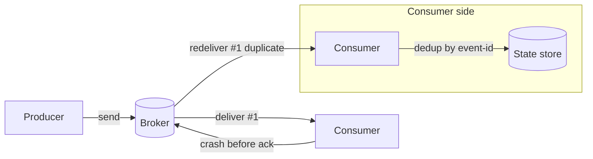

# Delivery Semantics (At-Most-Once / At-Least-Once / Exactly-Once)

## 1. One-Line Definition
The contract between a message broker and its consumers describing how many times a message may be delivered: at most once (may drop), at least once (may duplicate), or exactly once (neither dropped nor duplicated).

## 2. Why Do We Need It?
Distributed systems fail in partial ways: a consumer can process a message and crash *before* acknowledging it, or a broker can redeliver after losing an ack. Neither producer nor consumer can fully avoid these. Delivery semantics is the explicit agreement that tells you what pattern of duplicates/drops your system must tolerate — so you can build idempotency, dedup, or reconciliation where needed instead of discovering corruption in production.

## 3. Simple Intuition
Parcel delivery: 
- **At-most-once:** the courier may leave a "we missed you" slip without redelivering — you might never get the parcel. Fine for the courier's cost, bad for someone expecting it.
- **At-least-once:** the courier keeps trying until you *signed* that you got it. If your signature slip is lost, they deliver again — you might get the same parcel twice. You (the consumer) handle the duplicate.
- **Exactly-once:** the post office guarantees delivery exactly once — which in practice means "redeliver until confirmed, and make the recipient ignore duplicates," not magical logistics.

## 4. What Happens Without It?
Without a stated contract, each team assumes its own version: some assume no duplicates (double-charges customers, double-increments counts), others assume no drops (silently missing events). Retry loops, reconciliation scripts, and pager alerts multiply. Ambiguity about delivery is the root of the worst data-corruption bugs.

## 5. Core Idea
- **At-most-once:** send once, no redelivery — a message may vanish after a crash. Fastest, and right only when a dropped message is harmless (telemetry samples, cache warm-ups).
- **At-least-once:** retry until ack. Cost of loss = zero, cost of duplicates = possible. The *practical default* of real brokers, but the consumer must be **idempotent** (safe to run twice).
- **Exactly-once:** a *system-level* guarantee built by combining machinery (Kafka idempotent producers + transactional consume-produce, sequential dedup via a key, or end-to-end dedup in storage). It is a claim about the whole pipeline, never something a single component grants.
- **Where the dup/drop actually happens:**
  - Consumer processing then crash before ack → redelivery → duplicate.
  - Broker replication lag then failover → possibly lost message.
  - Timeouts after a successful send → producer retries → duplicate.
- **The blame rests with the consumer:** dedup/tracking state is yours — a broker can't know your business key is unique.

## 6. Important Terminology

| Term | Simple Meaning |
|------|----------------|
| Ack (acknowledgment) | Consumer confirms success to the broker |
| Redelivery | Same message sent again after a crash/timeout |
| At-most-once | May drop; never duplicate |
| At-least-once | May duplicate; never drop |
| Exactly-once | Neither drop nor duplicate, system-wide |
| Idempotent consumer | Safe to run the same message twice |
| Dedup key | A stable id/key telling you "I've seen this" |
| Transactional outbox | DB + broker commit atomically |
| End-to-end exactly-once | Guarantee across whole pipeline, not one hop |

## 7. Basic Architecture



## 8. Request or Data Flow
1. Producer sends `m` → broker stores it.
2. Broker delivers `m` → consumer starts processing.
3. Consumer **crashes before acking** → broker redelivers `m`.
4. On reprocess, consumer checks its dedup store for `m.eventId`:
   - present → skip (exactly-once outcome);
   - absent → process, write result **and** the event id in one transaction, ack.
5. Without the dedup step, duplicates leak into downstream state.

## 9. Practical Example
**Payment service** (assumptions): 2k tps, must not double-charge.
- Default broker behavior is at-least-once: a timeout or crash duplicates `payment.capture`.
- Solution: idempotency key = `(merchantId, orderId)`. The capture endpoint stores the key + result in one DB transaction on first processing; duplicate arrivals return the stored result instead of charging again.
- Simple counting jobs (like page-view totals where ±1 is noise) can live with at-most-once; ledger and charge events cannot.

## 10. Scaling
- At-least-once scales naturally: parallel consumers just handle occasional redeliveries.
- Exact-once costs throughput: dedup lookups, transactional writes, tighter ack windows. Plan the budget: an idempotent consumer that makes its sink idempotent usually beats paying for transactional machinery everywhere.
- Dedup state must scale with the consumer (partitioned by event key) — a central dedup DB becomes a bottleneck.

## 11. Reliability and Failure Scenarios

| Failure | Happens | Detection | Recovery | Trade-off |
|---------|---------|-----------|----------|-----------|
| Consumer crash mid-process | Redelivery (dup) | No ack | Idempotency/dedup | dup-tolerant sink |
| Broker loses ack | Redelivery loop | Poison/lag | Dedup + ack in txn | writes slower |
| Replica loses data | Drop | Replication lag monitors | Async replication, ack=all | latency |
| Exactly-once sink fails | Duplicate write | Constraint violation | Unique key retry | schema cost |

## 12. Consistency and Correctness
Honest map: at-least-once is the **default**; exactly-once is a property you assemble (idempotent producer + deduping consumer + unique constraint in the sink + transactional consume-produce where needed). The sink's **primary key / unique constraint is the final arbiter** — if your DB dedups, a duplicate message is physically harmless. Document the guarantee your *end-to-end* pipeline actually delivers, not what one broker advertises.

## 13. Performance
- At-most-once: lowest latency (fire-and-forget), no dedup cost.
- At-least-once: no per-message overhead but consumer pays retry/dedup handling over time.
- Exactly-once: highest cost — ack waits, dedup reads/writes, transactions; throughput drops, and batching/compaction of dedup state is needed to avoid slow storage blow-up.

## 14. Security
- Dedup state and idempotency keys carry business identifiers — protect, encrypt at rest, and never log raw keys (they tie directly to your customers' records).
- Redelivered messages replay side effects: ensure reconciliation/idempotency is per-tenant scoped so one tenant's replay can't touch another's state.

## 15. Trade-Offs

| Choice | Advantages | Disadvantages | When to Use |
|--------|------------|---------------|-------------|
| At-most-once | Fastest, simplest | Silent drops | Telemetry, cache, disposable notifications |
| At-least-once | No loss | Duplicates, consumer obligation | The everyday default |
| Exactly-once | Correct ledger | Slower, complex, storage cost | Payments, inventory balances, money-adjacent flows |
| Idempotent consumer | Cheap "quasi-exactly-once" | Requires stable business keys | Most read-model and event consumers |

## 16. Common Mistakes
- Believing "the broker gives exactly-once" — that's a one-hop claim; end-to-end is your job.
- Processing duplicates without idempotency or unique constraints → silent double counts, double charges.
- Using at-most-once for anything that "must" happen (loss is invisible).
- Adding exactly-once machinery to every topic instead of only the critical sink.
- Not defining the dedup key — without a stable id, idempotency is guesswork.

## 17. HLD vs LLD Boundary
HLD: choose per-stream delivery contract, define idempotency keys, decide transactional vs idempotent-sink strategy, set RPO expectations. LLD: ack wiring, dedup store implementation, unique-constraint schema, retry/backoff code.

## 18. Interview Questions

### Beginner
- What's the difference between at-least-once and exactly-once?
- Why does at-least-once imply duplicates?

### Intermediate
- A consumer crashes after processing but before acking: which semantics do you get by default, and what do you build to fix it?
- How do you make a payment endpoint safely retried?

### Advanced
- Describe how Kafka's idempotent producer + transactional consume-produce achieve exactly-once, and where the guarantee still ends.
- Design an end-to-end exactly-once pipeline from HTTP ingress to a database sink — name every dedup boundary.
- When would you *choose* at-most-once in a real product?

## 19. Interview Memory Summary

> [!abstract]- Interview Memory Summary

### Remember

- At-most-once may drop; at-least-once may duplicate; exactly-once does neither.
- Brokers default to at-least-once in practice.
- Duplicates come from crash-before-ack and timeout-after-send.
- Idempotency (stable business key + dedup + unique constraint) neutralizes duplicates.
- Exactly-once is assembled end-to-end across the pipeline, never granted by one component.

### 30-Second Explanation

Redelivery is the norm, not the bug; acknowledge it in the contract, then make the consumer idempotent and the sink dedup by a stable key.

### Interview Traps

- Saying "we have exactly-once" when only the broker hop is transactional — verify the whole path, or your ledger will find the gap.
- Believing "the broker gives exactly-once" — that's a one-hop claim; end-to-end is your job.
- Processing duplicates without idempotency or unique constraints → silent double counts, double charges.
- Using at-most-once for anything that *must* happen (loss is invisible).
- Adding exactly-once machinery to every topic instead of only the critical sink.
- Not defining the dedup key — without a stable id, idempotency is guesswork.

### Key Trade-Off

At-least-once costs you duplicate-handling obligations; exactly-once costs throughput, dedup storage, and transactional complexity — the criticality of the sink decides which bill you pay.

## 20. Related Concepts

### Prerequisites

- [[message-queue|Message Queue]] — delivery semantics define the broker-consumer handoff contract.
- [[transactions-and-acid|Transactions and ACID]] — transactional dedup and unique-constraint reasoning underpin idempotency.

### Commonly Used Together

- [[event-driven-architecture|Event-Driven Architecture]] — EDA's correctness rests on choosing and honoring a delivery contract.
- [[publish-subscribe|Publish/Subscribe]] — semantics apply per subscription, per consumer group.
- [[outbox-pattern|Outbox Pattern]] — atomic publish pairs with the delivery guarantee to make loss impossible.
- [[consumer-lag|Consumer Lag]] — redelivery, retries, and dedup all interact with how far behind consumers run.

### Alternatives

- [[http-and-https|HTTP and HTTPS]] — a synchronous call chain sidesteps broker-level delivery semantics (its own retry rules apply).

### Advanced Concepts

- [[kafka-delivery-guarantees|Kafka Delivery Guarantees]] — how these semantics are actually realized in a real broker.
- [[kafka-replication|Kafka Replication]] — ack=all and failover are where drops/duplicates physically originate.

Related planned topics (not authored yet): none.

## 21. References
Kafka official docs (semantics, exactly-once section), SQS visibility/timeout and FIFO semantics, Microsoft Azure Service Bus delivery guarantees. Verify current feature docs before interview use.

## 22. Active Recall

Test yourself before revealing each answer.

> [!question]- What's the difference between at-least-once and exactly-once?
> At-least-once guarantees no loss but permits duplicates (a message may be delivered multiple times). Exactly-once promises neither drops nor duplicates across the pipeline — but it is a claim about the whole system, assembled from idempotent producers, deduping consumers, and unique constraints, never a single broker feature.

> [!question]- Why does at-least-once imply duplicates?
> If a consumer processes a message and crashes before acking, the broker cannot know it succeeded and redelivers. Combined with timeouts after a successful send, the same message can arrive two or more times. The contract says "never drop, possibly duplicate."

> [!question]- A consumer crashes after processing but before acking: which semantics do you get by default, and what do you build to fix it?
> Default is at-least-once → the message is redelivered → duplicate processing. To "fix" it you build idempotency: on first processing, store the event id and the result in one transaction; on the duplicate, look it up and return the stored result without side effects.

> [!question]- How do you make a payment endpoint safely retried?
> Define an idempotency key, e.g. `(merchantId, orderId)`. The capture endpoint stores key + result in one DB transaction on first processing; a retried request returns the stored result instead of charging again. A unique constraint on the key is the final arbiter that makes a duplicate physically harmless.

> [!question]- When would you choose at-most-once in a real product?
> When a dropped message is harmless and latency/cost win: telemetry samples, cache warm-ups, anonymous page-view counting where ±1 is noise, disposable notifications. Never for something that *must* happen — at-most-once makes loss invisible.

> [!question]- Why is the sink's unique constraint called the final arbiter?
> Because regardless of what the broker or consumer believes, a duplicate write to a store will fail the unique constraint — the sink dedups physically. That makes a redelivered message harmless even if consumer-side dedup logic is missing. If your DB dedups, a duplicate message cannot corrupt state.

> [!question]- Interview scenario: design an end-to-end exactly-once pipeline from HTTP ingress to a database sink. Name every dedup boundary.
> Ingress: idempotency key on the request (client retries reuse it). Produce: idempotent producer (unique produce IDs) so retries don't double-append. Broker: transactional consume-produce for read-process-write hops. Sink: unique constraint on the event/business key so even an errant redelivery is rejected. The guarantee is the composition, and it costs throughput at each boundary.

> [!question]- Where does exactly-once's guarantee still end even in Kafka?
> Exactly-once in Kafka is scoped to the broker's consume-produce transaction, not to external side effects: a consumer that writes to your DB and performs a network call in the same processing can partially fail. Guarantees stop where the transactional boundary stops — the moment your code does anything outside the transaction, your idempotency must cover it.

> [!question]- Why is idempotency-with-a-stable-key usually cheaper than buying transactional exactly-once?
> An idempotent consumer makes its sink idempotent with a dedup lookup + unique constraint and rides on the broker's free at-least-once. Full exactly-once machinery (idempotent producers + transactional consume-produce + tighter acks) costs throughput and storage everywhere. For most read-model and event consumers, idempotency buys the same outcome for a fraction of the cost.

## 23. When Should I Use This?

### Use it when

- Any message can be redelivered (crash-before-ack, broker failover, producer retry) — i.e., nearly always.
- A duplicate write would corrupt state (payments, balances, inventory).
- You can define a stable business key for dedup.
- You need to document the drops/duplicates contract for other teams.
- You must decide per-stream: no-loss vs no-dup vs cheap.

### Avoid it when

- Exactly-once machinery would cost more than the sink's criticality justifies.
- You can't define a stable idempotency key — dedup is guesswork.
- Your broker's acknowledgment settings are misconfigured and you think semantics fix replication (they don't — see [[kafka-replication|Kafka Replication]]).
- A simple synchronously-returned call meets the need.

### What problem does it solve?

Partial failures (crash-before-ack, lost acks, timeout-after-send) are unavoidable in distributed systems, so whether you get a duplicate or a drop is an accident of timing. Delivery semantics turns that accident into an explicit contract — you know which pattern will occur and can build idempotency, dedup, or reconciliation in the right place before corruption reaches production.

### What problem does it NOT solve?

It doesn't stop replication lag from losing data (that's broker replication config), doesn't remove the throughput cost of exactly-once, and doesn't provide the dedup key for you — if your system can't name one, no contract can make it idempotent.

## 24. Decision Connections

Decisions that go together with delivery semantics:

- [[message-queue|Message Queue]] — the contract applies at the broker-consumer handoff.
- [[event-driven-architecture|Event-Driven Architecture]] — every event stream must pick its delivery contract.
- [[transactions-and-acid|Transactions and ACID]] — transactional dedup is how an idempotent consumer commits safely.
- [[outbox-pattern|Outbox Pattern]] — atomic publish + delivery guarantee is how you achieve "no lost events."
- [[kafka-delivery-guarantees|Kafka Delivery Guarantees]] — the concrete broker-level realization of these semantics.
- [[kafka-replication|Kafka Replication]] — ack=all and failover are where drops/dups physically originate.
- [[consumer-lag|Consumer Lag]] — retries and dedup interact with how far consumers run behind.

Decision tree:

```
What can the pipeline tolerate for message m?
    |
    +-- Loss is harmless (telemetry, noise)?
    |      → at-most-once; fastest, cheapest
    |
    +-- Loss is unacceptable?
    |      → at-least-once (broker default)
    |         |
    |         +-- Can the sink tolerate duplicates?
    |         |      → done; idempotent-ish consumers if cheap
    |         +-- Duplicates corrupt the ledger?
    |                → idempotency key (business key + unique constraint)
    |                   |
    |                   +-- Ingress retries?  → idempotency key at API too
    |                   +-- Broker hop?       → [[kafka-delivery-guarantees|Kafka Delivery Guarantees]] (transactional consume-produce)
    |                   +-- Sink dedup?       → unique constraint = final arbiter
    |
    +-- Both drops and dups forbidden system-wide?
           → exactly-once, assembled end to end — budget for the cost
```