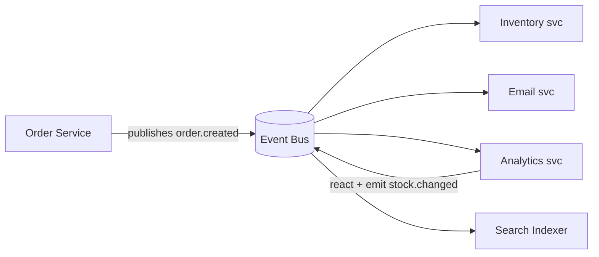

# Event-Driven Architecture (EDA)

## 1. One-Line Definition
An architecture style where components communicate by emitting and reacting to *events* (facts about things that already happened) through an event bus — instead of calling each other directly and synchronously.

## 2. Why Do We Need It?
In a request/response world, every service that cares about a change must be invoked by whoever made the change. That couples all parties in time (all must be up when the call happens), in load (the caller pays for all downstream work), and in code (the caller must know every listener). When ten teams want to react to "order created," direct calls collapse. EDA inverts that: the thing that happens publishes *one* event, and anyone who cares listens for it. Producers and consumers evolve, scale, and fail independently.

## 3. Simple Intuition
A newsroom wire feed: the sports reporter publishes a story to the wire *once*. The print desk, the web desk, and the TV desk each subscribe and pick up whatever they need, whenever they need it. The reporter never calls each desk to check if they want the story, never waits for them to finish, and has no idea (or care) how fast each desk works. The desks can even accept the story hours later if they were busy.

## 4. What Happens Without It?
Direct orchestration: Service A calls B, C, D, E synchronously. Every one of those must be up or the request fails; the slowest one sets A's latency; a weekend spike at B is A's problem; adding consumer F means re-deploying A's code. Failures cascade from the leaf up, and the system's availability is only as good as the worst of its dependencies.

## 5. Core Idea
- **An event is a fact in the past tense** (`order.paid`, `user.deleted`) — never a demand. A **command** is a request for a future action (`charge.card`) and stays in the request/reply world.
- **Emit once, react many times:** producers publish to an event bus; consumers subscribe to the events they care about. No two services need to know about each other.
- **Two coordination styles:**
  - *Orchestration* — one central service tells everyone what to do (close to a sync call chain; easier to reason about; central point of control/failure).
  - *Choreography* — each service reacts to events and emits its own; no master coordinator (loosely coupled, but the flow is implicit and hard to trace).
- **Event notification vs carried state:** a *notification* event is just "something happened, come query me" (bare `order.id`); a *carried-state* event embeds the data (order details) to save follow-up queries and survive query-time unavailability. Pick based on read amplification vs data freshness.
- **EDA ≠ Event Sourcing:** EDA uses events as *messages* between services. Event Sourcing uses events as the *database of record* (state rebuilt by replaying events). They pair well but are different decisions.

## 6. Important Terminology

| Term | Simple Meaning |
|------|----------------|
| Event | A fact that already happened, past tense |
| Command | A request for a future action |
| Event bus | The messaging backbone that routes events |
| Producer / publisher | The service that emits an event |
| Consumer / subscriber | A service that reacts to an event |
| Choreography | No coordinator; each service reacts and emits |
| Orchestration | One service coordinates the flow via commands |
| Carried-state event | Event with data attached, not just an ID |
| Saga | Long-running flow across services via events/compensations |
| Event sourcing | Storing events as the source of truth for state |

## 7. Basic Architecture



## 8. Request or Data Flow
1. A user action completes in Order service → it writes its own database *and* emits `order.created` (atomically — see [[outbox-pattern|Outbox Pattern]]).
2. The bus stores and fans the event out (durable, at-least-once).
3. Each subscriber consumes independently: Inventory updates stock, Email sends confirmation, Search indexes the order, Analytics records it.
4. Later reactions can emit their own events (e.g., `inventory.changed`) and the chain continues — that's the choreography.

## 9. Practical Example
**E-commerce checkout** (assumptions): 5k orders/sec at peak, 8 downstream systems care.
- Events: `order.placed`, `payment.authorized`, `payment.failed`, `shipment.scheduled`, `shipment.delivered`.
- Services subscribe only to what they need: fraud checker on `order.placed`, payments on `payment.authorized`, loyalty service on `shipment.delivered`. Adding a 9th consumer = a new subscription, zero producer changes.
- A slow search indexer lags without blocking checkout: the guarantee (at-least-once, eventual consistency) is already in the contract.

## 10. Scaling
- **Producers and consumers scale fully independently** — the bus decouples both directions.
- **Consumers** scale as consumer groups over partitions (parallelism bounded by partition count).
- **Topics/partitions** scale capacity and split read load across brokers.
- **Backpressure** is visible as consumer lag; when lag grows, add consumers or slow *your* emission rate. There is no built-in pushback to producers — that's the price of the decoupling you asked for.

## 11. Reliability and Failure Scenarios

| Failure | Happens | Detection | Recovery | Trade-off |
|---------|---------|-----------|----------|-----------|
| Consumer is down | Events queue up for it | Lag metric | Catch up from offset on restart | retention window |
| Producer dies mid-write | Event lost | App alerts | Retry / outbox ensures emit | at-least-once |
| Event bus down | No delivery | Broker health | Replica failover, redelivery | replication cost |
| Poison event | One consumer stuck | Lag + DLQ fill | DLQ it, alert, fix sender | investigation |
| Duplicate event | Two reactions | Replay bump | Idempotency on consumers | exactly-once cost |

## 12. Consistency and Correctness
EDA is **eventually consistent** — subscribers see the change late and possibly out of order. Key correctness jobs:
- **Atomic dual-write:** DB write and event emit must be one transaction (outbox pattern), or you get missed events.
- **At-least-once ⇒ duplicates ⇒ idempotent consumers** (dedup by event ID / business key).
- **Ordering** only per partition/key; global order does not exist. Design event flows that tolerate out-of-order, or ensure a key routes related events to one partition.
- **The saga problem:** a multi-service flow has no global transaction — use compensation events (`payment.refunded`) when a later step fails.

## 13. Performance
- **Perceived latency drops:** the origin service acks and moves on; heavy work is deferred and parallelized across subscribers.
- **Throughput scales with partitioning**; per-event fan-out amplification = payload × subscribers — prefer carried-state *IDs + small payloads* where freshness permits.
- Consumers can **batch** (poll N, process in bulk) to amortize overhead; exactly-once needs slow acks/transactions — budget for it.

## 14. Security
- AuthN/AuthZ at the bus: who may publish, who may subscribe (topic ACLs, mTLS).
- Schema registry to reject malformed events; validate and redact PII at the edge — don't trust payloads one consumer wrote for another.
- DLQs and dead-letter stores are sensitive — protect, monitor, and purge; never log event bodies.
- Event logs can become a compliance record: know retention and access-audit obligations before persisting events.

## 15. Trade-Offs

| Choice | Advantages | Disadvantages | When to Use |
|--------|------------|---------------|-------------|
| Sync/REST | Simple, ordered, debuggable | Coupled, slowest dependency wins | Low scale, strong consistency needs |
| Orchestration | Traceable flow, easy to reason | Coordinator bottleneck | Small/medium workflows |
| Choreography (EDA) | Fully decoupled, independent scaling | Flow implicit, hard to debug | Many consumers, polyglot teams |
| Notification events | Tiny payloads | Consumer must query back | Read-after-event fine |
| Carried-state events | No follow-up query, offline-tolerant | Stale data, bigger payloads | High read amplification |

## 16. Common Mistakes
- Publishing events **without atomicity** with the state change → missed events that break correctness silently.
- Using events to *request* actions (commands) → you reinvented sync RPC over a queue and lose ordering and error semantics.
- Assuming global ordering or exactly-once from a "reliable" bus.
- No schema/versioning → one team's event shape breaks another's consumers.
- Untraceable choreography with no event tracing → incidents take days to debug.

## 17. HLD vs LLD Boundary
HLD: which business events exist, event contracts/versioning, topic topology, delivery semantics, retention, saga/compensation design. LLD: producer/consumer code, serializer, schema registry wiring, idempotency keys, ack/retry implementation.

## 18. Interview Questions

### Beginner
- What's the difference between an event and a command?
- Why is the producer decoupled from the consumer in EDA?

### Intermediate
- Design order-placement events: which services subscribe and why?
- Orchestration vs choreography for a 5-service flow: compare and choose.

### Advanced
- Design an event stream where the bus can be down and you must lose zero events with RPO = 0.
- How do you make a multi-service saga safe when a step fails after three others committed?
- How do you evolve an event schema without breaking downstream consumers?

## 19. Interview Memory Summary

> [!abstract]- Interview Memory Summary

### Remember

- Events are facts (past tense); commands are demands (future request).
- Emit once, react many — producers never know consumers.
- Choreography vs orchestration trades traceability for coupling.
- It's eventually consistent: outbox + idempotency + per-key ordering are the correctness toolkit.
- Lag is the health signal, not an outage.

### 30-Second Explanation

Publish facts to a bus; independent subscriptions react, scale, and fail on their own; consistency is eventual — so use outbox, idempotency, and compensation to keep it correct.

### Interview Traps

- Claiming "we're event-driven, so we're decoupled and eventually consistent, no problem" without naming how dual-writes stay atomic and consumers stay idempotent — those decisions are the architecture.
- Publishing events without atomicity with the state change → missed events break correctness silently.
- Using events to *request* actions (commands) → you reinvented sync RPC over a queue and lose ordering/error semantics.
- Assuming global ordering or exactly-once from a "reliable" bus.
- No schema/versioning → one team's event shape breaks another's consumers.
- Untraceable choreography with no event tracing → incidents take days to debug.

### Key Trade-Off

Full decoupling (independent scale, failure isolation, new consumers for free) versus eventual consistency and an implicit, hard-to-debug flow — the price is the correctness toolkit (outbox, idempotency, compensation) you must operate with discipline.

## 20. Related Concepts

### Prerequisites

- [[message-queue|Message Queue]] — the transport primitive the architecture runs on.
- [[publish-subscribe|Publish/Subscribe]] — the fan-out fabric that lets events reach many consumers.

### Commonly Used Together

- [[delivery-semantics|Delivery Semantics]] — the contract under which events can be dropped or duplicated.
- [[outbox-pattern|Outbox Pattern]] — atomic dual-write so the event is never lost with its state change.
- [[consumer-lag|Consumer Lag]] — the health metric for every subscription.
- [[kafka-architecture|Kafka Architecture]] — the common backbone when the event volume scales.

### Alternatives

- [[http-and-https|HTTP and HTTPS]] — the synchronous request/reply style EDA replaces (coupled in time, load, and code).

### Advanced Concepts

- [[kafka-ordering|Kafka Ordering]] — per-key ordering constraints the event design must respect.
- [[kafka-delivery-guarantees|Kafka Delivery Guarantees]] — broker-level guarantees feeding the event contracts.

Related planned topics (not authored yet): event sourcing and CQRS.

## 21. References
Martin Fowler, "What do you mean by event-driven", Microsoft Azure Architecture Center (eventing-style guide), AWS prescriptive guidance on event-driven architectures. Verify current docs for broker feature sets.

## 22. Active Recall

Test yourself before revealing each answer.

> [!question]- What's the difference between an event and a command?
> An event is a fact in the past tense (`order.paid`, `user.deleted`) — something that already happened, broadcast for anyone to react to. A command is a request for a future action (`charge.card`) and belongs in the request/reply world. Emitting commands over a queue reinvents sync RPC and loses ordering and error semantics.

> [!question]- Why is the producer decoupled from the consumer in EDA?
> The producer publishes one event to the bus and never references a consumer: it doesn't know who listens, how many, or how fast they work. Consumers subscribe independently, so a producer's code never changes when a consumer is added, scaled, or fails — decoupling in time, load, and code.

> [!question]- Orchestration vs choreography for a 5-service flow: compare and choose.
> Orchestration: one coordinator drives everyone via commands — traceable and easy to reason about, but a central point of control and failure. Choreography: each service reacts to events and emits its own — fully decoupled and independently scalable, but the flow is implicit and hard to debug. Choose orchestration for small/medium flows needing clear command of failure, choreography for many consumers across polyglot teams.

> [!question]- Design order-placement events. Which services subscribe and why?
> Emit `order.placed` (plus `payment.authorized` and `shipment.delivered` down the line). Subscribers subscribe only to what they need: fraud checker on `order.placed`, payments on `payment.authorized`, loyalty on `shipment.delivered`. Adding a ninth consumer is a new subscription with zero producer changes — that is the decoupling.

> [!question]- A slow search indexer lags for an hour during checkout peak. What happens to checkout?
> Nothing. The indexer has its own subscription and offset; it lags (consumer lag metric rises) without blocking checkout, whose contract already promised at-least-once and eventual consistency. The response is to scale that subscriber or accept the lag — no producer changes, no cross-service latency.

> [!question]- Why is publishing the event atomically with the DB write non-negotiable?
> If the state write and event emit aren't one transaction, you can get both failure orders: state committed, event lost (missed event, silently broken correctness) or event sent, state rolled back (ghost event). The [[outbox-pattern|Outbox Pattern]] writes the event into the same DB transaction and relays it afterward — that's how "zero lost events" is actually built.

> [!question]- A saga's second step fails after three others committed (`payment.authorized`, `inventory.reserved`). How do you make it safe?
> There is no global transaction in a choreographed flow — so you design compensation events: emit `payment.refunded` and `inventory.released` to undo the committed steps. Sagas accept eventual consistency and repair forward via compensations rather than pretending to atomicity.

> [!question]- Interview scenario: design an event stream where the bus can be down and you must lose zero events with RPO = 0.
> Use the [[outbox-pattern|Outbox Pattern]] so the event is durable in the producer's DB before anything reaches the bus; the relay publishes when the bus recovers. Broker side: replication across nodes, ack=all replicas before the producer returns. Consumers stay idempotent so redelivery after outage is safe. RPO=0 comes from the system of producers→broker→consumers, not from any single hop.

> [!question]- How do you evolve an event schema without breaking downstream consumers?
> Version events (`order.created.v1` gives way to `.v2`): publish both while consumers migrate, keep schema-compatible changes additive, and rely on a schema registry to reject malformed payloads. Validate and redact at the edge — one team's consumers must not crash on another team's new shape.

## 23. When Should I Use This?

### Use it when

- Many services need the same fact (order created → 8 consumers) and direct calls would couple them.
- Components must scale and fail independently.
- New consumers should attach without producer changes.
- Heavy work can be deferred and parallelized off the hot path.
- Polyglot teams own different parts of a flow and need loose boundaries.

### Avoid it when

- A request must synchronously return a result built by another service.
- Strong consistency/global ordering is required and can't be partitioned by key.
- The flow is small and coordination logic would be clearer in one place (orchestration).
- The team can't operate the correctness toolkit (atomic dual-write, idempotency, tracing).
- Event volume and fan-out are tiny — a queue or direct call is simpler.

### What problem does it solve?

Direct orchestration is the bottleneck: every service that cares about a change must be invoked by the changer, coupling everyone in time, load, and code, so the slowest/failed dependency owns the system's latency and availability. EDA inverts it — a fact is published once on an event bus and any number of services react independently.

### What problem does it NOT solve?

It does not provide strong consistency or global ordering (eventual consistency is the deal), does not remove the need for atomic publish, idempotent consumers, compensation, and tracing, and does not make the flow self-documenting — a choreography with no event tracing is an incident in progress.

## 24. Decision Connections

Decisions that go together with event-driven architecture:

- [[message-queue|Message Queue]] — the transport layer; EDA is the architectural style using it.
- [[publish-subscribe|Publish/Subscribe]] — the fan-out mechanism realizing "emit once, react many."
- [[delivery-semantics|Delivery Semantics]] — sets the drops/duplicates contract for every event stream.
- [[outbox-pattern|Outbox Pattern]] — makes the publish side atomic with the state change (RPO tooling).
- [[consumer-lag|Consumer Lag]] — the metric every subscriber's SLO rests on.
- [[kafka-architecture|Kafka Architecture]] — the concrete backbone for event volume at scale.
- [[http-and-https|HTTP and HTTPS]] — the synchronous alternative when request/reply fits better.

Decision tree:

```
Services need to react to the same change?
    |
    +-- Result must return synchronously to caller?
    |      → direct calls/API ([[http-and-https|HTTP and HTTPS]])
    |
    +-- Async reaction by many independent teams?
    |      → [[event-driven-architecture|Event-Driven Architecture]]
    |         |
    |         +-- Keep publish atomic with DB?  → [[outbox-pattern|Outbox Pattern]]
    |         +-- Contract for dup/drop?        → [[delivery-semantics|Delivery Semantics]]
    |         +-- Coordinate control flow?      → orchestration (small) vs choreography (scale)
    |         +-- Who reacts?                   → [[publish-subscribe|Publish/Subscribe]] subscriptions
    |         +-- How healthy?                  → [[consumer-lag|Consumer Lag]]
    |
    +-- Flow is tiny and needs one owner?
           → orchestration with a single coordinator
```