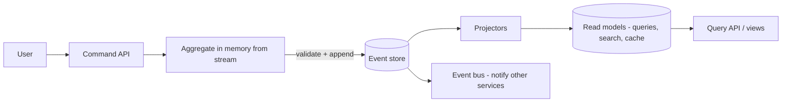

# Event Sourcing and CQRS

## 1. One-Line Definition
Event sourcing stores the history of a system as an append-only log of facts (events) and rebuilds current state by replaying them — instead of storing only the latest state — while CQRS separates the write path (commands → events) from the read path (queries → projections) so each can be shaped for its own workload.

## 2. Why Do We Need It?
A "current state" database throws away every intermediate fact: you know the balance is 80, not how it got there, who approved it, or what the value was a year ago. Audit, replay, time-travel, and rebuild-from-scratch become impossible or bespoke. Events fix that by making the facts themselves the source of truth. Meanwhile, one model cannot serve both writes and reads well at scale: OLTP writes want small, transactional, normalized state; reads want denormalized projections, caching, and search. CQRS acknowledges that split explicitly. Pairing them yields a system whose write model is an append-only fact log and whose read side is any set of projections you can build from it.

## 3. Simple Intuition
- **Event sourcing:** a ledger vs a balance. The bank does not store just "balance: 80"; it stores the transactions — "deposit 100", "withdraw 20" — and computes the balance by replaying them. Your accounting is torn down and rebuilt from the book of transactions whenever you need it. That is the event log.
- **CQRS:** a two-desk clerk. One desk takes orders (commands) and makes the ledger; the other desk answers questions (queries) from a nicely organized copy it maintains. The order desk does not want to stop and format answers; the question desk does not want to take orders. Different desks, different optimizations, same underlying facts.

## 4. What Happens Without It?
State-only stores rot: no audit trail beyond what you separately designed, aggregates that cannot be recomputed "as of" a past date, "how did we get here" questions answered by archaeology through logs. Under load, a single read-write model contends: heavy read traffic saturates the write path's OLTP store, or complex read shapes force awkward writes. And migrating a state model to answer "what changed" requires re-engineering to a CDC layer you should have had (see [[outbox-pattern|Outbox Pattern]]).

## 5. Core Idea
- **Streams, not tables:** each aggregate (order, account, user) owns an append-only *event stream* — `AccountCreated`, `FundsDeposited`, `FundsWithdrawn`. Events are immutable facts named in the past tense.
- **Rebuild = replay:** `state = fold(events)` — current state is the reduction over the stream. A snapshot (periodic fold) avoids replaying all of history on every load. Time travel = fold up to event N.
- **Command model:** commands are validated against current state and, if accepted, produce events that are appended atomically (optimistic concurrency: expected version check on the stream).
- **How the read side works:** **projections** consume the log and maintain denormalized read models (dashboard rows, search index, a page cache). CQRS reads never touch the event store directly — they query projections, so read shaping (indexes, caching, serving) is decoupled from write integrity.
- **CQRS-scope spectrum:** from *full CQRS* (separate stores and models) to *same-store, different code paths* (one DB, dedicated query methods + read replicas) — the lightest useful version. Full CQRS is a decision, not a default.
- **why they pair:** event sourcing guarantees every state change is emitted as an event (the log is the write path), which is exactly the input a CQRS read model needs. Together they give you the event log as ledger, projections as query store, and the bus for anything else that wants the facts ([[event-driven-architecture|Event-Driven Architecture]]).

## 6. Important Terminology

| Term | Simple Meaning |
|------|----------------|
| Event store | Append-only log of events per aggregate |
| Aggregate | An entity boundary whose state is rebuilt from its events |
| Event stream | All events of one aggregate, in order |
| Projection / read model | A view rebuilt continuously from the log |
| Snapshot | A saved fold to avoid full replay |
| Replay | Re-running the log into a fresh projection |
| Command | Validated request that may append events |
| CQRS | Separate command (write) and query (read) paths |
| Optimistic concurrency | Version check before append; conflict = reject |

## 7. Basic Architecture



## 8. Request or Data Flow
1. Command arrives: `withdraw(account 42, 20)`. The command handler loads account 42's stream, folds to current state (balance 100).
2. Validation: balance 100 ≥ 20 → accept. The handler appends `FundsWithdrawn(account 42, 20, version 5)` with a version-check on the stream.
3. Optimistic conflict: if another write already bumped the version, the append is rejected and the helper retries the fold.
4. Projectors consume the log: the balance projection updates to 80; an analytics projection counts withdrawals; a search index re-scores the account.
5. A later query reads only the projection. Rebuild is a replay from the log into a fresh projection.

## 9. Practical Example
**Banking-as-a-service ledger (assumptions):** 5k tx/s, regulators demand "state as of any past date," product needs per-account statement history.
- Write: `LedgerEntryAppended` events streamed per account; each account's balance is a snapshot + tail replay.
- Reads: a balances projection (fast key-value), a statements projection (paged list per account), a risk projection (velocity counters). Each is a separate read model off the same log — no read traffic ever touches the write store.
- Regulatory query "state of account 42 on 15 March 2023" = fold the stream to that point, or use a snapshot taken that day.
- Rebuild/backfill for a new projection (say, "daily P&L") = replay history, no dual-writes, no data migration.
- Without ES/CQRS this needs a full audit engine, a CDC pipeline, and a read-model tier anyway — the pattern names and owns the pieces.

## 10. Scaling
- **Write side:** the event log appends — log-structured writes scale horizontally (partition by aggregate key, Kafka-style). Append is cheaper than update-in-place. The bottleneck is aggregate contention (hot accounts): shard per aggregate, or rate-limit a hot key.
- **Read side:** projections scale independently — a read model can be sharded, cached, or served from replicas without touching write integrity.
- **Catch-up/snapshotting:** replay grows slower as the log grows; snapshot + tail replay keeps load bounded. Snapshots themselves need compaction and a schedule.
- **Fan-out:** the shared log is one producer to many projections — the classic pub/sub amplification trade (see [[publish-subscribe|Publish/Subscribe]]).

## 11. Reliability and Failure Scenarios

| Failure | What Happens | Detection | Recovery | Trade-off |
|---------|--------------|-----------|----------|-----------|
| Event store lost | Cannot rebuild state | Replication health | Replicas + snapshot restore | RPO depends on replication |
| Projector lag | Read models stale | Projection lag metric | Rescale projectors | eventual-consistency window |
| Corrupt projector code | Wrong read model | Data-quality checks | Rebuild projection from log | downtime for rebuild |
| Hot aggregate | Stream contention | Latency per-key | Shard and snapshot the key | complexity |
| Event schema drifts | Old events unreadable | Deserialization errors | Version-tolerant readers, upcasting | migration tooling |

## 12. Consistency and Correctness
- **Append-only and versioned:** state is the fold of the stream, so consistency is "appends are ordered per aggregate, validated against a version." Optimistic concurrency makes conflicting commands fail loudly, not silently.
- **Read/write split = eventual consistency:** projections lag the write path; reads can be stale by the lag window. CQRS means you **explicitly accept eventual consistency** on the read side. Budget it; don't discover it in production.
- **Events never rewritten** — corrections are new facts (`FundsWithdrawn` followed by `OverdraftFeeBilled`, never an edited prior event). Immutability is what makes audit and replay trustworthy.
- Idempotency still rules outside the store: downstream consumers of published events must dedup ([[idempotent-consumer|Idempotent Consumer]]).

## 13. Performance
- Appends are fast and naturally sequential per aggregate; reads hit projections — both beat a single model at scale.
- Replay cost is the tax: a cold aggregate loads its snapshot + tail. Snapshot cadence and tail size set the load latency.
- Projections multiply work (each projection replays each event) but in dedicated stores/producers, so the write path stays untouched.
- Watch hot keys and version-retry storms (loaded over and over when contented) — the classic ES scaling trap.

## 14. Security
- The event log is a **full sensitive record**: every fact ever. It requires the strongest access controls, encryption at rest, retention/compliance policy, and log redaction — an event store leak is a total-history leak, worse than a state leak.
- Projections inherit partial data; permission them separately per consumer (a projection is a filtered copy, not a blanket grant).
- Commands authorize at entry; events should carry no secrets (they may be streamed to external subscribers).

## 15. Trade-Offs

| Choice | Advantages | Disadvantages | When to Use |
|--------|------------|---------------|-------------|
| Event sourcing | Audit, time-travel, rebuild, no migration for new projections | Event-schema versioning, replay costs, unfamiliar | Ledgers, money, compliance, state history |
| State-only store | Simple, familiar, cheap to read | No history, hard audit, migration on evolve | Standard CRUD, no audit need |
| Full CQRS | Each side optimally shaped, independent scale | Two systems to operate, eventual reads, complexity | Read-heavy/mixed workloads at scale |
| Light CQRS (replicas) | Simpler, same schema | Limited read shaping | Early-stage split |
| Command + event sourcing | One consistent write model + log | Version conflict handling | Money flows |

## 16. Common Mistakes
- Modeling events as schema-editable records — dead aggregate without version-tolerant readers.
- Skipping snapshots until replay takes minutes per aggregate, then load explodes.
- Confusing "event sourcing" with "publish events to other services" — the log is the DB, the bus is a feed from it.
- Accepting a non-idempotent projector and calling it a read model — rebuilds corrupt on replay.
- Forgetting that CQRS reads are eventually consistent, then "what was the state at exactly T" requests fail.
- Trying to update/delete historical events — destroying the audit property that was the reason to adopt this.

## 17. HLD vs LLD Boundary
HLD: which aggregates are event-sourced, event naming/schema + versioning policy, snapshot cadence, read-model topology (which projections, which stores), event-consistency budget for reads, replay/backfill procedure, hot-key policy. LLD: append/version-check code in the aggregate, projector implementations, upcasting, the snapshot trigger, read-model index schema.

## 18. Interview Questions

### Beginner
- How is event sourcing different from storing current state?
- What is a projection?

### Intermediate
- A projector is one hour behind and a user sees stale data. Walk the design decision and the fixes.
- How do you handle a schema change when a million historical events exist?

### Advanced
- Design an event-sourced wallet with a hot account that receives 20k tx/s. Cover snapshots, contention, and projections.
- A regulator asks for "the state of this order at any past instant." Show what event sourcing gives you that a state store cannot — and where CQRS helps.

## 19. Interview Memory Summary

> [!abstract]- Interview Memory Summary

### Remember

- Events are immutable past-tense facts appended per aggregate.
- State = fold of the stream; snapshots bound replay.
- Commands validate against folded state; appends check versions (optimistic concurrency).
- Projections build read models; CQRS = separate write and read shapes.
- Event sourcing + CQRS: log = ledger, projections = queries, bus = fan-out.
- Reads are eventually consistent — budget the lag explicitly.
- The log is the sensitive crown jewel; protect it like it: it holds all history.

### 30-Second Explanation

Store facts, not just state: each aggregate's events are the source of truth and current state is the fold with snapshots to bound replay. The write path validates commands and appends events; projectors rebuild all read models off that same log, which is what CQRS formalizes — write store and read stores optimized independently, eventual consistency accepted on the read side.

### Interview Traps

- Calling every event-publishing service "event sourcing" — the log must BE the database.
- Treating events as mutable records — they are append-only, corrections are new events.
- No snapshot policy — cold aggregates replay minutes of history.
- Pretending reads are strongly consistent with a "projection" that is not — budget the lag.
- Underestimating schema-versioning-of-a-million-events cost.

### Key Trade-Off

You buy an honest audit trail, time-travel, and rebuild-from-log for the price of event-schema versioning, replay/snapshot machinery, eventual-consistency reads, and operating two stores (log + projections).

## 20. Related Concepts

### Prerequisites

- [[event-driven-architecture|Event-Driven Architecture]] — events feeding a log are the same vocabulary raised to state-defining.
- [[transactions-and-acid|Transactions and ACID]] — append + version check is a single-write primitive; ACID constraints move to the aggregate boundary.

### Commonly Used Together

- [[outbox-pattern|Outbox Pattern]] — publish derived events atomically with store appends so projections never miss a fact.
- [[idempotent-consumer|Idempotent Consumer]] — anything consuming the log (projections, other services) must dedup; replays are safe only because of it.
- [[event-types|Event Types]] — commands vs events and carried-state shape apply to every stream you build.
- [[replayability|Deterministic Systems and Replayability]] — the deep principle: replay must be deterministic to rebuild state.

### Alternatives

- State-only modeling with a write-ahead/outbox (see [[outbox-pattern|Outbox Pattern]]) — history via side pipeline, not the primary store.
- [[distributed-transactions|Distributed Transactions]] — if you need cross-aggregate atomic guarantees, ES alone does not give them; sagas/outbox do.

### Advanced Concepts

- [[strong-vs-eventual-consistency|Strong vs Eventual Consistency]] — the read-side contract CQRS forces you to name.

Related planned topics (not authored yet): produced-and-consumed streams orthograph (producer-consumer), topics-partitions-offsets, kafka-schema-registry.

## 21. References
Fowler, "Event Sourcing" and "CQRS" articles; Martin Fowler, "What Do You Mean by Event-Driven?"; Kleppmann, "Designing Data-Intensive Applications" ch. 11; "The LMAX Architecture" (CQRS-style trading system); Yoav Francis and Paul Hintjens references on event-driven state. Verify schema/history docs for your event store before interview use.

## 22. Active Recall

Test yourself before revealing each answer.

> [!question]- Government stores "balance = 80." Event sourcing stores what instead, and why does it matter?
> It stores the stream of facts — `AccountCreated, Deposit 100, Withdrawal 20` — and the balance 80 is computed by folding them. The delta: auditability (how did we get here), time-travel (state at any past date), rebuild (fresh projection from the log), and the ability to answer "what changed" without archaeology.

> [!question]- How do you compute current state without replaying all of history on every load?
> Snapshots: periodically fold the stream into a saved state plus the position reached, then load = snapshot + replay-only-the-tail. Cadence and tail size are the config knobs that bound both load latency and projection lag.

> [!question]- Two controllers withdraw from one account simultaneously. What stops both from succeeding?
> Optimistic concurrency: each append carries an expected version of the stream; the second version-check fails, the loser re-folds from the now-later tail and re-evaluates. This is the aggregate's ACID: ordered, validated appends per stream.

> [!question]- Why are reads in CQRS eventually consistent, and how do you budget it?
> Projectors replay the log asynchronously, so a projection trails the latest append by the lag window. Design reads on the assumption of staleness — name the budget (seconds/minutes), size projectors to lag, and never write a query that demands "exactly at T" against a projection that has not caught up to T.

> [!question]- Schema changed; a million historical events use the old shape. What do you do?
> Never rewrite events. Make readers version-tolerant (read both shapes) and add an upcasting layer that converts old records to the new shape at read time. Compatibility as a design property, not a migration, is what keeps replay of 10-year-old facts working.

> [!question]- Interview scenario: a hot account receives 20k tx/s. How does event sourcing scale it?
> Shard by aggregate (that account = its own stream/partition) so appends are sequential within it and parallel across accounts; bound the hot account's stream with aggressive snapshots + tail replay so load doesn't re-fold minutes of history; run the balance projection from the snapshot+tail in a dedicated read store; and apply rate limiting or a request:acceptance boundary on the single hot key itself.

> [!question]- "We publish order events to five services, so we use event sourcing." Evaluate this claim.
> Publishing is a feed, not a source of truth. Event sourcing means the log of events is the authoritative store from which current state is rebuilt — without that, you have an event-driven architecture (fine), but not event sourcing. The tell: can you delete the services' state stores and rebuild them from the log alone?

## 23. When Should I Use This?

### Use it when

- Audit, history, time-travel, or regulatory "state as of X" is a first-class requirement.
- You keep re-deriving read shapes (projections, search, analytics) and want one source to build them all from.
- Writes dominate but reads are shaped differently — CQRS's independent read models earn their cost.
- Replays/backfills/new projections are routine operations, not emergencies.
- You can accept eventual consistency on the read side.

### Avoid it when

- CRUD with no history, no audit, no rebuild requirement — a state store is simpler and familiar.
- Reads and writes are both simple and low-scale — CQRS is overhead, not optimization.
- You cannot name a consistency budget on reads — the eventual-consistency tax will bite.
- The team is new: event sourcing is a big mental-model and operational shift; start with the outbox + pub/sub feed first.

### What problem does it solve?

The state-only store throws away history, couples read and write shaping, and makes "how did we get here" unanswerable. Event sourcing makes the facts the source of truth (audit, replay, time-travel); CQRS decouples the write model from an arbitrary set of read models you can shape, scale, and rebuild independently.

### What problem does it NOT solve?

Cross-aggregate atomicity (needs sagas/outbox, not ES), delivery guarantees to external consumers (needs [[delivery-and-retry|Ack and Retry]] + [[idempotent-consumer|Idempotent Consumer]]), strong-consistency reads on the write path, and the operational complexity of two stores (log + projections) — if you want simplicity at scale, ES/CQRS is not the lever.

## 24. Decision Connections

Decisions that go together with event sourcing and CQRS:

- [[event-driven-architecture|Event-Driven Architecture]] — the log feeds the bus; the bus feeds the projections and every other consumer.
- [[outbox-pattern|Outbox Pattern]] — atomic append + publish so the log and its derived feeds cannot diverge.
- [[idempotent-consumer|Idempotent Consumer]] — replays/rebuilds are safe only when consumers dedup.
- [[event-types|Event Types]] — command vs event and carried-state shape every stream you source.
- [[replayability|Deterministic Systems and Replayability]] — replay must be deterministic or rebuilt state diverges.
- [[strong-vs-eventual-consistency|Strong vs Eventual Consistency]] — CQRS's read-side contract.
- [[distributed-transactions|Distributed Transactions]] — the saga/outbox layer above when one aggregate is not enough.

Decision tree:

```
"Do I need history or audits of this aggregate?"
    |
    +-- NO - plain CRUD?
    |      → state store; see [[transactions-and-acid|Transactions and ACID]]
    |
    +-- YES - facts, audit, time-travel, rebuild?
    |      → event sourcing (append-only stream is the source of truth)
    |         |
    |         +-- Read shapes differ from write shapes?
    |         |      → CQRS: projections + separate read stores (accept eventual reads)
    |         |         |
    |         |         +-- Cross-aggregate flow needs atomicity → [[saga-and-strangler|Saga]] / [[outbox-pattern|Outbox Pattern]]
    |         |         +-- External consumers of the log → (bus) + [[idempotent-consumer|Idempotent Consumer]]
    |         +-- Hot aggregate? → snapshot + tail replay + rate-limit the key
    |         +-- Schema drift?  → version-tolerant readers + upcasting
    |
    +-- History needed but keep the DB?
           → [[outbox-pattern|Outbox Pattern]] + CDC feed; not event sourcing
```