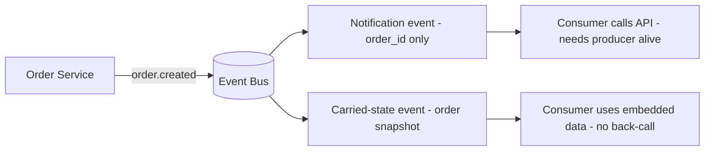

# Event Types: Notification / Carried State / Command vs Event

## 1. One-Line Definition
The two axes that shape every message in a distributed system: *command vs event* (is it a request for future action or a statement of a fact that already happened?) and *notification vs carried state* (does it carry only identifiers to fetch, or the full data the consumer needs?).

## 2. Why Do We Need It?
An event bus routes whatever you publish verbatim — it does not decide how much or what kind of information a message should carry. That decision is yours, and it silently sets your coupling, latency, payload size, data-freshness, and who-can-see-what. Confusing a command with an event produces the worst class of distributed bugs: services treating a request as a fact (doing work that was never authorized) or reacting to stale demands. Naming and shaping the message type up front is how you make an [[event-driven-architecture|Event-Driven Architecture]] predictable instead of accidental.

## 3. Simple Intuition
- **Notification vs carried state:** a courier leaves your neighbor a note saying "call me" (bare identifier — they must ring back to learn anything) versus a note that includes the full story ("your package is at the depot, tracking 4j2, collect before 5pm" — everything needed, immediately actionable). The first is small but forces a return trip; the second is self-sufficient but sends a copy of the story to every recipient.
- **Command vs event:** a command is *asking* — "please charge this card." You can refuse, it may fail, and the answer matters. An event is *stating* — "the card was charged." There is nobody left to argue with; it already happened. Mixing them up is like a waiter interpreting "I'd like water" as "the water has been served."

## 4. What Happens Without It?
- **Notification neglect:** every consumer turns around and queries the producer for details → read amplification (N consumers × 1 event = N fetching queries), the producer must be alive, and each consumer sees *its own timing* of data (inconsistent snapshots).
- **Carried-state neglect:** every event embeds the entire order in every fan-out copy → payload × subscriber amplification, stale data shipped everywhere, PII leaked to subscribers who never needed it, schema drift frozen into old messages.
- **Command/event confusion:** commands are routed through topics, so a "charge the card" demand is broadcast to every subscriber who "should" act — or events are sent as point-to-point commands so a fact reaches only one listener of many. Both yield duplicated work, missed reactions, and flows that cannot be traced.

## 5. Core Idea
- **Events are facts in the past tense** (`order.placed`, `invoice.paid`); **commands are intentions toward the future** (`charge.card`, `cancel.order`). Events have no expected reply and cannot be rejected; commands can fail and are retried against a *want*.
- **Notification event:** minimal payload — just the entity identifiers (`order_id`) and a type. Consumers fetch details by calling the producer (or a read API). Right when producers must stay the source of truth and payload hygiene matters, and when the query cost is acceptable.
- **Carried-state event (event-carried state transfer):** embeds a snapshot of the data (`order_id`, items, addresses, total) so consumers act without a back-call. Right when consumers must survive the producer being down, when read amplification would be huge, and when a small staleness window is acceptable.
- **Command vs event in transport:** commands usually travel **point-to-point** (one worker should do the job) and pair with a reply channel; events travel **pub/sub** (many may react). A [[message-queue|Message Queue]] gives you the first; a topic-style bus gives you the second. See [[publish-subscribe|Publish/Subscribe]].
- **The continuum, not a binary:** pragmatic systems mix — carry stable reference data (items, addresses) and send notifications for volatile data (live inventory) that goes stale fast.
- **Related but different:** commands are still often implemented over HTTP/RPC (synchronous) or as **async command messages** on a work queue. Event Sourcing is a step further: the event *is* the database of record — see [[event-sourcing-cqrs|Event Sourcing and CQRS]].

## 6. Important Terminology

| Term | Simple Meaning |
|------|----------------|
| Event | A fact that already happened, past tense |
| Command | A request that something be done, future tense |
| Notification event | Carries only identifiers; consumer fetches the rest |
| Carried-state event | Embeds the full snapshot for consumers |
| Reply channel | Where the result of a command is returned |
| Read amplification | N consumers × fetch-per-event queries |
| Payload amplification | Full data × subscribers per event |
| Snapshot | A point-in-time copy embedded in an event |

## 7. Basic Architecture



## 8. Request or Data Flow
**Notification path:** 1) order commits; 2) publisher emits `order.created` with `order_id`; 3) inventory service needs the items → calls the Order API back; 4) if the Order Service is down at that moment, inventory cannot enrich and either retries or falls back — the event alone was not self-sufficient.
**Carried-state path:** 1) order commits; 2) `order.created` carries items, totals, addresses; 3) the email service renders an email with no back-call; 4) the snapshot the email used is already slightly stale the moment a later `order.updated` lands — deliberate and acceptable.

## 9. Practical Example
**E-commerce (assumptions):** 5k orders/sec at peak, 8 subscribers to `order.*`.
- **Email + packing slip:** carried state — payload ~1KB, rendered locally, a producer outage at peak cannot stop emails.
- **Inventory:** notification (`order_id`, `sku`, `qty` embedded, nothing else) — inventory recomputes from its own counts and needs only the delta.
- **Fraud scoring:** needs the full order plus device context — carried state plus a query for the piece the notification cannot know.
- **Estimate:** with notification and 8 subscribers each doing one fetch, peak read amplification = 5k × 8 = 40k extra HTTP calls/sec against the order store. Carried state moves that cost to the event bus (payload × subscribers = 5k × 8 × 1KB, about 40MB/s) and removes the dependency on the producer for those consumers.

## 10. Scaling
- **Notification scales badly under fan-out:** query load grows as subscribers × event rate; mitigate with subscriptions that share fetches, or move the fetch to a read model ([[event-sourcing-cqrs|Event Sourcing and CQRS]]).
- **Carried state scales badly under payload:** bloat multiplies by subscribers; split hot reference data from volatile data, and keep payloads compact (compressed, keyed to a schema).
- **Producer fan-in:** with carried state the producer is off the query path — its DB handles far fewer amplification reads.
- **Versioning:** carried state must carry a schema version; consumers must tolerate a range of versions (additive changes) or replay and rollout break.

## 11. Reliability and Failure Scenarios

| Failure | What Happens | Detection | Recovery | Trade-off |
|---------|--------------|-----------|----------|-----------|
| Producer down at consume time | Notification consumers cannot enrich | Fetch error rate | Retry, fallback, cache | availability vs freshness |
| Consumer down for a day | Misses notifications (non-durable) | Offset lag | Durable subscription catch-up | retention cost |
| Snapshot goes stale | Consumers act on old data | Reconciliation job | Re-query hot fields; shorter TTL | amplification |
| Schema drifts after replay | Old events unreadable | Deserialization errors | Version-tolerant readers | complexity |

## 12. Consistency and Correctness
- A **carried-state snapshot is point-in-time**: two consumers reading the same event see the same data, but any consumer that also queries for "current" data can observe skew between the two. Name your staleness budget explicitly (minutes for reference data, seconds for orders).
- Notifications are *fresh* by construction because the fetch happens at consume time — but freshness is per-consumer (each fetches at its own time), so even notifications give no uniform moment-in-time view.
- Commands are not events: never mark a fact before the work is done. `payment.authorized` must only be emitted after authorization actually happened, or the ledger disagrees with the bus (see [[outbox-pattern|Outbox Pattern]] for atomic publish).

## 13. Performance
- Notification: one small message + one fetch per consumer — cost lives in the producer path (read amplification).
- Carried state: cost lives in the bus (storage, transfer, serialization) — larger messages, but zero back-calls.
- Hybrid wins when elements differ: only *volatile* and *large* data justify the query; stable small reference data belongs in the event.
- Fan-out count multiplies both: amortize with a single enrichment service that owns the fetch and re-publishes derived carried-state topics.

## 14. Security
- **Carried state expands the leak radius:** embedding the full order surfaces PII and merchant data to every subscriber and into broker retention. Gate what goes in the event by subscriber need, filter topics, and redact fields no subscriber legitimately reads.
- Notification events reduce leakage but can become an *enumeration vector* (IDs replayed in public topics) and an *unauthenticated fetch* risk if the enrichment API forgets authorization — the fetch must carry the same permissions as the original data.
- Never carry secrets or auth tokens in either type; encrypt sensitive fields end-to-end, not just at the broker.

## 15. Trade-Offs

| Choice | Advantages | Disadvantages | When to Use |
|--------|------------|---------------|-------------|
| Notification event | Small, fresh, no data duplication | Read amplification, producer coupling | Reference data, rare events, low fan-out |
| Carried-state event | Self-sufficient, survives producer outage | Payload bloat, staleness, leak radius | Email, fan-out-heavy flows, offline consumers |
| Hybrid | Balances freshness and size | Two code paths to maintain | Most real systems |
| Command (sync) | Reply, rejection, guarantee of outcome | Coupling, blocking | Caller needs the result |
| Command (async queue) | Decoupled, retryable | No immediate reply, eventual | Work dispatch, long jobs |

## 16. Common Mistakes
- Emitting `payment.authorized` before authorization finished — a fact emitted as a hope.
- Embedding the entire payload into every event and shipping PII to all subscribers.
- Notification-only events that strand consumers when the producer is down (no fallback state in the event).
- Sending commands through a fan-out topic so several consumers each do the same destructive work.
- No schema version on carried-state events — replay and multi-version consumers break.

## 17. HLD vs LLD Boundary
HLD: per-event contract (command vs event, notification vs carried state), payload schema and versioning, staleness budget, fan-out vs point-to-point choice per event type, security and redaction policy, hybrid strategy. LLD: serializer wiring, the fetch call in each consumer, enrichment helper, schema registry client, redaction mapper.

## 18. Interview Questions

### Beginner
- What is the difference between a command and an event?
- Why would a consumer prefer a carried-state event over a notification?

### Intermediate
- An order service publishes `order.created`. Pick the event shape for email, inventory, and analytics — and justify each.
- You measure 40k back-calls/sec after adding a subscriber. What changed and what are two fixes?

### Advanced
- Design the event contracts for a checkout flow that must never double-charge and must tolerate the order service being down at peak. Include your command boundaries.
- How do you version carried-state events so offline consumers can replay a year of history without breaking?

## 19. Interview Memory Summary

> [!abstract]- Interview Memory Summary

### Remember

- Events are past-tense facts; commands are future-tense requests.
- Commands → point-to-point + reply; events → pub/sub fan-out.
- Notification = IDs only, fetch on demand (read amplification + producer coupling).
- Carried state = full snapshot, self-sufficient (payload amplification + staleness).
- Hybrid: embed stable reference data, fetch volatile data.
- Carried state expands the leak radius — redact and gate.
- Version your carried-state schemas or replays break.

### 30-Second Explanation

Every message is a command or an event, and every event is either a bare notification the consumer must fetch back on or a carried-state snapshot that is self-sufficient. Match the shape to the consumer's need — small and fresh versus embedded and resilient — mix the two, version your payloads, and never let a command travel through a fan-out topic.

### Interview Traps

- Claiming events "just work" without naming the shape — the amplification and coupling decisions are the design.
- Shipping full data to everyone "to be safe" — that is a PII and payload disaster.
- Treating async commands like events (a request is not a fact).
- Ignoring staleness: carried-state consumers act on snapshots; budget the skew explicitly.

### Key Trade-Off

Notifications buy freshness and small payloads at the cost of read amplification and producer coupling; carried state buys independence at the cost of payload bloat, staleness, and a wider data-exposure surface — the consumer's needs decide which bill you pay per event type.

## 20. Related Concepts

### Prerequisites

- [[event-driven-architecture|Event-Driven Architecture]] — the style these message shapes are born from.
- [[message-queue|Message Queue]] — point-to-point transport is where commands live.

### Commonly Used Together

- [[publish-subscribe|Publish/Subscribe]] — the fan-out transport events ride on.
- [[delivery-semantics|Delivery Semantics]] — the retry/duplicate contract every event inherits.
- [[outbox-pattern|Outbox Pattern]] — how you emit an event only when its fact committed.
- [[kafka-producers-consumers|Kafka Producers and Consumers]] — the concrete producer/consumer machinery.

### Alternatives

- Synchronous [[http-and-https|HTTP and HTTPS]] request-reply — when a command needs a direct answer instead of an async reply channel.

### Advanced Concepts

- [[event-sourcing-cqrs|Event Sourcing and CQRS]] — the endpoint of the continuum, where the event is the database of record.
- [[idempotent-consumer|Idempotent Consumer]] — what every consumer of your events must be under at-least-once.

Related planned topics (not authored yet): producer-consumer, topics-partitions-offsets, kafka-schema-registry.

## 21. References
Kleppmann, "Designing Data-Intensive Applications" ch. 11 (event-carried state transfer); Fowler, "What Do You Mean by 'Event-Driven'?"; broker docs on message shapes (SQS/SNS, Kafka). Verify schema-registry guidance against current docs.

## 22. Active Recall

Test yourself before revealing each answer.

> [!question]- What is the difference between a command and an event?
> A command is an intent — "please do X" — it can be rejected, it may fail, and the caller expects a reply. An event is a past-tense fact — "X happened" — it cannot be rejected and has no intended reply. Confusing them makes services either act on unauthorized requests or miss reactions entirely.

> [!question]- A consumer must act on an order even when the order service is down. Which event shape do you choose?
> Carried state. The event embeds the full snapshot, so the consumer processes it without calling back. A notification would require fetching details from a producer that is down, stranding the consumer.

> [!question]- What does an all-notification design cost you as subscribers grow?
> Read amplification: each consumer fetches per event, so back-call traffic grows as subscribers × event rate. With 8 subscribers and 5k events/sec that is 40k fetch calls/sec — plus every fetch is blocked if the producer is unavailable.

> [!question]- What does an all-carried-state design cost you?
> Payload × subscriber amplification, point-in-time staleness, and a wider data-exposure surface. Every subscriber pays storage and transfer for data it may ignore, snapshots age while in flight, and embedded PII reaches subscribers that never needed it.

> [!question]- Why must you never emit `payment.authorized` before authorization has completed?
> Because an event is a statement of fact. If the event races ahead of the operation, the ledger and the bus disagree — subscribers react to an event that then never materializes in the source of truth. Emit facts only after they commit (use the [[outbox-pattern|Outbox Pattern]] to make it atomic).

> [!question]- Interview scenario: design the `checkout` events for a marketplace. Which are commands, which are events, and what travels on each?
> Commands: `charge.payment` (point-to-point, reply expected, retryable against a want). Events: `order.placed`, `payment.authorized`, `shipment.delivered` (published facts, pub/sub, at-least-once). Carry the snapshot consumers actually need — email gets the order snapshot; inventory gets only deltas; analytics gets what it can read from a redacted projection.

> [!question]- How do you version a carried-state event so a year-old replay still works?
> Embed a schema version field, only make changes that are additive and optional (backward compatible), and let consumers read any version ≥ their floor. Widen compatibility without widening scope: old events must deserialize with current readers; never silently drop a field older consumers rely on.

## 23. When Should I Use This?

### Use it when

- You are defining the event contracts of an [[event-driven-architecture|Event-Driven Architecture]] and must set payload shape per event.
- Some consumers must work while the producer is down (carried state).
- Fan-out is large and back-call amplification would be heavy (carried state for hot data, notification for cold).
- You need to draw the command/event boundary in a flow that must never double-execute work.

### Avoid it when

- You need strong consistency per read (events are eventually consistent by nature; use request-reply).
- The data is huge and every subscriber needs only a reference (notification, or ship the reference and let the consumer query).
- The producer must remain the sole source of truth and you want to avoid duplication entirely (notification, accept amplification).

### What problem does it solve?

The bus routes bytes but not meaning; this topic forces you to decide what each message *is* (fact or request) and what it *carries* (identifier or snapshot), which sets coupling, latency, freshness, amplification, exposure, and correctness before anyone writes a consumer.

### What problem does it NOT solve?

It does not fix delivery (that is [[delivery-semantics|Delivery Semantics]] and the retry/DLQ machinery), does not make consumption atomic with publish (that is [[outbox-pattern|Outbox Pattern]]), and does not deduplicate duplicates (that is [[idempotent-consumer|Idempotent Consumer]]). Choosing a shape never compensates for a missing delivery or dedup contract.

## 24. Decision Connections

Decisions that go together with event types:

- [[event-driven-architecture|Event-Driven Architecture]] — the style in which these shapes are the vocabulary.
- [[publish-subscribe|Publish/Subscribe]] — ride fan-out for events, point-to-point for commands.
- [[message-queue|Message Queue]] — the transport commands flow on with a reply channel.
- [[delivery-semantics|Delivery Semantics]] — every shape still inherits at-least-once duplicates.
- [[outbox-pattern|Outbox Pattern]] — only publish facts after they commit, atomically.
- [[event-sourcing-cqrs|Event Sourcing and CQRS]] — when carried state becomes the database of record.
- [[idempotent-consumer|Idempotent Consumer]] — the consumer behavior that makes any shape safe.

Decision tree:

```
Defining a message type
    |
    +-- Is it a request to DO something?
    |      → command
    |         |
    |         +-- Caller needs immediate reply?  → sync request-reply HTTP/RPC
    |         +-- Fire-and-forget work?         → async queue (point-to-point + reply channel)
    |
    +-- Is it a fact that already happened?
           → event (pub/sub fan-out)
              |
              +-- Consumers can fetch details later?
              |      → notification event (ids only) — small, fresh, amplification
              +-- Consumers must act even if producer is down?
              |      → carried-state event (full snapshot) — self-sufficient, stale
              +-- Some of both?
                     → hybrid: embed stable data, fetch volatile data
```