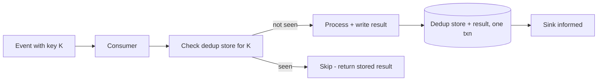

# Dedup and the Idempotent Consumer

## 1. One-Line Definition
An idempotent consumer is one that can safely process the same event more than once — it deduplicates by a stable key so that a redelivered message produces no second side effect — the piece that turns at-least-once delivery into "exactly-once effect" for business state.

## 2. Why Do We Need It?
Every real broker defaults to at-least-once ([[delivery-semantics|Delivery Semantics]]): a consumer that crashes after processing but before acking causes a redelivery, and a timeout after a successful send causes a producer duplicate. So duplicates are not a bug to be eliminated — they are a *guaranteed input*. The choice is whether your sink silently double-charges, double-counts, double-emails (a corruption bug), or your consumer dedups and reruns are harmless. Idempotency is the consumer-side contract that makes "processed again" mean "same result, no new effect."

## 3. Simple Intuition
The ATM with a receipt book: the bank tells the teller to credit "deposit from the wire." If the wire is delivered twice (the courier was unreliable), the teller consults the book of handled deposit IDs. A deposit it has already stamped "done" is skipped — the second delivery produces the second identical receipt, not a second deposit. The book is the dedup store; the deposit ID is the idempotency key.

## 4. What Happens Without It?
A single crash-before-ack rerun double-charges a card, double-increments a counter, double-sends a welcome email, or double-decrements inventory. Bugs with this shape are the most feared in event-driven systems: they are rare, timing-dependent, invisible in happy-path tests, and discovered in production reports weeks later. Adding retries *without* idempotency makes it worse — every retried delivery is another chance to corrupt.

## 5. Core Idea
- **Idempotency key:** the stable business identifier of the event's effect — `(merchant_id, order_id)`, `payment_id`, `(user_id, event_seq)`. It must be deducible from the event alone; it must be stable across redeliveries; it must identify *the effect*, not "attempt number."
- **Dedup store:** a log of keys already processed, plus the result. On arrival: **check key** → seen? return stored result and skip. Not seen? process, then **record key + result**, all atomically with the side effect (single transaction if the sink is a DB; unique constraint if you trust the sink).
- **Atomicity is the crux:** the dedup write and the business write must commit together, or a crash between "saved the key" and "saved the result" produces a lost or repeated effect anyway. Where the sink is a database, one transaction with a unique constraint on the key is the standard. Where the sink is another service, dedup state and the call must still be consistent (transactional outbox or unique-key enforcement).
- **Where dedup can live:** (a) in the consumer DB — a `processed_events` table + unique index; (b) in the sink itself — a unique constraint on the business key makes the sink the final arbiter (physical dedup); (c) in a cache with TTL — fast but only covers a short dedup window (good for short retries, insufficient for full redelivery).
- The ultimate guarantee is the **unique constraint in the sink**, not the consumer's check: even if consumer dedup logic is buggy, a duplicate write fails the constraint (see [[exactly-once-effect|Exactly-Once Effect]]).
- **Producer duplicates** (producer timeout + retry) look identical to consumer redeliveries — they also carry the same key, and the same dedup handles both.

## 6. Important Terminology

| Term | Simple Meaning |
|------|----------------|
| Idempotent consumer | Safe to re-run the same message; repeat produces no new effect |
| Dedup key | Stable identifier of the effect (order, payment, event id) |
| Dedup store | Log of keys already processed (with results) |
| At-least-once | Duplicates are possible — the input this pattern assumes |
| Exactly-once effect | Business state identical whether processed once or twice |
| Unique constraint | Sink-level physical dedup — the final arbiter |
| Processed-events table | Consumer-side log: key + result, committed with the work |
| Replay | Re-feeding historical/deduped events safely because idempotent |

## 7. Basic Architecture



## 8. Request or Data Flow
1. Event `E` with key `K` arrives (first delivery). Consumer queries the dedup store.
2. `K` absent → consumer runs the effect (e.g., insert the order) *and* records `K → result` in the same transaction. If the sink is a different service, the sink's own unique constraint on `K` is the physical dedup and the consumer's record is a convenience.
3. Consumer acks the broker. **Crash window:** if it crashes after the transaction but before the ack, the broker redelivers `E`.
4. Second delivery: `K` now present in the dedup store → consumer looks up and returns the stored result, takes no side effect, acks. Outcome = one effect, two deliveries.

## 9. Practical Example
**Payment capture (assumptions):** 2k tps, timeout-after-send and crash-before-ack both occur daily.
- Event `payment.capture` carries `(merchant_id, order_id)`.
- The capture insert uses a unique primary key on `(merchant_id, order_id)`; a repeat insert raises a duplicate-key error, which the consumer returns as the original stored result.
- On crash-before-ack, the redelivery hits the unique key → no second charge, ack proceeds.
- **Sizing:** dedup state grows ~1 row per successful event; partition it and age out beyond the broker's redelivery window + replay horizon.
- Result: the pipeline stays at-least-once but the *effect* on the ledger is exactly-once — at the cost of a unique index, not a transaction coordinator.

## 10. Scaling
- **Dedup store growth:** rows grow with event volume; shard by key hash and partition by time so old entries retire. TTL-based stores (cache) handle short retry windows but must not cover long replay windows.
- **Fan-out count:** a global dedup DB per consumer group gets hot — partition by key, or move dedup into the sink (unique constraint) where the DB you already sharded enforces it for free.
- **Compound keys at scale:** keep the key small and prefix-able; large keys bloat indexes. Hash the key into a fixed-width column while storing the raw key separately.
- **Consumer group rebalance:** when a partition moves to a new instance, the dedup state must follow — put the dedup store *in the sink's database* or key-partition it so the new owner still finds past keys.

## 11. Reliability and Failure Scenarios

| Failure | What Happens | Detection | Recovery | Trade-off |
|---------|--------------|-----------|----------|-----------|
| Crash between commit and ack | Redelivery → dedup hit | Missing ack signal | Idempotent rerun returns stored result | extra lookup per event |
| Dedup store lost | Keys forgotten | Duplicate effects | Unique constraint saves the ledger | rebuild from sink |
| Dedup store down | Consumer cannot check | Dependency health | Fail-open to sink unique key, or stall | availability vs safety |
| Cache-TTL dedup expires | Duplicate slips through window | Reconciliation job | Widen TTL / use durable store | storage |
| Wrong key (attempt number) | Dedup never matches | Duplicates persist | Fix key definition | — |

## 12. Consistency and Correctness
- **Exactly-once *effect*, not exactly-once delivery:** the broker may still deliver twice; the observable state is unchanged. This is the honest, cheaper version of exactly-once.
- The **sink's unique constraint is the final arbiter** because it dedups physically; consumer-level checks and caches are best-effort accelerators, not the guarantee.
- **Atomicity:** dedup record + side effect must commit atomically (one DB transaction / unique constraint), or the crash window just moves. Never write the dedup key in one operation and the effect in another.
- Reconciliation: run a periodic job comparing events delivered vs effects recorded to catch holes in dedup key selection.

## 13. Performance
- Cost per event: one dedup lookup (index read) + one insert + one unique-constraint check — microseconds-to-low-ms overhead versus the effect itself.
- Idempotency is *far* cheaper than transactional exactly-once: no idempotent producers, no consume-produce transactions; the consumer rides the broker's free at-least-once.
- Beware hot keys: a single entity's replay trains (replay storms) concentrate dedup lookups on one shard, but they also collapse once the unique constraint rejects them, so the cost is bounded.

## 14. Security
- Dedup keys carry business identifiers (`order_id`, `payment_id`) — protect the store, encrypt at rest, never log raw keys, and scope dedup per-tenant so one tenant's events never collide with another's.
- Replay tooling must re-apply authorization per tenant: replaying repaired events is dedup's best friend, and cross-tenant replay is its worst failure mode.
- A dedup store with no access control is a leak of the exact identifiers an attacker would want.

## 15. Trade-Offs

| Choice | Advantages | Disadvantages | When to Use |
|--------|------------|---------------|-------------|
| Sink unique constraint | Physical dedup, no consumer logic | Sink must accept/ignore constraint errors | DB-backed sinks — the default |
| Processed-events table | Explains what ran | Extra table + transactional coupling | Non-unique-key sinks (third-party) |
| Cache + TTL dedup | Fast, cheap | Short window only | Short retries, no long replay |
| No dedup | Simplest | Duplicates corrupt state | Loss-tolerant sinks only |

## 16. Common Mistakes
- Using an *attempt number* or timestamp as the key — every attempt then has a different key and dedup matches nothing.
- Recording the dedup key and the effect in separate transactions — the crash window just moved instead of closing.
- Relying on consumer-side dedup with no unique constraint and assuming it protected — it isn't the final arbiter.
- Cache-only dedup with a TTL shorter than the broker's redelivery window → duplicates slip through.
- Sharing one dedup store across tenants without scoping it per tenant → cross-tenant replay collisions.

## 17. HLD vs LLD Boundary
HLD: which events need idempotency, the idempotency key definition per event (a business decision, not a code one), where dedup lives (sink constraint vs processed-events table vs cache), dedup-store sizing/retention, reconciliation policy. LLD: the unique-index schema, the dedup lookup code, duplicate-key error handling, cache TTL wiring, the reconciliation job.

## 18. Interview Questions

### Beginner
- What does "idempotent consumer" mean and why is it needed?
- Where does the duplicate actually come from?

### Intermediate
- A consumer crashes after committing its work but before acking. What happens, and how does idempotency save the ledger?
- Why is a unique constraint "more final" than a dedup cache?

### Advanced
- Design the dedup layer for a payment pipeline that only talks to a third-party API (no DB constraint available). Where does dedup state live, and how do you make it atomic?
- You replay a week of historical events through a new consumer. What could go wrong, and how does your idempotency survive it?

## 19. Interview Memory Summary

> [!abstract]- Interview Memory Summary

### Remember

- Dedup is required because delivery is at-least-once; duplicates are the expected input.
- The idempotency key identifies the *effect* to a stable business ID — stable, event-derived, never the attempt number.
- Dedup record + side effect must commit atomically (one txn / unique constraint).
- The sink's unique constraint is the final arbiter — consumer checks are accelerators.
- Result = exactly-once *effect* under at-least-once delivery, cheaply.

### 30-Second Explanation

Duplicate deliveries are the contract, so every consumer checks a dedup key derived from the event; on a match it returns the stored result, on a miss it commits the effect and key atomically, and a unique constraint in the sink guarantees that even a buggy check cannot double-apply — turning at-least-once delivery into exactly-once effect at the cost of a keyed lookup.

### Interview Traps

- Keying on attempt number/request id — dedup matches nothing across retries.
- Saving the key and the effect in separate transactions — a new crash window.
- Treating cache dedup as a durable guarantee when its TTL is under the redelivery window.
- Claiming exactly-once *delivery* when you built exactly-once *effect*.

### Key Trade-Off

Idempotency buys a cheap, observable "no double effect" at the cost of a keyed lookup, dedup storage, and the discipline that key + effect commit atomically — paying with one unique index instead of a transaction coordinator.

## 20. Related Concepts

### Prerequisites

- [[delivery-semantics|Delivery Semantics]] — at-least-once is why dedup exists.
- [[transactions-and-acid|Transactions and ACID]] — atomicity of key + effect underlies the pattern.

### Commonly Used Together

- [[delivery-and-retry|Ack and Retry]] — the redelivery loop whose duplicates dedup neutralizes.
- [[outbox-pattern|Outbox Pattern]] — the producer-side guarantee that events are atomic with commits and replayable.
- [[event-sourcing-cqrs|Event Sourcing and CQRS]] — replays are safe precisely because the consumer is idempotent.
- [[exactly-once-effect|Exactly-Once Effect]] — the precise name of what dedup achieves.
- [[request-deduplication|Request Deduplication]] and [[idempotency|Idempotency]] — the same idea at the API boundary (HTTP retries) as here (message retries).

### Alternatives

- Transactional exactly-once machinery ([[kafka-delivery-guarantees|Kafka Delivery Guarantees]]) — stronger but costlier; dedup usually suffices.

Related planned topics (not authored yet): producer-consumer, topics-partitions-offsets.

## 21. References
Fowler, "What Do You Mean by Event-Driven?"; Kleppmann, "Designing Data-Intensive Applications" ch. 11 (at-least-once and idempotency); cloud broker docs (SQS FIFO deduplication, SNS message deduplication); patterns.dev idempotent consumer. Verify current broker dedup features before interview use.

## 22. Active Recall

Test yourself before revealing each answer.

> [!question]- Why is dedup mandatory, not optional, in most pipelines?
> Brokers default to at-least-once: crash-before-ack and timeout-after-send both redeliver, and redelivery is a fact of life. Any consumer whose sink cannot tolerate a double effect is corrupt without dedup. Dedup is what turns "duplicates expected" into "duplicates harmless."

> [!question]- How do you choose the idempotency key?
> It must identify the *effect*, be derivable from the event alone, and be stable across redeliveries. Good: `(merchant_id, order_id)`, `payment_id`. Bad: attempt numbers, timestamps, random request IDs — every retry would carry a fresh key and match nothing.

> [!question]- Why must the dedup write and the effect write be atomic?
> If they are two operations, a crash between "recorded key" and "ran effect" loses the effect forever, and a crash between "ran effect" and "recorded key" lets redelivery rerun it. One transaction (or a sink unique constraint) removes that window.

> [!question]- Why is the sink's unique constraint the final arbiter?
> Because it dedups physically: even if consumer logic checks in the wrong order or a cache expired, a duplicate apply to the sink fails the constraint. Consumer-level dedup is best-effort acceleration; the constraint is the guarantee the ledger is safe.

> [!question]- Interview scenario: the sink is a third-party API with no unique constraint. How do you dedup atomically?
> The consumer's database records the outcome: update an effects table keyed by the business ID within the same transaction as the outbound call record, so "did I already emit this call for key K" and "the call was made" are one commit. On redelivery, the record answers before a second outbound call is made — and you accept the third-party API must itself be idempotent or reconciled for the truly atomic foreign call.

> [!question]- What is the difference between exactly-once delivery and exactly-once effect?
> Delivery is what the broker promises (both drops and duplicates absent — expensive, transactional). Effect is the observable outcome: the ledger is identical whether an event is processed once or twice because dedup neutralizes the second run. Idempotent consumers deliver effect for the price of a keyed lookup.

> [!question]- A replay of a week of events corrupts a read model. Where did idempotency fail?
> Either the key was not stable across the replayed timeline (data changed the key, e.g., order status in the key), the dedup store's retention was shorter than the replay window, or the replay bypassed the dedup path entirely. Replays are idempotency's stress test: the store must live as long as the longest replay horizon and the key must be historical-stable.

> [!question]- Cache-based dedup (Redis, TTL 5 min) vs a processed-events table: when is the cache acceptable and when is it a lie?
> Acceptable only when redelivery happens within the TTL (short, tight retry loops) and you accept a reconciliation job for the tail. It is a lie for full redelivery + replay windows (hours to years) — those need durable, partitionable dedup state keyed to the sink, or the sink's own constraint.

## 23. When Should I Use This?

### Use it when

- Every consumer whose redelivery could double-apply side effects (payments, counters, emissions, inventory).
- The broker or API is at-least-once — which is almost always.
- Replays, backfills, or message re-feeds are part of your operational life.
- You can derive a stable effect key from each event.

### Avoid it when

- The sink is loss-tolerant noise (telemetry counters where ±1 is fine) — dedup overhead is not worth it.
- No stable key exists — you must design one first; dedup without a key is guesswork.
- Exactly-once delivery with a transaction coordinator is genuinely cheaper for a tiny critical stream (rare).

### What problem does it solve?

Redelivery is guaranteed by the platform, so the naive consumer double-applies side effects silently. Idempotency converts "delivered twice" into "applied once": a keyed, atomic dedup makes outcome identical under one or one hundred deliveries.

### What problem does it NOT solve?

It does not eliminate duplicates (delivery stays at-least-once), does not remove the need for atomicity discipline, does not dedup across tenants sharing one store, and if the key is wrong, it does nothing — the bug just moves into your key definition.

## 24. Decision Connections

Decisions that go together with the idempotent consumer:

- [[delivery-semantics|Delivery Semantics]] — the at-least-once contract that creates the duplicates to dedup.
- [[delivery-and-retry|Ack and Retry]] — the redelivery loop whose output dedup must neutralize.
- [[outbox-pattern|Outbox Pattern]] — atomic publish + idempotent consume = dependable pipelines.
- [[exactly-once-effect|Exactly-Once Effect]] — the vocabulary for what this pattern achieves.
- [[transactions-and-acid|Transactions and ACID]] — how key + effect commit atomically.
- [[request-deduplication|Request Deduplication]] and [[idempotency|Idempotency]] — the API-side twins.
- [[event-sourcing-cqrs|Event Sourcing and CQRS]] — replay-heavy consumers live or die by idempotency.

Decision tree:

```
Does this event's consumer have side effects?
    |
    +-- Sink tolerates double application (telemetry, noise)?
    |      → no dedup; keep it cheap
    |
    +-- Double application corrupts state?
    |      → [[delivery-semantics|Delivery Semantics]] is at-least-once
    |         |
    |         +-- Stable effect key derivable from the event?
    |         |      → make the consumer idempotent
    |         |         |
    |         |         +-- DB sink?     → unique constraint (final arbiter) + dedup lookup
    |         |         +-- Other sink?  → processed-events table, atomic with the call record
    |         |         +-- Fast retries only? → cache dedup + reconciliation job
    |         |
    |         +-- No stable key?
    |                → redesign the key first; dedup cannot save a bad one
    |
    +-- Zero duplicates are physically required end-to-end?
           → hedge/dedup is usually enough; reserve transactional exactly-once for the rest
```