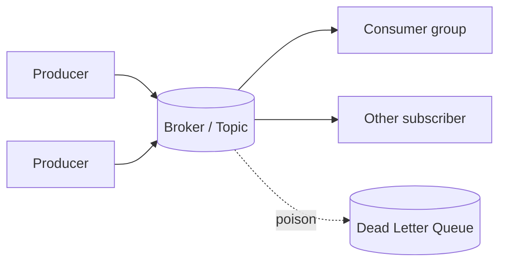

# Message Queue

## 1. One-Line Definition
A message queue is a durable, asynchronous hand-off point: a producer pushes a message, a broker stores it, and a consumer pulls it — decoupling the two in time, load, and lifecycle.

## 2. Why Do We Need It?
Synchronous coupling breaks under load and partial failure: if one service calls another directly, the caller blocks, the callee's slowness becomes the caller's latency, and a dead callee fails every caller. Queues let producers hand off work and move on, smooth traffic bursts, and make components independently scaleable and independently resilient.

## 3. Simple Intuition
A bakery with a ticket machine: the baker never takes orders directly. Customers (producers) take a number and leave; the baker (consumer) works at its own pace through the numbers. The ticket board is the queue. Even if the baker stops, new customers can still place orders (durability), and the baker can hire more staff (scale consumers) without changing the system.

## 4. What Happens Without It?
Point-to-point synchronous calls mean: slow downstream = slow everything; a downstream outage = failed requests everywhere; every traffic spike sits in caller RAM and drops; and components cannot be upgraded or scaled independently. Failures cascade from leaf dependencies upward.

## 5. Core Idea
Core vocabulary:
- **Producer / publisher** — sends the message.
- **Broker / queue** — durable store that accepts, keeps, and delivers.
- **Consumer / subscriber** — reads and processes.
- **Delivery modes:** point-to-point (one consumer gets each message) vs **publish/subscribe** (every subscriber gets a copy).
- **At-least-once vs at-most-once vs exactly-once** — the delivery contract (see [[delivery-semantics|Delivery Semantics]]).
- **Steps around delivery:** acknowledgement (consumer confirms), retry, dead-letter queue (poison messages), visibility timeout (SQS), consumer groups (parallel processing), ordering guarantees per partition.

The payoff: **burst absorption** (queue is elastic buffering), **resilience** (broker holds during consumer outage), **backpressure** (consumer lag signals capacity needs), and **decoupling** (producers/consumers evolve separately).

## 6. Important Terminology

| Term | Simple Meaning |
|------|----------------|
| Message | The unit of work handed off |
| Broker | The durable store + delivery engine |
| Producer / consumer | Sender / assigned processor |
| Topic / queue | The named channel messages live on |
| Partition | Shard of a topic enabling parallelism |
| Offset | Position of a message in a partition |
| Ack | Consumer confirms "handled, done safely" |
| Visibility timeout | Requeue window if consumer died mid-work |
| DLQ | Dead-letter queue for poison messages |
| Consumer lag | How far behind consumers are on production |

## 7. Basic Architecture



## 8. Request or Data Flow
1. Producer sends message → broker appends (durably, per ack config) → producer continues.
2. Consumer polls/pushes; on claiming a message it processes and **acks**.
3. If the consumer dies before ack → visibility timeout → message redelivered (at-least-once).
4. Repeated failures → poison → dead-letter queue for inspection.
5. Consumers scale by adding instances to a **consumer group**.

## 9. Practical Example
**Order service (assumptions):** 10k orders/min spikes at 100k during sales.
- Checkout writes order → publish `order.created`.
- Inventory worker, email worker, analytics worker consume independently at their own rate (email can lag, inventory must be near-real-time).
- Burst at launch: queue absorbs; consumers scale to catch up; email send failure retries, then DLQ.

## 10. Scaling
- **Consumer scaling:** add consumers to a group — each takes a share of partitions/queue.
- **Producer scaling:** producers are independent; broker mediates.
- **Broker scaling:** partitions/topic shards spread load; add brokers for capacity (see [[kafka-architecture|Kafka Architecture]]).
- **Lag = the metric:** consumer lag rising = consumers aren't keeping up — add consumers, or the queue grows unbounded.

## 11. Reliability and Failure Scenarios

| Failure | Happens | Detection | Recovery | Trade-off |
|---------|---------|-----------|----------|-----------|
| Broker down | Messages buffered/queueing stalls | Health | Broker replicas/redelivery | durability vs latency |
| Consumer crash | Messages waits | Lag spikes | Visibility timeout → redeliver | at-least-once dup |
| Poison message | Single message blocks a worker | DLQ fill | Move to DLQ, alert, fix producer | investigation |
| Burst | Queue length grows | Lag metric | Scale consumers | retention cost |

## 12. Consistency and Correctness
At-least-once is the honest default — it means **possible duplicates** at the consumer. Correctness therefore comes from the consumer being **idempotent** (dedup by message/event ID, or process state) or via exactly-once-extended semantics. Never assume "no duplicates because brokers are reliable."

## 13. Performance
- Producer latency: ~ms to broker ack; pick ack level (fire-and-forget vs leader ack vs all-replicas).
- Consumer throughput: parallelism = partitions; skip-scant-heavy consumers.
- Keep payloads small; schemas evolve via Schema Registry (see kafka-schema-registry).

## 14. Security
- TLS between all parties, authN (producers/consumers authenticate), authZ (read/write per topic).
- Encrypted client-side for sensitive payloads; careful with PII in message bodies (no logging).
- DLQs are a sensitive dump — protect and purge them.

## 15. Trade-Offs

| Choice | Advantages | Disadvantages | When to Use |
|--------|------------|---------------|-------------|
| Sync API call | Simple, immediate, correct-ordered | Coupled, no burst buffer | Low latency, low scale |
| Single queue | Simple dedup/per-message | One shared channel, ordering across consumers weak | Simple jobs |
| Topics + partitions | Parallel scale, retention | Ordering only per partition | High-throughput pipelines |
| At-least-once | No loss | Duplicates (idempotency needed) | Default in practice |
| Exactly-once-extended | No dup/loss visible | Complex, slower | Money-adjacent sinks |

## 16. Common Mistakes
- Assuming the broker gives exactly-once for free (it gives at-least-once; dedup is yours).
- Processing messages in parallel without idempotent sinks → duplicates leak into DB/ledgers.
- Ignoring consumer lag until the queue is 5M deep.
- Putting ordering requirements on a queue without per-partition planning.
- Forgetting a dead-letter queue + alerting on it.

## 17. HLD vs LLD Boundary
HLD: which channel per business event, throughput/lag budgets, delivery semantics, retention, DLQ policy. LLD: producer/consumer code, serializer choice, ack handling, retry wrappers.

## 18. Interview Questions

### Beginner
- What does a message queue decouple, exactly?
- What is at-least-once and why does it imply duplicates?

### Intermediate
- A worker crashes mid-message: what happens to the message?
- How do you scale consumers for a single topic?

### Advanced
- Design a queue-based pipeline that loses zero events during a broker outage with RPO 0.
- Why is consumer lag the key metric, and what do rising lags mean for SLOs?

## 19. Interview Memory Summary

> [!abstract]- Interview Memory Summary

### Remember

- Queue = durable async hand-off: decouple time, load, and lifecycle.
- Producer → broker → consumer; at-least-once is the honest default.
- Ack + visibility timeout + DLQ = the reliability loop.
- Partitions + consumer groups = scaling and parallelism.
- Consumer lag is the signal; idempotency is the obligation.

### 30-Second Explanation

Producers fire-and-forget into a durable broker; consumers in groups ack work; duplicates are handled by idempotency; poison messages → DLQ; lag measured and scaled.

### Interview Traps

- "Queues make our system reliable" without naming delivery semantics — the broker's ack level and your idempotency are what actually make it reliable.
- Assuming the broker gives exactly-once for free (it gives at-least-once; dedup is yours).
- Parallel processing without idempotent sinks → duplicates leak into DB/ledgers.
- Ignoring consumer lag until the queue is 5M deep.
- Ordering requirements without per-partition planning.
- Forgetting a dead-letter queue and alerting on it.

### Key Trade-Off

At-least-once delivery guarantees no loss but forces you to handle duplicates — broker ack depth, consumer idempotency, and retention cost are the price of the reliability you get.

## 20. Related Concepts

### Prerequisites

- [[reliability|Reliability]] — the failure-isolation mental model (why a durable hand-off exists) comes first.

### Commonly Used Together

- [[publish-subscribe|Publish/Subscribe]] — the fan-out sibling; a broker often runs both queue and topic semantics.
- [[event-driven-architecture|Event-Driven Architecture]] — the architectural style queues enable.
- [[delivery-semantics|Delivery Semantics]] — the contract defining at-least-once/at-most-once/exactly-once.
- [[outbox-pattern|Outbox Pattern]] — reliably publishing from a DB write so no event is lost.
- [[consumer-lag|Consumer Lag]] — the health metric for a queue's throughput.

### Alternatives

- [[http-and-https|HTTP and HTTPS]] — a direct synchronous call instead of a broker hop (simple, but coupled and no burst buffer).

### Advanced Concepts

- [[kafka-architecture|Kafka Architecture]] — the industrial-grade topic/partition implementation of these ideas.
- [[kafka-delivery-guarantees|Kafka Delivery Guarantees]] — how ordering, acks, and exactly-once are realized in a real broker.

Related planned topics (not authored yet): none.

## 21. References
Broker docs (Kafka, RabbitMQ, SQS) — verify delivery/acks with current docs.

## 22. Active Recall

Test yourself before revealing each answer.

> [!question]- What exactly does a message queue decouple?
> Time (producer hands off and moves on; consumer works later), load (bursts are absorbed in the broker's buffer), and lifecycle (producers and consumers can be deployed, scaled, and failed independently). A direct sync call couples all three.

> [!question]- What is at-least-once and why does it imply duplicates?
> A consumer that dies after processing but before acking causes redelivery after the visibility timeout; combined with background retries, the broker can deliver a message more than once. At-least-once means no loss but possible duplicates — the consumer must be idempotent (dedup by event ID) to stay correct.

> [!question]- A worker crashes mid-message. What happens to the message?
> The worker never acks, so after the visibility timeout the broker considers the message unclaimed and redelivers it (at-least-once). If it keep failing → poison message → dead-letter queue for inspection while the rest of the queue moves on.

> [!question]- How do you scale consumers for a single topic?
> Put consumers into a consumer group that shares the topic's partitions: each instance owns a subset of partitions and processes independently, so throughput grows with members. Parallelism is bounded by partition count — more consumers than partitions add no throughput.

> [!question]- Why is consumer lag the key metric and what do rising lags mean for SLOs?
> Lag = producer rate minus consumer rate; rising lag means consumers can't keep up, so end-to-end pipeline latency grows toward the SLO breach and the queue's retention/disk climbs. Respond by scaling consumers (or reducing work) before the backlog becomes days.

> [!question]- What is the reliability loop around delivery?
> Consumer acks confirm safe processing; a missing ack triggers the visibility timeout and redelivery; repeated failures route the message to a dead-letter queue. This loop — not the broker alone — is what makes a queue reliable.

> [!question]- Interview scenario: build a queue-based pipeline that loses zero events during a broker outage with RPO 0.
> Don't fire-and-forget on outages: use a locally durable publication path such as the [[outbox-pattern|Outbox Pattern]] (event written atomically with the DB change) plus a broker configured for leader+replica acks, and consumers that are idempotent, so no event is lost on either side of the broker while still tolerating duplicates.

> [!question]- When would you choose a direct synchronous HTTP call instead of a queue?
> When latency must be minimal, the call must return the result immediately, scale is low, and coupling is acceptable. A queue adds broker latency, can't return a direct result, and introduces ordering/retry complexity — the queue wins only when decoupling and burst absorption matter more.

## 23. When Should I Use This?

### Use it when

- Producers must not block on downstream processing (async hand-off).
- Traffic bursts need buffering so slow consumers don't shed load.
- Components must scale and evolve independently.
- You need durable retention through consumer outages.
- One event feeds many independent downstream jobs (see [[publish-subscribe|Publish/Subscribe]]).

### Avoid it when

- A request must synchronously return a result (use direct calls).
- Scale is tiny and adding a broker is pure operational overhead.
- You need strong ordering across a whole topic without partition planning.
- The team can't build idempotent consumers — duplicates will corrupt sinks.
- Exactly-once semantics are required with less complexity than an exactly-once-extended broker.

### What problem does it solve?

A synchronous call chain is the bottleneck: downstream slowness becomes caller latency, downstream outage fails callers, spikes live in caller RAM and drop, components can't scale independently. A durable broker acts as the buffer and hand-off point — burst absorption, resilience, backpressure, and decoupling.

### What problem does it NOT solve?

It does not guarantee exactly-once on its own (you must be idempotent), does not deliver global ordering, does not remove the need to monitor and scale consumers, and does not fix duplicate data leaks into non-idempotent sinks.

## 24. Decision Connections

Decisions that go together with the message queue:

- [[publish-subscribe|Publish/Subscribe]] — choose queue (one handler) vs topic (every subscriber) per event contract.
- [[event-driven-architecture|Event-Driven Architecture]] — the queue is the transport of the event-driven style.
- [[delivery-semantics|Delivery Semantics]] — sets the at-least-once/at-most-once/exactly-once contract for the broker.
- [[consumer-lag|Consumer Lag]] — the SLO/metric that governs autoscaling consumers.
- [[outbox-pattern|Outbox Pattern]] — guarantees the publish side never loses an event.
- [[kafka-architecture|Kafka Architecture]] — the concrete broker choice when throughput and partitions matter.
- [[reliability|Reliability]] — queues are a reliability tool: failure containment and durable hand-off.

Decision tree:

```
Service B must do work after service A?
    |
    +-- Must return the result synchronously?
    |      → direct call ([[http-and-https|HTTP and HTTPS]])
    |
    +-- Async acceptable/required?
    |      → [[message-queue|Message Queue]]
    |         |
    |         +-- One handler per message?      → point-to-point queue
    |         +-- Every subscriber needs it?    → [[publish-subscribe|Publish/Subscribe]]
    |         +-- Must survive outages?         → durable broker + [[outbox-pattern|Outbox Pattern]]
    |         +-- Adding consumers to catch up? → consumer groups; watch [[consumer-lag|Consumer Lag]]
    |
    +-- Downstream is slow/flaky?
           → queue absorbs burst; keep consumers idempotent (at-least-once)
```