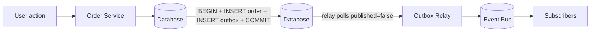

# Outbox Pattern (Transactional Messaging)

## 1. One-Line Definition
The outbox pattern guarantees that "write to my database" and "publish this event" happen together by writing the event into the same transaction as the state change, then a separate relay publishes it to the broker — so you never emit an event for a state that didn't commit, and never lose one for a state that did.

## 2. Why Do We Need It?
When your service writes `order` to its database and then calls the broker, those are two separate operations. If the DB commit succeeds but the publish crashes or times out, you've made a state change with **no event**. If you publish first and the DB fails, you've emitted an event for a change that never happened. Both corrupt the event-driven system (disjoint DB and message bus). The outbox makes the two writes one atomic unit and turns the publish into a retryable background task.

## 3. Simple Intuition
A musician must both *record the song* and *put the CD in the mail* to subscribers. Doing them as two separate steps is dangerous: post first, then crash before recording → you mailed CDs for a song you never kept (the DB and bus disagree). The outbox is a "pending shipments" table in the same notebook as the recording: recording the song and adding "ship this to subscribers" to the same page happens in one pen-stroke (one transaction). A slow, reliable delivery clerk (the relay) comes along later, sees pending entries, and mails the CDs — even if he crashes, the list is still in the notebook.

## 4. What Happens Without It?
Two-write disaster modes:
- DB write succeeds, publish fails/timeouts → subscribers never hear about the change; the ledger and the bus disagree forever.
- Publish succeeds, DB write fails → phantom events; subscribers react to changes that don't exist.
Both are silent, hard to detect, and undermine every guarantee (delivery semantics, sagas, read models) you built on the bus.

## 5. Core Idea
- **One transaction writes both:** 
  ```
  BEGIN;
    INSERT INTO orders (...) VALUES (...);
    INSERT INTO outbox (event_id, topic, payload) VALUES (...);
  COMMIT;
  ```
  The outbox table is a queue *in your own database*, sharing the exact fate of the state change.
- **A relay (poller/CDC) reads the outbox and publishes:** it marks rows as published (or deletes them) only after the broker acks. If it crashes mid-way, the un-published rows are still there to retry — at-least-once delivery, but *never* loss, and *never* phantom events.
- **Two relay styles:**
  - *Poller:* a worker SELECTs un-published rows periodically (simple, adds DB read load, up to ~1s+ latency).
  - *CDC (change data capture, e.g., Debezium):* tails the DB transaction log → stream to the broker. Lower latency and load, but needs log-level tooling.
- **Ordering caveat:** events are published roughly in transaction order, but processing at the consumer is still only as ordered as the broker guarantee (per-partition).

## 6. Important Terminology

| Term | Simple Meaning |
|------|----------------|
| Outbox table | A queue stored inside your own DB |
| Relay / dispatcher | Publishes outbox rows to the broker |
| Dual write | The two-step DB+broker problem |
| CDC | Change Data Capture: tailing DB logs to emit events |
| Poller | A worker that periodically scans un-published rows |
| Published flag | Marks rows already handed to the broker |
| Transactional outbox | DB commit + event write in one transaction |

## 7. Basic Architecture



## 8. Request or Data Flow
1. Order service receives request → one transaction inserts the order *and* an outbox row (`status = pending`).
2. Relay polls `outbox WHERE published = false` (or tails the CDC log).
3. Relay publishes each row to the topic; on broker ack it marks the row published/deletes it.
4. Relay crash → query returns the same rows next run → at-least-once (consumers stay idempotent).
5. Order never commits → no outbox row → no phantom event.

## 9. Practical Example
**Order service + email + loyalty (assumptions):** 3k orders/min, must not double-email or drop loyalty credits.
- Transaction: insert `orders`, insert `outbox(order.confirmed, order_id)`.
- Relay publishes to `order.confirmed`; email and loyalty consume (idempotently, per delivery-semantics).
- A relay crash mid-flow delays emails by <1 minute; nothing is lost or duplicated at the source. Compare with the naive version where a broker timeout after commit silently lost 0.1% of confirmations — users got charged but no email, and support piled up.

## 10. Scaling
- **Outbox table grows with throughput:** partition/archive consumed rows, or move consumed rows to archive and keep the hot table small. Index `(published, created_at)` for the poller.
- **Relay scales horizontally** — multiple instances must not double-publish the same row: use `SELECT ... FOR UPDATE SKIP LOCKED` (Postgres) or lease-based claiming, or rely on CDC which has single-reader semantics per partition.
- **Latency vs load:** poller frequency tightens freshness but adds DB queries; CDC gives ~ms freshness with infrastructure cost.
- **The outbox becomes a write-amplifier on your primary DB** — at very high volume, prefer CDC or a dedicated queue when a true queue is acceptable and atomicity can be deferred.

## 11. Reliability and Failure Scenarios

| Failure | Happens | Detection | Recovery | Trade-off |
|---------|---------|-----------|----------|-----------|
| Relay crashes | Publish halts | Outbox backlog metric | Restart, resume | freshness delay |
| Broker down | Rows stay pending | Publish errors | Retry on backoff | retention of outbox rows |
| Duplicated row claim | Double publish | Consumer dedup | Idempotent consumers | at-least-once |
| Outbox table grows | Poller slows | Table size metric | Archive/partition | hot-table management |
| DB unavailable | Nothing writes | App alerts | Standard DB HA | — |

## 12. Consistency and Correctness
The outbox gives **source-level atomicity**: state and event agree at write time. End-to-end it's still at-least-once (the relay retries), so consumers must stay idempotent. It also gives you *near-ordered* emission in commit order, but not strict global ordering once it crosses the broker. It is the standard replacement for 2PC when you need one DB and a broker to agree without distributed transactions.

## 13. Performance
- Extra cost: one insert (outbox) per transaction + poller/CDC read load. Cheap in DB terms (indexed insert).
- Poller freshness is your tuning knob: 100ms poll = ~100ms publish latency; CDC logs read near dbms-native speed.
- Watch write amplification on the hot outbox table and compaction/archival; this is the classic outbox scaling pain.

## 14. Security
- Outbox payloads mirror your business data — encrypt at rest, restrict relay/DBA access, and don't log payloads in relay logs.
- The outbox is a sensitive audit trail (it's literally "every change, waiting to be read") — tie it to the same retention/access rules as the source tables, and never treat it as disposable scratch space for secrets.

## 15. Trade-Offs

| Choice | Advantages | Disadvantages | When to Use |
|--------|------------|---------------|-------------|
| Naive dual write | Simple to code | Lost/phantom events | Never for correctness-critical flows |
| Transactional outbox (poller) | Atomic by construction, simple | Poll latency, DB load | Default for single-DB services |
| Outbox via CDC | Low latency, no poll load | Infra maturity, log-based | High volume, low-latency needs |
| Distributed transaction (2PC) | Strong synchrony | Fragile, locks, complexity | Almost never; outbox wins |
| Local table-as-queue | Same as outbox | No publish semantics | When no broker exists yet |

## 16. Common Mistakes
- Claiming the outbox removes *all* duplicates — it removes loss and phantoms; delivery is still at-least-once.
- Running multiple relay instances without row-claiming → duplicate publishes (fix with SKIP LOCKED/leases or CDC).
- Never cleaning the outbox table → polling scans get slower forever.
- Publishing before commit or polling a row that's not yet committed's-worthy (isolation: poll only after commit visibility).
- Using a second transaction to mark "published" (that re-introduces the dual-write problem at a second level) — delete/mark under the same relay's lease.

## 17. HLD vs LLD Boundary
HLD: choose outbox vs CDC vs native transaction for atomic emit, define freshness/RPO, decide cleanup/archival, reader conflict strategy. LLD: the SQL, the relay loop, SKIP LOCKED/lease code, CDC connector config, idempotency keys.

## 18. Interview Questions

### Beginner
- What problem does the outbox pattern solve?
- Why can't we just write to the DB and then publish the event?

### Intermediate
- Walk through a crash: DB commits, relay dies. What happens to the event? When does it get published?
- Polling vs CDC relay: how do you choose?

### Advanced
- Design the outbox for 50k ops/sec on Postgres — indexing, relay scale-out, and cleanup strategy.
- How does the outbox interact with exactly-once claims, and where does it fall short?
- Compare outbox vs 2PC for guaranteeing DB + event-bus consistency in a payments flow.

## 19. Interview Memory Summary

> [!abstract]- Interview Memory Summary

### Remember

- Write state + event in one DB transaction — atomic by construction.
- A relay (poller or CDC) publishes pending rows after commit.
- It kills loss and phantom events; delivery stays at-least-once.
- Scale via SKIP LOCKED / leases, or switch to CDC; keep the hot table clean.
- The natural answer to "how do I atomically write a DB and emit an event?"

### 30-Second Explanation

The outbox is a queue in your own transaction; a relay drains it to the bus, giving source-level atomicity and retryable, never-lost, never-phantom events.

### Interview Traps

- Ending the outbox explanation at "we publish from the DB" and skipping how you move rows (poll vs CDC) and stop duplicate relay claims — those are exactly what the interviewer nudges next.
- Claiming the outbox removes *all* duplicates — it removes loss and phantoms; delivery is still at-least-once.
- Running multiple relay instances without row-claiming → duplicate publishes (fix with SKIP LOCKED/leases or CDC).
- Never cleaning the outbox table → polling scans get slower forever.
- Marking rows published in a second transaction (re-introduces the dual-write problem at a second level).

### Key Trade-Off

You get source-level atomicity — no lost or phantom events — at the cost of write amplification on your primary DB and still-at-least-once delivery downstream; the freshness/load dial is polling latency versus CDC infrastructure.

## 20. Related Concepts

### Prerequisites

- [[transactions-and-acid|Transactions and ACID]] — the atomicity mechanism the whole pattern depends on.

### Commonly Used Together

- [[event-driven-architecture|Event-Driven Architecture]] — the outbox is how EDA services publish reliably from a DB write.
- [[delivery-semantics|Delivery Semantics]] — the source-level guarantee pairs with the broker contract (still at-least-once end to end).
- [[message-queue|Message Queue]] — the transport the relay hands events to.
- [[consumer-lag|Consumer Lag]] — relay/outbox backlog is measured with the same offset lens.

### Advanced Concepts

- [[database-replication|Database Replication]] — CDC relays tail the transaction/replication log rather than polling.
- [[kafka-producers-consumers|Kafka Producers and Consumers]] — the relay as a producer: acks and idempotency matter at scale.

Related planned topics (not authored yet): none.

## 21. References
Debezium/CDC docs, PostgreSQL `FOR UPDATE SKIP LOCKED` docs, Fowler/Brandur outbox essay, Confluent outbox-connector docs. Verify current connector behavior before interview.

## 22. Active Recall

Test yourself before revealing each answer.

> [!question]- What problem does the outbox pattern solve?
> The dual-write problem: a DB commit and a broker publish are two separate operations, so you can get a committed change with no event (lost event) or an event with no committed change (phantom event). The outbox writes both in one transaction, so the state and the event share the exact same fate.

> [!question]- Why can't we just write to the DB and then publish the event?
> Because they're two operations with two outcomes. If the commit succeeds and the publish crashes/times out, the change exists with no event and the bus disagrees with the DB forever. If you publish first and the DB fails, consumers react to something that never happened. No ordering of the two steps avoids both failure modes — only atomicity does.

> [!question]- Walk through a crash: DB commits, relay dies. What happens to the event, and when does it get published?
> The outbox row was committed with the state change, so it's durable. The relay crash only halts publishing; on restart the relay queries un-published rows again and publishes them. Nothing is lost — only freshness delays. If the relay also dies mid-publish-ack, the broker may have the message and the row replays anyway → at-least-once → consumers stay idempotent.

> [!question]- Polling vs CDC relay: how do you choose?
> Poller: a worker periodically SELECTs un-published rows — simple, no extra infra, but adds DB read load and ~poll-interval latency (e.g., 100ms poll → ~100ms publish). CDC: tails the transaction log (Debezium) → millisecond freshness and no polling load, but needs log-level tooling and operational maturity. Choose by freshness requirement and infrastructure appetite.

> [!question]- How do you run multiple relay instances without double-publishing the same row?
> Claim the rows so only one instance handles each: `SELECT ... FOR UPDATE SKIP LOCKED` on Postgres, or lease-based claiming that marks the row as being processed. CDC gives single-reader semantics per partition natively. Without claiming, two relays publish the same events → duplicates at the consumer.

> [!question]- Why is the outbox still at-least-once even though it removes loss and phantoms?
> The relay can crash after the broker acks but before marking the row published, so a row can be published twice. End-to-end delivery is therefore at-least-once: no loss, no phantom, but possible duplicates — which is why consumers must keep their idempotency keys while the outbox removes the source-side corruption.

> [!question]- Interview scenario: design the outbox for 50k ops/sec on Postgres — indexing, relay scale-out, and cleanup.
> Index `(published, created_at)` so the poller scans a tiny window. Scale relays horizontally with SKIP LOCKED/lease claiming (or switch to CDC). Archive or delete consumed rows continuously so the hot table stays small — a growing outbox makes every poll slow (the classic scaling pain). Fresher polling tightens the loop at the cost of more DB queries.

> [!question]- Compare outbox vs 2PC for guaranteeing DB + event-bus consistency in a payments flow.
> 2PC gives strong synchrony but is fragile: locks, complexity, and availability cost make it wrong for most flows. The transactional outbox replaces it: one local transaction gives atomicity "for free" by construction, the relay publishes asynchronously, delivery is at-least-once, and idempotent consumers close the loop. 2PC wins basically never here.

> [!question]- How does the outbox interact with exactly-once claims, and where does it fall short?
> The outbox protects the *source*: state and event agree atomically. It does not by itself produce exactly-once — the relay can replay rows and the broker delivers at-least-once, so duplicates are possible and consumers must dedup. The message "end-to-end exactly-once" needs the outbox plus idempotent produce and a deduping sink; any side effect outside the transactional boundary is outside the guarantee.

## 23. When Should I Use This?

### Use it when

- A service must write authoritative state and emit an event with both taking effect together.
- You want source-level atomicity without distributed transactions (2PC).
- Zero lost events is a requirement (RPO driven) for an event-driven flow.
- A single relational DB holds the state and can host the outbox table.

### Avoid it when

- The outbox is overkill for fire-and-forget telemetry — a plain queue is fine.
- No broker yet exists and a local table-as-queue has no consumer.
- The primary DB is already at write capacity and every transaction adds another insert (amplification).
- Exactly-once end-to-end is claimed from the outbox alone — the sink and broker contracts still matter.
- A synchronous, fully-consistent DB+broker approach is genuinely required (rare).

### What problem does it solve?

The dual-write is the bottleneck: committing the DB and publishing the event are two operations, so either a committed change loses its event or a published event is a phantom — silently splitting the DB and bus apart. The outbox makes the two writes one transaction and turns publishing into a retryable background task, so source-level atomicity is achieved by construction.

### What problem does it NOT solve?

It doesn't make delivery exactly-once (still at-least-once — consumers stay idempotent), doesn't remove broker-level loss (configure replication/acks separately), doesn't give strict global ordering across partitions, and doesn't come free — it adds an insert per transaction, poll/CDC load, and an outbox table you must keep clean.

## 24. Decision Connections

Decisions that go together with the outbox pattern:

- [[event-driven-architecture|Event-Driven Architecture]] — the outbox is the reliable publish path of every EDA service.
- [[delivery-semantics|Delivery Semantics]] — source atomicity + broker contract define the end-to-end guarantee.
- [[transactions-and-acid|Transactions and ACID]] — the transactional foundation the pattern is built on.
- [[message-queue|Message Queue]] — the transport the relay publishes to, and the alternative when atomicity can be deferred.
- [[consumer-lag|Consumer Lag]] — relay backlog and consumer lag share the same operational dashboard.
- [[database-replication|Database Replication]] — CDC relays consume the replication/transaction log as the data source.
- [[kafka-producers-consumers|Kafka Producers and Consumers]] — relay producer config (acks, idempotency) at scale.

Decision tree:

```
Service must write state AND emit an event?
    |
    +-- Event volume tiny / loss tolerable?
    |      → plain [[message-queue|Message Queue]] publish (accept the window)
    |
    +-- Both must agree (no lost or phantom events)?
    |      → [[outbox-pattern|Outbox Pattern]]
    |         |
    |         +-- Simplicity first, freshness ~100ms+? → poller relay
    |         +-- High volume / ms freshness?          → CDC relay (Debezium)
    |         +-- Multiple relay instances?            → SKIP LOCKED / leases / CDC
    |         +-- Consumers still see duplicates?      → idempotency keys ([[delivery-semantics|Delivery Semantics]])
    |
    +-- Need strong synchrony across DB + broker?
           → 2PC (almost never — outbox wins)
```