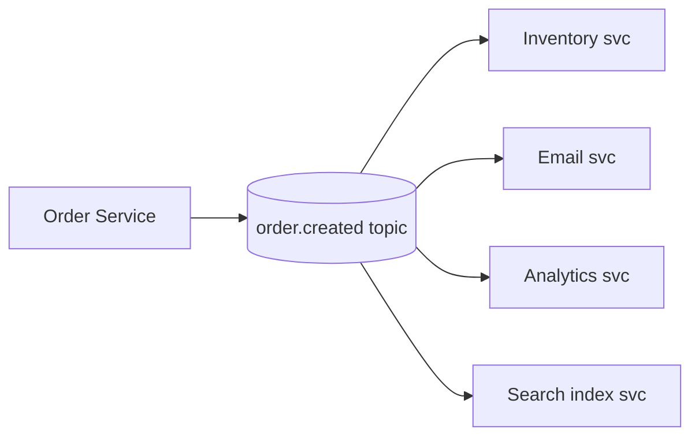

# Publish/Subscribe (Pub/Sub)

## 1. One-Line Definition
Pub/Sub is a messaging pattern where producers publish events to a channel and every subscribed consumer receives a copy — decoupling who produces from who consumes.

## 2. Why Do We Need It?
One producer's event often matters to many consumers: order created → inventory, email, analytics, search-index. Without pub/sub you'd write N calls in the order service (coupling), or a monolithic observer with rebuild churn. Pub/Sub lets each subscriber register independently and consume at its own pace.

## 3. Simple Intuition
A radio station: the station (producer) broadcasts once to the airwaves (channel); every tuned radio (subscriber) hears it independently. Listeners don't tell the station their address; the station doesn't track them; a listener who tunes in late expects no replay (unless the channel is durable/retained).

## 4. What Happens Without It?
New consumers require changing the producer's code or wiring (rigid), a slow consumer blocks the fast one (coupled), and a busy downstream blocks the write path. The event's "send to everyone" needs re-implemented each time another team wants the data.

## 5. Core Idea
- **Publisher** → **topic/channel** → **subscribers** (each gets every message on the channel, unless filtered).
- **vs point-to-point queues:** a queue delivers each message to *one* consumer of a group; pub/sub delivers to *every* subscriber. Kafka uses both: topic (pub/sub) with consumer *groups* (point-to-point within a group).
- **Durability of subscription depth:**
  - *Non-durable:* subscriber must be online (misses while asleep).
  - *Durable (consumer group / broadcast with stored offsets):* messages are retained; subscribers catch up when back (replay from saved offset).
- **Fan-out concerns:** some subscribers are slow — each maintains its own position, so the producer/other subscribers aren't blocked. Filtered/fan-out variants (per-key partitioning, subscription filters) exist for scale.

## 6. Important Terminology

| Term | Simple Meaning |
|------|----------------|
| Publisher / subscriber | Producer / consumer of events |
| Topic / channel | The named broadcast tube |
| Fan-out | One event → many consumers |
| Durable subscription | Retained position; catch-up on resume |
| Consumer group | Multiple instances sharing one subscription's load |
| Event bus | The messaging backbone connecting services |
| Filtered subscription | Only matching events delivered |

## 7. Basic Architecture



## 8. Request or Data Flow
1. Order service publishes `order.created`.
2. Topic retains (durable mode) / fans out.
3. Each subscriber has its own offset → consumes at its own pace → acks.
4. A slow analytics subscriber lags but doesn't affect email's delivery.

## 9. Practical Example
**Social platform (assumptions):** post published → many features.
- Publisher: post service → topic `post.published`.
- Subscribers: feed builder (fan-out to followers), search indexer, recommendation service, moderation scanner, analytics.
- Each scales independently; a moderation lag spikes consumer-lag metric, others unaffected.

## 10. Scaling
- **Consumers scale horizontally** per subscription via consumer groups sharing partitions.
- **Topics scale by partitioning** (ordering per partition, parallelism across).
- **Slow subscribers** don't throttle fast ones (independent offsets). Don't share one group across unrelated consumers.
- Subscriber fan-in: many consumers of one big topic share load by group; add members as lag grows.

## 11. Reliability and Failure Scenarios

| Failure | Happens | Detection | Recovery | Trade-off |
|---------|---------|-----------|----------|-----------|
| Subscriber down | Misses while offline | Group rebalance/offset | Durable offset: catches up | retention window |
| Slow subscriber | Lag grows | Lag metric | Add members | retention filling |
| Producer failure | Events not published | Produce rate alerts | Retry/transactional outbox | at-least-once |
| Topic retention expiry | Old messages gone | — | — | retention vs catch-up |

## 12. Consistency and Correctness
Pub/sub gives **at-least-once by default** (duplicates on retry) → idempotent consumers. Ordering: per-partition/per-key only. Any *cross-partition* global order assumption is false — check your event 'ordering needs'.

## 13. Performance
- Publish latency to broker ack: ms. 
- Subscription scale: partition count bounds parallelism (consumers ≤ partitions).
- Payload size × subscriber count = fan-out amplification — encode compactly; don't fan out fat payloads to all.

## 14. Security
- Topic-level ACLs (producer/writer vs subscriber/read); mTLS between services.
- Sensitive event fields: either encrypt or filter subscribers by schema-permission; log redaction.
- Never let one subscriber's visibility extend broker retention of PII.

## 15. Trade-Offs

| Choice | Advantages | Disadvantages | When to Use |
|--------|------------|---------------|-------------|
| Direct service calls | Simple | Coupling, fan-out tax at caller | Point-to-point, low scale |
| Queue (point-to-point) | One handler | No multi-consumer | Single-job pipelines |
| Pub/Sub | Independent fan-out | Ordering only per key/partition | Multi-subscriber events |
| Durable subscription | Late-join catch-up | Retention cost | New analytics subscriptions |
| Non-durable | No retention cost | Misses while offline | In-memory fan-out |

## 16. Common Mistakes
- Treating all subscribers as equal-latency (a slow one crowds retention/lag SLOs).
- Using one consumer *group* for unrelated workloads (they split partitions and starve each other).
- Assuming global ordering across partitions.
- Forgetting that every subscriber pays the retention/message-size bill.
- Building "pub/sub" as a synchronous fan-out (that's just a list of calls).

## 17. HLD vs LLD Boundary
HLD: topics/event contracts, subscription topology, durability, retent. LLD: producer/consumer code, serializer, per-subscriber handler wiring.

## 18. Interview Questions

### Beginner
- What's the difference between a queue and a topic in pub/sub?
- Why does a slow subscriber not slow the producer?

### Intermediate
- Fan-out to 5 services: walk durability if one is offline for an hour.
- How does Kafka's consumer group turn pub/sub into work sharing?

### Advanced
- Design a pub/sub backbone for a marketplace where ordering matters but fan-out is huge.
- How do you prevent a poison event from killing every consumer of a topic?

## 19. Interview Memory Summary

> [!abstract]- Interview Memory Summary

### Remember

- Publish once → every subscriber gets a copy.
- Topic = broadcast; consumer group = load-split within a subscription.
- Durable subscriptions allow catch-up after downtime.
- At-least-once delivery ⇒ idempotent consumers.
- Ordering is per-partition (per-key) only.

### 30-Second Explanation

One topic, many independent subscriptions; each consumer group scales itself; durable offsets handle downtime; lag is the health metric.

### Interview Traps

- Claiming strict global order with pub/sub — only per-partition order exists; plan keys accordingly.
- Treating all subscribers as equal-latency (a slow one crowds retention/lag SLOs).
- Using one consumer group for unrelated workloads (they split partitions and starve each other).
- Assuming global ordering across partitions.
- Forgetting every subscriber pays the retention/message-size bill.
- Building "pub/sub" as a synchronous fan-out — that's just a list of calls.

### Key Trade-Off

Pub/Sub buys independent fan-out and per-subscriber pace at the cost of fan-out amplification (payload × subscribers), retention costs per subscriber, and ordering that is strictly per partition — a slow subscriber never blocks others but always spends storage.

## 20. Related Concepts

### Prerequisites

- [[message-queue|Message Queue]] — pub/sub is a delivery mode layered on the queueing primitive.

### Commonly Used Together

- [[event-driven-architecture|Event-Driven Architecture]] — pub/sub is the communication fabric of the event-driven style.
- [[delivery-semantics|Delivery Semantics]] — the per-subscriber safety contract behind retries and duplicates.
- [[consumer-lag|Consumer Lag]] — the per-subscription health metric for scaling.
- [[kafka-architecture|Kafka Architecture]] — partitions + consumer groups realize pub/sub at scale.

### Alternatives

- [[http-and-https|HTTP and HTTPS]] — synchronous manual fan-out in the caller (couples producer to every consumer).
- [[message-queue|Message Queue]] — point-to-point, when exactly one handler per message is the contract.

### Advanced Concepts

- [[kafka-ordering|Kafka Ordering]] — how per-partition ordering constrains what pub/sub can promise.
- [[kafka-rebalancing|Kafka Rebalancing]] — what happens to subscriptions when group membership changes.

Related planned topics (not authored yet): none.

## 21. References
Broker pub/sub docs (Kafka, RabbitMQ exchanges, GCP Pub/Sub). Verify current features.

## 22. Active Recall

Test yourself before revealing each answer.

> [!question]- What's the difference between a queue and a topic in pub/sub?
> A queue delivers each message to exactly one consumer in a group (work sharing); a topic delivers every message to every subscriber (broadcast). Kafka models both: a topic for pub/sub, and consumer groups that make a topic behave point-to-point within each group.

> [!question]- Why does a slow subscriber not slow the producer?
> Because each subscriber tracks its own position (durable offset): the slow one simply lags behind while the producer and other subscribers proceed. The producer only waits for the broker ack, not for any consumer's progress.

> [!question]- How does Kafka's consumer group turn pub/sub into work sharing?
> A consumer group partitions the topic: each member owns a subset of the partitions and reads them exclusively, so the group splits the load across members while the topic still serves other groups. More members than partitions give no extra throughput.

> [!question]- Fan out `post.published` to feed builder, search, moderation, analytics. One subscriber is offline for an hour. Walk durability.
> With a durable subscription, the offline service's offset is retained, messages are kept for the retention window, and on return it replays from the saved offset — catching up without affecting the others. Only a non-durable subscription misses events while asleep.

> [!question]- Why is "global ordering across partitions" a false assumption?
> Order is guaranteed per partition (per key) because each partition is appended serially and read by one consumer. Across partitions there is no total order — so any consumer that dips into the whole topic must not assume event A happened before B unless the key keeps them in one partition.

> [!question]- How do you prevent a poison event from killing every consumer of a topic?
> A poison message can wedge whichever consumer holds its partition. Route repeated failures to a dead-letter queue and alert, purge problematic payloads, and segment risk so one bad event (or a whole partition) is isolated from the rest of the fan-out.

> [!question]- Interview scenario: design a pub/sub backbone for a marketplace where ordering matters but fan-out is huge.
> Partition by the entity where order matters (e.g., order_id so a single order's events stay in one partition), keep consumers in their own groups so each scales independently, use durable subscriptions for catch-up, and route anything that breaks per-key ordering (global dashboards) to a separate stream — ordering is per-key, so key everything that needs order.

> [!question]- Topic retention is 7 days and an analytics subscriber is 10 days behind. What do you offer?
> The offset is beyond the retention horizon, so the broker can no longer replay and the subscription is effectively lost. Options: compute the delta from the analytics source or a snapshot, extend retention for that subscription's needs, or accept that this subscription must replay from a checkpoint — demonstrating you understand retention vs catch-up trade-off.

> [!question]- When is point-to-point (a queue) the right choice instead of pub/sub?
> When exactly one team/handler should process each message — e.g., a job queue where work must not be duplicated across handlers. Pub/sub is for events with many independent consumers; a queue is for work each message performs once.

## 23. When Should I Use This?

### Use it when

- One event matters to many independent services (inventory, email, analytics, search).
- Consumers must scale and evolve at different paces.
- New teams must attach to existing events without touching the producer.
- Durable subscription catch-up is required after downtime.
- Fan-out independence matters more than total ordering.

### Avoid it when

- Exactly one handler should process each message — use point-to-point [[message-queue|Message Queue]] semantics.
- Payloads are huge and fan-out count is high (amplification cost dominates).
- You need strict global event ordering (only per-partition ordering exists).
- The system needs a synchronous result — pub/sub is fire-and-forget by design.
- A simple sync call chain still fits the scale.

### What problem does it solve?

N services needing the same event is the bottleneck: without pub/sub the producer writes N calls (coupling) or a monolith of observers owns the fan-out. A topic broadcasts once; every subscriber registers itself, tracks its own position, and consumes at its own pace.

### What problem does it NOT solve?

No global ordering (per-partition only), no synchronous result return, no protection against amplification (payload × subscribers), and no exactly-once guarantee on its own — subscribers still must be idempotent and storage/retention still must be budgeted per subscription.

## 24. Decision Connections

Decisions that go together with publish/subscribe:

- [[message-queue|Message Queue]] — pick the queue vs topic delivery mode per event contract.
- [[event-driven-architecture|Event-Driven Architecture]] — pub/sub is the transport layer of the event-driven style.
- [[delivery-semantics|Delivery Semantics]] — set what duplicates/retries each subscriber will tolerate.
- [[consumer-lag|Consumer Lag]] — the per-subscription metric for autoscaling consumers.
- [[kafka-architecture|Kafka Architecture]] — partitions + consumer groups realize pub/sub at scale.
- [[kafka-ordering|Kafka Ordering]] — partition keys define the only ordering you can promise.
- [[http-and-https|HTTP and HTTPS]] — the synchronous alternative when fan-out is manual and coupled.

Decision tree:

```
One event, multiple interested services?
    |
    +-- Exactly one handler must process it?
    |      → point-to-point [[message-queue|Message Queue]]
    |
    +-- Every subscriber needs a copy?
    |      → [[publish-subscribe|Publish/Subscribe]]
    |         |
    |         +-- Offline catch-up needed?   → durable subscriptions (stored offsets)
    |         +-- Scale consumers?           → consumer groups
    |         +-- Order must hold?           → partition by key, order per partition
    |         +-- Poison events?             → dead-letter route + alert
    |
    +-- Synchronous result needed?
           → direct call ([[http-and-https|HTTP and HTTPS]])
```