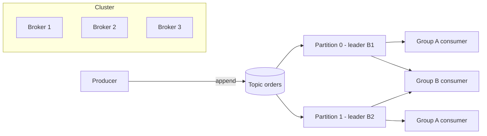

# Kafka Architecture

## 1. One-Line Definition
Kafka is a distributed, partitioned, replicated commit log — producers append events to ordered partitions, brokers store them durably, and consumers read at their own offset, giving a durable, high-throughput, replayable event backbone.

## 2. Why Do We Need It?
Queues and RPCs work for one consumer or small scale, but an event-driven company needs one backbone that: handles millions of events/sec, retains events for replay (new consumers can rebuild state), fans out to many independent consumer groups, and survives broker failures without loss. Kafka was built for exactly that — a central log where every service can read the same stream independently and never loses data.

## 3. Simple Intuition
A shared, append-only ledger on a warehouse wall. Writers (producers) append entries in order to the next blank line; readers (consumers) each keep their own bookmark and can re-read from any earlier line. Adding a new reader costs nothing on the writers. The ledger is copied across several warehouses (brokers) so losing one building doesn't lose the record. Each writer writes to one *column* (partition) to keep per-column order; there are many columns for parallelism.

## 4. What Happens Without It?
Either a plain queue (each message read once → no replay, no multi-group fan-out) or a database used as a bus (arbitrary reads, no ordered append log, poor fan-out). To get replay + fan-out + ordering you'd have to build a durable log, replication, offsets, and consumer groups yourself. Kafka is that log as a product.

## 5. Core Idea
- **Topic:** a named stream (e.g., `orders`). It is split into **partitions** — the unit of parallelism, ordering, and replication.
- **Partition:** an append-only, ordered log. Each message gets a monotonically increasing **offset** within it. Order is guaranteed *within* a partition, not across the topic.
- **Producers** choose a partition (explicit, key-hash, or round-robin) and append. **Consumers** pull, tracking their own **offset** per partition.
- **Consumer groups:** each group reads the whole topic; Kafka distributes partitions across the group's members (work sharing). Different groups are independent (pub/sub fan-out).
- **Brokers** are the servers hosting partitions; **replication** copies each partition to N brokers with one **leader** (reads/writes) and **followers** (copies). See kafka-replication.
- **Metadata/coordination:** a controller broker manages leadership and partition assignment; modern Kafka uses **KRaft** (built-in Raft quorum) instead of ZooKeeper for this.
- **Durability:** offsets let any consumer replay from retention-bounded history; log segments and compaction define how long data lives (kafka-retention).

## 6. Important Terminology

| Term | Simple Meaning |
|------|----------------|
| Broker | A Kafka server storing partitions |
| Cluster | Set of brokers sharing topics |
| Topic | Named stream of events |
| Partition | Ordered shard of a topic (parallelism unit) |
| Offset | Position of a message inside a partition |
| Leader / follower | Partition replica serving I/O / copying it |
| ISR | In-sync replicas eligible to become leader |
| Consumer group | Set of consumers sharing a topic's partitions |
| Controller / KRaft | Cluster metadata coordinator |
| Segment | File chunk of a partition's log |

## 7. Basic Architecture



## 8. Request or Data Flow
1. Producer picks topic `orders`, resolves partition (key hash), sends to that partition's **leader broker**.
2. Leader appends to its log; followers fetch to replicate; leader acks per `acks` config (kafka-delivery-guarantees).
3. Consumer group members fetch from assigned partitions; each commits its offset (or autocommits).
4. Adding a consumer triggers a rebalance; adding a new group reads the same events from offset 0 (or latest).

## 9. Practical Example
**Order events backbone** (assumptions): 100k events/sec peak, 6 downstream systems.
- Topic `orders` = 24 partitions; key = `order_id` → same order's events land on one partition → per-order order.
- Consumer groups: fulfillment, notifications, analytics, search, risk, audit — each independent, each at its own offset.
- Search rebuild: deploy new consumer group with `auto.offset.reset=earliest` → replays 7 days from retention and catches up. No producer changes, no data loss.

## 10. Scaling
- **Writes:** more partitions/topics spread across brokers; broker count adds capacity.
- **Reads:** add consumers to a group (up to partition count); each partition is read by one member per group.
- **Partitions are the ceiling** — parallelism, and ordering unit. Repartitioning later is costly (key remapping → ordering breaks), so size with headroom at design time.
- **Retention vs disk:** more retention = more storage; add brokers/disks.

## 11. Reliability and Failure Scenarios

| Failure | Happens | Detection | Recovery | Trade-off |
|---------|---------|-----------|----------|-----------|
| Broker down | Leaders move to replicas | Controller/health | Automatic leader election | ISR shrink, ack latency |
| Follower lags | Not in ISR | ISR metrics | Catch up, rejoin | durability if too few ISR |
| Producer timeout | Retry/duplicate | Producer metrics | Idempotent producer, retries | at-least-once |
| Consumer stuck | Lag grows | Lag metrics | Rebalance, DLQ | availability of group |
| Disk full | Write failures | Disk alerts | Add brokers, retention tuning | retention reduction |

## 12. Consistency and Correctness
Kafka gives **per-partition ordering** and configurable durability. With `acks=all` + `min.insync.replicas` it writes to enough replicas to survive failures (no loss); with `acks=1` or `0` it can lose on failover. Consumer-side, it's at-least-once by default → idempotent consumers, or use idempotent producer + transactions for exactly-once *within Kafka*. Reads are served by the leader (by default) so consumers see committed, ordered data per partition.

## 13. Performance
- **Sequential disk I/O:** append-only logs + OS page cache make Kafka fast (disk is not the bottleneck; it's throughput-oriented).
- **Batching + compression:** producers batch (linger.ms, batch.size); compression (lz4/zstd/snappy) cuts bytes and disk.
- **Zero-copy:** broker sends from page cache directly to socket.
- **Throughput knob:** partition count × per-partition throughput; too many partitions adds overhead (latency, metadata, memory).

## 14. Security
- TLS for transport; SASL/SCRAM or mTLS for client auth; ACLs per topic/group (who may produce/consume).
- Encryption at rest via disk/broker config; sensitive event fields client-side encrypted.
- Audit log for admin ops; quotas to stop one tenant flooding the cluster.

## 15. Trade-Offs

| Choice | Advantages | Disadvantages | When to Use |
|--------|------------|---------------|-------------|
| Kafka log | Durable, replayable, fan-out | Ops complexity, no per-message ack/TX to external sinks | Event backbone, streams, CDC |
| Classic queue (SQS/Rabbit) | Simple, per-message DLQ/visibility | No replay/fan-out of same stream | Task queues, simple work |
| Database as bus | Transactional with state | No ordered log, scaling pain | Tiny scale only |
| More partitions | More parallelism | Rebalance/metadata overhead | High throughput |
| Fewer partitions | Lower overhead | Parallelism ceiling | Low/medium scale |

## 16. Common Mistakes
- Treating Kafka as a database with random access — it's a log; design for sequential reads and keys.
- Assuming topic-wide ordering (only per-partition order exists).
- Too few partitions → can't scale consumers; too many → rebalance and overhead pain.
- Ignoring consumer lag and retention interaction (silent data loss).
- Using Kafka for request/reply RPC where a queue or HTTP fits better.

## 17. HLD vs LLD Boundary
HLD: topic/partition design, key strategy, replication/acks, retention, consumer group topology, cluster sizing. LLD: producer configs (batching, compression), serde, offset commit strategy, rebalance listeners, ACLs.

## 18. Interview Questions

### Beginner
- What is a partition and why does Kafka need it?
- How does a consumer group differ from a pub/sub subscriber?

### Intermediate
- How does Kafka give ordering, and what's the limit of that guarantee?
- `acks=all` vs `acks=1`: walk through the failure each protects against.

### Advanced
- Design partition count and key strategy for an order stream with 100k events/sec and per-user ordering needs.
- How do you rebuild a search index from Kafka with zero producer changes, and what retention do you need?
- Where does Kafka's exactly-once guarantee end, and what do you still handle downstream?

## 19. Interview Memory Summary

> [!abstract]- Interview Memory Summary

### Remember

- Kafka is a partitioned, replicated commit log — the durable event backbone.
- Order and parallelism are per partition, never topic-wide.
- Consumer groups share partitions across members; different groups are independent (pub/sub fan-out).
- Durability is governed by acks / ISR / replication factor.
- Offsets + retention enable replay from any point.
- Example worth keeping: order stream keyed by order_id, plus the search-rebuild-from-retention replay.

### 30-Second Explanation

Topics split into partitions; producers append to leaders; replicas follow; consumer groups pull at their own offsets; ordering is per partition, durability is per ack/ISR config.

### Interview Traps

- Claiming topic-wide (global) ordering — only per-partition order exists.
- Claiming "exactly-once everywhere" — exactly-once holds only within Kafka's transactional boundary.
- Treating Kafka as a database with random access — it is a log; design for sequential reads and keys.
- Under-sizing partitions (parallelism ceiling) or over-sizing them (rebalance/metadata overhead).

### Key Trade-Off

Kafka trades operational complexity and per-partition (not global) guarantees for durable, replayable, high-throughput event fan-out to many independent consumer groups.

## 20. Related Concepts

### Prerequisites

- [[publish-subscribe|Publish/Subscribe]]
- [[event-driven-architecture|Event-Driven Architecture]]

### Commonly Used Together

- [[kafka-cluster|Kafka Cluster]]
- [[kafka-producers-consumers|Kafka Producers and Consumers]]
- [[kafka-replication|Kafka Replication]]
- [[kafka-ordering|Kafka Ordering]]
- [[kafka-retention|Kafka Retention]]
- [[kafka-rebalancing|Kafka Rebalancing]]
- [[delivery-semantics|Delivery Semantics]]

### Alternatives

- [[message-queue|Message Queue]] (classic queue for simple task processing, when replay and multi-group fan-out aren't needed)

### Advanced Concepts

- [[kafka-delivery-guarantees|Kafka Delivery Guarantees]]

Related planned topics (not authored yet): Kafka Streams / stream processing, event sourcing, tiered storage, backpressure, dead letter queues.

## 21. References
Apache Kafka official documentation (design, topics, controller/KRaft). Verify version-specific behavior before interview use.

## 22. Active Recall

Test yourself before revealing each answer.

> [!question]- What is a Kafka partition, and what does it guarantee?
> A partition is an append-only, ordered shard of a topic — the unit of parallelism, ordering, and replication. Each message has a monotonically increasing offset within it. Ordering is guaranteed **within** a partition only, never across a topic.

> [!question]- How does a consumer group differ from a publish/subscribe subscriber?
> A consumer group divides a topic's partitions among its members — each partition is read by exactly one member (point-to-point work sharing within the group). Different groups read the whole topic independently at their own offsets (pub/sub fan-out across groups).

> [!question]- Walk the topic, partition, and key design for 100k events/sec with per-user ordering.
> Topic `orders` with ~24 partitions sized with headroom; key = `order_id` (or `user_id`) so all events for one entity hash to the same partition → per-entity order. One consumer group per downstream system (fulfillment, analytics, search...); parallelism capped at the partition count.

> [!question]- What does `acks=all` protect against that `acks=1` does not?
> `acks=1` only confirms the leader wrote — if the leader crashes before replicas catch up, the tail is lost. `acks=all` requires all in-sync replicas to confirm, so a failover cannot lose the acknowledged tail. You pay extra replication latency for that safety.

> [!question]- A broker dies. What happens to its leader partitions, producers, and consumers?
> The controller (KRaft) detects the loss and elects new leaders from ISR replicas. Producers hit leader-not-available, refresh metadata, and retry; consumers pause briefly then resume from committed offsets (or from the high watermark). No client code change; acks=all guarantees no committed data loss.

> [!question]- How do you rebuild a search index from Kafka without touching producers, and what must be true?
> Deploy a new consumer group with `auto.offset.reset=earliest`; it re-reads the topic from the oldest still-retained offset and rebuilds the index. Must be true: retention covers the rebuild window (old data isn't trimmed yet) and the consumer is idempotent on replay. No producer change and no data loss.

> [!question]- Trade-off: too few vs too many partitions?
> Too few caps consumer parallelism (a partition is read by one member per group) and becomes a throughput ceiling. Too many adds rebalance time, metadata, and per-partition memory overhead. Size with a growth headroom up front because repartitioning later breaks per-key ordering.

> [!question]- Interview scenario: "Kafka gives me exactly-once and global ordering." How do you respond?
> Gently correct both: ordering is per partition only, and exactly-once applies only within Kafka's transactional/read_committed boundary. Past Kafka (a database, HTTP sink, email) you need external idempotency. State the per-partition, at-least-once default and where the extra machinery (idempotent producer, transactions) is required.

> [!question]- Why is Kafka fast despite disk being slow?
> Append-only sequential disk I/O served mostly from the OS page cache, producer batching + compression (bigger writes), and zero-copy transfer from page cache to socket. Throughput then scales with partition count × per-partition throughput.

## 23. When Should I Use This?

### Use it when

- Multiple independent systems must consume the same events at their own pace (fan-out).
- Consumers need to replay history — rebuild a read model, search index, or analytics from the log.
- You need per-key ordering at very high throughput (100k+ events/sec).
- You want a durable buffer that absorbs spikes and survives broker failures without loss.
- You're building an event-driven architecture with many services on one backbone.

### Avoid it when

- The job is a request/reply RPC — a queue or HTTP fits better.
- You need per-message task semantics (visibility timeout, per-message DLQ) — a classic queue fits better.
- Scale is tiny and nobody needs replay or fan-out — Kafka's operational cost isn't justified.
- Consumers need random access / point queries over stored events — Kafka is a log, not a database.
- You require end-to-end exactly-once to external sinks without building idempotency there.

### What problem does it solve?

Event producers needed a durable way to publish high-throughput streams. A single log on one machine was the bottleneck (single disk, single point of failure, no fan-out). Kafka's partitioned, replicated commit log removes it: producers append to leaders, brokers replicate/retain, and independent consumer groups replay at their own offsets — one backbone for the whole company.

### What problem does it NOT solve?

End-to-end exactly-once past Kafka (external sinks need their own idempotency), topic-wide ordering (only per-partition order exists), per-message queue semantics, random-access lookups, and the operational burden of running the cluster itself.

## 24. Decision Connections

Decisions that go together with Kafka architecture:

- [[kafka-cluster|Kafka Cluster]] — brokers, partition count, and replication factor are where the architecture is physically realized.
- [[kafka-producers-consumers|Kafka Producers and Consumers]] — how writers choose partitions/acks and readers commit offsets defines the product's contract.
- [[kafka-replication|Kafka Replication]] — the leader/ISR/acks machinery decides what durability the "durable log" actually means.
- [[kafka-ordering|Kafka Ordering]] — the key choice sets per-entity order and caps parallelism at partition count.
- [[kafka-retention|Kafka Retention]] — defines the replay window every new consumer can rely on.
- [[kafka-rebalancing|Kafka Rebalancing]] — group size vs partition count determines elasticity and churn.
- [[delivery-semantics|Delivery Semantics]] — the general at-most/at-least/exactly-once model Kafka implements.

Decision tree:

```
Event-driven system needing a processing backbone
    |
    +-- Per-message task queue, no replay/fan-out?
    |      → [[message-queue|Message Queue]]
    |
    +-- One stream, one independent consumer?
    |      → [[publish-subscribe|Publish/Subscribe]]
    |
    +-- Durable, replayable stream for many independent consumers?
    |      → [[kafka-architecture|Kafka Architecture]]
    |         |
    |         +-- Partitions sized with headroom → [[kafka-cluster|Kafka Cluster]]
    |         +-- Key = entity to preserve order  → [[kafka-ordering|Kafka Ordering]]
    |         +-- RF + acks set the durability    → [[kafka-replication|Kafka Replication]]
    |         +-- Groups sized ≤ partition count  → [[kafka-rebalancing|Kafka Rebalancing]]
    |
    +-- External sink needs no duplicates?
           → idempotent sink / outbox, not raw Kafka guarantees
```