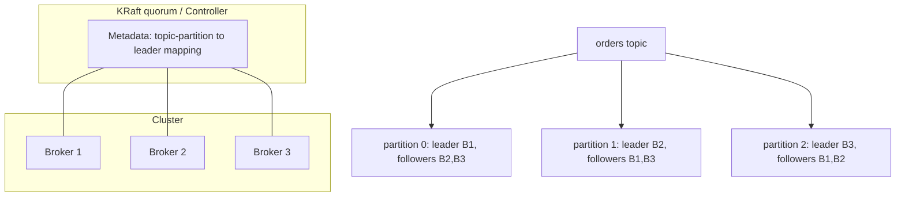

# Kafka Cluster, Topics, Partitions, and Offsets

## 1. One-Line Definition
A Kafka cluster is a set of brokers coordinating via a metadata quorum (KRaft), where each topic is split into replicated partitions — and every message's position in a partition is tracked by an immutable, monotonically increasing offset.

## 2. Why Do We Need It?
One broker can hold a topic but can't scale storage, throughput, or tolerate failure. A cluster spreads partitions across many machines (capacity + parallelism), replicates each partition (durability + failover), and needs a single source of truth for *which broker leads which partition and who's in sync* — that's the metadata/controller layer. Offsets give every consumer an independent, replayable position without locks.

## 3. Simple Intuition
A topic is a big shared notebook with many bound volumes (partitions). A library distributes the volumes across different shelves (brokers) so many readers can read at once, and keeps a spare copy of each volume in another branch (replication). A catalog (controller/KRaft) says which branch holds the master copy of each volume. Each reader keeps their own bookmark (offset): "volume 3, page 412" — no one else cares, and they can return to any earlier page.

## 4. What Happens Without It?
A single broker: one disk, one throughput ceiling, one point of failure — a crash loses the only copy. Without a metadata layer, two brokers could both think they lead the same partition (split brain) and accept writes, corrupting order. Without partition-based offsets, consumers would need global locks to read, killing throughput.

## 5. Core Idea
- **Broker:** a server that hosts *leader* partitions (serving reads/writes) and *follower* partitions (replicating). Each partition has exactly one leader; followers copy from it.
- **Topic → partitions:** partitioning splits a topic's log across brokers, each partition ordered independently. Partition count bounds consumer parallelism and rebalance scope.
- **Partition = replicated unit:** a partition is replicated to `replication.factor` brokers; the "leader + ISR" set is decided by the controller.
- **Controller / KRaft:** modern Kafka (2.8+/3.x) uses KRaft — a small Raft-based quorum of "controller" nodes — for cluster metadata: topic/partition creation, leader election, and membership. (Older clusters used ZooKeeper.)
- **Offset:** each message's sequence position in a partition, starting at 0. Consumers commit their read offset; the *high watermark* is the last offset all ISR replicas have; the *log end offset (LEO)* is the newest appended offset. Gap = consumer lag.
- **Configs that matter:** `num.partitions` (default), `replication.factor` (typically 3), `min.insync.replicas`, retention, segment sizing.

## 6. Important Terminology

| Term | Simple Meaning |
|------|----------------|
| Broker | One Kafka server in the cluster |
| Cluster | The coop of brokers + metadata quorum |
| Controller | Node managing metadata/leader election |
| KRaft | Built-in Raft quorum replacing ZooKeeper |
| Topic | Logical stream spanning partitions |
| Partition | Ordered shard: the replication + parallelism unit |
| Offset | A message's fixed position in a partition |
| LEO | Log end offset: newest appended message |
| High watermark | Last offset all in-sync replicas have |
| Replication factor | How many copies of each partition |

## 7. Basic Architecture



## 8. Request or Data Flow
1. Producer asks the cluster (via metadata) for the **leader broker + ISR** of the partition it wants.
2. Producer writes to the leader; leader appends, replicas fetch; leader acks when the configured acks/ISR condition is met.
3. Controller monitors heartbeats; if a leader dies, it picks a new leader from ISR and updates metadata.
4. Consumers poll for records by partition/offset; new or changed partition assignments come from group coordination (see kafka-rebalancing).

## 9. Practical Example
**Telemetry cluster (assumptions):** 3 brokers, RF=3, 12 partitions for `user.events`, 10k events/sec.
- Partitions 0–3 on broker 1, 4–7 on broker 2, 8–11 on broker 3 (leaders spread evenly).
- Broker 2 dies → its leader partitions 4–7 fail over to follower replicas on brokers 1/3; producers reload metadata and continue; no client code change.
- A consumer group with 3 members gets ~4 partitions each; offsets committed per partition allow restart-from-last-commit.

## 10. Scaling
- **Capacity:** broker count × disk/network; move/add partitions across brokers.
- **Parallelism:** more partitions improve consumer concurrency but add per-partition overhead (memory, rebalance time, metadata).
- **Metadata layer:** KRaft quorum is small (3–5 nodes) and scales independently of data brokers.
- **Repartition hazard:** changing partition count reassigns keys — a key's partition can change, breaking per-key ordering assumptions. Choose count with a growth factor up front (e.g., 3× expected need), or accept the migration cost.

## 11. Reliability and Failure Scenarios

| Failure | Happens | Detection | Recovery | Trade-off |
|---------|---------|-----------|----------|-----------|
| Broker crash | Leaders move to ISR replicas | Controller election | Automatic | availability vs durability |
| Split brain (old era) | Two leaders, corruption | — | KRaft quorum avoids | quorum cost |
| ISR shrinks | No in-sync replicas | ISR metrics | Fix follower | `acks=all` fails to write |
| Controller down (one) | Metadata still served by raft peers | Quorum health | Raft elects replica | 3-node minimum |
| Preserving order on failover | New leader may miss tail | `acks` semantics | acks=all | write latency |

## 12. Consistency and Correctness
- The **high watermark** is what consumers are allowed to read — only offsets replicated to all ISR are visible, so a consumer never reads data that a failover might lose.
- `unclean.leader.election` off (default) means a leader is only elected from ISR → no data loss but possible *unavailability* if all replicas are down.
- Offsets are per (consumer-group, topic-partition); committed offsets are themselves stored in Kafka (`__consumer_offsets`), durably replicated.

## 13. Performance
- Metadata lookups are cached client-side (producers/consumers fetch then hold); metadata refresh light.
- Partitions are sized CPU/IO: aim low double-digit partitions per broker for latency-sensitive workloads; large clusters shard topics across many brokers.
- Offsets are just longs — commit batching (`enable.auto.commit` strategy, `commit.sync` vs `commit.async`) trades safety for throughput.

## 14. Security
- mTLS/SASL for broker-to-broker and client-to-broker; ACLs per topic/group; Kafka's internal topics and `__consumer_offsets` should be restricted, not world-readable.
- Limit cluster-admin surface: only the ops pipeline should alter topic count/replication; avoid runtime repartitioning from tenants.

## 15. Trade-Offs

| Choice | Advantages | Disadvantages | When to Use |
|--------|------------|---------------|-------------|
| RF=1 | Cheap, fast | No durability | Dev/test only |
| RF=3 | Survives 2-broker loss regionally, no single point | 3× storage | Production default |
| RF=5 | Survives more; multi-AZ safe | Cost, latency | Critical, margin-sensitive data |
| More partitions | Parallelism | Overhead, rebalances | Throughput needs |
| Fewer partitions | Lightweight, easy rebalance | Scale ceiling | Modest traffic |

## 16. Common Mistakes
- Setting `replication.factor` 1 in production silently accepting data loss.
- Picking partition count by guesswork → repartitioning later to grow, which breaks per-key order.
- Choosing RF=3 but `acks=1` → brokers replicate in background; a leader crash can still lose the tail.
- Not watching ISR: quiet degradation to "writes failing or loss-prone."

## 17. HLD vs LLD Boundary
HLD: cluster size/topology, partition count + replication factor, topic layout, KRaft/quorum sizing, offset-based consumption topology. LLD: broker configs, `__consumer_offsets` tuning, produce/fetch protocol, client batching settings.

## 18. Interview Questions

### Beginner
- What is the difference between a topic and a partition?
- What does an offset represent, and who tracks it?

### Intermediate
- Why can't a consumer read every offset across all partitions in topic-wide order?
- What is the high watermark and why can't consumers read past it?

### Advanced
- Design the cluster for 200k msg/sec with RF=3 and per-broker limits rough numbers. Then design the failure story for losing one broker.
- How do you migrate a topic from 8 to 32 partitions without breaking per-user ordering?
- Explain KRaft vs ZooKeeper trade-offs for a 100-broker cluster.

## 19. Interview Memory Summary

> [!abstract]- Interview Memory Summary

### Remember

- A cluster = brokers + a metadata quorum (KRaft) that knows which broker leads which partition.
- A topic becomes partitions; each partition is the ordered, replicated unit of parallelism.
- Exactly one leader per partition; ISR + controller govern failover.
- Offsets are per (group, partition), stored durably in `__consumer_offsets`; the high watermark is the visible committed tail.
- Partition count must be set with growth headroom — repartitioning later breaks per-key ordering.
- Example worth keeping: the 3-broker telemetry cluster and one-broker failover walkthrough.

### 30-Second Explanation

Partitions are the load-bearing concept — they give ordering, parallelism, replication, and offsets; KRaft keeps the metadata consistent; the watermark + ISR define what is safe to read.

### Interview Traps

- Saying "offsets are hit once" as though replay doesn't exist — replay is the point of offsets.
- Forgetting the high watermark when asked "can a consumer read data that isn't replicated yet?" (No.)
- Setting RF=3 but acks=1 and calling it durable — brokers replicate in the background; a leader crash can still lose the tail.
- Choosing partition count by guesswork and repartitioning to grow, silently breaking per-key order.

### Key Trade-Off

A cluster buys storage, throughput, and failover across many brokers — but the price is metadata coordination (KRaft/quorum), RF storage multiplier, and the fact that partition count, once set, is a correctness constant.

## 20. Related Concepts

### Prerequisites

- [[kafka-architecture|Kafka Architecture]]

### Commonly Used Together

- [[kafka-replication|Kafka Replication]]
- [[kafka-producers-consumers|Kafka Producers and Consumers]]
- [[kafka-ordering|Kafka Ordering]]
- [[kafka-retention|Kafka Retention]]
- [[kafka-rebalancing|Kafka Rebalancing]]
- [[consumer-lag|Consumer Lag]]
- [[partitioning-vs-sharding|Partitioning vs Sharding]] (partition concept analogy)

### Advanced Concepts

- [[kafka-delivery-guarantees|Kafka Delivery Guarantees]]
- [[database-replication|Database Replication]]

Related planned topics (not authored yet): tiered storage, rack-aware placement, KRaft migration operations, quotas, broker sizing.

## 21. References
Apache Kafka docs (KRaft, replication, broker configuration). Verify current defaults/version behavior for interviews.

## 22. Active Recall

Test yourself before revealing each answer.

> [!question]- What is the difference between a topic and a partition?
> A topic is the logical named stream; a partition is one ordered, replicated shard of it. A topic's data is spread across its partitions, each an independent append-only log with its own offsets, leader, and replicas. Partition count bounds consumer parallelism and is a correctness constant.

> [!question]- What does an offset represent, and who tracks it?
> An offset is a message's immutable position in a partition, starting at 0. Consumers track it per (group, partition) and commit it to `__consumer_offsets`; the high watermark is the last offset all ISR replicas hold, and LEO is the newest appended offset. The gap between a consumer's committed offset and LEO is its lag.

> [!question]- Why can't a consumer read every offset across all partitions in topic-wide order?
> Each partition is an independently ordered log with its own offsets; there is no global sequence. Offsets are only comparable within a partition. Topic-wide order is both impossible and unnecessary — per-key/per-partition order plus parallelism is the contract.

> [!question]- What is the high watermark, and why can't consumers read past it?
> The high watermark is the last offset replicated to all in-sync replicas — the tail that is safe from a failover. Consumers may only read up to it, so they never read data that could vanish if the leader crashes; reading past it would expose unacknowledged records that an unclean failover could lose.

> [!question]- Design the cluster for 200k msg/sec, RF=3. Rough numbers, then the one-broker-failure story.
> Rough sizing: consumers scale to partition count, so provision enough partitions (e.g., 50–100+ depending on per-partition throughput) and spread leaders across 3+ brokers. On one broker failure, its leader partitions fail over to ISR followers on the other brokers, producers refresh metadata and continue, and consumers resume from committed offsets — no code change, small stall.

> [!question]- How do you migrate a topic from 8 to 32 partitions without breaking per-user ordering?
> You generally can't in place: `hash(key) % N` changes, so keys remap to new partitions and per-user order breaks. Options: create a new 32-partition topic, write to both during a migration window, and switch consumers at a cutover point — treating it as a data migration, not a config change.

> [!question]- KRaft vs ZooKeeper for a 100-broker cluster: what changed?
> KRaft replaces ZK with a small built-in Raft quorum of controller nodes that manages topic/partition metadata, leader election, and membership. It removes a second distributed system to operate, scales metadata independently of data brokers, and avoids ZK-era split-brain failure modes.

> [!question]- Failure: two brokers die at once in a 3-broker RF=3 cluster. What do you tell the team about durability and availability?
> Depending on placement, some partitions have their ISR reduced or emptied. With `unclean.leader.election` off and no ISR member left, those partitions become unavailable (writes rejected with NOT_ENOUGH_REPLICAS if ISR < minISR) rather than lossy. That is the honest binary: explicit unavailability instead of silent data loss — until replicas come back.

## 23. When Should I Use This?

### Use it when

- One broker can't hold the data or throughput for your topics — you need distributed capacity.
- You need a topic to survive broker failures without losing committed data.
- Multiple teams/services must share the same event streams.
- You want consumer parallelism beyond what a single node can serve.

### Avoid it when

- A single broker comfortably meets your capacity and availability needs — a cluster adds quorum/replication overhead.
- You only need short-lived task queues with no replay or fan-out.
- The team isn't prepared to run replication, KRaft, and partition lifecycle correctly (RF=1 in production etc.).
- You need random-access query over the stream — that's a database, not a cluster of logs.

### What problem does it solve?

One broker stores a topic but caps storage, throughput, and availability. The bottleneck is single-node capacity and single point of failure. A cluster spreads partitions across brokers (capacity + parallelism), replicates each partition (durability + failover), and coordinates via KRaft so there's exactly one answer to "who leads what" — no split brain.

### What problem does it NOT solve?

Ordering (only per-partition), exactly-once to external systems, per-message queue semantics, random-access lookups, and the cost of wrong upfront choices: once partition count and RF are live, changing them is a data migration, not a config tweak.

## 24. Decision Connections

Decisions that go together with Kafka cluster design:

- [[kafka-replication|Kafka Replication]] — RF and minISR are set per topic on the cluster; they define durability.
- [[kafka-ordering|Kafka Ordering]] — partition count is fixed up front with headroom; changing it breaks key routing.
- [[kafka-producers-consumers|Kafka Producers and Consumers]] — consumers' parallel ceiling is the cluster's partition count.
- [[kafka-rebalancing|Kafka Rebalancing]] — adding members across brokers triggers partition re-assignment.
- [[kafka-retention|Kafka Retention]] — disk math is retention × ingest × RF across the cluster.
- [[database-replication|Database Replication]] — same replication durability thinking, different machinery (leader/ISR vs async/sync replicas).
- [[partitioning-vs-sharding|Partitioning vs Sharding]] — how topic partitions relate to the sharding/partitioning family of ideas.

Decision tree:

```
One topic, growing or critical
    |
    +-- Fits one broker with headroom, non-critical?
    |      → single broker (RF=1), skip cluster complexity
    |
    +-- Need capacity, parallelism, or failover?
    |      → [[kafka-cluster|Kafka Cluster]]
    |         |
    |         +-- Survival target (1-AZ)?          → RF=3
    |         +-- Partition count sized w/ growth  → 3× expected need
    |         +-- No loss allowed?                 → RF=3 + [[kafka-replication|Kafka Replication]]
    |
    +-- Repartitioning to grow later (breaks keys)?
           → plan new-topic migration window, never in place
```