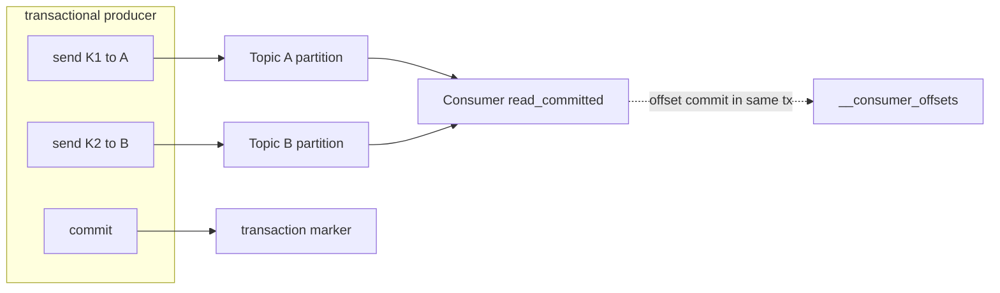

# Kafka Delivery Guarantees (Acks, Idempotent Producer, Transactions)

## 1. One-Line Definition
Kafka's delivery guarantees are set by three layers — the producer's `acks` (durability of a send), the idempotent producer (no duplicate appends on retry), and transactions (atomic multi-topic produce + consume-produce) — together controlling at-most-once, at-least-once, or exactly-once *within Kafka*.

## 2. Why Do We Need It?
Kafka needs to answer the same question every system asks: "if I send, do I keep it, may I see it twice, and is a set of related writes atomic?" Without `acks`, a `send().get()` that times out could be lost or duplicated. Without idempotence, retries append duplicates. Without transactions, a consume-then-produce flow (e.g., "update downstream + advance offset") can commit one but not the other. These three switches are how you choose the pipeline's correctness posture.

## 3. Simple Intuition
- **acks** = how many eyes confirm a letter arrived before you trust it's safe (1=the mailman at the door, all=everyone in the house signed).
- **Idempotent producer** = the writer numbers every letter; the post office keeps the last number seen and drops any letter with an already-seen number — so a re-sent letter is recognized and *not* duplicated.
- **Transactions** = the "ship together" rule: two confirmations (offset-advance + downstream topic write) must either both happen or both be rolled back — no half-state visible to readers (read-committed).

## 4. What Happens Without It?
- `acks=0` + no retries: network hiccup = silently lost events (fire-and-forget).
- Retries without idempotence: a timeout-after-append that you retry = **duplicate** append. Classic "why does my ledger count it twice?"
- Consume-process-produce without transactions: consume from topic A → write topic B → commit offset. If you commit before producing B, a crash loses B; if you produce B before committing offset, a crash re-consumes A → B gets the event again. Either way you're tearing your own transaction apart.

## 5. Core Idea
- **An acks spectrum** (`acks` producer config):
  - `acks=0`: no ack; best throughput; at-most-once-ish (can lose), used for telemetry.
  - `acks=1`: leader confirmed (default in many clients); no loss under leader crash *if* the leader still has it — but a leader with the tail, then crash, can lose it.
  - `acks=all` (`-1`): all in-sync replicas confirm; the durable posture, especially with `min.insync.replicas` ≥ 2 (see kafka-replication).
- **Idempotent producer** (`enable.idempotence=true`): each producer instance gets a producer-ID; each record gets a per-partition sequence; the broker rejects out-of-order/duplicate sequences → retries no longer duplicate. This converts "at-least-once retries" into "exactly-once ordering **into** Kafka."
- **Transactions** (`transactional.id`): producers can open a transaction spanning sends to multiple partitions (even multiple topics), and consumers can consume processing *in a transaction* via transactional consume-process-produce:
  - The consumer's offset commit and the produced records are all committed/aborted atomically.
  - Readers with `isolation.level=read_committed` don't see uncommitted or aborted records.
  - This makes exactly-once *within Kafka* (broker-side) real: after reprocessing, offsets+outputs roll back together — no duplicates visible to in-Kafka sinks.
- **What it does NOT do:** nothing inside Kafka guarantees exactly-once to **external** systems (a DB, an HTTP API). Ate least-once → your sink must be idempotent or you get post-Kafka "exactly-once-extended" via dedup. Know where the boundary lives.

## 6. Important Terminology

| Term | Simple Meaning |
|------|----------------|
| acks | Min replicas confirming a write |
| Idempotent producer | Retry-safe sends via per-partition sequence |
| Producer ID / sequence | Identity Kafka uses to dedup appends |
| Transaction | Atomic unit across partitions/topics |
| transactional.id | Producer's stable identity for transactions |
| Read-committed consumer | Only sees committed (not aborted) records |
| Transactional consume-produce | Offset commit + output produce, atomic |
| Exactly-once (in-Kafka) | No dup/loss for Kafka↔Kafka paths |
| End-to-end exactly-once | Guarantee closing at external sinks (your job) |

## 7. Basic Architecture



## 8. Request or Data Flow
1. Producer configured `acks=all`, `idempotence`, optional `transactional.id`.
2. Records buffered → sent with sequence numbers → leader appends; ISR acks.
3. Retried records carry the same sequence; broker skips already-seen ones (no dup).
4. For a transaction: producer `begin → send → handle commit/abort`; if it crashes, the coordinator aborts; consumers with `read_committed` skip uncommitted records and tail the abort.

## 9. Practical Example
**Streaming "update ledger + advance offset" job (assumptions):**
- Consume `payment.events`, compute balance update, produce to `balances`, commit the consumed offset — you want atomic.
- Without transactions: on crash there's either a duplicate balance write or a skipped commit → drift.
- With `isolation.level=read_committed` + transactional consume-produce: the offset commit and balance produce are one transaction — crash-safe within Kafka; balance consumers never see partial updates.
- For the *DB* sink of balances, that client must be idempotent (store dedup key = `(payment_id, partition, offset)` with a unique constraint) — Kafka's transaction does not cover your database.

## 10. Scaling
- Idempotent producer adds a tiny per-record sequence overhead — negligible.
- Transactions add coordination (transaction coordinator, epoch fencing); throughput drops under very high TX request volume — **batch produce, don't transact per record.**
- Transactional consume-produce is intentionally single-consumer-per-input-partition — scales by more partitions, not more producers on the same key range.
- Read-committed consumers read markers independently; cost grows with transaction volume.

## 11. Reliability and Failure Scenarios

| Failure | Happens | Detection | Recovery | Trade-off |
|---------|---------|-----------|----------|-----------|
| Timeout after append | Possible duplicate | Sequence check | Idempotent producer dedups | seq overhead |
| Producer crashes mid-tx | Transaction aborted | Coordinator timeout | Abort → consumers see nothing | availability windows |
| Coordinator (txn) down | Transactions stall | Health/metrics | Failover; broker cluster | quorum latency |
| Bad sink (DB) | Post-Kafka dup | Unique-constraint errors | Sink idempotency | schema complexity |
| acks=1 + leader crash | Tail lost | LEO/watermark gap | Only acks=all avoids | latency |

## 12. Consistency and Correctness
- **Inside Kafka:** idempotent producer + acks=all + transactions give broker-side exactly-once — reprocessing and crash replay produce identical, atomic, deduplicated state *as seen by read-committed consumers in Kafka*.
- **The second hop:** your SQL, cache, search, and email sinks sit *outside* that boundary. Exactly-once becomes "exactly-once-extended," built by idempotent sinks (unique keys, dedup, ledger reconciliation).
- Debate worth having in an interview: should you pay transaction overhead, or use an *idempotent consumer* + unique keys (often wins for money-ish flows)? Prefer the simple dedup unless you genuinely need atomic multi-topic state.

## 13. Performance
- acks=all: +1 replication trip vs acks=1; idempotence: negligible.
- Transactions: more expensive; `transaction.timeout.ms` trade-off, marker write per commit. Batching: send many records per transaction to amortize coordinator round-trips.
- Read-committed: small filter cost vs read-uncommitted.

## 14. Security
- `transactional.id` is an identity — ACL-restrict who may use it (any client could otherwise impersonate a transactional producer and fence it).
- Delivering to external sinks means your idempotency keys carry PII/business identifiers — keep them encrypted-at-rest in the sink and out of logs.

## 15. Trade-Offs

| Choice | Advantages | Disadvantages | When to Use |
|--------|------------|---------------|-------------|
| acks=0 | Fastest | Loss on hiccup | Telemetry, session events |
| acks=1 | Speed + durability-most | Tail loss on leader crash | Non-critical workloads |
| acks=all + idempotent | No loss/dup into Kafka | +latency | Prod messages, ledgers |
| Transactions | Atomic multi-topic, exactly-once in-Kafka | Cost, coordination | Streams needing offsets+outputs atomic |
| Idempotent sink | "exactly-once-extended" cheaply | Requires stable keys + unique constraint | External DB/file sinks |
| Outbox (DB) | Atomic DB+event | DB cost | Dual-write problems (see outbox-pattern) |

## 16. Common Mistakes
- Believing **broker exactly-once = end-to-end exactly-once** — your DB/HTTP sinks disprove it daily.
- Using acks=all but `min.insync.replicas=1` → "acked" means single-copy.
- Transactions + external side effects: DB wrote before the tx aborted → phantom external write.
- Tuning transaction overhead without batching → throughput collapse.
- Turning on read_committed and expecting *cross-topic* order/visibility guarantees (read-committed ≠ ordered atomic visibility across all topics.)

## 17. HLD vs LLD Boundary
HLD: per-stream ack policy, idempotence + transaction strategy, exactly-once boundary for external sinks, isolation.level choice, reconciliation design. LLD: producer configs (acks, transaction.id, timeouts), consumer isolation config, sink idempotency implementation, coordinator CLI/monitoring.

## 18. Interview Questions

### Beginner
- What does `acks=all` protect against that `acks=1` doesn't?
- How does an idempotent producer stop duplicates without blocking retries?

### Intermediate
- Drawing consume-process-produce: where does a crash expose duplicates, and how do transactions close it?
- When is the idempotent producer NOT enough, and you need transactions?

### Advanced
- Design end-to-end exactly-once from HTTP → Kafka → Kafka Streams → a Postgres sink. Name every dedup boundary and the guarantee at each hop.
- Your finance pipeline needs both "no loss" and "no double-credit" across Kafka + a DB. Recommend transactions vs idempotent sink with reasoning and cost.

## 19. Interview Memory Summary

> [!abstract]- Interview Memory Summary

### Remember

- acks calibrate durability (0 / 1 / all).
- The idempotent producer dedups retries per partition — no duplicate appends.
- Transactions make offset-commit + produces atomic in Kafka (read_committed consumers).
- Exactly-once is a broker-side claim; external sinks need idempotency/unique keys.
- Watch transaction overhead — batch, and prefer idempotent sinks for most flows.
- Example worth keeping: the ledger/balances consume → produce → commit walkthrough.

### 30-Second Explanation

Choose acks for durability, add idempotence to kill retry duplicates, use transactions when offset + output must be atomic in Kafka, and always close the last hop in your own sink with unique keys — that's where "exactly once" really lives.

### Interview Traps

- "Kafka gives exactly-once end to end" — it doesn't past Kafka; the moment you touch a DB or API, that's your idempotency code.
- Using acks=all but `min.insync.replicas=1` → "acked" means single-copy.
- Transactions + external side effects: DB wrote before the tx aborted → phantom external write.
- Expecting read_committed to give cross-topic order/visibility — it's commit-boundary filtering, not ordered atomic visibility across all topics.

### Key Trade-Off

The exact-once stack (acks=all + idempotence + transactions) guarantees no loss or duplication inside Kafka at the price of latency, coordinator overhead, and complexity — whereas simple idempotent sinks often deliver the same business outcome cheaper for flows that only cross Kafka once.

## 20. Related Concepts

### Prerequisites

- [[kafka-producers-consumers|Kafka Producers and Consumers]]
- [[kafka-replication|Kafka Replication]]
- [[delivery-semantics|Delivery Semantics]]

### Commonly Used Together

- [[outbox-pattern|Outbox Pattern]]
- [[transactions-and-acid|Transactions and ACID]]
- [[kafka-architecture|Kafka Architecture]]

### Advanced Concepts

- [[database-replication|Database Replication]]

Related planned topics (not authored yet): exactly-once end-to-end across external systems, transaction coordinator internals, consume-process-produce topologies, schema-level dedup keys.

## 21. References
Apache Kafka docs (producer configuration, transactions, exactly-once semantics, KIP-98). Verify behavior for your client/broker version before interview.

## 22. Active Recall

Test yourself before revealing each answer.

> [!question]- What does `acks=all` protect against that `acks=1` doesn't?
> acks=1 confirms only the leader wrote; if the leader crashes before its followers replicated the tail, those records are lost. acks=all acks only when all in-sync replicas confirm, so a leader crash can never lose acknowledged records — at the cost of an extra replication round-trip of write latency.

> [!question]- How does an idempotent producer stop duplicates without blocking retries?
> Each producer instance gets a producer ID, and every record a per-partition sequence number. The broker accepts only the next expected sequence and rejects already-seen ones — so a re-sent record after a timeout is recognized as a retry and skipped, not appended twice. Retries still happen; duplicates just don't.

> [!question]- Drawing consume-process-produce: where does a crash expose duplicates, and how do transactions close it?
> Without transactions: commit offset before producing output → crash loses the output; produce output before committing → crash re-consumes the input → output written again (duplicate). A transaction groups the offline commit and the output produce into one atomic unit — either both happen or neither — visible only to read_committed consumers.

> [!question]- When is the idempotent producer NOT enough, and you need transactions?
> The idempotent producer fixes append duplicates for one producer. It does nothing for multi-topic atomicity: a consume-then-produce flow (consume A → update balances topic B → commit offset) still tears itself apart on a crash. When offset-commit and the produced records must be atomic, you need transactions (transactional consume-process-produce).

> [!question]- Design end-to-end exactly-once from HTTP → Kafka → Kafka Streams → a Postgres sink. Name every dedup boundary.
> No single hop is globally exactly-once: HTTP retries need a client/server idempotency key; producer is exactly-once into Kafka with idempotence + acks=all; the Streams job uses transactional consume-process-produce (read_committed); the Postgres sink must be idempotent (unique constraint on a dedup key like `(event_id, partition, offset)`). State the guarantee at each hop — only the sum is business-exactly-once.

> [!question]- Your finance pipeline needs both "no loss" and "no double-credit" across Kafka + a DB. Transactions vs an idempotent sink?
> Likely the idempotent sink: consume at-least-once, process, and upsert into the DB with a unique dedup key — retries collide on the same key and are rejected, giving business "no double-credit" cheaply. Kafka transactions add coordinator cost and only help if you need atomic multi-topic state *inside* Kafka; for a single DB sink, idempotency wins on simplicity and cost.

> [!question]- Failure: a producer crashes mid-transaction. What do consumers with read_committed see?
> The transaction coordinator detects the abort (timeout) and aborts it. read_committed consumers never see the uncommitted records at all, and skip aborted ones — no half-state, no partial balance update. uncommitted records can appear briefly to read_uncommitted consumers, which is why the isolation level matters.

> [!question]- Interview scenario: "Our stream is exactly-once." How do you respond?
> Ask where the boundary is. Exactly-once inside Kafka (idempotent producer + acks=all + transactions + read_committed) is real; every external sink — a database, cache, search index, email — is outside it and needs its own idempotency keyed writes. Walk the pipeline hop by hop and name what guarantees each hop actually gives.

> [!question]- Why does transaction overhead collapse throughput if you transact per record, and what's the fix?
> Every transaction touches the transaction coordinator (begin/commit markers, fencing), so one-record transactions pay huge fixed coordination cost per write. Fix: batch many records into one transaction — amortize the coordinator round-trips — and only transact where offset+output atomicity is genuinely needed, preferring idempotent sinks elsewhere.

> [!question]- Trade-off: acks=0 telemetry vs acks=all + idempotent ledgers — why the spread?
> acks=0 gives max throughput with silent loss — right for disposable telemetry where a dropped point costs nothing. acks=all + idempotence costs latency and sequence overhead but guarantees no loss/dup into Kafka — the only posture for ledger, payments, and state that gets replayed or audited. The acks dial is literally your loss-tolerance budget.

## 23. When Should I Use This?

### Use it when

- A stream's records are ledger-adjacent — loss or duplication is financially visible.
- Retries are inevitable (networks) and duplicates must not appear downstream.
- You need atomic offset-commit + output-produce (streams that write derived state).
- Multiple topics must be written as one unit (transactional produce).
- Read consumers must never see partial/aborted updates (read_committed).

### Avoid it when

- Records are disposable telemetry — acks=0/1 is the right-cost answer.
- The only sink is one external system — an idempotent sink usually beats transaction overhead.
- You assume the Kafka guarantee extends past Kafka — it doesn't; plan the last hop.
- Externally visible side effects happen inside a transaction (a DB write before abort is a phantom) — transactions can't cover it.

### What problem does it solve?

A timed-out send could be lost or the retry of it duplicated — "ledger counted twice" — and a consume-process-produce job tears itself apart on crash (either the output or the offset survives, never both). The bottleneck is three independent failure points. `acks` sets durability per send, the idempotent producer dedups retries in-broker, and transactions atomize offset+output — so in-Kafka behavior becomes deterministic at the exactly-once level.

### What problem does it NOT solve?

Anything past Kafka: external sinks (DB, HTTP) still need idempotency keys, read_committed is not cross-topic global ordering, and a transaction can't roll back an external side effect that already happened before an abort — the full "end-to-end exactly once" is your sink code, not a flag.

## 24. Decision Connections

Decisions that go together with Kafka delivery guarantees:

- [[kafka-producers-consumers|Kafka Producers and Consumers]] — acks, idempotence, and commit strategy are set at the producer/consumer config level.
- [[kafka-replication|Kafka Replication]] — acks=all only means durable if minISR matches the replication reality.
- [[delivery-semantics|Delivery Semantics]] — the general at-most/at-least/exactly-once framework these three layers implement.
- [[outbox-pattern|Outbox Pattern]] — the DB-side atomicity alternative when your source of truth is a database, not Kafka.
- [[transactions-and-acid|Transactions and ACID]] — what "atomic" means outside Kafka; the guarantee the transaction marker approximates in the log.
- [[kafka-architecture|Kafka Architecture]] — offsets, watermark, and consumer groups are the machinery transactions rest on.

Decision tree:

```
What does this stream need?
    |
    +-- Loss acceptable (telemetry)?      → acks=0/1
    |
    +-- No loss, no dup into Kafka?       → acks=all + idempotent producer
    |      → [[kafka-replication|Kafka Replication]] for minISR
    |
    +-- Offset commit + output atomic (streams)?
    |      → transactions + read_committed
    |      → [[kafka-producers-consumers|Kafka Producers and Consumers]]
    |
    +-- External DB/API must see no dup?
           → idempotent sink (unique key), NOT the Kafka flag
           → [[outbox-pattern|Outbox Pattern]] as the DB-side alternative
```