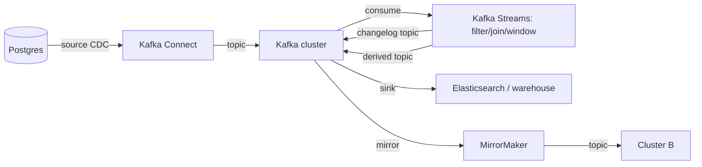

# Kafka Ecosystem (Connect / Streams / MirrorMaker)

## 1. One-Line Definition
The Kafka ecosystem extends a plain cluster into a platform with three flagship tools: Kafka Connect (move data between Kafka and external systems), Kafka Streams (in-Kafka stream processing and state), and MirrorMaker (cross-cluster replication in active-active or active-standby topologies) — each riding topic/partition semantics rather than inventing its own.

## 2. Why Do We Need It?
A Kafka cluster alone moves bytes; production event-driven systems need to ingest from databases/files/services, transform and enrich streams, and replicate across regions or clouds. Doing those by hand means reimplementing consumer groups, offsets, exactly-once plumbing, and rebalancing for every integration — the tools exist precisely because those mechanics are subtle and shared.

## 3. Simple Intuition
Kafka is the airport (topics = gates, partitions = check-in lines). Connect is the baggage conveyor — it always transfers luggage to/from outside carriers on schedule. Streams is the in-airport transit train — it moves passengers between gates, merging and filtering them as it goes, holding state at the stations. MirrorMaker is the remote runway — a twin airport that mirrors every arrival so a plane diverted to the other side still serves the same departures.

## 4. What Happens Without It?
Every service hand-rolls its own consumer, its own DB connector with its own offset bookkeeping, its own aggregation logic, and its own cross-region copy. You get N different "almost right" replication implementations, offset bugs, rebalancing storms, exactly-once misclaims, and three incompatible ways to mirror a topic. The failure surface multiplies with every integration instead of being standardized once.

## 5. Core Idea
- **Kafka Connect:** source connectors write external data (Postgres via CDC, files, S3) into topics; sink connectors read topics into Elasticsearch, warehouses, S3, etc. Runs as workers (single/distributed) with connector configs, exact-once-ish semantics, and the same offset/rebalance mechanics as consumers.
- **Kafka Streams:** a library (not a separate cluster) that does stream processing — filtering, joins, windowing, aggregations — with local state stores backed by changelog topics; exactly-once via transaction offsets/output atomicity ([[kafka-delivery-guarantees|Kafka Delivery Guarantees]]); scaling = adding app instances that rebalance the topology's tasks.
- **MirrorMaker / replication:** mirrors topics between clusters (region A → region B) so consumers in B see the same stream; handles offsets, topic configs, consumer groups, and active-active vs active-standby models with conflict risk on the write side.
- **The shared grammar:** everything is consumer groups, partitions, offsets, and rebalancing — if you understand those ([[kafka-producers-consumers|Kafka Producers and Consumers]], [[kafka-rebalancing|Kafka Rebalancing]]) you understand each tool's mechanics by analogy.
- **Choose boundaries:** Connect for data-in/data-out; Streams (or external processors like Flink/Spark on the same event streaming pattern) for processing; MirrorMaker for cross-cluster/region; keeping each lane separate keeps failure domains small.

## 6. Important Terminology

| Term | Simple Meaning |
|------|----------------|
| Source connector | Pulls external data into topics |
| Sink connector | Pushes topic data into an external system |
| Worker | The process running connectors (standalone/distributed) |
| Topology | Streams' graph of processors (source → ops → sink) |
| State store | Local storage in Streams (KV or windowed), changelog-backed |
| Changelog topic | The Kafka topic that persists a state store's changes |
| Windowing | Aggregating stream events that fall in a time window |
| MirrorMaker | Tool replicating topics across clusters |
| Active-active | Both clusters writable, conflict-prone, cross-region |
| Active-standby | Writes to one, replica in the other (read replica) |

## 7. Basic Architecture



## 8. Request or Data Flow
1. Connect's source connector polls Postgres WAL (CDC), writes change events to `user.changes`; offsets track how far the connector has consumed.
2. Streams consumes `user.changes`, windows by day, joins to `order` events, writes `user.daily_summary`; a state store persists per-key state and its changelog lives on a topic.
3. A sink connector reads `user.daily_summary` and mirrors it to Elasticsearch near-real-time.
4. MirrorMaker on a schedule replicates core topics to Cluster B, which serves read replicas and disaster-recovery consumers; B's consumers run off B's offsets.

## 9. Practical Example
**E-commerce event platform (assumptions):** 3 regions, 15 services, 40 topics.
- Connect: Postgres CDC (`orders`, `inventory`) → topics; sinks → Elasticsearch for search, a warehouse for analytics — 6 connectors, ~zero custom consumer code.
- Streams: per-region aggregators compute "items added to cart in the last hour" into a summary topic; state stores keep the rolling window.
- MirrorMaker: core topics mirrored region A→B→C (active-standby reads); on A's failure, consumers flip to B's copy.
- The tools replaced ~30 hand-written consumers and two ad-hoc replication scripts — with exactly one rebalancing/offset model to keep correct (that's the ecosystem's real win).

## 10. Scaling
- **Connect:** scale = add workers; tasks distribute over partitions; a slow sink connector backlogs (consumer lag) unless you add partitions.
- **Streams:** scale = add application instances; the rebalancer spreads tasks/state stores; each state store partition must live where its key is processed.
- **MirrorMaker:** scale with partitions; lag is the metric; beware making every topic mirrorable (infinite storage + conflict potential) — select core topics, run with proper retention.
- All three share the lesson: partitions are the parallelism unit; your partition count is a capacity dial you set before you need it (see [[kafka-cluster|Kafka Cluster]]).

## 11. Reliability and Failure Scenarios

| Failure | What Happens | Detection | Recovery |
|---------|--------------|-----------|----------|
| Connect worker dies | Its tasks rebalance to another worker | Heartbeats/lag | Automatic rebalance, resume offsets |
| Streams task crashes | Tasks reprocess from checkpoint | Restart + changelog replay | Exactly-once + state restore |
| MirrorMaker lag | Cross-region read staleness | Mirror lag metrics | Add workers/partitions; auto-failover not automatic |
| Sink DB down | Connect retries, backlog grows | Sink lag | Pause task with backoff, resume |
| Region partition | Both sides write (active-active) | Conflicts surfaced | Reconciliation policy; usually active-standby |

## 12. Consistency and Correctness
- Connect/Streams inherit the topic's ordering: per-key ordering is preserved as long as key→partition routing holds ([[kafka-ordering|Kafka Ordering]]).
- Streams' exactly-once for stateful ops relies on transactions and changelog atomicity — a crashed task restores state from its changelog, then resumes where it was.
- MirrorMaker is *not* a CRDT: active-active can generate divergent keys; choose active-standby unless you have a conflict-merge policy (see [[strong-vs-eventual-consistency|Strong vs Eventual Consistency]] framing).
- Sink connectors are usually at-least-once: idempotency (dedupe keys like `(partition, offset)`) is the standard fix on the external side.

## 13. Performance
- Connect adds one hop and serialization cost; a well-partitioned pipeline keeps per-partition throughput flat.
- Streams keeps state local (fast) and trades a changelog topic write per state mutation — stateful throughput is bounded by the changelog's write rate.
- Mirror cost = replicate every mirrored topic's bytes; retention + cross-region bandwidth are the real budgets (see [[kafka-retention|Kafka Retention]]).
- Watch consumer lag on sinks and mirror tasks — the loudest ecosystem health signal.

## 14. Security
Connectors need the *source and sink* credentials, not just cluster access — store them in a secrets vault, never in connector configs. Streams app instances and Connect workers must honor topic ACLs; a compromised connector can push poisoned data as if trusted. MirrorMaker cross-region replication should run over TLS and respect the stricter region's data-residency controls (see [[encryption-and-keys|Encryption and Keys]]).

## 15. Trade-Offs

| Tool | Strength | Cost | When to Use |
|------|----------|------|-------------|
| Connect | Standardized data movement | Another fleet to run | DB/search/store integrations |
| Kafka Streams | In-Kafka, exactly-once, local state | Changelog write cost | Stream ETl and aggregation |
| MirrorMaker | Cheap cross-region reads | Bandwidth + conflict risk | DR, multi-region reads |
| Custom consumer | Full control | You own rebalance/offset/errors | Truly unusual pipelines only |

## 16. Common Mistakes
- Mirroring everything (infinite storage, conflicts) instead of a selected core topic list.
- Running Streams jobs with no idempotency and hoping the "exactly-once" flag fixes app-level duplicates.
- Connecting to a sink that is down for a day, restarting it, and expecting no replay burst (plan lag budgets).
- Confusing MirrorMaker replication with a safety copy — a topic delete in A can replay to B.
- Growing the ecosystem before the basic cluster/rebalance mechanics are understood — tooling amplifies what you already know.

## 17. HLD vs LLD Boundary
HLD: which lanes use Connect vs Streams vs MirrorMaker, topic/partition sizing per lane, cross-region replication model (active-standby vs active-active + conflict policy), retry/idempotency contracts on sinks. LLD: wiring one connector's config, one Streams topology's transforms, running one mirror task.

## 18. Interview Questions

### Beginner
- What does each of Connect, Streams, and MirrorMaker do?
- Why is a source connector better than a hand-written consumer for Postgres CDC?

### Intermediate
- Design an ingestion + aggregation + search pipeline using Connect, Streams, and a sink. Where do exactly-once claims hold and break?
- A sink connector lags by 6 hours after a DB outage. What's the recovery path?

### Advanced
- Active-active MirrorMaker has a conflicting key in both regions. Walk the divergence and the reconciliation policy.
- Design stateful processing (rolling window) on Streams: state store, changelog, failure restore — and the partition count that bounds throughput.

## 19. Interview Memory Summary

> [!abstract]- Interview Memory Summary

### Remember

- Connect = data movement in/out; Streams = in-Kafka processing; MirrorMaker = cross-cluster copy.
- Everything is consumer groups + partitions + offsets + rebalancing.
- Streams state = local store + changelog topic; crash recovery replays it.
- Choose active-standby unless you have a conflict-merge policy.
- Sink/mirror lag is the ecosystem's health signal.
- The tools standardize mechanics; they don't remove design.

### 30-Second Explanation

Fit the tool to the lane: Connect for source/sink integrations (CDC, search, warehouses), Streams for in-Kafka filtering/joins/windowed aggregation with changelog-backed state, MirrorMaker for cross-region replication — and honor the shared consumer-group grammar, the exactly-once boundaries, and the lag budget for every sink.

### Interview Traps

- Mirroring everything — infinite storage, cross-region conflict.
- Claiming end-to-end exactly-once without naming each hop's guarantee.
- Treating active-active mirroring as conflict-free.
- Adding tools before mastering the cluster/rebalance mechanics they build on.

### Key Trade-Off

The ecosystem standardizes offset, rebalance, and atomicity machinery per lane (Connect/Streams/MirrorMaker) at the cost of extra fleets, changelog/bandwidth spend, and the discipline to keep each lane's guarantees honest.

## 20. Related Concepts

### Prerequisites

- [[kafka-architecture|Kafka Architecture]] — the log the ecosystem revolves around.
- [[kafka-producers-consumers|Kafka Producers and Consumers]] — the mechanics every tool reuses.
- [[kafka-rebalancing|Kafka Rebalancing]] — how tasks/instances redistribute.

### Commonly Used Together

- [[kafka-retention|Kafka Retention]] — mirrored/changelog topics change your storage math.
- [[event-driven-architecture|Event-Driven Architecture]] — the system shape these tools feed.
- [[message-queue|Message Queue]] — where the ecosystem contrasts with plain queues.

### Alternatives

- [[batch-vs-stream-processing|Batch vs Stream Processing]] — choosing Streams over batch pipelines and back.
- [[data-warehouse-lake|Data Warehouse and Data Lake]] — where Connect's sinks converge.
- [[outbox-pattern|Outbox Pattern]] — the write-side origin of many Connect source streams.

### Advanced Concepts

- [[kafka-delivery-guarantees|Kafka Delivery Guarantees]] — exactly-once boundaries per tool.
- [[exactly-once-effect|Exactly-Once Effect]] — what "exactly once" really buys end to end.

Related planned topics (not authored yet): Connect connector catalog, Streams internals (KIP-xxx topology), Flink-vs-Streams comparison, MirrorMaker 2 active-active conflict model.

## 21. References
Apache Kafka docs: Connect, Streams, MirrorMaker 2. Confluent docs on connectors and exactly-once stream processing. Kleppmann talks/DDIA-adjacent on streams and the Lambda debate. Verify version-specific features (e.g., KRaft-era changes) against current docs.

## 22. Active Recall

Test yourself before revealing each answer.

> [!question]- Basic understanding: what distinguishes Connect, Streams, and MirrorMaker?
> Connect moves bytes between Kafka and external systems (source in, sink out). Streams processes bytes already in Kafka (filter/join/window) with local state. MirrorMaker copies topics between clusters. Different doors on the same building — shared consumer-group grammar.

> [!question]- Design decision: Postgres change capture into topics, then to search. Name the composition.
> Connect source (CDC) writes change topics; Streams (or a direct sink) filters/serializes a searchable projection; Connect sink indexes into Elasticsearch. Exactly-once holds per hop only with idempotency/dedup keys on the sink side — state that clearly.

> [!question]- Trade-off: Streams state store vs recompute-on-the-fly.
> State stores make windowed/joins cheap (local KV) but cost a changelog-topic write per mutation and restore time on crash. Recompute has no state to replay but repeats work per event. Choose stateful only when the aggregation is expensive to redo.

> [!question]- Failure scenario: sink connector backlogged 6 hours after the target DB returned.
> The connector paused/resumed at a checkpoint, but thousands of records sat un-consumed. Recovery: let lag drain (or add sink tasks/partitions), cap burst via backpressure, and reconcile the sink with a dedup key `(topic, partition, offset)` in case anything was ingested twice.

> [!question]- Interview scenario: both regions wrote "cart-123" differently in active-active MirrorMaker. Walk it.
> Both A and B accepted a write for the same key — the mirror propagates both, and without a conflict rule one silently wins or both persist. Design: active-standby for the key domain, or a merge policy (LWW with a stable clock, or an app-level event-merging step) before serving reads.

> [!question]- Interview scenario: "We have Streams exactly-once, so nothing ever duplicates." Respond.
> Exactly-once in Streams covers consume-process-produce within Kafka (transactions + changelog). It never covers the external sink (Connect to Postgres/ES) nor your app's API calls — those need idempotency keys. Name the boundary per hop; [[exactly-once-effect|Exactly-Once Effect]] clarifies what you actually promised.

## 23. When Should I Use This?

### Use it when

- Multiple systems must exchange data through Kafka (Connect).
- You need in-Kafka transformation/aggregation with exactly-once state (Streams).
- Multi-region or DR consumers want a replicated topic copy (MirrorMaker).

### Avoid it when

- A simple consumer does the job with no orchestration tax.
- You can't budget the lag your sink/mirror will carry.
- You need genuine cross-region writes with conflicts and have no merge policy — prefer active-standby or single-writer.

### What problem does it solve?

The problem: every integration re-implements the fragile parts of consumer groups, offsets, state, and replication. Bottleneck: N near-miss copies of the same machinery. Solution: standardized Connect/Streams/MirrorMaker lanes sharing Kafka's offset/rebalance/transaction model — one mechanism, clearly bounded guarantees, and a lag signal you can monitor uniformly.

### What problem does it NOT solve?

It does not make cross-region writes conflict-free (that's your topologies and merge policy), does not make sinks exactly-once by themselves, and does not replace data-modeling decisions — a badly modeled topic still flows badly through every tool.

## 24. Decision Connections

Decisions that go together with the Kafka Ecosystem:

- [[kafka-architecture|Kafka Architecture]] — the shared log model these tools assume.
- [[kafka-producers-consumers|Kafka Producers and Consumers]] — the rebalance/offset mechanics to master first.
- [[kafka-delivery-guarantees|Kafka Delivery Guarantees]] — the transactional backbone Streams uses.
- [[kafka-rebalancing|Kafka Rebalancing]] — how instances/tasks redistribute.
- [[kafka-retention|Kafka Retention]] — mirrored and changelog topics change disk budgets.
- [[event-driven-architecture|Event-Driven Architecture]] — the destination shape.
- [[batch-vs-stream-processing|Batch vs Stream Processing]] — when events feed batch/warehouse lanes.
- [[outbox-pattern|Outbox Pattern]] — the transactional origin feeding source connectors.

Decision tree:

```
What does the pipeline need Kafka to be?
    |
    +-- Move data from/to external systems?
    |      → Kafka Connect (source/sink connectors)
    |
    +-- Transform / aggregate / join inside Kafka?
    |      → Kafka Streams (state store + changelog)
    |         +-- Exactly-once state? → transactions: consume-process-produce
    |
    +-- Serve consumers from another region/cloud?
    |      → MirrorMaker 2
    |         +-- Writes on both sides?  → conflict-merge policy or active-standby
    |
    +-- Crude one-off consumer?
    |      → plain consumer ([[kafka-producers-consumers|Kafka Producers and Consumers]])
```