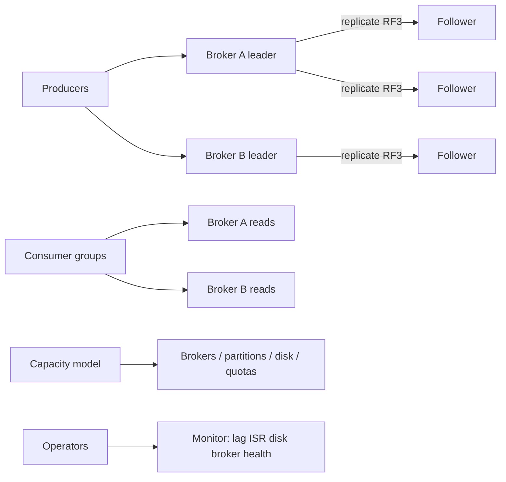

# Kafka Operations (Capacity / Hot Partitions / Failure)

## 1. One-Line Definition
Kafka operations is the hygiene of a running cluster — turning raw traffic estimates into broker/storage/throughput plans, detecting and fixing hot partitions before they cap a topic, and reacting to broker, replica, and consumer failures the way the system was designed to — with the goal of never discovering capacity or robustness limits by incident.

## 2. Why Do We Need It?
Kafka runs, and then it doesn't: disks fill, one partition becomes a celebrity and melts, a broker dies and the whole topic stalls because a consumer misbehaves, or a rebalance cascades because partitions were sized wrong years ago. Operations is what converts "the cluster was fine" into a *known* budget — brokers, disk, partitions per broker, replicas, lag, quotas — so those failures are predictable, staged, and recoverable instead of being the news.

## 3. Simple Intuition
A highway that was planned for 10 lanes of traffic, opened with 10, and quietly repainted: 100 lanes of traffic now moves through pinch points nobody measures. Kafka ops is the traffic authority — measuring lanes (partition throughput), spotting where one toll booth bottlenecks, and opening new booths (brokers/partitions) before rush hour, plus a tow truck plan (failover) with its own service times.

## 4. What Happens Without It?
Disk-full crashes take down leaders; hot partitions throttle a topic's honest write rate while other partitions idle; a broker failure triggers long rebalances because hundreds of partitions were loaded on one node; retention is set "because someone did once", so consumers silently lose history or the cluster burns storage. Without an ops model, every "surprise" is actually a budget you never wrote down.

## 5. Core Idea
- **Capacity planning starts with the log:** bytes/sec in × retention × replication factor defines disk; records/sec and bytes/sec define broker throughput; consumer groups define the read-path QPS; and every plan has room for rebalance (temporary +N% load) and failure (minus-one-broker headroom).
- **Partition math is the master dial:** total throughput ÷ per-partition ceiling = partition count. Per-partition ceiling is the one number to measure (leader write path, serialized). Too few partitions = hot partitions; too many = rebalance/OS cost and small segments.
- **Hot partitions:** a single key (celebrity, a huge tenant) or a skewing map (uneven keys) funnels traffic onto one leader. Mitigations: more partitions + even key distribution, sub-keys, salting, or accept-and-compensate at the consumer (see [[kafka-ordering|Kafka Ordering]] for the ordering trade).
- **Failure handling:** broker failure → leaders fail over to ISR followers ([[kafka-replication|Kafka Replication]]), producers refresh metadata, consumers resume from offsets; disk failure → that replica is rebuilt; controller failure → KRaft-era leader re-election.
- **Operational protectors:** quotas per client/consumer (bw and request rate), monitoring lag at every consumer group, alerting on ISR shrink, disk, and broker health ([[observability|Observability]]), and rehearsed drain/rolling-replace procedures.

## 6. Important Terminology

| Term | Simple Meaning |
|------|----------------|
| Per-partition throughput | The real ceiling; measure, don't assume |
| Hot partition | One partition taking disproportionate traffic |
| ISR shrink | Fewer in-sync replicas than planned (risk) |
| Broker headroom | Capacity budgeted for rebalance + one-node failure |
| Quota | Per-client bandwidth/rate cap protecting the fleet |
| Consumer group lag | Records produced minus consumed per group |
| Rolling replacement | Moving leaders/data off a broker before maintenance |
| Drain | Moving partitions off a node safely (preferred leader election) |
| Preferred leader | The originally-assigned leader Kafka prefers to restore |
| Min-isr underflow | Writes blocked because too few replicas in sync |

## 7. Basic Architecture



## 8. Request or Data Flow
1. Traffic estimate → capacity model: storage = bytes/sec × retention × RF=3 ÷ compression; throughput = bytes/sec ÷ per-partition ceiling → partitions; brokers = throughput ÷ per-broker ceiling with +1 failure spare.
2. Provision and tune: broker count, partition count, RF=3, retention, quotas for noisy clients.
3. Daily operations: monitor lag per group, ISR, disk, broker; alert early; on broker failure run through the failover runbook (leaders move, ISR recover).
4. On every change (new topic, new consumer group), recompute the same model before, not after, the load lands.

## 9. Practical Example
**Metrics pipeline (assumptions):** 300 MB/sec of write traffic, retention 7 days, RF=3, target 40% disk, compression ~60% saving.
- Disk: 300 MB/s × 86,400s ≈ 25.9 TB/day pre-compression; ×0.4 compressed ≈ 10.4 TB/day; ×7 days ≈ 73 TB logical × 3 replicas ≈ 218 TB storage. At ~30 TB per broker disk → ~8+ brokers just for storage.
- Throughput: measure per-partition at ~10-20 MB/s; 300 MB/s ≈ 15-30 partitions+headroom.
- Check: brokers = max(storage banks, throughput, consumer read-side) with reserve for one-broker-out.
- Numbers like these — written, not guessed — are the "cluster budget" ops protects.

## 10. Scaling
- Add brokers → rebalance moves leaders/partitions (drain old, preferred-leader election) — capacity and rebalance must both fit the budget.
- More partitions is the slow, painful lever: adding partitions to a live topic is one-way; re-keying is a republish job. Size partitions with a 2-3x growth headroom at design time.
- Consumer scale is bounded by partitions — a lagging group needs more partitions (and rekeying) or faster consumers, not just more instances (see [[kafka-rebalancing|Kafka Rebalancing]]).
- Tiered storage/long retention shifts the disk equation but not the write-path math — update the model when the feature changes.

## 11. Reliability and Failure Scenarios

| Failure | What Happens | Detection | Recovery | Prevention |
|---------|--------------|-----------|----------|-----------|
| Broker dies | Its leader partitions fail over | Broker heartbeat/ISR | Auto failover from ISR | RF=3, min.isr policy, headroom |
| Disk full | Writes rejected | Disk alerts | Retention/archive + add brokers | Capacity model with headroom |
| Hot partition | Topic throughput caps | Throughput skew metric | Sub-keys/salt/repartition | Even keys, measured ceiling |
| Controller failure | Metadata lags | Keepalive | KRaft re-election | Compact/replicas for metadata |
| Consumer group stuck | Unbounded lag | Lag metric | Fix consumer; rebalance cleanup | Consumer health check |
| Rebalance storm | Group churns, no progress | Group-state alerts | Cooperative rebalance, quotas | Sizing + max.poll tuning |

## 12. Consistency and Correctness
- Failover must preserve the log's order per partition: promotion from ISR keeps the leader lineage; avoiding unclean election ([[kafka-replication|Kafka Replication]]) keeps the durability contract honest.
- Retention and capacity are the same number from two directions: set retention against the disk model, not "somewhere in the past" (see [[kafka-retention|Kafka Retention]]).
- Quotas throttle rather than fail, which keeps commit/lag semantics stable while protecting neighbors.
- During maintenance the ordering guarantee holds if you drain via preferred-leader election; blind restarts can cause double leadership windows — orchestrate the steps rather than winging restarts.

## 13. Performance
- The bottleneck ladder: per-partition write path → broker IO/network → controller/metadata. Measure all three, plan against the first.
- Hot partitions are the stealth ceiling — a per-partition throughput + skew telemetry panel catches them while a per-broker panel hides them.
- Consumer lag is your best end-to-end read signal; broker health metrics tell you *where*, consumer lag tells you *whether*.

## 14. Security
Operational access is privileged: broker/coordinator credentials, quota overrides, and topic-metadata edits must be least-privilege and audited. Never log connection strings or SASL secrets in runbooks; use a vault. Expose broker metrics to internal observability only; external metrics endpoints can leak topology (see [[encryption-and-keys|Encryption and Keys]]).

## 15. Trade-Offs

| Decision | Gains | Costs | When to Choose |
|----------|-------|-------|----------------|
| High RF (3+) | Durable, safe failover | x2-3 storage, write cost | Most production |
| Long retention | Long replay window | Storage (tiered storage helps) | Consumer rebuild on demand |
| Many partitions | Parallelism headroom | Rebalance/ops cost, small segments | Write-growth plans |
| Quotas everywhere | Predictable fleet | Operational complexity | Multi-tenant SaaS |
| Auto-rebalances | Zero-touch recovery | Cascade risk during failure | Tuned timeouts, rehearsal |

## 16. Common Mistakes
- Sizing partitions at launch (5) and never revisiting until a hot partition and a rebalancing storm coincide.
- Reading "broker healthy" as "cluster healthy" — a topic can be at capacity while every broker idles.
- Setting retention by habit instead of against the disk model.
- No failure rehearsal: first failover happens mid-incident without a runbook.
- Treating lag alerts as noise until a backlog 24h old becomes a consumer restart marathon.

## 17. HLD vs LLD Boundary
HLD: capacity model (partitions, brokers, retention, RF), quotas, failover policy and runbooks, hot-key strategy, monitoring/SLOs per topic and group. LLD: one topic config, one quota yaml, the consumer's max.poll/heartbeat knobs, one drain script.

## 18. Interview Questions

### Beginner
- What is a hot partition and why doesn't the broker tell you by itself?
- Why does a topic's partition count cap your consumer parallelism?

### Intermediate
- Estimate brokers/partitions/disk for 300 MB/sec writes, RF=3, 7-day retention, at 40% disk, then state where the model can lie.
- A broker dies at peak. Walk failover and the temporary capacity you lose.

### Advanced
- Design the capacity model for a flash-sale topic whose hottest key is one celebrity: what to measure, provision, and rehearse.
- A rebalance storm takes down a consumer group after 200 partitions load onto one node. Diagnose and fix across sizing, config, and operating practice.

## 19. Interview Memory Summary

> [!abstract]- Interview Memory Summary

### Remember

- Capacity starts from the log: bytes/sec × retention × RF = disk; records/sec and bytes/sec = broker throughput.
- Partition count is the master dial; per-partition ceiling is the number to measure.
- Hot partitions cap a topic while other partitions idle — watch skew, not just broker load.
- Broker failure → ISR failover; disk failure → rebuild; controller → KRaft re-election.
- Headroom is for rebalance + one-broker-out, not a hedge.
- Lag, ISR, disk, and quotas are the four operational signals.
- Rehearse the failure before it's the incident.

### 30-Second Explanation

Write the capacity model down before traffic lands: disk from bytes×retention×RF, throughput from per-partition ceilings, consumers from partition count with 2-3x headroom. Monitor lag, ISR, disk, and partition-level skew; set quotas; rehearse the failed-broker runbook. Every operational "surprise" is a budget that was never written.

### Interview Traps

- Claiming capacity "from experience" without a written model.
- Sizing partitions at launch, never revisiting.
- Reading "broker healthy" as "topic healthy" — a single hot partition can cap a topic.
- No rehearsal: the first failover is also the first run of the runbook.

### Key Trade-Off

You buy predictable cluster behavior and safe failure response with the cost of continuous model-watching, partition sizing early (hard to grow later), and retention/disk decisions made as deliberate trade-offs rather than defaults.

## 20. Related Concepts

### Prerequisites

- [[kafka-cluster|Kafka Cluster]] — the node/partition/controller anatomy operations runs.
- [[kafka-replication|Kafka Replication]] — the ISR/failover semantics behind every recovery.
- [[kafka-rebalancing|Kafka Rebalancing]] — the movement model that capacity and maintenance respect.

### Commonly Used Together

- [[kafka-retention|Kafka Retention]] — retention and disk budget are the same equation.
- [[kafka-producers-consumers|Kafka Producers and Consumers]] — quota/heartbeat knobs operate here.
- [[consumer-lag|Consumer Lag]] — the end-to-end read-side health signal.
- [[capacity-estimation|Capacity Estimation]] — the estimation discipline behind the model.

### Alternatives

- [[availability|Availability]] and [[failover|Failover]] — the SLA framing for failover design.

### Advanced Concepts

- [[observability|Observability]] — the telemetry panels ops runs on.
- [[autoscaling|Autoscaling]] — when partition/broker growth is automated.
- [[distributed-scheduling|Distributed Scheduling]] — coordinating maintenance across many nodes.

Related planned topics (not authored yet): tiered-storage ops, KRaft controller operations, quota/cruise-control automation, partition rekeying playbooks.

## 21. References
Apache Kafka ops docs (capacity planning, quotas, rack awareness), Confluent docs on replicator/MirrorMaker sizing, Confluent "capacity planning" guides, Kafka monitoring metrics reference (MBean list). Verify metric names against the deployment version.

## 22. Active Recall

Test yourself before revealing each answer.

> [!question]- Basic understanding: why is the per-partition ceiling the number to measure?
> A topic's real throughput is the leader's per-partition write path — not the aggregate. If you back into partitions from aggregate MB/s without the ceiling, you get too few partitions and the first busy key creates a bottleneck you only see when a topic stalls.

> [!question]- Design decision: 300 MB/s writes, 7-day retention, RF=3, compression 60%, 40% disk. Give the storage math.
> 300 MB/s × 86,400s ≈ 25.9 TB/day; ×0.4 compressed ≈ 10.4 TB/day; ×7 days ≈ 73 TB logical; ×3 replicas ≈ 218 TB; at ~30 TB/broker, disk demands ~8 brokers and the throughput math must not exceed that. The model, not a memory of last time, is the answer.

> [!question]- Trade-off: more partitions now vs later.
> More partitions = write/consumer parallelism headroom but rebalance and segment-management cost, and they're hard to shrink. Size with 2-3x growth headroom at design time; adding partitions later rebalances and (for changes under the key) repartitions the data.

> [!question]- Failure scenario: one broker dies at peak. Walk it.
> Its leader partitions fail over to in-sync followers; producers refresh metadata and continue; consumers resume from committed offsets. The cluster stays healthy only if headroom covered the extra leader load and RF gave the survivors the data; otherwise you see ISR-constrained write failures and planned draining afterward.

> [!question]- Interview scenario: a consumer group is churning after its topic rebalancing. Diagnose.
> Root cause: partition count/sizing made the group's 200-task rebalance load one node, plus a slow `max.poll` cycle triggering repeat rebalances. Fix: size consumers to partition count, tune heartbeat/poll intervals, enable cooperative rebalancing, and throttle with quotas.

> [!question]- Interview scenario: "Our broker metrics are green" during an outage. Respond.
> Green brokers are necessary, not sufficient: a topic can be capped by one hot partition with every broker otherwise idle. Check partition-level throughput skew, ISR health, and the consumer groups' lag — the signals the incident actually produces.

## 23. When Should I Use This?

### Use it when

- A new topic, consumer group, or ingestion rate lands and needs a signed-off budget.
- Broker/disk/partition maintenance or rolling replacements must be safe and rehearsed.
- You need quotas, retention, and monitoring wired so failures are predictable.

### Avoid it when

- The fleet is a single broker prototype — operational formality is a tax before scale.
- You can't change config knobs (managed-Kafka defaults with no access) — then lean on the console/API for the model instead.

### What problem does it solve?

The problem: Kafka fails quietly as a capacity, ordering, or lag surprise because numbers were never written down. Bottleneck: no owned budget for storage, throughput, partitions, or failure over-head. Solution: a written capacity model (bytes×retention×RF, per-partition ceilings, consumer-side math), monitoring on the four signals, and rehearsed failure runbooks.

### What problem does it NOT solve?

It does not design the topic's data model (that's architecture), does not fix an ordering contract a hot-key salt broke (see [[kafka-ordering|Kafka Ordering]]), and does not guarantee consumer correctness — lag recovery, idempotent consumers, and exactly-once boundaries remain application-side work.

## 24. Decision Connections

Decisions that go together with Kafka Operations:

- [[kafka-cluster|Kafka Cluster]] — the anatomy capacity plans operate on.
- [[kafka-replication|Kafka Replication]] — RF/min.isr/acks set the failover budget.
- [[kafka-rebalancing|Kafka Rebalancing]] — partition count and maintenance intersect here.
- [[kafka-retention|Kafka Retention]] — the retention/disk half of the model.
- [[consumer-lag|Consumer Lag]] — the read-side health telemetry.
- [[capacity-estimation|Capacity Estimation]] — the estimation discipline operations formalizes.
- [[availability|Availability]] and [[failover|Failover]] — the SLA language for failover design.
- [[observability|Observability]] — the panels and alerts that make the model visible.

Decision tree:

```
A new topic or workload?
    |
    +-- Write capacity
    |      → bytes x retention x RF / compression → disk
    |      → bytes-sec / per-partition ceiling → partitions
    |      → max(brokers for disk, throughput) + 1 spare
    |
    +-- Read/consumer capacity
    |      → consumers = partitions; monitor lag per group
    |
    +-- Skew risk (celebrity keys)?
    |      → even keys / salt / sub-keys ([[kafka-ordering|Kafka Ordering]] trade-off)
    |
    +-- Operations
    |      → quotas, retention, ISR-lag-disk alerts, failed-broker runbook
    |
    +-- Maintenance or failure?
           → drain with preferred-leader election, rehearse before hands-on
```