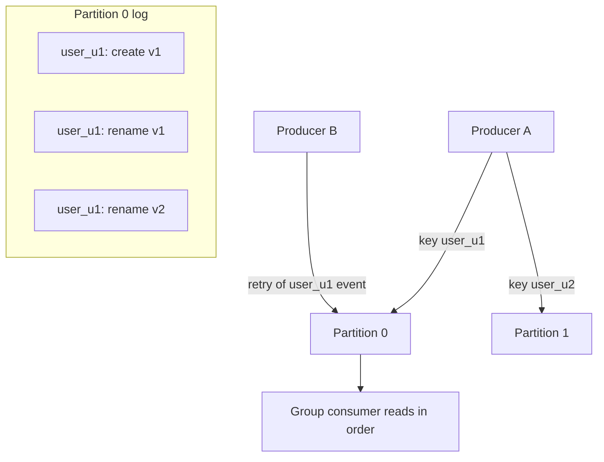

# Kafka Ordering Guarantees

## 1. One-Line Definition
Kafka guarantees ordering **within a partition only**: messages appended to one partition are read back in append order, and routing related messages to the same partition via the same key is the mechanism that gives you a strict, replayable order for a logical entity.

## 2. Why Do We Need It?
Events about one thing must be processed in the order they happened — `payment.authorized` before `payment.captured`, an edit before its correction. In a distributed log with many producers, "global order" is both impossible and unnecessary. The requirement is almost always *per entity* (per user, per order, per device). Ordering by key gives exactly that while allowing massive parallelism across different keys.

## 3. Simple Intuition
A hospital's per-patient charts. Each patient has one folder (partition) where every note goes in chronological order — the nurse reads them top-to-bottom. Different patients have different folders on different shelves (parallelism) — no hospital could maintain race-order across all patients at once, and nobody needs it. The rule is: **same patient → same folder**. If a nurse accidentally writes to two folders for one patient, the timeline breaks.

## 4. What Happens Without It?
Random partition assignment: a user's `create` event lands on partition 0 and their `delete` on partition 3 — consumer processes `delete` before `create` → data corruption, double charges, lost state. "Just sort all events globally" doesn't scale. Ordering must be enforced at the routing layer, not fixed at read time.

## 5. Core Idea
- **The guarantee (exact):** within a single partition, messages appear to consumers in the order they were appended. Appended order = the order producers' requests hit the leader's log.
- **Key → partition:** `partition = hash(key) % numPartitions` (with defaults; sticky hashing for no-key). Same key → same partition → ordered.
- **A logical stream is one partition per key granularity.** Choose the key so ordering needs align: order_id (all events for an order), user_id (everything for a user), device_id, customer to stripe.
- **The three ways ordering breaks:**
  1. *Changing the key or partition count* → same logical entity can jump partitions → order lost. (This is why repartitioning is expensive.)
  2. *Multiple producers with retries* → a retried earlier message can be appended after a later one if the producer doesn't serialize per key. (Idempotent producer + per-partition sequencing still preserves append order.)
  3. *Reading across partitions* → no global order; consumers process partitions concurrently.
- **Consumer side:** a partition is assigned to one consumer per group → that consumer sees ordered stream (if it processes sequentially). Parallelizing *within* the partition (multi-threaded processing) silently breaks order unless you group by key thread-pools.

## 6. Important Terminology

| Term | Simple Meaning |
|------|----------------|
| Partition | Ordering domain; a single ordered log |
| Key | Routing token; hash(key) → partition |
| Per-key order | Same key's events arrive in order |
| Partition count | Constant per topic; changing breaks key routing |
| Ordered consumer | Processes one partition's records in thread-order |
| Idempotent producer | Retry-safe, preserves per-partition sequence |

## 7. Basic Architecture



## 8. Request or Data Flow
1. Producer hashes `key=user_u1` → partition 0; appends create, then rename actions in request order.
2. Requests to the leader append to the log in arrival order (per partition serialized).
3. Consumer (sole owner of partition 0 in the group) reads create → rename v1 → rename v2 in order.
4. Without keys, two requests race into different partitions → a consumer could see rename before create.

## 9. Practical Example
**Banking microflows (assumptions):** topic `account.events`, key = `account_id`, 32 partitions.
- Events: `open`, `deposit`, `withdraw`, `freeze`, `close`. Same account always lands on the same partition → ledger applies in exact sequence.
- A different account's events go to another partition → the 32 partitions run in parallel across 8 consumers.
- `withdraw` then `open` arriving *in the same partition* after a repartition (because partition count changed) would corrupt the ledger — hence partition count frozen at deploy-time with headroom, and any migration handled by re-keyed topics + a migration window, never in place.

## 10. Scaling
- **Scale = partition count.** Ordering-per-key is preserved as long as key → partition mapping is stable.
- **Partition growth** is technically possible (increase count) but `hash(key) % N` changes every mapping → keys jump partitions → order breaks. Growth plans: provision the count with a growth multiple up front, or use a two-level design (logical buckets → stable buckets → partitions) so repartitioning doesn't remap keys.
- **Hot keys:** a single huge key (celebrity user) overflows one partition's throughput; splitting it into sub-keys breaks ordering unless the consumer sorts/merges. Accept the hot partition or redesign the ordering contract.

## 11. Reliability and Failure Scenarios

| Failure | Happens | Detection | Recovery | Trade-off |
|---------|---------|-----------|----------|-----------|
| Repartition | Keys remap → order breaks | Replay compares | Re-key topics, migration window | trust concurrency |
| Retry reorder | Retried msg appends later | LEO/watermark diff | Idempotent producer serializes | sequenceIds |
| Multi-thread consumer | In-partition reorder | Race in state | Thread-per-key pools | complexity |
| Failover to unclean leader | Tail loss/reorder | Offset discontinuity | Prefer ISR election | availability |
| Producer dual-writes to 2 keys | Different orders for same entity | Data drift checks | Use one key per entity | key design |

## 12. Consistency and Correctness
- *Across partitions:* strictly **no** order guarantee. If you "need order," define the entity and key properly.
- *After failover:* a new leader from ISR preserves the committed tail's order; unclean election may drop the tail but the *remaining* log is still in order.
- *Replay:* consumer re-reading from an offset sees the same per-partition sequence — ordering is replayable, which is the whole point of offsets.

## 13. Performance
- Keyed users: hash is fast, partitions parallelize. Sticky/produce to few partitions maximizes batching (higher throughput) but concentrates load — balance.
- Larger partition counts increase parallelism *and* metadata overhead; modest partition counts keep multi-partition fan-out and rebalance cheap.
- Compaction-friendly: order per key makes `compact` logs sensible (only latest per key retained) when combined with keyed writes.

## 14. Security
- Keys are business identifiers — treat as PII-sensitive (do not log raw; encrypt if needed).
- Restrict changing topics' partition counts or key semantics to ops with change control; a buggy remap is a data-corruption incident, not a perf event.

## 15. Trade-Offs

| Choice | Advantages | Disadvantages | When to Use |
|--------|------------|---------------|-------------|
| No key (round-robin) | Max parallelism | No per-entity order | Stateless telemetry |
| Key = fine entity | Perfect per-entity order | Hot keys, skewed partitions | Orders, accounts, users |
| Key = coarse entity | Balanced-ish | Over-order (mixes unrelated) | Simple pipelines |
| Keyed + compaction | Order + state-of-record | Key-specific semantics | KTables, state stores |
| Read-time sort | Global order illusion | Expensive, unscalable | Offline/nearline only |

## 16. Common Mistakes
- Assuming *topic* order — only partition order exists.
- Runtime partition-count growth without a migration plan (silently breaks ordering).
- Adding threads inside a single partition's consumer without keyed work-stealing (reorders within the partition).
- Choosing to rely on producer arrival order without idempotent producer for retried messages.

## 17. HLD vs LLD Boundary
HLD: per-entity ordering needs, key design, partition-count sizing with headroom, consumer concurrency model, repartition migration story. LLD: serializer choice for keys, per-thread-queue consumer implementation, idempotent producer flags, partitioner config.

## 18. Interview Questions

### Beginner
- What ordering does Kafka actually guarantee?
- What makes a good partition key?

### Intermediate
- Two events about the same order arrive via retries from different processes. How do you keep them ordered?
- Your consumer processes one partition with 8 threads. Where does ordering break, and how do you fix it?

### Advanced
- Design an `account.events` stream with per-account order, 100k msg/sec, and partition-count stability across a 5× scale-up. Justify key + partition count + migration path.
- Explain exactly why repartitioning a keyed topic is a correctness change, and propose an invariant-preserving migration.

## 19. Interview Memory Summary

> [!abstract]- Interview Memory Summary

### Remember

- Order is per partition, never topic-wide.
- Same key → same partition → ordered logical stream for that entity.
- `hash(key) % N` makes partition count a correctness constant — changing it remaps keys and breaks order.
- Retries can reorder without an idempotent producer.
- Consumer threads within a partition can reorder what Kafka delivered in order.
- Example worth keeping: the account.events ledger and the repartition-migration reasoning.

### 30-Second Explanation

Pick the key for the entity you must order, freeze the partition count, accept per-partition-only in every other axis, and keep consumers handling a partition with one ordered thread (or keyed pools).

### Interview Traps

- Assuming *topic* order — only partition order exists.
- "We'll just sort at read time" or "repartition to grow" as free answers — both break the ordering contract.
- Adding threads inside a single partition's consumer without keyed work-stealing (reorders within the partition).
- Relying on producer arrival order without an idempotent producer for retried messages.

### Key Trade-Off

Per-entity ordering (key → one partition) forces a partition count that must stay fixed and can create hot keys — you trade global parallelism and migration flexibility for a strict, replayable per-entity order.

## 20. Related Concepts

### Prerequisites

- [[kafka-architecture|Kafka Architecture]]
- [[kafka-producers-consumers|Kafka Producers and Consumers]]

### Commonly Used Together

- [[kafka-replication|Kafka Replication]]
- [[kafka-retention|Kafka Retention]] (compaction + keyed writes)
- [[kafka-rebalancing|Kafka Rebalancing]]
- [[shard-key|Shard Key]]
- [[partitioning-vs-sharding|Partitioning vs Sharding]]
- [[consumer-lag|Consumer Lag]]

### Advanced Concepts

- [[kafka-delivery-guarantees|Kafka Delivery Guarantees]]

Related planned topics (not authored yet): hot-key mitigation, two-level bucketing for stable repartitioning, producer-partitioner deep dive, cross-partition aggregate ordering.

## 21. References
Apache Kafka docs (producer partitioning, ordering guarantees), Confluent "The 5 most common Kafka consumer group issues" ordering notes. Verify partitioner behavior at your version.

## 22. Active Recall

Test yourself before revealing each answer.

> [!question]- What ordering does Kafka actually guarantee, exactly?
> Ordering within a single partition only: messages appear to consumers in the order they were appended to the leader's log. No ordering exists across partitions of a topic. Related messages are ordered only if routed to the same partition via the same key.

> [!question]- What makes a good partition key?
> Key = the entity whose events must be ordered (order_id, user_id, account_id, device_id). It should have high cardinality (even spread), co-locate the events that must be sequenced, and never change for a given entity — because the mapping `hash(key) % N` must stay stable.

> [!question]- Two events about the same order arrive via retries from different processes. How do you keep them ordered?
> Use the same key (`order_id`) so both go to the same partition, and an idempotent producer so retried records carry per-partition sequence numbers the broker dedups — preserving append order. Without idempotence, an earlier event can retry into the log after a later one.

> [!question]- Your consumer processes one partition with 8 threads. Where does ordering break, and how do you fix it?
> Kafka delivers the partition in order, but 8 threads racing through it can apply events out of order. Fix: process a partition with one ordered thread, or route work through per-key threads (a thread pool hashed by key) so each key's events are still serialized. Never parallelize blindly inside a partition.

> [!question]- Design an `account.events` stream with per-account order, 100k msg/sec, stable across a 5× scale-up.
> Key = `account_id`; partition count chosen with headroom so `hash(key) % N` never changes at scale (e.g., 3–5× expected need). For genuinely unbounded growth, use a two-level design (logical bucket → stable buckets → partitions) so repartitioning doesn't remap keys. Avoid in-place repartitioning — it's a data migration, not a config change.

> [!question]- Why is repartitioning a keyed topic a correctness change, and what migration preserves order?
> `hash(key) % N` remaps every key when N changes, so one account's events can land on different partitions — its per-partition order is silently lost. A safe migration writes to a new re-keyed topic with the target partition count, runs the old and new simultaneously with a cutover, and never changes N on the live topic.

> [!question]- Failure: a single celebrity user's key creates a hot partition. Options?
> The hot key overflows one partition's throughput. Options: split the key into sub-keys (breaks strict order unless the consumer sorts/merges), cache the hot entity's reads aggressively, or accept the skewed partition as the known cost of the ordering contract. The fix must be chosen because ordering is the constraint.

> [!question]- Interview scenario: "We need global order across the whole order stream." How do you respond?
> Challenge the requirement: almost always you need per-entity order (per order/per user), which keys give you while keeping parallelism. True global order across all events is both unnecessary for most systems and not what Kafka provides. Redefine the entity and key, and set the partition count to stay stable.

> [!question]- Do retries break ordering even with same-key routing? Explain the mechanism.
> They can: a request that timed out after append can retry later than a subsequent request from the same producer, appending out of order in the same partition. The idempotent producer fixes it — each record carries a sequence; the broker only accepts the next expected sequence, so retries land in the correct order instead of duplicating.

## 23. When Should I Use This?

### Use it when

- Processing must happen in event order per logical entity (per user, order, account, device).
- You need replayable per-entity history (consumers re-reading see the same sequence).
- You can accept per-partition (not global) ordering in exchange for massive parallelism.
- You pair it with an idempotent producer so retries never reorder or duplicate.

### Avoid it when

- Order requirements span unrelated entities in a global timeline — Kafka can't, and you don't need it.
- A single key dominates (hot key) and you can't split it without breaking your ordering contract — accept skew or redesign.
- You expect to grow partitions later — the fixed partition count is the correctness constant.
- Stateless telemetry where any order works — random/sticky routing is simpler and more balanced.

### What problem does it solve?

Without routing discipline, a user's `create` and `delete` land on different partitions and a consumer processes them out of order — data corruption. The bottleneck is "global sort" not scaling. Ordering by key fixes it: same key → same partition → strict per-entity order, while different keys parallelize across partitions — a distributed ordering that scales.

### What problem does it NOT solve?

Global/topic-wide ordering, hot-key skew (one entity still caps at one partition's throughput), and repartitioning growth — partition count is frozen by design, and cluster growth must go through a migration topic, never in-place remapping.

## 24. Decision Connections

Decisions that go together with Kafka ordering:

- [[kafka-producers-consumers|Kafka Producers and Consumers]] — the key is chosen at the producer; idempotence protects its order.
- [[shard-key|Shard Key]] — same choice in database sharding: high cardinality + co-location = even, ordered placement.
- [[kafka-replication|Kafka Replication]] — ISR failover keeps the committed tail in order; unclean election drops it out of order.
- [[kafka-retention|Kafka Retention]] — order per key is what makes compaction (keep latest per key) meaningful.
- [[kafka-rebalancing|Kafka Rebalancing]] — who owns a partition changes, but per-partition order within an ownership window is preserved.
- [[partitioning-vs-sharding|Partitioning vs Sharding]] — Kafka partitions are the log-flavored cousin of DB sharding.
- [[kafka-cluster|Kafka Cluster]] — partition count is fixed at topic creation with headroom.

Decision tree:

```
Ordering requirements exist?
    |
    +-- Global order across all events required?
    |      → not Kafka's model; single-partition or rethink the requirement
    |
    +-- Per-entity order needed (user/order/account)?
    |      → key = entity, same key → same partition
    |         |
    |         +-- Partition count sized w/ growth headroom → [[kafka-cluster|Kafka Cluster]]
    |         +-- Retries must not reorder?                → idempotent producer
    |         +-- Hot entity expected?                     → [[shard-key|Shard Key]] / sub-key + sort
    |         +-- Consumer threads within a partition?     → keyed thread pools
    |
    +-- No ordering needed?
           → random/sticky routing, max parallelism
```