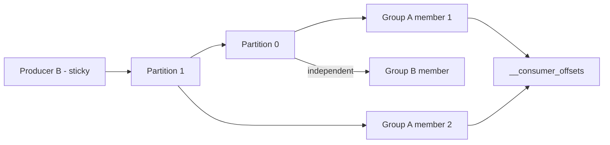

# Kafka Producers, Consumers, and Consumer Groups

## 1. One-Line Definition
Kafka producers append records to topic partitions (with retries, batching, and acks), while consumers pull records and commit offsets — and a consumer group coordinates its members so each partition is processed by exactly one member, giving both load sharing and independent progress per group.

## 2. Why Do We Need It?
A production stream needs controlled writers (no lost/duplicate writes, good throughput, correct partition selection) and controlled readers (fail-safe position tracking, parallel processing, fault-tolerant progress). Producer configs decide *durability*; consumer behavior decides *progress and correctness*. The consumer group solves "many workers, one stream, no double-processing" without global locks.

## 3. Simple Intuition
- **Producer** is a careful letter-writer: batches several letters, compresses them, and keeps sending to the post office until he gets the receipt level he asked for (ack). If unsure (timeout), he re-sends — so the post office may have duplicates, but no loss.
- **Consumer** is a reader with a bookmark saved to a safe box (`__consumer_offsets`). If anything happens mid-book, he re-opens at the bookmark.
- **Consumer group** is a reading club: the books' chapters (partitions) are divided among members, one chapter per member at a time. A member leaving/joining triggers a re-split (rebalance), but each chapter is still read by at most one member at a time — no lost "you read this, I read this" collisions.

## 4. What Happens Without It?
Naive producers: fire-and-forget sends lose events on timeout; no retry → silent gaps; no batching → network saturation. Naive consumers: reading without committed offsets re-reads everything (or skips everything) on restart; multiple workers pulling the same partition double-process every event. No group → adding workers causes duplicates or holes.

## 5. Core Idea
- **Producer essentials:**
  - *Partitioning:* explicit partition, key-hash (same key → same partition → ordering), or round-robin/sticky for balance.
  - *Acks:* `0` fire-and-forget, `1` leader wrote, `all/-1` all ISR wrote. Higher = safer, slower.
  - *Retries + idempotence:* with `enable.idempotence=true`, retries carry sequence IDs so duplicates are deduped server-side (see kafka-delivery-guarantees).
  - *Batching/compression:* `linger.ms`, `batch.size`, compression → big throughput wins.
- **Consumer essentials:**
  - *Poll loop:* consumers own their thread; call `poll()` to fetch a batch, process, then commit.
  - *Offset commits:* auto-commit (periodic, at-least-once) vs manual commit (sync = safest, async = faster). Commit **after** processing; crash between process and commit → reprocess (duplicate) — the honest default.
  - *`auto.offset.reset`:* `earliest` (start from 0/no committed offset), `latest` (from now), `none` (error if none).
  - *Position:* `seek()` / assigning offsets enables replay, time-based lookups.
- **Consumer groups:** each group reads the whole topic once; partitions are assigned to members (see kafka-rebalancing). Group A and Group B each read every message independently (pub/sub across groups; point-to-point within a group). Kafka stores committed offsets in `__consumer_offsets` (an internal, compacted topic).
- **`group.instance.id` / static membership:** optional; reduces rebalances on rolling restarts.

## 6. Important Terminology

| Term | Simple Meaning |
|------|----------------|
| Producer | Client that appends records to partitions |
| Acks | How many replicas must confirm a write |
| Idempotent producer | Retry-safe via server-side dedup of sequences |
| Linger / batching | Hold records briefly to send bigger batches |
| Consumer | Client pulling records and committing offsets |
| Poll loop | The fetch → process → commit cycle |
| Consumer group | Members split a topic's partitions |
| Committed offset | Progress checkpoint for a group+partition |
| `earliest` / `latest` | Where to start with no committed offset |
| `__consumer_offsets` | Internal topic storing committed offsets |

## 7. Basic Architecture



## 8. Request or Data Flow
1. Producer computes partition (key hash), batches records, sends to leader.
2. Leader acks per `acks`; idempotent producer retries carry sequence → dedup.
3. Consumer in group polls its assigned partitions; processes records.
4. After processing batch, the consumer commits offset to `__consumer_offsets`.
5. Crash before commit → next poll re-reads from last committed offset → at-least-once.

## 9. Practical Example
**Notifications pipeline (assumptions):** topic `user.actions`, 12 partitions, 8 workers.
- Producer: events keyed by `user_id` → per-user order preserved; `acks=all`, idempotent → no loss under retry.
- Consumer group "email-notifier": 8 members, ~1–2 partitions each. Restart one member → its partitions rebalance to a neighbor → the neighbor resumes from committed offsets, duplicates stopped by consumer-side dedup by `(eventId)`.
- A separate group "analytics" reads the *same* events for reporting — fully independent from the email group.

## 10. Scaling
- **Producers:** scale client count freely; each writes to whatever partition keys map to. Watch broker-side throttling/quotas.
- **Consumers:** scale a group up to partition count (one member max per partition). Beyond that, add partitions (with key-remapping caveat) or accept idle members.
- **Replicates vs groups:** more groups = more total reads (read amplification; broker bandwidth).
- **Balance vs fairness:** range vs round-robin assignors vary; rebalance strategy affects churn timing (cooperative/`KIP-429` reduces stop-the-world).

## 11. Reliability and Failure Scenarios

| Failure | Happens | Detection | Recovery | Trade-off |
|---------|---------|-----------|----------|-----------|
| Producer timeout after send | Possible duplicate | Sequence dedup | Idempotent producer | sequence overhead |
| Consumer crash mid-batch | Reprocess from commit | Group rebalance | Dedup on consumer | at-least-once |
| Consumer too slow | Lag growth | Lag metrics | Add member/partition | rebalance churn |
| Commit lost | Reprocess old batch | Offset gap | Manual commit strategy | throughput |
| Poison record | Member wedged | Lag + no progress | DLQ / drop | investigation |

## 12. Consistency and Correctness
- Producer: at-least-once with retries, exactly-once *within* Kafka with idempotence/transactions. Ack policy is the durability dial.
- Consumer: **at-least-once** by default (process-then-commit). Exactly-once *to external systems* is impossible without downstream idempotency — dedup by event ID, or transactional consume-process-produce (for Kafka-to-Kafka).
- Ordering: per partition per key; consumer restarts must not assume topic-wide resumption.

## 13. Performance
- Producer batching: raise `linger.ms` (up to ~10–100ms), `batch.size` (16–64KB) → most of the throughput gains. Compression priority: zstd > lz4 > snappy for high compression ratio; gzip heaviest.
- Consumer: process in batches, avoid per-record blocking calls; commit async for throughput (accept at-least-once), sync on shutdown.
- Fetch: `fetch.max.bytes`, prefetch (`fetch.max.wait.ms`) trade latency for chunk size.

## 14. Security
- Mutual TLS/SASL for clients; ACLs: producer → WRITE/DESCRIBE on topic; consumer → READ on topic + WRITE/READ on `__consumer_offsets`.
- Validate/limit who can create groups and topics; quotas per client to stop noisy tenants. Never log event payloads (PII) in consumer/observer code.

## 15. Trade-Offs

| Choice | Advantages | Disadvantages | When to Use |
|--------|------------|---------------|-------------|
| acks=0 | Fastest | Silent loss | Telemetry, disposable |
| acks=1 | Fast, most-loss | Leader crash can lose tail | Non-critical streams |
| acks=all + idempotent | No loss/dupes within Kafka | Higher latency | Production/ledger-adjacent |
| Auto-commit | Zero code | Grace-period reprocessing | OK with at-least-once |
| Manual sync commit | Exactly per batch | Slower | Correctness-critical sinks |
| One group/case | Independent progress | Read amplification | Correct model |

## 16. Common Mistakes
- Committing offsets *before* processing → silent message loss.
- `auto.offset.reset=latest` on a customer-facing replay topic → missed history on deploy.
- Raising consumers beyond partition count (wasted instances).
- No idempotency on the producer with manual retries → duplicate writes.
- Doing heavy serial work inside the poll loop → consumer stalls and rebalance storms.

## 17. HLD vs LLD Boundary
HLD: consumer-group topology, ack policy, ordering key strategy, offset start strategy, throughput sizing, READ/WRITE ACL plan. LLD: poll-loop code, serde, batching/compression configs, commit strategy, retry/backoff wrappers.

## 18. Interview Questions

### Beginner
- What do the three acks values promise and cost?
- Why is at-least-once the honest default for consumers?

### Intermediate
- A consumer crashes between processing and committing. What happens, and how do you make the consumer safe?
- When does adding a consumer to a group stop helping?

### Advanced
- Design the producer + consumer setup to deliver BOTH per-user ordering and 100k msg/sec with no loss.
- How do you implement a replay back to a point-in-time offset for one partition without disturbing other groups?
- Design and justify a rebalance strategy for 100 consumers across 500 partitions during a rolling deploy.

## 19. Interview Memory Summary

> [!abstract]- Interview Memory Summary

### Remember

- Producers: acks + idempotence set durability; batching/compression set throughput; the key sets the partition.
- Consumers: poll → process → commit; committing after processing is what makes at-least-once the honest default.
- Groups give one-member-per-partition sharing and independent progress per group.
- Offsets live in `__consumer_offsets`; `earliest`/`latest` define the cold start.
- Consumer scaling stops at partition count — grow partitions to grow the group.
- Example worth keeping: the user_id-keyed notifications pipeline with crash-recovery replay.

### 30-Second Explanation

Writes: pick partition, batch, ack to your durability budget. Reads: pull batches, commit after process, let the group own who-reads-what, de-duplicate downstream. That is the whole API contract.

### Interview Traps

- Answering "how do consumers avoid duplicates?" with "auto-commit" — auto-commit gives the *worst* duplicate profile; the safe model is process-then-manual-commit plus consumer-side dedup.
- Committing offsets before processing → silent message loss.
- Raising consumers beyond the partition count (wasted instances).
- Heavy serial work inside the poll loop → consumer stalls and rebalance storms.
- `auto.offset.reset=latest` on a replay topic → missed history on deploy.

### Key Trade-Off

Producers/consumers trade end-to-end exactly-once for simplicity: within Kafka you get at-least-once plus idempotence (or transactions), and every hop past the broker needs your own dedup — durability on the write side, commit discipline on the read side.

## 20. Related Concepts

### Prerequisites

- [[kafka-architecture|Kafka Architecture]]
- [[kafka-cluster|Kafka Cluster]]

### Commonly Used Together

- [[consumer-lag|Consumer Lag]]
- [[kafka-rebalancing|Kafka Rebalancing]]
- [[kafka-ordering|Kafka Ordering]]
- [[kafka-delivery-guarantees|Kafka Delivery Guarantees]]
- [[event-driven-architecture|Event-Driven Architecture]]

### Alternatives

- [[message-queue|Message Queue]] (classic queue consumer semantics when Kafka groups are overkill)

### Advanced Concepts

- [[delivery-semantics|Delivery Semantics]]

Related planned topics (not authored yet): cooperative rebalancing (KIP-429), static membership, backpressure/flow control, schema registry / serde.

## 21. References
Apache Kafka producer/consumer configs and consumer-group API docs. Verify defaults (e.g., idempotence, static members) at your version.

## 22. Active Recall

Test yourself before revealing each answer.

> [!question]- What do the three acks values promise and cost?
> `acks=0` — fastest, fire-and-forget, can silently lose (telemetry). `acks=1` — leader confirmed, fast, but a leader crash after ack can lose the tail. `acks=all` (-1) — all in-sync replicas confirm, slowest, durable under failure. Higher acks buys durability at write-latency cost.

> [!question]- Why is at-least-once the honest default for consumers?
> Because the atomic unit is "process then commit." If a consumer crashes between processing a batch and committing its offset, the next poll re-reads from the last committed offset — those records are processed again. You only get at-most-once by risking loss, so at-least-once + consumer-side dedup is the reliable baseline.

> [!question]- A consumer crashes between processing and committing. What happens, and how do you make it safe?
> The group rebalances the partition to another member, which resumes from the last committed offset → the uncommitted batch is reprocessed (duplicates). Fix: process idempotently (dedup by event ID with the downstream sink), and keep the process→commit order; never commit before processing.

> [!question]- When does adding a consumer to a group stop helping?
> At the partition count. Each partition is read by at most one member per group, so a group of size > partitions has idle members that still join and rebalance. Beyond the ceiling you must add partitions (with key-remapping caveats) to scale further.

> [!question]- Design producer + consumer setup for BOTH per-user ordering and 100k msg/sec with no loss.
> Producer: key = `user_id` → same user's events to one partition (order); `acks=all` + idempotent producer (no loss, no dup under retry); batching + compression for throughput. Consumers: one group sized to partition count, one ordered poll loop per partition; commit after processing; dedup at sinks. Ordering per user is preserved because the key never changes.

> [!question]- How do you replay one partition back to a point-in-time offset without disturbing other groups?
> Point that consumer at the desired offset (seek), either by computing the offset for a timestamp or from a stored checkpoint, and re-read forward — other groups are independent and keep their own offsets. Just ensure the replay consumer is idempotent or bound its side effects.

> [!question]- Failure: a consumer gets too slow and lag grows. What's the detection and the two-part fix?
> Detect via per-partition lag metrics (`consumer-lag`). Fix short-term: add members (up to partition count) or fix processing time; fix structural: raise partitions (key-aware), increase batching, or raise `max.poll.interval` so the group doesn't eject it during bursty work.

> [!question]- Interview scenario: "auto-commit gives me no duplicates." How do you respond?
> Correct that gently: auto-commit commits periodically between polls, so a crash reprocesses whatever was polled but not yet committed — and committed-but-not-processed offsets can still be lost on the grace period's edge. The deterministic profile is manual commit after processing, plus downstream idempotency; auto-commit is a convenience, not a guarantee.

> [!question]- Why does a producer's key matter even for throughput?
> Key routing (hash) makes same-key records land on the same partition — needed for per-key ordering. Random/sticky routing maximizes balance and batching. The error is using random keys for ordered streams (order breaks) — key choice is the ordering-vs-parallelism dial.

## 23. When Should I Use This?

### Use it when

- You need controlled writes with a durability budget (acks) and no silent loss on retries.
- Multiple workers must split one stream without double-processing — a consumer group.
- Independent downstream systems each need the full stream at their own pace — separate groups.
- You want crash-safe progress tracking via committed offsets.

### Avoid it when

- Producers need per-message transaction semantics with external systems — that's out-of-scope here.
- A single worker consuming a tiny queue suffices — classic queue semantics are simpler.
- Exactly-once to a database is non-negotiable — you must add sink idempotency on top.
- Your team treats auto-commit as "safe" — the at-least-once reality will bite.

### What problem does it solve?

Naive writers lose or duplicate events, and naive readers re-read everything or double-process on restart. The bottleneck is unmanaged write/read failure. Producers fix it with partition selection + acks + idempotence; consumers fix it with the poll→process→commit loop and groups that assign each partition to exactly one member — progress survives restarts with at-least-once semantics.

### What problem does it NOT solve?

Exactly-once to external sinks (that's your idempotent sink code), topic-wide ordering (per partition only), and rebalance storms (design those via assignor/timeouts) — plus it requires you to reason about committers, or duplicates and losses return.

## 24. Decision Connections

Decisions that go together with Kafka producers and consumers:

- [[kafka-cluster|Kafka Cluster]] — partition count, set once, bounds consumer scaling and producer key space.
- [[kafka-ordering|Kafka Ordering]] — the producer key decides per-entity order and partition skew.
- [[kafka-delivery-guarantees|Kafka Delivery Guarantees]] — acks/idempotence/transactions are the producer+consumer correctness stack.
- [[kafka-rebalancing|Kafka Rebalancing]] — group membership changes reassign partitions; commit-on-revoke is how progress survives.
- [[consumer-lag|Consumer Lag]] — the metric that tells you whether consumer scaling matches ingest.
- [[delivery-semantics|Delivery Semantics]] — the general at-most/at-least/exactly-once vocabulary these configs implement.
- [[outbox-pattern|Outbox Pattern]] — the producer-side pattern when a transaction must also update a database.

Decision tree:

```
Writes: what durability does the stream need?
    |
    +-- Accept loss, max speed?       → acks=0
    +-- No loss on broker crash?      → acks=all + minISR>=2
    |      +-- Retries may duplicate? → [[kafka-delivery-guarantees|Kafka Delivery Guarantees]] (idempotent producer)
    +-- Per-key ordering required?    → key = entity in producer
    |      → [[kafka-ordering|Kafka Ordering]]

Reads: how must work be shared?
    |
    +-- One stream, one worker, simple?     → classic [[message-queue|Message Queue]]
    +-- Split partitions across N workers?  → consumer group (size ≤ partitions)
    |      → [[kafka-rebalancing|Kafka Rebalancing]]
    +-- Independent full-stream consumers?  → one group each
    +-- Crash-safe progress?                → commit AFTER processing
```