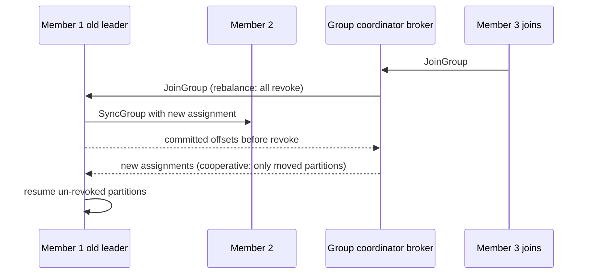

# Kafka Rebalancing (Consumer Group Rebalance)

## 1. One-Line Definition
A consumer-group rebalance is the group-coordination event where Kafka reassigns partitions among members — triggered when members join, leave, or fail (or partitions/topics change) — and it temporarily pauses consumption while "who reads what" is decided.

## 2. Why Do We Need It?
A consumer group is elastic: members start, stop, scale, crash. Someone must decide which member owns which partition so that (a) every partition is read by exactly one member (no double-processing), (b) work is spread evenly, and (c) progress survives restarts. That decision is the Rebalance, coordinated through the group leader + broker-based group coordinator.

## 3. Simple Intuition
A juggling circle re-splitting chapters: you four readers split a 12-chapter book (12 partitions, 4 members). If one reader leaves, the book must be re-split among the remaining three — while the re-split happens, everyone stops reading so nobody steps on a segment someone else takes. That stop is the rebalance "churn": short when everyone re-shares, but during rolling deploys it can keep firing (a member restarts → rebalance → restarts again if quickly redeployed).

## 4. What Happens Without It?
Without coordination: two members both claim partition 5 and process it concurrently (duplicate/inconsistent states), partition 7 is read by no one (gap in the stream), and a new member can't join without manual assignments. Static config breaks the moment anything moves. Rebalance is the price of elasticity — the goal is making it fast and rare.

## 5. Core Idea
- **Who coordinates?** The broker tracks each group via a **group coordinator** (a broker owning `__consumer_offsets` for that group). Members heartbeat; the **group leader** (one elected member) runs the assignment algorithm for everyone.
- **Protocol:** a member joins the group (`JoinGroup`), the leader computes assignments (`SyncGroup`). On failure, the coordinator detects a missed heartbeat → triggers the protocol → partitions revoked/re-assigned.
- **Assignors (who-gets-what):**
  - *Range* (`range`): segments of ordered partitions per topic; can be uneven across topics.
  - *RoundRobin* (`roundrobin`): alternates partitions across members → even distribution.
  - *Sticky* (`sticky`): roundrobin-like balance that *preserves* as many prior assignments as possible (fewer moves).
  - *Cooperative sticky* (`cooperative-sticky`, KIP-429): **incremental** rebalance — revokes only the partitions that must move, so members mostly keep consuming (no full stop).
- **Trigger vectors:** member join/leave/crash, `session.timeout` expiry (missed heartbeat), new partition on a subscribed topic (pattern subscribe), assignor change, coordinator re-election.
- **Side-effects:** during a rebalance, partitions are paused while revoked; the member should commit offsets before revoking so the new owner starts at the last commit. Forgetting this = reprocessing on every churn.

## 6. Important Terminology

| Term | Simple Meaning |
|------|----------------|
| Group coordinator | Broker broker that manages group state |
| Group leader | Member that computes the assignment |
| Heartbeat / session timeout | Liveness signal; miss it → considered dead |
| JoinGroup / SyncGroup | Rebalance handshake steps |
| Assignor | Algorithm mapping partitions to members |
| Cooperative rebalance | Move only what must move (sticky) |
| Rebalance in progress | Partitions paused during assignment |
| Generation | A version number per rebalance (guard against stale members) |

## 7. Basic Architecture



## 8. Request or Data Flow
1. A member restarts or a new one joins → sends `JoinGroup` to coordinator.
2. Coordinator bumps the **generation**, all members revoke partitions (full rebalance) or only the coordinator's affected set (cooperative).
3. The current group leader fetches all members' subscriptions, runs the assignor, sends `SyncGroup` with assignments.
4. Members commit offsets for revoked partitions (if honoring best practice) and start fetching their new partitions.
5. Heartbeats resume; if a member stops heartbeating (`session.timeout`), the cycle repeats minus that member.

## 9. Practical Example
**24-partition topic, 4 consumers, rolling deploy (assumptions):**
- Full-rebalance assignor: each of 4 deploys = 4-6 stop/reassign cycles → minutes of paused consumption + reprocessing without commit-on-revoke. Group owner's `max.poll.interval` can fire, causing a *non-cooperative* ejection → worse churn.
- With `cooperative-sticky` + proper commit-on-revoke: each deploy moves only the partitions of the one restarting member; others consume right through. Deploy becomes ~1 short pause per member.
- With static membership (`group.instance.id`), a quick restart doesn't trigger a rebalance at all — partitions stay assigned; the member just resumes.

## 10. Scaling
- **Scale by rebalance, but plan for it:** adding members re-splits work; the cost is churn, proportional to (partitions × members) for full rebalances.
- **Partition count ceiling:** members beyond partitions are idle but still join/rebalance. Set group size ≈ partition count.
- **Reducing churn:** cooperative/sticky assignors, higher `session.timeout` for slow-heavy consumers, `max.poll.interval` > processing time, static membership for frequent restarts, join just enough members.
- **Read-availability:** during rebalance the topic read is partially paused; for traffic-light continuity, prefer cooperative assignment and staggered deploys.

## 11. Reliability and Failure Scenarios

| Failure | Happens | Detection | Recovery | Trade-off |
|---------|---------|-----------|----------|-----------|
| Member crashes | Rebalance fires | Heartbeat timeout | Reassign to survivors | churn |
| Slow consumer > max.poll | Force-ejected, rebalanced | Max poll interval alert | Fix processing, tune interval | churn/dupes |
| Coordinator switch | Group re-initializes | — | New coordinator takes over | brief pause |
| Commit not made on revoke | New owner reprocesses | Duplicate symptoms | Commit before revoke | at-least-once |
| Rebalance storm | Repeated full cycles | Group-level churn metric | Cooperative/sticky + static members | assignor complexity |

## 12. Consistency and Correctness
- **Each partition, one member per group at a time** — guaranteed by the coordinator + generation guards (a stale member's writes are fenced). But *offsets* are only safe if you commit before revoking; otherwise revoke → next owner restarts from an older commit → reprocessing (harmless if idempotent).
- **Ordering during rebalance:** per-partition order is preserved within a member's ownership window; stopping/starting mid-partition yields "at-least-once, possibly out-of-batch restarts." Idempotent consumers absorb it.

## 13. Performance
- Rebalance cost scales with #partitions (assignor over assignments, offset commits per partition). Cooperative assignors pay only for moved partitions.
- Heartbeat frequency vs `session.timeout`: frequent heartbeats = faster failure detection, more network chatter; too-slow = wasteful churn. Long `max.poll.interval` required for heavy per-batch work but delays detection.
- Don't set `session.timeout` tiny just to be snappy — a GC hit or slow batch evicts healthy members, causing the exact churn you feared.

## 14. Security
- Group access should be ACL-restricted (who may join/read a group) — an attacker joining a group can steal partitions/offsets.
- Guard `group.id` namespace per team (prevent accidental collisions, e.g., two teams reusing `my_group` → fighting over partitions).
- Consumers of sensitive topics should be restricted by group ACL, not open.

## 15. Trade-Offs

| Choice | Advantages | Disadvantages | When to Use |
|--------|------------|---------------|-------------|
| Full rebalance (range/roundrobin) | Simple, even | Stop-the-world churn | Small groups, rare joins |
| Sticky | Better evenness, fewer moves | Assignor compute | Medium groups |
| Cooperative sticky | Almost-zero churn | Complexity, partial revoke handling | Large/elastic groups, rolling deploys |
| Static membership | No churn on restart | Manual instance IDs, stricter config | Short-lived restarts (serverless?) |
| Few members vs partitions | Fewer rebalance nodes | Unbalanced load | Simple work pipelines |

## 16. Common Mistakes
- Ignoring commit-on-revoke → duplicate processing on every rebalance.
- `max.poll.interval` smaller than batch processing time → self-inflicted rebalance storms.
- Restarting all consumers simultaneously (deploy) with full-rebalance assignor → long total outage.
- Not setting `group.id` uniquely per team → two apps silently merge into one group and split partitions weirdly.
- Auto-scaling consumers on CPU (rebalances on every bounce) instead of on lag.

## 17. HLD vs LLD Boundary
HLD: group topology, partition vs member sizing, expected churn under deploys, assignor & static-membership policy, offset-commit-on-revoke as a correctness rule. LLD: assignor config, heartbeat/session/poll-interval values, listener hooks (onPartitionsRevoked/Assigned), fencing logic.

## 18. Interview Questions

### Beginner
- What triggers a rebalance?
- Why must offsets be committed before revoking partitions?

### Intermediate
- A rolling deploy of 4 consumers over a 24-partition topic with full rebalance: walk the churn and how cooperative-sticky fixes it.
- How do you choose session.timeout and max.poll.interval without causing storms?

### Advanced
- Design a consumer topology that autoscales by lag with zero rebalance storms during deploys, and justify each config.
- Explain generation fencing, and the failure it prevents in a slow consumer holding a partition the coordinator already gave away.

## 19. Interview Memory Summary

> [!abstract]- Interview Memory Summary

### Remember

- A rebalance = partition re-assignment on member join/leave/crash (or topic/partition change).
- Three players: coordinator (broker), group leader (member running the assignor), assignor (range/roundrobin/sticky/cooperative-sticky).
- Full vs cooperative is the churn dial — cooperative-sticky moves only what must move.
- Commit offsets before revoking, or the next owner reprocesses (duplicates).
- Static membership removes restart churn; size group ≈ partition count.
- Example worth keeping: the 4-consumer rolling-deploy walkthrough.

### 30-Second Explanation

Members heartbeat to a coordinator; joins/leaves trigger reassignment by the elected leader; choose cooperative-sticky for elasticity, commit on revoke for correctness, and keep consumers within partitions/max.poll to avoid storms.

### Interview Traps

- Chalking up rebalance pauses to "Kafka is slow" — the design (assignor + timeouts) causes them; fix the design.
- Ignoring commit-on-revoke → duplicate processing on every rebalance.
- `max.poll.interval` smaller than batch processing time → self-inflicted rebalance storms.
- Restarting all consumers simultaneously with a full-rebalance assignor → long total outage.
- Auto-scaling consumers on CPU instead of lag → rebalance on every bounce.

### Key Trade-Off

Elastic consumer groups buy flexible, coordinated work sharing — the price is rebalance churn (paused partitions, possible reprocessing), minimized by cooperative assignment, tuned heartbeats, and commit-on-revoke discipline.

## 20. Related Concepts

### Prerequisites

- [[kafka-cluster|Kafka Cluster]]
- [[kafka-producers-consumers|Kafka Producers and Consumers]]

### Commonly Used Together

- [[consumer-lag|Consumer Lag]]
- [[kafka-ordering|Kafka Ordering]]
- [[kafka-architecture|Kafka Architecture]]
- [[delivery-semantics|Delivery Semantics]]

### Advanced Concepts

- [[kafka-delivery-guarantees|Kafka Delivery Guarantees]]

Related planned topics (not authored yet): cooperative rebalancing (KIP-429), static membership (KIP-345), generation fencing internals, autoscaling consumer groups by lag.

## 21. References
Apache Kafka consumer groups & rebalance docs, KIP-429 (incremental cooperative rebalancing), static membership (KIP-345). Verify assignor behavior per version.

## 22. Active Recall

Test yourself before revealing each answer.

> [!question]- What triggers a rebalance?
> A member joins or leaves the group (including crashes), a member stops heartbeating past `session.timeout`, a new partition appears on a pattern-subscribed topic, the assignor or coordinator changes, or the coordinator is re-elected. Each event bumps the group's generation and re-runs the assignment protocol.

> [!question]- Why must offsets be committed before revoking partitions?
> When a partition is revoked, its new owner starts from the last committed offset. If the leaving member never commits, the new owner replays from an older checkpoint — reprocessing events the old member already handled. Commit-on-revoke keeps at-least-once reprocessing bounded to the batch in flight.

> [!question]- Walk a rolling deploy of 4 consumers over a 24-partition topic with a full-rebalance assignor, and how cooperative-sticky fixes it.
> Each restart triggers a stop-the-world rebalance — 4 deploys × full reassignment = minutes of paused consumption, plus reprocessing if no commit-on-revoke, and a slow group can hit `max.poll.interval` causing a forced (worse) ejection. With cooperative-sticky, each deploy revokes only the restarting member's partitions; the other three consume through, and the pause shrinks to one member's partitions.

> [!question]- How do you set session.timeout and max.poll.interval without causing storms?
> `session.timeout` must be larger than the longest heartbeat gap a healthy member can produce (GC, slow batch) — tiny values evict healthy members and self-trigger rebalances. `max.poll.interval` must exceed the worst-case batch processing time or the coordinator ejects the member mid-batch. Tune both to your real processing profile, not to feel "snappy."

> [!question]- Design a consumer topology that autoscales by lag with zero rebalance storms during deploys.
> Autoscale on consumer lag rather than CPU (CPU bounces trigger rebalances). Use 1–2 partitions per consumer, cooperative-sticky to limit revoke scope, static membership (`group.instance.id`) so rolling restarts don't rebalance, and `max.poll.interval` above your batch time. Size group ≈ partition count so the churn cost stays bounded.

> [!question]- Explain generation fencing and the failure it prevents.
> Each rebalance has a generation number. A slow consumer still working after the coordinator gave its partition to another member belongs to an older generation; its offset commits are fenced (rejected) so it can't overwrite the new owner's progress or double-write its state — the guard against stale members corrupting group progress.

> [!question]- Failure: one member crashes mid-processing. What exactly happens?
> Heartbeats stop, coordinator detects after `session.timeout`, bumps the generation, and rebalances — the crashed member's partitions are revoked and reassigned to survivors, who resume from the last committed offsets. Consequences: brief pause for the touched partitions and reprocessing of uncommitted work (at-least-once), absorbed by idempotent consumers.

> [!question]- Interview scenario: "Rebalances are making our deploys slow." How do you diagnose?
> Don't blame "Kafka being slow" — check the four causes: assignor (full vs cooperative), heartbeat/poll settings vs processing time, commit-on-revoke discipline, and deploy wave strategy (all-at-once vs staggered). Name the fix for each: cooperative-sticky, tuned timeouts, commit-before-revoke, staggered deploys. Rolling-deploy pause = one member's share, not the whole group.

> [!question]- What's the cost dial between full and cooperative rebalance, and when is full acceptable?
> Full = simple, even, but stop-the-world (all partitions revoked and re-assigned) — fine for small groups with rare joins. Cooperative = incremental revoke, ~zero churn, but more complex revoke handling in consumer code. Choose cooperative when the group is large/elastic or deploys are frequent; full is acceptable at small scale.

## 23. When Should I Use This?

### Use it when

- Consumer groups are elastic — members scale up/down or crash and work must be re-split safely.
- Rolling deploys restart consumers and you must keep churn bounded.
- You need one partition per member (no double-processing) with automatic recovery.
- Autoscale decisions are made by consumer lag and the group must absorb scale changes.

### Avoid it when

- A single consumer can handle the stream — no group, no rebalance.
- Your consumer code can't honor commit-on-revoke or generation fencing (reproducing dupes constantly).
- You restart all consumers simultaneously and accept long pauses — use static membership or slow the deploys first.
- Partitions and members are static forever — rebalance is pure overhead you don't need.

### What problem does it solve?

Without coordination, two members claim the same partition (duplicates) while another partition is read by nobody (gap). The bottleneck is "who reads what" changing as members come and go. Rebalance fixes it by having a coordinator trigger an assignor run — every partition is owned by exactly one member, work spreads evenly, and progress survives restarts via committed offsets.

### What problem does it NOT solve?

Zero-duplicates (still at-least-once unless consumers are idempotent), zero-downtime during any churn (cooperative shrinks but doesn't eliminate pauses), and misconfigured timeouts — rebalance storms are caused and fixed by design, not by the framework.

## 24. Decision Connections

Decisions that go together with Kafka rebalancing:

- [[kafka-producers-consumers|Kafka Producers and Consumers]] — group size, heartbeat, and commit strategy are consumer configs that drive rebalance behavior.
- [[consumer-lag|Consumer Lag]] — lag is both the trigger to scale (add members) and the cost of a bad rebalance.
- [[kafka-ordering|Kafka Ordering]] — partition ownership windows preserve per-partition order; revoke boundaries must respect commit points.
- [[kafka-cluster|Kafka Cluster]] — partition count is the ceiling: groups sized ≈ partitions keep churn bounded.
- [[kafka-delivery-guarantees|Kafka Delivery Guarantees]] — commit-on-revoke and reprocessing interact with the group's delivery semantics.
- [[delivery-semantics|Delivery Semantics]] — rebalances turn crashes into "at-least-once restart" — the general model applies.

Decision tree:

```
Consumer group changing over time?
    |
    +-- Members static, rare joins?      → full rebalance (range/roundrobin) is fine
    |
    +-- Elastic / rolling deploys?
    |      → [[kafka-rebalancing|Kafka Rebalancing]]
    |         |
    |         +-- Minimize churn?        → cooperative-sticky (KIP-429)
    |         +-- Frequent restarts?     → static membership (KIP-345)
    |         +-- Correct reprocessing?  → commit offsets BEFORE revoke
    |         +-- No storms?             → max.poll.interval > batch time
    |
    +-- Scaling trigger?
           → scale by [[consumer-lag|Consumer Lag]], not CPU
```