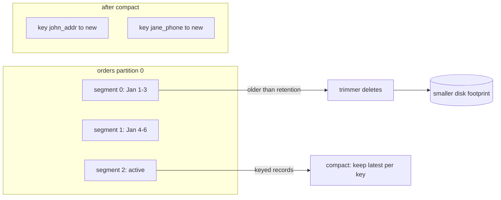

# Kafka Retention, Log Segments, and Compaction

## 1. One-Line Definition
Kafka retains a topic's log for a configured window — by time, size, or (for keyed topics) compacting to keep only the latest value per key — using segmented, rolled log files that make deletion and replay cheap.

## 2. Why Do We Need It?
Kafka is a *log*, so it stores everything unless told otherwise — unlimited growth means unbounded disk and slow startup. Retention answers "how long can consumers replay?" (this is your replay window, your rebuild capability) and "when do we forget old events?" Compaction goes further: when you only care about the *latest state* per key, it collapses the log to just those — a self-maintaining "state of the world" topic.

## 3. Simple Intuition
A filing cabinet of dated journals. Nobody deletes a page mid-file (appends only); instead, you retire whole journals on a schedule: "keep the last 7 days" or "keep the newest 1TB." Later, *compaction* is like replacing a folder of daily restaurant-membership forms with one current form per member — you don't need last March's address; you need the latest. Combined with a consumer *offset*, retention answers "how far back can my new consumer realistically start?"

## 4. What Happens Without It?
Infinite disk usage (eventual outage), startup bloat, and unbounded replay — plus, when you finally do delete manually, you discover consumers silently lose their replay window. On the flip side, accidentally *too-short* retention silently destroys data you later needed to rebuild a read model. Every retention setting is a promise about "how far back is data still true?"

## 5. Core Idea
- **The log is segmented:** a topic-partition stores **log segments** (files, default 1GB, `log.segment.bytes`/`log.segment.ms`). Only the *active* segment is written; older segments are retireable for deletion or compaction once a segment is fully closed (no partial cuts, cheap deletes).
- **Three retention trimmer modes** (per topic):
  1. *Time:* `retention.ms` — delete segments older than X relative to their **last modified / roll** time (not record timestamps strictly under some versions). X days = replay window.
  2. *Size:* `retention.bytes` — delete oldest segments when the partition exceeds Y (a bound on disk).
  3. *Compact:* `cleanup.policy=compact` — delete obsolete *keys*, keeping only the latest value per key; triggered by `min.cleanable.dirty.ratio` (how much old data may accumulate before a compaction pass).
  - Combined as `cleanup.policy=delete` (default) or `delete,compact` (both).
- **Offset-based semantics:** records older than the trim point are *removed* — consumers at an old offset simply skip forward (they see a "gap," not an error). This is silent for functions like lag metric if you're past trimming.
- **Compaction specifics:** only records with keys are compactable; latest-append-wins per key; old offsets die, newest per key live; compaction delays on a busy topic are normal (`max.compaction.lag.ms` bounds it).
- **Infinite retention = disk bound** (`retention.ms=-1`), typically paired with size-based or tiered storage in practice.

## 6. Important Terminology

| Term | Simple Meaning |
|------|----------------|
| Log segment | A closed immutable chunk of a partition's log |
| Roll | Closing the active segment into a new one |
| retention.ms / bytes | Time/size window before segments are dropped |
| Cleanup policy | delete → drop old records; compact → keep latest per key |
| Dirty ratio | How much dirty (compacted) data triggers compaction |
| Tombstone | A null-value record marking a key as deleted |
| Replay window | How far back a new consumer can read |
| Tiered storage | Moving old segments to object storage, not deleting |

## 7. Basic Architecture



## 8. Request or Data Flow
1. Producers append to the active segment (partition = append-only file).
2. When a segment is full or old enough, it rolls; it becomes deletable/compacted.
3. The log cleaner background thread trims: by time/size (delete) or by key (compact), freeing disk.
4. A new consumer with `auto.offset.reset=earliest` starts at the oldest surviving offset (= replay window). The *high watermark* remains the consumer's upper bound regardless.
5. Tombstones (null values) mark keys as deleted under compaction; consumers see the tombstone and can drop their state.

## 9. Practical Example
**Catalog + orders (assumptions):**
- `orders` topic: `retention.ms=7d`, delete policy. Reconciliation and search rebuild = 7-day replay window; audit needs 90d → that stream lives on a different retention or moves to a warehouse (odd-job).
- `product.latest` topic: `cleanup.policy=compact`. Each product's price/stock published with `product_id` key → Kafka keeps **just the current price/stock per product**; a fresh consumer starts with the current slate instantly, and every update is still replayable history of changes.
- Storage math: 1TB/day at day-7 retention ⇒ ~7TB + replication; compaction brings product.latest from 1TB → ~10GB (only current values).

## 10. Scaling
- **Disk planning = retention × ingest × RF.** Halve retention → halve disk; raising it means adding brokers/disks or tiered storage.
- **Segments scale:** count segments × size bounds restart and lookup; big partitions (>GB writes) want bigger segments; small topics want small segments/ms for prompt rolling.
- **Compaction is CPU:** dirty-ratio trade (more dirty = less frequent passes but bigger passes). For high-write keyed topics, cap `max.compaction.lag.ms` is a feedback loop.
- **Tiered storage (3.6+/confluent):** old segments transition to object storage (S3/GCS) so "infinite" retention without local disk explosion, at slower replay cost.

## 11. Reliability and Failure Scenarios

| Failure | Happens | Detection | Recovery | Trade-off |
|---------|---------|-----------|----------|-----------|
| Retention too short | Read models lose history silently | "Gap" mysteriously | Widen retention | disk |
| Disk full | Writes fail | Disk alerts | Trim/expand | retention |
| Compaction lags | Dirty topic grows | cleaner backlog | Tune ratio/interval | CPU |
| Segment clean deleted mid-read | Consumer skips | Offset gap | Alerts on gap | none (by design) |
| Replay needed > retention | New consumer empty-headed start | Data rebuild needed | External warehouse/compaction | cost |

## 12. Consistency and Correctness
- **Replay is the contract:** retention defines the maximum lookback — if a consumer needs catch-up past it, the data doesn't exist *at Kafka*; any dependent read-model rebuild must be scoped within retention (or use a warehouse for older data).
- **Compaction = latest-value semantics, not history:** competing writes to same key during compaction → last-append-wins; time retention & compaction can conflict (compacted topics often set `retention.ms=-1` and rely on size/compaction).
- **Tombstones disappear too** eventually (`delete.retention.ms`); consumers must reconstruct deletion from the tombstone while it's visible or persist deletion intent themselves.

## 13. Performance
- Compaction: single-threaded cleaner per partition; heavy dirty topics compress better (same key rates) but pay CPU and pause segments.
- Initial "catch-up on restart/lookback" is sequential segment reads — page-cache-friendly.
- Object tiering moves the older 95% off hot disk; replay latency rises proportionally to tier distance.

## 14. Security
- Retention is a privacy caretaker: PII in events must match your legal retention bounds — a generic 180d "just in case" can *exceed* compliance limits. Set per-topic retention + purge (delete) policies for regulated payloads.
- Compaction can persist stale values longer than you expect (offsets shift) — treat "delete" expectations for compacted topics carefully; tombstone features exist but are nuanced.
- Monitor disk and tiered-storage ACLs; the object tier is your long-term data store — same access controls as the cluster.

## 15. Trade-Offs

| Choice | Advantages | Disadvantages | When to Use |
|--------|------------|---------------|-------------|
| Time retention | Simple "replay window" | Disk grows with ingest | General purpose |
| Size retention | Bounded disk | Window shrinks as ingest grows | Capacity-constrained |
| Compact | Tiny topic, state-of-world | Only latest per key; CPU; subtle | Keyed state, CTables |
| delete+compact | Bounded + latest-wins | Compound semantics | Mixed workloads |
| Tiered storage | "Infinite" window, cheap | Complex, slower old data | Long retention, huge volume |
| No retention (-1) | Keep everything | Disk blow-up | Only with size/tiering |

## 16. Common Mistakes
- 7-day retention + an analytics consumer that catches up 14 days after deploy → silent gap, no error.
- Compacting a topic with `null` keys or non-deterministic keys — compaction requires keys.
- Putting regulatory PII on a "keep 180d" generic topic without a compliance-tied deletion job.
- Confusing "compacted topic keeps the latest" with "compaction is lossless history" — it isn't; design consumers around the latest-value semantics.
- Ignoring tiered-storage replay latency when a consumer legitimately needs old records (e.g., rebuilds).

## 17. HLD vs LLD Boundary
HLD: retention per topic (time/size/compact), replay-window contracts with consumer teams, storage/RF math, tiering, compliance deletion. LLD: segment bytes/roll config, clean/dirty ratio, delete-retention for tombstones, storage configs, `offset` behavior on empty/trimmed regions.

## 18. Interview Questions

### Beginner
- How does Kafka delete old data, and why segments?
- What does `cleanup.policy=compact` actually keep?

### Intermediate
- A brand-new consumer of a 7-day-retention topic rebuilds a read model. What happens if the rebuild runs 8 days? What's your design fix?
- Size-vs-time retention on a bursty topic: which one do you pick and why?

### Advanced
- Design per-topic retention for a SaaS (orders 90d, telemetry 24h, customer-state compacted) with 20TB/day ingest, RF=3, and a tier that keeps 5 years in object storage. Show storage estimates and replay SLAs per tier.

## 19. Interview Memory Summary

> [!abstract]- Interview Memory Summary

### Remember

- The log is append-only files (segments); deletion is segment drop, never mid-file cuts.
- Retention = time/size window = your replay window for consumers.
- Compaction keeps the latest value per key → a "state of the world" topic.
- Retention too short = silent consumer data loss; tune per topic with ingest in mind.
- Tiered/object storage extends the window beyond local disk.
- Example worth keeping: 7-day orders / compacted product topics with disk math.

### 30-Second Explanation

Segments roll, the trimmer drops old ones by time/size, compact keeps the latest per key; retention is a promise about how far a consumer can replay, so match it to every consumer's catch-up plan.

### Interview Traps

- "Kafka keeps everything forever so I can replay" — without verifying retention, your replay guarantee is imaginary; retention IS the guarantee.
- A 7-day-retention topic + a consumer that catches up 14 days after deploy → silent gap, no error.
- Compacting a topic with null/non-deterministic keys — compaction requires keys.
- Confusing "compacted topic keeps latest" with "compaction is lossless history."

### Key Trade-Off

Retention is a storage-vs-replay promise — long windows cost disk (or a slow tier) while short windows silently orphan consumers who need to catch up farther back than the window allows.

## 20. Related Concepts

### Prerequisites

- [[kafka-architecture|Kafka Architecture]]
- [[kafka-cluster|Kafka Cluster]]

### Commonly Used Together

- [[consumer-lag|Consumer Lag]]
- [[kafka-producers-consumers|Kafka Producers and Consumers]]
- [[kafka-ordering|Kafka Ordering]] (compaction relies on keyed writes)

### Advanced Concepts

- [[kafka-delivery-guarantees|Kafka Delivery Guarantees]]

Related planned topics (not authored yet): tiered storage, log compaction internals, tombstone semantics, storage/capacity planning.

## 21. References
Apache Kafka docs (log retention, log compaction), Confluent tiered-storage docs. Verify retention/compaction semantics per version before interview use.

## 22. Active Recall

Test yourself before revealing each answer.

> [!question]- How does Kafka delete old data, and why segments?
> Deleting is cheap because the log is segmented files. Only the active segment is written; once a segment is fully rolled (closed), it becomes a candidate for trimming. The cleaner thread drops whole segments older than the retention window (or past the size bound) — no partial mid-file cuts, so deletion is just unlinking files.

> [!question]- What does `cleanup.policy=compact` actually keep?
> It keeps the latest value per key and drops all older records for that key — a "state of the world" topic. Only keyed records are compactable; latest-append-wins per key; old offsets die while the newest per key survives. Tombsones (null values) mark keys as deleted.

> [!question]- A brand-new consumer rebuilds a read model from a 7-day-retention topic but takes 8 days. What happens, and what's the design fix?
> Data older than the trim point was already removed, so the rebuild silently starts from a gap — it's missing days 1–7 of history with no error. Fixes: widen retention to cover the worst-case rebuild time, feed the read model from the start and let it stream, or backfill from an external warehouse/tier for anything older than the window.

> [!question]- Size vs time retention on a bursty topic: which do you pick and why?
> Size bounds disk (predictable capacity) but the replay window shrinks as ingest grows; time gives a stable replay window but disk grows with ingest. For critical replay contracts, pick time and buy capacity; for capacity-constrained clusters, pick size and track what window you're really offering.

> [!question]- Design per-topic retention for a SaaS with 20TB/day ingest, RF=3, customer-state compacted, and a 5-year object-store tier. Show the storage math.
> Telemetry 24h: ~20TB/day × retention window on 3 brokers (RF=3 → 60TB/day of raw writes). Orders 90d: sized at 90 × 20TB for that partition (±RF). Customer-state: `cleanup.policy=compact` holds only current state (tens of GB, not days). 5-year tier lives in object storage, cheap per GB, with slower replay SLAs — hot disk only holds the recent window.

> [!question]- Failure: retention was set too short and a consumer silently lost history. Walk detection and recovery.
> Detection is hard — there's no error, just an offset gap the consumer skips past. Watch for gap alerts on offsets and lag behavior at the trim boundary. Recovery: restore from the external warehouse/tier or upstream source, widen retention, and re-scope consumers to catch up inside the window.

> [!question]- Interview scenario: "We set Kafka to keep everything forever." How do you respond?
> Push back on "forever": `retention.ms=-1` means unbounded local disk growth and slow startup — it's only safe with size bounds or tiered storage. And verify what your consumers actually need: retention should equal the longest catch-up/rebuild window plus margin, not eternity. Retention is the replay guarantee, so define it deliberately per topic.

> [!question]- Compaction and time retention conflict — what do you do?
> A compacted topic usually sets `retention.ms=-1` and relies on size + compaction to bound its footprint, because time-based deletion can drop records the compaction pass hasn't reconciled yet. Keep latest-per-key deletes and size bounds; don't stack an aggressive time window on top.

> [!question]- What are tombstones and why do they matter for consumers?
> A tombstone is a record with a null value marking a key as deleted under compaction — consumers should drop their local state for that key when they see one. But tombstones themselves are also eventually removed (`delete.retention.ms`), so consumers only see them for a window; persist deletion intent or reconcile with the source if you need deletions to last.

## 23. When Should I Use This?

### Use it when

- Consumers need a bounded replay window (rebuild read models / search indexes from history).
- Disk is a real cost — you must set a time/size window instead of unbounded growth.
- You maintain "current state" topics where only the latest value per key matters — compact.
- You have regulatory retention bounds for event payloads (set per-topic and delete on schedule).
- Near-infinite history is needed and tiered/object storage can hold it cheaply.

### Avoid it when

- You expect consumers to catch up past your retention silently — every consumer's catch-up plan must fit the window.
- You compact a topic without keys (compaction requires keys) or where full history is audited.
- Someone promises "retention forever" as a substitute for sizing/tiering — verify the actual bound.
- Compliance requires deletion but the data sits on a "keep 180d" generic topic with no deletion job.

### What problem does it solve?

A log grows unbounded — the bottleneck is disk and unbounded replay. Segments + trimming fix it: the trimmer deletes old segments by time/size (bounded disk, defined replay window) and compaction collapses keyed logs to current state — you get a replayable window that matches your rebuild needs without infinite storage.

### What problem does it NOT solve?

Guaranteed history beyond the window (past retention the data genuinely doesn't exist at Kafka), lossless history on compacted topics (it's latest-value semantics), and deletion guarantees — tombstones expire, and legal "delete this" needs a compliance job outside Kafka.

## 24. Decision Connections

Decisions that go together with Kafka retention:

- [[kafka-cluster|Kafka Cluster]] — retention × ingest × RF is the disk math that sizes the cluster.
- [[kafka-producers-consumers|Kafka Producers and Consumers]] — every consumer's catch-up plan must fit inside the retention window.
- [[consumer-lag|Consumer Lag]] — lag beyond the trim point is a silent gap; the two interact.
- [[kafka-ordering|Kafka Ordering]] — keyed, ordered writes are the raw material compaction needs.
- [[kafka-delivery-guarantees|Kafka Delivery Guarantees]] — what retention guarantees (replayability) vs what delivery guarantees (no loss/dup) are two separate promises.
- [[kafka-architecture|Kafka Architecture]] — segments, offsets, and the high watermark set the replay mechanics retention rides on.

Decision tree:

```
What must consumers be able to replay?
    |
    +-- Full history forever?
    |      → tiered/object storage for old segments
    |
    +-- Recent window only (order/telemetry)?
    |      → [[kafka-retention|Kafka Retention]] time or size window
    |         +-- Stable replay window?  → retention.ms (buy disk)
    |         +-- Bounded disk?          → retention.bytes (buy window shrinkage)
    |
    +-- Only "current state" per key?
           → cleanup.policy=compact (requires keys)
           → [[kafka-ordering|Kafka Ordering]]
```