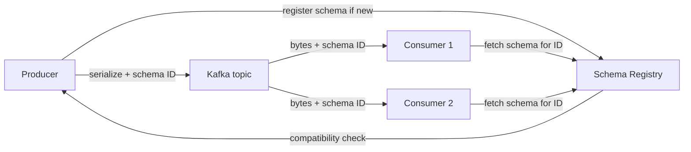

# Schema Registry and Serialization

## 1. One-Line Definition
The Schema Registry is a shared, centralized service where producers and consumers register and fetch the schemas of Kafka-record payloads (usually Avro/JSON/Protobuf), so the bytes on the wire are identified by a stable schema ID and both sides evolve forward and backward compatibly without a publish-downtime coordination meeting.

## 2. Why Do We Need It?
There is no schema baked into a Kafka message — a consumer cannot tell whether the JSON it just fetched matches what it expects. Without a registry, each team hand-rolls version negotiation, breaks consumers with every reordered field, and every schema change is a tenant-synchronization ceremony that ends in a pipeline outage. The registry centralizes that contract: one place defines, versions, and *validates* changes before a single byte is produced (or consumed).

## 3. Simple Intuition
A column of shippers and receivers sharing one conveyor belt. Each box used to have the same packing slip format; a factory layout change needs new slips. Without a central office, every sender guesses what every receiver still accepts — some boxes get thrown away. The registry is that office: every slip is registered, versioned, and checked for compatibility before printing, so old receivers can still open new boxes and vice versa.

## 4. What Happens Without It?
A producer adds a required field; every consumer built on the old shape either crashes parsing, silently drops the field, or reads misaligned bytes. Monitoring says "deserialization error rate 30%" and no one knows which version broke it. Rollbacks become impossible because new records already exist on the topic. The Kafka log is durable — you can't un-produce a bad version, so *prevention* is the only real safety.

## 5. Core Idea
- **Wire format + registry:** each serialized record embeds a compact schema ID; consumers fetch the schema for that ID (cached) before deserializing. Schema bytes never travel with every message — they live in the registry.
- **Serialization formats:** Avro (compact binary, schema-with-records, the classic Kafka pick), Protobuf (compact, forward/backward-friendly), JSON Schema (readable, larger). Each has its own compatible-evolution rules.
- **Compatibility levels:** BACKWARD (consumers with the new schema read old data — adding optional fields), FORWARD (readers with old schema read data written with the new — adding fields a tolerant reader ignores), FULL (both), NONE. The registry rejects a schema registration that violates the topic's level.
- **Evolution rules in practice:** add fields with defaults==backward-safe; remove fields carefully; a rename breaks both — it's a break, not a migration.
- **Where the registry sits:** a service next to the cluster (Confluent Schema Registry is the reference); produce/consume paths call it on cache miss; startup fails fast if a schema ID is unknown.
- **Contract with delivery semantics:** a schema violation should fail a produce before commit, keeping the "no bad bytes ever published" story clean (ties into [[kafka-delivery-guarantees|Kafka Delivery Guarantees]]).

## 6. Important Terminology

| Term | Simple Meaning |
|------|----------------|
| Schema | The typed shape of a record's fields and types |
| Schema ID | Short int embedded in each record pointing to registry |
| Avro / Protobuf / JSON | Serialization formats with compatible-evolution rules |
| Backward compatible | New consumers can read old data (consumer-friendly) |
| Forward compatible | Old consumers can read new data (producer-friendly) |
| Compatibility level | Rule the registry enforces per subject |
| Subject | A named schema that versions (typically one per topic/value) |
| Default / optional field | A field with a default that makes additions compatible |
| Deserialization failure | Consumer can't parse a record → DLQ or skip |
| Serde | The serialize-deserialize adapter in a client |

## 7. Basic Architecture



## 8. Request or Data Flow
1. A producer builds a record from a schema version; on first use (or cache miss) it registers the schema with the registry, which checks compatibility against the subject's level.
2. Serializer writes the payload with the schema ID prefix; the record hits the topic.
3. A consumer reads the ID, fetches/caches the schema, and deserializes with it.
4. If a producer flies a schema the registry rejected, the produce fails before commit — no bad bytes ever land.

## 9. Practical Example
**Order events (assumptions):** `order.placed` topic, Avro value schema v1 with `{order_id, amount}`; 50M events/day across 12 consumer teams.
- v2 adds `currency` with a default → registered BACKWARD; all 12 teams keep reading old + new records unchanged.
- v3 tries to *remove* `amount` in the same subject → the registry rejects registration; the producer team must channel it to a new subject/topic instead.
- An unknown team's rogue producer writes raw JSON with no schema → serializer sends it, consumers choke; the fix is a registry check plus a validation hook at produce time that references the ID.
Numbers: schema IDs cache with ~1 RTT to registry per new version; steady-state produce/consume adds zero registry round trips per record.

## 10. Scaling
- Registry is read-heavy after warmup (IDs cached client-side); scale it as a stateless tier in front of a replicated state store.
- Subjects grow with teams × topics; each new version is storage + a compat-computation — keep subschemas lean.
- Multi-region setups need registry replication mirroring topic replication, or consumers must reach the home region registry (see [[kafka-cluster|Kafka Cluster]]).
- Version hygiene: subject/key-value distinction and a deprecation policy prevent an evergreen "schema sprawl" mess.

## 11. Reliability and Failure Scenarios

| Failure | What Happens | Detection | Recovery |
|---------|--------------|-----------|----------|
| Registry down (cache miss) | Producers/consumers fail to lookup | Health + unavailability of endpoints | Clients already cache IDs; restore registry |
| Incompatible schema registered | Produced bytes break consumers | Compat-check rejection | Enforce level pre-registration |
| Unknown schema ID in a record | Consumer can't deserialize | Startup/deser error | Ban the producer; validate the pipeline |
| Subject deleted by mistake | Readers lose the version map | Registry audit | Backup/restore registry state |
| Clock skew (registry vs records) | Ordering ambiguity in versioning | ID monotonicity check | NTP discipline |

Prevention is the theme: because records on a topic are permanent, a schema mistake is a permanent contamination — compat checks and refuse-bad-writes beat all post-hoc repair.

## 12. Consistency and Correctness
- Ordering the registry gives the *type* evolution; Kafka gives record ordering per partition ([[kafka-ordering|Kafka Ordering]]) — the two compose: records arrive in order, and each version deserializes via its registered schema ID even when types differ.
- Rolling version changes: a topic carrying v1 + v2 records concurrently is normal; consumers must handle both, which compatibility levels exist to guarantee.
- Retry/idempotency hooks (see [[kafka-delivery-guarantees|Kafka Delivery Guarantees]]) must not silently re-serialize records through a changed schema — dedupe by record identity, not re-encoded bytes.

## 13. Performance
- Overhead: one ID (few bytes) per record; a registry round trip only on first-use per (subject, version) — after cache warm, ~zero added latency vs raw binary.
- Avro/Protobuf are far smaller than JSON — the bandwidth win often exceeds the registry cost (see [[compression|Compression]] and serialization interplay).
- Bottlenecks to watch: registry RTT on cache-miss storms after deploys (prefetch/warm), and per-record schema-lookup code paths in slow serializers.

## 14. Security
The registry is a trusted schema authority — secure it with TLS/ACL (who may register which subject), because an attacker registering a schema is step one toward a poisoning attack on every consumer. Separate produce-vs-consume permissions; rotate registry credentials independently of cluster credentials. Never let schema definitions carry executable content (format-specific injection vectors).

## 15. Trade-Offs

| Format | Size | Evolution ergonomics | When to Use |
|--------|------|----------------------|-------------|
| Avro | Small | Strong default-field rules | Classic Kafka, most event systems |
| Protobuf | Small | Explicit optional, field numbers | gRPC-adjacent, polyglot teams |
| JSON Schema | Larger | Very readable, looser | Slow-moving data, tooling affinity |
| Raw JSON (no registry) | Larger | None | Prototypes only — adopt registry early |

## 16. Common Mistakes
- Treating the registry as optional "wire the JSON and forget" until the first breaking field lands on a durable topic.
- Choosing the wrong compatibility level per subject (NONE on a shared topic).
- Renaming a field instead of adding a new one — silently breaks every consumer.
- Registering the schema only after producing, so bad bytes beat the compat check.
- Forgetting key-vs-value schemas: a breaking *key* change re-partitions data silently.

## 17. HLD vs LLD Boundary
HLD: serialization format choice, compatibility levels per subject, registry topology (scale/multi-region/replication), produce-time validation, deprecation policy. LLD: one Avro/Protobuf schema file, the serde bean's settings, one field's default migration.

## 18. Interview Questions

### Beginner
- What does the schema ID in front of a record actually do?
- Why can't consumers just read the JSON shape?

### Intermediate
- Producer A adds a required field, topic keeps running. What happens to every consumer, and how does the registry stop it up front?
- BACKWARD vs FORWARD vs FULL compatibility — give the field-level recipe for each.

### Advanced
- Design schema evolution for an order topic where 12 teams consume, with a per-team tolerance for old vs new records during a rolling migration.
- A new producer team's binary payloads poison the topic before the registry knew. Walk detection, quarantine, and the permanent prevention.

## 19. Interview Memory Summary

> [!abstract]- Interview Memory Summary

### Remember

- Bytes on Kafka carry a schema ID, not the schema.
- Registry = one place to register, version, and compat-check schemas.
- Avro/Protobuf/JSON with level rules: backward/forward/full/none.
- Add fields with defaults = backward-safe; rename/remove = break.
- Reject before produce — a polluted topic is permanent.
- Serde + cache make the registry nearly free at steady state.

### 30-Second Explanation

Register every producer's schema with an ID; consumers fetch on first use and cache. Enforce a per-subject compatibility level so additions (with defaults) sail through while removals/renames fail at registration. Treat produce-time validation as the gate: never let a rejected schema's bytes onto a durable topic, because a Kafka log cannot be un-contaminated.

### Interview Traps

- "JSON is self-describing" — it's not; deserialization is per-consumer guesswork.
- Registering after produce, letting bad bytes win the race.
- Renaming fields instead of evolving them.
- A breaking change on the *key* schema re-partitioning silently.

### Key Trade-Off

You spend schema-governance effort (compat levels, a registry service, serde wiring) to buy durable, evolvable contracts where a breaking field can never silently slip onto a permanent log.

## 20. Related Concepts

### Prerequisites

- [[kafka-architecture|Kafka Architecture]] — the log model the registry protects.
- [[kafka-producers-consumers|Kafka Producers and Consumers]] — where serdes plug in.

### Commonly Used Together

- [[kafka-delivery-guarantees|Kafka Delivery Guarantees]] — a schema violation must fail a produce before commit.
- [[api-versioning|API Versioning]] — the same backward-compat discipline for services.
- [[compression|Compression]] — Avro/Protobuf shrink the wire with it.

### Alternatives

- [[rpc-grpc-graphql|RPC / gRPC / GraphQL]] — Protobuf-based contracts elsewhere in the stack.

### Advanced Concepts

- [[kafka-cluster|Kafka Cluster]] — registry replication alongside cluster replication.
- [[outbox-pattern|Outbox Pattern]] — schema-versioned payloads flowing through the outbox.

Related planned topics (not authored yet): event versioning, Avro schema-migration tooling details, registry multi-region topologies.

## 21. References
Confluent Schema Registry docs (Avro/JSON/Protobuf compatibility), Avro spec (field evolution rules), Apache Kafka docs on serialization. Verify compatibility semantics against the registry version you deploy.

## 22. Active Recall

Test yourself before revealing each answer.

> [!question]- Basic understanding: what is actually embedded in every produced record?
> A compact schema ID (a few bytes prefix) pointing to the registry — not the schema itself. The consumer resolves the ID to a schema on cache miss and deserializes; the payload is otherwise binary/normal bytes like any Kafka record.

> [!question]- Design decision: a producer wants to add `currency` with a default to order events. Which level and why?
> BACKWARD-compatible addition: consumers with the new schema can still read old records (missing field → default), and old consumers ignore the unknown field. Register under the same subject with BACKWARD (or FULL) and it lands cleanly.

> [!question]- Trade-off: JSON Schema vs Avro for a slow-moving reporting topic.
> JSON Schema: readable, humans-friendly, larger payloads, looser rules — fine for slow/ocasional data. Avro: compact and strict, better for high-ingest and teams that want enforcement. Both go through the same registry mechanics; choose by volume and team affinity.

> [!question]- Failure scenario: a rogue producer shipped binary vectors with no registered schema and consumers are now choking. Diagnose + fix.
> Detection: deserialization error spikes, unknown-schema-ID logs, produce-time metrics missing registry calls. Quarantine: pause that producer, DLQ the polluted records. Permanent prevention: require registration (reject unknowns), produce-time validation, and an ACL that blocks unregistered producers.

> [!question]- Interview scenario: keynote at 10am; someone renames `amount` to `total` on the `order.placed` subject. What breaks?
> Every consumer's field-mapping silently breaks (or drops the field) — renaming is a delete+create from the schema's view, and registry compatibility rules should reject a rename outright. Correct path: add `total` (BACKWARD), deprecate `amount`, remove only after all readers move.

> [!question]- Interview scenario: schema works, but across regions consumers can't resolve IDs. Why?
> The registry is single-region; topic data replicated cross-region (see [[kafka-cluster|Kafka Cluster]]) carries IDs the other region's registry doesn't know. Fix: replicate registry state alongside topics, or pin regional consumption to the owning registry with an ID-mirroring strategy.

> [!question]- Trade-off decision: would you set compatibility to NONE for a prototype topic?
> Never on a real topic — NONE means any producer can push anything; consumers can't prevent the durable contamination. For true throwaway prototypes use a short-retention throwaway topic and delete-delay, not NONE sparing on a shared subject.

## 23. When Should I Use This?

### Use it when

- Multiple teams produce/consume the same topics and payload shapes change.
- Consumers must survive producer schema evolution without coordinated downtime.
- You care that broken bytes never reach a permanent log (almost always).

### Avoid it when

- One team, one topic, nothing changes — the registry is still cheap insurance, but the ceremony may be overkill.
- The payload is genuinely opaque (blobs/attachments) — schema-govern the envelope, not the body.

### What problem does it solve?

The problem: Kafka stores bytes without type knowledge, so every schema change is a cross-team guessing game and broken records are permanent. Bottleneck: no single authority for "what shape is this and may it change". Solution: a registry that versioned IDs, enforces compatibility per subject, and fails bad produces before commit — durable contracts on a durable log.

### What problem does it NOT solve?

It does not make incompatible data *readable* (only prevention works), does not give per-request schema alternation (that's app logic), and does not secure the topics themselves — ACLs and encryption remain separate controls layered beside it.

## 24. Decision Connections

Decisions that go together with Schema Registry:

- [[kafka-delivery-guarantees|Kafka Delivery Guarantees]] — produce-time fail-fast complements acks/idempotency.
- [[kafka-architecture|Kafka Architecture]] — the durable log that makes schema permanence a real concern.
- [[kafka-producers-consumers|Kafka Producers and Consumers]] — where serdes and failures surface.
- [[kafka-cluster|Kafka Cluster]] — registry replication across the cluster/fleet.
- [[api-versioning|API Versioning]] — same evolution rules as service contracts.
- [[outbox-pattern|Outbox Pattern]] — schema-versioned records from transactional writes.
- [[compression|Compression]] — compact serialized payloads on the wire.

Decision tree:

```
Which wire contract should topics use?
    |
    +-- High-volume, evolving, multi-team?
    |      → Schema Registry + Avro/Protobuf
    |         +-- Add fields w/ default  → BACKWARD/FULL
    |         +-- Removing/renaming      → new subject, phased out old
    |         +-- Multi-region consumers  → replicate registry state
    |
    +-- Low-volume readable data?
    |      → JSON Schema through the registry
    |
    +-- Truly opaque payloads?
    |      → govern the envelope; body stays opaque
    |
    +-- Prototype/throwaway?
    |      → short-retention topic; registry later
```