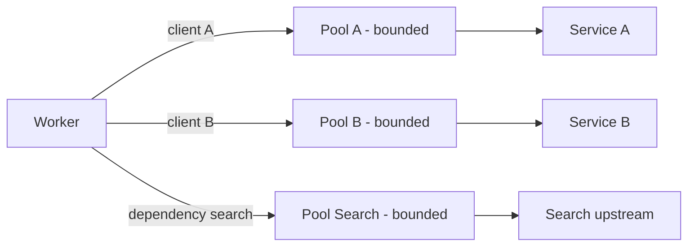

# Bulkhead

## 1. One-Line Definition
Bulkhead is fault isolation by partitioning: a service splits its resources (thread pools, connections, queues, or even entire instances) into per-consumer or per-dependency compartments, so failure or overload in one compartment cannot exhaust the resources of another.

## 2. Why Do We Need It?
A service that hands all its work to one shared pool is one slow dependency away from total collapse: ten slow calls for client A soak up every worker thread, and now client B's healthy requests queue behind them, time out, and retry — amplifying the outage system-wide. The pattern exists because *shared pools are the shock absorber of failure*: if everything shares one pool, no part of the system is shielded from any other part's degradation. Partitioning pools means the damage stays in the compartment that started it.

## 3. Simple Intuition
A ship is divided into watertight bulkheads. A hole in one compartment floods only that compartment; the ship stays afloat and the other holds stay dry. A ship with one continuous hull takes the same hole and sinks. In software, the compartments are thread pools, connection pools, queues, or instances per client or per dependency: the "hole" is that client's slowness or that dependency's outage, and the bulkheads keep it from sinking the whole vessel.

## 4. What Happens Without It?
One shared pool: dependency X (previously 10ms) degrades to 10s under its own overload. Every caller of the service grabs a thread, blocks on X, and waits; the pool exhausts; new-request threads queue; all other dependencies and all other clients now time out too. Retries start, making it worse. The outage that began with one dependency is now a service-wide outage with a queue full of blocked threads — the classic cascading failure bulkheads exist to prevent.

## 5. Core Idea
- **Partition ONE shared resource into K independent pools** — the core move. K typically comes from two axes of variance:
  - **By dependency:** a pool per downstream (payments pool, search pool, mail pool). If payments dies, search traffic is unaffected.
  - **By client or tenant:** a pool per client key. If tenant A floods, tenant B is unaffected.
  - By priority or work type: critical-path pool vs background pool.
- **Sizing:** each pool budgets for what it serves — e.g., 20 threads for payments when normal volume needs ~10 and the per-call P99 is 200ms. Over-sized means wasted concurrency; under-sized means that compartment stalls at its own peak.
- **The mechanism on failure:** when a compartment's queue is full or its pool is exhausted, that compartment **rejects and fails fast** (immediate error or a degraded fallback) rather than borrowing another compartment's threads. Rejection is the feature, not the bug: a bounded amount of that compartment's requests fail fast while everyone else stays healthy.
- **Composition:** bulkhead + [[circuit-breaker|Circuit Breaker]] = compartments plus fast-trip on outages; bulkhead + [[retry-and-timeout|Retry and Timeout]] = bounded retries inside each compartment; bulkhead + [[rate-limiter|Rate Limiter]] = caps at admission so a compartment is never asked to take more than its size allows.
- **Two granularities:** *resource bulkhead* (pool-level separation inside one process) and *architectural bulkhead* (separate instances, cells, or clusters per tenant or dependency — see [[tenancy-and-cells|Multi-Tenancy and Cell-Based Architecture]]).

## 6. Important Terminology

| Term | Simple Meaning |
|------|----------------|
| Bulkhead | A resource partition that isolates failure |
| Compartment | A pool/queue/instance carved out for one caller or dependency |
| Resource pool | Threads or connections a request can occupy |
| Shared pool | One pool for everything — the anti-pattern |
| Fail fast | Reject instantly when a compartment is full |
| Queue capacity | Bounded waiting before hard rejection |
| Architectural bulkhead | Separate instances or cells per tenant or dependency |

## 7. Basic Architecture



## 8. Request or Data Flow
1. A request arrives tagged by client (or by the dependency it will touch).
2. The dispatcher assigns it to that client's pool — never a global one.
3a. Pool has capacity: the request proceeds; if its dependency degrades, only this pool's threads block.
3b. Pool exhausted at entry: the request fails fast (429/5xx or a degraded fallback) without touching any other pool.
4. When the slow compartment clears, the pool drains and normal service resumes — the rest of the system never noticed the outage.

## 9. Practical Example
**Travel-booking service (assumptions):** checkout depends on a payment gateway (P99 300ms) and a fragile hotels partner API; analytics is background work.
- Pools: `payments` = 30 threads, `hotels` = 15, `background` = 10, each with a small bounded queue. Total 55 instead of one pool of 60 — barely more cost.
- The hotels API starts timing out at 5s — 8 threads block, the 15-thread compartment fills, hotels requests fail fast, and the analytics pool keeps running. Checkout with a working card (payments pool unaffected) completes normally.
- Sizing check: payments needs ~12 concurrent threads at normal volume; 30 gives surge headroom; the queue bounds how long a burst waits before failing fast instead of queuing everyone into a timeout pile.

## 10. Scaling
- **Pool sizing vs scale:** as volume grows, pools must grow or the compartment fails its own traffic — pair bulkhead with [[autoscaling|Autoscaling]] that grows *replicas*, because a single process has a ceiling.
- **Many compartments, many knobs:** idle pools waste resources; consider a hierarchical pool (per-client floors plus a shared cap) to avoid K tiny, mostly-idle pools.
- **Bulkhead by cell/instance:** beyond pools, architectural bulkheads (separate fleets per tenant or dependency) scale isolation with capacity (see [[cell-based-architecture|Cell-Based Architecture]]).
- **Degraded fallback scales:** fail-fast compartments should route to a fallback (cache, stale response) rather than an error page, so even the isolated compartment serves something.

## 11. Reliability and Failure Scenarios

| Failure | What Happens | Detection | Recovery | Trade-off |
|---------|--------------|-----------|----------|-----------|
| One dependency degrades | Its compartment fills; others unaffected | Pool queue-depth metric | Dependency recovers; pool drains | fail-fast errors for that dependency |
| One tenant floods | That tenant's compartment saturates | Per-tenant pool metrics | Rate-limit tenant, scale its compartment | fairness config |
| Compartment sized wrong | Healthy traffic rejected at peak | Rejection-rate metric | Resize; autoscale replicas | capacity vs isolation |
| Whole host unhealthy | All pools fail together | Host health and readiness | Remove from LB, replace instance | host-level blast radius |
| Hidden shared dependency | Sabotages the isolation | All pools full simultaneously | Move shared dep to its own bulkhead | cost |

## 12. Consistency and Correctness
- Bulkhead changes **availability**, not data semantics: rejecting work when a pool is full drops or times out requests — idempotent clients and retries ([[retry-and-timeout|Retry and Timeout]]) resubmit later; at-least-once semantics on downstream writes still apply. No transactional guarantee changes.
- Rejection is a *conscious choice*: a system configured to fail fast in a compartment protects correctness (the queue cannot grow unboundedly) and accepts that some work is not done *now*. Pair with fallbacks for read paths so degraded modes return bounded, stale answers.
- Fairness is a correctness-adjacent property: pools enforce per-caller caps, so one caller cannot monopolize the whole resource — the same behavior [[rate-limiter|Rate Limiter]] codifies at admission.

## 13. Performance
- **Headroom cost:** K compartments need peak-of-any-comparts plus sum-of-typical waits, versus one shared pool sized to total peak — typically low single-digit waste for a large isolation win.
- **Latency:** fail-fast rejection is essentially instant (microseconds) versus queuing into an eventual timeout. The latency *profile* improves dramatically even when the isolated request count is the same.
- **Amplification control:** because rejected requests fail fast and retries are bounded inside the compartment, the pattern prevents the retry-storm amplification a shared pool permits.

## 14. Security
- Per-tenant compartments are a DoS-hygiene feature: a malicious or misbehaving tenant exhausts only its own pool. Combine with [[rate-limiter|Rate Limiter]] and admission control so pools cannot be depleted from outside.
- Compartments must not leak credentials between tenants: pool boundaries do not enforce authorization — keep tenant scoping in the authZ layer, separate from resource isolation.
- Pool metrics reveal who is hot; operational data should not carry PII per tenant.

## 15. Trade-Offs

| Choice | Advantages | Disadvantages | When to Use |
|--------|------------|---------------|-------------|
| Shared pool | Max utilization, simplest | One slow dependency sinks all | Small system, few dependencies |
| Per-dependency pools | Isolation from one broken downstream | Sizing per dependency | Many flaky downstreams |
| Per-tenant pools | Fair multi-tenant behavior | Many knobs, idle capacity | SaaS with diverse tenants |
| Architectural bulkhead | Strongest isolation (own machines) | Cost, capacity, ops | Critical tenants, compliance |
| Pool + fallback | Degraded but still serving | Fallback staleness/accuracy | Read paths, payments "try later" |

## 16. Common Mistakes
- Building bulkheads but leaving a hidden shared resource (one shared connection pool, one shared cache client) — the compartment boundary is fake if the real resource is still shared.
- Sizing pools from average load instead of P99 concurrency; the compartment silently fails its own peak.
- Under-provisioning queues: an unbounded queue defeats the bulkhead by letting waits accumulate into timeouts anyway.
- Retrying hard across compartments (every rejected call retried into the shared path) — retries must stay inside the pool budget.
- Adding bulkheads without per-compartment metrics; isolation you cannot see is isolation you will not trust.
- Confusing pool isolation with tenant authorization — threads never grant authZ.

## 17. HLD vs LLD Boundary
HLD: the partitioning axes (by dependency, tenant, priority), pool/queue sizing per compartment, rejection behavior (error vs fallback), retry budget inside compartments, and the architectural-bulkhead decision (cells/instances). LLD: the pool library (Hystrix, Resilience4j, custom), thread/connection construction, dispatcher tagging, queue depth checks, per-pool metrics wiring.

## 18. Interview Questions

### Beginner
- What does a bulkhead do, and what happens without it?
- What is the difference between a shared pool and bounded compartments?

### Intermediate
- Size the pools for a checkout service with three dependencies of different reliability. Justify each number.
- A compartment is rejecting healthy traffic at peak. Diagnose and fix.

### Advanced
- Design bulkheads for a multi-tenant SaaS where one tenant can be 100x another and a dependency is shared. Where do pools end and cells begin?
- Argue the case for and against architectural bulkheads (separate fleets) versus pool-level bulkheads, with cost and blast-radius math.

## 19. Interview Memory Summary

> [!abstract]- Interview Memory Summary

### Remember

- Bulkhead = partition one resource into K compartments.
- Failure stays in its compartment; the rest of the ship floats.
- Pool full → fail fast (or fallback), not borrow, not queue forever.
- Size by P99 concurrency and dependency reliability, not averages.
- Compose with circuit breaker (trip fast), rate limiter (cap entry), bounded retries (stay in-budget).
- Architectural bulkhead (cells/instances) is the scale-up of the same idea.
- A hidden shared resource silently defeats every bulkhead.

### 30-Second Explanation

Give every client and dependency its own bounded pool; when one fills, fail fast inside that compartment only. Size pools from tail concurrency, compose with circuit breakers and rate limiters, and extend the same isolation to whole instances or cells when pools are not enough — the blast radius of any single failure is then a compartment, not the system.

### Interview Traps

- Claiming isolation while a shared pool/cache still exists beneath.
- Sizing compartments from averages — rejection at peak is the surprise.
- Returning a hard error everywhere a fallback would keep the read path serving.
- Treating bulkhead as authZ; pools isolate resources, permissions gate access.

### Key Trade-Off

Isolation costs you a little idle capacity and a lot of sizing discipline; in exchange, the blast radius of every slow dependency and every noisy tenant shrinks from the whole system to one bounded compartment.

## 20. Related Concepts

### Prerequisites

- [[reliability|Reliability]]
- [[circuit-breaker|Circuit Breaker]] — the same failure philosophy at the trip level.

### Commonly Used Together

- [[circuit-breaker|Circuit Breaker]] — bulkheads isolate pools; the breaker trips calls inside them.
- [[rate-limiter|Rate Limiter]] — caps arrivals so a compartment is never over-subscribed.
- [[retry-and-timeout|Retry and Timeout]] — retries stay inside the compartment's budget.
- [[load-shedding|Load Shedding]] — the fail-fast moment when a compartment is full is a micro load-shed.
- [[resilience-patterns|Resilience Patterns]] — the catalog this pattern belongs to.
- [[autoscaling|Autoscaling]] — grows replicas when compartments reach their per-process ceiling.

### Alternatives

- [[circuit-breaker|Circuit Breaker]] alone — good for a single shared dependency; insufficient when many callers/dependencies contend.
- [[rate-limiter|Rate Limiter]] alone — caps load but does not isolate who the load belongs to.

### Advanced Concepts

- [[tenancy-and-cells|Multi-Tenancy and Cell-Based Architecture]] — architectural bulkheads at fleet level.
- [[cell-based-architecture|Cell-Based Architecture]] — hard isolation as a first-class design.

Related planned topics (not authored yet): grace-degradation, overflow-protection, backpressure.

## 21. References
Netflix TechBlog (Hystrix) — thread pool isolation and why it matters; Resilience4j & Polly docs (bulkhead policies); Google SRE Workbook (overload and shared-resource isolation). Verify current library defaults.

## 22. Active Recall

Test yourself before revealing each answer.

> [!question]- What is a bulkhead, concretely?
> Partitioning a single shared resource pool into per-client or per-dependency compartments so that saturation in one compartment — slow calls from one caller, one broken upstream — cannot exhaust the resources the other compartments need. Blocked threads stay in their compartment.

> [!question]- What is the correct response when a compartment is full?
> Fail fast inside that compartment: reject the request immediately (429/5xx or a degraded fallback). Do not borrow threads from another pool, queue unboundedly, or retry outside the compartment — all three would propagate the blast radius you built the bulkhead to contain.

> [!question]- How do you size a compartment?
> From the P99 concurrency of that workload during its peak plus headroom, not from average load. A pool sized at average fails its own peak; a pool with a bounded queue converts remaining burst into fail-fast instead of timeout piles.

> [!question]- Where do the three resilience patterns separate?
> Rate limiter caps entry (before the system sees the call), bulkhead isolates who the load belongs to (inside the system), circuit breaker trips on persisted failure (fast shutdown of a dead dependency). They compose: cap, isolate, trip.

> [!question]- A compartment rejects healthy traffic at peak. Diagnose and fix.
> Either the pool is sized below the compartment's real peak concurrency (fix: size from P99 concurrency; or scale replicas so the total across instances matches demand) or the queue is too shallow for burst (fix: tune queue + rejection to trade latency for success rate). Metrics to check: queue depth history, rejection rate, per-pool concurrency.

> [!question]- Why do pool boundaries never enforce authorization?
> A thread pool is a concurrency artifact, not a security boundary — nothing about being on pool A's thread grants or denies access to data. Tenant scoping must live in the authZ layer; bulkheads only guarantee resource fairness and isolation.

> [!question]- Interview scenario: a multi-tenant SaaS, one tenant generates 100x traffic, and a shared payments dependency is flaky. Design the isolation.
> Per-tenant pools with floor+cap (a floor so small tenants are always served, a cap that fails the raging tenant fast), a separate payments compartment with its own size and circuit breaker so the flaky dependency cannot eat the tenants' pools, plus rate limiting at admission. If one tenant's compliance/criticality demands it, graduate to an architectural bulkhead (its own fleet) — pools to cells.

## 23. When Should I Use This?

### Use it when

- Different clients or dependencies have wildly different reliability or volume profiles.
- One slow upstream could soak the service's entire concurrency (bootleneck: shared pool waits).
- Multi-tenant fairness matters and a single tenant can take the whole service down.
- You need bounded, predictable failure behavior ("that client fails fast, everyone else fine").

### Avoid it when

- The service is small, single-dependency, single-tenant — a shared pool is simpler and fully utilized.
- You cannot instrument per-compartment metrics — you would be unable to verify the isolation works.
- The real resource is still shared underneath (shared DB pool, shared cache) — fix that first.

### What problem does it solve?

Shared-pool exhaustion makes the system's availability equal to its worst caller's behavior: one slow dependency or one noisy tenant destroys everyone's latency. Bulkheads partition the resources so the blast radius of any individual degradation is bounded to the compartment that owns it.

### What problem does it NOT solve?

- It does not speed up the slow dependency (circuit breaker + capacity fixing does).
- It does not stop overload from arriving (rate limiting / load shedding does).
- It does not authorize tenants or protect data (authZ does).
- It does not help if a shared hidden resource defeats the partitions.

## 24. Decision Connections

Decisions that go together with bulkheads:

- [[circuit-breaker|Circuit Breaker]] — trip a compartment's dependency when it is persistently failing.
- [[rate-limiter|Rate Limiter]] — cap arrivals so compartments never over-subscribe.
- [[retry-and-timeout|Retry and Timeout]] — keep retry budgets inside the compartment.
- [[load-shedding|Load Shedding]] — the fail-fast/fallback moment when a pool is full.
- [[resilience-patterns|Resilience Patterns]] — the pattern family this belongs to.
- [[tenancy-and-cells|Multi-Tenancy and Cell-Based Architecture]] — the fleet-scale version.
- [[autoscaling|Autoscaling]] — grows replicas so compartments keep headroom.

Decision tree:

```
Multiple clients or dependencies that can vary?
    |
    +-- One slow upstream would eat the whole service?
    |      → per-dependency bulkhead pools
    |         |
    |         +-- Dependency is flaky long-term? → + [[circuit-breaker|Circuit Breaker]]
    |         +-- Retries would amplify?          → + bounded retries in the pool
    |
    +-- Tenants vary 100x in load?
    |      → per-tenant pools (floor + cap) + [[rate-limiter|Rate Limiter]]
    |
    +-- One tenant needs hard isolation?
    |      → architectural bulkhead: own fleet / cell
    |         → [[cell-based-architecture|Cell-Based Architecture]]
    |
    +-- Single small service, one dependency?
           → shared pool is fine; don't over-engineer
```