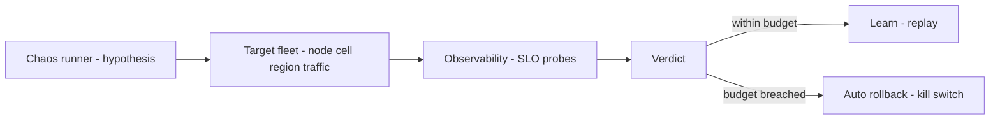

# Chaos Engineering

## 1. One-Line Definition
Chaos engineering is the practice of deliberately injecting failures into a working system — killing nodes, delaying traffic, dropping messages, saturating resources — to *prove*, under measurement, that the system stays within its SLOs while failing, and to surface failure modes that test suites never encode.

## 2. Why Do We Need It?
Reliability is a property of the system under *adversity*, and the inventory of real-world failure modes (a network partition nobody encoded, a cache stampede that only fleet-scale bursts trigger, a dependency that degrades 5% and poisons a whole query tree) is long and mostly unknown. Unit tests and staging never run with real load, real replicas, real cascades. Chaos engineering converts "we are reliable" from an assumption you hope is true into a *measured, repeatable, rehearsed* property: fail on purpose, in small controlled doses, so the recovery paths — failover, retries, circuit breakers, shed — are the paths actually exercised. It is the practice behind [[adversarial-reliability|Adversarial Reliability]], done deliberately rather than discovered.

## 3. Simple Intuition
Fire drills. You don't discover your building's escape works by waiting for a real fire. You hold a drill on purpose: observers, a timer, a plan, a kill switch — and everyone learns whether the exits, alarms, and headcount actually work before the stakes are real. Chaos is the server version of the drill: kill a node, slow a region, drop a message, flood a cache — deliberately, bounded, observable — and measure whether the system rejoins its SLO runway. The first real fire should be boring because you rehearsed it.

## 4. What Happens Without It?
Every failure type's first occurrence is production, with real users attached. The runbooks were written optimistically; "automated failover" turned out to be a checkbox; one slow dependency cascades into a fleet-wide retry storm nobody modeled; a backup that was assumed restorable is corrupt when you actually need it. Postmortems review what happened once, too late — instead of rehearsing what could happen many times in advance. Recovery confidence is fiction until a failure demonstrates it.

## 5. Core Idea
- **Experiments, not vandalism.** Every chaos action is an experiment with a hypothesis: "when a node in cell A dies, the SLO stays within budget for 20s, then recovery." The system's measured behavior verifies or refutes it. The point is *learning*, the method is *controlled injection*.
- **Steady state → hypothesis → inject → verify → clean up.** Define the normal measurable state (p99 latency, error rate, throughput under load). Inject the fault. Observe whether the system returns to steady state within the hypothesis's bounds. Record, roll back if the error budget is hit, and feed the fix into the roadmap.
- **Blast-radius spectrum:** a library-level fault in one pod (fastest, cheapest) → single host kill (standard) → whole cell/AZ partition (bigger) → cross-region (biggest). Start small, grow after each success; blast radius is a knob, not an accident.
- **Types of injection:**
  - *Infrastructure:* kill a node, drop packets, throttle CPU/IO, force a leader step-down.
  - *Application (fault injection):* return errors at a rate, delay responses by a profile, scramble payloads, force a dependency timeout.
  - *Traffic/abuse:* DDoS-like floods, malformed payloads, abusive-tenant behavior, cache-stampede bursts — the "user" adversary as much as the "universe."
- **Guardrails are compulsory:** auto-rollback (if the error budget is hit, stop the experiment), a global kill switch, staging in pre-prod/playground first, full authorization via game-day runbooks, and a blast radius strictly bounded to the target.
- **Why it feels safe enough to be a discipline:** failures injected when *controllers, retries, breakers, and shedding* actually work are recovered invisibly — chaos seasons the reliability machinery so the machinery, not the heroics, does the job.
- **Relationship to disaster-recovery:** chaos validates the *fast* failures (node, dependency, load) week-to-week; DR drills (see [[disaster-recovery|Disaster Recovery]]) validate the *big* ones (region, backups) quarterly. Same discipline, different blast radius.

## 6. Important Terminology

| Term | Simple Meaning |
|------|----------------|
| Chaos experiment | A controlled, measured failure injection |
| Steady state | The measurable normal (SLO metrics) you perturb around |
| Hypothesis | "The service stays within SLO when X occurs" |
| Blast radius | The set of systems/traffic an experiment may touch |
| Game day | A scheduled, documented chaos drill with observers |
| Fault injection | Making a component fail, slow, or misbehave on purpose |
| Kill switch | The instant global abort for all active chaos |
| Error budget | The SLO allowance chaos experiments must stay under |
| Failure inventory | The catalog of failure modes tested or to be tested |

## 7. Basic Architecture



## 8. Request or Data Flow
1. Define steady state from the SLO dashboard (e.g., checkout p99 < 250ms, error rate < 0.1%).
2. Write the experiment: "kill one checkout pod in cell B; p99 stays under control and the plan returns within 60s; error budget not breached."
3. The runner targets exactly cell B's one pod; blast radius capped; guardrails armed (auto-rollback threshold, kill switch).
4. Inject (SIGKILL the pod). Observe the metrics at T+10s, T+30s, T+60s against the hypothesis.
5. Verdict: pass → log, add to the replayable suite; fail → investigate, fix the breaker/retry/failover, and re-run the same experiment until it passes.
6. Clean up: the pod restarted, health checks re-admitted it, dashboard back to steady state.

## 9. Practical Example
**Checkout platform (assumptions):** 200 pods, 3 cells, p99 checkout 180ms; the team believes "cell failure is handled."
- Game day 1: kill one cell's checkout pods (hypothesis: traffic shifts to the other two cells, p99 stays under 250ms in 30s). Result: p99 spikes to 4s for 40s because the router's connection-drain copied the dead pod and client retries stacked without circuit breakers.
- The fix: router drain + a circuit breaker on the cell path + jittered retries (see [[circuit-breaker|Circuit Breaker]], [[retry-and-timeout|Retry and Timeout]]).
- Game day 2 (same experiment): p99 peaks at 210ms, 25s to steady state — hypothesis passes. The team now *knows* cell loss is survivable because it rehearsed it, and the runbook has real numbers.
- Monthly soak: a synthetic 2x traffic flood validates load-shedding (see [[load-shedding|Load Shedding]]) keeps p99 within budget above capacity.

## 10. Scaling
- **Steady-state measurement is the scale bottleneck:** you can only run chaos at the scale you can observe (SLO probes, distributed tracing correlation, per-trip dashboards). Invest in observability before the chaos program (see [[observability|Observability]]).
- **From games to continuously run:** after establishing game days, promote the top experiments to a scheduled, automated chaos suite (daily node-churn, weekly dependency-jitter) that runs *in* production with guardrails — the same rite a bank runs nightly failover rehearsals.
- **Specialized chaos tooling:** infrastructure injection (network partitions, CPU/IO throttling) integrates with your cluster platform; application fault injection sits in proxies/sidecars or the service itself. Choose what the target actually is.
- **Chaos across cells/regions** scales the blast radius but also the recovery semantics (failover of writes, RPO/RTO) — coordinate with [[disaster-recovery|Disaster Recovery]] plans so chaos validates the pattern, not undermines it.

## 11. Reliability and Failure Scenarios

| Failure | What Happens | Detection | Recovery | Trade-off |
|---------|--------------|-----------|----------|-----------|
| Node kill | Pod restarts, traffic shifts | SLO probe | LB/registry + health check | restart loop if probes mis-tuned |
| Dependency service degraded | Latency profile shifts | Trace + latency probes | Circuit breaker trips | degraded-but-serving |
| Cache stampede | Recursive miss storm | Cache hit-ratio + CPU | Bloom/locking + shedding | cost of prevention |
| Retry storm | Amplification | Retry-rate metrics | Jitter + breakers validate | budgets |
| Experiment exceeds budget | SLO breached by your own chaos | Error-budget probe | Auto-rollback + kill switch | (shouldn't happen) |

## 12. Consistency and Correctness
- **Chaos validates *recovery* correctness, it does not change it:** the fault is injected into the same consistency contract (at-least-once, idempotent retries, single-writer, RPO). Every experiment's hypothesis must name the consistency expectation, e.g., "no duplicate payment during node kill (idempotency still holds)".
- **Never chaos-test writes blindly:** a kill during a non-idempotent write path *is* an ambiguity-injection; you want the system to be exercise-averse to it (idempotency first), not to discover the hole. Hostility experimentation must respect the data-integrity invariants of the business.
- **Observability of the experiment** (start, injection, verification, rollback), like the postmortem, must be recorded — the difference between "measured practice" and "sabotage" is that the data exists and was analyzed.

## 13. Performance
- **Cost of the program:** chaos consumes capacity. Kill experiments free a node; flooding experiments consume headroom; each has an affordance in the budget. Schedule injection during known-headroom windows or keep the flood under the autoscaling ceiling.
- **Measuring impact requires enough traffic:** without background load, killing a pod shows nothing (a smoke test, not chaos). Run experiments against production-like load or traffic-mirrored shadows for meaningful steady-state comparisons.
- **Tool cost is real but small relative to the outage it prevents:** a platform chose monitoring, then SLO alerting, then small injection libraries — the observability already pays for the chaos to be nearly free.

## 14. Security
- Chaos tooling is an access-control surface: who may run a kill switch, who may target which cells, what can be injected — least privilege + audit trails, and a kill switch that is a single human with a button, not a script with a cron.
- Fault injection that touches auth (revoking tokens, delaying an IAM call) is powerful — scope it to test environments first, and authorize production-level injections only via the game-day runbook.
- Never let chaos experiments touch data isolation boundaries (cross-tenant data, rows in flight) — a flood test that also exposes tenant data converts an operations exercise into a breach.
- The distributed-trace/journal of the experiment is operational data: retain it like an incident record, not like logs to be purged on a whim.

## 15. Trade-Offs

| Choice | Advantages | Disadvantages | When to Use |
|--------|------------|---------------|-------------|
| No chaos | Simple, no risk of your-own-failures | Reliability is assumed, not proven | Tiny systems, no SLO |
| Ad-hoc game days | Bounded, human-run, learnings | Slow cadence, easy to skip | Startup of a chaos program |
| Automated chaos suite | Continuous rehearsal | Requires guardrails + maturity | Production at scale |
| Full-scale region drill | Proves the hardest path | Cost, risk, coordination | Quarterly, aligned with DR |
| Chaos in shadow/staging | Zero prod risk | Doesn't validate prod hardening | First training phase |

## 16. Common Mistakes
- Running chaos with no hypothesis — "let's see what breaks" is vandalism, not engineering, and teaches little.
- No steady-state baseline — without the SLO dashboard you cannot tell "recovered" from "still broken."
- Skipping the kill switch / auto-rollback, then an experiment burns the error budget.
- Injecting failures into paths you already know are unmitigated (dead breakers, absent retries) — chaos finds that *once*, then the finding must become a fix, not a PR celebration.
- Testing only host kills, never the quiet killers: dependency latency, cache stampede, retry storms, abusive tenants.
- Letting failures become permanent surprise-fests instead of a replayable test suite.

## 17. HLD vs LLD Boundary
HLD: which scenarios are in the failure inventory, blast-radius policy, cadence (weekly node-churn vs quarterly region drills), guardrail contract (kill switch, auto-rollback threshold), how results map to roadmap fixes, DR coordination. LLD: the chaos tooling config, injection library calls, probe thresholds, runbook scripts, the dashboards that gate experiments.

## 18. Interview Questions

### Beginner
- What is chaos engineering and why is it not just "breaking things"?
- Give three failure types chaos should cover that normal tests miss.

### Intermediate
- Walk a chaos experiment end-to-end: steady state, hypothesis, injection, verdict.
- A chaos experiment breached the error budget long enough to page. What guardrails should have stopped it?

### Advanced
- Design a production chaos suite for a checkout system with a 200ms p99 SLO: which experiments, which cadence, which guardrails, and how results feed fixes.
- Chaos engineering argues "test on purpose, in production." Defend the boundaries: what should NEVER be chaos-tested in production, and what stands in for it?

## 19. Interview Memory Summary

> [!abstract]- Interview Memory Summary

### Remember

- Chaos = hypothesis-driven, measured failure injection.
- Steady state → inverse → verify → cleanup; result feeds the roadmap.
- Failure types: infra kills, dependency latency, cache stampede, retry storms, abuse.
- Guardrails are compulsory: auto-rollback, kill switch, blast radius, staging first.
- Game days start bounded; top experiments graduate to a scheduled suite.
- Chaos validates the reliability machinery (breaker, retry, shed), not heroics.
- DR drills cover the big blast-radius events; chaos covers the fast daily ones.

### 30-Second Explanation

Define the system's steady state against its SLO, form a hypothesis per failure type, inject the failure in a strictly bounded blast radius under a kill switch, and verify the system returns to budget — logging every experiment and promoting the graduates into a scheduled chaos suite so recovery is rehearsed before it is real.

### Interview Traps

- "Chaos = Netflix breaks production." It is hypotheses and measured verdicts, not vandalism.
- Running experiments without SLO/steady-state baselines — you cannot tell pass from fail.
- Chaos-testing writes without idempotency already in place — you're testing data corruption, not recovery.
- No kill switch / auto-rollback → the drill becomes the incident.
- Test-only-host-kills, missing the quiet killers that actually degrade SLOs.

### Key Trade-Off

Chaos spends deliberate, instrumented, bounded failures — and some real risk — to buy *measured* reliability, a rehearsed runbook, and the certain knowledge of what your system does under adversity, which is the alternative to discovering it the expensive way.

## 20. Related Concepts

### Prerequisites

- [[sli-slo-sla|SLI / SLO / SLA]] — steady state and error budget are the experiment's metric.
- [[observability|Observability]] — no observability, no experiment verdict.

### Commonly Used Together

- [[adversarial-reliability|Adversarial Reliability]] — the invented-vs-happened version of the same practice.
- [[circuit-breaker|Circuit Breaker]] and [[retry-and-timeout|Retry and Timeout]] — the machinery chaos validates.
- [[load-shedding|Load Shedding]] — floods prove the shed gate works.
- [[heartbeat-health-checks|Heartbeat and Health Checks]] — recovery visibility after every injection.
- [[distributed-tracing|Distributed Tracing]] — trace correlation tells the experiment apart from real incidents.
- [[disaster-recovery|Disaster Recovery]] + [[rpo-rto|RPO and RTO]] — the big-blast-radius complement.

### Alternatives

- Simulation/load-testing — models failure without real blast radius; complements but cannot replace production chaos.
- [[adversarial-reliability|Adversarial Reliability]] — chaotic-vs-by-design; both are rehearsals.

Related planned topics (not authored yet): fault-injection frameworks (platform-specific), game-day playbooks.

## 21. References
Principles of Chaos Engineering (principlesofchaos.org); Netflix TechBlog (Chaos Monkey evolution, ChAP); Google SRE Workbook (Lessons Learned from Two Decades of Site Reliability Engineering — on chaos and game days); Gremlin and Chaos Toolkit docs. Verify current tooling defaults.

## 22. Active Recall

Test yourself before revealing each answer.

> [!question]- What is the core difference between chaos engineering and testing?
> Testing runs expected cases against known expecteds in controlled environments. Chaos runs *hypothesized* failure responses against *measured* production steady state, with real load, real replicas, and real cascades — interval-discovering what the test suite does not encode. Both matter; chaos is the adversarial rehearsal.

> [!question]- Walk one chaos experiment end to end.
> 1) Define steady state: checkout p99 < 250ms, error rate < 0.1%. 2) Hypothesis: "kill one pod in cell B; traffic shifts; SLO holds within 60s." 3) Budget blast radius to exactly one pod; arm the kill switch. 4) Inject (SIGKILL). 5) Observe metrics at T+10/30/60s. 6) Verdict: pass → enroll in the suite; fail → the breaker/retry/health gap is found, fixed, and the same experiment re-runs until it passes.

> [!question]- What guardrails should every experiment carry?
> A solid auto-rollback (if the error budget is breached, abort and restore), a human kill switch, a strictly bounded blast radius, staging/pre-prod firsts for new injections, authorization via game-day runbooks, and full audit of whatever was done. A chaos suite without these is an accident waiting to consume your own error budget.

> [!question]- Why is "we kill a pod every week" insufficient chaos?
> Host kills cover one (important) failure class. The quiet killers — a dependency degrading 20%, cache stampede, retry storm, latch contention, abusive tenant, a regional latency blip — rarely involve a death ISO image at all. A real chaos inventory spans infrastructure, application latency/error profiles, and hostile traffic, with the host kill as just one rung.

> [!question]- How does chaos validate the reliability machinery you wrote?
> The experiment's verdict (return to steady state within budget) is only possible if the breakers trip, retries stay bounded, shed overturns, health checks readmit, and failover actually transfers — each recovery path either proves itself or the verdict fails and names the gap. A passing swim-under-kind chaos suite is the evidence your resilience patterns, not your heroics, keep the SLO.

> [!question]- Interview scenario: a checkout system with a 200ms p99 SLO. Design the chaos suite.
> Failure inventory tied to the SLO: (1) node churn weekly (kill one pod in each cell); (2) dependency latency injection (payments +100ms, 20% of calls) weekly; (3) a cache-miss (stampede) burst quarterly; (4) a 2x flood vs shedding quarterly; (5) full-cell drill quarterly aligned with DR. Guardrails: auto-rollback at error-budget breach, kill switch, blast-radius caps, staging first for new injections. Each experiment follows steady-state-first (baseline before injection), and every verdict feeds the roadmap before the next run.

> [!question]- What should never be chaos-tested in production, and what stands in for it?
> Never: mutations of live customer data flows that are non-idempotent at their boundaries (a hedged/write ambiguity with no dedup), cross-tenant data movement, and irreversible production operations. In their place: simulation/litmus against a shadow or playback environment, chaos in staging with mirrored traffic, and DR drills for the blunt-kill events. Data integrity rehearses in shadow; process reliability rehearses live.

## 23. When Should I Use This?

### Use it when

- Reliability and SLOs matter and the failure inventory is unknown.
- The team has observability (metrics, traces, SLO dashboards) to make verdicts.
- Resilience machinery exists (breakers, retries, shed, failover) — now prove it.
- You want rehearsal for incidents instead of first-time heroics.

### Avoid it when

- The system has no SLO and no observability — chaos without a verdict is vandalism.
- The team is mid-frantic and the runbook is fiction — fix the runbook before rehearsing it.
- The only failure types are untested writes / data-integrity paths — fix idempotency before injecting.
- You are in a compliance/minority that forbids production experimentation and cannot use staging mirrors.

### What problem does it solve?

The gap between "assumed reliable" and "measured reliable under adversity." Chaos replaces optimistic runbooks and untested recovery paths with rehearsed, measured, repeatable behavior: every failure class is either proven survivable or named as a gap with a fix scheduled.

### What problem does it NOT solve?

It does not create the resilience (scale, capacity, correctness fixes do), does not replace unit/integration tests (they catch the cheap bugs early), does not grant permission to break writes (idempotency must preexist), and its guardrails do not abolish risk — they bound it.

## 24. Decision Connections

Decisions that go together with chaos engineering:

- [[sli-slo-sla|SLI / SLO / SLA]] — the steady-state metric each experiment must hold.
- [[observability|Observability]] — the verdict only exists if the metrics do.
- [[adversarial-reliability|Adversarial Reliability]] — the worldview that chaos operationalizes.
- [[circuit-breaker|Circuit Breaker]], [[retry-and-timeout|Retry and Timeout]], [[load-shedding|Load Shedding]] — the machinery chaos proves.
- [[heartbeat-health-checks|Heartbeat and Health Checks]] — how nodes re-admit themselves after each injection.
- [[distributed-tracing|Distributed Tracing]] — separates experiment from incident correlation.
- [[disaster-recovery|Disaster Recovery]] and [[rpo-rto|RPO and RTO]] — the big-blast-radius rehearsal chaos graduates to.

Decision tree:

```
The system's reliability under adversity is unknown
    |
    +-- No SLOs / observability yet?
    |      → build [[sli-slo-sla|SLI / SLO / SLA]] + [[observability|Observability]] FIRST
    |         ("chaos without a verdict is vandalism")
    |
    +-- SLOs exist but recovery is unproven?
    |      → chaos engineering
    |         |
    |         +-- Start?           → bounded game days: node kill, dep latency
    |         +-- Mature?          → scheduled suite: churn + flood + cache stampede
    |         +-- Guardrails?      → kill switch, auto-rollback, blast radius, staging first
    |         +-- Verdict failed?  → fix breaker/retry/shed/heal gap, re-run, enroll on pass
    |         +-- Big events?      → align with [[disaster-recovery|Disaster Recovery]] drills
    |
    +-- Write paths are not idempotent yet?
           → fix [[idempotent-retry|Idempotent Retry]] / dedup before injecting anything
```