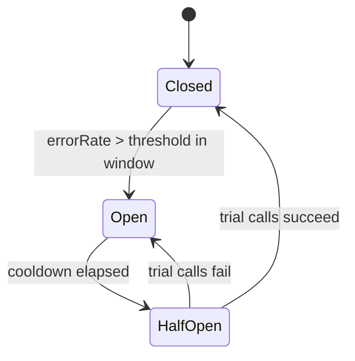

# Circuit Breaker

## 1. One-Line Definition
A circuit breaker is a client-side failure guard that trips "open" when a dependency's error rate crosses a threshold, fast-failing calls without attempting them — so a broken dependency doesn't tie up callers in timeouts, queues, and retries while it's down.

## 2. Why Do We Need It?
When a dependency is truly down, continuing to call it wastes resources, saturates pools and threads, and turns a 20ms outage into a minutes-long cascade of timeouts, queue build-ups, and retries across every caller. Retries are for *blips*; circuit breakers are for *outages* — they flip from "try" to "fail fast" the moment the dependency shows it isn't momentarily slow but persistently broken, and they probe for recovery so the system self-heals.

## 3. Simple Intuition
A household circuit breaker: while a device keeps short-circuiting, the switch stays off so you don't keep catching sparks. You don't keep testing every second — you wait a cooldown, then try once ("half-open"). If that trial passes, you close the circuit and resume normal flow; if it fails, you stay open. Same for integrations: keep "sparking" = timeouts/errors; open means "don't connect at all for a bit."

## 4. What Happens Without It?
Dependency dies → every caller issues a full request, waits the full timeout, retries, fails — meanwhile thread pools fill with blocked calls, queues back up, memory climbs, and a *single* downstream outage becomes an *everywhere* outage. The dependency recovers, but callers are thrashing in their own queues and can't see it. This is the classic "cascading failure" (see bulkhead/failover concepts for the rest).

## 5. Core Idea
- **Three states:**
  - *Closed:* normal — calls go through; failures counted against a window (e.g., 50%/10-request sliding window, per `failureRateThreshold`).
  - *Open:* threshold breached — NO calls sent; calls fail fast immediately (or use fallback): `waitDurationInOpenState` cooldown.
  - *Half-open:* after cooldown, a limited number of trial calls allowed; success → Closed; any failure → back to Open.
- **Key configs:** `failureRateThreshold` (e.g., 50% over window), `slidingWindowSize` (e.g., 10), `minimumNumberOfCalls` (avoid tripping on tiny samples), `waitDurationInOpenState` (e.g., 30s), `permittedNumberOfCallsInHalfOpen` (e.g., 1–5).
- **What counts as failure:** configurable — status >= 500, timeouts, or *slow calls* (latency threshold) — often count slow calls separately or together.
- **Why it must be client-side:** the breaker belongs with *callers*, because it's about spending caller resources; server-side it would only be a limiter, and it wouldn't protect peer stacks that share the dependency.
- **Cooperation:** breaker + retry must compose: retry quick, circuit stops fast (e.g., *Retry* first N attempts if closed, but stop as soon as breaker opens). Fallback (cache, default) lets calls return *something* while open.
- **Half-open probes = synthetic load:** limit trials; a heavy half-open tsunami is a retry storm in disguise.

## 6. Important Terminology

| Term | Simple Meaning |
|------|----------------|
| Closed / Open / Half-open | Normal / tripped / probing states |
| Failure rate threshold | % errors that trips the breaker |
| Sliding window | Sample window for counting failures |
| Minimum calls | Minimum traffic before tripping isn't allowed |
| Wait duration (open) | How long before probing recovery |
| Half-open probe | Limited trial calls to test recovery |
| Fallback | Stale/default/cached answer while open |

## 7. Basic Architecture



## 8. Request or Data Flow
1. Calls flow normally (Closed); failures counted in a rolling window.
2. Threshold tripped (e.g., >50% of last 10 = errors/timeouts) → Open: calls fail instantly, no dependency hit.
3. `waitDurationInOpenState` passes → Half-open: 2 trial requests sent.
4. Trials OK → Closed (slow taps resume). Failure → Open again, cooldown restarts.
5. During Open, callers return fallback (cache/default) — user experience degrades but doesn't hang.

## 9. Practical Example
**Recommendations service calls to a personalization DB (assumptions):** P99 normally 40ms; the DB starts retrying internally and taking 2s.
- Without breaker: recs latency jumps to 2s for *all* users; threads pile up; the DB "recovers" but callers are all stuck on old calls.
- With breaker (threshold 50%, window 10, cooldown 15s): after a few failures the circuit opens → recs instantly serve "popular fallback" from cache; DB health returns; probe succeeds → recs back. End-to-end user impact: ~minutes of "generic but fast" instead of "slow and erroring."

## 10. Scaling
- **Per dependency, per (caller, dependency) pair:** don't globalize one breaker — availability of service B affects each caller's breaker state differently.
- **Shared circuit for pooled resource:** DB connection pool + breaker pair well — breaker reduces pool saturation.
- **Metrics:** track breaker state change events, time-in-open, probe outcomes; alert on *downtime-served* (requests being poisoned), not on breaker opening itself (that's the intended protection).
- **Fleet scaling:** thousands of callers each have their own breaker — they'll trip/recover at slightly different times; jitter the probe attempts if probes stay synchronized.

## 11. Reliability and Failure Scenarios

| Failure | Happens | Detection | Recovery | Trade-off |
|---------|---------|-----------|----------|-----------|
| Dependency partial failure | Errors exceed threshold slow | Metrics | Circuit opens | error sampling window |
| Dependency dead | Open state, fallback pops | State metric | Probe after wait | fallback staleness |
| Slow (not errored) | Slow-call threshold trips | Latency dist | Open on latency too | tuning |
| Flapping recovery | Open→Closed repeatedly | State churn | Wait tuning, probe limits | churn |
| Cascade (LB saturated) | Multiple circuits open | Cross-service dashboard | Coordinated degradation | design |

## 12. Consistency and Correctness
Circuit breaking trades *some* fresh reads for *availability*: fallbacks can serve stale data (worth it for recs, never for balances). To stay correct, scope circuits for read paths and cache-backed fallbacks; transactional paths should fail fast loudly rather than return stale-wrong answers, with outbox/retry queues for writes.

## 13. Performance
- Open-state calls cost microseconds (fail fast) vs seconds of timeouts — the core win.
- Avoid counting in-process failure tripping when traffic is tiny (min calls caveat) — a 2-call sample tripping a breaker causes more harm than the failure it prevents.
- Half-open trial budget small: probes are extra load on a presumably-recovering dependency.

## 14. Security
- A breaker is client-state visible in metrics (dependency health) — expose internally, not externally.
- Fallback data paths can leak stale/previous-tenancy data if not namespaced — validate fallback responses against the same authz as live ones.
- Attackers causing 503-spam to trip a breaker is a cheap DoS: prefer rate-limit/WAF signal separation (see web-vulnerabilities).

## 15. Trade-Offs

| Choice | Advantages | Disadvantages | When to Use |
|--------|------------|---------------|-------------|
| No breaker | Simple, fresh | Cascading failures | Tiny scale, robust deps |
| Retry only | Hides blips | Amplifies storms | Blips, no outage risk |
| Breaker only | Fast-fail, protects peers | Needs tuning to avoid flapping | The default for remote deps |
| Breaker + retry + fallback | Full resilience | Complexity, stale fallback | The full stack in production |
| Half-open probes aggressive | Fast recovery | Probe storms | Only with low QPS |

## 16. Common Mistakes
- Threshold/window too small → flapping breaker harms traffic more than failure it prevents.
- No minimum-calls guard → tiny error samples trip a quiet system.
- Closing immediately on any probe success → thundering herd on a still-underlying-slow service.
- Putting the breaker *only* on the provider side (doesn't protect callers); it's a caller-side pattern first.
- Ignoring slow-call threshold — timeouts might never "error" at high percentiles until they become 5xx.

## 17. HLD vs LLD Boundary
HLD: breakers per critical dependency, thresholds/window/cooldown per SLO, fallback strategy (stale cache), monitor circuit state. LLD: library wiring (Resilience4j/Polly/Hystrix), call wrapping, metrics export, half-open probe code.

## 18. Interview Questions

### Beginner
- What do closed, open, and half-open mean?
- Why does the breaker live on the caller, not the callee?

### Intermediate
- Walk a cascade that occurs without a breaker, and how the breaker + fallback stops it.
- How do you tune threshold/cooldown so a slow (not dead) dependency doesn't flap the breaker?

### Advanced
- Design resilience for checkout (payments, inventory, cart) with breakers and 99.99% availability — include half-open math for a 2k QPS checkout and stale-fallback decisions per subsystem.
- How do 10k clients with individual breakers coordinate recovery without a synchronized probe storm?

## 19. Interview Memory Summary

> [!abstract]- Interview Memory Summary

### Remember

- Three states: closed (normal flow), open (fail fast, no calls), half-open (limited trial probes).
- Trips on error-rate or slow-call threshold over a sliding window, guarded by a minimum-calls floor.
- Open = never call the dependency: fail fast or serve fallback, saving caller resources.
- After cooldown, half-open probes recovery with a small trial budget; success closes, failure reopens.
- The breaker is client-side: it protects the caller's pools and the whole fleet sharing the dependency.
- Compose retry (short) around it and fallback (stale) while open for a complete resilience stack.
- Fast-failing one dependency stops a single outage from becoming an everywhere outage (cascade).

### 30-Second Explanation

Monitor the dependency's failures; when it's persistently failing, stop trying — serve fallback, wait a bounded cooldown, then probe a small trial and reopen on success.

### Interview Traps

- Treating circuit-open as an alarm — it's the protection mechanism firing, not a bug.
- Removing the minimum-calls guard — tiny error samples flap the breaker into harming more traffic than it saves.
- Closing immediately on one probe success — thundering herd on a still-slow service.
- Putting the breaker only on the provider side — it must be caller-side.
- Ignoring slow-call thresholds — timeouts that never become 5xx still need the breaker.

### Key Trade-Off

You trade a little freshness and availability (fast-failed calls, possibly stale fallbacks) for protecting the entire caller fleet from a single dependency's outage — the breaker spends error-leeway so cascades can't propagate.

## 20. Related Concepts

### Prerequisites

- [[reliability|Reliability]]
- [[availability|Availability]]

### Commonly Used Together

- [[retry-and-timeout|Retry and Timeout]]
- [[rate-limiter|Rate Limiter]]
- [[standby-models|Standby Models]]
- [[golden-signals|Golden Signals]]
- [[observability|Observability]]
- [[distributed-tracing|Distributed Tracing]]

### Alternatives

- [[failover|Failover]] — switch to a healthy dependency replica instead of failing fast
- [[rate-limiter|Rate Limiter]] — protect at admission rather than tripping on failures

### Advanced Concepts

- [[disaster-recovery|Disaster Recovery]] — breakers handle component outages; DR handles region-scale ones
- [[sli-slo-sla|SLI / SLO / SLA]] — thresholds and fallback freshness are SLO decisions

Related planned topics (not authored yet): bulkheads, load shedding, adaptive circuit breaking.

## 21. References
Resilience4j docs, Netflix Hystrix, AWS "Fault isolation with bulkheads" + circuit-breaker pattern guide. Verify config semantics in your library version.

## 22. Active Recall

Test yourself before revealing each answer.

> [!question]- Name the three breaker states and what each does.
> Closed = normal flow; failures are counted against a sliding window. Open = threshold breached; no calls reach the dependency, they fail fast (or use fallback) until a cooldown elapses. Half-open = a limited number of trial calls probe recovery — success closes the circuit, any failure reopens it.

> [!question]- Why must the breaker live with the caller, not the provider?
> Because its job is protecting caller resources (thread pools, timeouts, queues) and the whole fleet of callers sharing the dependency. Server-side it would only be a limiter for that one instance and wouldn't shield peer callers who also depend on the same service.

> [!question]- How do you tune threshold/window/cooldown for a slow-but-alive dependency?
> Add a slow-call threshold so timeouts that never become 5xx still count. Use a large enough sliding window + a minimum-calls floor so tiny samples don't flap the breaker; a cooldown long enough for the dependency to recover but short enough for your RTO; and a small half-open trial budget (1–5 calls).

> [!question]- Which failures should count toward tripping the breaker?
> Configurable: HTTP >= 500s, timeouts, and slow calls (latency threshold) — often tracked separately or together. Exclude client-caused 4xx (permanent, caller's fault) so the breaker reflects dependency health, not your own bugs.

> [!question]- What does a breaker trade away, and when is that trade wrong?
> Completely fresh reads and per-call availability on one path (fail-fast + possibly stale fallback) in exchange for protecting the fleet. It's wrong where correctness matters per call: balance reads can serve stale cache, but transactional/payment paths should fail loudly rather than return a stale-wrong answer.

> [!question]- Why must half-open trial calls be limited?
> Half-open probes are extra load on a presumably-recovering dependency — a heavy probe tsunami is a retry storm in disguise. A small permitted-call budget lets recovery be proven without re-saturating it.

> [!question]- A dependency recovers from an outage, but your service stays degraded longer. What happened?
> Likely callers are thrashing in their own pools on in-flight timed-out calls, or the breaker is flapping open/closed because tuning is off (no minimum-calls guard, or closing on a single probe success). The cooldown, pool draining, and trial limits let recovery register instead of re-tripping.

> [!question]- An attacker spams 503s to force your breaker open. How do you reason about this?
> It's a cheap DoS — breaching the error threshold on demand knocks out a dependency for everyone. Separate WAF/rate-limit signal from service health (see [[rate-limiter|Rate Limiter]], [[web-vulnerabilities|Web Vulnerabilities]]), and scope breakers per caller so one abusive caller's blip doesn't open the shared circuit.

> [!question]- Interview scenario: checkout (payments, inventory, cart) at 2k QPS — design breakers and fallbacks per subsystem.
> One breaker per (caller, dependency) pair. Payments: fail fast + outbox/queue writes — never stale-fallback money. Inventory: stale stock cache is an acceptable read fallback. Cart: cached cart fallback. Half-open trials ~2–5, cooldown 15–30s; alert on downtime-served (requests being poisoned), not on the breaker opening.

> [!question]- Interview scenario: 10k clients each have their own breaker. How do they recover without a synchronized probe storm?
> Check whether probes are synchronized: jitter the cooldowns per caller, stagger re-probe start times, and coordinate via a shared health/circuit signal where feasible so recovery cascades instead of collapsing into a wall of simultaneous probing.

## 23. When Should I Use This?

### Use it when

- A dependency can fail for more than a blip and its outage would cascade to every caller.
- Callers hold limited pools/queues that a slow dependency would saturate.
- You have an acceptable fallback (stale cache, default) to serve while open.
- Fast failure (microseconds) beats full timeout waits per call.
- Availability targets demand that one dependency's outage stays contained.

### Avoid it when

- The dependency is in your control and rarely fails — circuit overhead without payoff.
- Traffic is so low that the minimum-calls floor can't be met — the breaker never engages or flaps.
- The dependency is in-process (monolith) with no network boundary to guard.
- There is no meaningful fallback and errors fail loudly anyway — fast-fail helps, the stale-fallback complexity doesn't.
- The real problem is admission control or capacity — that's [[rate-limiter|Rate Limiter]]/scaling, not a breaker.

### What problem does it solve?

A single downstream outage burns every caller's threads and pools in long timeouts, queues, and retries, turning one failure into an everywhere failure (cascade). The bottleneck is caller resources spent with no payoff. The breaker trips on an error/latency threshold over a sliding window, fast-fails (or serves fallback) so caller resources and sibling services keep working, and half-open probes let the system self-heal.

### What problem does it NOT solve?

It isn't a retry mechanism (blips — use [[retry-and-timeout|Retry and Timeout]]), isn't admission control (load — use [[rate-limiter|Rate Limiter]]), doesn't recover lost data (replication/failover/DR), doesn't fix client-side 4xx, and a bad fallback can serve stale/wrong answers on paths where correctness matters.

## 24. Decision Connections

Decisions that go together with circuit breaking:

- [[retry-and-timeout|Retry and Timeout]] — they must compose: short retries while closed, stop the moment the circuit opens.
- [[rate-limiter|Rate Limiter]] — caps traffic so normal bursts don't blow through failure thresholds.
- [[standby-models|Standby Models]] — a breaker handles a dependency outage; standby handles whole-region loss.
- [[disaster-recovery|Disaster Recovery]] — the next escalation when fail-fast isn't enough.
- [[observability|Observability]] and [[golden-signals|Golden Signals]] — breaker-state metrics and downtime-served alerts.
- [[distributed-tracing|Distributed Tracing]] — see retry rounds and fallback paths in the trace.
- [[failover|Failover]] — when active, switch to a healthy peer instead of failing fast.
- [[sli-slo-sla|SLI / SLO / SLA]] — thresholds and fallback freshness encode the user-visible SLO.

Decision tree:

```
Dependency starts failing or slowing
    |
    +-- Failure is transient (a blip)?
    |      → [[retry-and-timeout|Retry and Timeout]] (bounded, jittered)
    |
    +-- Failures breach threshold in window and min-calls met?
    |      → open circuit → fail fast / fallback
    |         |
    |         +-- Cooldown elapsed → half-open trial probes
    |         |      +-- Trials succeed → close (resume normal flow)
    |         |      +-- Trials fail     → stay open, restart cooldown
    |
    +-- Dependency dead at provider level?
    |      → [[standby-models|Standby Models]] / [[failover|Failover]] / [[disaster-recovery|Disaster Recovery]]
    |
    +-- Load high but the service is healthy?
           → [[rate-limiter|Rate Limiter]] (admission control), not a breaker
```