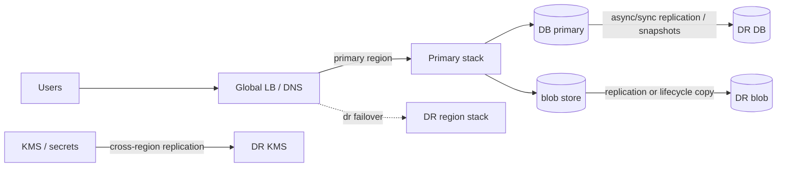

# Disaster Recovery

## 1. One-Line Definition
Disaster recovery (DR) is the planned, rehearsed process of keeping a system usable — restartable within an RTO with data no older than an RPO — after a catastrophe like a region or data-center loss.

## 2. Why Do We Need It?
Not every outage is a transient blip. A data center zone floods, a provider region degrades, a ransomware event hits the storage backend. For those, HA (replicas in the same region) isn't enough — the whole region is gone. DR answers two numbers: **how much data can we accept losing** (RPO) and **how fast must we be back** (RTO) — and then engineers build backups, replicas, and runbooks to meet them. Without DR, a fire in one building is a permanent company outage.

## 3. Simple Intuition
A company's backup of their books: they keep the ledger in the office (live), and every working day a courier takes a photocopy to a separate bank vault (backup). The numbers an executive wants before bed: "If the office burns down tonight, how many entries have we lost since yesterday's copy? (RPO = 1 day)" and "How quickly will we be operating from the vault branch? (RTO = 24 hours)." The whole DR plan is matching the *frequency of copying* and the *plans for re-opening* to what the business can tolerate.

## 4. What Happens Without It?
A region goes down with no consent to lose data and no plan to move: users can't log in, orders can't process, data goes missing permanently. No RPO means "acceptable data loss" is undefined (someone decided silently at recovery time); no RTO means recovery happens "when we get to it." And without rehearsals (drill/chaos), the runbook is fiction — the day you need it is the first time it runs. DR is *designed downtime-on-paper before unplanned downtime happens.*

## 5. Core Idea
- **The two numbers define everything:**
  - **RPO** (Recovery Point Objective): max acceptable data loss, window (e.g., 5 min). Smaller → more frequent replication to the DR site → more cost.
  - **RTO** (Recovery Time Objective): max acceptable downtime (e.g., 1 hour). Smaller → fully warm standby + automation.
- **Planning spectrum (copy the *state*):**
  - *Backup + restore:* periodic snapshots (daily/hourly) to object storage/other region. Lowest cost; RPO = hours, RTO = hours-days. Works for many stores (image assets, batch data).
  - *Pilot light:* minimal always-on skeleton + config; data replicated; turn on the rest on demand. Middle cost; RTO ~ minutes-hours.
  - *Warm standby:* full stack deployed but idle/light in the DR region, continuously synced data. RTO ~ minutes.
  - *Active-active (multi-region/multi-AZ live):* traffic serves from ≥2 regions simultaneously; failure = LB reroute. Best RTO (seconds) but requires app-level multi-region design (see standby-models, multi-region systems).
- **The data-chain problem:** DR must cover *every* source: databases (replication), message streams (replication), object/blob storage (replication/migration), config/feature flags, and **secrets/keys** (KMS cross-region). Missing chain = RPO is a lie for that system.
- **Failover plan** = automated or runbook-based: DNS/route switch, DB promote (clear the "we're now primary"), deprovision a degraded primary to avoid split brain (write fences), verify health before returning traffic.
- **Testing is part of the system:** regular DR drills, chaos days, and measured restore times. An untested runbook doesn't meet RTO.

## 6. Important Terminology

| Term | Simple Meaning |
|------|----------------|
| RPO | Max acceptable data loss window |
| RTO | Max acceptable downtime |
| DR site/region | Standby location to fail over into |
| Backup + restore | Snapshots used to rebuild after disaster |
| Pilot light | Minimal always-on footprint + on-demand scale-up |
| Warm standby | Full-ish stack idle, data synced |
| Active-active | Live in ≥2 regions simultaneously |
| Failover | Switching service to the DR site |
| Failback | Returning to the primary after recovery |
| Split brain | Two primaries accepting writes (must prevent) |

## 7. Basic Architecture



## 8. Request or Data Flow
1. Normal: traffic to primary; data replicated to DR region per RPO policy.
2. Disaster declared (primary region providers fail).
3. Follow runbook/automation: cut DNS/route → DR stack; promote DR DB (fencing old primary writes); verify health endpoints; replay any data gap within RPO.
4. Traffic served from DR; users may lose ≤ RPO data and see RTO-duration downtime.
5. Later: fix primary, sync back, failback cleanly (roll data forward from DR again, no split brain).

## 9. Practical Example
**Multi-tenant SaaS (assumptions):** RPO 15 min, RTO 1 hour, provider region-primary + warm-standby region.
- DB: continuous async replication to `pg_dump`/standby + 15-min WAL snapshot → RPO met.
- Blob: S3 Cross-Region Replication (replicating uploads continuously).
- Streaming: Kafka MirrorMaker2 later (see ecosystem); until then events buffer locally in region.
- Drill quarterly: promotes standby, replays the gap, measures RTO 45 min and RPO 10 min measured. The rehearsal found a missing secret sync — fixed before a real disaster.

## 10. Scaling
- **Cross-region bandwidth** grows with data: async replication is cheap-ish; RPO-down-to-zero (sync) cannot cross WAN realistically at high speed (needs low-latency links, often same-region AZ only).
- **DR for the whole surface area** — LBs, worker queues, scheduler state, caches (rebuildable? then exclude), temp tables. Decide per component: replicate vs rebuild vs accept loss.
- **Testing at scale:** drills on prod require traffic-in/out coordination; compartmentalize (DR of one shard first, pre-production drills).

## 11. Reliability and Failure Scenarios

| Failure | Happens | Detection | Recovery | Trade-off |
|---------|---------|-----------|----------|-----------|
| Primary region outage | Everything in region unavailable | Region health + watchdog | Failover to DR | RTO clock starts at decision |
| Data gap at DR | Last RPO window missing | Replication lag alerts | Last-sync + accept loss up to RPO | RPO size |
| Split brain | Both regions write | Fencing check | Demote ex-primary | fencing cost |
| DR stack stale | Failover breaks on first use | Drill evidence | Fix stack | rehearsal time |
| KMS/secrets missing | Decrypt fails at DR | Pre-verify | Replicate keys | security approval |

## 12. Consistency and Correctness
- DR replication can't be both fast and synchronized everywhere: async replication ships data, RPO defines the acceptable gap; you may need **reconciliation jobs** to close it (replay from source-of-truth, dedup by IDs). Corruption problems on failback are a silent killer — validate checksums/hashes and use write-fencing so a recovering primary can't resurrect stale state.

## 13. Performance
- Cost drivers: replication copy volume (database + blobs + streams), DR standby compute, storage duplication in DR, drill time. "0 downtime vision" for everything is expensive; tier the business RTO/RPO per system (ledger 0/RTO5m; analytics 24h/1h — cheaper).

## 14. Security
- Cross-region copies = more surface: replicate simultaneously with keys/scopes, encrypt at rest *and* in transit, keep the backup/DR region on the same access-control model as primary (a cold copy that's world-readable defeats the purpose).
- Secrets/logs: match retention and redaction in DR copies; restore paths must be auditable and least-privileged (DBA+security attested).

## 15. Trade-Offs

| Choice | Advantages | Disadvantages | When to Use |
|--------|------------|---------------|-------------|
| Backup + restore | Cheapest, simplest | RTO hours-days | Non-critical stores, batch/archive |
| Pilot light | Cheap midpoint | Mid RTO, gap risk | Slow-moving systems |
| Warm standby | Good RTO/RPO | Cost ×2, drift risk | Normal production services |
| Active-active | Near-zero RTO | Multi-region handling, app complexity | Tier-0 money/identity systems |
| Replicate everything vs rebuild | — | Cost vs RTO | Per-component matrix |

## 16. Common Mistakes
- RPO/RTO written but never measured (numbers are dreams until a drill).
- Replicating the DB but not blobs/streams/secrets/KMS (recovered but can't run/decrypt/data-lost).
- No fencing on failover → split-brain double-writes for hours.
- DR experience "first test = first disaster," and failing back in a panic (not engineering a return plan).
- Treating analytics/audit loss as "acceptable" out of hand — sometimes it's a compliance violation, not just data.

## 17. HLD vs LLD Boundary
HLD: RPO/RTO targets, DR topology (backup/pilot/warm/active-active), replication matrix, failover/failback sequence, drill/testing methodology. LLD: snapshot/restore implementation, replication configs, route/DNS automation, fencing mechanics, runbook scripts.

## 18. Interview Questions

### Beginner
- What is RPO vs RTO?
- Why isn't database replication alone a DR plan?

### Intermediate
- Design DR for a 100k-user product with RPO 5 min, RTO 1 hour, one provider region. Walk replication for DB/blob/streams and the failover sequence.
- Pick warm standby vs active-active for this system, with the cost/behavior trade-off.

### Advanced
- DR for a payments ledger: define a per-system RPO/RTO matrix and design the full-copy strategy + reconciliation + failback without duplicate charges.
- A mock drill reveals DR restore takes 6h vs a 1h RTO. Diagnose top-5 reasons and their fixes.

## 19. Interview Memory Summary

> [!abstract]- Interview Memory Summary

### Remember

- RPO = acceptable data-loss window; RTO = acceptable downtime; both are business decisions set before architecture.
- DR posture spectrum: backup+restore → pilot light → warm standby → active-active — each buys lower RTO at higher cost.
- Replicate the whole data chain: DB, blobs, streams, config/feature flags, and KMS/secrets — a missing link makes RPO a lie.
- Failover must fence the old primary (no split-brain double writes) and have a planned failback.
- Untested DR is fiction: drills, chaos days, and measured restore times are part of the system.
- DR ≠ HA: same-region replicas cannot survive a region loss.

### 30-Second Explanation

Pick RPO/RTO with the business, choose the DR posture that meets them, replicate every store to the DR region, rehearse failover/failback with fencing, and measure against targets.

### Interview Traps

- Quoting "DR with replication replicas" while leaving out blobs/config/secrets or a rehearsed failover.
- RPO/RTO written but never measured — numbers are dreams until a drill.
- No fencing on failover — split-brain double-writes for hours.
- First test = first disaster; failing back in a panic without a plan.
- Replicating data but not the compute/config/keys — recovered but can't run.

### Key Trade-Off

DR trades money for recovery speed and loss tolerance: replicating everything to a warm active-active standby costs 2–3× steady capacity, while cheap backup-only postures accept long RTO and windowed data loss — the per-system RPO/RTO decides where on that curve you sit.

## 20. Related Concepts

### Prerequisites

- [[rpo-rto|RPO and RTO]]
- [[availability|Availability]]
- [[reliability|Reliability]]

### Commonly Used Together

- [[standby-models|Standby Models]]
- [[database-replication|Database Replication]]
- [[failover|Failover]]
- [[replication-lag|Replication Lag]]
- [[encryption-and-keys|Encryption and Keys]]

### Alternatives

- [[failover|Failover]] — same-region HA failover is not a substitute for cross-region DR

### Advanced Concepts

- [[replication-lag|Replication Lag]] — RPO drift across the WAN
- [[sli-slo-sla|SLI / SLO / SLA]] — steady-state SLOs vs the disaster contract
- [[kafka-replication|Kafka Replication]] — streaming replication closes the data-chain gap

Related planned topics (not authored yet): multi-region systems, cross-region replication, chaos engineering.

## 21. References
AWS disaster recovery whitepaper (four strategies), Microsoft Well-Architected DR pillars, Google SRE "outage" practices. Verify current provider features for interviews.

## 22. Active Recall

Test yourself before revealing each answer.

> [!question]- RPO vs RTO — one sentence each. Why are they independent?
> RPO = how far back in time your last good copy may be (the data-loss window); RTO = how fast you must be back serving after the disaster. They're independent: you can copy every 5 minutes yet restart in 24h (RPO 5m, RTO 24h), or copy nightly yet fail over in 5 minutes (RPO 24h, RTO 5m).

> [!question]- Why isn't database replication alone a DR plan?
> Replication covers one store of several — blobs, streams, config, and secrets/KMS also need copying — and it says nothing about compute, failover automation, fencing, or an untested runbook. DR is holistic: data + infrastructure + process + rehearsal (see the data-chain problem in section 5).

> [!question]- Design DR for a 100k-user product with RPO 5 minutes, RTO 1 hour, one provider region.
> Warm standby in a second region: DB async replica with WAL/stream replication held within 5 minutes of lag, blob cross-region replication, stream replication, and automation for DNS switch + DB promote + fencing. Quarterly drills measure detection + promotion + validation phases and replay the gap within RPO.

> [!question]- Warm standby vs active-active — pick one for this system and justify.
> Warm standby: one flow of traffic, data replicated, RTO in minutes at roughly one extra stack of cost. Active-active doubles capacity and requires app-level multi-region semantics (partitioned writes, session affinity, conflict handling) — overkill unless RTO must be seconds and writes can be partitioned.

> [!question]- What drives DR cost, and how do you tier it?
> Cost = replication volume (DB + blobs + streams) + standby compute + storage duplication + drill time; each extra nine or each minute shaved from RTO multiplies it roughly 10×. Tier by business: ledger RPO ~0/RTO 5m (expensive), analytics RPO 24h/RTO 1h (cheap snapshots).

> [!question]- Why can't you have true RPO=0 sync replication across a WAN?
> Synchronous replication waits for the remote ack on every commit — cross-WAN round trips add latency proportional to distance and cap throughput. So practical "RPO 0" is sync same-AZ or a carefully reconciled active-active design; async replication ships data but defines an RPO gap that reconciliation/clocks must close.

> [!question]- A drill shows restore takes 6h against a 1h RTO. Diagnose the top-5 causes.
> Cold (not warm) standby capacity; slow detection/decision steps not automated; no pre-provisioned compute (scale lag); missing secret/KMS sync blocking decryption; untested runbook/manual config and DNS TTLs; restore order (data before infra). Fix by automating each phase, pre-warming capacity, and measuring per-phase on every drill.

> [!question]- After failover, the old region recovers and starts writing again. What's the horror and the prevention?
> Split brain — two primaries accepting writes that diverge. Prevent with fencing: demote the old primary and lock its write access at promote time, use epoch/write fences and quorum, and engineer failback as a sequence (sync forward from DR, demote, validate, re-route) rather than improvisation.

> [!question]- Interview scenario: DR for a payments ledger — per-system RPO/RTO matrix without double charges.
> Ledger: RPO ~seconds, RTO 5m — hot/warm standby or active-active with partitioned writes; continuous replication plus reconciliation jobs that replay from a source of truth and dedup by ID; idempotency keys so replays and chargebacks never double-debit. Keep messaging streams and KMS/secrets in the same RPO chain. Drill quarterly and measure the real gap.

> [!question]- "We have backups and replicas, so DR is handled." Respond.
> Ask about RPO/RTO agreed with the business; which stores are replicated (blobs/streams/config/secrets/KMS); the failover sequence and fencing; and when the last drill ran and what it measured. Backups ≠ recoverability, replicas ≠ region survival, and a missing data-chain link makes the RPO a lie.

## 23. When Should I Use This?

### Use it when

- A whole region or datacenter loss would violate business or compliance requirements.
- The data is irreplaceable (ledgers, identity, regulated records).
- Product/legal have defined loss and downtime tolerances (RPO/RTO).
- You can fund the posture the real RPO/RTO demands for each system.
- You can commit to regular rehearsals — an untested DR plan doesn't meet RTO.

### Avoid it when

- The service is rebuildable or stateless (e.g., cache) — rebuild or accept loss instead.
- Budget can't fund standby compute + replication volume for the required RPO/RTO.
- Cross-region replication is physically infeasible (e.g., sync RPO=0) — redesign or re-scope the target.
- The team can't sustain drills — a plan that never runs is fiction.
- Same-region HA already covers the actual risk (zone-only threats) — DR is premature cost.

### What problem does it solve?

A region/datacenter catastrophe destroys that region's data and infrastructure, and same-region HA collapses with it. The bottleneck: recovery is improvisational — "how much did we lose?" and "when are we back?" get answered after the event. DR solves it by agreeing RPO/RTO first, replicating every stateful store to a standby region at a matched posture, automating an ordered failover with fencing, and proving it with drills.

### What problem does it NOT solve?

Normal availability (that's HA/failover), transient blips (retries/circuit breakers), split brain if fencing is skipped, RPO=0 across a physical WAN, data corruption by design (replication copies bad state — keep snapshots/checksums), and failback if no return plan was engineered.

## 24. Decision Connections

Decisions that go together with disaster recovery:

- [[rpo-rto|RPO and RTO]] — the input contract; the DR topology is derived from these two numbers.
- [[standby-models|Standby Models]] — the mechanism that turns RTO into procurement (warmth = cost vs speed).
- [[database-replication|Database Replication]] and [[replication-lag|Replication Lag]] — the DB copy strategy sets the achievable RPO.
- [[failover|Failover]] — the promote/fence/validate/route mechanics of the switch-over.
- [[encryption-and-keys|Encryption and Keys]] — KMS/secret replication so the DR site can decrypt and authenticate.
- [[reliability|Reliability]] and [[availability|Availability]] — DR is the availability plan for region-scale loss.
- [[sli-slo-sla|SLI / SLO / SLA]] — disaster objectives complement, not replace, steady-state SLOs.
- [[kafka-replication|Kafka Replication]] — streaming replication closes the message-stream gap in the RPO chain.

Decision tree:

```
Region/DC-scale disaster must not kill the system
    |
    +-- Region loss unacceptable?
    |      → [[disaster-recovery|Disaster Recovery]]
    |         |
    |         +-- RPO hours / RTO days?    → backup + restore
    |         +-- RPO minutes / RTO mins?  → warm standby
    |         +-- RPO ~0 / RTO seconds?    → active-active (partitioned writes)
    |
    +-- Only zone/instance loss in scope?
    |      → same-region [[database-replication|Database Replication]] + [[failover|Failover]] (HA, not DR)
    |
    +-- Data easily rebuildable?
    |      → accept loss / rebuild, no standby cost
    |
    +-- Which stores must be copied?
    |      → DB + blobs + streams + [[encryption-and-keys|Encryption and Keys]] + config
    |
    +-- Proven?
           → drills + measured RPO/RTO, fencing on failover, planned failback
```