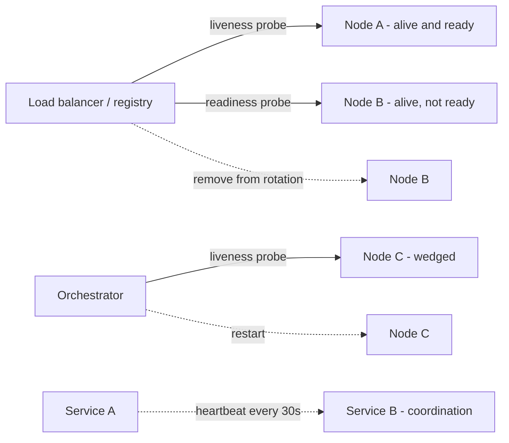

# Heartbeat and Health Checks

## 1. One-Line Definition
Health checks are the probes that tell a router, load balancer, or scheduler whether a node is capable of taking traffic: the load balancer sends periodic *liveness* probes (is the process alive, wired to a *heartbeat*) and *readiness* probes (is it ready to serve useful traffic), removing unhealthy nodes from rotation and admitting healthy ones.

## 2. Why Do We Need It?
A system with N instances has no way to know which are serving correctly without asking — process-up does not equal serving-well. Without health checks, a load balancer happily forwards traffic to a crashed, hung, or half-deployed node, and those requests fail or stall while perfectly healthy peers idle. Health checks give the [[load-balancing|Load Balancer]], [[service-discovery|Service Discovery]] registry, and orchestrator the primitive they need: *detect* the bad node, *remove* it (no traffic → fail closes, maintenance works), and *readmit* it when it recovers. Heartbeats are the same idea for coordination: other nodes infer "partner is alive" from a periodic signal rather than querying it directly.

## 3. Simple Intuition
A restaurant caller wants a table; the host calls around to the branches. Each branch answers "we are open" (liveness). But "open" is not enough — one branch's kitchen is failing; it should answer "yes, but not taking new orders tonight" (readiness). The host routes callers only to branches that say both "alive" and "ready." If a branch stops answering, the host stops sending callers there until it calls back. Out in the field, branch managers periodically radio HQ just to prove they are alive — that's the heartbeat.

## 4. What Happens Without It?
Blind routing: with no probes, the waiter sends a request to a node that crashed 3 minutes ago — it times out; the client retries; the next node is congested from absorbing everyone's retries. Deploys look like "errors appear and vanish randomly" because no one told the router a node was mid-shutdown. Half-deployed services serve fatally stale config. The failure looks like "our latency is bad" but is really "20% of our nodes are dead and we're still sending them traffic." Every modern platform (LB, k8s, service mesh) is built on these probes that we then forget to actually *customize*.

## 5. Core Idea
- **Liveness vs readiness — the canonical split:**
  - *Liveness* = "is the process alive and not wedged?" (checks itself; a failure means restart the pod). An unhealthy-live node is restarted — it cannot serve *this* traffic anyway.
  - *Readiness* = "is it ready to serve useful traffic?" (checks dependencies: DB, cache, config, warm caches, no draining flag). Failure here does NOT restart — it removes the node from service until it becomes ready again.
- **Probe mechanics (LB/k8s):** a GET on a designated endpoint (`/healthz`, `/readyz`) with expected status; k8s parameters: `initialDelay`, `periodSeconds`, `timeoutSeconds`, `failureThreshold`, `successThreshold`.
- **Heartbeat = the partner-side signal:** instead of probing, services emit periodic heartbeats (lease refreshes in coordination, membership in gossip, worker->broker keepalive). If the hearer misses N beats, it declares the sender dead. Heartbeats are how [[distributed-scheduling|Distributed Scheduling]] and consensus layers detect failures without polling.
- **What a good health endpoint actually checks:**
  - The process is up (liveness) — but that is the *weakest* check.
  - The critical dependencies respond within budget (readiness): DB, cache, message broker, config service, its own ability to accept load.
  - Not every dependency: if the health check itself depends on a flaky optional service, the node flaps (readiness seesaw) and sheds all traffic for no user-visible reason.
- **Deep vs shallow:** a shallow check ("HTTP 200 always") is nearly useless; a deep check ("can I reach my DB and does my cache warm key respond?") reflects real readiness. Balance depth against cost.
- **Kubernetes mechanics:** kubelet runs the probes on the container; a failing liveness restarts (crashloop control), failing readiness un-marks the Service endpoints. Terminating pods drop readiness themselves (the pod is about to die — graceful drain).
- **Health as a deployment tool:** readiness gates a rolling deploy — the LB sends a new version only once ready; the old version drains as its readiness drops. See [[deployment-strategies|Deployment Strategies]].

## 6. Important Terminology

| Term | Simple Meaning |
|------|----------------|
| Liveness probe | "Is the process alive?" — restart on failure |
| Readiness probe | "Can it serve traffic?" — pull from service on failure |
| Startup probe | "Is initialization complete?" — gates liveness/readiness |
| Heartbeat | Periodic signal asserting "I am alive" |
| Lease / keepalive | Time-framed heartbeat; expiry means dead |
| Flapping | Node oscillating healthy/unhealthy rapidly |
| Drain | Gracefully stop new work, finish in-flight |
| Grace period | Time before a dead/tainted node is removed |

## 7. Basic Architecture



## 8. Request or Data Flow
1. Node C applies for rotation: it registers with the registry, and its `/readyz` passes (DB reachable, cache warm) → the LB adds it to the pool.
2. Requests arrive → LB probes `/healthz` periodically (every ~10s) to separate "alive" from "wedged".
3. Config load fails: `/readyz` returns 503 → the LB removes C from rotation (its in-flight requests finish/drain). The orchestrator does **not** restart it — ready failure isn't a crash.
4. Node D wedges (liveness fails) → orchestrator restarts it; startup probe gates when liveness/readiness resume probing.
5. Heartbeat world: Service B expects A's beat every 30s; after 90s of silence it declares A dead and fails over its active leases.

## 9. Practical Example
**Checkout platform (assumptions):** 200 pods, p99 checkout 180ms, card-provider occasionally slow.
- `/readyz` for an instance checks: DB reachable (<50ms), cache reachable (<20ms), and it is not draining. It does NOT check the card provider (optional latency) or analytics (non-critical) — those would make a healthy node flap.
- k8s: liveness period 10s with failureThreshold 3 (restart if 30s no liveness); readiness period 5s failureThreshold 3 (out of rotation within ~15s of readiness failure); startup probe 60s so slow-JVM pods are not killed during warm-up.
- During a roll of the DB, every pod flips unready in sequence → the LB pulls them in a wave; the rollout is non-disruptive. During a card-provider outage, pods stay healthy (they shed at the checkout layer with [[load-shedding|Load Shedding]]), so capacity is not wasted on restarting healthy nodes.
- Ship a bad deploy: its `/readyz` fails at boot → no traffic is routed to it; the previous version's readiness holds until rollback completes.

## 10. Scaling
- **Probe volume:** as the fleet grows, probe traffic is non-trivial — batch endpoints, keep the probe cost ~0 (index lookups only), and let the LB poll at the slowest useful period (LB/registry neighbor sampling beats orchestrator-wide sweep).
- **Coordination heartbeats scale better than polling:** gossip-style heartbeats (see [[gossip-protocol|Gossip Protocol]]) are O(log N) per node vs O(N) registry polling, which is why clusters use them for membership.
- **Flap control at scale:** when many nodes share one dependency (DB blip), readiness can flap fleet-wide — smooth it with thresholds, hold-off timers, and a "readiness grace" so one 2-second blip does not drain 200 pods.
- **Readiness must gate autoscaling healthily:** an autoscaler that reads readiness only (not liveness) can keep scale-up pods around that are ready though useless; separate the signals.

## 11. Reliability and Failure Scenarios

| Failure | What Happens | Detection | Recovery | Trade-off |
|---------|--------------|-----------|----------|-----------|
| Node crashes | Latency briefly, then no traffic | Liveness probe fails | Restart + startup gate | restart loop risk |
| Node wedged (hang) | Process up, requests stall | Liveness fails (timeout) | Restart | none |
| Dependency down | Node "alive but unready" | Readiness fails | Re-enter when dep up | drained node idle |
| Flapping | Readiness oscillates | Flap counter | Thresholds, hold-off | readiness grace |
| Stale registration | LB adds dead node | Heartbeat registry | Expire lease | false-negative grace |
| Deep check too slow | Health endpoint itself slow | Probe timeout | Balance depth/cost | check fidelity |

## 12. Consistency and Correctness
- Health is **eventual, not instant**: a node takes a few probe periods to be marked down, and a few to be readmitted. Budget this in failover design (see [[failover|Failover]]) — double-serving briefly is normal, split-brain-style writes are guarded by leases, not probes.
- Readiness meaning is **per-check contract**: public `/readyz` and internal `/live` must not disagree about what "ready" means for different consumers (LB vs orchestrator).
- Graceful drain: a node must *actively* drop readiness on shutdown signals, then finish in-flight (idempotent retries cover the tail). Otherwise the LB keeps sending into a dying pod.
- Heartbeat expiry creates ambiguity (is it dead or slow?): pair heartbeats with leases (time-bounded grants) so a slow partner loses its grant rather than trusting "still beating."

## 13. Performance
- Probe cost: keep every health endpoint ~100µs-1ms (an index or two, no heavy work); a 200-pod fleet polled per second is < 1% of a node's capacity.
- Deep readiness catches real problems but adds latency to the *detection* (a 500ms DB call in the check delays detection); use budgeted calls and cache critically.
- Cheap rule: check the process trivially for liveness, check the *critical* dependency path shallowly for readiness, and let [[golden-signals|Golden Signals]] (business-visible error/latency) catch everything a probe cannot.

## 14. Security
- Never put sensitive logic in health endpoints — they are unauthenticated by nature (LBs must call them). No queries that return data, no DB dumps on failure, no stack traces.
- Health endpoints can reveal topology (counts of instances) — fine internally, keep them internal-only; don't expose readiness to the public internet.
- Rate-limit anything that depends on health responses in public surfaces; health is an operational channel, not an API.

## 15. Trade-Offs

| Choice | Advantages | Disadvantages | When to Use |
|--------|------------|---------------|-------------|
| Liveness only | Simple | Won't catch dep-down nodes | Orchestrator crash-control only |
| Readiness (deep) | Real "can serve traffic" | Flap risk, probe cost | Default for serving nodes |
| Startup probe | No kill-during-warmup | Extra config | Slow-JVM/container apps |
| Heartbeat + lease | No polling, time-bounded | Lease tuning (grace) | Coordination/membership |
| Passive (LB-sampled) | Zero app endpoints | Slower detection, less precise | Infra without endpoints |

## 16. Common Mistakes
- Publishing the same trivial readiness (200 always) everywhere — the check detects nothing and the LB keeps routing into a dead node.
- Readiness checking *every* dependency including optional ones → a flaky analytics API flaps the entire fleet.
- Letting the health check do real work (a heavy query, a reconnection) — the probe itself becomes the outage.
- Confusing liveness with readiness — a dep-down node gets restarted repeatedly (restart bomb) instead of gracefully removed.
- No drain on shutdown — the LB keeps sending to a sitting duck.
- No startup probe — slow-to-warm pods get killed before they ever stand up.

## 17. HLD vs LLD Boundary
HLD: which nodes get which probes (liveness/readiness/startup), what readiness actually checks (critical deps only, budgeted), thresholds and periods, drain policy, heartbeat cadence/lease grace, health as a deploy gate, flap control. LLD: the `/healthz`/`/readyz` handlers, k8s probe YAML, heartbeat client, check implementations, metrics.

## 18. Interview Questions

### Beginner
- What is the difference between a liveness probe and a readiness probe?
- Why does process-alive not equal can-serve-traffic?

### Intermediate
- Your payments pods flap offline whenever the analytics dependency is slow. Diagnose and fix.
- Walk a rolling deploy: how do readiness probes keep the new version from receiving traffic before it can serve?

### Advanced
- Designing heartbeats with leases for a 5000-node coordination service: what cadence, what grace, and what happens on a network partition?
- Health endpoints are unauthenticated and queried many times/sec. Design them safely and cheaply at fleet scale.

## 19. Interview Memory Summary

> [!abstract]- Interview Memory Summary

### Remember

- Liveness = is it alive → restart; readiness = can it serve → un-rotate.
- Startup probe gates both so warm-ups don't get killed.
- Readiness checks the *critical* dependency path, cheaply — not every dependency.
- Probe endpoints cost almost nothing (index lookups); ownership & depth matter.
- Flapping is a readiness design smell (optional deps, no thresholds).
- Healthy nodes drain by dropping readiness on shutdown.
- Heartbeat + lease = coordination failure detection without polling.
- Health gates deploys and autoscaling, not just routing.

### 30-Second Explanation

Give the orchestrator a liveness probe (alive → restart) and the router a readiness probe (capable → keep in pool, else drain), check only the critical path cheaply, add a startup probe so warm-ups live, drop readiness on shutdown for graceful drain, and let services announce liveness via heartbeat+lease where polling would not scale.

### Interview Traps

- "We have a health endpoint" that returns 200 unconditionally — a check that detects nothing.
- Readiness on every dependency → fleet-wide flap on one blip.
- Restarting on readiness failure (that's what liveness is for).
- Health endpoint doing real work — the probe becomes the incident.
- Ignoring graceful drain on shutdown/deploy.

### Key Trade-Off

Health checks trade detection speed against probe cost and flap risk: shallow probes are cheap but blind, deep ones reveal real states but can take healthy nodes out on dependency blips — the correct depth is "critical path only, budgeted, thresholded."

## 20. Related Concepts

### Prerequisites

- [[load-balancing|Load Balancing]] — the primary consumer of health probes.
- [[availability|Availability]] — what health checks exist to protect.

### Commonly Used Together

- [[service-discovery|Service Discovery]] — registry + health; dead nodes are expired, not just removed.
- [[failover|Failover]] — ready detection gates who takes over.
- [[deployment-strategies|Deployment Strategies]] — readiness is the rolling-deploy gate.
- [[golden-signals|Golden Signals]] — business-visible health the probes cannot see.
- [[observability|Observability]] — health and SLO metrics cross-reference (see [[sli-slo-sla|SLI / SLO / SLA]]).
- [[autoscaling|Autoscaling]] — scale decisions must distinguish liveness from readiness.
- [[kubernetes|Kubernetes]] — where the probe model is the native primitive.

### Alternatives

- Passive LB health (counting request failures) when add probes impossible — slower, less precise.
- Gossip-based membership heartbeats ([[gossip-protocol|Gossip Protocol]]) at cluster scale.

### Advanced Concepts

- [[distributed-locks|Distributed Locks]] and lease extension — heartbeats + timeouts are how locks don't deadlock.
- [[adversarial-reliability|Adversarial Reliability]] — chaos-injected liveness failures validate the probes.

Related planned topics (not authored yet): health-checks variants (LB active/passive), connection-draining.

## 21. References
Kubernetes docs ("Configure liveness, readiness and startup probes"); Google SRE Workbook (alerts on endpoint health); AWS ELB health check docs; gRPC health checking protocol. Verify current k8s/LB defaults before interview use.

## 22. Active Recall

Test yourself before revealing each answer.

> [!question]- Liveness vs readiness: what happens to the pod on each failure?
> Liveness failure → the orchestrator restarts the process (it is wedged/crashed and cannot serve at all). Readiness failure → the orchestrator/router stops sending traffic to it but does NOT restart it; it tries again on the next probe and readmits the node when ready. Restart-fatal vs remove-and-retry.

> [!question]- Why would a healthy node report "not ready" and what does that prevent?
> When a critical dependency (DB, cache) is unreachable or it is draining, the node cannot do useful work even though it is alive. Reporting unready removes it from rotation now, so traffic lands on nodes that can actually serve — rather than queuing on a node that will fail every request.

> [!question]- A flaky optional service makes your pods flap. What is the root cause and the fix?
> Root cause: the readiness check includes a dependency that is allowed to be slow/unavailable and that is not on the serving critical path. Fix: check only the critical path (DB it serves from, cache it reads, config it needs), budget those calls, and add thresholds/hold-off so a 2-second blip doesn't drain the fleet.

> [!question]- How do readiness probes make a rolling deploy safe?
> The new pool's pods register only after `/readyz` passes — their DB connections, cache, and config are validated before the router sends them real traffic. The old pool stays in rotation until its replacement is proven, then drains by dropping readiness on shutdown. A failing deploy never receives traffic and the previous version keeps serving.

> [!question]- What does the startup probe prevent, and why don't liveness/readiness cover it?
> A slow-to-warm process (JVM, cache fill) would be killed by the liveness probe before it ever went ready — a restart loop. The startup probe gives it a generous one-time window; liveness and readiness suspend until the startup succeeds, then resume normal probing.

> [!question]- Interview scenario: 5000 nodes, and coordination needs to know who is alive without polling each node.
> Use heartbeat + lease: each node sends a heartbeat at cadence T (say 20s) carrying a lease request; peers/acceptor grants time-bounded leases (e.g., 60s). Missing N beats or an expired lease declares the sender dead — without a query per node. Grace must exceed worst realistic hiccup; on network partition, both sides see each other "dead" but leases keep writes safe because grants are time-bounded, not belief-bound.

> [!question]- Why must health endpoints stay deeply shallow?
> They are unauthenticated (LBs must probe), called constantly, and must never be the thing that fails: no sensitive data, no heavy queries, no stack traces, no topology leaks, no logic that itself needs dependencies. Depth goes into *readiness decisions*, not into the probe handler's execution weight.

## 23. When Should I Use This?

### Use it when

- Any LB, service mesh, or orchestrator routes traffic to your instances.
- Deploys must not send traffic to a not-yet-ready replacement.
- Coordination services (worker pools, consensus) need failure detection — use heartbeat + lease there.
- Autoscaling and failover decisions consume node health.

### Avoid it when

- A single node with no router, registry, or orchestrator consuming health — the signal has no reader (yet).
- Everything runs on external gateways you cannot instrument — passive failure sampling (counting request errors) may have to stand in briefly.

### What problem does it solve?

A router that cannot tell alive from dead sends traffic down dead ends: latency, failures, and redistribution storms. Health checks provide the signal that makes removal and admission automatic — the primitive every LB, orchestrator, registry, and deploy strategy is actually built on.

### What problem does it NOT solve?

Health checks detect a node's own state, not end-user-visible availability — the SLO view lives in [[golden-signals|Golden Signals]] and [[sli-slo-sla|SLI / SLO / SLA]]. They do not isolate *why* a dependency fails (tracing does), and they cannot prevent the failure — they only stop routing to it.

## 24. Decision Connections

Decisions that go together with health checks:

- [[load-balancing|Load Balancing]] — probes drive rotation.
- [[service-discovery|Service Discovery]] — health expires stale registrations.
- [[deployment-strategies|Deployment Strategies]] — readiness gates rollouts and drains.
- [[failover|Failover]] — readiness decides who can take over.
- [[autoscaling|Autoscaling]] — scale on readiness vs liveness, separately.
- [[distributed-locks|Distributed Locks]] — heartbeat + lease prevents lock deadlock.
- [[golden-signals|Golden Signals]] — the business-visible supplement no probe provides.
- [[adversarial-reliability|Adversarial Reliability]] — chaos probes validate the probes.

Decision tree:

```
A node can take traffic?
    |
    +-- Is it alive (not wedged/crashed)?
    |      → liveness probe → failure = restart
    |
    +-- Is it ready to serve?
    |      → readiness probe
    |         |
    |         +-- Critical deps reachable?   → keep in rotation
    |         +-- Dep down or draining?      → remove; retry on next probe
    |         +-- Which deps?                → critical path ONLY, budgeted
    |         +-- Warm-up?                   → startup probe gates the rest
    |         +-- Shutdown?                  → drop readiness, drain grace
    |
    +-- Cluster-scale coordination?
           → heartbeat + lease (time-bounded), not poll-per-node
```