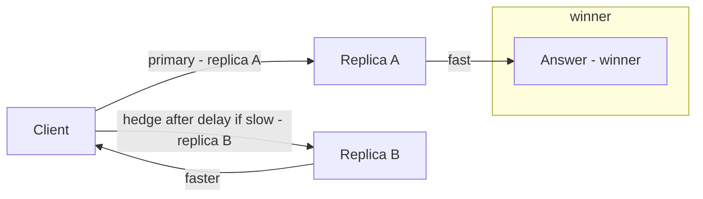

# Hedged Requests

## 1. One-Line Definition
A hedged request is a technique for tail latency: after a brief delay without a response, the client sends a *second, duplicate* request to a different replica/backend, and completes with whichever returns first — using redundancy to hide the slow-serving outlier that dominates fan-out percentiles.

## 2. Why Do We Need It?
In any service, a small fraction of requests is disrupted (timeouts, GC pauses, slow neighbor, hiccups), and in fan-out systems the request = max over all sub-calls, so the *joint* p99 is far worse than the p99 of a single call — one slow lookup of a hundred condemns the whole page (see [[tail-latency|Predictable Tail Latency]]). Retries fix *failures* but wait for a full timeout; hedges fire *earlier* (no wait for the failure verdict) and mask the straggler. When a p99 SLA matters and there is spare capacity to double some requests, hedging is the cheapest latency insurance available.

## 3. Simple Intuition
You call three potential plumbers for a job. If one doesn't answer within two rings, you ring another; the first to answer gets the job. You don't wait 1 minute for a no-answer verdict before trying the next — you hedge. The cost is that sometimes two plumbers both answer (extra effort), but the arithmetic of "I need the answer within 10 seconds" is solved by firing a backup before the deadline rather than waiting to discover a failure.

## 4. What Happens Without It?
p99 latency of fan-out operations drifts upward with every added dependency and every replica's cosmic-ray tail: a 30ms "usually" lookup at p99.9 of 800ms makes a 40-lookup page's p999 seconds long. Without hedging, the only tools are tighter timeouts (which turn tail latency into failures) or patient SLO breaches. The system is healthy on average and violates its own SLA because of a handful of stragglers no one can find.

## 5. Core Idea
- **Setup:** choose a hedge delay t — despatch the backup if no response by t (commonly t ~= the p99 or p99.9 of the call's latency distribution, often 2-10ms). Trade-off: small t → many duplicates; large t → the hedge misses the straggler anyway.
- **Redundancy, not exactly-once:** a hedge is *not* safe-by-default for ambiguous writes — two in-flight copies of a non-idempotent mutation can both commit (double-charge). Hedge only idempotent reads/SELECTs, or idempotent writes with a mutating version check / unique key (see [[idempotent-consumer|Idempotent Consumer]], [[idempotent-retry|Idempotent Retry]]).
- **Where to send the hedge:** a different replica, cell, or region, chosen so the two copies do not share the straggler's fate (shared fate = a hot node or overloaded cell slow for both). Power-of-two-choices and replica-exclusion both help.
- **Cancellation and cleanup:** when the first response wins, the loser is *cancelled* (client-side gRPC context, request cancellation token). Cancel thresholds avoid the orphan work that doubles cost.
- **Hedges vs retries:** retries wait for failure; hedges pre-empt the departure. Layer them: timeout → hedge (parallel backup) → retry after verdict → circuit breaker for storms.
- **Cost model:** if the hedge fraction is h and each duplicate costs ~1 call, total extra load ≈ h × (call volume); for a 40-lookup page at p99 800ms, hedging at delay t = 10ms turns p999 from seconds into the p99 of the two-of-N distribution, at the cost of a few percent extra calls. That is the crux: **spend load to buy tail latency**.
- **Variant — the "super-weight" backup:** some systems send the hedge after the *first* response is late with the *same* client budget; true tandem (Google's "bounded latency") sends the backup immediately and takes the first, with the client budget set at the tail of the two-of-N distribution.

## 6. Important Terminology

| Term | Simple Meaning |
|------|----------------|
| Hedge / backup request | Duplicate request sent when the first is slow |
| Hedge delay | Time to wait before dispatching the backup |
| Straggler | The slow-outlier request that dominates the fan-out max |
| Two-of-N winning | Taking the first to return of several redundant calls |
| Shared fate | Duplicates on the same node — hiding no straggler |
| Cancellation | Aborting the losing copy when the winner returns |
| Fan-out tail | The joint percentile of max-over-sub-calls |
| Cost factor | Extra load = hedge fraction × request rate |

## 7. Basic Architecture



## 8. Request or Data Flow
1. Client sends lookup to replica A, arms a timer for hedge delay t (say 10ms) and starts its deadline budget.
2a. A responds within t: cancel the hedge timer, return the answer; no duplicate was sent.
2b. No response by t: dispatch the same request to replica B (chosen to avoid shared fate), cancel nothing yet.
3. First response wins — from A or B. The loser is cancelled (gRPC context cancellation) so its work is not committed.
4. If both fail beyond the deadline, the call fails (or is retried with an idempotency key / circuit breaker).

## 9. Practical Example
**Recommendations service (assumptions):** 40 sub-lookups per page; single-call p50 25ms, p99 80ms; page SLO p99 < 200ms. Without hedging, the joint p99 of "max over 40" lands nearer 150-250ms — breaching the SLO in normal operation.
- Hedge delay t = 15ms (between p99 and p99.9), reversibly: 40 × ~2% duplicate rate ≈ a few dozen extra calls per 100 pages — latency drops p99 of the joint tail and the SLO is met.
- Duplicates go to a different AZ/replica; cancellations keep the orphan work small.
- Reads only — the lookups are SELECTs; no mutation is ever hedged.

## 10. Scaling
- **Cost grows linearly with signal:** hedge fraction h × request rate. As traffic scales, budget extra calls as a deliberate expense line (idle capacity is what hedging "spends").
- **Shared-fate avoidance as you scale:** with N replicas, pick a random *different* node (excluding the first) so the twin rarely lands on the same hot box. In cells (see [[cell-based-architecture|Cell-Based Architecture]]), hedge across cells for the strongest tail control.
- **Cancellation matters more at scale:** uncancelled hedge work doubles CPU; cancel at client AND make the losing backend treat cancellation as abortable.
- **Interaction with retries/circuit:** a hedge is not a retry under the same budget; keep the hedge separate from the retry schedule so load stays bounded, and open the circuit breaker for *both* when the pair consistently times out.

## 11. Reliability and Failure Scenarios

| Failure | What Happens | Detection | Recovery | Trade-off |
|---------|--------------|-----------|----------|-----------|
| Straggler replica A | B's hedge returns first | Response < hedge delay | Discard A's late answer | duplicate load on B |
| Both slow | Call exceeds budget | Deadline exceeded | Retry/bas revert / fail | latency vs load |
| Cancellation missed | Orphan work doubles CPU | Backend cancellation metrics | Improve cancel propagation | work |
| Non-idempotent write hedged | Double side effect | Reconciliation | Never hedge writes without a key | idempotency |
| Circuit breaker storming | Hedges become blind duplicates | Breaker state | Gate hedges on closed breaker | availability |

## 12. Consistency and Correctness
- Reading by hedge is safe: two copies of a SELECT return the same snapshot horizon (subject to read-committed semantics being consistent enough for your read model). The "winner" must include enough version/ordering info (e.g., version column or LSN) that the consumer can coalesce duplicates on the read-model side (see consistency and staleness in [[strong-vs-eventual-consistency|Strong vs Eventual Consistency]]).
- Writing by hedge is dangerous without an idempotency key/unique constraint: the duplicates can both commit. Hedge only: (a) idempotent reads; (b) writes carrying a dedup key (merchant + order) with one commit winning. This is the same discipline as [[idempotent-retry|Idempotent Retry]] but with two concurrent agents instead of sequential ones.
- Hedge winners must keep the same request budget: deadline propagation ensures the hedge doesn't grant extra time; the answer is or is not within deadline regardless of which copy returned.

## 13. Performance
- **Gain:** turns the joint p999-of-max into nearer the p99 of the two-of-N distribution — the largest single-latency win in fan-out systems for the CPU you spend.
- **Cost:** hedge rate ≈ h × total call rate; each duplicate is full work even if cancelled late. Keep h in the low single-digit percent with a tuneable answer.
- **Latency floor:** the hedge cannot beat the p50 of the faster copy; it can only pull the tail toward it. Expect p99-like outcomes, not sub-median miracles.

## 14. Security
- Duplicates multiply every side effect and every data-touch; hedged *read* requests must carry the same authorization and tenant scoping as the primary — a hedge to a different node is not a bypass of access control.
- Cancellation must not leak data (partial writes from a cancelled copy must be reversible/compensated) — prefer idempotent paths so the "loser" is a no-op.
- Hedged writes with unique keys can expose validation-duplicate errors to retry logic; that is a correctness surface, test it.

## 15. Trade-Offs

| Choice | Advantages | Disadvantages | When to Use |
|--------|------------|---------------|-------------|
| No hedge | No duplicate load | Poor tail under fan-out | Small complaints, no p99 SLO |
| Hedge at tail delay | Bounds tail | Misses near-tail stragglers | When stragglers dominate the breach |
| Hedge at median | Very low tail | 50%+ duplicates at scale | When tail must be flat, budget big |
| Cross-replica | Defeats shared fate | Network cost | Normal choice |
| Cross-cell/region | Hides a whole cell's hiccups | Cost, cross-region RTT | Regional SLAs |

## 16. Common Mistakes
- Hedging non-idempotent writes without a key — double-charge bugs by concurrent duplicates, not just sequential retries.
- Hedging every call at a fixed 5ms — the straggler win is mostly noise, and the load doubles for nothing; tune h against measured percentiles.
- Sending the hedge to the same node (or the same hot AZ) the primary is on — shared fate hides nothing.
- No cancellation — every hedge permanently doubles CPU.
- Forgetting to propagate the client deadline into the hedge, letting a "fast" hedge blow the overall budget.

## 17. HLD vs LLD Boundary
HLD: which call paths allow hedges (reads and idempotent writes only), hedge delay per path, target cost factor h, replica-fate-avoidance policy, deadline propagation, cancellation policy, and interaction with retry/circuit budgets. LLD: the hedging library/client code, timer wiring, gRPC context cancellation, the replica picker, per-path config.

## 18. Interview Questions

### Beginner
- What is a hedged request and why would you use one?
- What happens to the two requests when the first returns?

### Intermediate
- A 40-sub-call page is breaching its p99 SLA. Walk the diagnosis and the hedging design that fixes it.
- Why must hedged requests be idempotent, and what changes for a write path?

### Advanced
- Design hedged reads that keep p999 flat across a multi-region deployment with regional cost constraints, including tuning and cancellation.
- A hedge storm doubles your egress bill. Troubleshoot: detect, gate, and auto-throttle hedges.

## 19. Interview Memory Summary

> [!abstract]- Interview Memory Summary

### Remember

- Hedging sends a duplicate after a delay and takes the first to return.
- It bounds the tail by masking stragglers, not failures.
- Retry waits for a verdict; a hedge pre-empts the departure.
- Reads are hedge-safe; writes need an idempotency key or unique constraint.
- Send the hedge somewhere with no shared fate (different replica or cell).
- Cancel the loser or you permanently double CPU.
- Cost = hedge fraction × call rate; tune against percentiles, keep h small.
- Deadline propagates into the hedge — no extra budget.

### 30-Second Explanation

When a call is slow past a tuned delay, fire a twin at a different replica and take whichever responds first, cancelling the loser; spend a low-single-digit extra load to turn a fan-out page's p999 into something like the p99 of two-of-N — and only ever hedge reads or keyed idempotent writes.

### Interview Traps

- Hedging non-idempotent writes without a key — concurrent duplicates double-side-effect.
- A fixed 5ms hedge on every call — near-zero straggler coverage, double the load.
- Hedging to the same node/AZ — shared fate means the twin sees the same straggler.
- No cancellation — hedges become permanent duplicate work.
- Confusing hedging with retrying (a hedge fires before a verdict exists) and stacking unlimited both.

### Key Trade-Off

Hedging spends duplicate load to flatten the tail: the cost is h × request rate in extra calls, and the return is a fan-out page whose joint p999 behaves like the p99 of two-of-N — only worth it when the tail is breaching an SLO and the extra load is affordable.

## 20. Related Concepts

### Prerequisites

- [[tail-latency|Predictable Tail Latency]] — the problem hedging exists to solve.
- [[retry-and-timeout|Retry and Timeout]] — the sibling discipline with budgets and jitter.

### Commonly Used Together

- [[retry-and-timeout|Retry and Timeout]] — retries for failures, hedges for stragglers; keep budgets separate.
- [[idempotent-retry|Idempotent Retry]] — the keyed-write discipline that makes hedged writes safe.
- [[idempotent-consumer|Idempotent Consumer]] — dedup at the sink for anything hedged that might double-apply.
- [[circuit-breaker|Circuit Breaker]] — gate hedges when the pair consistently fails.
- [[load-shedding|Load Shedding]] — when replicas are saturated, hedges add load; shed instead.
- [[distributed-tracing|Distributed Tracing]] — hedge duplicates appear as parallel spans; count them to measure h.

### Alternatives

- [[retry-and-timeout|Retry and Timeout]] alone — waits for the verdict; fixes failures, not tail.
- Replication for reads ([[database-replication|Database Replication]]) — spreads load but the straggler of the fleet still wins.

### Advanced Concepts

- [[tail-latency|Predictable Tail Latency]] — two-of-N and deadline propagation are core tail-flattening tools.
- [[cell-based-architecture|Cell-Based Architecture]] — cross-cell hedging hides a whole cell's hiccups.

Related planned topics (not authored yet): graceful-degradation, backpressure.

## 21. References
Dean & Barroso, "The Tail at Scale" (deduplication of hedged requests, deadline propagation); Google SRE Workbook (hedging, "bounded latency"); Resilience4j & Polly hedging documentation. Verify current hedging support in your RPC libraries.

## 22. Active Recall

Test yourself before revealing each answer.

> [!question]- Why does a fan-out page's p99 look far worse than a single call's p99?
> Because the page is the *max* over all sub-calls: with N sub-lookups each failing at p99.9, the chance any one is slow grows with N, so the joint percentile (especially p999+) skews far right of any single call's. Averages don't capture it; percentiles on fan-out paths must account for max-over-N.

> [!question]- What is the hedge delay and how do you choose it?
> The time to wait before despatching the backup. Tune it between the p99 and p99.9 of the call's latency distribution — small enough that it fires before the deadline, large enough that the duplicate rate stays low. Too small: everything is hedged. Too large: the hedge only fires when the straggler would also be late.

> [!question]- Why can a hedge double-charge a customer?
> Two copies of a non-idempotent write (e.g., "capture payment") can both commit concurrently — unlike a retry, a hedge has *no verdict yet*, so there is nothing to dedup on the client side. Correctness comes from an idempotency key or unique constraint in the sink so the losing copy is rejected.

> [!question]- Why is cancelling the losing request not optional?
> An uncancelled hedge permanently doubles working set: every straggler that triggered a twin leaves an orphan doing full work — CPU, network, DB. Cancellation (context cancellation, abortable backend) turns the duplicate from "double cost" into "wasted-but-bounded cost."

> [!question]- Interview scenario: 40-lookup page, SLO p99 < 200ms, single-call p99 80ms. Design the hedge.
> Hedge delay ~15ms (p99-ish), duplicates only on reads, fired to a random *different* replica/AZ, client deadline propagated (page budget already covers both copies), loser cancelled, and retries kept outside the hedge budget. Monitor hedge fraction h and success rate; if h climbs above budget, raise the delay or add replicas. Combined with two-of-N winning, the page p99 lands near the two-of-N p99 instead of max-over-40.

> [!question]- How do you gate a hedge storm?
> Gate hedges on the circuit breaker being closed and the shed gate not rejecting: when a dependency is tripping or overloaded, hedges are blind duplicates — go fail-fast/fallback instead. Auto-throttle h by measuring the hedge success rate (how often the B copy actually wins); if it trends to zero, hedging is pure waste and h must drop.

## 23. When Should I Use This?

### Use it when

- A fan-out-heavy path breaching its p99/p999 and the straggler (not failure-rate) is the culprit.
- Calls are cheap enough that a low percentage of duplicates is affordable.
- You have a deadline budget to propagate, and cancellation support is available.
- Replica/AZ diversity exists so the hedge can dodge shared fate.

### Avoid it when

- The bottleneck is *capacity*, not tail — hedges add load on top of a saturated system (go [[load-shedding|Load Shedding]] + [[autoscaling|Autoscaling]]).
- The path is non-idempotent and no key can be created — double-side-effect risk is not acceptable.
- Cancellation is impossible and waste is fatal — every hedge permanently doubles the working cost.
- Failure rate, not latency, is the problem (hedges do not fix failures).

### What problem does it solve?

Fan-out tail latency: one straggler among many sub-calls decides the user-visible percentile. Hedging spends a bounded amount of duplicate work to make the joint tail behave like the first-finish distribution instead of the slowest-of-N distribution — the standard way to hold p99/p999 SLOs without throwing capacity at unreproducible stragglers.

### What problem does it NOT solve?

It does not create capacity (shedding/autoscaling do), does not fix a dependency that is genuinely failing (circuit breaker does), does not make non-idempotent writes safe (idempotency does), and does not help when the straggler is the *median* (then the whole replica or dependency is slow — redundancy is wasted; fix capacity or routing).

## 24. Decision Connections

Decisions that go together with hedged requests:

- [[tail-latency|Predictable Tail Latency]] — the two-of-N distribution and deadline propagation hedge realizes.
- [[retry-and-timeout|Retry and Timeout]] — hedge for stragglers, retry for failures, budgets separate.
- [[idempotent-retry|Idempotent Retry]] and [[idempotent-consumer|Idempotent Consumer]] — keyed writes make hedges safe to apply.
- [[circuit-breaker|Circuit Breaker]] — hedge only while the breaker is closed.
- [[load-shedding|Load Shedding]] — don't hedge into saturation; shed instead.
- [[distributed-tracing|Distributed Tracing]] — parallel hedge spans reveal h and the actual stragglers.
- [[cell-based-architecture|Cell-Based Architecture]] — cross-cell hedges beat per-replica ones.

Decision tree:

```
Fan-out call is slow past its expected p99
    |
    +-- Is the dependency down / circuit open?
    |      → no hedge; [[circuit-breaker|Circuit Breaker]] fail-fast + fallback
    |
    +-- Is the system saturated (shedding would reject)?
    |      → no hedge; [[load-shedding|Load Shedding]] + [[autoscaling|Autoscaling]]
    |
    +-- Saturated, breaker closed, plenty of replicas?
    |      → hedge (idempotent path only)
    |         |
    |         +-- Read?           → safe; hedge to a different replica/AZ/cell
    |         +-- Write?          → only with an idempotency key / unique constraint
    |         +-- First fast?     → cancel the twin; h stays small
    |         +-- Both late?      → deadline propagates; retry on failure path, not hedge
    |
    +-- The straggler is really the median?
           → redundancy is wasted; fix capacity or routing, not hedging
```