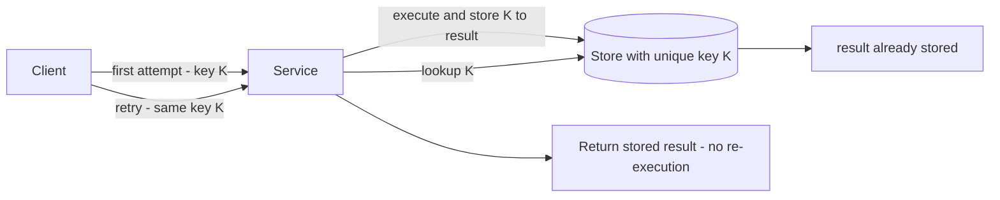

# Idempotent Retry

## 1. One-Line Definition
Idempotent retry is the combination of retrying failed operations with a stable idempotency key and a deduping endpoint/sink, so that rerunning the same request is harmless: the second attempt returns the first attempt's stored result instead of re-executing the work.

## 2. Why Do We Need It?
Retries only work safely if the operation can be repeated without changing the result — and most business operations cannot. Charge a card, deploy a second time, create an order, send an email: each naive retry is a new side effect (double charge, duplicate order, second email). Without idempotent retry you face an impossible choice at every ambiguous timeout: *retry and risk duplication, or don't retry and risk loss*. Idempotency removes that dilemma — you get retry resilience (the point of [[retry-and-timeout|Retry and Timeout]]) without the duplicated side effects, which is precisely what turns at-least-once into "exactly-once effect" for the operation.

## 3. Simple Intuition
Filling a medical prescription over a phone system that occasionally drops the call. If you call back and the pharmacy can't tell the first call already filled it, you get a double dose. The system's fix: ask for your patient ID on every call, store "filled for patient X" before hanging up, and on the callback recognize the ID and reply "already filled for you" — no second prescription. The patient ID is the idempotency key; the "already filled" answer is the stored result.

## 4. What Happens Without It?
Every timeout or crash leaves a coin flip: retry to be safe → double order / double charge / double deploy; don't retry → the operation silently never happened. Both failure modes are invisible at the moment they occur and surface later as angry customers, incorrect balances, duplicated email, or missing orders. Worse, the more retry layers you add (the more you need retries), the more chances each has to multiply a side effect. Retry without idempotency is the most common "reliability feature" that produces production data corruption.

## 5. Core Idea
- **Idempotency key:** a stable client-or-server-generated identifier for the *operation*, derivable from and attached to the request — `(merchant_id, order_id)`, `request_uuid` created once by the client and reused across all retries of that logical operation. The key MUST be constant across attempts; a new key per retry defeats dedup.
- **Server contract:** on first arrival, run the operation, store `key → result`; on any subsequent arrival with the same key, return the stored result without running again. Persistent storage (DB row with a unique constraint on the key) makes this race-safe even when two attempts arrive concurrently.
- **The race:** two retries can arrive in parallel (timeout + hedge + duplicate). A plain check-then-act is lost-the-second-write; the unique constraint is what makes the second writer a no-op: `INSERT ... ON CONFLICT DO NOTHING`, or catch the duplicate-key error.
- **Where it lives:** (a) **in the endpoint/service** — the API stores `key → response` (see [[idempotency|Idempotency]], [[request-deduplication|Request Deduplication]]); (b) **in the consumer** — a [[delivery-and-retry|messaging delivery]] dedup store; (c) **in the sink** — a unique business key in the DB is the final arbiter that even a badly-coded retryer cannot bypass.
- **Pairing with retry policy:** timeout AND budget AND backoff (see [[retry-and-timeout|Retry and Timeout]]) decide *when* you retry; the key decides *that the retry is safe*. Both are one design, not two.
- **Key generation rules:** derive from business data when possible (`order_id`), because it survives restarts and client crashes; fall back to a client-stored UUID that must persist across retries (in the app state, session, or the message itself).

## 6. Important Terminology

| Term | Simple Meaning |
|------|----------------|
| Idempotency key | Stable identifier of the operation, reused by every retry |
| Idempotent operation | Re-executing it yields the same state/result |
| Stored result | What the first attempt recorded; returned on duplicates |
| Dedup store | Persistent `key → result` map |
| Unique constraint | Sink-level guarantee that a duplicate write fails/no-ops |
| Check-then-act | Read-decision-write; racy without a unique key |
| Request uuid | Client key generated once per logical operation |
| Retry budget | Max attempts + total time under which retries run |

## 7. Basic Architecture



## 8. Request or Data Flow
1. Client builds the operation (e.g., `capture payment`) and attaches key K (`(tenant, order)`).
2. First attempt: service tries to insert `K → (executing, start)`, checks result on conflict. It performs the operation and stores the final result under K.
3. Retry after timeout: same key K arrives. The service reads the stored result for K — found, and it is a final result — and returns it verbatim. No charge, no second order.
4. Concurrent duplicate (hedged path): both insert for K; the unique constraint lets exactly one win; the other reads the same stored result.
5. If the first attempt failed *hard* (known failure, not ambiguity), the retry may clear the stored `failed` mark and attempt a fresh run — that decision is part of the retry policy; a transient error is retried in place, a permanent one is surfaced.

## 9. Practical Example
**Checkout payment (assumptions):** 2k tps; card-authorization timeouts happen even in steady state because the provider is occasionally slow.
- Key: `authorize:{tenant}:{order_id}`.
- First attempt: insert a row with that key in `idempotency` table (unique index). Timeout from the provider. The transaction state says "authorize in-flight."
- Retry (backoff 250ms + jitter): same key. The service reads the row, sees the in-flight marker, waits/redo the provider call — but whichever attempt *commits* wrote `key → captured-amount`, and any further retry returns that stored response.
- Result: no double charges, even when 3 attempts land in quick succession; reconciliation zero because the unique index is the arbiter.

## 10. Scaling
- **Dedup store scaling:** the `key → result` table grows with operation volume; partition it by key hash and age entries past the retry horizon (TTL/cleanup jobs). Sharded just like any other table (see [[sharding|Sharding]]).
- **Hot keys:** one merchant/order retrying a lot concentrates lookups on that key's shard; bound retry concurrency per key (per-key lock or the unique index's serialization) instead of bulkhead-ing the whole service.
- **Cache + TTL is not enough for the long tail:** an in-memory/Redis dedup with a short TTL covers immediate retries but not a retry arriving an hour later; a durable store (or a sink unique constraint) covers the full horizon — choose by retry window.
- **As the fleet grows:** the server-side contract (`key → result`) must be shared across every replica — either a central store or a sink unique key, or retries routed to the same replica (which the unique constraint anyway bypasses).

## 11. Reliability and Failure Scenarios

| Failure | What Happens | Detection | Recovery | Trade-off |
|---------|--------------|-----------|----------|-----------|
| Timeout after success | Retry arrives with same key | No "duplicate" errors | Stored result returned | extra lookup |
| Crash mid-operation | In-flight marker left | Row exists without final result | Retry re-completes it | recovery complexity |
| Concurrent duplicates | Both attempt insert | Unique-conflict error | Winner executes, loser reads | lost-write avoidance |
| Dedup store down | Cannot check cache | Store health | Fail-open to sink constraint, or halt retries | availability vs safety |
| Key collision | Wrong result returned | Reconciliation | Derive keys from unique business data | key hygiene |

## 12. Consistency and Correctness
- **Correctness invariant:** "first attempt to *commit* defines the result; every other attempt must return it." The unique constraint makes this true even with concurrent retries in flight.
- The **in-flight marker** closes the double-window: insert `key → executing` *before* running, so a retry during a long operation sees the marker and waits rather than starting a second run.
- **Atomicity:** key storage and result storage must be one transaction, or a crash between "stored result" and "stored key" recreates the loss/double dilemma (the discipline of [[idempotent-consumer|Idempotent Consumer]] for messages applies to requests).
- Permanent failures want a stored `failed` verdict so correct retry policies don't loop: define three states (executing / succeeded / failed) and which one allows a genuine re-run.

## 13. Performance
- Cost per attempt: one index lookup/insert on the dedup key; microseconds-to-low-ms against the operation's real latency.
- Idempotent retry is *cheap* compared with exactly-once machinery: no distributed transaction, no two-phase commit — a key, a store, a constraint.
- Retry cadence still governs latency: backoff + budget (see [[retry-and-timeout|Retry and Timeout]]) bound how long a retried operation can take; idempotency never justifies unlimited retries.

## 14. Security
- Idempotency keys carry business identity (tenant, order, payment) — treat the store as sensitive (encrypt at rest, no raw keys in logs) and scope keys per tenant so one tenant's retry cannot alias another's result.
- Never let a retry replay authorization: each attempt re-checks authZ; a key does not grant access to anything, it only denotes "same operation."
- An attacker able to guess or reuse another tenant's key could read that stored result — keys must be high-entropy where not business-derived, and read access must be permissioned like the resource itself.

## 15. Trade-Offs

| Choice | Advantages | Disadvantages | When to Use |
|--------|------------|---------------|-------------|
| No retry | No double-apply risk | Operation lost on ambiguity | Loss-tolerable, best-effort |
| Retry + stored key | Safe retries, no loss | Dedup store + table | Default for business ops |
| Retry + sink unique key | Zero extra table, final arbiter | Key must exist in business schema | DB-backed writes |
| Retry + cache TTL | Cheapest | Short window only | Immediate retries only |
| Exactly-once machinery | Strongest claim | Cost, complexity | Narrow critical streams |

## 16. Common Mistakes
- Generating a *new* key on every retry (UUID per attempt) — dedup matches nothing.
- Check-then-act dedup without a unique constraint; concurrent retries both pass the check and both execute.
- Storing only "succeeded" results — a crash mid-operation leaves no marker and the retry cannot distinguish rerun vs fallback-to-succeed.
- Unlimited retry budget "now that it's idempotent" — idempotency kills duplication, not amplification; you still need backoff, jitter, budget, circuit breaking.
- Basing keys on mutable business data (order status, amount) — the key changes between attempts and dedup fails silently.
- Ignoring TTL — short-TTL dedup silently expires before a slow retry arrives.

## 17. HLD vs LLD Boundary
HLD: which operations get idempotent retry, the key contract (who generates, what data it carries, per-tenant scope), retry policy per operation (budget/backoff/classes), store vs sink-constraint choice, retry-horizon TTL. LLD: the key extraction/hashing, dedup-upsert with unique constraints, in-flight marker states, error-class mapping, cache wiring.

## 18. Interview Questions

### Beginner
- What does "idempotent retry" mean in one sentence?
- Why can't you just retry a card charge a second time?

### Intermediate
- Two retries of the same order arrive concurrently. Walk exactly why check-then-act is unsafe and what the unique constraint changes.
- Your dedup store has a 5-minute TTL and a retry arrives after 2 hours. What breaks and how do you fix it?

### Advanced
- Design idempotent retry for a contains-touching-2-databases operation across a microservice boundary, where both writes must not double for a *per-call* key you cannot persist longer than the retry window.
- A card processor's timeouts produce an average of 2000 ambiguous results/day. Show the end-to-end design that makes the answer deterministic.

## 19. Interview Memory Summary

> [!abstract]- Interview Memory Summary

### Remember

- Key is constant across all retries of one logical operation.
- First attempt to commit defines the result; every other attempt returns it.
- Stored result + unique constraint make concurrent retries safe.
- In-flight marker avoids two simultaneous executions of one key.
- Dedup store and the effect's transaction must be atomic.
- Idempotency kills duplication, not amplification — keep budgets, jitter, circuit.
- Key from mutable data = silent dedup failure.
- TTL must exceed the whole retry horizon, or expire the guarantee.

### 30-Second Explanation

Attach a stable key to every business operation, store the result of the first attempt (with an in-flight marker), and let the unique constraint arbitrate concurrent retries: any later attempt just returns the stored result, so you get the resilience of retrying without any duplicated side effect.

### Interview Traps

- New UUID per attempt — the key must be constant.
- Check-then-act with no constraint — concurrency breaks the check.
- No in-flight marker — long operations double-execute.
- "Idempotent so retry unlimited" — amplification still needs budgets and a circuit breaker.
- Short TTL on the dedup store versus long retry horizon.

### Key Trade-Off

Idempotent retry buys "retry without consequence" (no loss, no duplication) for the price of a keyed store, a unique constraint, and atomic key+result writes; that is almost always cheaper than exactly-once machinery and almost always necessary for business writes.

## 20. Related Concepts

### Prerequisites

- [[idempotency|Idempotency]] — the property this pattern applies to retry paths.
- [[retry-and-timeout|Retry and Timeout]] — the policy (budget, backoff, jitter) that governs the retries.

### Commonly Used Together

- [[retry-and-timeout|Retry and Timeout]] — decide when to retry; idempotency makes it safe to.
- [[request-deduplication|Request Deduplication]] — the API-side dedup twin.
- [[circuit-breaker|Circuit Breaker]] — stop retrying (however safe) when the dependency is down.
- [[delivery-semantics|Delivery Semantics]] and [[idempotent-consumer|Idempotent Consumer]] — the messaging-side parallel.
- [[hedged-requests|Hedged Requests]] — concurrent duplicates; safe only with the same key discipline.

### Alternatives

- Transactional exactly-once ([[kafka-delivery-guarantees|Kafka Delivery Guarantees]]) — stronger, costlier; idempotent retry usually suffices.

### Advanced Concepts

- [[exactly-once-effect|Exactly-Once Effect]] — the end-state idempotent retry achieves operationally.

Related planned topics (not authored yet): grace-degradation, overload-protection.

## 21. References
Stripe idempotency-requests docs; AWS "Making retries safe with idempotency" patterns; Google SRE Workbook (retries, idempotency); Kleppmann, "Designing Data-Intensive Applications" ch. 12. Verify current docs on per-vendor timeouts and idempotency-key support.

## 22. Active Recall

Test yourself before revealing each answer.

> [!question]- What is the invariant of idempotent retry?
> The first attempt to commit defines the result; every later attempt with the same key must return that stored result without a new side effect. The unique constraint on the key makes the invariant hold even when attempts are concurrent.

> [!question]- Why is check-then-act unsafe under concurrency?
> Two retries both read "key absent," both decide to run, and both execute — the check passes twice before either write. A unique constraint turns the second writer into a no-op (duplicate-key), so exactly one attempt wins the insert and every other waits/reads its stored result. The constraint, not the check, is the guarantee.

> [!question]- What is the in-flight marker for, and what are its states?
> Insert `key → executing` before starting a long operation so a concurrent retry sees the marker and waits rather than launching a second run. States: executing / succeeded / failed — "failed" lets the retry policy decide whether a re-run is legitimate without guessing, which closes the ambiguity window.

> [!question]- Where is idempotent retry implemented: client, endpoint, or sink?
> All three cooperate: the client creates and reuses the key; the endpoint stores key→result and returns it on duplicates; the sink's unique constraint enforces it physically if the endpoint logic is buggy. The sink constraint is the final arbiter (see [[idempotency|Idempotency]]).

> [!question]- Interview scenario: 2000 ambiguous card-authorization results/day; each retry must be deterministic. Design it.
> For every `${tenant}:${order}` the card service upserts `key → status` into a dedup table with a unique index (+ in-flight marker) in the same transaction as the authorization outcome. A timeout leaves the marker; the retry (backoff+jitter under budget) reads the marker and re-completes; the committing attempt writes the final status; all later attempts return the stored result. The provider is called with the same idempotency key where it supports it. Outcome: deterministic "exactly-once effect" per order regardless of 1, 3, or dozens of attempts.

> [!question]- Why does making it idempotent not justify unlimited retries?
> Idempotency removes duplicated *side effects*, not amplified *load*: every extra attempt still consumes CPU, network, provider quota, and queue. The retry budget, backoff, jitter, and circuit breaker (see [[retry-and-timeout|Retry and Timeout]]) must keep amplification bounded even though each attempt is harmless to business state.

> [!question]- Your dedup store's TTL is 5 minutes and a retry arrives 2 hours later. What happened and how do you fix it?
> The stored key expired, so the late retry sees "key absent" and re-executes — the duplicate effect returns. Fix: size the TTL to the *entire* retry horizon (arbitrary long), or better, prefer a durable store / sink unique constraint that does not expire, and keep reconciliation as a backstop covering the window where a pure TTL store is chosen for speed.

## 23. When Should I Use This?

### Use it when

- The operation is a business write (charge, order, deploy, email, inventory) with real side effects.
- Its result is ambiguous under timeout — retry-or-not is a coin flip.
- You can define a stable key from business data (or persist a generated one).
- The operation is being retried (any 99.9% availability ambition implies this).

### Avoid it when

- The operation is naturally idempotent from reading (a GET needs no key).
- Loss is tolerable and simplicity matters more than survival (best-effort telemetry).
- You cannot define or persist a key across the retry window — dedup becomes guesswork.
- A sink unique key is impossible and you can't build a store — the guarantee would be a facade.

### What problem does it solve?

Every retryable business operation faces the same coin flip: retry and risk duplication or skip and risk loss. Idempotent retry removes the flip — the key, the stored result, and the unique constraint make repeated attempts observably equivalent to one, so you get retry resilience with exactly-once *effect*.

### What problem does it NOT solve?

It does not bound retry amplification (budget/backoff/circuit do), does not fix a timezone-invalid key scheme (the key definition is on you), does not make the dedup store durable for free (TTL choices can silently expire the guarantee), and does not give exactly-once *delivery* decisions — it makes the outcome deterministic, not the transport.

## 24. Decision Connections

Decisions that go together with idempotent retry:

- [[retry-and-timeout|Retry and Timeout]] — the policy that decides when to attempt again.
- [[idempotency|Idempotency]] — the API property being enforced at the endpoint.
- [[request-deduplication|Request Deduplication]] — the same stored-result idea for duplicate requests.
- [[circuit-breaker|Circuit Breaker]] — stop retrying when the dependency is down, even safely.
- [[delivery-semantics|Delivery Semantics]] and [[idempotent-consumer|Idempotent Consumer]] — for messaging-side retries, the same key+store discipline.
- [[hedged-requests|Hedged Requests]] — concurrent duplicates: same key rule applies.
- [[exactly-once-effect|Exactly-Once Effect]] — the operational goal this composition achieves.

Decision tree:

```
A retryable business operation times out
    |
    +-- Is the side effect naturally idempotent?  → retry freely
    |
    +-- Is the operation a read / no side effect? → no key; just retry within budget
    |
    +-- Side effect exists (charge, order, deploy)?
    |      → [[idempotency|Idempotency]] key, constant across attempts
    |         |
    |         +-- Key derivable from business data?
    |         |      → yes: use e.g. tenant + order id
    |         |      +-- no: persist a request uuid with the operation
    |         |
    |         +-- Store result + unique constraint?      → concurrent retries safe
    |         +-- In-flight marker?                      → no double execution
    |         +-- Retry window > store TTL?              → extend or make durable
    |         |
    |         +-- Budget, backoff, jitter?               → [[retry-and-timeout|Retry and Timeout]]
    |         +-- Dependency down?                       → [[circuit-breaker|Circuit Breaker]] not a retry
    |
    +-- Still unsafe? →
           transactional exactly-once ([[kafka-delivery-guarantees|Kafka Delivery Guarantees]]) for that stream
```