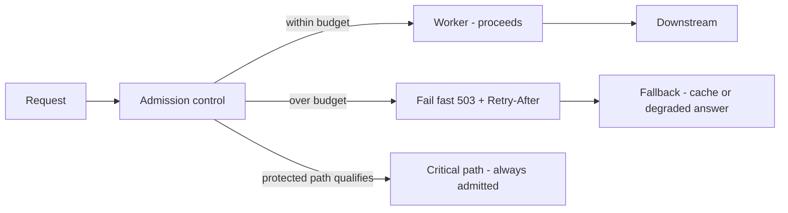

# Load Shedding, Fail-Fast, and Fallback

## 1. One-Line Definition
Load shedding is the deliberate rejection of work at the edge when the system is saturated — protecting the capacity that remains so the traffic you do accept stays fast and healthy; fail-fast is the immediate rejection mechanism, and fallback is what you serve instead of dropping the user.

## 2. Why Do We Need It?
At high load a service degrades super-linearly: once queues fill, latency rockets not linearly but along the queueing curve, error rates climb, and threads saturate. The instinct to "accept everything and try hard" makes it worse — every accepted request that exceeds capacity steals resources from the ones that could have succeeded. The only way to keep the requests you *do* take within your latency SLO is to stop taking more than the system can serve, deciding *at admission* which requests get budget and which fail fast (or fall back). Shedding converts an anonymous overload collapse into a deliberate, bounded degradation with a known trade-off (availability sacrificed to protect latency/errors for the served majority).

## 3. Simple Intuition
A packed restaurant on a rainy night with a dangerous kitchen. The good host does not seat every waiting party — that would back the kitchen up into a disaster. The host decides a safe capacity, takes a short waitlist (the queue), and *turns away* larger parties with a polite "come back in an hour" (fail-fast with a hint). The people seated are served promptly and well because the kitchen is never overbooked. The rejected parties got a clear answer instead of a 4-hour wait and no food — a fallback ("the bar next door has a shorter line") softens the rejection.

## 4. What Happens Without It?
No shedding: traffic exceeds capacity → every request tail-backs → queueing time dominates → p99 climbs past the SLO → requests that arrive now wait so long they time out *and retry*, which generates more load → cascading failure. The classic self-inflicted outage: the system needs to handle 10k QPS, someone directs 15k at it, and it fails 15k instead of successfully serving 10k. Shedding is the admission rule that chooses to fail 5k predictably while serving 10k well.

## 5. Core Idea
- **Where to shed:** at the entry points — API gateway, load balancer, and each service's admission control. The decision must happen *before* work is scheduled; once a request occupies a worker thread it has already cost you.
- **What signal drives it:** queue depth, current concurrency vs capacity, CPU/latency of the recent window, token-bucket admission. The best signal is *work in flight vs measured capacity* (Little's-law style), not raw QPS.
- **Fail-fast:** reject with a clear code (503) quickly — a rejected request returns in ~1ms; an over-queued one times out in 10s. Rejection must be cheap and must include a hint (Retry-After) so honest clients back off.
- **Fallback (graceful degradation):** serve *something* instead of an error when possible — a cached or stale version (see [[caching|Caching]]), a degraded result (cheaper query path), a "try later" placeholder for writes. Product decides which values are load-sheddable beforehand, not in the firefight.
- **Fairness and prioritization:** shed the least valuable traffic first — low-priority/background jobs, anonymous read paths, non-critical features — while critical paths (auth, checkout) keep their slice. Protect the *important* by defaulting the *unimportant* to shed.
- **Distinguish shed from overload-protection levels:** load shedding (reject at capacity) ⊂ admission control along with [[rate-limiter|Rate Limiter]] (per-caller caps) and backpressure (downstream signalling, e.g., consumer lag).
- **Distributed shed:** shedding decisions should be global-ish, not per-host-wild-guesses: use a shared saturation signal (limiter with adaptive feedback such as concurrency-limits) so N replicas shed together instead of one bottleneck replica eating everything.

## 6. Important Terminology

| Term | Simple Meaning |
|------|----------------|
| Saturation | Utilization past the point where latency explodes |
| Admission control | Deciding, at the door, whether work is accepted |
| Fail fast | Reject quickly with a clear signal |
| Fallback | Serve a degraded answer instead of an error |
| Retry-After | Header telling the client when to come back |
| Queue depth | Work waiting to be processed |
| Little's law | concurrency = rate × latency; the sizing identity |
| Graceful degradation | Reduced but coherent service under pressure |
| Overload protection | The family: shedding + rate limiting + backpressure |

## 7. Basic Architecture



## 8. Request or Data Flow
1. Request arrives at the edge with a classification (critical? background? tenant?).
2. Admission control checks the saturation signal (concurrency vs capacity, queue depth).
3a. Under budget: admit, process, return. 
3b. Over budget and non-critical: fail fast with 503 + Retry-After; the client backs off.
3c. Critical path: always admitted within its reserved slice (a bulkhead-style protected share).
4. Where a fallback exists (read of a cacheable value): serve the stale/cached value instead of dropping the user.

## 9. Practical Example
**Video streaming homepage (assumptions):** 200k rps to the edge, capacity comfortably 300k rps, trending recommendations require a 40ms upstream; SLO is p99 < 100ms.
- Admission drops traffic above ~300k instantly (503 + Retry-After); queue depth above 5 moves to shedding.
- Recommendations are marked "degradable": on saturation their calls are shed (the page serves the cached spotlight row instead), and those resources are reallocated to playback init, which is critical and reserved.
- A spike of 600k rps: ~300k fail fast (1ms) or take the cached fallback, ~300k are served within SLO. p99 stays approved while the naive all-queues-everything system would blow p99 to 10s and fail everything.

## 10. Scaling
- **Shedding scales with replicas only if the signal is shared:** per-host decisions on relative load are noisy; use fleet-level or cross-node sizing (limiters with adaptive concurrency estimates) so replicas shed in step.
- **Autoscaling is slow, shedding is instant:** [[autoscaling|Autoscaling]] scales capacity over minutes; shedding protects the seconds between the spike and the scale-up. Run both.
- **Priority scaling:** as you scale, keep the reserved slices proportional (critical path always gets its share even as background traffic grows).
- **Don't shed your own retries:** retried shed traffic is new load — bound retries and honor Retry-After, or shedding becomes a self-DDoS loop (see [[retry-and-timeout|Retry and Timeout]]).

## 11. Reliability and Failure Scenarios

| Failure | What Happens | Detection | Recovery | Trade-off |
|---------|--------------|-----------|----------|-----------|
| True overload spike | Some traffic shed to protect the rest | Shed-rate metric | Scale out; spike passes | availability for latency |
| Admission signal wrong | Shed too early or too late | Utilization vs shed-rate | Tune concurrency estimate | risk tuning |
| Downstream degenerate but host healthy | Host keeps admitting into dead downs stream | Per-dep latency | Depends on circuit breaker + shed degraded calls | latency per path |
| Fallback itself overloaded | Secondary failure | Fallback latency | Cache-cooling, cap fallback | complexity |
| Retry-after ignored | Shed traffic returns instantly | Reject + retry storm | Client honoring, server caps | coordination |

## 12. Consistency and Correctness
- Shedding affects **availability**, not data integrity: the writes you shed are simply not done now (at-least-once retry later), which is fine for idempotent consumers; the truth of the data that *is* processed is unchanged. Never shed in a way that produces partial writes pretending to be whole (a failed checkout that reports success).
- Fallbacks return *bounded staleness by design*: a cached value is correct as of its TTL, and the system must say so ("page reflects data up to 2 minutes old"). Document staleness so downstream cannot mistake a degraded answer for a fresh one.
- Prioritization must be deterministic and honest: a "critical" always-admitted path that is actually shed the same as background is a lie that destroys trust — make the classification explicit and measurable.

## 13. Performance
- Fail-fast rejection should be microseconds to low milliseconds — orders of magnitude cheaper than a 10s timeout.
- The real performance win is *protecting headroom*: keeping concurrency under the knee of the latency curve holds p99 flat even at admission limits, which is how a shedded system outperforms an over-queued one at the same load.
- Fallbacks cost little if they are cached reads; they cost a lot if the "fallback" path requires more compute than the primary (a bad sign).

## 14. Security
- Shedding is a DDoS-mitigation primitive: admission control rejects floods before they consume compute. But make rejecting cheap — the reject path itself must be attack-resistant (don't allocate/log heavily per rejection).
- Fair shedding per tenant prevents a malicious tenant from starving honest ones (pair with [[rate-limiter|Rate Limiter]]).
- Failed requests and fallback answers can leak less data or serve cross-tenant data if fallback caches are not scoped — scope stale answers per tenant exactly like live ones.
- Do not leak scheduler state: 503s are noise; detailed rejection reasons to unauthenticated callers are information disclosure.

## 15. Trade-Offs

| Choice | Advantages | Disadvantages | When to Use |
|--------|------------|---------------|-------------|
| No shedding | Simple, max throughput intents | Collapse under overload | Tiny systems, no SLO |
| Fail fast only | Bounded, simple, fast | Lost sessions | Overload spikes |
| Fail fast + fallback | Users keep a degraded experience | Staleness, complexity | Reads and cacheable writes |
| Priority shedding | Critical path protected | Classification burden | Where edges/criticality differ |
| Adaptive (concurrency-based) | Tracks real capacity | Smarter knob to tune | SLO-bound systems |

## 16. Common Mistakes
- Shedding without Retry-After or client cooperation — the shed traffic returns and the rejection feedback-loop fails to converge.
- Shedding late (after queueing started) — requests already in the queue still time out and retry; the shed only saves the *next* wave.
- Shedding based on QPS instead of work-in-flight — proxy signals drift from the real cause (latency blowing up while "QPS looks fine").
- No prioritized classification, so critical and background traffic shed identically.
- Failing fast with no fallback on read paths where a cached answer would have satisfied the user.
- Confusing shedding with elasticity: still autoscale, but shed during the minutes autoscaling cannot save.

## 17. HLD vs LLD Boundary
HLD: which traffic is shed (priority classification), the admission signal and its target (concurrency budget), fail-fast codes and Retry-After policy, which paths get fallbacks and their staleness budget, coordination across replicas. LLD: the limiter library configuration, rejection handler, per-path fallback code, cache wiring, metrics.

## 18. Interview Questions

### Beginner
- What is the difference between load shedding and rate limiting?
- Why does accepting every request make overload *worse*?

### Intermediate
- A service at 10k QPS capacity suddenly receives 30k. Design the admission rule that keeps p99 under 100ms.
- When should a request be failed fast instead of queued, and what should the client receive?

### Advanced
- Design load shedding across 50 replicas that shed in coordination, not per-host chaos, with autoscaling running underneath.
- A flash-sale surface must stay within its SLO while analytics traffic floods. Show the priority/shedding/fail-fast/fallback design, including what happens to the shed requests.

## 19. Interview Memory Summary

> [!abstract]- Interview Memory Summary

### Remember

- Overload failure is super-linear: queues fill → latency explodes.
- Shed at admission, before work is scheduled.
- Fail fast = 1ms rejection vs 10s timeout; include Retry-After.
- Fallback = serve stale/degraded instead of dropping (name the staleness).
- Protect critical paths; shed background and anonymous first.
- Signal = work in flight / concurrency, not raw QPS.
- Shed + rate limit + backpressure = overload protection family.
- Autoscale is minutes; shedding is milliseconds — run both.

### 30-Second Explanation

At the edge, decide per request whether budget remains: admit within capacity and serve fast, fail fast with Retry-After when over, and route degradable paths to fallbacks — always protecting critical traffic's reserved slice. Autoscaling fixes capacity over minutes; shedding keeps the present wave within the SLO by choosing which requests not to serve.

### Interview Traps

- Answering "how do you handle spikes" with "autoscaling" only — you need admission control for the minutes autoscaling needs.
- Shedding by QPS thresholds that miss the latency blow-up (use concurrency/Little's law).
- Queuing everything and calling it "handling load" — you built the tail problem.
- Shedding retried traffic equally — retries are new load, bound them or shed loops.
- A "critical" path that is actually shed as hard as background.

### Key Trade-Off

Shedding protects latency and correctness for the accepted majority by explicitly sacrificing availability for some requests (fail fast/fallback), and that sacrifice is only a win if it is prioritized, coordinated, and signaled with Retry-After instead of being a silent drop.

## 20. Related Concepts

### Prerequisites

- [[retry-and-timeout|Retry and Timeout]]
- [[latency-vs-throughput|Latency and Throughput]] — knowing the queueing curve.

### Commonly Used Together

- [[rate-limiter|Rate Limiter]] — caps are the per-caller (admission) twin of shedding.
- [[circuit-breaker|Circuit Breaker]] — trips on dead dependencies; shedding rejects live overload.
- [[bulkhead|Bulkhead]] — sheds reject at the pool; bulkheads isolate by compartment.
- [[retry-and-timeout|Retry and Timeout]] — Retry-After and jitter keep shed traffic from re-arriving instantly.
- [[caching|Caching]] — the primary source of fallback answers.
- [[autoscaling|Autoscaling]] — the slow fix shedding bridges.

### Alternatives

- [[rate-limiter|Rate Limiter]] — per-caller caps, not global saturation; use both.
- Backpressure (planned) — the downstream-signalling strand of the same family.

### Advanced Concepts

- [[tail-latency|Predictable Tail Latency]] — shedding above the knee is how you keep the tail flat.
- [[adversarial-reliability|Adversarial Reliability]] — chaos-injected floods prove the shed design.

Related planned topics (not authored yet): backpressure, graceful-degradation, overload-protection, health-checks.

## 21. References
Google SRE Workbook (load shedding, overload, admission control); AWS Builders' Library "Using load shedding to avoid overload"; Netflix concurrency-limits (adaptive admission); Kleppmann ch. 11-12 (queueing). Verify vendor documents (Envoy, Kafka) for current admission-control features.

## 22. Active Recall

Test yourself before revealing each answer.

> [!question]- Why is overload failure super-linear?
> Accepting beyond capacity fills server queues; each request's total latency becomes process + queueing, and queueing grows with backlog — latency, threads, memory, and retries feed each other, so response times and error rates explode rather than degrade gracefully. Past the "knee," an overloaded system fails requests it could otherwise have served.

> [!question]- What distinguishes load shedding from rate limiting?
> Rate limiting caps *who/how much* each caller contributes (per-caller fairness); load shedding gates *global saturation* (how much total work the system accepts given current capacity). Also: the caller-indiscriminate reject happens only once over capacity; a limiter rejects early for fairness. Real systems use both.

> [!question]- What signal should drive shedding?
> Work in flight vs measured capacity — Little's law: concurrency = arrival rate × latency. QPS alone is a proxy that drifts when latency inflates. Use queued depth + active concurrency (an estimated limiter) so the admission rule reflects actual saturation, not just arrival volume.

> [!question]- What should a shed request receive, and why?
> A quick 503 with Retry-After, so the client knows why and when to retry. Fail-fast is a ~1ms rejection instead of a 10s timeout, and Retry-After keeps honest clients from forming an immediate retry wave that defeats the shed.

> [!question]- Where should the shed decision live in the architecture?
> As far from the work as possible: at the API gateway/load balancer for cross-service shedding, and at each service's admission control before worker-thread allocation. A request accepted that far has not yet consumed the scarce resource it would starve others of.

> [!question]- A flash sale floods the system at 5x steady state, and analytics traffic keeps arriving. How do you protect lines, and how does the flush stay within SLO?
> Classify: analytics/background are shed first; reads of cacheable data serve stale fallback; checkout/auth hold a reserved always-admitted slice. Set the admission cap at the measured capacity knee, fail fast with Retry-After, and let the fallbacks absorb degradeble traffic. Within an SLO of p99 < 100ms, the served requests stay under budget because the system is never admitted past its knee; over-capacity arrivals are rejected in ~1ms.

> [!question]- A fallback returns cached data during shedding. What must be true of it?
> It must be per-tenant scoped exactly like live data, sized and caches-cooled so it cannot become a secondary overload, and its staleness must be explicit ("page as of 2 minutes ago") so consumers and downstreams never mistake a degraded answer for a fresh one.

## 23. When Should I Use This?

### Use it when

- There is an SLO on latency and a known capacity ceiling (any non-trivial service).
- Workloads are bursty or can spike beyond capacity on demand (flash sales, viral posts, bot floods).
- There are degradable paths (reads of cacheable values, background jobs, analytics).
- You want overload behavior that is deliberate (choose what fails) instead of accidental.

### Avoid it when

- Rejection is never acceptable and capacity is always oversized — then solve capacity, not shedding (rare, and expensive).
- You cannot instrument the admission signal — an untuned shedder sheds wrongly.
- Retries are uncontrolled — shedding without Retry-After turns the shed into a retry storm.

### What problem does it solve?

Deterministic control of the overload regime: instead of letting a 2x spike turn into a 2x failure of everything, the system fails fast the overflow and keeps the accepted majority within SLO. It converts an uncoordinated, unbounded degradation into a bounded, prioritized, signaled one.

### What problem does it NOT solve?

Shedding does not create capacity (autoscaling does), does not isolate who caused the overload (rate limiting/bulkheads do), does not fix a dependency that collapses under load (circuit breaker + capacity do), and does not make rejected work happen later — it accepts that some work is not done now.

## 24. Decision Connections

Decisions that go together with load shedding:

- [[rate-limiter|Rate Limiter]] — per-caller fairness at admission, in front of the shed gate.
- [[circuit-breaker|Circuit Breaker]] — trip dead dependencies rather than shedding every call to them.
- [[bulkhead|Bulkhead]] — isolate pools; a shed decision is a fail-fast at the pool boundary.
- [[retry-and-timeout|Retry and Timeout]] — Retry-After, jitter, budgets so shed traffic doesn't return as a storm.
- [[caching|Caching]] — the fallback store that turns rejections into degraded answers.
- [[autoscaling|Autoscaling]] — the slow lever; shedding bridges the minutes before scale-out.
- [[tail-latency|Predictable Tail Latency]] — why keeping the queue below the knee is non-negotiable.
- [[adversarial-reliability|Adversarial Reliability]] — chaos floods validate the shed behavior under real spikes.

Decision tree:

```
Traffic approaches or exceeds capacity
    |
    +-- Autoscaling can absorb within minutes?
    |      → scale out AND shed during the gap
    |
    +-- Per-caller overuse, not global overload?
    |      → [[rate-limiter|Rate Limiter]] (cap per caller)
    |
    +-- Global saturation?
    |      → load shedding at admission
    |         |
    |         +-- Signal: concurrency / work-in-flight vs capacity
    |         +-- Critical path?       → always-admitted reserved slice
    |         +-- Degradable path?     → fallback (cached/stale) instead of error
    |         +-- Everything else?     → 503 + Retry-After, fail fast
    |         +-- Retry behavior?      → bound + jitter ([[retry-and-timeout|Retry and Timeout]])
    |
    +-- Dependency (not the host) is unhealthy?
           → [[circuit-breaker|Circuit Breaker]] + capacity, not shedding
```