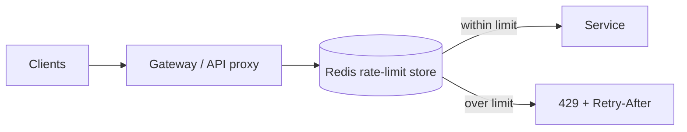

# Rate Limiter

## 1. One-Line Definition
A rate limiter constrains how many requests a client, user, or IP may send to a service within a window — protecting the system from overload and misuse while giving each tenant a fair, predictable share.

## 2. Why Do We Need It?
An API that accepts unlimited traffic is a victim: one buggy client can burn a month of capacity in minutes, a scraper can bankrupt costs, and a flash crowd can take down the service for everyone. Systems need *admission control* — declare "this caller may use this much" — so capacity is rationed by policy instead of depleted by whoever arrives first. Rate limiting is also a safety valve under autoscaling lag (limiters react instantly; autoscalers take minutes).

## 3. Simple Intuition
A water cooler with a per-employee rotation: "you may take one cup every 5 minutes." Not a technician deciding per sip — a fixed, cheap rule — fair, predictable, and protects the cooler (the system) from being drained by anyone. If you let everyone drink on demand, morning rush kills it for all. The token bucket is exactly that cooler: tokens fill at a rate, each request takes a token, empty bucket → wait or fail.

## 4. What Happens Without It?
One consumer at 100× its allocation: CPU/memory/DB saturation → latency spikes for *all* tenants, outage, and a debugging session before someone finds the runaway. Burst storms (Super Bowl launch, bot attack) exhaust capacity faster than autoscaling; shell charges pour in. Meanwhile, the honest 99% of users suffer for one caller's excess. Rate limiting converts "whoever arrives wins" into "within policy, everyone wins."

## 5. Core Idea
- **Algorithms:**
  - *Fixed window:* bucket per window (e.g., 100 req/min). Simple; boundary burst (99 at 11:59:59 + 99 at 12:00:00).
  - *Sliding window (log/counter):* avoids the double-burst with a counter-of-counters approximation.
  - *Token bucket:* tokens refill at `rate/s`, burst = bucket depth; the standard — smooths while allowing bursts.
  - *Leaky bucket:* fixed egress rate; good for shaping (rate, not burst).
- **Decision point:** gate in middleware/gateway/API proxy — before the work is scheduled; apply per `(client_id|user_id|IP|api_key/plan) + action` key.
- **Responses:** 429 + `Retry-After` header; client should honor it (server should tell expected recovery).
- **Two classic configs:** `limit` (max in window) and `burst` (temporary headroom, token-bucket depth). Tiered by plan for SaaS.
- **Local vs distributed:**
  - *Local (per-instance):* cheap, but drift — N instances × limit = N× allowance.
  - *Distributed (shared store, e.g., Redis):* exact, but adds latency + coordination (the limiter store itself must be HA).
  - Practical compromise: local buckets sized limit/N with Redis counter for important knobs, or a gateway with centralized counters.

## 6. Important Terminology

| Term | Simple Meaning |
|------|----------------|
| Limit | Max requests in a window (per key) |
| Burst | Temporary allowance above the rate |
| Fixed window | Reset counter every window |
| Sliding window | Counter over a rolling window |
| Token bucket | Tokens refilled; request spends a token |
| Leaky bucket | Shaped constant egress |
| Key | What you rate-limit by (user/IP/plan) |
| 429 | Too Many Requests (HTTP status) |
| Retry-After | Header saying when to try again |

## 7. Basic Architecture



## 8. Request or Data Flow
1. Request arrives → gateway extracts key (`api_key=acme_demo`).
2. Limiter checks counter: available? (token bucket `tokens>0`).
3. If yes → decrement, forward to service; record result.
4. If no → respond 429 with `Retry-After`, count as rejected (observable event), don't queue work.
5. Logs/metrics per key allow alerting on abusive keys.

## 9. Practical Example
**SaaS API (assumptions):** 3 tiers, 20k QPS aggregate.
- Free: 10 req/min, burst 5. Pro: 1000 req/min, burst 500. Keys via API key.
- Free tier hit by a scraper: limited to 10/min; no effect on Pro; scraper sees 429s, blocks later.
- The Redis rate-limiter store is HA (replicas); on its failure, degrade to per-instance local limiting so we over-allow briefly, not under-avail (fail-open choice).

## 10. Scaling
- **Limiter store:** Redis must scale with QPS — use local caches + periodic sync, or shard by key; the limiter is high-frequency (one read/write per request).
- **Sharding:** rate keys at LB level; use consistent hashing across limiter partitions.
- **Compute:** cheap check vs the cost of the actual request — order the limiter *first*; that's why it lives at the gateway, not in the service.
- **Fail-open vs fail-closed:** when the limiter itself is down — fail-open (allow) keeps availability but risks abuse; fail-closed (reject) protects the service but can be an outage vector (e.g., DDoS hiding the limiter). Choose by blast radius.

## 11. Reliability and Failure Scenarios

| Failure | Happens | Detection | Recovery | Trade-off |
|---------|---------|-----------|----------|-----------|
| Limiter store down | No counters | Health | Fail-open local buckets | abuse window |
| Key spoofing | Rate-limit evasion | Per-key anomaly | Signed API keys | auth cost |
| Clock skew (windows) | Wrong resets | Metric drift | Centralized clock | NTP |
| Burst abuse at boundary | Double-window burst | Fixed-window metric | Sliding window | extra memory |
| Autoscale lag | Surge before scale | Latency spike | Limiter caps anyway | throttling |

## 12. Consistency and Correctness
Limiting is a *policy*, not a correctness mechanism: over-allow briefly (drift) can spike a dependency; under-allow (stale counters) hurts honest users. For money/payments: rate-limit by `user + action + idempotency key` with distributed store; commit counters in the same critical path, and remember 429 ≠ business rejection (clients should retry with backoff per Retry-After, honoring retry-and-timeout).

## 13. Performance
- Fixed window = 1 Redis read + TTL; sliding approx = 2 reads; token bucket = read-modify-write. Gateway-level pre-check mimimizes theater cost on the service path.
- Batching: some gateways batch limiter updates (async) — acceptable since limits are soft.

## 14. Security
- Rate limiting is the first line vs DDoS/scraping/credential-stuffing — but a rigid per-IP limit can be evaded via IP rotation; combine with fingerprinting, per-key(account) limits, and WAF.
- Don't leak account existence via tighter limits vs missing keys. Rate-limiter store data (keys, counters) is sensitive; keep it internal (client servers shouldn't touch it directly).

## 15. Trade-Offs

| Choice | Advantages | Disadvantages | When to Use |
|--------|------------|---------------|-------------|
| Fixed window | Tiny memory, simple | Boundary burst | Cheap defaults |
| Sliding window | No boundary burst | More store, more compute | Fair SaaS limits |
| Token bucket | Smooth + burst | Read-modify-write store | Standard API limits |
| Per-instance local | Zero latency | Drift × instances | Internal tools, queued jobs |
| Distributed limiter | Exact/fair | Redis dependency | Public/multi-tenant API |

## 16. Common Mistakes
- Limiting by IP for multi-user NATs (limits cut off whole orgs) — keyed by user/plan when possible.
- Fixed-window only, no burst modeling (flash sales get 429 swarms — 429s *with* Retry-After plus token-bucket burst planning needed).
- Limiter store as single point of failure, no fail-open path.
- Forgetting 429s in client retry logic (they hammer when they should back off).
- No per-plan tiering → premium users throttle like free users (or free users starve the premium).

## 17. HLD vs LLD Boundary
HLD: algorithm choice (window vs bucket), key scope + tiers, limiter store topology (local vs shared, HA + fail-open), behavior of 429/Retry-After, alert on over-limit. LLD: middleware code, Redis commands, window math, response header wiring, client backoff honoring.

## 18. Interview Questions

### Beginner
- Fixed vs sliding window: what differs, and when does it matter?
- Why does a rate limiter live at the gateway rather than in each service?

### Intermediate
- 3 tiers, 100k QPS, Redis limiter: design the store layout, keying, and failure behavior if Redis is down.
- Design the response behavior (header, retry) so a burst won't self-DDoS your clients' retry loops.

### Advanced
- A flash sale pushes 10× traffic in 30s across 200 instances with an autoscaler that lags 5 minutes. Design admission control that protects the DB (hard limit) while letting the hot users through (per-key fairness), plus monitoring.

## 19. Interview Memory Summary

> [!abstract]- Interview Memory Summary

### Remember

- Rate limiting is admission control: it rations capacity by policy instead of whoever-arrives-first.
- Algorithms: fixed window (cheap, boundary burst) → sliding window (no double-burst) → token bucket (smooth + burst, the standard) → leaky bucket (shaped egress).
- Key scope beats math: who you limit by (user/plan/IP/API key) and per-plan tiers matter more than the window algorithm.
- The decision point is the gateway/edge, before work is scheduled — a cheap check first.
- Distributed limiter (Redis) is exact but HA-dependent; fail-open to local per-instance buckets so a limiter outage doesn't become a service outage.
- 429 + Retry-After must reach clients so their retry loops back off — else the limiter self-DDoSes its own callers.
- Fail-open vs fail-closed is a blast-radius decision: availability vs abuse window.

### 30-Second Explanation

Pick a window/bucket algorithm, gate at the gateway keyed by tenant/plan, keep counters in Redis with a fail-open local path, and emit 429 with Retry-After so clients back off politely.

### Interview Traps

- Limiting by raw IP for NAT-heavy user bases — cuts off whole organizations.
- "Just cap QPS" without key scope (who), tier (plan), and burst (when).
- Limiter store as a single point of failure with no fail-open path.
- Forgetting 429s in client retry logic — clients hammer when they should back off.
- Fixed-window only with no burst modeling — flash-sale 429 swarms.

### Key Trade-Off

Tight, exact rate limiting costs a shared HA store and per-request coordination; loose local limiting costs fairness — you trade enforcement accuracy against availability, latency, and operational complexity on every request.

## 20. Related Concepts

### Prerequisites

- [[availability|Availability]]
- [[reliability|Reliability]]

### Commonly Used Together

- [[retry-and-timeout|Retry and Timeout]] — 429 + Retry-After pairs with jittered backoff
- [[circuit-breaker|Circuit Breaker]]
- [[reverse-proxy|Reverse Proxy]]
- [[caching|Caching]]
- [[web-vulnerabilities|Web Vulnerabilities]]

### Alternatives

- [[horizontal-vs-vertical-scaling|Horizontal vs Vertical Scaling]] — add capacity instead of rationing it (slow to react under spikes)
- [[message-queue|Message Queue]] — absorb bursts by queuing instead of rejecting

### Advanced Concepts

- [[sli-slo-sla|SLI / SLO / SLA]] — limiting policy is how you protect the user-visible SLO
- [[distributed-tracing|Distributed Tracing]] — observe 429s and rejection rates across the path

Related planned topics (not authored yet): load shedding, API gateway pattern, sliding-window log approximations at scale.

## 21. References
AWS API Gateway throttling docs, Redis rate-limiting patterns, Cloudflare/nginx rate-limit configs. Verify current behavior per provider.

## 22. Active Recall

Test yourself before revealing each answer.

> [!question]- Name the four limiting algorithms and one property each.
> Fixed window: counter per window — cheap, but double-burst at boundaries (99 at 11:59:59 + 99 at 12:00:00). Sliding window: rolling count — no boundary burst, more memory/compute. Token bucket: tokens refill at rate/s, burst = bucket depth — smooths while allowing bursts (the standard). Leaky bucket: fixed egress rate — shapes traffic, no bursting.

> [!question]- Why limit at the gateway rather than inside each service?
> One choke point before work is scheduled: you reject before CPU/DB load exists, keep enforcement consistent across instances, and keep the check cheap and centralized rather than duplicated per service.

> [!question]- Design a Redis-backed limiter for 3 tiers at 100k QPS, including failure behavior.
> Key = (tier, api_key, action); counter per key with TTL; Redis as the shared store. For the store being down: fail-open to local per-instance buckets sized limit/N + periodic sync — over-allow briefly instead of taking the whole service down (choose by blast radius). Shard keys by consistent hashing; keep per-request cost to roughly one read + one write.

> [!question]- When do you choose fail-open vs fail-closed for the limiter's own outage?
> Fail-open (allow past) keeps availability but opens an abuse window; fail-closed (reject all) protects the service but is itself an outage vector and lets a DDoS hide the limiter. Choose by blast radius: multi-tenant public APIs usually fail-open with local fallback; a hard must-protect-database boundary can fail-closed per policy.

> [!question]- What do you give up with a per-instance local limiter vs a distributed one?
> Zero latency and no shared dependency — but N instances × limit = N× allowance (drift), so a client can effectively get the limit per instance and abuse it. Distributed is exact and fair but adds a Redis round trip per request and makes the store a HA requirement. Compromise: local buckets sized limit/N + shared counters for the critical knobs.

> [!question]- What's the risk of fixed-window-only limiting with no burst modeling?
> Boundary double-burst (requests just before and after the reset both count) and flash-crowd 429 swarms. Without token-bucket burst headroom, legitimate spikes get rejected while abuse sneaks through the window edges; 429s must carry Retry-After so clients back off instead of hammering.

> [!question]- A scraper discovers your free tier. What happens and what do you do?
> The limiter caps it at its per-key limit (e.g., 10 req/min) and returns 429 + Retry-After; Pro users are unaffected because limiting is keyed and tiered per plan. Alert on per-key over-limit events to find the abuser; tighten the tier, fingerprint, or block the key as needed.

> [!question]- The limiter store (Redis) goes down mid-incident. What do you see and how do you recover?
> With a fail-open local fallback, services briefly over-allow (an abuse window) but keep serving; a health check reconnects Redis and counters resync. Without a fallback you get either a hard outage (fail-closed) or unguarded traffic — which is why fail-open local buckets are the practical design for public APIs.

> [!question]- Interview scenario: a flash sale pushes 10× traffic across 200 instances with a 5-minute autoscaler lag and a hard DB limit. Design admission control.
> Gateway token buckets per user + action with a hard global cap protecting the DB (shared counter + cross-instance enforcement), burst-sized headroom for the hot users, 429 + Retry-After, and per-key fairness so hot users get through while total stays under the DB limit. Monitor limiter QPS separately, and fail-open locally if the store breaks.

> [!question]- "Just cap QPS at 100k globally." Defend or critique.
> Critique: a single global number without key scope (who), per-plan tiers (fairness), and burst policy (when) throttles honest tenants and lets one abuser consume the whole budget. Rate limiting is admission control with a fairness policy, not one number.

## 23. When Should I Use This?

### Use it when

- Public/multi-tenant APIs where one consumer can starve everyone else.
- Scraper/abuse/flash-crowd risk — bursts can exhaust capacity faster than autoscaling reacts.
- Per-plan or per-tenant fairness guarantees are a product requirement.
- A dependency has a hard limit (database, third-party quota) that must be protected.
- You need a safety valve that reacts instantly (autoscalers take minutes).

### Avoid it when

- Internal trusted systems with no cross-tenant risk — limiting adds overhead without need.
- Exactness matters and no shared store is acceptable — per-instance drift breaks the guarantee.
- Clients won't honor 429/Retry-After — limiting will generate retry storms.
- The limiter store can't be made HA — you've added a single point of failure to the whole service.
- The real need is capacity, not fairness — scale instead of rationing.

### What problem does it solve?

Unlimited traffic means one runaway consumer, scraper, or flash crowd depletes shared capacity and degrades everyone — admission is first-come-first-served and ungoverned. The bottleneck is that anything can reach the expensive work. The limiter is a cheap gateway-level policy check per (key, tier) using a sliding/token-bucket counter: it rations capacity, protects hard-limit dependencies, and returns 429 + Retry-After so clients coordinate recovery.

### What problem does it NOT solve?

Load that's legitimately higher than capacity (add capacity/autoscale) — malicious traffic needs WAF/authentication, not just limits — per-request correctness needs idempotency — a single abusive premium tenant still needs hard caps — and it adds an availability risk if the limiter store itself isn't HA with a fail-open path.

## 24. Decision Connections

Decisions that go together with rate limiting:

- [[retry-and-timeout|Retry and Timeout]] — 429 + Retry-After is the contract clients must honor; limits shape when retries happen.
- [[circuit-breaker|Circuit Breaker]] — the breaker protects a down dependency; the limiter protects a healthy-but-saturated one. Compose, don't conflate.
- [[reverse-proxy|Reverse Proxy]] — the natural host for gateway-level limiting middleware.
- [[caching|Caching]] — absorbs read bursts so the limiter isn't the only guard.
- [[web-vulnerabilities|Web Vulnerabilities]] — limits are the first line against DDoS/scraping/credential stuffing, but per-IP limits alone are evadable.
- [[horizontal-vs-vertical-scaling|Horizontal vs Vertical Scaling]] — scaling capacity vs rationing it: limits react instantly, autoscaling needs minutes.
- [[sli-slo-sla|SLI / SLO / SLA]] — the limiting policy is how you protect the user-facing SLO under over-demand.

Decision tree:

```
Clients overwhelm the service / fair share is needed
    |
    +-- Autoscaler is minutes too slow under surges?
    |      → [[rate-limiter|Rate Limiter]] at the gateway as the instant safety valve
    |
    +-- One consumer is abusing / a scraper?
    |      → key-scoped limits (user/plan/IP) + per-tier caps + WAF fingerprinting
    |
    +-- A single dependency saturates while others idle?
    |      → protect THAT dependency with a shared counter + [[circuit-breaker|Circuit Breaker]]
    |
    +-- Bursts are legitimate and ongoing load is the norm?
    |      → [[horizontal-vs-vertical-scaling|Horizontal vs Vertical Scaling]] / queues; autoscale capacity
    |
    +-- Distributed enforcement must be exact?
           → Redis/shared store with a fail-open local fallback
```